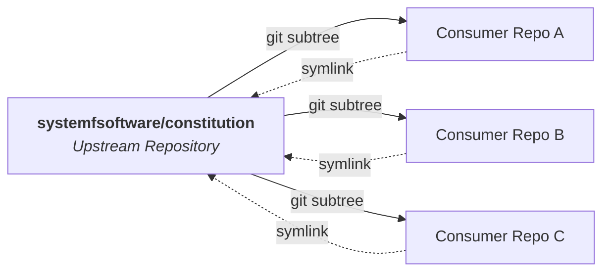

# Constitution

[](LICENSE)
[](https://systemfsoftware.com/constitution)
[](CONSTITUTION.md)

Shared engineering laws for repositories at [System F Software](https://systemfsoftware.com).

It defines baseline architecture and code quality standards: a pure functional core behind a thin imperative shell, domain types before logic, mutation testing for decision paths, and subtracting code before adding more. Stack-neutral and enforced across all projects.



---

## Quick Start

Vendor the repository using `git subtree` and symlink `CONSTITUTION.md` to the project root:

```bash
# 1. Fetch the remote into a local ref
git fetch https://github.com/systemfsoftware/constitution.git main:refs/remotes/vendor/constitution

# 2. Add as a squashed subtree
git subtree add --prefix=vendor/constitution refs/remotes/vendor/constitution --squash \
  -m "chore: vendor shared constitution"

# 3. Symlink the constitution to the repo root
ln -s vendor/constitution/CONSTITUTION.md CONSTITUTION.md
```

Include `@CONSTITUTION.md` in your agent harness (`AGENTS.md` or `CLAUDE.md`) so all 40 rules remain always-on in the context window.

---

## The Articles

The 40 rules are structured across six sections in [`CONSTITUTION.md`](CONSTITUTION.md):

| Section | Key Invariants |
| :--- | :--- |
| **Application** | Invoke rules by harm rather than clause; build failures decide; the evaluator is not the agent's to edit; evidence before done. |
| **Article I: Pure Core** | Pure decisions, explicit types, tagged error variants, no `null` states. |
| **Article II: Boundaries** | Functional core / imperative shell, values for effects, decode inputs rather than casting. |
| **Article III: Verification** | Testing Trophy investment order, properties by narrow grant, mutation as the measure, independent oracles. |
| **Article IV: Organization** | Organize by domain responsibility, clear naming, keep modules small. |
| **Article V: Conduct** | Zero-appeal P0 review enforcement, fix root causes, challenge decisions before committing, subtract before adding. |

---

## Machine Validation

Rules are defined as structured YAML blocks in `CONSTITUTION.md`:

```yaml
- id: CONST-S4
  title: Subtract Before You Add
  gate: review
  do: treat every line as a liability — removal is the default response to slop
  dont: extend a copy-paste cluster; patch around a rotten core
  harm: the codebase only grows; rot survives every patch and regrows
  check: review reads the net line delta; fixes that leave root violations are rejected
```

Run the validator to check rule IDs, schema compliance, and citation integrity across the corpus:

```bash
deno task test
```

To verify that rule identifiers have not been reassigned against a previous git revision:

```bash
deno task test --against <rev>
```

---

## Pulling Updates

Pull upstream changes into the subtree without touching existing symlinks:

```bash
git subtree pull --prefix=vendor/constitution https://github.com/systemfsoftware/constitution.git main --squash \
  -m "chore: update shared constitution"
```

---

## License

[Apache-2.0](LICENSE) © 2026 Ryan Lee.
