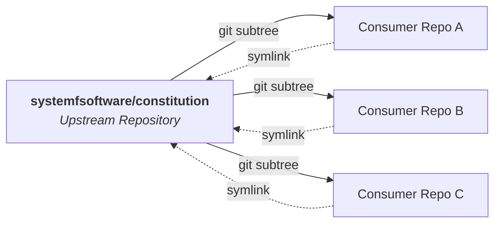

# Constitution

[](LICENSE)
[](https://systemfsoftware.com/constitution)
[](CONSTITUTION.md)

Shared engineering laws for repositories at [System F Software](https://systemfsoftware.com).

It defines baseline architecture and code quality standards: a pure functional core behind a thin imperative shell, domain types before logic, mutation testing for decision paths, and subtracting code before adding more. Stack-neutral and enforced across all projects.


```mermaid
flowchart LR
    S["<b>systemfsoftware/constitution</b><br><i>Upstream Repository</i>"] -->|git subtree| A[Consumer Repo A]
    S -->|git subtree| B[Consumer Repo B]
    S -->|git subtree| C[Consumer Repo C]
    A -.symlink.-> S
    B -.symlink.-> S
    C -.symlink.-> S
```

---

## Quick Start

Vendor the repository using `git subtree` and symlink `CONSTITUTION.md` to the project root:

```bash
# 1. Fetch the remote into a local ref
git fetch https://github.com/systemfsoftware/constitution.git main:refs/remotes/vendor/constitution

# 2. Add as a squashed subtree
git subtree add --prefix=vendor/constitution refs/remotes/vendor/constitution --squash \
  -m "chore: vendor shared constitution"

# 3. Symlink the constitution to the repo root
ln -s vendor/constitution/CONSTITUTION.md CONSTITUTION.md
```

Include `@CONSTITUTION.md` in your agent harness (`AGENTS.md` or `CLAUDE.md`) so all 16 laws remain always-on in the context window. Never include `ENFORCEMENT.md` there — it is doctrine for whoever builds the gates, not for the agent the gates grade. Instead, wire it at the surfaces that own instruments: in every `AGENTS.md` leaf governing a lint plugin, guard script, CI workflow, rules directory, or advisor roster, add one routing line — "You are editing an enforcement instrument. Read the vendored `ENFORCEMENT.md` before this lands."

---

## The Laws

The 16 laws sit in four sections of [`CONSTITUTION.md`](CONSTITUTION.md), ordered by when you need them. Each is one sentence, its harm, and a wrong/right example from a real incident.

| Section | Laws |
| :--- | :--- |
| **Model the domain** | Closed types, a tagged variant per failure, states as tagged unions. |
| **Shape the code** | Effects at the edges, dependencies inward, code organised and named by what it does, one responsibility per module, root causes, first principles, subtract before adding. |
| **Prove it** | Test the published surface, independent oracles, tests that can fail, obligations decided by what code is rather than its name. |
| **Finish** | Deliver the whole accepted task; show evidence, and never edit what grades your work. |

How each law is checked, its severity and waiver, and the incidents behind it live in the `## Corpus` block of [`ENFORCEMENT.md`](ENFORCEMENT.md), along with the reviewer's judging rules.

---

## Machine Validation

Laws are structured YAML in `CONSTITUTION.md`:

```yaml
- id: CONST-S4
  law: Treat every line as a liability; delete, unify, or make the bad state unconstructable before you add.
  why: The codebase only grows, and rot survives every patch.
  example:
    wrong: A suffix-keyed copy-paste rule fleet grew to 100 rules across 21 plugins; one plugin shipped five rules against zero files.
    right: The whole fleet was deleted in one change, thirteen plugin packages and about 31,000 lines.
```

Run the validator to check the law schema, the 1,800-word budget, one corpus entry per law with at least two incidents, unique handles, and citation integrity across both files:

```bash
deno task test
```

To verify that every id at a previous git revision is still accounted for — live, absorbed, a judging rule, or retired — and that no handle changed:

```bash
deno task test --against <rev>
```

---

## Pulling Updates

Pull upstream changes into the subtree without touching existing symlinks:

```bash
git subtree pull --prefix=vendor/constitution https://github.com/systemfsoftware/constitution.git main --squash \
  -m "chore: update shared constitution"
```

---

## License

[Apache-2.0](LICENSE) © 2026 Ryan Lee.
