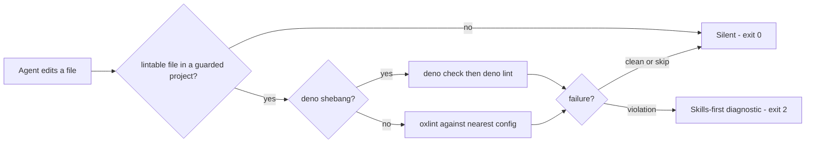

# oxlint-guard-hook

A Claude Code plugin that lints every file the agent edits — with the project's own oxlint config, or `deno check` + `deno lint` for Deno scripts — and, on failure, stops the fix loop until the agent has invoked skills for the root cause.

The checkpoint the agent sees on a violation:

```text
⛔ OXLINT FAILED — INVOKE SKILLS FIRST.

Before fixing anything below, invoke skills that address why these rules fire.
You decide which — the hook will not map rules to skills for you.
Already-invoked skills do NOT count. Each failure demands NEW invocations.

--- OXLINT output ---
...the linter's output, capped at 30 lines...

Find skills for the ROOT CAUSE above. Invoke them, THEN fix.
```

## Install

```bash
/plugin marketplace add systemfsoftware/systemfsoftware
/plugin install oxlint-guard-hook@systemfsoftware
```

The hook fires on the next edit to a lintable file. To see the checkpoint, edit a scratch file to contain `debugger;` and let the agent save it — the edit comes back with the diagnostic above instead of a silent pass.

## What it checks

| Edited file                            | Check                                                          |
| -------------------------------------- | -------------------------------------------------------------- |
| Starts with a Deno shebang             | `deno check` on the module graph, then `deno lint`             |
| Any other lintable extension           | `oxlint` with the nearest config found inside the project root |
| Not an edit tool, not lintable, absent | Nothing — the hook is silent                                   |

The guard lints the **whole file**, not the diff: a checkpoint fires for pre-existing debt in a touched file too. `deno check` validates the file's entire module graph, so its failure may point at an imported file. Both are deliberate — the question is "is this file clean?", never "did this edit introduce this?".

> [!NOTE]
> A project with no oxlint config in its root is simply not guarded: silence, never an error. See [Setup](#setup) for the config filenames oxlint auto-discovers.

## Behavior

| Outcome                                                                                                | Exit | What the agent sees                              |
| ------------------------------------------------------------------------------------------------------ | ---- | ------------------------------------------------ |
| Clean lint, or the file is out of scope                                                                | 0    | Nothing                                          |
| Payload over 1 MiB; linter over its 30-second budget; benign no-files output; panic on an ignored path | 0    | Nothing                                          |
| `oxlint-tsgolint` companion missing (type-aware pass)                                                  | 0    | One automatic retry without the type-aware flags |
| Lint violations                                                                                        | 2    | The skills-first diagnostic above, on stderr     |
| `deno` or `pnpm` missing, or the project's oxlint binary missing                                       | 1    | An install hint on stderr                        |

The hook follows the Claude Code hook contract: exit 0 allows, exit 2 feeds stderr back to the agent, exit 1 is a non-blocking error surfaced to the human. stdout stays byte-empty; every diagnostic goes to stderr.

## Setup

| Need                                                           | Why                                                                                                                                                          |
| -------------------------------------------------------------- | ------------------------------------------------------------------------------------------------------------------------------------------------------------ |
| [Deno](https://deno.com) 2.x on `PATH`                         | The hook itself runs on Deno                                                                                                                                 |
| `pnpm add -D oxlint` in the guarded project                    | The project lints with its own local oxlint                                                                                                                  |
| An oxlint config at or above the file, inside the project root | `.oxlintrc.json`, `.oxlintrc.jsonc`, `oxlint.config.ts`, `oxlint.config.mts`, `oxlint.config.js`, `oxlint.config.mjs`, `oxlint.config.cjs`, or `oxlint.json` |
| `oxlint-tsgolint` companion (optional)                         | Enables the `--type-aware --type-check` pass                                                                                                                 |

The hook resolves its dependencies from Deno's registry cache on the first invocation, so the first run needs network access; after that it runs offline.

## How it works



Config discovery walks up from the edited file but never escapes the project root (`CLAUDE_PROJECT_DIR`, else the enclosing git root) — a config planted in an ancestor directory can never silently govern the lint.

The hook runs on Deno with a scoped permission set — read, run, and env, never `--allow-net`. Spawned linters currently inherit the hook's environment; scoping that child environment to a minimal allowlist is planned work.

## Pairing with oxlint-guard

The same marketplace ships [oxlint-guard](https://github.com/systemfsoftware/systemfsoftware/tree/main/agent-plugins/oxlint-guard), a sibling guard with a different doctrine:

|                       | oxlint-guard-hook                                                   | oxlint-guard                                              |
| --------------------- | ------------------------------------------------------------------- | --------------------------------------------------------- |
| Missing oxlint config | **Silent skip** — the plugin simply does not apply                  | **Hard failure** — exit 2 with an install hint            |
| On violation          | Skills-first diagnostic; the agent must invoke skills before fixing | Technical violation report with a fix-the-root-cause note |
| Second hook           | None                                                                | A PreToolUse guard vetoes edits that disable oxlint rules |

Both register on the same edit-tool events; installing both runs both guards, and Claude Code applies the most restrictive outcome. Pick one doctrine — skill checkpoints for a project that already lints, or enforcement with config anti-rot.

## Contributing

PRs welcome through [systemfsoftware/systemfsoftware](https://github.com/systemfsoftware/systemfsoftware). Development setup and the architecture audit live under [`docs/`](https://github.com/systemfsoftware/systemfsoftware/tree/main/docs).

## Support

Issues: [systemfsoftware/systemfsoftware](https://github.com/systemfsoftware/systemfsoftware/issues).

## Troubleshooting

### Nothing happens when I edit a file

The hook is silent by design when the file is out of scope: not an edit tool, extension not lintable, file absent, or no oxlint config inside the project root. Check the [Setup](#setup) table.

### `deno not found on PATH`

Install Deno 2.x and restart the session.

### `pnpm with oxlint ... could not be run (not found)`

Run `pnpm add -D oxlint` in the project and retry the edit.

### The first edit is slow or hangs

The first hook invocation resolves its imports from Deno's registry cache; it needs network access just that once.

## License

[Apache-2.0](https://github.com/systemfsoftware/systemfsoftware/blob/main/LICENSE).
