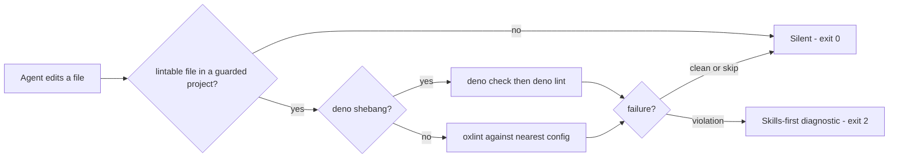

# oxlint-guard-hook

Apache-2.0-licensed Claude Code plugin. A PostToolUse hook that lints every agent edit with the project's own oxlint config — or `deno check` + `deno lint` for Deno-shebang files — and turns failures into a checkpoint that demands new skill invocations before fixing starts.

## What It Does

After every edit to a lintable file, the guard lints that file and reports failures to the agent. A violation produces exit 2 with a stderr diagnostic; the hook does not map rules to skills for you. Already-invoked skills do not count; each failure demands new invocations.

```text
⛔ OXLINT FAILED — INVOKE SKILLS FIRST.

Before fixing anything below, invoke skills that address why these rules fire.
You decide which — the hook will not map rules to skills for you.
Already-invoked skills do NOT count. Each failure demands NEW invocations.

--- OXLINT output ---
...the linter's output, capped at 30 lines...

Find skills for the ROOT CAUSE above. Invoke them, THEN fix.
```

## Why

A linter dump tells the agent what is broken, not how to fix it. The cheapest move in front of an agent holding a violation is a local patch that silences today's symptom. The fix loop needs to start from the project's own knowledge — its skills, its conventions — not from a guess. The guard makes that start non-optional: the diagnostic is the checkpoint.

## Quick Start

```bash
/plugin marketplace add systemfsoftware/systemfsoftware
/plugin install oxlint-guard-hook@systemfsoftware
```

The hook fires automatically on the next edit to a lintable file. Try it: edit a scratch file to contain a `debugger;` statement. The edit comes back with the `INVOKE SKILLS FIRST` diagnostic. If it does not, check the prerequisites below.

## How It Works



Config discovery walks up from the edited file but never escapes the project root (`CLAUDE_PROJECT_DIR`, else the enclosing git root) — a config planted in an ancestor directory can never silently govern the lint.

## Behavior Contract

| Guard outcome                                                                                                                                                                             | Exit                                                             |
| ----------------------------------------------------------------------------------------------------------------------------------------------------------------------------------------- | ---------------------------------------------------------------- |
| Clean lint                                                                                                                                                                                | 0 — silent                                                       |
| Not an edit tool; extension not lintable; file absent; no in-root oxlint config; payload over 1 MiB; linter over its 30-second budget; `No files found to lint`; panic on an ignored path | 0 — silent                                                       |
| `oxlint-tsgolint` companion missing                                                                                                                                                       | 0 — retries once without the type-aware flags                    |
| Lint violations                                                                                                                                                                           | 2 — skills-first diagnostic on stderr, output capped at 30 lines |
| `deno`/`pnpm` missing from `PATH`; `pnpm exec` reports the local oxlint binary missing                                                                                                    | 1 — install hint on stderr                                       |

The guard lints the **whole file**, not the diff: a checkpoint fires for pre-existing debt in a touched file too. `deno check` validates the file's entire module graph, so its failure may point at an imported file. Both are deliberate — the guard's question is "is this file clean?", never "did this edit introduce this?".

## Prerequisites

- **Deno 2.x** on `PATH` — the hook runs on Deno.
- **`pnpm`** with oxlint installed locally: `pnpm add -D oxlint`.
- **An oxlint config within the project root** — `.oxlintrc.json`, `.oxlintrc.jsonc`, `oxlint.config.ts`, or `oxlint.config.mts` (the names oxlint itself auto-discovers), with `oxlint.config.js`/`.mjs`/`.cjs` and `oxlint.json` also accepted. A project without one is simply not guarded — silence, never an error.
- **Type-aware pass**: oxlint runs with `--type-aware --type-check`, which requires the `oxlint-tsgolint` companion. When the companion is absent, the guard retries once without the type-aware flags instead of failing the edit.

The hook resolves its dependencies from Deno's registry cache on first run, so the first hook invocation needs network access; after that the hook runs offline.

## Hermetic by Construction

The hook runs on Deno with a scoped permission set — read, run, and env — and **never** `--allow-net`. Spawned linters do not inherit the agent's environment: they receive a minimal allowlist (`PATH`, `HOME`, and the platform's temp/shell variables). A linter in the project's `node_modules` is the project's code, and it does not need the agent's credentials to lint a file.

## Other Hook Runners

The hook follows the standard Claude Code hook contract: **exit 0 allows, exit 2 feeds stderr back to the agent (PostToolUse), exit 1 is a non-blocking error surfaced to the human, stdout stays machine-clean, and every diagnostic goes to stderr**. Any runner that dispatches hooks by that contract drives it without modification.

## Relationship to oxlint-guard

This marketplace also ships [oxlint-guard](../../agent-plugins/oxlint-guard), a sibling lint guard with a different doctrine:

|                       | oxlint-guard-hook                                                   | oxlint-guard                                              |
| --------------------- | ------------------------------------------------------------------- | --------------------------------------------------------- |
| Missing oxlint config | **Silent skip** — the plugin simply does not apply                  | **Hard failure** — exit 2 with an install hint            |
| On violation          | Skills-first diagnostic; the agent must invoke skills before fixing | Technical violation report with a fix-the-root-cause note |
| Second hook           | None                                                                | A PreToolUse guard vetoes edits that disable oxlint rules |

Both hooks register on the same edit-tool events. Installing both runs both guards; Claude Code merges hook results and the most restrictive outcome wins. Pick one doctrine — skill checkpoints for a project that already lints, or enforcement with config anti-rot.

## Troubleshooting

- **Nothing happens when I edit a file.** The hook is silent by design when it does not apply: not an edit tool, extension not lintable, file missing, or no oxlint config inside the project root. Check `prerequisites`.
- **`deno not found on PATH`.** Install Deno 2.x and restart the session.
- **`pnpm with oxlint ... could not be run (not found)`.** Run `pnpm add -D oxlint` in the project and retry.
- **First run is slow or hangs.** The first hook invocation resolves `deno.jsonc` imports from the registry cache; it needs network just that once.

## Contributing

Development setup and workflow: [AGENTS.md](../../AGENTS.md). Formatting is owned by the repository's dprint config.

## License

[Apache-2.0](LICENSE). Issues: [systemfsoftware/systemfsoftware](https://github.com/systemfsoftware/systemfsoftware/issues).
