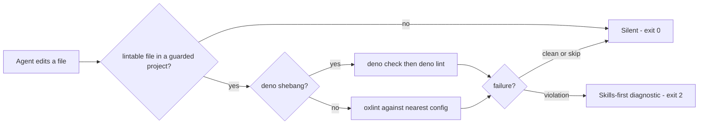

# oxlint-guard-hook

[](LICENSE)

> Lints every agent edit with the project's own oxlint config — and every failure becomes a checkpoint that demands new skill invocations before fixing starts.

Install inside Claude Code:

```bash
/plugin marketplace add systemfsoftware/systemfsoftware
/plugin install oxlint-guard-hook@systemfsoftware
```

oxlint-guard-hook sits in the agent's edit loop. After every edit to a lintable file, the file is linted against the project's own nearest oxlint config (or `deno check` + `deno lint` for files carrying a `deno` shebang). When anything fails, the agent does not just see linter output — it sees an order: invoke skills that address why these rules fire, before fixing anything. Already-invoked skills do not count; each failure demands new ones.

## The Problem

A linter dump tells the agent what is broken. It does not tell the agent how to fix it, and the cheapest move in front of an agent holding a violation is a local patch that silences today's symptom. The fix loop needs to start from the project's own knowledge — its skills, its conventions — not from a guess.

oxlint-guard-hook makes that start non-optional. The diagnostic is the checkpoint.

## Relationship to oxlint-guard

This marketplace also ships [oxlint-guard](https://github.com/systemfsoftware/systemfsoftware/tree/main/agent-plugins/oxlint-guard), a sibling lint guard with a different doctrine:

|                       | oxlint-guard-hook                                                   | oxlint-guard                                              |
| --------------------- | ------------------------------------------------------------------- | --------------------------------------------------------- |
| Missing oxlint config | **Silent skip** — the plugin simply does not apply to that project  | **Hard failure** — exit 2 with an install hint            |
| On violation          | Skills-first diagnostic; the agent must invoke skills before fixing | Technical violation report with a fix-the-root-cause note |
| Second hook           | None                                                                | A PreToolUse guard vetoes edits that disable oxlint rules |

Both hooks register on the same edit-tool events. If you install both, every edit runs both guards; Claude Code merges hook results and the most restrictive outcome wins. Pick one doctrine: install **oxlint-guard-hook** to make lint failures skill checkpoints in a project that already has linting, or **oxlint-guard** for enforcement with config anti-rot. Co-installation is supported but rarely what you want.

## Prerequisites

- **Deno 2.x** on `PATH` — the hook runs on Deno.
- **`pnpm`** — oxlint is invoked through `pnpm exec`, so a pnpm project with `oxlint` installed locally:

  ```bash
  pnpm add -D oxlint
  ```
- **An oxlint config within the project root** — `.oxlintrc.json`, `.oxlintrc.jsonc`, `oxlint.config.ts`, or `oxlint.config.mts` (the names oxlint itself auto-discovers), with `oxlint.config.js`/`.mjs`/`.cjs` and `oxlint.json` also accepted for older installs. A project without one is simply not guarded — silence, never an error.
- **Type-aware pass**: oxlint runs with `--type-aware --type-check`, which requires oxlint's tsgolint companion (`oxlint-tsgolint`). When the companion is absent, the guard retries once without the type-aware flags instead of failing the edit.

The hook resolves its dependencies from Deno's registry cache on first run, so the first hook invocation needs network access; after that the hook runs offline.

## How It Works



### The diagnostic

On a lint failure the hook exits 2 and writes this to stderr — the exact text the agent sees:

```text
⛔ OXLINT FAILED — INVOKE SKILLS FIRST.

Before fixing anything below, invoke skills that address why these rules fire.
You decide which — the hook will not map rules to skills for you.
Already-invoked skills do NOT count. Each failure demands NEW invocations.

--- OXLINT output ---
...the linter's output, capped at 30 lines...

Find skills for the ROOT CAUSE above. Invoke them, THEN fix.
```

The `DENO CHECK` and `DENO LINT` variants use the same body with their own header. Linter output past 30 lines is cut with a marker, so a file with thousands of diagnostics cannot flood the session.

### The lint guard (PostToolUse)

After each edit to a lintable file (`.ts`, `.tsx`, `.js`, `.jsx`, `.mts`, `.cts`, `.mjs`, `.cjs`, `.vue`, `.svelte`, `.astro`), the guard lints that file. Deno-shebang files route to `deno check`/`deno lint` from the file's own directory — oxlint's type-aware pass cannot resolve the `Deno` global.

| The guard ...                                                         | Exit                                          |
| --------------------------------------------------------------------- | --------------------------------------------- |
| Lints clean                                                           | 0 — silent                                    |
| Skips: tool is not an edit tool, extension not lintable, file absent  | 0 — silent                                    |
| Skips: no oxlint config within the project root                       | 0 — silent (opt-in doctrine)                  |
| Skips: payload exceeds 1 MiB                                          | 0 — silent                                    |
| Skips: a linter run exceeds its 30-second budget                      | 0 — silent (a hung run is not a violation)    |
| Skips: oxlint reports `No files found to lint`                        | 0 — silent                                    |
| Skips: oxlint panics on a path ignored by `ignorePatterns`            | 0 — silent                                    |
| `oxlint-tsgolint` is missing — the type-aware pass cannot start       | 0 — retries once without the type-aware flags |
| `pnpm exec` reports the local `oxlint` binary missing                 | 1 — install hint on stderr                    |
| Reports a lint violation                                              | 2 — skills-first diagnostic on stderr         |
| Cannot spawn `pnpm`/`oxlint`, or `deno` is missing for a shebang file | 1 — install hint on stderr                    |

Config discovery walks up from the edited file but never escapes the project root (`CLAUDE_PROJECT_DIR`, else the enclosing git root) — a config planted in an ancestor directory can never silently govern the lint.

### What a failure means

The guard lints the **whole file**, not the diff: a checkpoint fires for pre-existing debt in a touched file too. `deno check` validates the edited file's entire module graph, so its failure may point at an imported file rather than the edit. Both are deliberate — the guard's question is "is this file clean?", never "did this edit introduce this?".

### Try it

After installing, edit any scratch file in your project to contain a `debugger;` statement (with `oxlint` configured). The edit comes back with the `INVOKE SKILLS FIRST` diagnostic. If it does not, the plugin is not firing — check the prerequisites above.

## Hermetic by Construction

The hook runs on Deno with a scoped permission set — read, run, and env — and **never** `--allow-net`. Spawned linters do not inherit the agent's environment: they receive a minimal allowlist (`PATH`, `HOME`, and the platform's temp/shell variables). A linter in the project's `node_modules` is the project's code, and it does not need the agent's credentials to lint a file.

## Other Hook Runners

The hook follows the standard Claude Code hook contract: **exit 0 allows, exit 2 feeds stderr back to the agent (PostToolUse), exit 1 is a non-blocking error surfaced to the human, stdout stays machine-clean, and every diagnostic goes to stderr**. Any runner that dispatches hooks by that contract — including an OMP-style hook bridge — drives it without modification.

## Development

From the plugin directory:

```bash
deno task check    # type-check + lint
```

Formatting is owned by the repository's dprint config (`pnpm exec dprint fmt` from the repo root).

## License

[MIT](LICENSE). Issues: [systemfsoftware/systemfsoftware](https://github.com/systemfsoftware/systemfsoftware/issues).
