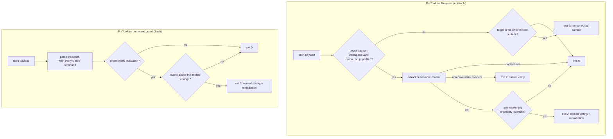

# pnpm-guard

[](LICENSE)

> Blocks agent edits and commands that weaken pnpm's supply-chain posture — the release-age quarantine, build-script grants, registries, and auth lines — rather than which package manager you use.

Not to be confused with [`udonc/pm-guard`](https://github.com/udonc/pm-guard), which blocks the _wrong_ package manager. pnpm-guard assumes you are on pnpm and defends pnpm's own install-time protections.

Install inside Claude Code:

```bash
/plugin marketplace add systemfsoftware/systemfsoftware
/plugin install pnpm-guard@systemfsoftware
```

## The Problem

pnpm 11 ships real install-time supply-chain protection: a release-age quarantine (`minimumReleaseAge`), build-script approval, exotic-subdependency blocking, and a publisher trust policy. Every one of those switches is a line in `pnpm-workspace.yaml` or `.npmrc`, or a CLI/environment override — and the agent mid-task is exactly the actor most tempted to flip one. `minimumReleaseAge: 0` unblocks a too-fresh dependency; an `allowBuilds` grant unblocks a build; an exclusion entry unblocks an install.

It is the same cheap-fix dynamic [oxlint-guard](https://github.com/systemfsoftware/systemfsoftware/tree/main/agent-plugins/oxlint-guard) closes for lint: the failing gate gets edited instead of the code. CI-time policy is policy the agent has already moved past. The edit and the command are the moments to intervene.

pnpm-guard closes both — at the edit and at the command, not at the pipeline.

## Install

The two commands above are the whole install: `/plugin marketplace add` registers this repository as a plugin marketplace, and `/plugin install` takes pnpm-guard from it. Both run inside Claude Code.

If Claude Code reports that the marketplace is not found, run the `add` command and retry the install. See [Discover and install prebuilt plugins through marketplaces](https://code.claude.com/docs/en/discover-plugins) for the full marketplace flow.

To install from a local checkout instead: `/plugin install /path/to/agent-plugins/pnpm-guard`.

## Prerequisites

- **Deno 2.x** on `PATH` — the hooks run on Deno.
- **pnpm 10.26+** to use the `allowBuilds`-era settings; the matrix baselines the **pnpm 11 defaults** (verified against pnpm 11.21).

The hooks' dependencies (`@std/yaml`, `just-bash`) resolve from Deno's registry cache on first run, so the first hook invocation needs network access to warm the cache; after that the guard makes no network call, and the decision needs none.

## How It Works



The file guard governs `pnpm-workspace.yaml`, `.npmrc`, and `.pnpmfile.mjs`/`.pnpmfile.cjs` at any depth, matching each name case-insensitively — a case-varied name reaches the same file on a case-insensitive filesystem. It rebuilds the whole before/after document pair from the edit payload — for patch-shaped tools (`Edit`, `Update`, `MultiEdit`, and the morph tools) by applying each hunk to the file on disk, so the guard reads whole documents rather than fragments, and applying every occurrence when the edit carries `replace_all` — then compares the two sides' _effective_ values, where a value is the explicit setting if present and the pnpm 11 default otherwise. Only a change in posture blocks; an absent key and a key at its default compare equal.

The command guard parses the Bash payload and walks every simple command inside pipelines, `&&`/`||` chains, command substitution, and `for … in` word lists, matching the pnpm family (`pnpm`, `pn`, `pnx`, `pnpx`, and `corepack pnpm`).

## Blocked Settings

Each guarded setting's effective value is compared against the pnpm 11 baseline; a change that leaves it equal-or-stronger is allowed, and any weakening blocks. Keys not listed are open-world (allowed) — the matrix is data, and new pnpm security settings land as rows in updates.

| Guarded setting (effective)                           | pnpm 11 default                                                           | Blocks when                                                                | Allows when                                 |
| ----------------------------------------------------- | ------------------------------------------------------------------------- | -------------------------------------------------------------------------- | ------------------------------------------- |
| `minimumReleaseAge`                                   | 1440                                                                      | decreased, or an explicit value removed                                    | raised (≥ the old effective)                |
| `minimumReleaseAgeStrict`                             | true iff the age is explicit                                              | effective `true` → `false`                                                 | → `true`, including absent → `true`         |
| `minimumReleaseAgeExclude`                            | none                                                                      | **any** entry added                                                        | entries removed                             |
| `minimumReleaseAgeIgnoreMissingTime`                  | true                                                                      | effective `false` → `true`                                                 | → `false`                                   |
| `blockExoticSubdeps`                                  | true                                                                      | → `false`                                                                  | → `true`                                    |
| `strictDepBuilds`                                     | true                                                                      | → `false`                                                                  | → `true`                                    |
| `verifyStoreIntegrity`                                | true                                                                      | → `false`                                                                  | → `true`                                    |
| `trustPolicy`                                         | off                                                                       | `no-downgrade` → `off`/absent                                              | `off` → `no-downgrade`                      |
| `trustPolicyExclude`                                  | none                                                                      | **any** entry added                                                        | entries removed                             |
| `trustPolicyIgnoreAfter`                              | unset                                                                     | introduced                                                                 | removed                                     |
| `trustLockfile`                                       | false (`true` **skips** the lockfile verification pass — the weaker pole) | → `true`                                                                   | → `false`                                   |
| `allowBuilds` per package                             | unreviewed                                                                | → `true` (absent → `true`, and `false` → `true`)                           | → `false`; `false` → absent                 |
| `dangerouslyAllowAllBuilds`                           | false                                                                     | → `true`                                                                   | → `false`                                   |
| `packageExtensions` (workspace)                       | absent                                                                    | introduced or any entry changed                                            | entries removed                             |
| `patchedDependencies` (workspace)                     | absent                                                                    | introduced or changed                                                      | removed                                     |
| `registries` / `strictSsl` (workspace)                | npmjs / true                                                              | non-npmjs default; an existing scope entry modified; `strictSsl` → `false` | new scope entry added; `strictSsl` → `true` |
| `.npmrc` `registry=`                                  | npmjs                                                                     | set to non-npmjs                                                           | —                                           |
| `.npmrc` `@scope:registry`                            | —                                                                         | an existing scope-registry line modified                                   | a **new** scope-registry line added         |
| `.npmrc` `strict-ssl`                                 | true                                                                      | → `false`                                                                  | → `true`                                    |
| `.npmrc` `_auth`, `//host/:_authToken`, `always-auth` | absent / false                                                            | introduced or modified, any value, any host                                | removed / → `false`                         |
| `.pnpmfile.mjs` / `.pnpmfile.cjs`                     | absent                                                                    | **any** content-bearing edit (fail-closed)                                 | —                                           |

Two notes the table cannot carry:

- **There is no allowlist.** An exclusion entry or a build grant is satisfiable by writing a declaration, so the actor that trips the guard would be the actor that mints the exemption. Additions are blocked outright; a human mints the exemption by hand in the project file.
- **Wiping a deny ledger is allowed but not silent.** An `allowBuilds` entry going `false` → absent passes the row (unreviewed is the default), which loses the review trail — but the next install of those packages fails loudly as unreviewed (`ERR_PNPM_IGNORED_BUILDS`), so the failure is visible even though the ledger is gone.

## Commands, Flags, and Environment

The command guard vetoes the same weakening out-of-band, reaching each invocation through the parsed script AST:

- `pnpm config set` / `pnpm config delete` on a guarded key, in a weakening direction — including a write retargeted out of the project via `--location global` or `-C <dir>`, because the agent does not write global pnpm config.
- `--config.<key>=<value>` flags that weaken a guarded key. A `--config.<key>` with no literal value beside it — a flag where a value would be, or a substitution — is refused as unverifiable rather than guessed.
- `--<key>=<value>` forms for any guarded key, in a weakening direction, and `--no-<key>`.
- `--dangerously-allow-all-builds`.
- `pnpm_config_*` / `PNPM_CONFIG_*` environment assignments, in the prefix form (`pnpm_config_minimumReleaseAge=0 pnpm install`), the `export` form, and as arguments handed to a wrapper program (`env`, `command`, `nice`, `nohup`, `setsid`, `stdbuf`, `time`, `xargs`).
- An `allowBuilds` grant in any of its shapes — the map form (`allowBuilds: { esbuild: true }`), the list form, and the scalar form (`allowBuilds: esbuild`), whether the agent writes it to the file or reaches it through `pnpm config set allowBuilds esbuild`.
- Build grants: `pnpm approve-builds`, and `pnpm add --allow-build=` — every name in a comma list, every repeat of the flag, and `*`/glob values, which grant builds wholesale.
- `pnpm audit --fix`, which rewrites the pnpm config through pnpm and auto-mints release-age exclusions for the advisories it fixes. Only a human runs it, when a CVE demands the exception.

Keys match across camelCase, kebab-case, and the UPPER_SNAKE environment spelling, so a decision never depends on which an actor chose.

## Exit Contract

The hooks follow the standard Claude Code hook contract: **exit 0 allows silently, exit 2 blocks, stdout stays empty, and every diagnostic goes to stderr.** The matrix ships public in this README and the plugin source, so a block message naming the setting leaks nothing an agent could not read anyway.

| The guard ...                                                                             | Exit                                                                                                                                                                 |
| ----------------------------------------------------------------------------------------- | -------------------------------------------------------------------------------------------------------------------------------------------------------------------- |
| Allows the edit or command                                                                | 0 — silent, stdout empty                                                                                                                                             |
| Skips: unrelated tool, unrelated target, malformed or non-hook payload                    | 0 — silent                                                                                                                                                           |
| Skips: provably contentless edit (nothing added or removed)                               | 0 — silent                                                                                                                                                           |
| Blocks: a guarded setting weakens, or an exclusion/grant/auth line is added               | 2 — stderr names the setting, the before/after values, and the remediation                                                                                           |
| Blocks: cannot verify (unrecoverable payload shape, oversize input, unparseable YAML/INI) | 2 — stderr names the reason and says to re-express the change as `Edit`, `Write`, or `MultiEdit`; the command guard's form asks for a literal setting name and value |
| Blocks: an edit to the enforcement surface                                                | 2 — stderr says the file is human-edited                                                                                                                             |
| Blocks: a command retargeted outside the project, or a build grant with no literal target | 2 — stderr says to ask a human                                                                                                                                       |

The fail-closed rows are deliberate. A guard that skips what it cannot read is a guard that can be walked around, and the skip is indistinguishable from a pass — so on a guarded target, unrecoverable content is treated as a potential weakening, not as a pass.

A missing runtime is a different code: the hook's command carries a `command -v deno` prelude that exits **1**, which Claude Code treats as a non-blocking error — the edit proceeds and the message surfaces to _you_ rather than to the agent. That is the intended degradation: a guard that cannot start should be loud to the human without wedging the session.

## Self-Defense

A guard wired from the repository's own tree is editable by the very agent it guards. The file guard therefore vetoes agent edits to its enforcement surface, with a message stating these files are human-edited:

- `agent-plugins/*/src/**` and `agent-plugins/*/hooks/**` — the guard code;
- `agent-plugins/*/plugin.json`, `deno.json`, `deno.jsonc`, `deno.lock` — the manifests, import maps, and lockfiles that pin the parsers the guard trusts (Deno reads either config name);
- `.claude/hooks/**`, `.claude/settings.json`, `.claude/deno.json`, `.claude/deno.jsonc`, `.claude/deno.lock` — the in-repo hook wiring;
- `.claude-plugin/marketplace.json`.

An import map or lockfile is enforcement surface because it selects and pins the parser behind every verdict: an actor who can swap `@std/yaml` for a hostile module with the same export shape programs the guard's decisions.

## Boundaries

Out of scope by design, not omission:

- **Obfuscated execution.** `echo … | sh`, base64 blobs, and anything else beyond the parsed AST. The guard reasons over the script it can parse; command obfuscation beyond that is a documented gap, in the same class as [git-subtrees](https://github.com/systemfsoftware/systemfsoftware/tree/main/agent-plugins/git-subtrees)' limits. A pnpm invocation embedded in a quoted string (`bash -c "pnpm config set …"`) is the same class: the guard reads assignments and wrapper arguments, not program text inside a word.
- **Generic file deletion.** `rm pnpm-workspace.yaml` via Bash is not a guarded vector — git history and CI's frozen-lockfile remain the backstop.
- **Write-capable MCP tools outside the edit-tool matcher.** The matcher is a closed tool-name set; a file-writing tool that is not in it edits a guarded file without the guard firing. The same gap oxlint-guard carries.
- **The TOCTOU window** between the guard's on-disk read and the agent's write. A concurrent-writer race is out of scope for a per-tool-call hook; closing it needs file locking that would break the guard's hermeticity.
- **The global-config blind spot.** The matrix reads project files only. It baselines against pnpm 11 defaults, not the machine's merged `~/.config/pnpm/config.yaml`, so a stronger-than-default global baseline eroded to "default" does not block — keep the hardening in the project file the guard reads.
- **`overrides` range changes.** A range-widening executes nothing on its own; pnpm re-gates any newly resolved version at install time via `minimumReleaseAge`, `trustPolicy`, and lockfile integrity.
- **Settings introduced after pnpm 11.21.** They land as matrix rows in updates; until then they are open-world.

## Hermetic by Construction

The file guard runs with `--allow-read` only. The command guard also runs with `--allow-read`, and reads only the two posture files (`pnpm-workspace.yaml`, `.npmrc`) so it can judge each change against the project's _current_ posture. Neither guard ever runs with `--allow-net`, `--allow-run`, `--allow-env`, or `--allow-write`: the decision reads files and stdin and writes nothing.

## Layout

Two hooks over one decision core. The registration is the contract as the client sees it, and each entry is named after the hook it runs:

| Path                              | What it is                                                                                                          |
| --------------------------------- | ------------------------------------------------------------------------------------------------------------------- |
| `hooks/hooks.json`                | the registration: two `PreToolUse` entries, one per guard                                                           |
| `src/file-guard.ts`               | the file guard's entrypoint — stdin payload in, exit code out; the exported run surface is the same module          |
| `src/command-guard.ts`            | the command guard's entrypoint, same contract                                                                       |
| `src/policy.ts`                   | the decision core both guards call: the matrix above, pure, no I/O                                                  |
| `src/payload.ts`                  | the shared stdin and payload-decode surface                                                                         |
| `src/policy.property.test.ts`     | the core's invariants, proved over generated transitions against an independent model of the matrix                 |
| `tests/policy-scenarios.test.ts`  | the named scenarios generated laws cannot express: rendered violations, the single-change form, fail-closed parsing |
| `tests/guard.integration.test.ts` | both guards composed end to end against a real project tree on disk                                                 |
| `scripts/smoke.ts`                | the process seam: the shipped commands, real payloads, the streams a client sees                                    |

## Development

```bash
deno task check    # type-check + lint, src, tests, scripts
deno task test     # the decision and composition suites
deno task smoke    # the process seam, against a real tree
```

The suites split by what they can observe. The decision core is proved over generated input in `src/policy.property.test.ts` and pinned by name in `tests/policy-scenarios.test.ts`; the guards themselves carry no unit tests — their branches are reached through the composed journeys in `tests/guard.integration.test.ts`, where the flag, edit-shape, key, path, and payload matrices are scenario rows.

The client is the harness: it decides which payload reaches these hooks and what it does with exit 2. `scripts/smoke.ts` reproduces that seam for a human or CI run, and nothing in this repository can stand up the real one.

Formatting is owned by the repository's dprint config (`pnpm exec dprint fmt` from the repo root).

## License

[MIT](LICENSE). Issues: [systemfsoftware/systemfsoftware](https://github.com/systemfsoftware/systemfsoftware/issues).
