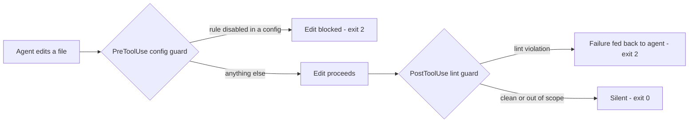

# oxlint-guard

[](https://github.com/systemfsoftware/systemfsoftware/blob/main/LICENSE)

> Lints every agent edit with oxlint, and blocks edits that disable an oxlint rule.

Install inside Claude Code:

```bash
/plugin marketplace add systemfsoftware/systemfsoftware
/plugin install oxlint-guard@systemfsoftware
```

oxlint-guard turns linting into part of the agent's edit loop. After every edit to a JS/TS file, the file is linted
against the project's own nearest oxlint config and any failures are reported straight back to the agent. Before an edit
to the oxlint config itself, a second guard vetoes changes that would disable a rule.

## The Problem

Lint that runs in CI is lint the agent has already moved past. The agent edits a file, the change looks fine, and the
violation is discovered minutes later by a pipeline the agent is no longer looking at — the fix is a context switch at
best, a forgotten ticket at worst.

There is a second, quieter hole: when the agent does see a failing rule, the cheapest way to make CI green is to edit
the config instead of the code. `"rule": "off"` is a one-line change; fixing the code is not. A project whose lint
config can be edited unsupervised is a project whose lint silently rots.

oxlint-guard closes both holes where they happen — at the edit, not at the pipeline.

## Install

The two commands in the first screen are the whole install: `/plugin marketplace add` registers this repository as a
plugin marketplace, and `/plugin install` takes oxlint-guard from it. Both run inside Claude Code.

If Claude Code reports that the marketplace is not found, run the `add` command and retry the install. See
[Discover and install prebuilt plugins through marketplaces](https://code.claude.com/docs/en/discover-plugins) for the
full marketplace flow.

Add the marketplace from the repository (as above) rather than from a local checkout of it. Claude Code installs a
plugin by copying its directory and following symlinks, so pointing a marketplace at a checkout that has `node_modules`
installed copies the whole dependency tree.

## Prerequisites

- **Deno 2.x** on `PATH` — the hooks are TypeScript source, run directly by Deno. There is no build step and no bundle.
- **`oxlint` installed as a local dev dependency of the project being edited**:

  ```bash
  pnpm add -D oxlint    # or: npm install -D oxlint / yarn add -D oxlint / bun add -d oxlint
  ```

  The lint guard resolves `node_modules/.bin/oxlint` by walking up from the edited file, and stops at the project root
  (`CLAUDE_PROJECT_DIR`, else the enclosing git root). It never falls back to `PATH`, `npx`, `bunx`, or a network fetch,
  and never reaches past the project into a parent directory — if the binary is not a local dev dependency of the
  project, there is nothing to fall back to. When it finds nothing, the failure message names the install command for
  your project's package manager, detected from the lockfile.

- **An oxlint config somewhere above the edited file** — `oxlint.config.ts`, `oxlint.config.js`, `oxlint.config.mjs`,
  `oxlint.config.cjs`, `.oxlintrc.json`, or `oxlint.json`. JSON configs may contain comments and trailing commas.

A missing config or a missing local binary is a **hard failure**: the hook exits 2 with an explanatory message on
stderr. This is deliberate — a guard that silently passes is worse than no guard, because it looks like enforcement
while enforcing nothing.

## How It Works



### Lint guard (PostToolUse)

After each edit to a JS/TS file (`.ts`, `.tsx`, `.js`, `.jsx`, `.mts`, `.cts`, `.mjs`, `.cjs`), the guard lints that
file against the nearest oxlint config above it and reports violations to the agent. A file whose first line is a `deno`
shebang is checked with `deno check`/`deno lint` instead of oxlint — oxlint's type-aware pass cannot resolve the `Deno`
global, so those files are routed to a runtime that can.

| The lint guard ...                                            | Exit                        |
| ------------------------------------------------------------- | --------------------------- |
| Lints clean                                                   | 0 — silent                  |
| Skips: tool is not an edit tool                               | 0 — silent                  |
| Skips: extension is not lintable                              | 0 — silent                  |
| Skips: edited file does not exist on disk                     | 0 — silent                  |
| Skips: no `file_path` in the payload                          | 0 — silent                  |
| Skips: stdin is not JSON / not a hook payload                 | 0 — silent                  |
| Skips: payload exceeds the 1 MiB input cap                    | 0 — silent                  |
| Skips: oxlint reports the file as ignored by `ignorePatterns` | 0 — silent                  |
| Reports a lint violation                                      | 2 — linter output on stderr |
| Type-aware backend unavailable: re-lints without it           | 0 if clean, 2 if not        |
| A linter run exceeds 30s: re-lints without type-awareness     | 0 if it then clears         |
| Hard failure: no oxlint config above the file                 | 2 — stderr explains         |
| Hard failure: no local `node_modules/.bin/oxlint`             | 2 — stderr explains         |
| Hard failure: that binary is present but not executable       | 2 — stderr explains         |
| Hard failure: `deno` shebang file and no `deno` on `PATH`     | 2 — stderr explains         |

Linter output is capped at 64 KiB before it reaches the agent, with the cut marked. A file that produces thousands of
diagnostics reports the first 64 KiB of them rather than flooding the session's context.

A timeout is never reported as a lint violation: a run that cannot finish is not evidence that the code is bad.

### Config guard (PreToolUse)

Before each edit to a file whose name is a standard oxlint config, the guard reconstructs the file's before and after
content and vetoes the edit if it disables a rule that was not already disabled. For patch-shaped tools (`Edit`,
`MultiEdit`, `Update`, and the morph tools) the after content is rebuilt by applying each hunk to the file on disk in
order, so the guard reads whole documents rather than fragments.

oxlint disables a rule through the severity `"off"`, the severity `"allow"`, or the numeric `0` — bare, or as the first
element of an array carrying the rule's options. All of these are treated as disabling, in the top-level `rules` map and
in every `overrides[].rules` map.

| The config guard ...                                                                                    | Exit                      |
| ------------------------------------------------------------------------------------------------------- | ------------------------- |
| Allows the edit                                                                                         | 0 — silent                |
| Skips: target is not a config file                                                                      | 0 — silent                |
| Skips: provably contentless payload (patch-mode edit with no added or removed lines — nothing to check) | 0 — silent                |
| Blocks: a rule is disabled (`"off"`, `"allow"`, or `0`) in the new content                              | 2 — stderr names the rule |
| Blocks: a hunk does not match the file on disk, so the result cannot be predicted                       | 2 — stderr explains       |
| Blocks: unverifiable edit shape on a config file                                                        | 2 — stderr explains       |
| Blocks: payload exceeds the 1 MiB input cap                                                             | 2 — stderr explains       |

The last rows are the fail-closed branch: a payload whose resulting content cannot be recovered is treated as a
potential config weakening, not as a pass. A guard that skips what it cannot read is a guard that can be walked around.
The two guards differ here on purpose — this one runs before the edit and can still veto it, so it blocks; the lint
guard runs after the write has already landed, where a block would only report something the agent cannot act on.

## Boundaries

The config guard vetoes the strongest silencing vector only: disabling a rule in the config. The following are **out of
scope** by design, not bugs:

- **Severity downgrades** — `"error"` → `"warn"`, or `2` → `1`. The guard does not police severity, only disabling.
- **`ignorePatterns`** — ignoring files is a visible config decision; the guard does not veto it.
- **Inline `oxlint-disable` comments** — silencing a rule at the point of use stays visible in the diff; the config
  guard does not scan for them.

One limit is worth stating plainly. JSON configs are parsed, so the guard sees their resolved rule values. Module
configs (`oxlint.config.ts`, `.js`, `.mjs`, `.cjs`) are executable code, and the guard reads them as text scoped to
their `rules` maps rather than evaluating them. It therefore catches a literal severity but not one reached indirectly —
through a variable, a concatenation, an escape sequence, a computed key, or a later reassignment. For a config whose
contents must be enforced rather than reviewed, a JSON config is checked exactly; a module config is checked on a
best-effort basis.

## Hermetic by Construction

The plugin ships as TypeScript source rather than an inlined bundle, and that changes one property worth stating
plainly. On its **first** run on a machine, Deno fetches the plugin's own dependencies (`@std/*` and valibot) from jsr
into the machine-wide Deno cache and executes them with the hook's permissions; every run after that is served from
cache and touches no network. A committed `deno.lock` pins an integrity hash for every one of those specifiers, so the
code fetched on that first run is the code the lockfile was built against, and a tampered registry response fails the
hash rather than executing. This is a weaker guarantee than the previous self-contained bundle, which fetched nothing at
all.

A linter binary is only ever used from the project's own `node_modules`: oxlint is never resolved from `PATH`, `npx`,
`bunx`, or `pnpm exec`, and never from outside the project root. `deno` is taken from `PATH`, because it is the hooks'
own runtime; it is also what checks and lints files carrying a `deno` shebang.

Whatever is spawned receives a minimal allowlisted environment — exactly `PATH`, `HOME`, `TMPDIR`, `TEMP`, `TMP`,
`USERPROFILE`, `HOMEDRIVE`, `HOMEPATH`, `SystemRoot`, `COMSPEC`, and `PATHEXT`, and only those that are set — rather
than the agent's own. A linter in the project's `node_modules` is the project's code, and it does not need the agent's
credentials to lint a file. Note that `CLAUDE_PROJECT_DIR` is deliberately **not** forwarded.

## Other Hook Runners

The hooks follow the standard Claude Code hook contract: **exit 0 allows, exit 2 blocks (PreToolUse) or feeds feedback
to the agent (PostToolUse), stdout stays machine-clean, and every diagnostic goes to stderr**. Any runner that
dispatches hooks by that contract — including an OMP-style hook bridge — drives them without modification.

A third code is possible: **exit 1 means the guard could not run at all** — Deno is missing, or the hook hit an internal
defect. Claude Code treats exit 1 as a non-blocking error, so the edit proceeds and the message surfaces to you rather
than to the agent. That is the intended failure mode: a guard that cannot start should be loud to the human without
wedging the session.

## License

Licensed under [MIT](https://github.com/systemfsoftware/systemfsoftware/blob/main/LICENSE) — same as the rest of the
systemfsoftware monorepo. Issues:
[systemfsoftware/systemfsoftware](https://github.com/systemfsoftware/systemfsoftware/issues).
