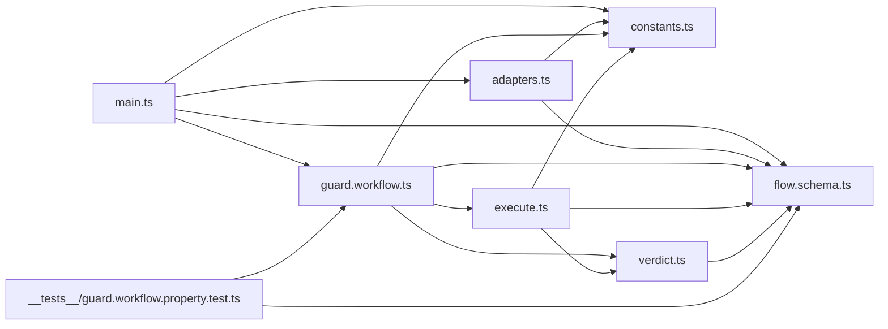

# Oxlint Guard Hook — Architecture Audit

Baseline captured at pre-rewrite commit `27f4e41290318e8f870cd6f56e56f286c7ff198a`.
Graphs are extracted by script (`./extract-graph.ts`), never narrated.

## As-is boundary map

Extracted: `deno run --allow-read=. docs/audits/oxlint-guard-hook/extract-graph.ts agent-plugins/oxlint-guard-hook/src`
Raw edge list: `as-is-graph.json` (recorded from `27f4e412`).

Cycle check: the import graph is acyclic (`adapters → schema`, `execute → schema+verdict`, `workflow → execute+verdict+schema`; no module imports upward).

## As-is findings (the rewrite's targets, each with its confirming gate)

| # | Finding                                                                                                                                                                                                                | Blast radius                                                     | Confirming gate                                                                                                                              |
| - | ---------------------------------------------------------------------------------------------------------------------------------------------------------------------------------------------------------------------- | ---------------------------------------------------------------- | -------------------------------------------------------------------------------------------------------------------------------------------- |
| 1 | Outcome vocabularies overlap: `AttemptOutcome`/`FinalAttempt` (`proceed`/`retry-plain`/`respond`) restate `HookResult` across two layers; `attemptOutcome` + `haltOf` hand-map `RunOutcome`→`LintOutcome`→attempt→hook | `flow.schema.ts` 46–63, `verdict.ts` 102–143, `execute.ts` 7–106 | R2 check: every verdict-layer exported type is `S.Schema.Type`-derived, every transform total `Match`/`Option`; one algebra per layer (KTD1) |
| 2 | Attempt variant names are structural (`proceed`/`retry-plain`/`respond`), not domain verdicts                                                                                                                          | `flow.schema.ts` 46–63, `verdict.ts` 102–143                     | R2 naming clause (adopted convention per decision-gate ruling, convention-band warrant)                                                      |
| 3 | `runGuarded` dispatches on a `canRetry: boolean` via overloads — retry state hidden from the type                                                                                                                      | `execute.ts` 16–36                                               | R3: zero function overloads in `execute.ts` (KTD2 ladder)                                                                                    |
| 4 | `GuardPhases` provenance unverified (declared from lint-error-driven inference; plugin pins published cell-types 5.0.1 while workspace source sits at `packages/core/effect/cell/types` 5.0.2)                         | `guard.workflow.ts` 150–161                                      | R4: member-for-member compare vs source `Cell.Phases`; cite file+line either way (KTD3)                                                      |
| 5 | Plan-variant `S.TaggedStruct` bases live in `guard.workflow.ts` — legal per `make-body-purity`, but their canonical home is unprobed                                                                                   | `guard.workflow.ts` 28–44                                        | KTD4 probe: move bases to `flow.schema.ts`, run lint, record ruling                                                                          |

## Behavior baseline (pinned by R1)

Exit contract at `27f4e412`: unknown tool → 0 silent; malformed stdin → 0 silent; missing file / non-lintable extension / no config → 0; **spawn-failure or tool-not-found → 1 + prerequisite hint on stderr; timeout → 0 silent**; check/lint/oxlint violation → 2 + skills-first diagnostic.
Smokes recorded: skip 0 / garbage 0 / violation 2 (with diagnostic).
