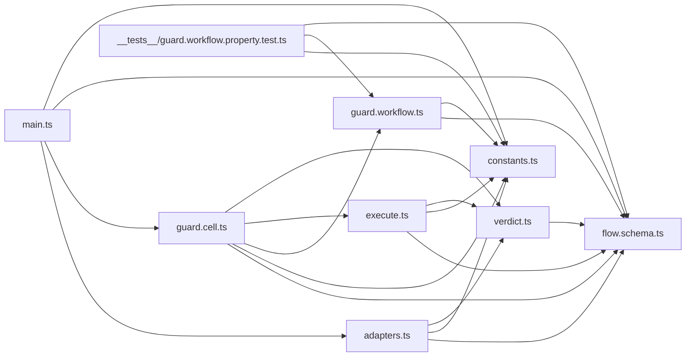

# Oxlint Guard Hook — Architecture Audit

**Status: close-out.** Baseline at `27f4e4129031`; rewrite landed in the three commits following it (module boundary graph byte-identical pre/post — the structural delta was internal). The follow-up sandwich restructure (`af11645dfa5`+) moved the remaining boundary decisions into the cell: `main.ts` is now read stdin → `Cell.apply` → write response; stdin transport validation (over-cap, malformed wire) is typed read-phase failures (`StdinOverCapError`/`WireUnreadableError` → silent exit 0 per R1; fs gather failures → exit-1 hint via `GuardReadError`); `Cell.encode` shapes a real `GuardAction` sum (respond/RunDeno/RunOxlint) instead of passing the decision through identity; the hand-rolled `guard.import-meta.d.ts` was deleted in favor of vitest's own `vitest/importMeta` augmentation (`/// <reference types="vitest/importMeta" />`, `vitest` mapped in `deno.jsonc`). Graph regenerated from the tree; `as-is-graph.json` == `target-graph.json`.

## Target-state findings resolution

| # | Finding                              | Resolution                                                                                                                                                                                                                                                                                                                                                                                                                    | Evidence                                                                                                                                 |
| - | ------------------------------------ | ----------------------------------------------------------------------------------------------------------------------------------------------------------------------------------------------------------------------------------------------------------------------------------------------------------------------------------------------------------------------------------------------------------------------------- | ---------------------------------------------------------------------------------------------------------------------------------------- |
| 1 | Overlapping outcome vocabularies     | Resolved: one `GuardVerdict` algebra (`Proceed`/`Retry`/`Halt`) in `flow.schema.ts`; `AttemptOutcome`/`FinalAttempt` unions and the `attemptOutcome`+`haltOf` mapping pair deleted; `LintOutcome` renamed to expert-named `LintVerdict` (`Pass`/`Violation`/`RetryWithoutTypeCheck`/`ToolMissing`); `RunOutcome` kept (process reality)                                                                                       | R2 check green (deno check 0 errors; lint 0 findings; every verdict-layer export `S.Schema.Type`-derived, every transform total `Match`) |
| 2 | Structural variant names             | Resolved: domain verdicts PascalCase; plan variants (`Skip`/`RunDeno`/`RunOxlint`) exempt — they name tools/actions, not outcome verdicts. Naming clause adopted as convention (decision-gate ruling A7/A8: convention-band warrant, not canon)                                                                                                                                                                               | Same gates as #1                                                                                                                         |
| 3 | Boolean-overload retry dispatch      | Resolved: `Rung { canRetry, proceedStops }` ladder values in `execute.ts`; zero function overloads                                                                                                                                                                                                                                                                                                                            | R3: `deno check` clean; grep `function runGuarded(` → none                                                                               |
| 4 | `GuardPhases` provenance unverified  | Resolved by falsification: source `Cell.Phases` (`packages/core/effect/cell/types/src/Cell.ts:16-27`) declares exactly the 10 members `GuardPhases` implements, same names; `R = never` pin documented at `Cell.ts:35-42`. Current shape is already the source idiom — no re-declare. Plugin pins published cell-types 5.0.1; workspace source is 5.0.2 at the path above; the bag interface is the stable published contract | This row; cite `Cell.ts:16-27`                                                                                                           |
| 5 | Plan-variant bases location unprobed | Resolved by probe: bases moved to `flow.schema.ts` (schema-declaration-location admits them), `planFor`/`PLAN_RULES`/`GuardUnsupportedToolError` stay same-file (make-body-purity), type-only `GuardPlan` import in the workflow. Gate ran clean: 0 check errors, 0 lint violations, 13/13 tests — the decide body's references remain same-file                                                                              | KTD4 ruling recorded here                                                                                                                |

## Behavior verification (post-rewrite smoke matrix)

- skip input (missing file) → exit 0
- garbage stdin → exit 0
- over-cap stdin (>1 MiB) → exit 0
- unknown tool → exit 0
- not-lintable extension / no oxlint config → exit 0
- deno-check violation fixture → exit 2 with skills-first diagnostic on stderr, stdout byte-empty
- gather failure (unreadable file) → exit 1 with hint on stderr (typed `GuardReadError` arm)
- pnpm missing (deno-only PATH) → exit 1 with prerequisite hint on stderr (R1 exit-1 path)
- timeout → exit 0 (algebra arm `Halt(0, '')`, compile-checked; not independently smoked)

13/13 vitest (property suite + in-source verdict properties, typed by vitest's own augmentation). gcanti-tim-smart-style audit: 0 fail, 0 warn (effect-4.x).

Cycle check: the import graph is acyclic (`adapters → constants+schema+verdict`, `cell → workflow+execute+verdict+schema`, `workflow → constants+schema`; no module imports upward).

## As-is findings (the rewrite's targets, each with its confirming gate)

| # | Finding                                                                                                                                                                                                                | Blast radius                                                     | Confirming gate                                                                                                                              |
| - | ---------------------------------------------------------------------------------------------------------------------------------------------------------------------------------------------------------------------- | ---------------------------------------------------------------- | -------------------------------------------------------------------------------------------------------------------------------------------- |
| 1 | Outcome vocabularies overlap: `AttemptOutcome`/`FinalAttempt` (`proceed`/`retry-plain`/`respond`) restate `HookResult` across two layers; `attemptOutcome` + `haltOf` hand-map `RunOutcome`→`LintOutcome`→attempt→hook | `flow.schema.ts` 46–63, `verdict.ts` 102–143, `execute.ts` 7–106 | R2 check: every verdict-layer exported type is `S.Schema.Type`-derived, every transform total `Match`/`Option`; one algebra per layer (KTD1) |
| 2 | Attempt variant names are structural (`proceed`/`retry-plain`/`respond`), not domain verdicts                                                                                                                          | `flow.schema.ts` 46–63, `verdict.ts` 102–143                     | R2 naming clause (adopted convention per decision-gate ruling, convention-band warrant)                                                      |
| 3 | `runGuarded` dispatches on a `canRetry: boolean` via overloads — retry state hidden from the type                                                                                                                      | `execute.ts` 16–36                                               | R3: zero function overloads in `execute.ts` (KTD2 ladder)                                                                                    |
| 4 | `GuardPhases` provenance unverified (declared from lint-error-driven inference; plugin pins published cell-types 5.0.1 while workspace source sits at `packages/core/effect/cell/types` 5.0.2)                         | `guard.workflow.ts` 150–161                                      | R4: member-for-member compare vs source `Cell.Phases`; cite file+line either way (KTD3)                                                      |
| 5 | Plan-variant `S.TaggedStruct` bases live in `guard.workflow.ts` — legal per `make-body-purity`, but their canonical home is unprobed                                                                                   | `guard.workflow.ts` 28–44                                        | KTD4 probe: move bases to `flow.schema.ts`, run lint, record ruling                                                                          |

## Behavior baseline (pinned by R1)

Exit contract at `27f4e412`: unknown tool → 0 silent; malformed stdin → 0 silent; missing file / non-lintable extension / no config → 0; **spawn-failure or tool-not-found → 1 + prerequisite hint on stderr; timeout → 0 silent**; check/lint/oxlint violation → 2 + skills-first diagnostic.
Smokes recorded: skip 0 / garbage 0 / violation 2 (with diagnostic).
