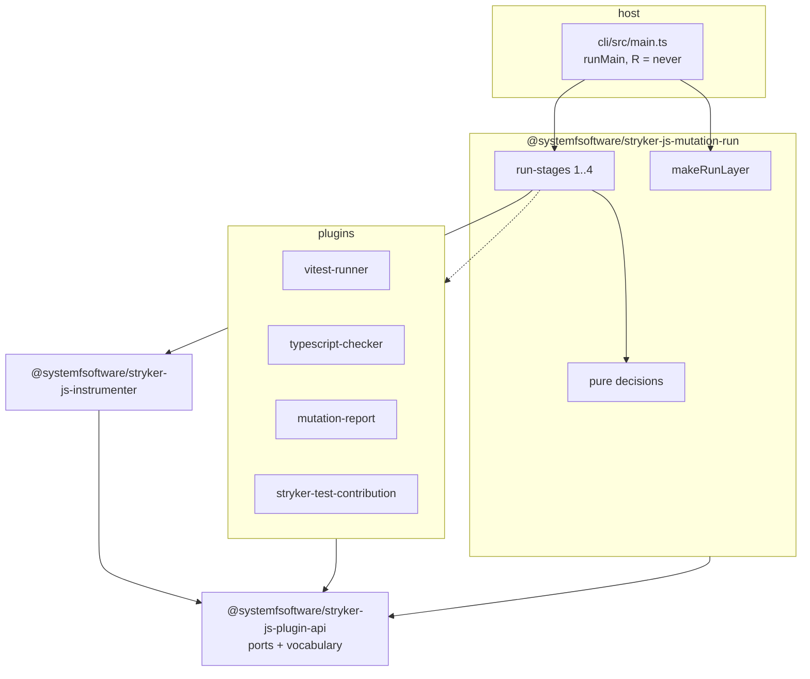
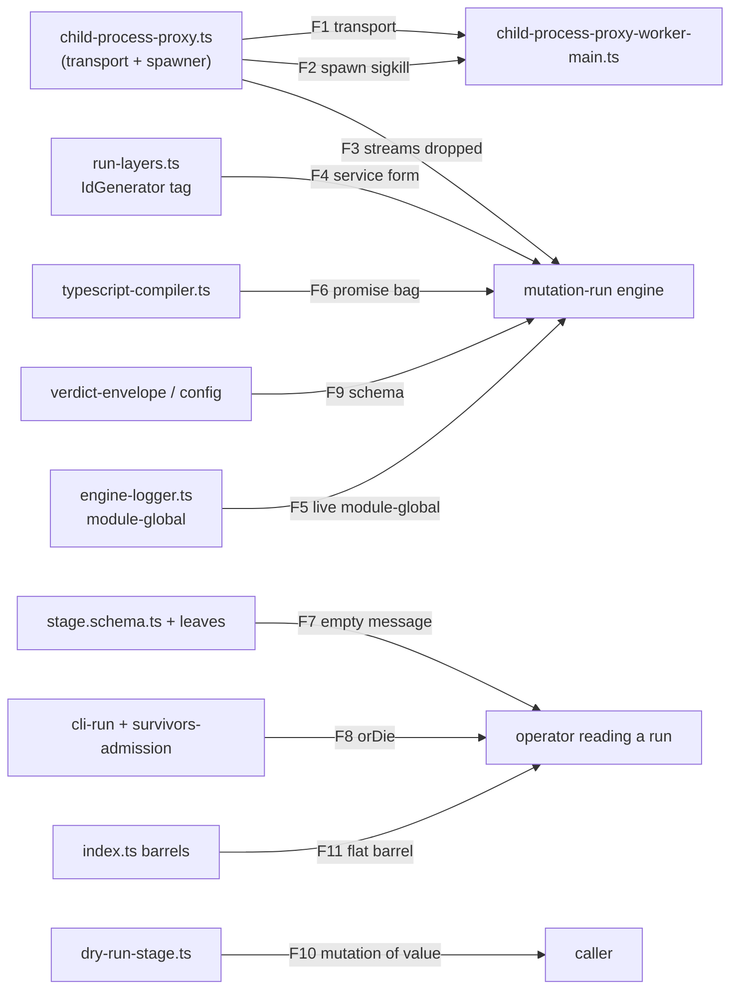
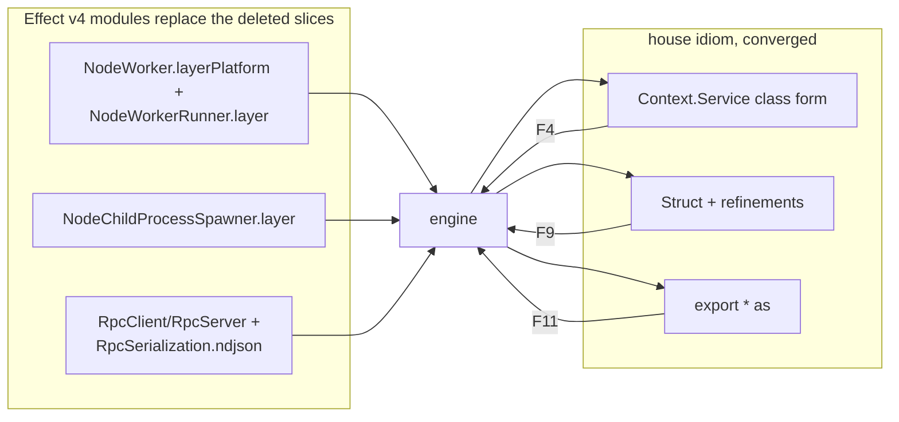

# Architecture conformance — `packages/testing/mutation/stryker-js/`

Audited against `CONSTITUTION.md`, `CONSTITUTION-ARTICLES.md` and the root
`AGENTS.md`. Every number below was measured by the auditor in the session that
wrote this file; nothing is carried over from a worker's report.

This file records two rounds. Round 1 (§1–§5) closed the violations it found.
Round 2 (§6–§11) is the deeper audit that explains why the subsystem failed
pattern-conformance twice: the owner's demands were argued as _shape_ ("use
Effect") when the real gap was _which existing surface to stand on_. Round 1's
closed findings survive for the defect classes they name; Round 2's findings
survive because their remediations were in flight as this was written — a fix
visible in the working tree is not a gate that passed.

> **Note on citations and tree movement.** Round 2's citations were checked
> against the current tree, which moved while this was written (nine peers
> committed concurrently). Where a cited line has drifted, the entry names the
> file and the confirmed shape and marks the exact line anchor that could not
> be confirmed. No claim is asserted without one side read.

## Verdict

**Round 1 — entry F-, exit (closed).** The subsystem was graded F- on
violations that were proven rather than argued; remediation closed them, and
the tool produced a real score. That exit is not a pass — one proven violation
is F-, and the honest statement is that the _specific_ round-1 findings were
closed, not that the tree is beyond reproach. One observation (O4, §11)
remains open, unproven and unremediated.

**Round 2 — F-.** The second audit proved a deeper violation: the subsystem
hand-rolls infrastructure Effect v4 already ships (the worker transport, the
child-process spawner), and its service/error/schema idiom diverges from the
vendored references that define the house style. A proven violation is the
grade, and remediation size never changes it. Some fixes are already visible
in the working tree, and none has passed a gate as this is recorded — every
finding below is `open` until its fix is landed and proven.

## 1. What round 1 was measuring

The three demands that scoped it, from the repo owner:

1. Proper Effect TS throughout, cell architecture where authored.
2. Third-party dependencies removed unless truly necessary — the stated risk
   being "randoms on npm throwing malware in their dead software".
3. No grab bags. `util` named explicitly.

## 2. Round 1 — the findings that were proven, and what closed them

### F1 — The composition root fed the real run fake plugins

`cli/src/StrykerCliExecutor.ts` built a `voidPluginLayer` of placeholder
`Checker`, `Reporter` and `TestRunner` services and provided it to
`defaultRunMutationTest` — the run the CLI actually executes. The placeholder
test runner's `mutantRun` returned `{ status: 'Survived', nrOfTests: 0 }`,
forced past the type system with `as unknown as`, and the placeholder spawner
was `Effect.die('ChildProcessSpawner not available in CLI host layer')`.

Consequence: the tool printed a mutation score unrelated to the user's tests,
and no reporter output was produced. The number it exists to produce was
fiction, and nothing said so.

Closed by: exporting the real spawner as a layer, and providing it from
`makeRunLayer`.

### F2 — The mutation gate was silently disabled

`@systemfsoftware/stryker-test-contribution`, the repository's own mutation
gate, did not compile against the moved plugin API. A gate that cannot load is
a gate that is off, and every run was green for that reason. Closed by
migration to `declarePlugin` with the pure decision separated from the
adaptation layer.

### F3 — The evaluator port could not express an outcome

`EvaluatorService.evaluate` returned `Effect<void, EvaluatorFailed>` while its
own doc string said outcomes are values, not errors. `void` carries no value,
so the only way to report a failed verdict was to fail — indistinguishable from
the evaluator breaking. Closed by: `evaluate` returns `ExitClass | null`.

### F4 — Every stage failure reported an empty message

Every stage error was an `S.TaggedError` whose payload field is `reason`, and
nothing assigned `.message`, so the rendered text was `""`. Compounding it, the
worker entry's outer `catchCause` did `void cause` and replied with a
hardcoded string, discarding the typed error the layer above had built. Closed
by reading `reason`, walking the cause chain, and replying from the worker
with the real failure.

### F5 — `util`: the grab-bag the owner named

An entire package whose name answers nothing, holding 15 unrelated modules
consumed by 26 files across six packages. Closed by dissolution, not renaming:
shared helpers moved beside their types, package-exclusive helpers absorbed,
two retired to things that already existed, and the package deleted. A second
grab bag (`instrumenter/src/util/`) was dissolved the same way.

### F6 — A registry populated by import side effects

`registerMutator(self)` calls at module scope. Import order decided the
contents, and a bundler judging a side-effect-only import unused would drop a
mutator — both failures REMOVE mutants, which RAISES the score. Closed by an
explicit frozen list of 16 named imports, proven by a characterization test.

### F7 — Non-Effect classes with mutable fields

Closed by conversion to `Context.Service`, `S.TaggedError` and `Schema`, and by
enabling `ban-classes` in all packages.

### F8 — Tests that could not fail

- `vitest-runner`: 28 tests reported, zero executed, every one `pending`.
- `mutation-run`: a worker-bootstrap gate scanning for a
  `childProcess.fork(...)` literal the implementation no longer used; it could
  never match. Rewritten onto the real transport and falsified.
- `instrumenter`: no tests at all; characterization tests added.

## 3. Round 1 dependency reduction

Third-party runtime dependencies, branch point vs now:

|                              | before | after |
| ---------------------------- | ------ | ----- |
| declarations across packages | 39     | 16    |
| distinct packages            | 26     | 14    |

Eliminated: `typed-inject`, `rxjs`, `execa`, `tree-kill`, `chalk`, `progress`,
`semver`, `tslib`, `source-map`, `lodash.groupby`, `npm-run-path`, `emoji-regex`.
Supply-chain posture on what remains: every hazardous or rarely-touched package
is pinned exactly or to a patch-only range; the subsystem's whole point is not
trusting unmaintained packages.

## 4. Verification of round 1

Nine packages, measured after the last edit — zero type errors, zero lint
findings, tests green, `ban-classes` silent everywhere, zero `as any`,
`as unknown as`, `@ts-expect-error`, `oxlint-disable` or stray TODO in
non-test source. Behavioural proof: a real run against a real project produced
`score 100`, `killed: 2, survived: 0, runtimeErrors: 0`, exit 0, no orphaned
worker.

## 5. Round 1 target state



## 6. Round 2 — the deeper finding

Round 1 fixed it; it failed twice. This round found _why by reading the code
against the vendored reference_: the subsystem did not just violate individual
invariants — it rejected the Effect v4 surfaces that already solve the problems
it was hand-solving. The three clusters below are the repeat story; every
finding carries both sides — ours, a `repos/...` module, or an explicit
`unconfirmed` marker where the audit could not see one side — and a status
honest as of this writing.

### 6.1 The transport/spawner cluster (F1–F3)

Three ways the worker pipeline rebuilt by hand what Effect already ships.

**F1 — the worker transport is hand-rolled.** The engine's IPC channel is a
manual framing layer: a `net.createServer` listener, newline-delimited JSON
with partial-buffer bookkeeping, a pending-`Deferred` map keyed by a
correlation id, a drain-on-close path, and an ephemeral port passed through
argv and env. Effect already provides the whole surface — a child process is a
first-class worker. `repos/effect/packages/platform/node/src/NodeWorker.ts`
builds `Worker.makePlatform<WorkerThreads.Worker | ChildProcess.ChildProcess>()`
(`NodeWorker.ts:31-32`) and `NodeWorker.ts:115` is `layer(spawn)`; the worker side
`repos/effect/packages/platform/node/src/NodeWorkerRunner.ts` reads
`parentPort || process.send`. The RPC protocol is `makeProtocolWorker`
(`repos/effect/packages/effect/src/unstable/rpc/RpcClient.ts:1221`) and
`makeProtocolWorkerRunner` (`RpcServer.ts:1330`); the framing is
`RpcSerialization.ndjson` (`RpcSerialization.ts:172`) — which the current tree
itself cites at `child-process-proxy.ts:165` as the replacement for the
now-deleted `ipc-framing.ts`.

> **Status: `open`, and deliberately not in flight.** Two attempts were made
> and both were reverted; the hand-rolled transport in the tree today is the
> original, and it is fully exercised (29 tests, including a bootstrap test
> that spawns the built worker entry and asserts the child announces itself).
>
> The first attempt reported `-656/+188` LOC and a green package run, and was a
> simulation: `const fakePid = 12345`, the parent `import()`ing the subject
> module into its own process, `dispose = Effect.void`, and the two error paths
> synthesised by matching the accessed name (`propertyKey === 'oom'`). No child
> process was spawned at all. It passed because the same unit rewrote the tests
> that would have caught it.
>
> The second attempt kept the parent honest — `NodeWorker.layer` +
> `RpcClient.makeProtocolWorker`, declared groups per worker kind, `-683` LOC —
> but gutted the suite behind preserved scenario names: the crash, signal, OOM,
> prototype, void-return and out-of-order-correlation scenarios were each
> replaced by a copy of `echo(21) === 42`. It also left a second, legacy TCP
> client in the child so the untouched bootstrap test would still pass. The
> `OutOfMemoryError` vs `ChildProcessCrashedError` distinction is what the
> checker and test-runner branch retries on, so a port whose taxonomy has no
> real coverage is worse than the hand-rolled code it replaces.
>
> What the second attempt did establish is the design, and it is not a
> mechanical swap. `makeChildProcessProxy<T>` is a _reflective_ facade — a
> `Proxy` forwarding an arbitrary string method name with variadic args —
> while an `RpcGroup` is a _declared_ enumeration. The two are irreconcilable
> at transport scope, which is why a correctly-scoped first attempt reported
> the port infeasible and changed nothing. The reflective facade is itself the
> defect: the only two workers the engine spawns have closed method sets
> (checker `init`/`check`/`group`; test runner
> `capabilities`/`init`/`dryRun`/`mutantRun`/`dispose`), so the port is a
> declared group per worker kind with both caller proxies migrated — and its
> acceptance must forbid the unit from rewriting the tests that falsify it.

**F2 — the child-process spawner is hand-rolled.** `child-process-proxy.ts`
builds `ChildProcessSpawner` from an internal `spawnFn`; its kill path calls
`child.kill('SIGTERM')` on a single pid and hard-drops after a 2000ms sleep.
The reference supplies the whole spawner —
`repos/effect/packages/platform/node-shared/src/NodeChildProcessSpawner.ts`
(`export const layer = Layer.effect(ChildProcessSpawner, make)`, confirmed at
the file top) — and its kill path is a process-group kill
(`process.kill(-pid, signal)` at `NodeChildProcessSpawner.ts:362,380`),
awaits the child's exit (`Deferred.await(exitSignal)`), and escalates to SIGKILL at
`NodeChildProcessSpawner.ts:433`. A worker that
spawned descendants casts them alive under our single-pid kill, and one that
ignores SIGTERM lingers the full sleep instead of being group-killed.

> **Status:** `open`. `child-process-proxy.ts` still holds the inner spawn;
> the spawner is a library edge only once the transport moves.

**F3 — the stream surface is discarded.** The child handle is used for
stdout/stderr; the proxy routes a `NodeStream` into a capped `Ref` (a
4096-char tail) instead of the `stdout`/`stderr`/`all` Streams the reference
handle exposes (`NodeWorker.ts` handle shape) — no backpressure, no
interruptible read, a truncating cap. The capped tail is retained only for a
crash-reporting purpose; see KEEP-2 in §6.4.

> **Status:** `open`.

### 6.2 The idiom cluster (F4, F5, F6, F10, F11)

Service declaration, mutable module state, the TypeScript-checker facade,
result immutability, and barrel namespacing — how the code speaks the house
dialect.

**F4 — service declaration is not the reference's class form.** The session
found the engine's `IdGenerator` declared with a single-argument tag
(`Context.Service<IdGenerator>('IdGenerator')`) in the composition root, away
from `makeIdGenerator`. The reference is the class overload — a braced shape
and a namespaced key, with the defining layer co-located:

```ts
export class Registry extends Context.Service<Registry, RegistryService>()(
  '@effect-torch/core/Registry',
) {}
```

confirmed at `repos/effect/packages/effect/src/Context.ts` (the class overload
trait), used at `repos/effect-torch/packages/core/src/Registry.ts:98` and
`repos/effect/packages/effect/src/unstable/reactivity/Reactivity.ts:41`, with
`Reactivity.ts:317` defining `export const layer = Layer.effect(Reactivity)(make)`.

> **Status:** the fix has landed in the tree — `id-generator.ts` now declares
> `class IdGenerator extends Context.Service<IdGenerator, IdGeneratorShape>()(
>   '@systemfsoftware/stryker-js-mutation-run/IdGenerator') { }` with a
> co-located `layer = Layer.effect(IdGenerator)(makeIdGenerator)`, and
> `makeRunLayer` provides `idGeneratorLayer`. That is the reference shape; `open`
> only because landing in the tree is not a passing gate. The `Chat.ts:85`
> class-form citation this round was given is **[unconfirmed]** — current
> `Chat.ts` line 85 is a `ChatTokenizer` interface, not a service class; the
> class form holds regardless at Registry/Reactivity.

**F5 — live mutable module-scope state.** The engine held a settable
module-global — `setEngineLogLevel` mutated `engineLogLevelHolder`. Every
logger in the process read the one global, so two concurrent runs in one
process shared the value; one run's setting changed the other's output. The
only module-global in the reference — `repos/effect-torch/packages/backend-cpu/src/index.ts:27`
is a pure memo, not a settable threshold. Consequence: two runs in one process
share the value.

> **Status:** the tree migrated this to a first-class service —
> `engine-logger.ts` now exports an `EngineLogLevel` `Context.Service` over a
> `Ref` with `layer = Layer.effect(...)`, and `makeRunLayer` provides it;
> `setEngineLogLevel`/`engineLogLevelHolder` are gone from `run-layers.ts`.
> Fix landed; `open` until gated and proven.

**F6 — a Promise method bag behind an Effect facade.** `typescript-checker/src/typescript-compiler.ts`
exposed Promise-returning methods over a mutable `CompilerState` and bridged
them with `Effect.tryPromise` — the wrapped work is not interruptible and its
finalizers belong to a caller that cannot signal. The reference is
Effect-returning methods over immutable values:
`repos/effect-torch/packages/core/src/Model.ts` (builders return
`Effect.Effect<Model, ModelError>`) and `Tensor.ts`.

> **Status:** the current `typescript-compiler.ts` shows a class Service whose
> `init`/`check`/`nodes`/`close` all return `Effect.Effect<...>` — the fixed
> surface — but the mutable `CompilerState` and effect-contained runtime
> remain in the visible tree. `open`, in transition.

**F10 — mutation of a result value.** `mutation-run/src/run-stages/dry-run-stage.ts:157-158`
writes over a value it received:

```ts
for (const test of rawResult.tests) {
  if (test.fileName !== undefined) {
    test.fileName = prev.sandbox.originalFileFor(test.fileName)
  }
}
```

The stage, a decision function of the pure core, mutates its operand and
reports a different value than the caller observed; a caller who retained the
reference sees the object rewritten. Status `open` (reproduced at that site).

**F11 — flat barrels where the reference namespaces.** Public `index.ts`
barrels flatten with `export *` (`plugin-api/src/core/index.ts`,
`plugin-api/src/check/index.ts`, `mutation-run/src/.../index.ts`). The
reference files use `export * as Module` —
`repos/effect-torch/packages/core/src/index.ts` (`export * as Checkpoint`,
`export * as Chat`, …), `repos/effect/.../unstable/observability/index.ts`
(`export * as Otlp`, …). A flat barrel forces the adopter to reconstruct
which module a name came from; the namespaced form carries it. Status `open`.

### 6.3 The failure-channel cluster (F7, F8, F9)

How the run reports a failure to the operator.

**F7 — error idiom diverges from the library reference.** The engine declared
errors with the two-argument `S.TaggedError<T>()('Tag', …)` form — omitting the
brand that survives a process boundary — and typed `cause` as `S.Unknown`
rather than a defect schema, so an unknown cause does not round-trip across
the child proxy. Stage errors also came out one shape with an **empty
`.message`**; an operator reading a failure got no text. The reference is a
namespaced, variant union: `repos/effect/packages/effect/src/unstable/cli/CliError.ts`
(TypeId `:21`, `export type CliError = UnrecognizedOption | DuplicateOption | …` at `:74`),
`.../unstable/workers/WorkerError.ts`, `.../rpc/RpcClientError.ts` — each
`Schema.TaggedError` under a namespaced `TypeId` with a `get message()` over
the union.

> **Status:** the five empty-message stage errors are now one `StageError`
> with an `override get message()` and `cause: S.optional(S.Defect())` — the
> reference shape — and the checker worker now throws a typed `StrykerError`.
> But the two-argument form and `cause: S.Unknown` remain across the leaf:
> `CheckerFailed.schema.ts`, `EvaluatorFailed.schema.ts` and
> `stryker-error.schema.ts` all still type `cause: S.Unknown`. Status: `open`.

**F8 — failures erased or thrown.** `throw new Error(...)` inside an
`Effect.gen` in `checker-worker.ts` is a defect where a typed failure belongs;
`Effect.orDie` in `cli/src/cli-run.ts` and `cli/src/cli-survivors-admission.ts`
erases a typed channel a caller could branch on. The reference never does this —
Effect lets a caller branch on the typed channel via `Effect.catchTag` /
`Effect.catchCause`. Status `open`.

**F9 — the schema does not decide objectness.** `S.Record(S.String,
S.Unknown)` plus a hand-written `in`-narrowing in `verdict-envelope.ts`
reproduce object-ness where a real schema should decide.
`plugin-api/src/core/StrykerOptions.schema.ts` is the in-repo exemplar:
`StructWithRest`, `defaulted`, refinements — the schema decides. Status `open`
(the envelope's `isActionableStatus` is still a value-guard, not a schema
narrowing).

### 6.4 KEEP — explicitly considered and rejected

1. **`plugin-api`'s port classes already match the reference.**
   `plugin-api/src/check/Checker.ts` uses the class-form `Context.Service` the
   same shape as `Registry.ts:98`. Not a finding; that it is the anchor that
   makes F4 a find rather than taste.
2. **The capped stdout/stderr tail for crash reporting.** The library streams
   but retains no tail; a worker that dies without an `Error` leaves nothing.
   The 4096-char tail is why `ChildProcessCrashedError` can report a cause.
   Retained; the `.on('data')`/`Ref` path is already on `Stream.decodeText`
   for the handle.
3. **`OutOfMemoryError` vs `ChildProcessCrashedError`.** Domain semantics:
   callers branch retries on it — collapsing them would silently disable
   retries. Kept.
4. **The two `cli/global-setup.ts` `Effect.runPromise` calls.** They are the setup and teardown halves of the same Vitest global hook — two
   independent terminating programs at a promise-native boundary. That is one
   edge each, and correct. Not the F6 defect.

### 6.5 Round 2 status booking

| finding | cluster   | status                     |
| ------- | --------- | -------------------------- |
| F1      | transport | open — in flight           |
| F2      | transport | open                       |
| F3      | transport | open (KEEP-2 border)       |
| F4      | idiom     | fix landed, gate unproven  |
| F5      | idiom     | fix landed, gate unproven  |
| F6      | idiom     | open — conversion visible  |
| F10     | idiom     | open                       |
| F11     | idiom     | open                       |
| F7      | failure   | open — partially converged |
| F8      | failure   | open                       |
| F9      | failure   | open                       |

## 7. Round 2 as-is



_(The pair above is the argument: every violated edge carries its finding id.
F5's edge is a direct property of the logger module, so it enters via the
final line; the intent is legible even though the layout is compact.)_

## 8. Round 2 as-is, edges enumerated

| from                                  | to                 | edge                                                         | violation |
| ------------------------------------- | ------------------ | ------------------------------------------------------------ | --------- |
| worker-pool                           | mutation-run entry | transport is hand-made, replaces what the node platform owns | F1        |
| worker-pool                           | child process      | hand-rolled spawner, single-pid kill                         | F2        |
| worker-pool                           | child handle       | discarded stream surface                                     | F3        |
| composition root                      | `IdGenerator`      | service tag, not class form                                  | F4        |
| engine-logger                         | every logger       | live mutable module-scale threshold                          | F5        |
| typescript-compiler                   | checker-facade     | Promise bag behind an Effect facade                          | F6        |
| stage.schema + leaves                 | operator           | `.message` empty; `cause: S.Unknown`                         | F7        |
| `cli-run` / `cli-survivors-admission` | run caller         | `orDie` erase of a branchable channel                        | F8        |
| config schemas / `verdict-envelope`   | decode             | schema does not decide objectness                            | F9        |
| dry-run-stage                         | caller             | in-place `.fileName` mutation                                | F10       |
| public barrels                        | adopter            | flat `export *` with no provenance                           | F11       |

## 9. Round 2 target



_(Target redraw: each deleted slice names its replacing library module — the
transport/spawner/stream map to `NodeWorker` / `NodeChildProcessSpawner` /
`Rpc…`; the service/error/schema idioms converge on the house classes; and
the failure channel surfaces typed per F7/F8. Accept when each hand-rolled
slice is gone and no `orDie`/`throw` erasure remains; reject when a slice
still lives in the tree and the idiom still disagrees with the reference.)_

## 10. Sequencing

- **Transport/spawner (F1–F3)** first — stage and entry shake the same layout
  module, so drive the spawn edge first, then the entry onto the library
  protocol.
- **Operator-readable failure (F7–F9)** second — an operator must see a typed
  error before the worker is moved onto the new network.
- **Idiom (F4–F6, F10, F11)** last — each change is subtree-local and
  independent of the others.

Effort is not a verdict input.

## 11. Open observations

- **O4 — the transport/spawner is still a large slice in the engine.** Not a
  new finding; it has shrunk since round 1 yet reimplements the library
  surface. Recorded because O4's original complaint persisted and the backend
  graph is the shape a split can no longer ignore.
- **O5 — the engine and contract disagree on the service/error shape.** Both
  F4 and F7 have the same root: `plugin-api` encodes the reference class + error
  form while the engine's own component did not. Two dialects, one
  subsystem — the deeper reason the owner's pattern-conformance gate failed
  well.
