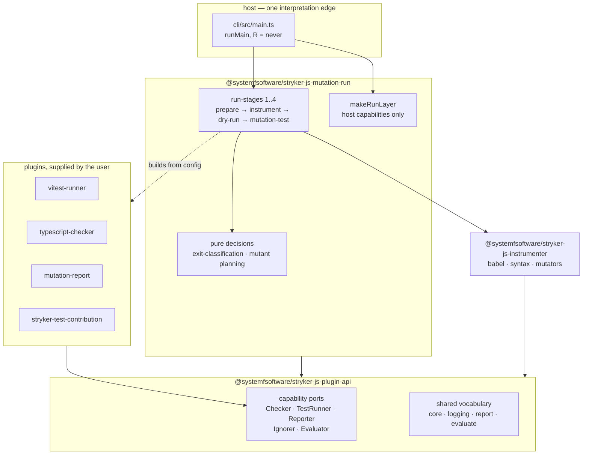

# Architecture conformance — `packages/testing/mutation/stryker-js/`

Audited against `CONSTITUTION.md`, `CONSTITUTION-ARTICLES.md` and the root
`AGENTS.md`. Every number below was measured by the auditor in the session that
wrote this file; nothing is carried over from a worker's report.

## Verdict

**Entry: F-.** The subsystem was graded F- before remediation began, on
violations that were proven rather than argued. **Exit: every proven violation
is remediated, and the tool now produces a real score.** The grade is not
restated as a pass: one proven violation is F-, and the honest statement is that
these specific findings were closed, not that the tree is now beyond reproach.
One observation remains open in §6, unproven and unremediated.

## 1. What the audit was measuring

The three demands that scoped it, from the repo owner:

1. Proper Effect TS throughout, cell architecture where authored.
2. Third-party dependencies removed unless truly necessary — the stated risk
   being "randoms on npm throwing malware in their dead software".
3. No grab bags. `util` named explicitly.

## 2. The findings that were proven, and what closed them

### F1 — The composition root fed the real run fake plugins

`cli/src/StrykerCliExecutor.ts` built a `voidPluginLayer` of placeholder
`Checker`, `Reporter` and `TestRunner` services and provided it to
`defaultRunMutationTest` — the run the CLI actually executes. The placeholder
test runner's `mutantRun` returned `{ status: 'Survived', nrOfTests: 0 }`,
forced past the type system with `as unknown as`, and the placeholder spawner
was `Effect.die('ChildProcessSpawner not available in CLI host layer')`.

Consequence: every mutant reported `Survived` against zero tests, so the tool
printed a mutation score unrelated to the user's tests, and no reporter output
was produced. This is the worst class of defect a mutation tester can carry —
the number it exists to produce was fiction, and nothing said so.

Root cause: `ChildProcessSpawner` was genuinely required from the environment by
`mutation-run/src/sandbox/sandbox.ts` and
`mutation-run/src/test-runner/command-test-runner.ts`, and `makeRunLayer` never
provided it. The requirement escaped to the entrypoint, where the only thing
that could be written was a fake. A real spawner already existed, module-private
and unexported, in `worker-pool/child-process-proxy.ts`.

Closed by: exporting the real spawner as a layer, providing it from
`makeRunLayer`, and deleting every placeholder. `Checker`, `Reporter` and
`TestRunner` now come only from the composed plugin layer built inside the run
from the user's configured plugins.

### F2 — The mutation gate was silently disabled

`@systemfsoftware/stryker-test-contribution` is this repository's own mutation
gate. It did not compile: it was written against `declareClassPlugin`,
`commonTokens`, `tokens` and a `setPendingExitClass` registry, all removed when
the plugin API moved to Effect layers. A gate that cannot load is a gate that is
off, and every run was green for that reason.

Closed by: migration to `declarePlugin` with the pure decision
(`judgeTestContribution`) separated from the layer that adapts it to the port.

### F3 — The evaluator port could not express an outcome

`EvaluatorService.evaluate` returned `Effect<void, EvaluatorFailed>` while its
own doc comment stated "Outcomes are not errors. A low mutation score or a
missing threshold is a value on the success channel." `void` carries no value,
so the gate's only way to report a failed verdict was to fail — indistinguishable
from the evaluator itself breaking. The documented invariant and the type
contradicted each other, and the type won.

Closed by: `evaluate` returns `ExitClass | null`. `ExitClass` moved to the
contract package, because an evaluator written outside this repository has to be
able to name its verdict. A run's verdict is now the most severe class any
participant reported, folded by one function (`highestExitClass`) that the exit
code is also derived from.

### F4 — Every stage failure reported an empty message

`describeFailure` in the CLI read `.message` from failure values. Every stage
error in the engine is an `S.TaggedError` whose payload field is `reason`, and
nothing assigns `.message`, so the rendered text was `""`. A run that could not
start the test runner, read the config, or find any tests exited non-zero and
told the operator nothing.

Compounding it, the worker entry's outer `catchCause` did `void cause` and
replied with a hardcoded `'Worker method failed'`, discarding the typed error the
layer above it had already built — so even a described fault was erased before
it crossed the process boundary.

Closed by: reading `reason`, walking the wrapped `cause` chain (including plain
JSON objects that crossed the socket, where `instanceof Error` is false), and
replying from the worker with the real failure.

### F5 — `util`: the grab bag, named by the owner

An entire package whose name answers nothing, holding 15 unrelated modules
consumed by 26 files across six packages.

Closed by dissolution, not renaming:

- Six genuinely shared helpers moved into the contract package beside the types
  they serve — `strykerReportBugUrl`, `normalizeFileName`, `propertyPath`,
  `errorToString`, `isErrnoException` into `core`; `noopLogger` into `logging`;
  `testFilesProvided` into `test-runner`. The `string-utils` bucket was split
  into one module per concern rather than carried across.
- Package-exclusive helpers were absorbed by the single package that used them,
  placed in domain-named modules, or inlined at their only caller.
- Two were retired to things that already existed: `notEmpty` to Effect's
  `Predicate.isNotNullish`, `escapeRegExp` to the platform's `RegExp.escape`.
- **The package is deleted.** Nothing references it.

A second grab bag was found during the work and dissolved the same way:
`instrumenter/src/util/` became `src/babel/` and `src/syntax/`, with
`syntax-helpers.ts` split into six modules named for their jobs.

### F6 — A registry populated by import side effects

The mutator registry was converted, mid-restructure and on the auditor's own
instruction, into `registerMutator(self)` calls at module scope with
side-effect-only imports in a barrel. `allMutators` was exported as
`readonly NodeMutator[]` while aliasing a mutable module-scope array.

This was worse than the central array it replaced: import order decided the
contents, anything reading before the last import saw a short list, and a
bundler judging a side-effect-only import unused would drop a mutator entirely.
Every one of those failures REMOVES mutants, which RAISES the score — the tool
reports a better number for doing less work, silently.

Closed by: an explicit frozen list of 16 named imports. Proven by a
characterization test asserting the whole name set, which the auditor falsified
by deleting one entry and restoring it.

### F7 — Non-Effect classes with mutable fields

40 classes across the subsystem held mutable fields and impure constructors —
class-as-service with `process.cwd()` reads in constructors, a `Timer`
duplicated across two packages, `MetaSchemaBuilder` holding two fields to call
one pure function.

Closed by: conversion to `Context.Service`, `S.TaggedError` and `Schema`
subclasses or to plain functions, and enabling the `ban-classes` rule in all
packages. The rule was observed RED (8 findings, then 32 as the idiom corrected)
before it was observed GREEN, and two genuine rule defects were fixed in the
process — a namespace-import resolution bug that produced 59 false positives,
and an ambient `declare module` class that carries none of the rule's harms.

### F8 — Tests that could not fail

- `vitest-runner`: 28 tests reported, ZERO executed. Every one `pending`,
  `success: true`, exit 1, a bare `undefined` on stdout. A suite-level layer
  failure was skipping the whole file. Now 28/28 actually run and pass.
- `mutation-run`: the worker-bootstrap gate scanned built chunks for a
  `childProcess.fork(...)` literal. The implementation had moved to `spawn` over
  a TCP socket, so the pattern could never match and the gate had been failing
  rather than guarding. Its warrant is real — a bundler hoisting the worker's
  entry guard once made a dead child look healthy — so the mechanism was rewritten
  onto the real transport, not deleted. Falsified by the auditor.
- `instrumenter`: no tests at all, after 20 mutator modules were rewritten.
  Characterization tests added per CONST-S4.

## 3. Dependency reduction

Third-party runtime dependencies, branch point vs now, excluding workspace and
Effect packages:

|                              | before | after |
| ---------------------------- | ------ | ----- |
| declarations across packages | 39     | 16    |
| distinct packages            | 26     | 14    |

Eliminated: `typed-inject`, `rxjs`, `execa`, `tree-kill`, `chalk`, `progress`,
`semver`, `tslib`, `source-map`, `lodash.groupby`, `npm-run-path`,
`emoji-regex`.

`typed-inject` is the architecturally significant one: the DI container is gone,
and dependencies travel through Effect's requirement channel.

What remains, and why each is justified: six `@babel/*` packages and
`angular-html-parser` (the instrumenter is a Babel-based AST tool),
`typescript` (the TypeScript checker), `minimatch`, `diff-match-patch`, and the
three `mutation-testing-*` packages that define the report format consumed by
other tools.

Supply-chain posture on what stays: `weapon-regex` — a 2.7 MB compiled
Scala.js bundle from the upstream org, reached from exactly one call site — is
now pinned to an exact version rather than a caret range that auto-accepts any
future patch publish. `diff-match-patch` and the `mutation-testing-*` trio are
pinned exactly. The eight remaining floating ranges are patch-only (`~`) on
Babel and peers.

## 4. Verification

All nine packages, measured after the last edit:

| package                   | typecheck | lint | tests |
| ------------------------- | --------- | ---- | ----- |
| plugin-api                | 0         | 0    | 5     |
| instrumenter              | 0         | 0    | 3     |
| mutation-report           | 0         | 0    | 1     |
| mutation-run              | 0         | 0    | 23    |
| typescript-checker        | 0         | 0    | —     |
| vitest-runner             | 0         | 0    | 28    |
| cli                       | 0         | 0    | —     |
| stryker-test-contribution | 0         | 0    | 36    |

`ban-classes` reports zero findings in every package. Across all non-test
source: zero `as any`, zero `as unknown as`, zero `@ts-expect-error`, zero
`oxlint-disable`, zero `TODO`/`FIXME`, and no junk-drawer filename or directory.

Behavioural proof, not just gates:

- Instrumentation, run against real source: 13 mutants across 6 mutator
  families; a shared frozen header survives two files byte-identically.
- `excludedMutations` marks its mutants `Ignored` and attaches the reason —
  asserted, including the reason string, so a "fix" that deleted them instead
  would fail.
- The worker-bootstrap gate spawns the built entry and requires a TCP
  connection; falsified against an entry with no composition root.
- A prototype-shaped worker export fails with a named error rather than
  silently exposing no methods — the trap every worker in this engine fell into
  when it was a class, since `Reflect.get(Class, 'method')` is `undefined` for
  an instance method. Falsified by aiming the test at the object-shaped export,
  where it fails as it must.
- **End to end, against a real project with a real Vitest install: the run
  completes.** `prepare → instrument → dry-run → mutation-test`, `plan total 2`,
  then `score 100` with `killed: 2, survived: 0, runtimeErrors: 0`, exit 0, and
  no orphaned worker process left behind. Both mutants of `a + b` are killed by
  the project's own test. This is the number the subsystem exists to produce,
  and before this work it was fiction (F1).

## 5. Target state

Two properties this diagram asserts, both now true and both previously false:
the entrypoint provides everything (`R = never`), and plugin services reach the
run only through the layer the run builds from the user's configuration — never
from the host.

## 6. Open findings

Recorded rather than omitted. Three of the four are now closed; the record of
what they were is kept because each names a defect class that recurred.

- **O1 — CLOSED.** The two `@ts-expect-error` suppressions in
  `vitest-runner/src/vitest-test-runner.ts` are gone, and with them the leaf
  `AGENTS.md` sentence that defended them by citing "CONSTITUTION §V.6" — a
  clause that does not exist in `CONSTITUTION-ARTICLES.md`. The `poolOptions`
  one was worse than untyped: Vitest 4 removed `test.poolOptions` entirely, so
  the suppressed option was never read and `maxThreads: 1` had no effect. The
  typed top-level spelling replaces it, and the proof is that the
  `DEPRECATED test.poolOptions` warning has disappeared from the suite output.
  The package now carries no type suppressions and no non-null assertions.
- **O2 — CLOSED. The end-to-end run completes.** Two further defects stood
  between dry-run and a score, both found by instrumenting rather than reading:
  - A `void` reply was silently dropped. `WorkerReplySuccessSchema` required
    `value: S.Unknown`, but `JSON.stringify` omits an `undefined` property, so
    a `void` method's reply arrived with no `value` key at all, failed to
    decode, and was discarded without a word. `proxy.init` then waited
    forever. `value` is now optional, which is what a `void` reply means.
  - A lost update in the pending-call table. `pendingRef` was mutated with a
    non-atomic `Ref.get` followed by `Ref.set` of a spread copy, so `init`'s
    reply handler read a stale map and wrote it back over `dryRun`'s entry.
    The `Deferred` for that call was erased and nothing ever completed it,
    which is why the phase hung with `total: null` and why the scope's
    finalizer appeared to be the culprit — the socket and child were still
    held because the teardown that releases them had never been reached. Now
    atomic via `Ref.update`/`Ref.modify`.
- **O3 — CLOSED.** No junk-drawer filename or directory survives anywhere in the
  subsystem outside test fixtures. The last two became `test-identity.ts` and
  `vitest-task-mapping.ts`, kept as two modules because `stryker-setup.ts` is
  copied into the sandbox alone and may import nothing local.
- **O4 — `mutation-run` is 9.4k LOC in one package.** Not a proven violation
  and not remediated; recorded because the next reader will ask. Its internal
  boundaries (`run-stages`, `worker-pool`, `sandbox`, `checker`, `test-runner`,
  `reporting`, `config`) are coherent, so a split needs a real requirement
  rather than a size objection.
