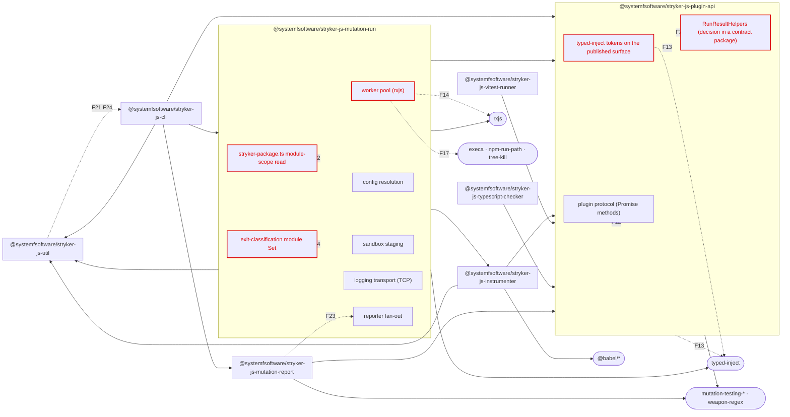
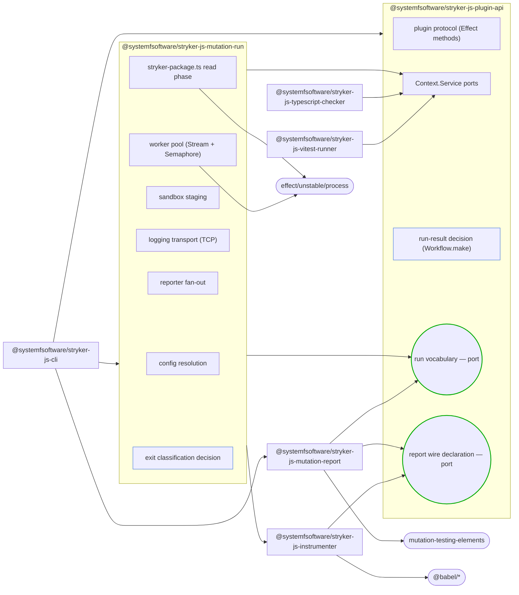

# Architecture conformance — `packages/testing/mutation/stryker-js/`

Audited 2026-08-23 against revision `HEAD` of branch `strykerjs-subsystem`. Working-tree drift at audit time: none in the report scope (`git status --porcelain packages/testing/mutation/stryker-js` empty; the two written artifacts are this file and its matrix).

```
VERDICT: F-  (25 SURVIVED / 1 OBSERVATION / 4 DISMISSED)
  scope: kind=units  targets=8 packages  evidence=whole-graph  16/16 criteria answerable
  recomputed by: `/root/.omp/agent/skills/architecture-conformance/scripts/verdict.ts docs/audits/stryker-js-findings.json` -> exit 1
```

The grade is not the deliverable. The subsystem's own owner declared it F- before the audit began; what the audit owes is the **proof set** and the **target state**, and both are below. Cost of remediation appears only in the landing plan and never in the verdict (`architecture-conformance` REF3).

## 1. Scope

| axis              | value                                                                                                                                                                                                                                                                                                                                                                                                                                                                                      |
| ----------------- | ------------------------------------------------------------------------------------------------------------------------------------------------------------------------------------------------------------------------------------------------------------------------------------------------------------------------------------------------------------------------------------------------------------------------------------------------------------------------------------------ |
| report scope      | the 8 packages under `packages/testing/mutation/stryker-js/*`                                                                                                                                                                                                                                                                                                                                                                                                                              |
| evidence scope    | whole graph — the entire tracked tree is readable, so graph-global criteria (composition-root uniqueness, deletability, dependency direction, package identity, capability cohesion, gate reach) are answerable                                                                                                                                                                                                                                                                            |
| criteria          | 16 declared, 16 answerable, 0 excluded                                                                                                                                                                                                                                                                                                                                                                                                                                                     |
| size              | 414 tracked source files, 27,933 lines across 8 published packages                                                                                                                                                                                                                                                                                                                                                                                                                         |
| measurement scope | every tracked `.ts`/`.tsx`/`.js`/`.mjs`/`.cjs` file under `packages/testing/mutation/stryker-js`. **Every count below is against that set.** A narrower set — `src/**/*.ts` only, excluding `testResources/`: 290 files, 23,100 lines — yields lower counts for every shape and is not what these numbers measure. Stating the scope is load-bearing: a recount against the narrower set reports 97 `throw new` where this document reports 113, and both are correct about their own set. |

Sweep surface is the repo root, not a package glob: `scripts/sweep-surface.ts .` reports 32,265 tracked source files with 2 root-level files (`.lintstagedrc.js`, `commitlint.config.ts`) outside every `packages/**` glob. Every locator below ran against `packages/testing/mutation/stryker-js` as its path argument, and every control ran against the path named beside it.

## 2. The law

`scripts/locate-law.ts .` marks four artifacts PRESENT. Read in full, they carry boundary law as follows:

| artifact                       | carries boundary invariants?                                                                                                                                                                                   |
| ------------------------------ | -------------------------------------------------------------------------------------------------------------------------------------------------------------------------------------------------------------- |
| `CONSTITUTION.md`              | yes — Application (`CONST-E1`..`E4`), Article V conduct (`CONST-S1`..`S4`, `CONST-W1`..`W3`)                                                                                                                   |
| `CONSTITUTION-ARTICLES.md`     | yes — Article I purity (`CONST-P1`, `CONST-D1`..`D4`, `CONST-P2`), Article II boundary (`CONST-B1`..`B6`, `CONST-P3`), Article III verification (`CONST-T1`..`T5`), Article IV organization (`CONST-N1`..`N3`) |
| `AGENTS.md`                    | yes — `REPO-A1` (the sandwich is the repo's purpose), `REPO-A2` (Wlaschin's dependency test), `REPO-A3`..`A5`, `REPO-W7`, `REPO-W8`                                                                            |
| `CONCEPTS.md`                  | yes — vocabulary the invariants are stated in: **workflow**, **Description**, **Cell constructor**, **Verification observer**, **Reach**                                                                       |
| `CLAUDE.md`, `CONTRIBUTING.md` | no — machine and contribution conventions only                                                                                                                                                                 |
| ADR directory                  | absent (`locate-law.ts` reports "none found")                                                                                                                                                                  |

Two law facts decide how the invariants are translated:

- **The cell suffix taxonomy is retired** (`CONCEPTS.md:177`, retired 2026-08-16). No rule keys on a filename; the organizing unit is the sandwich, and the boundary that gates is `Workflow.make`, not a name. The audit therefore adjudges the pure core as _the set of `Workflow.make` call sites_, not a folder — `core_glob` in the findings file records exactly that.
- **The repository is the subject, never the warrant** (`AGENTS.md`, `REPO-W7`). "Seven of eight packages do it this way" is not a defence and appears nowhere below as one.

## 3. Idiom translation

| invariant        | form in this repo                                                                                                                                                                  |
| ---------------- | ---------------------------------------------------------------------------------------------------------------------------------------------------------------------------------- |
| pure core        | a `Workflow.make(CommandSchemaClass, decider)` call returning `Result<Decision, Error>` (`packages/core/effect/cell/types/src/Workflow.ts:127`)                                    |
| shell            | a phase chain `Cell.read \|> Cell.decode \|> Cell.decide \|> Cell.encode \|> Cell.write` (`packages/core/effect/cell/types/src/Cell.ts:234-286`), interpreted once by `Cell.apply` |
| dependency port  | `Context.Service` / `Context.Tag`                                                                                                                                                  |
| adapter binding  | `Layer`                                                                                                                                                                            |
| composition root | `NodeRuntime.runMain` / `Layer.launch` / `ManagedRuntime` — one per **process**                                                                                                    |
| error variant    | `Schema.TaggedError`                                                                                                                                                               |
| dispatch         | `Match.value` + `Match.tag` + `Match.exhaustive`                                                                                                                                   |

The subsystem is **not one application**. It ships three processes and is entitled to three roots: the `stryker` binary (`cli/package.json` `bin`), the forked worker (`mutation-run/src/worker-pool/child-process-proxy-worker-main.ts`), and any consumer embedding the programmatic API. Six of the eight packages are libraries and correctly own **no** application root; counting their exported layers as roots would condemn the design that makes them usable (`architecture-conformance` FP1).

## 4. Shape sweep

`/root/.omp/agent/skills/architecture-conformance/scripts/sweep-shapes.ts packages/testing/mutation/stryker-js /tmp/strykerjs-shapes.tsv` — 35 shapes declared, 35 swept, 0 unswept, 2,260 raw matches. The script ships with the `architecture-conformance` skill, not with this repo, so the reproducible artefact is `docs/audits/stryker-js-shapes.tsv` (the shape definitions) plus each finding's `locator` field (the command), both of which run with plain `grep`/`ast-grep`. Two shapes were retracted after adjudication and replaced; the corrected table is what the findings file carries.

| shape                                 | matches | files | invariant                   |
| ------------------------------------- | ------- | ----- | --------------------------- |
| `client-constructed`                  | 8       | 7     | import-purity               |
| `env-read-module-scope`               | 0       | 0     | import-purity               |
| `handler-registered`                  | 0       | 0     | import-purity               |
| `module-scope-let`                    | 3       | 2     | import-purity               |
| `toplevel-await`                      | 0       | 0     | import-purity               |
| `module-scope-readfilesync`           | 2       | 2     | import-purity               |
| `cast-ast-expr-as-type`               | 9       | 5     | decode-never-cast           |
| `ts-suppression-real`                 | 1       | 1     | decode-never-cast           |
| `exported-async`                      | 12      | 9     | effects-are-values          |
| `promise-in-signature`                | 182     | 63    | effects-are-values          |
| `typed-inject-import`                 | 19      | 19    | no-third-party-di           |
| `typed-inject-tokens`                 | 168     | 47    | no-third-party-di           |
| `typed-inject-static`                 | 16      | 15    | no-third-party-di           |
| `rxjs-import`                         | 6       | 5     | no-third-party-stream       |
| `rxjs-symbol`                         | 43      | 5     | no-third-party-stream       |
| `throw-statement`                     | 113     | 53    | typed-errors-never-throw    |
| `try-catch`                           | 88      | 30    | typed-errors-never-throw    |
| `if-statement`                        | 788     | 141   | pure-core-one-path          |
| `switch-statement`                    | 29      | 20    | pure-core-one-path          |
| `for-loop`                            | 133     | 57    | pure-core-one-path          |
| `while-loop`                          | 13      | 12    | pure-core-one-path          |
| `node-fs-import`                      | 4       | 3     | platform-io-boundary        |
| `node-child-process`                  | 4       | 3     | platform-io-boundary        |
| `node-path-os`                        | 4       | 3     | platform-io-boundary        |
| `execa-import`                        | 5       | 4     | platform-io-boundary        |
| `class-declaration`                   | 110     | 92    | no-class-as-service         |
| `mutable-private-field`               | 333     | 106   | no-class-as-service         |
| `interpretation-edge`                 | 7       | 4     | composition-root-uniqueness |
| `workflow-make`                       | **1**   | 1     | target-idiom-adoption       |
| `cell-phase-chain`                    | **0**   | 0     | target-idiom-adoption       |
| `effect-gen`                          | 16      | 6     | target-idiom-adoption       |
| `schema-tagged-error`                 | **0**   | 0     | target-idiom-adoption       |
| `match-exhaustive`                    | 4       | 3     | target-idiom-adoption       |
| `junk-drawer-path-segment`            | 52      | 52    | package-identity            |
| `conflated-capability-unit`           | 4       | 4     | capability-cohesion         |
| `report-imports-engine-runtime-value` | 4       | 2     | dependency-direction        |
| `zero-consumer-exported-module`       | 4       | 4     | deletability                |
| `dead-eslint-disable-comment`         | 20      | 11    | deletability                |
| `idiom-plugin-not-registered`         | 7       | 7     | gate-reach                  |

### One retraction, recorded because a retraction is evidence the next run should not re-derive

The locator `' as [A-Z]'` reported **123 cast matches in 66 files**. It is retracted: it matches `import * as Effect from 'effect/Effect'`. This is `architecture-conformance` FP6 exactly — a short needle firing inside unrelated syntax, and it would have condemned the one package that already conforms. Replaced by `ast-grep '$EXPR as $TYPE'`, which reports **9 real casts in 5 files**; three files failed to parse and were covered by a negative-lookahead regex returning 0. The corrected count is what the findings carry, and the difference — 123 to 9 — is the measure of how much a miscalibrated locator inflates a report. Two further transcription errors were caught by an independent recount and corrected in the findings file: the suppression count (16 → **20 matches in 11 files**) and the `Workflow.make` control (12 → **122 matches in 19 files** over `packages/**/*.ts`).

### Controls — every locator falsified

Positive-match rows are self-proving. The seven zero-match rows carry controls:

| shape                   | control path                                                               | control matches |
| ----------------------- | -------------------------------------------------------------------------- | --------------- |
| `env-read-module-scope` | `packages`                                                                 | 2               |
| `cast-as-unknown-as`    | `packages`                                                                 | 5               |
| `cast-as-any`           | `packages`                                                                 | 4               |
| `cell-phase-chain`      | `packages`                                                                 | 68              |
| `schema-tagged-error`   | `packages`                                                                 | 60              |
| `handler-registered`    | `repos` (`repos/storybook/code/addons/vitest/src/node/vitest.ts:84`)       | non-zero        |
| `toplevel-await`        | `repos` (`repos/effect/packages/effect/benchmark/stream/splitLines.ts:44`) | non-zero        |

The last two fire only outside `packages/`, so their subsystem zero is an adjudicated clean rather than an unfalsified one.

## 5. Findings

Full field set for each is in `docs/audits/stryker-js-findings.json`, validated by the skill's `scripts/verdict.ts` at `/root/.omp/agent/skills/architecture-conformance/scripts/verdict.ts` (exit 1, grade recomputed `F-`). That script ships with the skill and not with this repo, so it is a tool this audit ran, never a gate a later change can be held to; the gates a later change is held to are the concrete sweep commands in each finding's `locator` field. Ordered by blast radius, widest first — this is remediation sequencing and touches the verdict not at all.

| id                  | invariant                   | site                                                                                                                                                                      | reach                                                                                                                                                                                         |
| ------------------- | --------------------------- | ------------------------------------------------------------------------------------------------------------------------------------------------------------------------- | --------------------------------------------------------------------------------------------------------------------------------------------------------------------------------------------- |
| F13                 | no-third-party-di           | `plugin-api/src/plugin/Plugins.ts`                                                                                                                                        | every adopter who writes a plugin: `typed-inject` types are on the published `.d.ts` (19 imports, 168 token uses, 16 `static inject`)                                                         |
| F12                 | effects-are-values          | `plugin-api/src/check/Checker.ts`                                                                                                                                         | every plugin ever written against the contract: every protocol method returns an eager `Promise` (182 `Promise<` in 63 files)                                                                 |
| F20                 | target-idiom-adoption       | `plugin-api/src/test-runner/RunResultHelpers.ts`                                                                                                                          | the whole subsystem: **1** `Workflow.make`, **0** phase chains, **0** `Schema.TaggedError` across 27,933 lines, so the mutation gate this subsystem itself ships cannot see its own decisions |
| F1                  | import-purity               | `typescript-checker/src/index.ts:14-21`                                                                                                                                   | every consumer of the package: importing the published barrel performs `readFileSync` and can throw at module evaluation                                                                      |
| F2                  | import-purity               | `mutation-run/src/stryker-package.ts:9-15`                                                                                                                                | every transitive importer of the engine: `fs.readFileSync` + `decodeUnknownSync` at module scope                                                                                              |
| F21                 | package-identity            | `util/package.json:2`                                                                                                                                                     | every adopter: `@systemfsoftware/stryker-js-util` answers "of what?" with nothing                                                                                                             |
| F22                 | capability-cohesion         | `mutation-run/package.json:2`                                                                                                                                             | 4 of 8 units conflate capabilities; `mutation-run` holds at least ten                                                                                                                         |
| F15                 | typed-errors-never-throw    | `mutation-run/src/errors.ts`                                                                                                                                              | every error path: 113 `throw new` / 88 `try`-`catch` against 0 tagged errors                                                                                                                  |
| F18                 | no-class-as-service         | `mutation-run/src/worker-pool/child-process-proxy.ts`                                                                                                                     | every importer: 110 class declarations / 333 assignment-initialised member lines, none Layer-provided                                                                                         |
| F14                 | no-third-party-stream       | `mutation-run/src/worker-pool/pool.ts`                                                                                                                                    | the concurrency core: rxjs schedules the fibers that own every child process                                                                                                                  |
| F17                 | platform-io-boundary        | `mutation-run/src/worker-pool/kill.ts`                                                                                                                                    | process lifetime: `execa` / `npm-run-path` / `tree-kill` sit outside the runtime that owns interruption                                                                                       |
| F30                 | gate-reach                  | `mutation-run/oxlint.config.ts`                                                                                                                                           | 7 of 8 packages: the three oxlint plugins that make the idiom executable are registered by `cli` alone                                                                                        |
| F23                 | dependency-direction        | `mutation-report/src/progress-stream-reporter.ts:6-8`                                                                                                                     | the reporter package imports runtime values from the engine it reports on                                                                                                                     |
| F16                 | pure-core-one-path          | `instrumenter/src/mutators/conditional-expression-mutator.ts`                                                                                                             | a domain decision authored as a six-arm `if`/`else if` chain                                                                                                                                  |
| F3 F4 F5            | import-purity               | `typescript-checker/src/tsconfig-helpers.ts:35`, `mutation-run/src/exit-classification.ts:13`, `mutation-run/src/mutants/incremental-differ.ts:26`                        | every importer in the process: three module-scope mutable singletons                                                                                                                          |
| F19                 | composition-root-uniqueness | `cli/src/RunEventStreamAdapter.ts`                                                                                                                                        | one process: two `Effect.runSync` sites inside an adapter, outside the root's fiber tree                                                                                                      |
| F10 F11 F25 F26 F28 | decode-never-cast           | `typescript-checker/src/typescript-compiler.ts:265`, `vitest-runner/src/vitest-test-runner.ts:133,316,333`, `util/src/deep-merge.ts:17,18,26,30`, `util/src/errors.ts:14` | the four foreign-data boundaries that are asserted rather than decoded                                                                                                                        |
| F24 F29             | deletability                | `util/src/child-process-as-promised.ts`, `util/src/task.ts:63`                                                                                                            | 4 exported symbols with zero consumers; 20 `eslint-disable` comments suppressing a linter this repo does not run                                                                              |

Refuted candidates, recorded so the next run does not re-derive them:

| id  | candidate                                                                         | why dismissed                                                                                                                |
| --- | --------------------------------------------------------------------------------- | ---------------------------------------------------------------------------------------------------------------------------- |
| F6  | `mutation-run/src/config/module-loader.ts:13` reported as a module-scope env read | `process.cwd()` is inside the `importModule` body — this is the fix for the invariant, not a breach of it (FP2)              |
| F7  | `worker-pool/child-process-proxy-worker-main.ts:12` module-scope `new`            | the file is a process entrypoint exporting nothing; an interpretation edge is what belongs there (FP1, one root per process) |
| F8  | `mutators/method-expression-mutator.ts:9` module-scope `new Map`                  | built from string literals — an inert constant table (FP1's inert test)                                                      |
| F27 | `checker/checker-facade.ts:41` `as [MutantRunPlan, CheckResult]`                  | tuple-arity annotation on a literal built in the same expression from typed locals; not an assertion about outside data      |

One observation: `cli/tests/__fixtures__/global-setup.ts:60-61` holds container handles in module-scope `let`. Test scope, sanctioned shape, no locator distinguishes it from the legal idiom (FP10). Re-check 2026-11-01.

### Matrix

`docs/audits/stryker-js-conformance-matrix.csv` — 314 rows × 16 invariants = 5,024 cells, none empty. Rows are exactly the files any locator matched; the row set is not the auditor's to choose (`architecture-conformance` P4b). Per-invariant match count equals adjudicated count by construction: every hit cell carries either its finding id, `SURVIVED <class>`, `DISMISSED`, or `OBSERVATION`.

Per-package hit density (hits, not findings — one finding covers a class):

| package              | LOC    | import-purity | cast | Promise | typed-inject | rxjs | throw | branch | class | idiom  |
| -------------------- | ------ | ------------- | ---- | ------- | ------------ | ---- | ----- | ------ | ----- | ------ |
| `mutation-run`       | 10,694 | 3             | 5    | 129     | 135          | 49   | 105   | 382    | 144   | 3      |
| `cli`                | 5,540  | 2             | 0    | 4       | 0            | 0    | 9     | 146    | 68    | **18** |
| `instrumenter`       | 4,008  | 1             | 0    | 23      | 6            | 0    | 48    | 182    | 72    | 0      |
| `vitest-runner`      | 2,961  | 0             | 3    | 10      | 19           | 0    | 21    | 110    | 70    | 0      |
| `typescript-checker` | 1,357  | 5             | 1    | 8       | 12           | 0    | 17    | 91     | 30    | 0      |
| `plugin-api`         | 1,211  | 0             | 0    | 9       | 17           | 0    | 0     | 3      | 27    | 0      |
| `mutation-report`    | 1,155  | 0             | 0    | 7       | 14           | 0    | 1     | 31     | 24    | 0      |
| `util`               | 522    | 0             | 5    | 4       | 0            | 0    | 0     | 18     | 8     | 0      |

`cli` is the only package with a non-zero idiom column, and it is also the only package that registers the oxlint plugins enforcing the idiom (F30). That correlation is the finding: **the idiom exists exactly where a gate makes it exist**, which is `CONCEPTS.md`'s definition of Reach and the reason the rewrite must land the gates with the code, not after it.

## 6. Third-party surface

27 distinct third-party packages. Priced against `REPO-A2` — Wlaschin's test, a dependency is managed only where it is _impure_ or a _strategy_, everything else is called directly or removed.

| package                                                        | verdict  | replacement                                   | evidence for the replacement                                                                                                                                                                                                         |
| -------------------------------------------------------------- | -------- | --------------------------------------------- | ------------------------------------------------------------------------------------------------------------------------------------------------------------------------------------------------------------------------------------ |
| `typed-inject`                                                 | neither  | `Layer` + `Context.Service`                   | `plugin-api` already depends on `effect`; `repos/effect/packages/effect/src/Layer.ts`                                                                                                                                                |
| `rxjs`                                                         | neither  | `Stream` + `Semaphore` + `Fiber`              | `repos/effect/packages/effect/src/{Stream,Semaphore,Fiber}.ts`                                                                                                                                                                       |
| `execa`, `npm-run-path`, `tree-kill`                           | neither  | `effect/unstable/process`                     | `repos/effect/packages/effect/src/unstable/process/ChildProcess.ts` — `make`, `setCwd`, `setEnv`, `pipeTo`, `KillOptions`, the full `Signal` union, and `Scope`-bound handles; already imported by `cli/src/StrykerCliHandler.ts:18` |
| `lodash.groupby`                                               | neither  | `Arr.groupBy`                                 | `repos/effect/packages/effect/src/Array.ts` (`Object.groupBy` is Node 21+; both manifests declare `>=20.0.0`, so the platform builtin is **not** available and the Effect module is the substitute)                                  |
| `semver`                                                       | neither  | one hand-written range check                  | single load-bearing use: `cli/src/main.ts:18` against `strykerEngines.node`                                                                                                                                                          |
| `chalk`                                                        | neither  | `node:util.styleText`                         | Node ≥20.12                                                                                                                                                                                                                          |
| `emoji-regex`                                                  | neither  | `Intl.Segmenter`                              | grapheme width is the only use                                                                                                                                                                                                       |
| `progress`                                                     | neither  | own render; machine mode already emits NDJSON | `CONCEPTS.md:333` progress stream                                                                                                                                                                                                    |
| `mutation-testing-metrics`                                     | neither  | own pure decision                             | metric arithmetic over the report; a `Workflow.make` candidate                                                                                                                                                                       |
| `mutation-testing-report-schema`                               | neither  | own `Wire` declaration                        | `Wire.mint` exists for exactly this: "a schema for a payload the workspace does not own, restated in members it does" (`CONCEPTS.md:209`)                                                                                            |
| `weapon-regex`                                                 | neither  | own regex mutator, or drop the mutator        | ships a 1.3 MB Scala.js artifact (`main.js` 40,634 lines + 1.3 MB source map) for **one** call site, `instrumenter/src/mutators/regex-mutator.ts:2`                                                                                  |
| `diff-match-patch`                                             | neither  | own line-identity diff                        | only the incremental differ consumes it, and only for line identity                                                                                                                                                                  |
| `minimatch`                                                    | neither  | one own matcher                               | `mutation-run/src/config/file-matcher.ts` is the only consumer                                                                                                                                                                       |
| `tslib`                                                        | neither  | drop `importHelpers`                          | emit-helper library, not a capability                                                                                                                                                                                                |
| `source-map`                                                   | strategy | keep                                          | source-map spec implementation, consumed by the sandbox remapper                                                                                                                                                                     |
| `@babel/{core,parser,generator,preset-typescript}` + 2 plugins | strategy | keep                                          | a JS/TS parser and generator is a genuine second implementation; contamination earns `instrumenter` its package                                                                                                                      |
| `typescript`                                                   | strategy | keep                                          | `typescript-checker` only; TS 7 native compiler via the public `typescript/unstable/sync` surface                                                                                                                                    |
| `vitest`                                                       | strategy | keep (peer)                                   | `vitest-runner` only                                                                                                                                                                                                                 |
| `angular-html-parser`                                          | strategy | keep or drop HTML support                     | single-author Prettier fork; the decision is a capability decision, not a dependency one                                                                                                                                             |
| `mutation-testing-elements`                                    | strategy | keep, behind the HTML reporter subpath only   | bundles the report web component; contamination earns the subpath                                                                                                                                                                    |

**16 of 27 removable.** The residue is six substrate libraries, each earning its place by contamination, each confined to the one package that speaks it.

## 7. As-is and target

Package altitude. `mutation-run` expands one level because it carries the widest findings; every other unit collapses. Solid edges are depends-on and always point dependent → dependency, so an inward arrow is a visible wrong-way violation. Dotted red edges are violated, each labelled with its finding id.

### As-is



### Target — same node set, the violated edges impossible



`typed-inject`, `rxjs`, `execa`, `npm-run-path`, `tree-kill`, `mutation-testing-metrics`, `mutation-testing-report-schema` and `weapon-regex` are absent from the target as stadium nodes because they are absent from the target, and `@systemfsoftware/stryker-js-util` is absent because it is deleted. The pure filling nodes (`HELPERS`, `EXITSET`) hold zero outbound edges. `mutation-report` no longer reaches into `mutation-run`; both depend inward on the vocabulary port.

### Legend

```
F2   module-scope fs.readFileSync in the engine's version module   mutation-run/src/stryker-package.ts:9-15   becomes a read phase inside the description; nothing runs at import
F4   process exit classification in a module-scope mutable Set     mutation-run/src/exit-classification.ts:13  becomes a pure decision over the run's own outcome value
F12  every plugin protocol method returns an eager Promise         plugin-api/src/check/Checker.ts             protocol methods return Effect; the work becomes a value the engine can retry, time out and interrupt
F13  typed-inject types on the published .d.ts                     plugin-api/src/plugin/Plugins.ts           ports become Context.Service, bindings become Layer; the container leaves the dependency set
F14  rxjs schedules the fibers that own every child process        mutation-run/src/worker-pool/pool.ts       Stream.mapEffect with a concurrency bound + Semaphore; one scheduler owns cancellation
F17  process spawn and kill outside the runtime                    mutation-run/src/worker-pool/kill.ts       effect/unstable/process ChildProcess; handles are Scope-bound so interruption reaches them
F20  0 phase chains and 1 Workflow.make across 27,933 lines        plugin-api/src/test-runner/RunResultHelpers.ts  decisions move behind Workflow.make where the subsystem's own mutation gate can see them
F21  a published package whose name answers "of what?" with nothing util/package.json:2                       deleted; 3 dead modules removed, the rest moved to their single consumer
F23  the reporter package imports the engine's runtime values      mutation-report/src/progress-stream-reporter.ts:6-8  the shared run vocabulary moves to the contract; both depend inward
F24  3 exported modules with zero consumers                        util/src/child-process-as-promised.ts       deleted
F30  the idiom's oxlint plugins registered by cli alone            mutation-run/oxlint.config.ts               all packages register cell-vocabulary, effect-entrypoint and test-placement
```

### Reconciliation

| as-is node                                  | fate in target                         | why                                                                                                                                        |
| ------------------------------------------- | -------------------------------------- | ------------------------------------------------------------------------------------------------------------------------------------------ |
| `PAPI` plugin-api                           | survives                               | the contract is the right unit; its interior changes                                                                                       |
| `PROTO` plugin protocol                     | survives, relabelled                   | `Promise` → `Effect` (F12)                                                                                                                 |
| `TOKENS` typed-inject tokens                | survives, relabelled                   | typed-inject tokens → `Context.Service` ports (F13)                                                                                        |
| `HELPERS` RunResultHelpers                  | survives, relabelled                   | decision moves behind `Workflow.make` (F20)                                                                                                |
| `RUN` mutation-run                          | survives                               | engine unit survives; capabilities become subpath exports, not new packages — no binder outside the engine's own run reaches them          |
| `CFG` config resolution                     | survives                               | already a genuine Effect-Schema decode; the CLI binds it independently                                                                     |
| `POOL` worker pool                          | survives, relabelled                   | rxjs → `Stream` + `Semaphore` (F14), `execa`/`tree-kill` → `effect/unstable/process` (F17)                                                 |
| `SBX` sandbox staging                       | survives                               | filesystem staging is genuinely impure and stays a read/write phase                                                                        |
| `LOG` logging transport                     | survives                               | the TCP worker→parent channel is a real capability Effect's `Logger` does not cover; the appenders and level gating collapse into `Logger` |
| `REP` reporter fan-out                      | survives                               | fan-out becomes the write phase                                                                                                            |
| `PKGREAD` stryker-package                   | survives, relabelled                   | module-scope read → read phase (F2)                                                                                                        |
| `EXITSET` exit classification               | survives, relabelled                   | module Set → pure decision (F4)                                                                                                            |
| `INST` instrumenter                         | survives                               | earned by `@babel/*` contamination                                                                                                         |
| `VITEST` vitest-runner                      | survives                               | earned by the `vitest` peer                                                                                                                |
| `TSC` typescript-checker                    | survives                               | earned by the `typescript` dependency                                                                                                      |
| `MREP` mutation-report                      | survives                               | earned by `mutation-testing-elements` contamination on the HTML reporter                                                                   |
| `CLI` cli                                   | survives                               | earned — humans and CI bind the `stryker` bin                                                                                              |
| `UTIL` util                                 | **deleted**                            | F21, F24 — no coherent capability, so no binder can be named; 3 modules dead, the rest single-consumer                                     |
| `TI` typed-inject                           | **deleted**                            | F13                                                                                                                                        |
| `RX` rxjs                                   | **deleted**                            | F14                                                                                                                                        |
| `PROC` execa · npm-run-path · tree-kill     | renamed → `effect/unstable/process`    | F17                                                                                                                                        |
| `MTORG` mutation-testing-* · weapon-regex   | narrowed → `mutation-testing-elements` | the metrics and schema become own declarations; weapon-regex is a 1.3 MB artifact for one call site                                        |
| `BABEL` @babel/*                            | survives                               | strategy dependency, kept                                                                                                                  |
| (added) `VOCAB` run vocabulary port         | `added-because-F23`                    | the shared run vocabulary both the engine and the reporters read                                                                           |
| (added) `WIRE` report wire declaration port | `added-because-F13`                    | the report shape restated in members this workspace declares, replacing `mutation-testing-report-schema`                                   |

**No target package is minted.** Every surviving unit is earned by an existing binder — publication plus a coherent standalone capability for the six libraries, the `stryker` bin for the CLI. The nine capabilities inside `mutation-run` become subpath exports, not packages, because none has a binder the engine's own run does not control (`architecture-conformance` `references/package-earning.md`: size never earns a package). Both added nodes are ports inside an existing unit, each keyed to the finding that requires it.

### Loss ledger

What the rebuild cannot preserve, recorded before the work rather than after:

- **`typed-inject` plugin compatibility.** A third-party Stryker plugin written against `@stryker-mutator/api` tokens will not load. Every package here is pre-1.0 ALPHA (`AGENTS.md`, `REPO-R1`) and the plugin surface is already forked, so no migration path is owed to an outside plugin author — but the break is real and is the largest single loss.
- **The RegExp mutator's mutation catalogue.** Dropping `weapon-regex` loses its Scala-derived regex mutation set. Either a narrower own implementation ships, or the mutator is retired; both are a capability reduction and the choice belongs to the owner.
- **HTML and Svelte instrumentation** if `angular-html-parser` and the `svelte` parser are dropped. Not proposed here; flagged because it is the one remaining substrate decision the target leaves open.
- **`mutation-testing-elements` HTML report parity.** Retaining the dependency keeps parity; the alternative is a smaller own report and a visibly different artifact.

## 8. Handoff

This report grades and draws the target. The phased landing plan — characterization pins first, foundation-first sequencing, per-phase gates — belongs to the refactor-planning capability and is authored separately. The one constraint this report imposes on that plan: **pin behaviour against the unmodified code before removing the thing that produces it**, and land each package's oxlint plugin registration in the same phase as its rewrite, because F30 shows the idiom survives only where a gate makes it survive.
