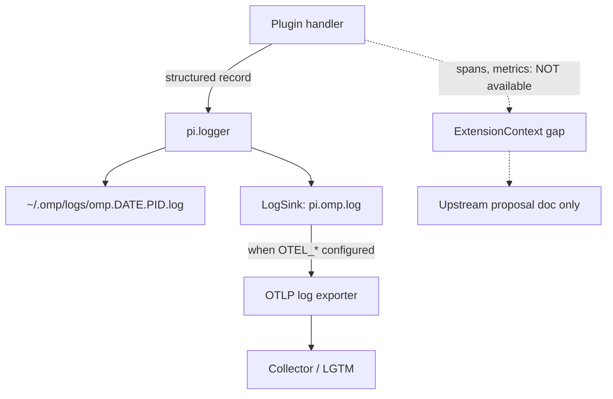
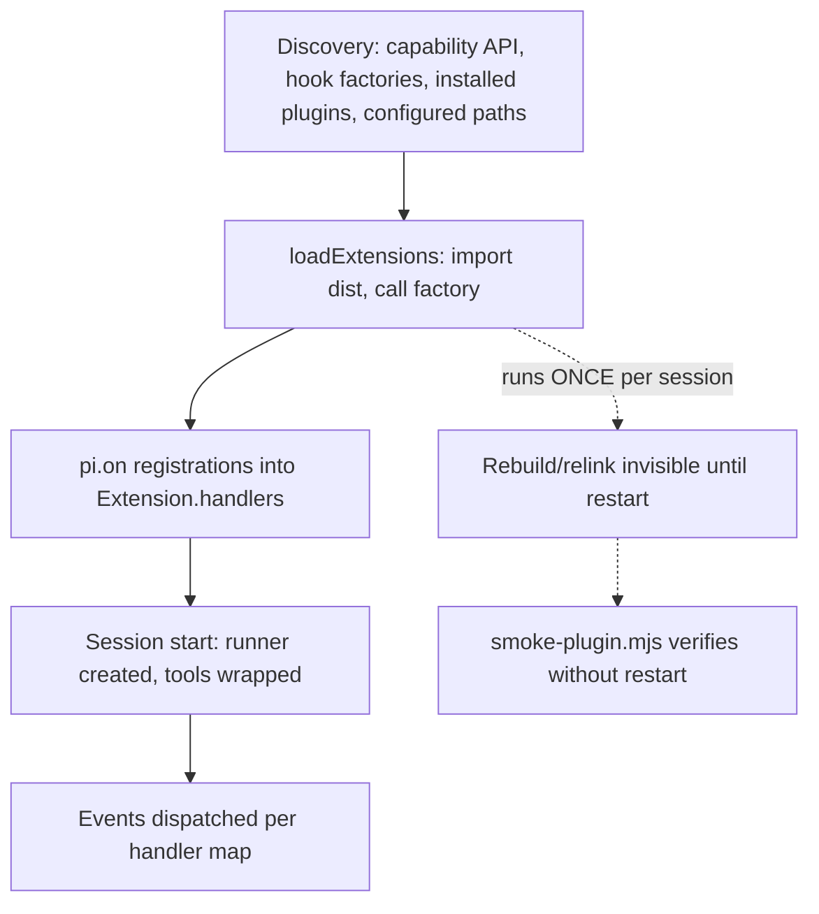

# feat: OMP plugin practice — best practices, telemetry, hardening

## Goal Capsule

- **Objective:** Turn the bootstrapped OMP plugin setup (omp-claude-compat, omp-agent-discipline in `omp/plugins/`, omp-utils in `omp/packages/`) into a documented, instrumented, verifiable development practice: canonical best-practices doc, agent skill, structured telemetry through OMP's existing OTel log sink, smoke-verification tooling, and hardening of both dogfooded plugins.
- **Authority hierarchy:** The vendored OMP source (`repos/oh-my-pi/`, read-only per AGENTS.md S3) is the ground truth for runtime behavior; this repo's packages are the only writable code surface. Upstream changes ship as proposal docs, never edits.
- **Stop conditions:** Both plugins instrumented and green under `pnpm check`; smoke tool proves both dists load and register; doc + skill exist and cross-reference; upstream proposal written; release dry-run still lists both plugins.
- **Execution profile:** Standard depth, docs-plus-code. Vendored repos are never modified.
- **Tail ownership:** Implementer owns verification (`pnpm check`, per-package tests, smoke runs); human owns any commit/publish decision.

---

## Product Contract

### Summary

Codify how OMP plugins are built in this repo — a canonical practices document, an agent-facing skill, a structured-logging telemetry convention that flows through OMP's existing OTel pipeline, a first-class smoke-verification tool, and a hardening pass that brings both dogfooded plugins up to the documented standard. An upstream proposal captures the telemetry API gap (no tracer/meter on `ExtensionContext`) without touching vendored code.

### Problem Frame

The two plugins work, but the knowledge of _how_ they work is trapped in one session's transcript: load-once-at-session-start lifecycle, tsdown import-stripping, settings.json shape duality, `tool_execution_end` vs `tool_result`, the manual-import smoke test. OMP itself ships a full OTEL stack (`telemetry-export.ts`, opt-in via `OTEL_*` env) but walls it off from extensions — plugin authors get only a winston logger and EventBus. Meanwhile the logger already forwards to OTel (`pi.omp.log` sink), so a telemetry channel exists today and is undocumented. Without codification, the next plugin repeats the same ~30-turn debugging session.

### Requirements

**Documentation & skill**

- R1. A canonical best-practices document covers manifest shape, extension event catalog, lifecycle (discovery order, load-once semantics), build config (tsdown + dist verification), test patterns, and distribution (npm + marketplace) for OMP plugins.
- R2. An `omp-plugin-development` agent skill routes agents through authoring → build → verify → publish, referencing the canonical doc and the vendored `repos/oh-my-pi/docs/` (including `docs/skills/authoring-extensions.md`) instead of duplicating them.

**Telemetry**

- R3. A documented structured-logging convention (event names, fields, levels) lets plugins emit telemetry through `pi.logger`, reaching OMP's OTel `pi.omp.log` sink — no OTEL SDK imports in plugins.
- R4. Both dogfooded plugins emit the conventional events: hook execution duration and block/allow decisions (claude-compat), guard ledger fires and clears (agent-discipline).
- R5. An upstream proposal document describes first-class extension telemetry (tracer/meter on `ExtensionContext`, auto-instrumented handler spans in `ExtensionRunner`) as a docs-only artifact.

**Verification & hardening**

- R6. A smoke-verification tool loads a built plugin dist with a mock `ExtensionAPI` and asserts handler registration (and optionally fires a synthetic event), giving agents a session-restart-free verification loop.
- R7. Both plugins conform to the documented dependency and build standards, including `pi-coding-agent` as a peer dependency and a post-build dist-integrity check.

**Extension additions (user-directed)**

- R8. `omp-agent-discipline` gains a `no-skill-delegation` extension that blocks `task`/`agent` tool calls delegating protected skills (the CLAUDE.md S0 rule — `lfg`, all `ce-*` — enforced mechanically): exact `subagent_type`/`agent` field matches and prompt-text delegation-verb patterns block; reference-verb mentions (`see`, `per`, `read`, `according to`) pass.
- R9. All extension configuration converges on one unified `systemfsoftware.toml` file resolved from the project root — the no-delegate skill list is its first citizen; extensions read config as data, never baked-in lists.

### Scope Boundaries

**Deferred to Follow-Up Work**

- Plugin marketplace publication (a `marketplace.json` catalog for `@systemfsoftware` plugins) — install-via-npm already works; a catalog is premature at two plugins.
- Skill benchmark/eval loop per skill-creator audit — the skill ships after the doc stabilizes; evals are a separate iteration.
- omp-utils promotion from `private: true` to published — only if a second consumer appears.

**Outside this product's identity**

- Editing `repos/oh-my-pi/` — vendored, read-only. All runtime gaps become upstream proposals.
- A generic telemetry SDK package for plugins — the convention is structured logging through the host logger; an SDK would duplicate what the host already forwards.

---

## Planning Contract

### Key Technical Decisions

- KTD1. **Canonical doc + routing skill, two artifacts for two consumers.** The doc (`docs/omp-plugin-development.md` — repo docs, human-durable) is the source of truth; the skill (`.claude/skills/omp-plugin-development/SKILL.md`) is a thin routing layer that cites the doc, the vendored `repos/oh-my-pi/docs/*.md`, and this session's failure modes. Rationale: facts rot in skills; a skill that routes stays correct when the doc changes.
- KTD2. **Telemetry = structured `pi.logger`, never OTEL SDK in plugins.** The host owns exporter config (`OTEL_*` env, `telemetry-export.ts`); plugins emit JSON-shaped log records (`{plugin, event, decision, duration_ms, ...}`) that the host's `pi.omp.log` sink forwards to OTel. Rationale: the vendored `ExtensionContext` exposes no tracer/meter (confirmed `types.ts:342-420`); importing OTEL SDK in a plugin would create a second, unconfigured pipeline. Span/meter access is upstream proposal (R5), not code.
- KTD3. **Smoke-verify as a runnable tool, not a remembered trick.** The manual import+mock-api test that proved the dist this session becomes `omp/scripts/smoke-plugin.mjs` (or a small `scripts/` entry): loads a dist path, calls the default export with a recording mock `ExtensionAPI`, prints registered handlers, optionally fires a synthetic `tool_call`. Rationale: load-once semantics make session-restart the only in-harness verification; the tool closes the agent-native loop without it.
- KTD4. **`@oh-my-pi/pi-coding-agent` is a peer dependency, not a runtime dependency.** The host process provides the API at load time; a runtime dep makes `bun install` in `~/.omp/plugins` fetch a second copy of the host SDK. Kept as devDependency (via catalog) for types at build time. Evidence the host resolves peer-declared scopes: `repos/oh-my-pi/packages/coding-agent/src/extensibility/plugins/legacy-pi-compat.ts:130` canonicalizes historical peer scopes onto the host's own registry.
- KTD5. **Post-build dist verification is a test, not a hope.** The tsdown/rolldown import-stripping failure (missing `node:path` in dist) becomes a per-package check: after build, assert the dist parses and its node builtin imports cover what the source uses. Rationale: bundler behavior is not a stable contract; the dist is.
- KTD6. **One `systemfsoftware.toml` per project root, loaded as data via omp-utils.** Extensions resolve config from `ctx.cwd` (same resolution pattern as `.claude/settings.json` in the hook dispatcher), so dogfooding and consumer projects share one convention. The TOML is the single home for extension behavior lists (no-delegate skills now; future guard rules later) — adding a protected skill is a config edit, never a code edit. A shared omp-utils loader parses and caches it per cwd.

### High-Level Technical Design

Telemetry data flow (KTD2 — the channel that exists today):

Plugin lifecycle truths the doc and skill must teach (from `docs/extension-loading.md` + loader source):

### Assumptions

- `pi.logger` accepts structured metadata and forwards it to the OTel sink with fields intact (to be verified in U2 by reading `packages/utils/src/logger.ts` LogSink implementation; if fields are dropped, the convention falls back to JSON-encoded message strings).
- The vendored `docs/skills/authoring-extensions.md` remains the upstream authoring reference; our skill adds repo-specific build/release/verify practice, not a rival tutorial.
- `docs/omp-plugin-development.md` is the right home (repo-level docs); an `omp/docs/` folder is deferred until omp/ has more doc mass.

---

## Implementation Units

### U1. Canonical best-practices document

- **Goal:** Write `docs/omp-plugin-development.md` covering the full plugin practice.
- **Requirements:** R1
- **Dependencies:** none
- **Files:** `docs/omp-plugin-development.md` (create)
- **Approach:** Sections: (1) manifest — `omp.extensions/tools/hooks/commands/features/settings` with `features` as the anti-bloat mechanism; (2) extension event catalog — `pi.on` events, payloads, return contracts (`tool_call` block, `InputEventResult`, fail-closed semantics); (3) lifecycle — discovery order, load-once, `omp plugin link` vs `.omp/extensions/` symlinks, user vs project scope, lockfile; (4) build — tsdown config pattern, ESM `.js` import extensions under nodenext, dist verification (KTD5); (5) testing — temp-dir + mock `ExtensionAPI` + dynamic import isolation (pattern from existing `__tests__/`), ledger-reset via `vi.resetModules()`; (6) telemetry convention (KTD2); (7) distribution — npm publish shape, `files`, marketplace catalog shape (`.omp-plugin/marketplace.json`, `name@marketplace`); (8) failure-mode appendix — this session's debugging cases mapped to their checks.
- **Patterns to follow:** repo docs style (AGENTS.md delta convention); vendored `repos/oh-my-pi/docs/extensions.md` for runtime facts — cite, don't copy.
- **Test scenarios:** Test expectation: none — documentation unit; correctness is enforced by U2–U5 implementing against it and by reviewer read-through.
- **Verification:** Doc exists; every claim traceable to vendored source or repo code (spot-check 5 claims); no contradictions with `repos/oh-my-pi/docs/`.

### U2. Telemetry convention + instrumentation of both plugins

- **Goal:** Define the structured-logging event convention and emit it from both dogfooded plugins.
- **Requirements:** R3, R4
- **Files:** `omp/packages/omp-utils/src/` (shared event-shape helper + types), `omp/plugins/omp-claude-compat/src/hook-dispatcher.ts`, `omp/plugins/omp-agent-discipline/src/xd-retry-guard.ts`, tests in each package's `__tests__/`
- **Approach:** Convention: event names `<plugin>.<noun>.<verb>` (e.g. `claude_compat.hook.executed`, `agent_discipline.guard.fired`); mandatory fields `plugin`, `event`, plus event-specific (`decision`, `duration_ms`, `hook`, `tool_name`). Helper in omp-utils builds the record and emits via the `pi.logger` injected at factory time (no global logger); existing test mocks in both packages omit `logger` and must gain a recording stub, or U2's first instrumentation crashes the suites (adversarial review P1). claude-compat: log `hook.executed` with duration + exit code per hook subprocess, and `tool_call.decision` with block/allow. agent-discipline: log `guard.fired` (ledger add), `guard.cleared` (retry executed), `guard.reminded` (context injection). First read `repos/oh-my-pi/packages/utils/src/logger.ts` LogSink to confirm structured fields survive to OTel; if not, JSON-encode into the message string (Assumption in Planning Contract).
- **Patterns to follow:** existing `audit()` JSONL pattern in xd-retry-guard (replace/align with the convention); ExtensionRunner's own `logger.warn` structured-call style.
- **Test scenarios:**
  - Happy path: firing a hook produces exactly one `hook.executed` record with `duration_ms >= 0` and the exit code (unit test with recording mock logger).
  - Happy path: guard fire → `guard.fired`; matching xd:// write retry → `guard.cleared` (existing test pattern extended).
  - Edge: hook subprocess timeout → record emitted with timeout decision, no throw.
  - Error path: logger method throws → plugin behavior unchanged (telemetry never breaks the guard/dispatcher path).
  - Integration: block decision on a git command produces both the block result and a `tool_call.decision` record with `decision: "block"`.
- **Verification:** New unit tests pass per package; `pnpm --filter` tests green; manual smoke (U3 tool) shows no behavior change.

### U3. Smoke-verification tool

- **Goal:** A runnable script that proves a built plugin dist loads and registers, without a session restart.
- **Requirements:** R6
- **Dependencies:** none (usable by U2, U4, U5)
- **Files:** `omp/scripts/smoke-plugin.mjs` (create)
- **Approach:** CLI: `node omp/scripts/smoke-plugin.mjs <dist-path> [--fire tool_call --tool bash --input '{"command":"git status"}']`. Loads the dist via dynamic import, calls the default export with a recording mock `ExtensionAPI` (`on`, a recording `logger` stub — U2 makes plugins call `pi.logger`, so the mock must provide it or every smoke run crashes — plus minimal context surface), prints registered event handlers; with `--fire`, invokes matching handlers with a synthetic event + mock ctx (`cwd`, `sessionManager.getSessionId`) and prints the result. Exit non-zero on import failure, missing default export, an empty handler set (default export that never calls `pi.on` is a broken extension, not a pass), or handler throw. Keep it dependency-free (node builtins only) so it runs anywhere the repo runs.
- **Patterns to follow:** the ad-hoc `node -e` harness used this session (mock `api.on` collecting into a Map) — formalized.
- **Test scenarios:**
  - Happy path: both current dists report their full handler sets (9 events claude-compat, 3 agent-discipline).
  - Happy path: `--fire tool_call` with a git command against claude-compat in a temp dir with a settings fixture returns the block result.
  - Error path: dist with a thrown import → non-zero exit with the error message.
  - Edge: default export missing → clear failure message, non-zero exit.
  - Edge: default export registers zero handlers → non-zero exit (empty handler set is a broken extension).
- **Verification:** Script runs green against both plugin dists from repo root; failure cases exit non-zero.

### U4. omp-plugin-development agent skill

- **Goal:** `.claude/skills/omp-plugin-development/SKILL.md` that routes agents through the full plugin workflow.
- **Requirements:** R2
- **Dependencies:** U1 (doc to cite), U3 (verify step to teach)
- **Files:** `.claude/skills/omp-plugin-development/SKILL.md` (create); optional `references/` only if the doc cannot be cited directly
- **Approach:** Skill-creator discipline: playbook not encyclopedia. Body: when to activate (create/modify/debug an OMP plugin or extension), the workflow (scaffold package → manifest → build → dist verify → smoke tool → tests → link → session restart caveat → release), and the failure-mode table (symptom → check: extension not firing → load-once; `join is not defined` → dist import check; hooks not matching → settings shape wrapped/unwrapped). Facts live in U1's doc and vendored `repos/oh-my-pi/docs/` — the skill routes with complete-sentence citations, including `repos/oh-my-pi/docs/skills/authoring-extensions.md` for the runtime API tutorial. Description frontmatter pushy with trigger phrases (omp plugin, omp extension, pi.on, hook dispatcher).
- **Patterns to follow:** the removed `.claude/skills/jj-workflow/` shape (recoverable from git history — removed in commit `9ab42d53dc`, no live `.claude/skills/` directory exists today); skill-creator's intent-routed references rule.
- **Test scenarios:** Test expectation: none in code — skill content is verified by the workflow steps it cites being real (U1 doc exists, U3 tool runs) plus a read-through against skill-creator's playbook test ("what does the agent DO differently"). Benchmark evals deferred (Scope Boundaries).
- **Verification:** Skill file loads (frontmatter valid); every citation resolves to an existing file; no fact inlined that lives in U1's doc.

### U5. Plugin hardening pass

- **Goal:** Bring both plugins to the documented standard: peer-dep shape, dist verification, any residual conformance gaps.
- **Requirements:** R7
- **Files:** `omp/plugins/omp-claude-compat/package.json`, `omp/plugins/omp-agent-discipline/package.json`, build/test wiring in both (e.g. `package.json` scripts, possibly a shared dist-check script under `omp/scripts/`)
- **Approach:** Move `@oh-my-pi/pi-coding-agent` to `peerDependencies` + keep in `devDependencies` via catalog for build-time types (KTD4) — verify the devExports/`@systemfsoftware/source` condition still resolves; re-run `pnpm install --no-frozen-lockfile` and both builds. Add a post-build dist-integrity check (KTD5): parse dist, assert node builtin imports present — wire as a test or a `build`-adjacent script; keep it cheap. Fix any other U1-documented gaps found while writing the doc (record each in the unit's execution notes as discovered).
- **Patterns to follow:** sibling packages' dependency shapes in `packages/`; the repo's exports/attw conventions where applicable (attw may be skipped for plugin packages — record the decision in the doc).
- **Test scenarios:**
  - Happy path: `pnpm install` + both builds succeed with peer-dep shape; `omp plugin doctor` stays green (6 ok).
  - Error path: dist-check fails when a node builtin import is stripped (prove by a fixture or temporary source edit, then revert).
  - Integration: `node scripts/release.mjs --dry-run` still lists both plugins after package.json edits.
- **Verification:** `pnpm check`-level per-package gates (typecheck, lint, tests) green; doctor green; release dry-run lists both.

### U6. Upstream extension-telemetry proposal

- **Goal:** A docs-only proposal for first-class extension telemetry in OMP.
- **Requirements:** R5
- **Dependencies:** U2 (the convention the API would formalize)
- **Files:** `docs/omp-upstream-extension-telemetry.md` (create)
- **Approach:** Proposal content: the gap (`ExtensionContext` has no tracer/meter — cite `types.ts` lines, `runner.ts` handler timing exists but is unexposed), the convention plugins use meanwhile (U2), the proposed API (tracer + meter on `ExtensionContext`, auto-instrumented `ExtensionRunner` handler spans with `extension.path`/`event` attributes, error counters), compatibility notes (no-op when OTEL unconfigured). Destination: filed as an issue against the upstream oh-my-pi repository (link recorded in the doc); the doc itself lives in this repo — no vendored edits.
- **Patterns to follow:** proposal = problem/evidence/proposal/compatibility; OTEL GenAI semconv already used in `packages/agent/src/telemetry.ts`.
- **Test scenarios:** Test expectation: none — documentation unit.
- **Verification:** Proposal cites exact vendored file:line evidence; recommendation is implementable without reading this plan.

### U7. no-skill-delegation extension + unified TOML config

- **Goal:** Ship the delegation guard in `omp-agent-discipline` and the `systemfsoftware.toml` config convention it reads from.
- **Requirements:** R8, R9
- **Dependencies:** none (independent of U1–U6; lands in the same package U2/U5 touch, so merge last)
- **Files:** `omp/plugins/omp-agent-discipline/src/no-skill-delegation.ts` (create from the provided extension source), `omp/plugins/omp-agent-discipline/src/index.ts` (combined entry registering both guards, mirroring claude-compat's pattern), `omp/plugins/omp-agent-discipline/tsdown.config.ts` (entry switches to index), `omp/packages/omp-utils/src/` (TOML loader + cache), `systemfsoftware.toml` (repo root, initial `no_delegate_skills` list), `omp/plugins/omp-agent-discipline/__tests__/no-skill-delegation.test.ts` (create)
- **Approach:** Port the attachment source with two fixes: import `ToolCallEvent` from the main package (the `@oh-my-pi/pi-coding-agent/hooks` subpath is the pattern that broke type resolution before), and replace the `../config/no-delegate-skills.json` module-relative read with the omp-utils TOML loader resolved from `ctx.cwd` at event time (load-time module-relative reads fail for linked plugins; cwd resolution matches KTD6). Guard logic unchanged: `subagent_type`/`agent` exact match against the protected set blocks; prompt text must match a delegation-verb pattern AND no reference-verb pattern to block. Combined `index.ts` default export calls `xdRetryGuard(pi)` then `noSkillDelegation(pi)`. Initial TOML: `no_delegate_skills = ["lfg", "ce-brainstorm", "ce-plan", "ce-work", "ce-debug", "ce-commit", "ce-commit-push-pr", "ce-resolve-pr-feedback", "ce-babysit-pr", "ce-code-review", "ce-doc-review", "ce-compound", "ce-ideate", "ce-strategy", "ce-explain", "ce-optimize", "ce-pov", "ce-proof", "ce-worktree", "ce-test-browser", "ce-riffrec-feedback-analysis", "ce-compound-refresh", "ce-simplify-code"]` (the S0 family).
- **Patterns to follow:** `omp-claude-compat/src/index.ts` combined-entry pattern; xd-retry-guard's event-choice lesson (act on `tool_call` where the input keys are raw — attachment already does this correctly).
- **Test scenarios:**
  - Happy path: `task` call with `subagent_type: "ce-work"` → block with the deny message (temp-dir TOML fixture).
  - Happy path: prompt `"invoke the ce-plan skill"` in a `task` call → block; prompt `"per the ce-plan skill, ..."` → pass (reference verb).
  - Edge: empty/missing TOML → guard no-ops (empty protected set), no throw.
  - Edge: non-delegation tool (`bash`) → pass-through.
  - Error path: malformed TOML → loader surfaces a config error, guard fails open (no block) and logs once — a config typo must not freeze all delegation.
  - Integration: both guards register from the combined entry (smoke tool reports `tool_call` + the guard's events).
- **Verification:** New tests green; smoke tool on the rebuilt agent-discipline dist shows both guards' handlers; a live `task` dispatch naming a ce-* skill blocks in a fresh session.

---

## Verification Contract

| Gate                            | Command                                                                                                              | Applies to  |
| ------------------------------- | -------------------------------------------------------------------------------------------------------------------- | ----------- |
| Lint + typecheck + tests (repo) | `pnpm check`                                                                                                         | Global (D1) |
| Per-package tests               | `pnpm --filter @systemfsoftware/omp-claude-compat test` / `pnpm --filter @systemfsoftware/omp-agent-discipline test` | U2, U5      |
| Smoke verification              | `node omp/scripts/smoke-plugin.mjs omp/plugins/omp-claude-compat/dist/index.js` (and agent-discipline path)          | U2, U3, U5  |
| Plugin health                   | `omp plugin doctor`                                                                                                  | U5          |
| Delegation guard                | `pnpm --filter @systemfsoftware/omp-agent-discipline test` covers no-skill-delegation scenarios                      | U7          |
| Release discovery               | `node scripts/release.mjs --dry-run` lists both plugins                                                              | U5          |
| Skill citations resolve         | every path cited in SKILL.md exists                                                                                  | U4          |

## Definition of Done

- `pnpm check` exits 0 from this session after the last edit (AGENTS.md D1).
- `docs/omp-plugin-development.md` written; claims traceable to vendored source or repo code.
- Both plugins emit the conventional telemetry events; new tests green; behavior unchanged under smoke tool.
- Smoke tool exits 0 on both dists and non-zero on a broken dist.
- SKILL.md present, citations resolve, no inlined facts duplicated from the canonical doc.
- Peer-dep shape applied; `omp plugin doctor` 6 ok / 0 errors; release dry-run lists both plugins.
- Upstream proposal doc written with file:line evidence.
- `no-skill-delegation` guard blocks ce-*/lfg delegation and passes reference-verb mentions; `systemfsoftware.toml` loads from project root; combined agent-discipline entry registers both guards.
- Abandoned-attempt artifacts removed (no stray scripts, no dead fixtures from superseded approaches).

---

## Sources & Research

- Vendored runtime truth: `repos/oh-my-pi/docs/extensions.md`, `repos/oh-my-pi/docs/extension-loading.md`, `repos/oh-my-pi/docs/plugin-manager-installer-plumbing.md`, `repos/oh-my-pi/docs/marketplace.md`, `repos/oh-my-pi/docs/skills/authoring-extensions.md`.
- Telemetry surface: `repos/oh-my-pi/packages/agent/src/telemetry.ts`, `packages/coding-agent/src/telemetry-export.ts` (OTLP bootstrap, `pi.omp.agent.*` metrics, `pi.omp.log` sink), `packages/coding-agent/src/extensibility/extensions/types.ts:342-420` (ExtensionContext: no tracer/meter), `runner.ts` (30s handler timeout, `emitError`), `packages/utils/src/logger.ts` (LogSink → OTel).
- Plugin system: `packages/coding-agent/src/extensibility/plugins/types.ts` (PluginManifest), `manager.ts` (link/install/rollback), `marketplace/` (catalogs, `name@marketplace`, `.omp-plugin/marketplace.json` with `.claude-plugin/` fallback).
- Repo learnings: `docs/solutions/tooling-decisions/tsdown-manages-publishconfig-during-build.md`, `docs/solutions/integration-issues/orphaned-tags-block-semantic-release.md`, `docs/solutions/runtime-errors/enobufs-release-monorepo-filter-large-commits.md`, `docs/solutions/tooling-decisions/pnpm-catalogs-for-monorepo-dependency-management.md`, `CONCEPTS.md`.
- Session evidence: load-once lifecycle (~30 turns of debugging), tsdown `node:path` import stripping, settings.json wrapped/unwrapped duality, manual import smoke test proving both dists.
