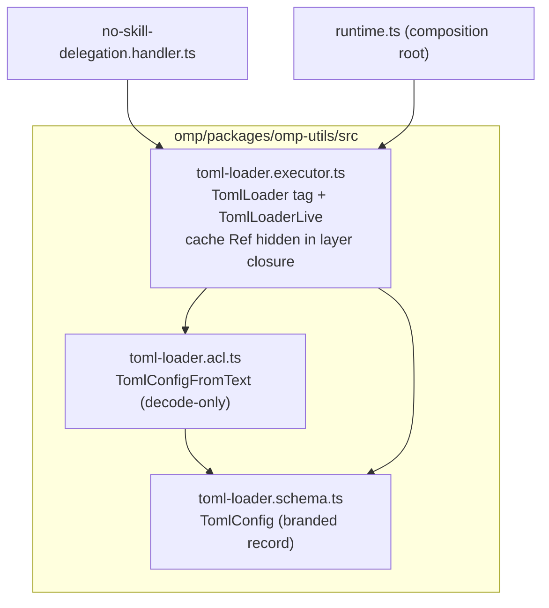

# refactor: Split toml-loader kernel monolith into DMMF cells

## Goal Capsule

- **Objective:** Replace `omp/packages/omp-utils/src/toml-loader.kernel.ts` — a file whose `.kernel.ts` suffix lies on 5 of 7 general-theory axes — with a three-cell DMMF decomposition (schema / acl / executor), hide the memoization cache inside the executor's layer closure, and cut the plugin consumer over to the new surface with no compatibility aliases.
- **Authority hierarchy:** `skill://architect-general-theory`, `skill://architect-dmmf-application`, `skill://architect-module-structure` and the per-cell `architect-*` skills govern cell shape; `omp/AGENTS.md` carries the workspace cell conventions; observable behavior is pinned by the existing tests in `omp/packages/omp-utils/__tests__/toml-loader.test.ts` and the 32 agent-discipline feature tests.
- **Execution profile:** 4 units, dependency-ordered, each landable as one commit.
- **Stop conditions:** any consumer outside `omp/` discovered mid-implementation (escalate before widening the cutover); behavior drift on any pinned test scenario (fix the cells, not the tests).
- **Tail ownership:** root `pnpm check` green and both plugin dists smoke-loading before done is claimed.

---

## Product Contract

### Summary

The TOML config loader introduced by the origin plan (U7) was written as one `toml-loader.kernel.ts` file that fuses a declaration, a foreign-text translation, an escaping cross-process cache, and an I/O sandwich. The `.kernel.ts` tuple is `pure · behavior · no-vocabulary · technology-blind · stateless`; the file is impure, speaks operational vocabulary, names `@std/toml` and `FileSystem`, and owns escaping state. This plan splits it into the three cells the coordinates demand, keeps the cache internal to the executor (user decision), and deletes the redundant `warnedFiles` dedupe set and the consumerless `resetTomlCache`.

### Problem Frame

A mis-suffixed monolith breaks every mechanical rule keyed on cell coordinates: purity lint cannot fire on a file that claims to be a kernel but does I/O, the mutation gate cannot separate declaration from behavior, and the escaping cache sits in a file nothing recognizes as a state owner. The file is also carrying dead machinery — a warn-once set made redundant by its own cache, and a reset function nothing calls.

### Requirements

**Cell decomposition**

- R1. Replace `toml-loader.kernel.ts` with `toml-loader.schema.ts` (branded `TomlConfig` declaration), `toml-loader.acl.ts` (decode-only TOML-text → `TomlConfig` translation), and `toml-loader.executor.ts` (the `load` operation's I/O sandwich), per the cell taxonomy in the origin skills.

**State internalization**

- R2. The per-cwd memoization cache lives inside the executor's layer closure, reachable only through the `load` interface — no public cache tag, no `*.state.ts` cell, no reset API.

**Behavior preservation**

- R3. Observable behavior is unchanged: valid TOML decodes to the branded record; a missing file yields the empty config; malformed or wrongly-shaped TOML logs one warning per cwd and fails open to the empty config; a second `load` for the same cwd in the same process serves the memoized result; `fs.exists` failure propagates (as today).

**Cutover and subtraction**

- R4. The consumers (`no-skill-delegation.handler.ts` and `runtime.ts`) and the agent-discipline feature test use the new surface; the old names (`TomlCache`, `TomlCacheLive`, `resetTomlCache`, `loadToml` as a free function) disappear with no aliases.
- R5. `warnedFiles` and `resetTomlCache` are deleted, not ported.

### Scope Boundaries

**Deferred to Follow-Up Work**

- `GuardCache` in `omp/plugins/omp-agent-discipline/src/runtime.ts` repeats the same exposed-Ref smell and is a candidate for the same hidden-closure treatment; it is a separate refactor.
- The `existing.value as CompiledGuard` cast in `no-skill-delegation.handler.ts` (decode-not-cast violation) is unrelated to the loader and stays untouched.

**Outside this product's identity**

- No change to TOML config semantics (`no_delegate_skills` key, file name, fail-open posture).
- `omp-utils` stays private; no publishing or external-consumer compatibility work.

---

## Planning Contract

### Key Technical Decisions

- KTD1. **Three cells, suffix-matched to coordinates.** The general theory's atlas maps the monolith's contents onto `schema` (pure declaration), `acl` (pure crossing translation, the only cell allowed to import `@std/toml`), and `executor` (impure sandwich). No `workflow` cell: fail-open is boundary error absorption (anomaly B7, Ousterhout clause), not an expert-named verdict a consumer branches on.
- KTD2. **Cache is hidden-closure state, no state cell.** The S axis reads escape, not construction: state unreachable through the interface has not escaped, and the state skill's own quarantine rule does not fire. No consumer reaches into the cache today (`resetTomlCache` has zero callers repo-wide; tests rebuild layers per case), so a public `*.state.ts` would manufacture a leaky interface nobody needs. If a second consumer ever needs a shared or inspectable cache, promote to `toml-loader.state.ts` then — not before.
- KTD3. **Executor is a service: `TomlLoader` tag + `TomlLoaderLive` layer.** A free `loadToml` function cannot hold cross-call state without module-level escape, so hiding the cache forces the service shape. This matches the workspace's existing convention (`HookDispatcherExecutorDeps` is a service tag consumed by its handler; `GuardCacheLive` is a layer in `runtime.ts`). The layer captures `FileSystem`/`Path` at construction and builds the cache `Ref` inside `Layer.effect` — no module-level mutable state.
- KTD4. **ACL is a decode-only `Schema.transformOrFail` from `Schema.String` to `TomlConfig`.** Decode: `@std/toml` `parse`, then `ParseResult.decode(TomlConfig)` so branding applies through the schema contract; encode returns `ParseResult.Forbidden`; `strict: true`; no `as` casts. `@std/toml` appears in exactly this one file.
- KTD5. **Warning dedupe rides the cache, not a second set.** A malformed result is cached per cwd, so the parse path — and therefore the warning — runs at most once per cwd per process. `warnedFiles` is redundant machinery; deleting it is behavior-preserving.
- KTD6. **Clean cutover, no aliases.** `TomlCache`/`TomlCacheLive` → `TomlLoader`/`TomlLoaderLive`; `loadToml` free function → `TomlLoader.load`; `resetTomlCache` deleted. The package is private and dist-inlined into the plugin bundles (see Sources), so no external compatibility surface exists.

### High-Level Technical Design

Cell split and import direction (shell → core, never core → shell):

The `load(cwd)` sandwich, all impure steps at the edges: READ cache (hit → return) → READ `fs.exists` / `fs.readFileString` → DECODE via the ACL → absorb parse/decode/read failures to a warning + empty config → WRITE cache → return. The empty-config fallback is a module-private constant in the executor (single consumer; the schema cell keeps only shared vocabulary).

### Assumptions

- The only consumer of the loader surface is the one in-repo plugin package (omp-agent-discipline). `omp-utils` is private and tsdown inlines it into plugin dists, so the rename cannot break anything outside this repo (verified by repo-wide grep this session).
- Behavior pinned by the current four `toml-loader.test.ts` scenarios plus the 32 agent-discipline feature tests is the complete behavioral contract; the redesign adds one previously-untested fail-open path (schema-shape failure on valid TOML) as a new test scenario.

---

## Implementation Units

### U1. Schema and ACL cells

- **Goal:** Create the declaration and boundary-translation cells the other units consume.
- **Requirements:** R1
- **Dependencies:** none
- **Files:** create `omp/packages/omp-utils/src/toml-loader.schema.ts`, create `omp/packages/omp-utils/src/toml-loader.acl.ts`
- **Approach:** The schema cell carries only `TomlConfig` (`Schema.Record` of string → string array, branded) and its type — the declaration is shared by acl, executor, and the external handler, satisfying the ≥2-consumers rule. The ACL is one decode-only `transformOrFail` per KTD4; `strict: true`; encode `Forbidden`; no casts.
- **Patterns to follow:** `omp/packages/omp-utils/src/context-mode.acl.ts` (package ACL conventions); `skill://architect-acl` gates G1–G4.
- **Test scenarios:**
  - Test expectation: none — declaration and translation cells carry no colocated tests; the ACL is covered transitively through U4's composition tests (anomaly B20: the untested middle is proven at composition altitude).
- **Verification:** `tsc --noEmit` on the package; both files lint clean.

### U2. Executor cell, barrel cutover, kernel deletion

- **Goal:** Create the service-shaped executor with the hidden cache, point the barrel at the new cells, delete the monolith.
- **Requirements:** R1, R2, R4, R5
- **Dependencies:** U1
- **Files:** create `omp/packages/omp-utils/src/toml-loader.executor.ts`, modify `omp/packages/omp-utils/src/mod.ts`, delete `omp/packages/omp-utils/src/toml-loader.kernel.ts`
- **Approach:** `TomlLoader` tag exposes only `load(cwd)`; `TomlLoaderLive` is a `Layer.effect` that captures `FileSystem`/`Path` and builds the cache `Ref` in its closure (KTD3). The sandwich follows the HTD sequence; the empty-config fallback is a module-private decoded constant; the warning message text is preserved. `mod.ts` exports `TomlLoader`, `TomlLoaderLive`, and `type TomlConfig` — nothing else from these cells.
- **Patterns to follow:** `GuardCache`/`GuardCacheLive` layer construction in `omp/plugins/omp-agent-discipline/src/runtime.ts`; executor-service convention of `HookDispatcherExecutorDeps` in `omp/plugins/omp-claude-compat/src/hook-dispatcher.executor.ts`.
- **Test scenarios:**
  - Test expectation: none colocated — the shell is proven by U4's composition tests and U3's existing feature tests.
- **Verification:** package `tsc --noEmit` and lint pass; `toml-loader.kernel.ts` is gone and nothing references it.

### U3. Consumer cutover in omp-agent-discipline

- **Goal:** Move the handler, composition root, and feature test to the new surface.
- **Requirements:** R4
- **Dependencies:** U2
- **Files:** modify `omp/plugins/omp-agent-discipline/src/no-skill-delegation.handler.ts`, modify `omp/plugins/omp-agent-discipline/src/runtime.ts`, modify `omp/plugins/omp-agent-discipline/__tests__/no-skill-delegation.feature.test.ts`
- **Approach:** `loadGuard` yields `TomlLoader` and calls `load(cwd)` instead of the free `loadToml`. `runtime.ts` swaps `TomlCacheLive` for `TomlLoaderLive` in the merged layer. The feature test swaps its two `TomlCacheLive` references. No other handler logic changes — the `GuardCache` and the cast stay as-is (Scope Boundaries).
- **Patterns to follow:** the existing layer-merge style in `runtime.ts` and `seededLayer` in the feature test.
- **Test scenarios:**
  - All 32 pre-existing agent-discipline tests pass unmodified in body (only layer/import lines change) — this is the characterization net for the cutover.
  - The scenario seeded with `no_delegate_skills = ["ce-work"]` in `/project-a/systemfsoftware.toml` still compiles a guard from the loaded config (proves handler → executor → fs wiring end to end).
- **Verification:** `pnpm --filter @systemfsoftware/omp-agent-discipline exec vitest run` green; package `tsc --noEmit` green.

### U4. Loader composition tests rewritten against the service

- **Goal:** Re-pin the loader's behavioral contract at the executor altitude, plus one new fail-open path.
- **Requirements:** R3, R5
- **Dependencies:** U2
- **Files:** modify `omp/packages/omp-utils/__tests__/toml-loader.test.ts`
- **Approach:** Tests provide `TomlLoaderLive` merged over `MemoryFileSystem.layerWith(contents)` and `PathModule.layer`, yield `TomlLoader`, and assert through `load` — the public interface only, never the cache. Each test builds its own layer (fresh cache per case, as today).
- **Patterns to follow:** the current test file's `provide` helper shape; `skill://architect-state` testing guidance (process-lifetime semantics proven by layer rebuild).
- **Test scenarios:**
  - Happy path: seeded valid TOML (`plugins = ["one", "two"]`, `foo = ["bar"]`) decodes to the expected record.
  - Missing file at the cwd yields the empty config.
  - Malformed TOML fails open to the empty config, and a second `load` of the same cwd serves the cached empty result with exactly one warning emitted (proves KTD5 — dedupe without `warnedFiles`).
  - Memoization: after a first `load` returns the parsed config, a second `load` of the same cwd returns the identical result without re-reading (the pre-existing cached-result scenario).
  - Layer isolation: two independently built `TomlLoaderLive` instances do not share cache state (new — proves the hidden-closure lifetime is the layer's, not the module's).
  - Shape failure: valid TOML with a wrongly-typed value (`plugins = "not-an-array"`) fails open to the empty config with a warning (new — previously untested decode-error path, distinct from parse error).
- **Verification:** `pnpm --filter @systemfsoftware/omp-utils exec vitest run` green.

---

## Verification Contract

| Gate          | Command                                                                                                                                         | Applies to |
| ------------- | ----------------------------------------------------------------------------------------------------------------------------------------------- | ---------- |
| Unit tests    | `pnpm --filter @systemfsoftware/omp-* exec vitest run`                                                                                          | U1–U4      |
| Types         | `pnpm --filter @systemfsoftware/omp-* exec tsc --noEmit`                                                                                        | U1–U4      |
| Lint          | `pnpm --filter @systemfsoftware/omp-utils lint` and `pnpm --filter @systemfsoftware/omp-agent-discipline lint`                                  | U1–U4      |
| Build + smoke | `pnpm --filter @systemfsoftware/omp-* build`, then `node omp/scripts/smoke-plugin.mjs <dist>` for both plugins (loader surface is dist-inlined) | U3         |
| Root gate     | `pnpm check` exits 0 from the session after the last edit (AGENTS.md D1/M2)                                                                     | all        |

---

## Definition of Done

- `pnpm check` exits 0 after the last edit; every Verification Contract gate ran in-session without filters.
- `omp/packages/omp-utils/src/toml-loader.kernel.ts` is deleted and a repo-wide grep for `TomlCache`, `resetTomlCache`, and `toml-loader.kernel` returns zero source references.
- Every R1–R5 behavior holds under the rewritten U4 scenarios and the unmodified agent-discipline feature suite.
- No compatibility aliases, shims, or re-exports of the old surface exist anywhere.
- Cleanup: no abandoned scaffolding or dead-end code from alternate cell shapes remains in the diff.

---

## Sources & Research

- Origin plan: `docs/plans/2026-07-20-001-feat-omp-plugin-practice-plan.md` (U7 introduced the loader and the `systemfsoftware.toml` convention).
- Governing skills: `skill://architect-general-theory` (axis derivation, hidden-closure S ruling, anomaly B7/B20), `skill://architect-dmmf-application` (import-DAG, suffix table), `skill://architect-module-structure` (colocation, when-not-to-split), and the cell skills `architect-schema` / `architect-acl` / `architect-executor` / `architect-state` with their references.
- Workspace conventions: `omp/AGENTS.md` cell table; canonical DMMF example in `omp/plugins/omp-claude-compat/src/`.
- Dist-inlining learning: `docs/solutions/build-errors/tsdown-private-dependency-bare-import-dist.md` — the loader surface is bundled into plugin dists, which is why the cutover has no external blast radius and why smoke-loading dists is a required gate.
- Consumer map (repo-wide grep, this session): `loadToml`/`TomlConfig` in `no-skill-delegation.handler.ts`; `TomlCacheLive` in `runtime.ts` and `no-skill-delegation.feature.test.ts`; zero uses of `resetTomlCache` anywhere.
