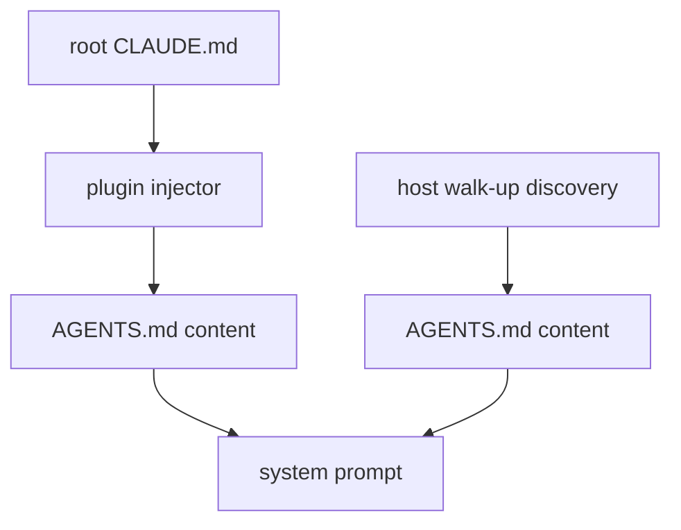
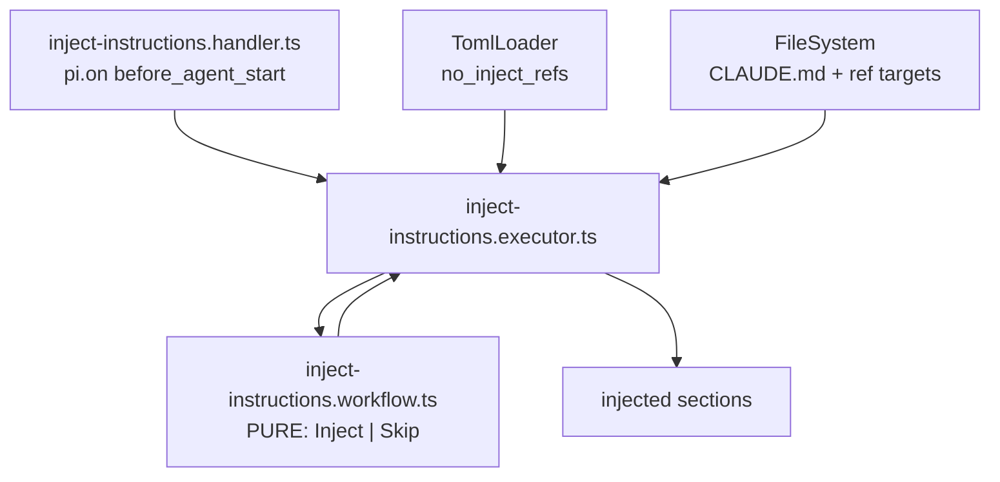

# CLAUDE.md Ref Dedupe - Plan

## Goal Capsule

- Objective: stop `omp-claude-compat` injecting a second copy of `AGENTS.md`, by deciding suppression from the ref target's file name instead of comparing content against the assembled system prompt.
- Product authority: the Product Contract below. R1-R10 are the contract; the Planning Contract and Implementation Units are the means and may be revised by the implementer when the repo disagrees with them.
- Execution profile: three units, dependency-ordered, each independently landable. U3 is the only behavior-visible commit.
- Stop conditions: stop and surface a blocker if the `TomlConfig` decode rejects a valid `no_inject_refs` array, or if the workflow cell cannot satisfy U1's constraints while keeping the pure core single-path (see Outstanding Questions).
- Tail ownership: the caller owns commit, PR, and CI.
- Open blockers: none.

---

## Product Contract

### Summary

Replace the content-comparison dedupe in `omp/plugins/omp-claude-compat/src/inject-instructions.executor.ts` with a skip check on the `@`-ref target's file name. The skip list defaults to `AGENTS.md` in code and is overridable through a flat `no_inject_refs` key in `systemfsoftware.toml`, read via the existing `TomlLoader`.

### Problem Frame

`AGENTS.md` currently reaches the system prompt twice. The host discovers it as a context file in its own right, and the plugin separately injects it as the target of `@AGENTS.md` in the repo's root `CLAUDE.md`. Two independent paths, one file.

The existing guard against this compares the ref target's bytes to the assembled prompt (`rendered.includes(body)`). It does not work, because the host reformats markdown before rendering: the on-disk file uses padded table pipes, the host's rendered copy uses compact ones, so byte containment never holds. The guard also fails in the opposite direction — any short ref whose text happens to appear elsewhere in the prompt is dropped with no signal.

Content identity was the wrong join key. The host's rendering is the least stable surface available to key on, and the plugin has no contract for it: `BeforeAgentStartEvent` exposes only `systemPrompt: string[]`, and extensions cannot contribute context files (`ResourcesDiscoverResult` carries skill, prompt, and theme paths only). The stable fact is which file the ref points at.

### Key Decisions

- Skip by target file name, not content identity. The set of file names the host loads independently is small, documented by convention, and changes rarely; its rendering changes with any formatter tweak.
- The default lives in code, not in the TOML. `TomlLoader` fails open to an empty config when the file is missing or malformed, so a config-side default would let a typo silently restore double-injection.
- A flat top-level key, not a namespaced table. `TomlConfig` decodes the whole file as a record of string arrays, so a table would fail the decode and void every key in the file — see the hazard under Dependencies and Assumptions.
- An explicit empty list disables skipping entirely, and is distinct from the key being absent. Configuration that cannot be turned off is worse than configuration that can.
- Keep the plugin's own ref parser. Delegating expansion to the host's `expandAtImports` was considered and rejected under Scope Boundaries.

### Requirements

**Suppression behavior**

- R1. The injector decides whether to inject an `@`-ref from the ref target's file name. It never compares the target's content against the assembled system prompt.
- R2. A ref whose target file name appears in the skip list is not injected. Every other ref is injected as it is today.
- R3. Each suppressed ref is logged at debug level with its resolved path and the skip-list entry that matched, so a wrongly suppressed ref is diagnosable from logs alone.

**Configuration**

- R4. The skip list defaults to `AGENTS.md` when `systemfsoftware.toml` is absent, unreadable, malformed, or omits the key.
- R5. A `no_inject_refs` array in `systemfsoftware.toml` replaces the default outright.
- R6. An explicit `no_inject_refs = []` disables suppression, and every ref is injected.
- R7. `no_inject_refs` is a flat top-level array of strings, matching the shape of `no_delegate_skills`. No TOML table is introduced.

**Removals and adjacent defects**

- R8. `loadReferencedContent` no longer accepts an `alreadyRendered` parameter, and `inject-instructions.handler.ts` no longer forwards `event.systemPrompt`.
- R9. A ref target that cannot be read is omitted from the injection and logged. The literal string `[error reading <path>]` is never placed in the system prompt.
- R10. Materializing a ref uses a single read attempt rather than an `exists` check followed by a read.

### Acceptance Examples

- AE1. Default with no config
  - **Covers:** R2, R4
  - **Given:** root `CLAUDE.md` containing `@CONSTITUTION.md` and `@AGENTS.md`, and no `systemfsoftware.toml`
  - **Then:** `CONSTITUTION.md` is injected and `AGENTS.md` is not
- AE2. Malformed config still defaults
  - **Covers:** R4
  - **Given:** a `systemfsoftware.toml` that fails to parse or fails the `TomlConfig` decode
  - **Then:** `AGENTS.md` is still suppressed
- AE3. Explicit list replaces the default
  - **Covers:** R5
  - **Given:** `no_inject_refs = ["CONSTITUTION.md"]`
  - **Then:** `CONSTITUTION.md` is suppressed and `AGENTS.md` is injected
- AE4. Empty list disables suppression
  - **Covers:** R6
  - **Given:** `no_inject_refs = []`
  - **Then:** both `CONSTITUTION.md` and `AGENTS.md` are injected
- AE5. Unreadable target does not leak into the prompt
  - **Covers:** R9
  - **Given:** a ref pointing at a path that exists but cannot be read
  - **Then:** the injected output contains no section for that path and no error placeholder text

### Scope Boundaries

- Importing the host's `expandAtImports`. It is reachable only through a blanket `"./discovery/*"` wildcard export, so it substitutes one internal coupling for another, and its in-place expansion would change the shape of injected output for transitive-ref support nobody has requested.
- Widening `TomlConfig` to accept TOML tables. Separate change with blast radius across both plugins that consume the loader.
- Verifying that an `AGENTS.md` ref target sits on the host's walk-up path before suppressing it. No such ref exists in this tree; R3's log is the cheap mitigation if one ever appears.
- Changes to `repos/oh-my-pi/`. Vendored and read-only under AGENTS.md REPO-S3, and upstream is unavailable for this work.
- Fixing the whole-file fail-open in the TOML loader. Recorded below as a hazard, not addressed here.
- Adding a Stryker mutation harness to this package. See Open Questions.

### Dependencies and Assumptions

- `TomlLoader` and `TomlLoaderLive` exist in `omp/packages/omp-utils/src/toml-loader.executor.ts` and are exported from the package barrel `omp/packages/omp-utils/src/mod.ts`. `TomlLoaderLive` requires `FileSystem` and `Path`, both already provided by the plugin's runtime in `omp/plugins/omp-claude-compat/src/runtime.ts`; the layer still needs adding there.
- `omp-claude-compat` already declares `@systemfsoftware/omp-utils` in `devDependencies`, the same dependency through which `omp-agent-discipline` consumes the loader in production.
- Assumption: the host reformats markdown between reading a context file and rendering it. The byte divergence is verified from a live system prompt; the exact stage that normalizes it is not pinned. Nothing in this plan depends on the mechanism, only on the fact that content identity is unreliable.
- Hazard: `TomlConfig` decodes `systemfsoftware.toml` as a single record, and the executor catches decode failure at whole-file granularity. One rejected value discards every key, including `no_delegate_skills`, which would silently disable the delegation guard in `omp-agent-discipline`.
- This change makes that hazard more reachable, because it adds a second consumer plus a documented, user-editable key. The natural typo `no_inject_refs = "AGENTS.md"` — a bare string where an array is required — fires it. The mitigation here is the warning comment required by U3, not a loader fix. For this key the fail-open direction is safe, since the default restores suppression; `no_delegate_skills` fails open to an empty guard, which is not.

### Outstanding Questions

**Deferred to planning** — resolved below

- Base name versus path suffix for matching: resolved as base name in KTD6.
- Where the default skip list constant lives: resolved in U1.
- Whether characterization tests land first: resolved in U3's execution note — the thirteen non-dedupe scenarios are the existing net and stay green unmodified.

**Deferred to implementation**

- The exact `__tests__/` directory `workflow-property-test-shape` accepts. The rule's message says "adjacent to the workflow file" with `testDir` defaulting to `__tests__`, but this package keeps its tests at `omp/plugins/omp-claude-compat/__tests__/` while the two existing property tests in the repo sit at `<pkg>/src/__tests__/`. The rule cannot arbitrate this today because the plugin is unwired (see U1 constraints), so follow the package's existing convention.
- Whether the mutation gate in the root `AGENTS.md` applies. This package has no `mutation` script, and its existing pure-core file `hook-verdict.workflow.ts` already sits in that gap, so the gap pre-exists this change. Surface to the user rather than adding a Stryker harness unasked.
- Whether base-name matching should be narrowed to targets at or above cwd, matching the host's up-only walk, so a downward `@packages/foo/AGENTS.md` ref is not over-suppressed. KTD6 records the limitation; narrowing it is a design change, not a bug fix.
- Whether per-key decode isolation in `TomlLoader` is a prerequisite for documenting `no_inject_refs` to users, given the shared whole-file fail-open.

### Sources and Research

- `omp/plugins/omp-claude-compat/src/inject-instructions.executor.ts` — the current substring guard and the ref-collection loop.
- `omp/plugins/omp-claude-compat/src/inject-instructions.handler.ts` — forwards `event.systemPrompt`; reverts under R8.
- `repos/oh-my-pi/packages/coding-agent/src/system-prompt.ts:337-347` — `dedupeExactContextFiles`, the host's byte-identity dedupe over structured context files.
- `repos/oh-my-pi/packages/coding-agent/src/system-prompt.ts:354-385` — `loadProjectContextFiles`, which runs `expandAtImports` over every discovered context file.
- `repos/oh-my-pi/packages/coding-agent/src/discovery/claude.ts:47-49` — `getProjectClaude` resolves to `<cwd>/.claude`, which is why root `CLAUDE.md` is never discovered and the plugin has a real job.
- `repos/oh-my-pi/packages/coding-agent/src/discovery/at-imports.ts:1-74` — host expansion semantics, rejected as a dependency under Scope Boundaries.
- `repos/oh-my-pi/packages/coding-agent/src/extensibility/extensions/types.ts:585-596` — `ResourcesDiscoverResult`, confirming extensions cannot contribute context files.
- `omp/packages/omp-utils/src/toml-loader.executor.ts` — loader, cache, and the whole-file fail-open.
- `omp/packages/omp-utils/src/toml-loader.schema.ts` — the flat record shape that rules out tables.
- `docs/plans/2026-07-20-001-feat-omp-plugin-practice-plan.md` — origin of the `systemfsoftware.toml` convention (R9, KTD6).
- `docs/solutions/build-errors/tsdown-private-dependency-bare-import-dist.md` — why `omp-utils` must stay in `devDependencies`.
- `docs/solutions/architecture-patterns/workflow-error-channel-gates.md` — the three error-channel gates for a `*.workflow.ts` in this plugin.

---

## Planning Contract

**Product Contract preservation:** R3 gained a log level and a matched-entry field so the requirement is verifiable; no other R-ID was added, removed, or reworded. The three questions previously listed under "Deferred to planning" are resolved in KTD6, U1, and U3.

### Key Technical Decisions

- KTD1. The inject/skip choice becomes a new `*.workflow.ts` cell, not a helper inside the executor. `omp/AGENTS.md`'s decision tree routes any domain decision with two or more outcome variants to a workflow, and CONSTITUTION III.4 requires behavior to live where the mutator can see it. A predicate buried in the executor's loop is shell code, which DMMF5 forbids unit-testing and which the mutation glob does not target.
- KTD2. The workflow returns a bare tagged union, not `Either`. A list-membership test has no failure mode, so there is no error variant to name. This matches `decideNoSkillDelegation`, and `docs/solutions/architecture-patterns/workflow-error-channel-gates.md` explicitly rejects `Either<_, never>` as a workflow signature.
- KTD3. The default is applied with nullish coalescing at the consumer — `config['no_inject_refs'] ?? ['AGENTS.md']` — mirroring `config['no_delegate_skills'] ?? []` in `no-skill-delegation.executor.ts`. This yields R4, R5, and R6 with no special-casing: an absent key is `undefined` and falls back, an explicit `[]` is not `undefined` and disables.
- KTD4. `TomlConfig` is not modified. Its value type is already `Schema.Array(Schema.String)`, which accepts `no_inject_refs = ["AGENTS.md"]` as-is. No ACL and no schema work is in this change.
- KTD5. `@systemfsoftware/omp-utils` stays in `devDependencies`. tsdown externalizes `dependencies` and bundles `devDependencies`; the package is `"private": true` and can never be resolved outside the workspace. Moving it would produce a dist that passes every local check and breaks everywhere else.
- KTD6. Matching is on the target's base name, and it deliberately ignores the directory. The skip list names files the host loads on its own, but `agents-md.ts` walks **up** from cwd and never descends, so an `@packages/foo/AGENTS.md` ref points at a file the host did **not** load and is suppressed anyway. That over-suppression is accepted rather than solved: suppression is all-or-nothing per file name, because the only config escape is dropping `AGENTS.md` from `no_inject_refs`, which restores root duplication. R3's log is what makes an over-suppressed ref discoverable. Narrowing the rule to ancestors of cwd is recorded under Outstanding Questions.

### High-Level Technical Design

The change closes the I/O sandwich that the current executor leaves open. Today the executor interleaves reads and decisions in one loop; after this change it reads everything first, decides once per ref through the pure workflow, then writes.

The handler no longer passes `event.systemPrompt` down; the executor gains `TomlLoader` in its requirements channel, which the runtime provides.

### Assumptions

- The `no_inject_refs` key is read from the same directory the plugin already resolves as `projectDir` (`CLAUDE_PROJECT_DIR`, defaulting to `process.cwd()`), so config and `CLAUDE.md` resolve from one root.
- `TomlLoader`'s per-cwd cache means the config is read at most once per project per process; no additional caching is needed in this plugin.

### Sequencing

U1 and U2 are independent of each other and both precede U3. U3 is the only unit that changes observable behavior, and it changes the executor, the handler, and the four affected feature scenarios in one commit so the tree is never red between units.

---

## Implementation Units

### U1. Pure inject-decision workflow

- **Goal:** a pure cell that answers "should this ref be injected?" from a target path and a skip list.
- **Requirements:** R1, R2, R6
- **Dependencies:** none
- **Files:**
  - `omp/plugins/omp-claude-compat/src/inject-instructions.workflow.ts` (create)
  - `omp/plugins/omp-claude-compat/__tests__/inject-instructions.property.test.ts` (create; see the location question in Outstanding Questions)
- **Approach:** export exactly one function taking a command struct (resolved target path plus the skip list) and returning a closed union of two decision variants. Hold the `AGENTS.md` default as a module-level exported constant in this file so the executor imports it rather than restating the literal. Base-name extraction happens here on the already-resolved path string — the workflow does no I/O and imports no `Path` service.
- **Patterns to follow:** `omp/plugins/omp-agent-discipline/src/no-skill-delegation.workflow.ts` — command struct in, bare tagged union out, all branching through `Match`. Decision variants are `S.TaggedClass`; there is no error variant here (KTD2).
- **Constraints:** the pure core must stay single-path — no `if`, ternary, or loop; dispatch through `Match` so branching is function calls. `@systemfsoftware/oxlint-plugin-effect-workflow` defines `workflow-single-function-export`, `workflow-typeid-required`, `workflow-no-unconstructed-variant`, `workflow-no-panic-vocabulary`, and `workflow-property-test-shape`, but it is **not** listed in `jsPlugins` in `packages/oxlint-config/src/oxlint-config.base.ts`, so none of them fire and no `complexity` override is configured. Treat these as conventions held by matching the reference workflow, not as gates lint will catch. Do not wire the plugin in as part of this change.
- **Test scenarios:** property tests using `it.prop()` from `@effect/vitest` — not plain `it()`, not raw `fc.assert()`, not `it.effect.prop()` (the workflow is pure, so it needs no Effect context).
  - Covers R2. For any skip list and any target whose base name is drawn from that list, the decision is Skip.
  - Covers R2. For any target whose base name is absent from the skip list, the decision is Inject.
  - Covers R6. For an empty skip list, every target decides Inject.
  - Covers KTD6. For any directory prefix, the decision for `<prefix>/<name>` equals the decision for `<name>` — the directory is not consulted.
  - Both variants are constructed by at least one property, satisfying `workflow-no-unconstructed-variant`.
- **Verification:** `pnpm --filter @systemfsoftware/omp-claude-compat exec vitest run` green; the workflow file matches `no-skill-delegation.workflow.ts` on a side-by-side read — one exported function, `Match`-only branching, no `if`/ternary/loop, decision variants as `S.TaggedClass`. Lint does not verify any of this; see U1 constraints.

### U2. Provide TomlLoaderLive in the plugin runtime

- **Goal:** the plugin's `ManagedRuntime` carries `TomlLoader`, so an executor can pull it from context.
- **Requirements:** R4, R5, R6
- **Dependencies:** none
- **Files:** `omp/plugins/omp-claude-compat/src/runtime.ts`
- **Approach:** merge `TomlLoaderLive` into the existing layer, providing it `NodeFileSystem.layer` and `PathModule.layer`. The current runtime composes with `Layer.provideMerge`; keep `NodeCommandExecutor` intact since `hook-dispatcher.executor.ts` depends on it.
- **Patterns to follow:** `omp/plugins/omp-agent-discipline/src/runtime.ts` — `TomlLoaderLive.pipe(Layer.provide(NodeFileSystem.layer), Layer.provide(PathModule.layer))` inside the merged layer. Import via the bare specifier `@systemfsoftware/omp-utils`.
- **Test scenarios:** `Test expectation: none -- layer wiring with no branching behavior; proven by U3's scenarios resolving TomlLoader and by typecheck.`
- **Verification:** `pnpm --filter @systemfsoftware/omp-claude-compat exec tsc --noEmit` green; the existing hook-dispatcher scenarios still pass, confirming no layer regression.

### U3. Executor sandwich, handler revert, and feature-test rewrite

- **Goal:** the executor reads config and files, decides through the workflow, and writes; the content comparison and its parameter are gone.
- **Requirements:** R1, R2, R3, R4, R5, R6, R7, R8, R9, R10
- **Dependencies:** U1, U2
- **Files:**
  - `omp/plugins/omp-claude-compat/src/inject-instructions.executor.ts`
  - `omp/plugins/omp-claude-compat/src/inject-instructions.handler.ts`
  - `omp/plugins/omp-claude-compat/__tests__/inject-instructions.feature.test.ts`
  - `systemfsoftware.toml` (add a commented `no_inject_refs` example showing the array form and the disable form, and warning that a non-array value voids every key in the file, including `no_delegate_skills`)
- **Approach:** pull `TomlLoader` from context, read the skip list with the KTD3 coalescing, and call the workflow once per unique ref. Delete `alreadyRendered`, the `rendered` join, and the `rendered.includes(body)` branch. Drop the `exists`-then-read pair for a single read whose failure path skips the ref and logs (R9, R10). Log each suppression with the resolved path (R3). In the handler, restore the single-argument call and stop forwarding `event.systemPrompt`.
- **Execution note:** the thirteen non-dedupe scenarios in the feature file are the characterization net required by CONSTITUTION III.5 — they must pass unmodified throughout. Do not edit them to accommodate the new shape; if one breaks, the change went further than intended.
- **Patterns to follow:** `omp/plugins/omp-agent-discipline/src/no-skill-delegation.executor.ts` — `const loader = yield* TomlLoader`, `yield* loader.load(cwd)`, coalesce the key, then call the pure decision. The existing Gherkin harness in the feature file: `makeFeature({ it, layer })`, `scenarioLayer: makeFsLayer({...})`, `Gherkin.Do.pipe(Given(...), When(...), Then(...))`.
- **Test scenarios:** rewrite the four content-dedupe scenarios (currently at lines 279-380) and add config coverage. Test layers must provide `TomlLoaderLive` over the same `MemoryFileSystem.layerWith` map, as `omp/plugins/omp-agent-discipline/__tests__/no-skill-delegation.feature.test.ts` does.
  - Covers AE1. `CLAUDE.md` refs `@CONSTITUTION.md` and `@AGENTS.md`, no `systemfsoftware.toml` — output contains the CONSTITUTION content and not the AGENTS content.
  - Covers AE2. `systemfsoftware.toml` contains unparseable TOML — `AGENTS.md` is still suppressed.
  - Covers AE3. `no_inject_refs = ["CONSTITUTION.md"]` — CONSTITUTION suppressed, AGENTS injected.
  - Covers AE4. `no_inject_refs = []` — both injected.
  - Covers AE5. A ref target that fails to read — output contains no section for it and no `[error reading` substring.
  - Covers R2, KTD6. A ref to `@docs/AGENTS.md` is suppressed by base name even though the directory differs.
  - Covers R7. A `systemfsoftware.toml` carrying both `no_delegate_skills` and `no_inject_refs` as flat arrays decodes, and both keys are readable.
  - Covers the hazard under Dependencies and Assumptions. A `systemfsoftware.toml` whose `no_inject_refs` is a bare string rather than an array fails the whole-file decode; assert the documented consequence, that `AGENTS.md` is still suppressed by the default while `no_delegate_skills` reads back empty. This pins the blast radius the warning comment exists to prevent.
  - Covers R3. A suppressed ref emits a log entry carrying its resolved path.
  - Delete the scenario "Should inject an empty ref rather than let it match everything" — it exists only to defend against a content-match edge case that name-based matching cannot have.
- **Verification:** all feature scenarios green; the thirteen characterization scenarios unmodified in the diff; `grep -n 'alreadyRendered\|rendered.includes' omp/plugins/omp-claude-compat/src/` returns nothing.

---

## Verification Contract

| Gate                               | Command                                                                                                 | Applies to |
| ---------------------------------- | ------------------------------------------------------------------------------------------------------- | ---------- |
| Unit and feature tests             | `pnpm --filter @systemfsoftware/omp-claude-compat exec vitest run`                                      | U1, U2, U3 |
| Typecheck                          | `pnpm --filter @systemfsoftware/omp-claude-compat exec tsc --noEmit`                                    | U1, U2, U3 |
| Lint                               | `pnpm --filter @systemfsoftware/omp-claude-compat lint`                                                 | U1, U3     |
| Build                              | `pnpm --filter @systemfsoftware/omp-claude-compat build`                                                | U3         |
| Dist has no bare workspace import  | `! grep -n 'from "@systemfsoftware/' omp/plugins/omp-claude-compat/dist/index.js`                       | U3         |
| Plugin loads outside the workspace | `node omp/scripts/smoke-plugin.mjs omp/plugins/omp-claude-compat/dist/index.js --cwd /tmp/plugin-smoke` | U3         |
| Repo-wide                          | `pnpm check`                                                                                            | all        |

Known gap: the root `AGENTS.md` mandates `pnpm --filter <pkg> mutation` at 100% on changed pure-core files, but this package defines no `mutation` script and its existing `hook-verdict.workflow.ts` already sits in the same gap. U1 adds a second pure-core file to that gap. Do not add a Stryker harness as part of this change; surface it instead.

---

## Definition of Done

- Every gate in the Verification Contract exits 0, run after the last edit.
- `AGENTS.md` appears exactly once in a real session's system prompt, with `CONSTITUTION.md` still injected — the live reproduction that motivated this plan no longer reproduces.
- R1-R10 are each satisfied by a named test or a verified deletion.
- The thirteen characterization scenarios are byte-identical in the diff.
- No `alreadyRendered` parameter, `rendered.includes` call, or `[error reading` literal remains in `omp/plugins/omp-claude-compat/src/`.
- `@systemfsoftware/omp-utils` is still in `devDependencies`, not `dependencies`.
- No file under `repos/` is modified.
- No abandoned scaffolding from discarded approaches remains in the diff.
