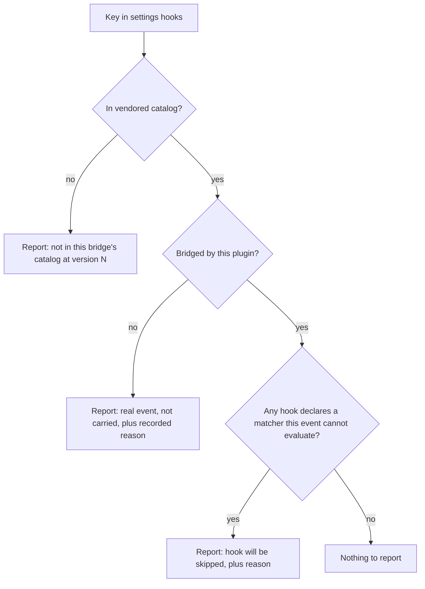
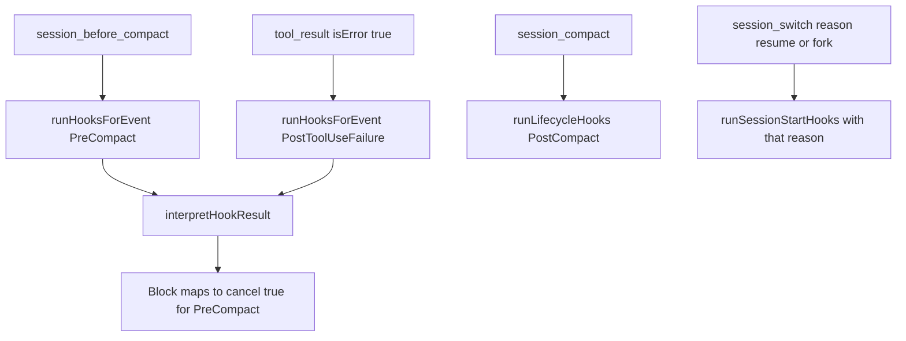

## Goal Capsule

- Objective: every hook a user configures either runs, or is named at session start with the reason it cannot. No third outcome.
- Authority: `CONSTITUTION.md` > root `AGENTS.md` > `omp/AGENTS.md` > this plan. Where this plan and a cell skill disagree, the skill wins and the plan is wrong.
- Execution profile: one package, `omp/plugins/omp-claude-compat`, plus the Claude Code event catalog it vendors. No changes to `omp/packages/omp-utils`.
- Stop conditions: stop and ask if bridging an event would require OMP to expose a signal it does not have, or if honoring a Claude Code decision would need a change in `repos/oh-my-pi` (vendored, read-only).
- Tail ownership: the executor owns verification through `pnpm check` and the mutation gate; it does not own publish or release.

---

## Product Contract

### Summary

Bridge the three Claude Code hook events OMP can carry faithfully, wire the `SessionStart` matchers OMP can actually distinguish, stop firing `SessionStart` hooks on every turn, and replace the session-start warning with a coverage report that separates a typo from a bridge limitation. Twenty-one events stay unbridged by decision, each with a recorded reason.

### Problem Frame

Claude Code documents 30 hook events. The bridge implements 6, so a hook configured on any of the other 24 never runs. Nothing tells the user which case they are in: `hook-dispatcher.handler.ts:87` emits `Ignoring unsupported hook event(s) in settings.json: <name>`, which reads as "your settings file is wrong". For `UserPromptExpansion` — a real Claude Code event — that message is false. The user's config is correct; the bridge is incomplete.

The same list drives a second failure. `ALL_HOOK_EVENTS` in `hook-settings.acl.ts:81` is simultaneously the set of events the bridge _runs_ and the set it _recognizes_, so the two can never be reported apart.

The gap also reaches inside an event that is already bridged. `hook-dispatcher.handler.ts:124` wires OMP's `agent_start` to `runSessionStartHooks` passing the reason `resume`; `agent_start` is a turn boundary, so `SessionStart` hooks currently run on every turn — and a hook scoped `matcher: "resume"` fires on every turn rather than on a resume. Separately, `hook-dispatcher.handler.ts:105` passes the reason `start` where Claude Code's documented matcher value is `startup`, so a `SessionStart` hook scoped with `matcher: "startup"` has never matched. Event-level coverage is not enough; a bridged event whose matcher values are wrong is its own silent failure.

### Requirements

**Event coverage**

- R1. A hook configured on `PostToolUseFailure` runs when a tool throws, and its `tool_name` matcher is honored.
- R2. A hook configured on `PreCompact` runs before compaction, and a blocking verdict cancels it. Cancelling an auto compaction that the context limit triggered surfaces the underlying error rather than freeing context — the bridge reproduces Claude Code's own documented outcome, it does not improve on it.
- R3. A hook configured on `PostCompact` runs after compaction completes.

**SessionStart fidelity**

- R4. `SessionStart` hooks run once per session boundary, never per turn.
- R5. The reason the bridge passes matches Claude Code's documented matcher vocabulary, so `matcher: "startup"` matches a session start.
- R6. `SessionStart` hooks scoped with `matcher: "resume"` run on a mid-session resume, and `matcher: "fork"` on a fork. A cold start under `--resume` emits no resume signal, so it is named as a recorded gap rather than approximated (R9).

**Honesty**

- R7. At session start the bridge reports each configured event it will not run, in one of three classes: a key its catalog does not recognize, a real Claude Code event this bridge does not carry, and a hook on a bridged event whose matcher the bridge cannot evaluate (R8).
- R8. When a hook on a bridged event declares a matcher the bridge cannot evaluate, the bridge skips that hook and names it at session start, rather than firing it as though the matcher matched.
- R9. Each unbridged Claude Code event, each unreachable matcher value, and each partially-reachable matcher value carries a recorded reason in the source, so the report explains _why_ rather than only _that_.
- R10. A hook on one of the 6 already-bridged events keeps its current behavior, except where a requirement names the change. Three changes are named and all three are observable: the `startup` matcher value (R5), the `SessionStart` cadence (R4), and `PostToolUse` no longer firing on a failed tool call, which now routes to `PostToolUseFailure` (R1).

### Scope Boundaries

**In scope:** the three faithfully bridgeable events, the `SessionStart` matcher corrections, the coverage report, the matcher-capability gate, and the `agent_start` mis-wiring.

**Deferred to follow-up work**

- Re-deriving `HookGroups` from a single list. KTD4's compile-time guard already prevents the silent half-landed state, so the derivation is not what makes R7 honest; what it adds is a single source of truth for the bridged set, at the cost of moving all 6 existing events onto a new decode path (see System-Wide Impact). That tradeoff is accepted because the guard holds either way. Any wider refactor of the executor's runner inventory is out.
- A `docs/solutions/` entry recording the OMP-to-Claude-Code event mapping, once this lands and the mapping is stable. That entry is also the drift-detection artifact for the dependency risk below.

**Outside this bridge's identity**

- Bridging events whose contract requires OMP to expose a signal it does not have. Sixteen events fall here. Emitting them from the nearest-looking OMP event would fire hooks at the wrong moment, which is worse than not firing them.
- Bridging events where OMP has a signal but cannot honor the decision the event exists to make. `PermissionRequest` is the clearest: its purpose is allow/deny, and OMP's approval events are observational.
- Changing anything under `repos/` to close a gap. Vendored trees are read-only; a missing OMP signal is an upstream request, not an edit.

### Sources

- Claude Code hooks reference — https://code.claude.com/docs/en/hooks.md — the 30-event table, per-event input schemas, matcher fields, and decision-control semantics. `SessionStart` matcher values at the matcher table; the auto-compaction blocking asymmetry is documented verbatim in the `PreCompact` section.
- OMP extension surface — `omp/plugins/omp-claude-compat/node_modules/@oh-my-pi/pi-coding-agent/src/extensibility/extensions/types.ts:1069-1124` (the 41 `on(event: …)` declarations).
- OMP carries resume and fork: `.../src/extensibility/shared-events.ts:36,45` — `SessionBeforeSwitchEvent` and `SessionSwitchEvent` both carry `reason: "new" | "resume" | "fork" | "handoff"`.
- `session_switch` is mid-session only. Its four emitters are all `AgentSession` runtime methods (`.../src/session/agent-session.ts:9958`, `:10046`, `:11466`, `:16606`); the `resume` emit at `:16606` sits inside `switchSession`. A cold start reaches extensions through `session_start` alone (`.../src/modes/runtime-init.ts:141`), and `SessionStartEvent` is `{ type }` only (`.../src/extensibility/shared-events.ts:29`). Cold-start `--resume` opens the session with `SessionManager.open` (`.../src/main.ts:1327`) and never calls `switchSession`.
- `session_before_compact` honors cancellation: `.../src/extensibility/extensions/runner.ts:683` returns on the first handler result with `cancel`.
- No agent identity on subagent events: `.../src/extensibility/shared-events.ts:186-199` — `AgentStartEvent` is `{ type }` only.
- `agent_start` is a turn boundary: `.../src/autolearn/controller.ts:54`, `.../src/ui/components/status-line/component.ts:197`, `.../src/ui/controllers/event-controller.ts:922`.
- Tool failure is observable: `.../src/extensibility/hooks/tool-wrapper.ts` emits `tool_result` with `isError: true` on catch, and always emits.

---

## Planning Contract

### The coverage map

Eight of the 24 unbridged events have some OMP signal. Only three survive the faithfulness test.

| Claude Code event  | OMP signal                                   | Verdict                                                                                                                                |
| ------------------ | -------------------------------------------- | -------------------------------------------------------------------------------------------------------------------------------------- |
| PostToolUseFailure | `tool_result` with `isError: true`           | Bridge. Failure semantics line up and the `tool_name` matcher is evaluable.                                                            |
| PreCompact         | `session_before_compact`                     | Bridge. `cancel` carries a blocking verdict. Its `trigger` matcher is not evaluable.                                                   |
| PostCompact        | `session_compact`                            | Bridge. Neither side offers decision control, so the contracts match exactly.                                                          |
| PermissionRequest  | `tool_approval_requested`                    | Skip. The event exists to allow or deny; OMP's handler return is ignored.                                                              |
| PermissionDenied   | `tool_approval_resolved` (`approved: false`) | Skip. OMP reports a user's manual decline — the case Claude Code explicitly excludes, since it fires only for auto-classifier denials. |
| SubagentStart      | `agent_start`                                | Skip. No agent identity on the payload, and the event fires for the main agent's loop too.                                             |
| SubagentStop       | `agent_end`                                  | Skip. Same identity gap; a "subagent stopped" hook would fire on every main-agent turn end.                                            |
| MessageDisplay     | `message_update` / `message_end`             | Skip. `displayContent` rewrites Claude Code's rendering; OMP exposes no equivalent.                                                    |

Sixteen have no OMP signal at all: Setup, UserPromptExpansion, PostToolBatch, Notification, TaskCreated, TaskCompleted, StopFailure, TeammateIdle, InstructionsLoaded, ConfigChange, CwdChanged, FileChanged, WorktreeCreate, WorktreeRemove, Elicitation, ElicitationResult.

Coverage is also per-matcher, not only per-event. `SessionStart` accepts five matcher values:

| Matcher   | OMP signal                               | Verdict                                                                                                                                                             |
| --------- | ---------------------------------------- | ------------------------------------------------------------------------------------------------------------------------------------------------------------------- |
| `startup` | `session_start`                          | Runs, once the reason value is corrected from `start` (R5).                                                                                                         |
| `compact` | `session_compact`                        | Runs today.                                                                                                                                                         |
| `resume`  | `session_switch` with `reason: "resume"` | Bridge for a mid-session resume (R6). A cold start under `--resume` emits only `session_start`, so it presents as `startup`; the gap is recorded, not approximated. |
| `fork`    | `session_switch` with `reason: "fork"`   | Bridge (R6).                                                                                                                                                        |
| `clear`   | none                                     | Record as unreachable with a reason.                                                                                                                                |

### Key Technical Decisions

KTD1. Bridge only where the moment and the decision both carry. A hook that fires at the wrong moment is worse than one that does not fire, because the user believes it is working. This resolves the trade-off toward silence over imprecision, and that is a judgment call rather than a law: an observation-only `SubagentStop` would still be useful to a logger, and it is rejected here only because `agent_end` also fires for the main agent's loop, so the hook would fabricate subagent events that never happened. An explicitly-opted, clearly-labelled approximate mode stays a deferred option, not a forbidden one.

KTD2. Split the one list into three. `hook-settings.acl.ts` currently uses `ALL_HOOK_EVENTS` as both "events we run" and "events we recognize", which is why the two cannot be reported apart. Replace with a vendored catalog of all 30 Claude Code events, a derived set of bridged events, and a per-event reason for the rest.

KTD3. Reasons live in the catalog, not in the reporter. Each unbridged event and each unreachable matcher value carries its own reason string, so the report is a projection of the table rather than a switch the next event has to be added to.

KTD4. `HookGroups` stays a statically-declared `S.Struct` and gains a compile-time exhaustiveness guard against the bridged-event list. Deriving the struct dynamically would make the schema type dynamic and lose the field narrowing every consumer depends on. The guard gives the same protection the derivation was for: adding an event without adding its field fails the type check instead of silently dropping that event's hooks at decode.

KTD5. Capability is declared per bridged event, not inferred at the call site. Each bridged event states whether its matcher is evaluable. `PreCompact` declares it is not, which is what lets the bridge skip-and-report rather than fire a `manual`-scoped hook on an auto compaction.

KTD6. `SessionStart` is re-pointed onto the signals that actually carry its matcher vocabulary. Delete the `agent_start` registration — it is a turn boundary, so it was firing session setup every turn. Wire `resume` and `fork` onto `session_switch`, which carries an explicit `reason`. That signal is mid-session only: a cold start under `--resume` emits a bare `session_start`, so it presents as `startup` and the resume gap is recorded rather than approximated — the same faithfulness trade KTD1 makes. `clear` has no OMP signal and is recorded as unreachable.

KTD7. The catalog records the Claude Code documentation version it was drawn from, and the report never claims a key is "not a Claude Code event". It says the key is not in this bridge's catalog and names the version. Vendoring is still the right call — there is no offline authority to validate against at runtime — but a confident typo verdict against a stale catalog would reproduce the exact defect this plan exists to fix, one release later.

### High-Level Technical Design

Classification at session start — one pass over the configured keys, driven by the catalog. Both the unbridged-event report and the non-evaluable-matcher report are projections of the settings file against the catalog, so both are produced here, before any dispatch:

Dispatch-time behavior is then a pure skip with no accumulation — the report was already produced from the same catalog fact:

### Assumptions

- `session_switch` fires before the resumed conversation is installed into the agent — the emit at `agent-session.ts:16606` precedes `replaceMessages` at `:16613` — so a `SessionStart` hook dispatched from it runs before the resumed session's first turn.
- `tool_result` fires for both success and failure, so bridging `PostToolUseFailure` means branching on `isError` inside the existing `tool_result` registration rather than adding a second one.

### Sequencing

U1 is the foundation — U2, U3, U4 all read the catalog it introduces, and its export shape is the contract those units are written against, so settle it first. U5, U6, and U7 are independent of each other. U8 depends on U7 and must land after it, because U7 removes the `agent_start` registration that U8's `session_switch` wiring replaces; landing them in parallel would leave both firing. U7 is the smallest and can land first if a quick win is wanted.

---

## System-Wide Impact

- **Notification budget.** The session-start report is the only channel this bridge has to tell a user anything, and it already fires up to three `ctx.ui.notify` calls (unknown events, unsupported transports, malformed files). Adding two more classes risks drowning the existing warnings. Consolidate the coverage classes into one notification with a line per class rather than adding a call per class.
- **Every existing event's decode path changes.** R10 says the existing 6 keep their behavior, but U2 moves them onto a derived list and a guarded struct. The behavior is intended to be identical; the code path is not. The existing multi-level-settings scenarios are the regression guard and must pass unmodified.
- **`unknownHookEvents` changes meaning.** It currently answers "keys we do not run"; after U2 it answers "keys not in the catalog". Nothing outside the package calls it today, but the contract change should be stated where it is defined.
- **Three observable behavior changes ship here.** `SessionStart` cadence (per-turn to per-session), the `startup` matcher beginning to match, and `PostToolUse` no longer firing on a failed tool call — that case now routes to `PostToolUseFailure`. All three are corrections; all three are visible to anyone whose hooks depend on today's behavior.

---

## Risks & Dependencies

| Risk                                                                                                                                                                                                                                     | Mitigation                                                                                                                                      |
| ---------------------------------------------------------------------------------------------------------------------------------------------------------------------------------------------------------------------------------------- | ----------------------------------------------------------------------------------------------------------------------------------------------- |
| The vendored catalog drifts and a newly-added Claude Code event is reported as an unrecognized key — the exact defect this plan fixes, one release later.                                                                                | KTD7: the report is bridge-relative and names the catalog version; the catalog header records the doc date it was drawn from.                   |
| A `PreCompact` hook that blocks cannot be scoped to manual compaction, because the `trigger` matcher is not evaluable. Blocking an auto compaction that the context limit triggered leaves the session over-limit and fails the request. | The catalog entry documents the asymmetry; U6 asserts the auto-cancel outcome is surfaced rather than silent. Recorded as OQ2 with a default.   |
| Hook-driven approval automation is inert under OMP — `PermissionRequest` and `PermissionDenied` cannot influence the decision. A user relying on hooks for approval policy silently loses it.                                            | The coverage report names both events with their reason; approval policy must be expressed through OMP's native approval configuration instead. |
| Users relying on today's per-turn `SessionStart` misfire lose it.                                                                                                                                                                        | Migration note in U7; the two-turn scenario documents the intended cadence.                                                                     |
| Correctness depends on OMP event semantics in vendored `@oh-my-pi` (read-only). A future release that changes `session_before_compact` or `session_switch` cadence or payload silently breaks faithfulness.                              | Record the `@oh-my-pi` version alongside the mapping in the deferred `docs/solutions/` entry, so drift is detectable.                           |
| A derivation bug in U2 silently drops an event's hooks at decode for all six existing events.                                                                                                                                            | U2's "all 6 decode unchanged" scenarios are load-bearing, not incidental.                                                                       |

---

## Open Questions

- OQ1 (resolved during planning, 2026-07-28). Does `session_switch` with `reason: "resume"` fire on a cold start under `--resume`? No — it is mid-session only; see the `session_switch` entry under Sources for the emitter trace. R6 therefore covers mid-session resume and fork, and cold-start resume is a recorded gap that U1 carries and the U3 report names. No `matcher: "resume"` hook is left silently unrun without being reported.
- OQ2 (deferred, default recorded). Should `PreCompact` map a blocking verdict to `cancel` at all, given it cannot be scoped to manual? Default: yes — Claude Code has the same hazard and this bridge reproduces its documented behavior rather than inventing safer semantics. Revisit if OMP exposes a compaction trigger.
- OQ3 (deferred). Are `clear` and any future `SessionStart` matcher values worth mapping if OMP later exposes signals? Recorded as unreachable for now.

---

## Implementation Units

### U1. Vendor the Claude Code event catalog

- Goal: one table that knows all 30 Claude Code events, which the bridge carries, which matcher values are reachable, and why the rest are not.
- Requirements: R7, R9
- Dependencies: none
- Files: `omp/plugins/omp-claude-compat/src/hook-catalog.schema.ts` (new), `omp/plugins/omp-claude-compat/__tests__/hook-catalog.test.ts` (new)
- Approach: declare the 30 event names, the bridged subset, a matcher-evaluable flag per bridged event, the reachable `SessionStart` matcher values, and a reason string for every unbridged event, every unreachable matcher, and every partially-reachable matcher. `resume` is the partial case: reachable mid-session, absent on a cold start. Record the Claude Code doc version the list was drawn from. This is a declaration cell — `.schema.ts`, not `.acl.ts`, because it decodes nothing — which is also what makes a colocated law test permissible here. Its export shape is the contract U2, U3, and U4 are written against; settle it before they start.
- Patterns to follow: the branded-constant style already used for `ALL_HOOK_EVENTS` in `src/hook-settings.acl.ts:81`.
- Test scenarios:
  - The catalog contains exactly 30 events.
  - The bridged, has-signal-but-skipped, and no-signal sets partition those 30 with no overlap and nothing left over.
  - Every unbridged event has a non-empty reason.
  - Every `SessionStart` matcher value Claude Code documents appears, each marked reachable, unreachable with a reason, or partially reachable with the condition it misses.
  - The catalog's version field is non-empty.
- Verification: the partition scenario fails if an event is added to one set without removing it from another.

### U2. Derive the settings schema from the catalog

- Goal: adding a bridged event cannot silently half-land.
- Requirements: R10
- Dependencies: U1
- Files: `omp/plugins/omp-claude-compat/src/hook-settings.acl.ts`, `omp/plugins/omp-claude-compat/__tests__/multi-level-settings.feature.test.ts`
- Approach: re-export `ALL_HOOK_EVENTS` as the catalog's bridged subset and drive the `mergeSettings` initialization record from it. Keep `HookGroups` a static `S.Struct` per KTD4 and add a compile-time guard that its keys equal the bridged list, so a missing field is a type error rather than a silent decode drop. Note the changed meaning of `unknownHookEvents` where it is defined.
- Patterns to follow: existing `S.optionalWith(S.Array(HookEntry), …)` field shape; leave `LiftFlatSettingsACL` and the wrapped/flat union untouched.
- Test scenarios:
  - Settings naming all 6 currently-bridged events decode with every group populated, exactly as before.
  - `mergeSettings` across user, project, and local sources still concatenates per event and still refuses to let a non-managed source disable managed hooks.
  - A settings file with an unrecognized key still decodes, with the key ignored rather than failing the parse.
  - Removing one event from the bridged list fails the type check rather than dropping its hooks silently.
- Verification: the existing multi-level-settings scenarios pass unmodified; mutation stays at 100% on `hook-settings.acl.ts`.

### U3. Replace the session-start warning with a coverage report

- Goal: the user learns which class their unrun hook falls into, and why.
- Requirements: R7, R8, R9
- Dependencies: U1, U2
- Files: `omp/plugins/omp-claude-compat/src/hook-dispatcher.executor.ts`, `omp/plugins/omp-claude-compat/src/hook-dispatcher.handler.ts`, `omp/plugins/omp-claude-compat/__tests__/hook-dispatcher.feature.test.ts`
- Approach: extend the gap collection to classify each configured key against the catalog, and to flag any hook on a bridged event whose declared matcher that event cannot evaluate. All three classes are static facts about the settings file, so they are computed in the same pass and emitted as one consolidated notification. Keep the existing malformed-file and unsupported-transport reports.
- Patterns to follow: the existing gap-collection and notify shape in `hook-dispatcher.handler.ts:85-99`.
- Test scenarios:
  - A settings file configuring `UserPromptExpansion` reports it as a real Claude Code event the bridge does not carry, and does not claim the settings file is wrong.
  - A settings file configuring `NotAnEvent` reports it as not in the bridge's catalog, and the message names the catalog version.
  - A `PreCompact` hook declaring any matcher is reported as skippable before it ever dispatches.
  - A settings file configuring only bridged events with evaluable matchers produces no coverage report.
  - Multiple classes in one settings file arrive as one notification, not one per class.
  - The existing malformed-settings and unsupported-transport reports still fire alongside a coverage report.
  - The reported reason is the one recorded in the catalog, not a generic string.
- Verification: the `UserPromptExpansion` case reproduces the original report and shows the corrected wording.

### U4. Skip hooks whose matcher cannot be evaluated

- Goal: a matcher the bridge cannot evaluate never silently behaves as a match.
- Requirements: R8
- Dependencies: U1, U3
- Files: `omp/plugins/omp-claude-compat/src/hook-dispatcher.executor.ts`, `omp/plugins/omp-claude-compat/__tests__/hook-dispatcher.feature.test.ts`
- Approach: at dispatch, for a bridged event whose catalog entry declares its matcher non-evaluable, skip any hook carrying a matcher; hooks with no matcher run normally. This is a pure skip with no runtime accumulation — U3 already reported the same fact statically at session start, so the two are projections of one catalog entry rather than a dispatch-to-report channel.
- Patterns to follow: the existing skip-and-continue shape in `runHooksForEvent` where `matchesMatcher` fails.
- Test scenarios:
  - A `PreCompact` hook with `matcher: "manual"` does not run on compaction.
  - A `PreCompact` hook with no matcher runs on compaction.
  - A `PostToolUseFailure` hook with `matcher: "Bash"` runs, proving the gate is per-event rather than a blanket skip.
  - Two hooks on the same non-evaluable event, one matched and one bare, produce exactly one run.
- Verification: the matched-vs-bare pair scenario fails if the gate is removed.

### U5. Bridge PostToolUseFailure

- Goal: a hook on `PostToolUseFailure` runs when a tool throws.
- Requirements: R1
- Dependencies: U1, U2
- Files: `omp/plugins/omp-claude-compat/src/hook-dispatcher.executor.ts`, `omp/plugins/omp-claude-compat/src/hook-dispatcher.handler.ts`, `omp/plugins/omp-claude-compat/__tests__/hook-dispatcher.feature.test.ts`
- Approach: inside the existing `tool_result` registration, branch on `isError`. On failure dispatch the `PostToolUseFailure` entries through `runHooksForEvent` with the documented input fields (`tool_name`, `tool_input`, `tool_use_id`, `error`), reusing the existing normalization helpers. `PostToolUse` keeps firing on success exactly as today.
- Patterns to follow: `runPostToolUseHooks` in `src/hook-dispatcher.executor.ts:350`; payload construction in `runPreToolUseHooks`.
- Test scenarios:
  - A tool result with `isError: true` runs the `PostToolUseFailure` hook and does not run `PostToolUse`.
  - A successful tool result runs `PostToolUse` and does not run `PostToolUseFailure`.
  - The failure payload carries the tool name and the error text on stdin, asserted by a hook that writes what it received.
  - A `tool_name` matcher on the failure event filters correctly across two different tools.
  - A hook exiting 2 surfaces its stderr as a warning; the tool has already failed, so nothing is blocked.
  - Malformed JSON from the failure hook degrades to a warning rather than throwing.
- Verification: reverting the `isError` branch reddens the "does not run PostToolUse on failure" scenario.

### U6. Bridge PreCompact and PostCompact

- Goal: compaction hooks run, and a blocking `PreCompact` verdict cancels compaction.
- Requirements: R2, R3
- Dependencies: U1, U2, U4
- Files: `omp/plugins/omp-claude-compat/src/hook-dispatcher.executor.ts`, `omp/plugins/omp-claude-compat/src/hook-dispatcher.handler.ts`, `omp/plugins/omp-claude-compat/__tests__/hook-dispatcher.feature.test.ts`
- Approach: register `session_before_compact` and map a `Block` decision to `{ cancel: true }`, which the runner honors on the first cancelling handler. Add `PostCompact` to the existing `session_compact` registration alongside the `SessionStart(compact)` dispatch it already performs. `PreCompact` runs through the verdict interpreter; `PostCompact` has no decision control on either side, so it runs through `runLifecycleHooks`.
- Patterns to follow: the block-mapping in `runPreToolUseHooks`; the lifecycle shape in `runLifecycleHooks`.
- Test scenarios:
  - A `PreCompact` hook exiting 2 cancels compaction.
  - A `PreCompact` hook exiting 0 leaves compaction to proceed.
  - A cancelled compaction surfaces its outcome to the user rather than failing silently, so the auto-compaction hazard is visible when it bites.
  - A `PostCompact` hook runs after compaction and its exit code changes nothing.
  - `SessionStart` hooks with `matcher: "compact"` still fire alongside `PostCompact`, proving the added registration joined rather than displaced the existing one.
  - A `PreCompact` hook that times out does not hang compaction.
- Verification: the cancel path fails if the `Block`-to-`cancel` mapping is removed; the co-existence scenario fails if `PostCompact` replaces the `SessionStart` dispatch.

### U7. Stop firing SessionStart hooks every turn

- Goal: `SessionStart` hooks run once per session boundary.
- Requirements: R4
- Dependencies: none
- Files: `omp/plugins/omp-claude-compat/src/hook-dispatcher.handler.ts`, `omp/plugins/omp-claude-compat/__tests__/hook-dispatcher.feature.test.ts`
- Approach: remove the `agent_start` registration at `src/hook-dispatcher.handler.ts:124`. It passes reason `resume`, but `agent_start` is a turn boundary, so every turn re-runs session setup. `session_start` and `session_compact` remain; U8 supplies the real resume signal. This is an observable behavior change for anyone whose unmatched `SessionStart` hook currently runs per turn — note it as such rather than presenting it as invisible.
- Execution note: pin current behavior first — a scenario asserting `SessionStart` hooks run once across two turns fails before the change and passes after.
- Patterns to follow: the surviving `session_start` registration directly above it.
- Test scenarios:
  - Two consecutive agent turns run a `SessionStart` hook exactly once.
  - A session start still runs `SessionStart` hooks.
  - A compaction still runs `SessionStart` hooks with the `compact` matcher.
- Verification: the two-turn scenario is the regression guard and must fail if the registration is restored.

### U8. Make the SessionStart matcher vocabulary real

- Goal: the `SessionStart` matcher values Claude Code documents either match the right moment or are reported as unreachable.
- Requirements: R5, R6, R9
- Dependencies: U1, U7
- Files: `omp/plugins/omp-claude-compat/src/hook-dispatcher.handler.ts`, `omp/plugins/omp-claude-compat/src/hook-dispatcher.executor.ts`, `omp/plugins/omp-claude-compat/__tests__/hook-dispatcher.feature.test.ts`
- Approach: change the reason passed on `session_start` from `start` to `startup` so the documented matcher matches, checking no other call site depends on the old value. Register `session_switch` and dispatch `SessionStart` with the event's own `reason` when it is `resume` or `fork`, ignoring `new` and `handoff`. A cold start under `--resume` emits only `session_start`, so it presents as `startup`; that gap is reported from the catalog rather than approximated. `clear` stays unreachable with a catalog reason.
- Execution note: the `startup` fix is a behavior change to an already-bridged event — pin it with a scenario that fails before the change.
- Patterns to follow: the reason-passing shape in the existing `session_start` and `session_compact` registrations.
- Test scenarios:
  - A `SessionStart` hook with `matcher: "startup"` runs on session start; before the fix it does not.
  - A `SessionStart` hook with `matcher: "resume"` runs on a switch whose reason is resume.
  - A `SessionStart` hook with `matcher: "fork"` runs on a switch whose reason is fork.
  - A switch whose reason is `new` or `handoff` runs neither.
  - A `SessionStart` hook with `matcher: "clear"` never fires and is reported as unreachable.
  - A `matcher: "resume"` hook is named in the coverage report as not covering a cold start under `--resume`, so the partial reachability recorded in U1 reaches the user.
  - An unmatched `SessionStart` hook still runs on every one of these boundaries exactly once.
- Verification: the resume and fork scenarios fail if the `reason` filter is dropped, since an unfiltered `session_switch` would fire on all four reasons.

---

## Verification Contract

| Gate                     | Command                                                                                                                       | Applies to                                                                                 |
| ------------------------ | ----------------------------------------------------------------------------------------------------------------------------- | ------------------------------------------------------------------------------------------ |
| Full repo check          | `pnpm check`                                                                                                                  | All units. Must exit 0 after the last edit.                                                |
| Mutation                 | `pnpm --filter @systemfsoftware/omp-claude-compat mutation`                                                                   | U2 — the changed `.acl.ts` cell. Break at 100.                                             |
| Dist loads and registers | `node omp/scripts/smoke-plugin.mjs omp/plugins/omp-claude-compat/dist/index.js`                                               | U3, U5, U6, U7, U8 — proves handlers still register after the registration changes.        |
| Hook actually executes   | Fire a synthetic failing tool call through the smoke tool with a hook that writes a sentinel file, and assert the file exists | U5 — no other gate proves a bridged event reaches the hook process.                        |
| Coverage report          | Configure `UserPromptExpansion` in a scratch `.claude/settings.json` and start a session                                      | U1, U3 — the originating symptom; the message must name the bridge, not the settings file. |

Mutation covers the `.acl.ts` cell and the catalog's law test; `.executor.ts` and `.handler.ts` behavior is proven by composition tests, not mutation, so a scenario that would pass with the behavior deleted is not adequate coverage there.

Gherkin scenarios go in `__tests__/hook-dispatcher.feature.test.ts` unless they need real elapsed time, in which case they go in a plain vitest file — the Gherkin harness runs on `TestClock`, where `Effect.timeout` never elapses (see `__tests__/hook-timeout.test.ts:14`).

---

## Definition of Done

- Every requirement R1-R10 is exercised by at least one scenario that fails when its implementation is reverted.
- `pnpm check` exits 0 in the same session as the last edit.
- Mutation is 100% on every changed `.acl.ts` file.
- The three bridged events and the four reachable `SessionStart` matcher values run end to end; the 21 unbridged events, the `clear` matcher, and the cold-start-resume gap each carry a recorded reason surfaced by the coverage report.
- No `.acl.ts`, `.executor.ts`, `.handler.ts`, or `.state.ts` file gained its own unit test. The catalog's colocated test is permitted because it is a `.schema.ts` declaration cell.
- No approximated bridge shipped: no event fires from an OMP signal whose moment or decision does not match, and no event was added to the bridged set to make a count look better.
- The three observable behavior changes — `SessionStart` cadence, the `startup` matcher, and `PostToolUse` no longer firing on tool failure — are stated in the commit message, not just the plan.
- Scaffolding from abandoned approaches is removed from the diff.
