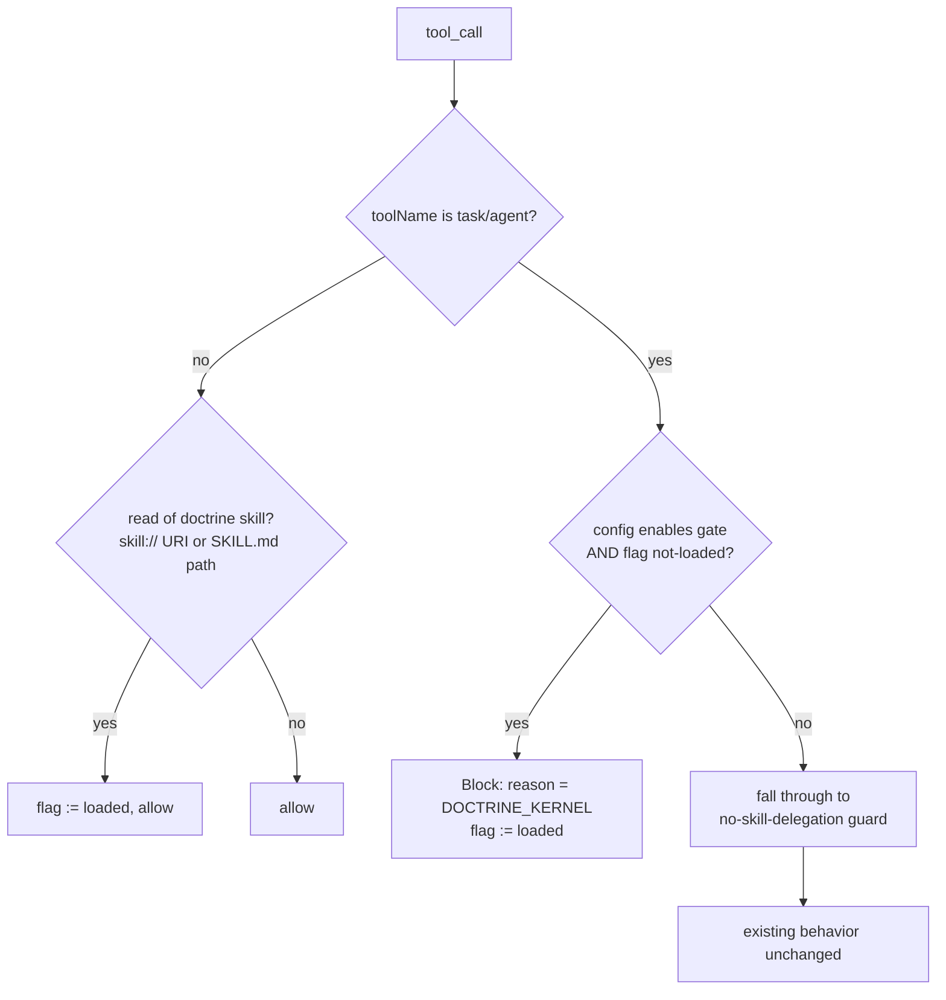
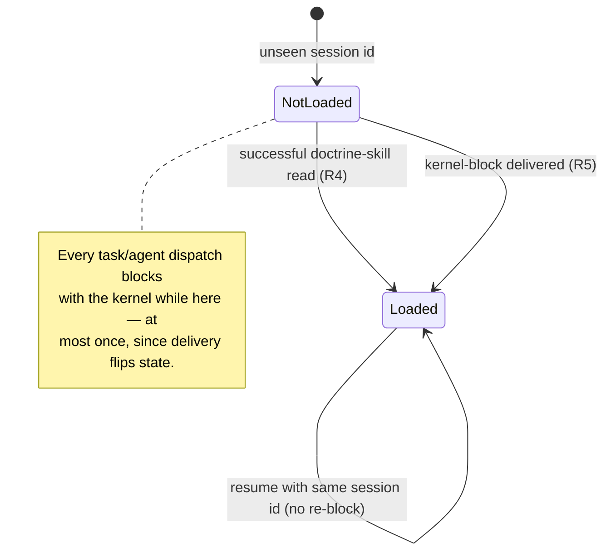

## Goal Capsule

- Objective: every subagent dispatch (`task`/`agent` tool_call) in an opted-in repo either follows a successfully observed doctrine read or is blocked exactly once per session with the doctrine kernel in the denial — no dispatch path skips both, in any session, subagent, or process.
- Authority: `CONSTITUTION.md` (repos/constitution) > root `AGENTS.md` > `omp/AGENTS.md` > this plan. Where this plan and a cell skill disagree, the skill wins and the plan is wrong.
- Execution profile: two packages — `omp/plugins/omp-agent-discipline` (gate + skill) and `omp/packages/omp-utils` (layered TOML config) — plus one key added to the repo-root `systemfsoftware.toml`. No changes in `repos/oh-my-pi` (vendored, read-only).
- Stop conditions: stop and ask if enforcing the gate requires an OMP API surface that does not exist (per-tree flag propagation is explicitly deferred, not a blocker), or if the read-observation payload shape turns out not to carry the model-typed path (research says it does — verify at implementation time before building the matcher).
- Tail ownership: the executor owns verification through `pnpm check`, the mutation gate on changed pure-core cells, and the dist/smoke verification loop. It does not own publish, release, or re-linking the live install — those are presented to the user.

---

## Product Contract

### Summary

Move the task-decomposition doctrine into `omp-agent-discipline` as a plugin-native skill and add a dispatch-doctrine gate: while the doctrine counts as not-loaded for a session, every `task`/`agent` dispatch Blocks with a denial message that itself carries the doctrine kernel; a doctrine-skill read observed by the gate, or one delivered kernel-block, flips the session to loaded. The gate composes ahead of the existing no-skill-delegation guard and is enabled per project through `systemfsoftware.toml`.

### Problem Frame

Delegation discipline currently lives in prose: `~/.claude/CLAUDE.md` W5 mandates a sizing gate and an 8-field unit spec before every dispatch, with the procedure in the standalone `skill://task-decomposition`. Attention-carried mandates fail silently on models or sessions where the skill never activates — the failure the user named: hour-long monolithic dispatches with unverifiable output, and each unverified unit compounding error into dependents. The miss-cost asymmetry (one bad dispatch wastes far more than the guard costs) makes this the rule class that belongs in a gate, not in context.

The plugin already owns the right machinery: a fail-closed `tool_call` gate on `task`/`agent` (no-skill-delegation) and a session-scoped observation-plus-injection pattern (xd-retry-guard). What it does not have is the doctrine itself or a gate that enforces its presence. Shipping the doctrine as a plugin skill also fixes the distribution problem: the plugin is linked at user scope, so its `skills/` directory is discovered in every project with zero per-project setup.

### Requirements

**Doctrine distribution**

- R1. The plugin ships the task-decomposition doctrine at `omp/plugins/omp-agent-discipline/skills/task-decomposition/SKILL.md` with `name` and `description` frontmatter, discoverable by OMP's omp-plugins provider (`requireDescription: true`; layout `skills/<name>/SKILL.md`).
- R2. The skill ships in the published package: `package.json#files` includes `skills`, and `npm pack` output contains the skill tree.

**Gate behavior**

- R3. While the doctrine is not-loaded for a session, a `tool_call` on `task` or `agent` Blocks; the denial `reason` carries the doctrine kernel, a compact compile-time constant.
- R4. An observed, successful read of the doctrine skill — `skill://task-decomposition` including selector (`:raw`, `:N-M`) and sub-path forms, or a filesystem path to the skill's `SKILL.md` in either the workspace or installed layout — flips the session to loaded once the read completes without error; a failed, typo'd, or unresolved read never satisfies the gate.
- R5. A delivered kernel-block flips the session to loaded; at most one kernel-block fires per session, so a blocked-and-retried dispatch proceeds.
- R6. The gate is config-gated: `dispatch_doctrine_skills` in `systemfsoftware.toml` lists the doctrine skill names; absent or empty disables the gate (mirrors `no_delegate_skills`), and this repo's `systemfsoftware.toml` opts in.
- R9. TOML config resolves as a three-layer chain: user-level `~/.omp/systemfsoftware.toml` first, then project `<repo>/systemfsoftware.toml`, then project `<repo>/systemfsoftware.local.toml` — each layer overriding the previous per key (a key present in a later layer replaces that key's whole value; keys absent from later layers inherit). A missing or malformed layer is skipped; the remaining layers still apply.

**Composition and lifecycle**

- R7. The gate registers ahead of no-skill-delegation so a not-loaded block always carries the kernel; once loaded, no-skill-delegation governs exactly as today.
- R8. Loaded state is per-session: any session id the gate has not seen — fresh sessions and each subagent session — starts not-loaded; a resumed session keeps its session id's entry and does not re-block.

### Scope Boundaries

- Out: per-agent-tree flag propagation (needs an OMP API surface — parent/root session id on `ExtensionContext` — that does not exist).
- Out: observing `/skill:<name>` slash-command loads (no tool events fire; would need the `input` event).
- Out: editing `~/.claude/CLAUDE.md` (human-controlled; the W5 pointer re-target is presented, not applied).
- Out: changing the standalone context-engineering `task-decomposition` skill (the plugin copy is canonical for the gate).

### Deferred to Follow-Up Work

- Per-tree flag propagation, gated on an OMP `ExtensionContext` addition.
- Slash-command load observation via the `input` event, if operators rely on `/skill:` loading.
- `~/.claude/CLAUDE.md` W5 slimming — gated on the dogfood behavior delta showing the gate changes dispatch behavior, not merely on the gate shipping (presented for approval, separate change).

### Assumptions

- Loaded semantics are the hybrid (observed successful read OR one delivered kernel-block), not strict-read-only — confirmed in scoping.
- The plugin skill is canonical for the gate; the standalone skill stays for manual reference, and the two may drift (a drift-guard test bounds the kernel excerpt, not the full prose).
- User-level TOML fallback is in scope (R9): user layer first, project overrides, `systemfsoftware.local.toml` overrides again, per key.

---

## Planning Contract

### Key Technical Decisions

- KTD1. Registration order: the gate registers FIRST in `index.ts`. `ExtensionRunner.emitToolCall` short-circuits on the first `{ block: true }`; registered second, the gate's kernel-block could never fire on calls no-skill-delegation also blocks.
- KTD2. The kernel is a compile-time constant in the workflow cell, never read from disk at block time. A 30s handler timeout or a thrown handler produces a kernel-less fail-closed block from the runner; a broken install (skill missing) must not make every block kernel-less forever. Drift between the constant and the skill file is bounded in both directions by a test asserting the kernel constant equals an exact excerpt marked in the skill file — a kernel that silently loses a rule fails, and so does a skill that drops it. The denial reason is structured position-aware: a tool-error denial is the highest-salience channel a tool gate has, and attention within the message follows the U-curve — the enforceable mandate opens the message, the rule block and spec table form the middle, and the closing line repeats the mandate with a pointer to `skill://task-decomposition` for the full doctrine. The kernel stays compact because a single distractor measurably degrades the channel it rides.
- KTD3. Loaded-flip is completion-based: a doctrine read flips the flag only when the read completes without error, so a failed, typo'd, or unresolved read never satisfies the gate. The gate matches the raw model-typed path (per KTD-research, `skill://task-decomposition` arrives verbatim in tool args; the resolved path never appears), records the pending `toolCallId` at `tool_execution_start`, and flips at `tool_execution_end` with `isError: false`. Broken installs still converge via the kernel-block path.
- KTD4. Config key `dispatch_doctrine_skills: string[]`, absent/empty → gate off. The plugin is npm-published; default-off keeps every other user's upgrade behavior unchanged. `TomlConfig` is `Record<string, string[]>` — the key is an array, mirroring `no_delegate_skills`.
- KTD5. The extension module instance is process-global, so the session-id key on the handler's `Map` is the sole isolation mechanism — not a backstop. (`?mtime=` cache-busting fires on extension reload, not per session; the per-session-instance rationale was researched and found wrong.) An unseen session id is not-loaded by absence — there is no `session_start` reset and no flag migration on id change. Eviction (50-entry cap) never drops the entry for the session id currently dispatching, so interleaved subagent sessions cannot lose a live flag.
- KTD6. Cell split per DMMF and the lying-name learning: path/URI matchers are domain-blind pure classifiers in `dispatch-doctrine.kernel.ts`; the verdict decision is `dispatch-doctrine.workflow.ts` (total decision — `Allow | DeliverDoctrine` — so the `never` error channel is legal per CONCEPTS.md); config I/O is `dispatch-doctrine.executor.ts` (`Effect.gen` + `TomlLoader`, the plugin's convention); registration and flag mutation are `dispatch-doctrine.handler.ts`. The workflow stays pure — the flag flip happens in the handler from the verdict, never inside the decision.
- KTD7. The plugin skill ships `SKILL.md` plus its `references/` tree, ported from the standalone `skill://task-decomposition` v1.2.0 with harness-specific anchors (reference hash annotations) dropped. The plugin copy is canonical for the gate.
- KTD8. Config layering lives in `omp-utils`, not the plugin: `TomlLoader.load(cwd)` resolves user (`~/.omp/systemfsoftware.toml`) → project (`<cwd>/systemfsoftware.toml`) → local (`<cwd>/systemfsoftware.local.toml`) with per-key whole-value override (the gitconfig model — a later layer replaces a key's value, never concatenates arrays). The merge is a pure function in its own kernel cell so the mutation gate covers precedence; the adapter owns the reads. Fail-open per layer: a missing or malformed layer decodes as empty and the remaining layers still apply (existing loader precedent, now granular instead of whole-file). The per-cwd cache caches the merged result, so edits still take effect next session. Consumers (`no_delegate_skills`, `dispatch_doctrine_skills`) call `load` unchanged — the chain is transparent to them.

### High-Level Technical Design

Gate decision flow, per `tool_call`:



Session lifecycle:



### Alternatives Considered

- Strict-read-only enforcement (only an observed read counts) — rejected: read-tracking is fragile (slash-command loads are unobservable; resolved-path reads depend on layout), and a session that never reads would block every dispatch forever. The hybrid delivers the doctrine at the decision point instead of demanding it was fetched.
- Always-on gate with no config key — rejected: the plugin is npm-published; default-on changes every other user's sessions on upgrade. Config-gated mirrors `no_delegate_skills`.
- A new dedicated plugin — rejected: the learnings (`docs/solutions/integration-issues/comment-checker-hook-silently-bypasses-on-patch-mode-edit.md`) and the cell conventions both live in this package; a second plugin duplicates the runtime, the TOML wiring, and the test harness for zero isolation gain.
- Executor-free single-file guard (xd-retry-guard shape) — rejected: the gate needs TOML config (I/O) and a named decision union; that is exactly the workflow/executor/handler split.
- Deliver the kernel via the `context` event (the xd-retry-guard injection pattern) on first dispatch instead of blocking — rejected as the primary mechanism: a passive injection is the same attention channel that already failed (the model scrolls past it), while a block forces the doctrine into the dispatch decision path. Injection remains the documented fallback if dogfood shows blocked dispatches are not retried.
- Rely on the standalone `~/.claude/skills/task-decomposition` copy and skip the port — rejected: the plugin copy is versioned with the gate that enforces it, makes the published package self-contained, and gives the drift-guard a canonical target; the standalone copy stays for manual reference.

### Output Structure

```text
omp/plugins/omp-agent-discipline/
  skills/
    task-decomposition/
      SKILL.md                  # doctrine, canonical for the gate (name + description frontmatter)
      references/               # sizing-gate, dispatch-contract, research-grounding (ported)
  src/
    dispatch-doctrine.kernel.ts     # pure matchers: delegator tool, skill-read path forms
    dispatch-doctrine.workflow.ts   # Allow | DeliverDoctrine decision + DOCTRINE_KERNEL constant
    dispatch-doctrine.executor.ts   # TomlLoader config read (dispatch_doctrine_skills)
    dispatch-doctrine.handler.ts    # pi.on registrations, session-keyed flag Map
    index.ts                        # gate registered FIRST
  __tests__/
    dispatch-doctrine.feature.test.ts
  package.json                    # files: ["dist", "skills"]
systemfsoftware.toml              # dispatch_doctrine_skills = ["task-decomposition"]
```

---

## Implementation Units

### U1. Doctrine skill and packaging

- **Goal:** the plugin package contains the doctrine skill in the discoverable layout, and the published tarball carries it.
- **Requirements:** R1, R2
- **Dependencies:** none
- **Files:** `omp/plugins/omp-agent-discipline/skills/task-decomposition/SKILL.md` (create), `omp/plugins/omp-agent-discipline/skills/task-decomposition/references/` (create), `omp/plugins/omp-agent-discipline/package.json` (modify — add `"skills"` to `files`; do not touch `exports`/`publishConfig.exports`, S4)
- **Approach:** port the standalone `skill://task-decomposition` (v1.2.0) content: GATE/SPEC/CHECK/FENCE rule block, sizing gate, 8-field unit spec, surface classification, dispatch contract, context-isolation and acceptance-gate sections, references tree. Frontmatter keeps `name: task-decomposition` and a trigger-rich `description` (required by `requireDescription: true`). Drop the reference-hash annotations from the port; the drift-guard test in U3 covers the kernel excerpt.
- **Patterns to follow:** frontmatter and section shape of the source skill; discovery contract in `repos/oh-my-pi/packages/coding-agent/src/discovery/helpers.ts` (`scanSkillsFromDir`).
- **Test scenarios:**
  - `Test expectation: none` for the markdown itself (content port).
  - Packaging: `npm pack` in the package directory lists `skills/task-decomposition/SKILL.md` in the tarball contents.
  - Discovery shape: the skill file parses with `name` and `description` frontmatter (asserted by the drift-guard test's parse step in U3).
- **Verification:** `npm pack --dry-run` output contains the skill tree; `pnpm --filter @systemfsoftware/omp-agent-discipline build` stays green (skill files are package assets, not build input).

### U2. Pure cells: kernel matchers and verdict workflow

- **Goal:** the decision and the path classification exist as pure, mutation-gated cells.
- **Requirements:** R3, R4, R5 (decision half)
- **Dependencies:** none (parallel with U1)
- **Files:** `omp/plugins/omp-agent-discipline/src/dispatch-doctrine.kernel.ts` (create), `omp/plugins/omp-agent-discipline/src/dispatch-doctrine.workflow.ts` (create), `omp/plugins/omp-agent-discipline/__tests__/dispatch-doctrine.feature.test.ts` (create — pure-cell scenarios land here alongside handler scenarios in U3, one feature file per existing convention)
- **Approach:** kernel: `isDelegatorTool` (`task`/`agent`, lowercase — parity with no-skill-delegation), `matchesDoctrineSkillPath(path, skills)` handling `skill://<name>` with selector stripping (`:raw`, `:N-M`), sub-paths under the skill baseDir, and filesystem paths ending in `skills/<name>/SKILL.md` with `~` expansion; no realpath/fs calls (pure string normalization only — the read attempt is matched on the typed string per KTD3). Workflow: `CheckDispatchCommand` + `Allow | DeliverDoctrine` verdict as `S.TaggedClass` with TypeId symbols, `Match.value`/`Match.tag`/`Match.exhaustive`, and the `DOCTRINE_KERNEL` constant (4-rule YAML block + sizing gate + 8-field spec summary + dispatch contract — compact; the full doctrine is the skill).
- **Execution note:** load `skill://architect-dmmf-application` before creating the cells (mandated by `omp/AGENTS.md` for new decision cells); implement the workflow test-first.
- **Patterns to follow:** `src/no-skill-delegation.workflow.ts` (TaggedClass/TypeId/Match shape), learning `docs/solutions/architecture-patterns/workflow-error-channel-gates.md` (named variants, total-decision rule).
- **Test scenarios:**
  - Happy path: not-loaded + `task` dispatch → `DeliverDoctrine` whose `reason` contains the kernel marker; loaded + dispatch → `Allow`; non-delegator tool → `Allow`.
  - Edge cases: `skill://task-decomposition:raw` and `skill://task-decomposition:10-40` match; `skill://task-decomposition/references/sizing-gate.md` matches; workspace path `omp/plugins/omp-agent-discipline/skills/task-decomposition/SKILL.md` matches; installed-layout path under `~/.omp/plugins/node_modules/...` matches; `skill://task-decomposition-extra` does NOT match (prefix trap); empty path, non-skill paths, and other skill names do not match.
  - Error paths: none — total decision, no error channel (assert exhaustiveness via a non-variant input rejected at compile time).
  - Config: empty `dispatch_doctrine_skills` and absent key both yield `Allow` regardless of flag (gate off, R6).
- **Verification:** feature tests green; Stryker mutation 100% on both new pure cells (delete `reports/stryker-incremental.json` first — the cached score is not evidence, root AGENTS.md).

### U3. Executor, handler, and composition wiring

- **Goal:** the gate is live in the extension: config loaded, flag stored per session, registrations ordered, telemetry emitted.
- **Requirements:** R3–R8 (wiring half)
- **Dependencies:** U1, U2
- **Files:** `omp/plugins/omp-agent-discipline/src/dispatch-doctrine.executor.ts` (create), `omp/plugins/omp-agent-discipline/src/dispatch-doctrine.handler.ts` (create), `omp/plugins/omp-agent-discipline/src/index.ts` (modify — register the gate FIRST), `omp/plugins/omp-agent-discipline/__tests__/dispatch-doctrine.feature.test.ts` (extend from U2)
- **Approach:** executor mirrors `no-skill-delegation.executor.ts` (`Effect.gen`, `yield* TomlLoader`, reads `dispatch_doctrine_skills`). Handler registers `tool_call` (the delegator-tool gate) and `tool_execution_start`/`tool_execution_end` (read observation: at start, match `input.path` — accessed with a `typeof path === 'string'` guard, the `readString`/`decodeRecord` convention — and record the pending `toolCallId`; at end, flip only when `isError` is false). Flag storage is a module-level `Map` keyed by `ctx.sessionManager.getSessionId()`, capped at 50 entries with eviction that never drops the currently dispatching session's entry (KTD5); no `session_start` reset — an unseen id reads as not-loaded by absence, and a resumed session keeps its id's entry (R8). Flag mutation happens in the handler from the verdict — the workflow returns `DeliverDoctrine`, the handler flips and returns `{ block: true, reason }`. Handler body wraps in try/catch and uses `runSafe` (fail-closed convention). Telemetry via `createTelemetry()`: `agent_discipline.dispatch.blocked`, `agent_discipline.doctrine.loaded`, and — on allowed dispatches — `agent_discipline.dispatch.observed` carrying deterministic spec-shape fields (batch size, and whether the spec text names `objective`, `write_scope`, `verify_commands`); the pre-activation baseline and the two-week effectiveness checkpoint are computed from this event, never from manual sampling. All events carry `plugin` + `event` fields and never throw.
- **Patterns to follow:** `src/no-skill-delegation.handler.ts` (lazy imports, `runSafe`), `src/xd-retry-guard.handler.ts` (module Map, synthetic-event shape), `omp/packages/omp-utils/src/runtime-lifecycle.handler.ts` (session_start anchor).
- **Test scenarios:**
  - Happy path: fresh mock session, `tool_call` on `task` → block with kernel marker; repeat dispatch → allowed (flag flipped by the block, R5).
  - Read observation: `tool_execution_start` on `read` with `input.path = 'skill://task-decomposition'` followed by `tool_execution_end` with `isError: false` → subsequent `task` dispatch allowed (R4); the same with `isError: true` → the next dispatch still blocks (failed reads never satisfy the gate); same success path via a filesystem-path form.
  - Ordering: with both guards active and flag not-loaded on a protected-skill dispatch, the block reason is the kernel (gate first, R7); after loaded, the same dispatch carries the no-skill-delegation message.
  - Config: no `dispatch_doctrine_skills` key → `task` dispatch allowed with no block ever (R6); malformed TOML → gate off (fail-open, matching loader precedent).
  - Lifecycle: an unseen session id blocks its first dispatch; the same id after a simulated resume proceeds without re-block (R8); two session ids interleaved keep independent flags; with the map at cap, eviction never drops the entry of the session id currently dispatching (KTD5).
  - Drift guard: the `DOCTRINE_KERNEL` constant equals an exact excerpt marked in `skills/task-decomposition/SKILL.md` (read from the package tree) — fails when either copy drifts in either direction; the same parse asserts `name: task-decomposition` and a non-empty `description` in the frontmatter (R1); a missing skill file fails the test with a message naming the absent path (stale-reference guard).
  - Isolation: `vi.resetModules()` + dynamic import per test, following `xd-retry-guard.feature.test.ts`.
- **Verification:** feature tests green; `node omp/scripts/smoke-plugin.mjs omp/plugins/omp-agent-discipline/dist/index.js --fire tool_call --tool task --input '{"task":"x"}'` prints the kernel-block; smoke exits non-zero on any handler throw.

### U4. Repo opt-in, build, and distribution verification

- **Goal:** the gate is enabled for this repo and the package verifies end-to-end for distribution.
- **Requirements:** R2, R6
- **Dependencies:** U1, U3
- **Files:** `systemfsoftware.toml` (modify — add `dispatch_doctrine_skills = ["task-decomposition"]`)
- **Approach:** add the key at repo root. Then the distribution loop: build, dist integrity checks, pack inspection, and the synthetic-cwd smoke run. Present (do not run) the activation step — `omp plugin link omp/plugins/omp-agent-discipline` or publish, then session restart — since the live install is npm v1.0.6 and extensions load once per session.
- **Test scenarios:**
  - `Test expectation: none` for the TOML edit (config); covered by U3's config scenarios against seeded TOML.
- **Verification:** `pnpm check` green; `grep 'from "@systemfsoftware/' omp/plugins/omp-agent-discipline/dist/index.js` empty (devDep rule, learning #1); `npm pack` contains `skills/`; smoke with `--cwd /tmp/plugin-smoke` green; dogfood instructions written in the handoff.

---

### U5. Layered TOML config in omp-utils

- **Goal:** `TomlLoader.load` resolves the three-layer chain (user → project → local) with per-key override, transparently to all consumers.
- **Requirements:** R9
- **Dependencies:** none (independent of U1–U3; U4's repo opt-in composes with it)
- **Files:** `omp/packages/omp-utils/src/toml-loader-merge.kernel.ts` (create — pure per-key merge), `omp/packages/omp-utils/src/toml-loader.adapter.ts` (modify — read three paths, merge, cache merged result), `omp/packages/omp-utils/__tests__/toml-loader.feature.test.ts` (create or extend, following the existing gherkin + MemoryFileSystem pattern)
- **Approach:** the merge is pure and domain-blind — `mergeLayers(user, project, local)` folding per-key whole-value override — so it lands in a kernel cell the mutation gate covers (KTD8). The adapter reads the three paths (`~/.omp/systemfsoftware.toml`, `<cwd>/systemfsoftware.toml`, `<cwd>/systemfsoftware.local.toml`), decodes each through the existing `TomlConfigFromText` ACL with per-layer fail-open, merges, and caches the merged config per cwd. The user home path resolves through the same mechanism the runtime uses for `~` expansion — no hardcoded absolute paths.
- **Execution note:** load `skill://architect-dmmf-application` before creating the kernel cell (mandated by `omp/AGENTS.md` for new cells); implement the merge test-first.
- **Patterns to follow:** `toml-loader.adapter.ts` (cache + fail-open precedent), `toml-loader.acl.ts` (ACL1 canonical transformOrFail shape).
- **Test scenarios:**
  - Happy path: user sets key A, project sets key B — merged config has both; user sets A, project sets A — project's value wins; project sets A, local sets A — local's value wins; user sets A, local sets A — local wins (full precedence order exercised).
  - Edge cases: all three layers missing → empty config (today's behavior); only user layer present; array values are replaced whole, never concatenated.
  - Error paths: malformed project TOML → user-layer keys still apply (per-layer fail-open); malformed user TOML → project keys still apply; malformed local → project wins.
  - Integration: a consumer reading `no_delegate_skills` sees the merged value with no consumer-side change; the per-cwd cache returns the same merged object on repeat loads.
- **Verification:** omp-utils feature tests green; Stryker 100% on `toml-loader-merge.kernel.ts` from a clean run.

---

## Verification Contract

| Gate                                     | Command                                                                                                                                                                               | Applies to        | Done signal                                                                                           |
| ---------------------------------------- | ------------------------------------------------------------------------------------------------------------------------------------------------------------------------------------- | ----------------- | ----------------------------------------------------------------------------------------------------- |
| Repo verification                        | `pnpm check`                                                                                                                                                                          | all units         | exit 0 after the last edit                                                                            |
| Package tests                            | `pnpm --filter @systemfsoftware/omp-agent-discipline exec vitest run`                                                                                                                 | U2, U3            | all feature scenarios green                                                                           |
| Utils tests                              | `pnpm --filter @systemfsoftware/omp-utils exec vitest run`                                                                                                                            | U5                | all layer/merge scenarios green                                                                       |
| Package typecheck                        | `pnpm --filter @systemfsoftware/omp-agent-discipline exec tsc --noEmit`                                                                                                               | U2, U3            | exit 0                                                                                                |
| Utils typecheck                          | `pnpm --filter @systemfsoftware/omp-utils exec tsc --noEmit`                                                                                                                          | U5                | exit 0                                                                                                |
| Mutation                                 | `pnpm --filter @systemfsoftware/omp-agent-discipline mutation` and `pnpm --filter @systemfsoftware/omp-utils mutation` (delete each `reports/stryker-incremental.json` first)         | U2, U5 pure cells | 100% on `dispatch-doctrine.kernel.ts`, `dispatch-doctrine.workflow.ts`, `toml-loader-merge.kernel.ts` |
| Dist integrity                           | `grep 'from "@systemfsoftware/' omp/plugins/omp-agent-discipline/dist/index.js`                                                                                                       | U3, U4            | no output                                                                                             |
| Smoke                                    | `node omp/scripts/smoke-plugin.mjs omp/plugins/omp-agent-discipline/dist/index.js --fire tool_call --tool task --input '{"task":"x"}'` — plain and `--cwd /tmp/plugin-smoke` variants | U3, U4            | kernel-block printed, exit 0                                                                          |
| Packaging                                | `npm pack --dry-run` in the package dir                                                                                                                                               | U1, U4            | `skills/task-decomposition/SKILL.md` listed                                                           |
| Dogfood (presented, not run by executor) | `omp plugin link omp/plugins/omp-agent-discipline` + session restart, then one real `task` dispatch                                                                                   | U4                | first dispatch blocks with kernel; the retried dispatch passes the deterministic spec-shape check     |

---

## Definition of Done

- [ ] All four units landed; `pnpm check` exits 0 after the last edit.
- [ ] Mutation gate at 100% on the two new pure cells from a clean (non-incremental) run.
- [ ] Smoke tool demonstrates the kernel-block on a synthetic `task` call.
- [ ] `npm pack` carries the skill tree; the skill has `name` + `description` frontmatter.
- [ ] `systemfsoftware.toml` opts the repo in; config-off behavior proven by tests.
- [ ] The three-layer config chain resolves with per-key override, proven by omp-utils tests at every precedence combination.
- [ ] No abandoned-attempt code in the diff; no changes outside the declared file set.
- [ ] Activation steps (link/publish + restart) presented to the user, not performed.
- [ ] Dogfood adoption check: in one real session after activation, the first post-gate dispatch passes the deterministic spec-shape check — a `tasks[]` batch with more than one item, or spec text naming `objective`, `write_scope`, and `verify_commands`; the outcome is recorded in the handoff. A two-week effectiveness checkpoint compares the spec-shape rate in `agent_discipline.dispatch.observed` telemetry against the pre-activation baseline week and spot-checks a sample manually, since shape checks are gameable by field-name stuffing without real decomposition.

---

## Open Questions

All deferred, none blocking:

- Per-tree flag propagation — needs an OMP `ExtensionContext` parent/root session id; file upstream when the gate proves out.
- Malformed TOML in any single layer disables only that layer (per-layer fail-open, R9) — a malformed user or project file no longer voids the others, but a malformed layer still fails silently. Accepted for parity with the existing loader; surfacing a malformed-layer warning is a separate change.
- Kernel length vs provider tool-error rendering — possible truncation is `[INFERENCE]`, unverified in OMP code; the kernel stays compact and the skill carries the full doctrine.
- `/skill:task-decomposition` loads are invisible to the gate; the kernel-block recovers. Revisit only if operators rely on slash loading.

---

## Sources & Research

- Plugin conventions and plan-breakers: `omp/plugins/omp-agent-discipline/` source; `omp/AGENTS.md`; installed copy is npm v1.0.6 vs workspace v1.2.0 (activation gap).
- OMP upstream (vendored, read-only): `repos/oh-my-pi/.../extensions/runner.ts` (first-block-wins, 30s timeout), `wrapper.ts` (raw tool_call args), `legacy-pi-compat.ts` (`?mtime=` per-session module instances), `discovery/omp-plugins.ts` + `helpers.ts` (skill discovery contract), `internal-urls/skill-protocol.ts` (skill:// resolution domain).
- Institutional learnings: `docs/solutions/integration-issues/comment-checker-hook-silently-bypasses-on-patch-mode-edit.md` (fail-loud, enumerate read-side fields), `docs/solutions/architecture-patterns/workflow-error-channel-gates.md` (named variants), `docs/solutions/logic-errors/userpromptsubmit-hooks-demote-slash-commands-to-prose.md` (kernel rides the verdict message; kernel cell naming), `docs/solutions/build-errors/tsdown-private-dependency-bare-import-dist.md` (devDep rule + smoke loop).
- Doctrine source: `skill://task-decomposition` v1.2.0 (ported as the plugin skill).
