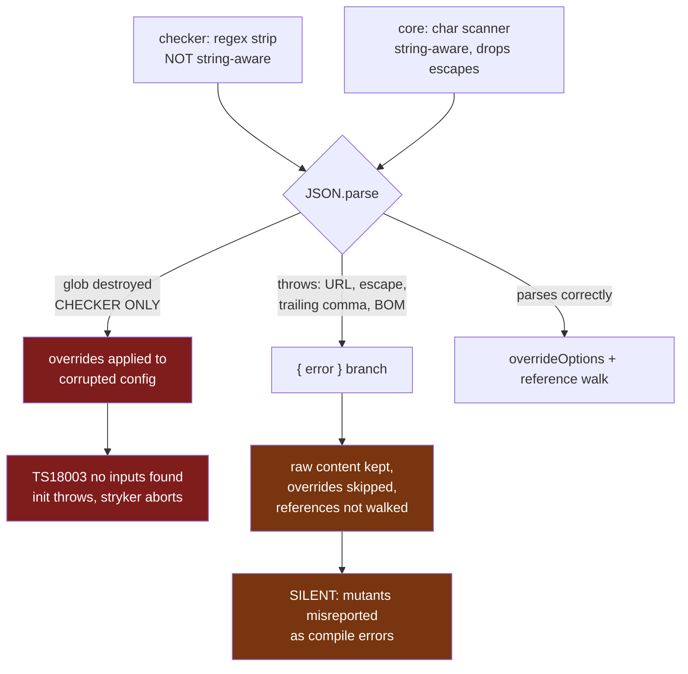
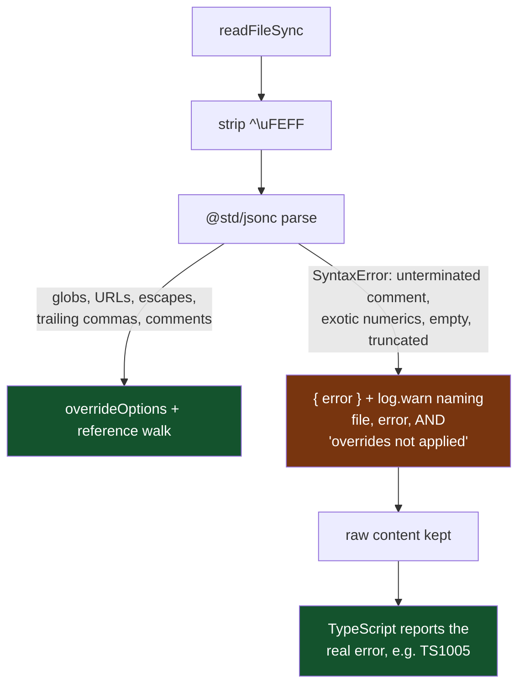

# fix: Replace hand-rolled JSONC parsing with `@std/jsonc` and gate its return

---

## Goal Capsule

**Objective.** Delete both hand-rolled JSON-with-comments parsers from this repo's TypeScript source, route tsconfig parsing through `@std/jsonc`, make the residual degradation legible, and land a repo-wide tripwire — reaching the lint-exempt vendored fork — that catches the pattern in both forms it has actually taken here.

**Authority hierarchy.** Root `AGENTS.md` > `CONSTITUTION.md` > this plan. §V.7 (subtract before you add), §II.5 (decode, never cast), and §V.6 (no silent bypass) govern the shape; USER-W9 (never reinvent a standard-library primitive) selects the remedy.

**Stop conditions.** Stop and surface, do not guess, if: (a) `@std/jsonc` cannot resolve through the workspace catalog under `minimumReleaseAge: 1440`; (b) removing the trailing-comma rejection breaks a test whose intent is _not_ "trailing commas are invalid"; (c) the guard's scanner-form signature cannot be made to pass the current tree without an exemption whose reason you cannot state in one sentence.

**Execution profile.** Characterization-first on U2/U3 — the code being deleted has live tests asserting its exact output, and one of those assertions encodes a bug. Pin corrected behavior before deleting.

**Tail ownership.** LFG owns simplify → review → commit → PR → CI. This plan ends at a green `pnpm check`.

---

## Product Contract

### Summary

Two packages hand-roll JSONC parsing, and — measured, not assumed — **they fail differently**. Replace both with `@std/jsonc`'s `parse`, strip a leading BOM at each decode boundary, drop an unchecked cast in the checker, make the surviving parse-failure fallback name its consequence, and add `scripts/guard-no-hand-rolled-jsonc.mjs` to the root `check` chain so either form fails CI even inside the lint-exempt fork.

### Problem Frame

**The checker** (`packages/stryker-js/typescript-checker/src/tsconfig-helpers.ts:61-65`) strips comments with two regexes that also match inside string literals:

```ts
json.replace(/\/\*[\s\S]*?\*\//g, '').replace(/\/\/.*$/gm, '')
```

A tsconfig `include` of `["src/**/*.workflow.ts"]` contains `/**/` — slash-star, empty body, star-slash. The block regex deletes it, yielding `["src*.workflow.ts"]`. The corrupted document **still parses**, so nothing errors: TypeScript receives a glob matching zero files, reports TS18003, `TypescriptChecker.init` throws, and stryker aborts before a single mutant runs. The diagnostic quotes `["src*.workflow.ts"]` while the file on disk says `src/**/*.workflow.ts` — the only tell.

**Core** (`packages/stryker-js/core/src/sandbox/parse-config-helper.ts:11-68`) is _not_ a near-duplicate. It is a character scanner that tracks string state, so it handles globs and URLs correctly. Its defect is narrower and elsewhere: inside a string it appends the backslash then does `i += 2; continue`, so **the escaped character is never emitted**. `"C:\\x"` becomes `"C:\x"`, an invalid JSON escape.

Both were run in this session against the same inputs. The divergence is the point:

| input                                                 | checker (regex)                            | core (scanner)          |
| ----------------------------------------------------- | ------------------------------------------ | ----------------------- |
| `{"include":["src/**/*.workflow.ts"]}`                | **`["src*.workflow.ts"]` — silent, wrong** | intact                  |
| `{"$schema":"https://json.schemastore.org/tsconfig"}` | throws — unterminated string               | intact                  |
| `{"paths":{"a":["C:\\x//y"]}}`                        | throws — unterminated string               | **throws — bad escape** |
| `{"a":"he said \"hi\""}`                              | intact                                     | **throws — bad escape** |
| `{"compilerOptions":{"strict":true,}}`                | throws — trailing comma                    | throws — trailing comma |
| comments, real ones                                   | intact                                     | intact                  |

So the checker loses globs and `//`-bearing strings; core loses **every string containing an escape** — a Windows path, an escaped quote. Both reject trailing commas, which tsc accepts.

Only the checker's glob case is silent. Everything else throws, and throwing is _not_ an abort: it takes the `{ error }` branch, where `determineBuildModeEnabled` returns `false` and `typescript-compiler.ts:209-212` keeps the raw content, skipping the compiler-option overrides _and_ the project-reference walk. Mutation then runs with `noUnusedLocals: true` and `allowUnreachableCode: false` still in force, so mutants get misreported as compile errors.

The root cause is upstream API loss: `@stryker-mutator/typescript-checker` used `ts.parseConfigFileTextToJson`, a real string-aware JSONC parser. TypeScript 7 removed it — verified: zero occurrences of any legacy config symbol in `typescript@7.0.2`, and `lib/typescript.d.ts` no longer exists. Each fork re-implemented it independently and each lost something different.

The checker's defect shipped through a coverage hole, not a review miss: no fixture tsconfig under `packages/stryker-js/typescript-checker/testResources/` contains `**` (grep: zero matches), and no test in that package directly imports `tsconfig-helpers.ts`. It is exercised only transitively through `TypescriptCompiler`, and that path was never fed a `**/` glob.

### Requirements

| ID  | Requirement                                                                                                                                                                                       |
| --- | ------------------------------------------------------------------------------------------------------------------------------------------------------------------------------------------------- |
| R1  | A tsconfig glob containing `**/` survives parsing byte-identical.                                                                                                                                 |
| R2  | A string value containing `//` — `$schema` URL, Windows path — survives parsing byte-identical.                                                                                                   |
| R3  | A string value containing a backslash escape — `C:\\x`, `\"` — survives parsing byte-identical.                                                                                                   |
| R4  | A tsconfig with trailing commas in objects and arrays parses successfully, matching tsc.                                                                                                          |
| R5  | A tsconfig with a leading UTF-8 BOM parses successfully.                                                                                                                                          |
| R6  | No hand-rolled JSON/JSONC comment stripper remains in the repo's published TypeScript source, **in either the regex form or the character-scanner form**.                                         |
| R7  | Re-introducing a hand-rolled JSONC stripper **in either form** fails `pnpm check` — including inside `packages/stryker-js/`, which is exempt from per-package lint coverage.                      |
| R8  | When a tsconfig still cannot be parsed, the log names the file, the parse error, **and the consequence** (overrides not applied); the existing TypeScript-diagnostic path is preserved unchanged. |
| R9  | A fixture tsconfig carrying a `**/` glob and a `//`-bearing string flows through the checker's real integration path, so the end-to-end regression is pinned — not only the unit.                 |
| R10 | `overrideOptions` no longer asserts the parsed config's shape with an unchecked cast (§II.5).                                                                                                     |

### Acceptance Examples

- **AE1** — Given `{"include":["src/**/*.workflow.ts"]}`, when parsed, `config.include` equals `["src/**/*.workflow.ts"]` exactly. (R1)
- **AE2** — Given `"$schema": "https://json.schemastore.org/tsconfig"`, when parsed, the value round-trips unchanged and no error is returned. (R2)
- **AE3** — Given `{"paths":{"a":["C:\\x//y"]}}`, when parsed by **core**, the value round-trips unchanged. This is the case core fails today. (R3)
- **AE4** — Given `{"compilerOptions":{"strict":true,},"include":["a",]}`, when parsed, it succeeds and yields `{compilerOptions:{strict:true},include:["a"]}`. (R4)
- **AE5** — Given `testResources/errors/invalid-tsconfig/tsconfig.json` (content: `invalid tsconfig file`), when `TypescriptChecker.init()` runs, it still rejects with `TS1005` at `tsconfig.json(1,1)`. The fallback stays; TypeScript stays the authority on tsconfig syntax errors. (R8)
- **AE6** — Given a file containing a `JSON.parse` call and a character-scanner comment walk **with no regex at all** — the exact shape of core's current stripper — when `pnpm check:no-hand-rolled-jsonc` runs, it exits non-zero and names the file and line. (R6, R7)
- **AE7** — Given a parsed config that is not an object (an existing test proves `'"just a string"'` reaches `overrideOptions`), when overrides are applied, the result is a well-formed config object rather than a character-indexed spread. (R10)

### Scope Boundaries

**In scope.** Both TypeScript strippers and their call sites; the workspace catalog entry; the tests that pin deleted behavior; a `**/`-bearing fixture; the unchecked cast in the file already being edited; fallback log legibility; one root guard script wired into `pnpm check`.

#### Deferred to Follow-Up Work

- **Applying compiler-option overrides when the parse fails.** See KTD-3 and the Risks table: a measured class of tsconfigs tsc accepts and `@std/jsonc` rejects still skips the overrides. The candidate remedy — emitting an overlay config that `extends` the original path so tsc's own lenient parser reads the user's file while our overrides layer on top — is a real design change to `HybridFileSystem` path handling and is not attempted here. **This is a known, measured, accepted residual, not an oversight.** It is not a regression: the deleted code failed identically, or worse, on every input in that class.
- **Empty, whitespace-only, and comment-only tsconfigs.** An earlier draft required these to decode to `{}` (tsc treats them as defaults). **Cut deliberately.** `@std/jsonc` reports `''`, `'   '`, `'// x'`, `'/* x */'`, `'{'`, `'{"a":'`, and `'['` with the _identical_ message — `Cannot parse JSONC: unexpected end of JSONC input` — verified in this session. So the error channel cannot separate "no payload" from "truncated file", and every mechanism to separate them either re-introduces comment scanning (the banned pattern, and the guard would catch it) or silently accepts a truncated tsconfig as `{}` — a **new** silent-degradation bug of exactly the class this plan exists to kill. Not a regression: both deleted implementations also errored on empty input, and core's own test asserts that today. Left in the fallback with the rest of the residual.
- **`packages/oxlint-plugins/recommended/scripts/guard-no-behavior.mjs`.** Its `stripLiterals` still strips comments _before_ replacing string literals, so a `//` inside a scanned string mangles that line and the gate below false-negatives — a live defect the exemption entry for this file in `scripts/guard-no-hand-rolled-jsonc.mjs` is forced to acknowledge. The proposed reorder (replace string and template literals first) was **evaluated and rejected** as a lateral move: replacing literals first makes an apostrophe inside a comment (e.g. `// don't do this`) open a bogus string literal that runs to the next quote — trading one false-negative window for another. The shipped change is therefore comment-only: the file carries a CONSTITUTION §V.6 declaration at `stripLiterals` (lines 25-32) stating the ordering is deliberate and NOT fixed, and naming the correct fix — migrating comment stripping to the `oxc-parser` already in the workspace — which remains deferred. That package forbids test scripts by its own design (`forbiddenScripts` includes `test`), so the ordering cannot be covered by a test there — stated, not hidden.
- **Test-suffix taxonomy divergence in `packages/stryker-js/`.** Both packages use `.it.spec.ts` / `.spec.ts`; the repo-sanctioned outside-`src` suffixes are `.integration.test.ts` and `.snapshot.test.ts`. The rule does not reach these packages. Renaming the suite is separate and mechanical. See KTD-6.

**Non-goals.** Resolving `references` through `extends` chains (upstream does not either). Adding a stryker mutation config to either `stryker-js` package. Enrolling `packages/stryker-js/` in per-package oxlint coverage — see KTD-7.

---

## Planning Contract

### Key Technical Decisions

**KTD-1 — Depend on `@std/jsonc` via the workspace catalog's `jsr:` protocol; bundle it into the published artifacts so consumers need no JSR configuration.**
Chosen over `jsonc-parser` and over repairing either hand-rolled parser. USER-W9 prefers JSR `@std/*`; the user named it directly. Verified in this session against the real published artifact (`@jsr/std__jsonc@1.0.2`) on Node: globs, `//`-bearing strings, Windows paths, escaped quotes, and trailing commas in objects, arrays, and nested positions all parse correctly. Trailing-comma acceptance is unconditional — no flag to forget (`parse.ts:253-255`, `:286-288`). `jsonc-parser` gates it behind `allowTrailingComma`, defaulting **off** (`ParseOptions.DEFAULT`), which is strictly worse for tsconfig.

_Precedent, stated accurately._ `pnpm-workspace.yaml:30` already carries `"@std/toml": jsr:^1.0.11`, consumed by `omp/packages/omp-utils`. **That package is `private: true`** — so the precedent proves the `jsr:` protocol resolves and locks correctly in this workspace, and nothing more. It does **not** establish that shipping a `@jsr/*` runtime dependency to public consumers is settled here.

_The consumer cost, measured and then removed._ Both stryker packages publish to public npm (`core` carries `publishConfig.access: public`; neither is private), and a `jsr:` catalog entry does not survive publication intact. `pnpm pack` rewrites it to `"@std/jsonc": "npm:@jsr/std__jsonc@^1.0.2"` in the published manifest, and the whole `@jsr/*` scope 404s on `registry.npmjs.org` — it exists only on `npm.jsr.io`. Shipped in runtime `dependencies` it would break `npm install` for every consumer on the default registry: a hard regression against the published 1.2.0. Measured against the real packed tarball, not inferred.

_The remedy: keep the dependency, do not ship it._ Each package's `tsdown.config.ts` sets `noExternal: ['@std/jsonc']`, inlining the parser — a leaf module with no runtime imports — into `dist`, and `@std/jsonc` moves to `devDependencies`, which a consumer's install never resolves. Verified end-to-end: both packed manifests carry no `@jsr` specifier; `npm install <tarball>` against `registry.npmjs.org` with `~/.npmrc` ignored exits 0 for both packages; no `@jsr` or `@std` directory appears in the consumer tree; and both dists import cleanly and expose their full export surface. `tsdown` records the inlining as `inlinedDependencies: { "@jsr/std__jsonc": "1.0.2" }` in the published manifest, so the bundled origin stays auditable rather than invisible. This keeps USER-W9's preference for JSR `@std/*` **and** costs consumers nothing.

_Side effect, deliberate._ The checker had no `tsdown.config.ts` at all; creating one also generated the `publishConfig.exports` it was missing, dropping the `@systemfsoftware/source` condition from its published exports map. `core` already stripped that condition; the checker was leaking a source-tree path into its published surface.

Published 2025-04-24, well past `minimumReleaseAge: 1440` — **no `minimumReleaseAgeExclude` change is proposed or permitted** (REPO-S2).
_Carry forward:_ the compat package declares `@jsr/std__json` (never imported at runtime), pulling three small Deno std packages into `node_modules`.

**KTD-2 — Delete both, share nothing.**
The two packages are independent: `typescript-checker` declares no dependency on `stryker-js-core` and imports nothing from it. A shared internal package — or a checker→core dependency — to hold what becomes a five-line adapter over one library call is the abstraction USER-W8 rejects and the coupling §V.7 warns about. Each package depends on `@std/jsonc` directly. Note this is _convergence_, not de-duplication: the two implementations were never the same code and never had the same bug. Recurrence is prevented by the guard (U6), not by a shared module.

**KTD-3 — The fallback stays. Its justifying invariant does not.**
An earlier draft claimed that after the swap the fallback is reachable only for input TypeScript also rejects. **That is false, and it was measured false in this session.** Running candidates through both `@std/jsonc` and TS7's `API.parseConfigFile` — where a returned `strict=true` proves tsc genuinely parsed, versus `strict=undefined` meaning it fell back to defaults:

| input                      | `@std/jsonc` | TS7              | disposition                                                           |
| -------------------------- | ------------ | ---------------- | --------------------------------------------------------------------- |
| unterminated `/*` comment  | reject       | `strict=true`    | residual — tsc accepts, we do not                                     |
| hex numeric `0x10`         | reject       | `strict=true`    | residual — tsc accepts, we do not                                     |
| empty / comment-only       | reject       | defaults to `{}` | residual — indiscriminable from truncated input, see Scope Boundaries |
| leading BOM                | reject       | `strict=true`    | **closed** by KTD-4                                                   |
| trailing comma, `**/` glob | accept       | `strict=true`    | agree                                                                 |

The honest position: the fallback keeps the raw content and skips the overrides for a small class of tsconfigs tsc accepts. **None of it is a regression** — both deleted implementations failed on every one of these inputs too. One class is closed outright (KTD-4); the rest stay in the fallback, and the fallback stays: the `invalid-tsconfig` integration test proves TypeScript produces a better diagnostic (`TS1005` at `tsconfig.json(1,1)`) than this package could, and TS7's `ConfigResponse` exposes no diagnostic channel to distinguish the cases with. What changes is legibility — the warn must name the _consequence_, because "overrides not applied" is what makes a mutation log interpretable.

**KTD-4 — Strip a leading BOM at each decode boundary.**
`@std/jsonc` throws on `U+FEFF` (`#whitespace` is `new Set(" \t\r\n")`, `parse.ts:53`); confirmed empirically, and confirmed that tsc accepts it. `readFileSync(f, 'utf-8')` preserves the BOM, so a tsconfig saved by Windows tooling silently takes the degraded path today under _both_ hand-rolled parsers. One `replace(/^\uFEFF/, '')` per decode boundary closes it. This is the only divergence class with a non-circular one-line fix, which is why it is closed and the others are not.

**KTD-5 — New tests use `.it.spec.ts`, matching neighbors.**
Not precedent-worship (§V.3). For `packages/stryker-js/core` it is a hard runner constraint: `vitest.config.ts` sets `include: ['test/**/*.spec.ts']`, so a `.integration.test.ts` file there **would not be collected at all**. For `typescript-checker` there is no such constraint — its config sets only `exclude`, so vitest defaults would collect `.integration.test.ts`. There the choice is neighbor consistency, not necessity. Both use `.it.spec.ts`; the taxonomy divergence is deferred follow-up.

**KTD-6 — Deliver the gate as a root guard script, not an oxlint rule.**
An oxlint rule in `packages/oxlint-plugins/core` was the first design and was rejected, for three independently sufficient reasons:

1. **It closes a workspace cycle.** `packages/oxlint-plugins/core/package.json:59-60` already dev-depends on _both_ stryker packages (its own mutation gate runs on the fork). `turbo.json` gives `build` and `lint` `dependsOn: ["^build"]`, which traverses devDependencies. Adding the reverse edge required for plugin resolution makes `stryker-js/core → oxlint-plugin → stryker-js/core`. Verified against both files.
2. **It cannot reach the code that broke without that edge.** `scripts/check-lint-coverage.mjs` exempts `packages/stryker-js/` by path prefix as a vendored fork; neither package extends the shared oxlint config, and `core` has no lint script at all. A registered rule that never runs on the defective files satisfies nothing — root `AGENTS.md` names this exact trap: "Registration is NOT delivery."
3. **Enabling oxlint on `core` exposes it to default builtin categories**, not just the one new rule, on a large unlinted vendored fork.

`scripts/guard-no-hand-rolled-jsonc.mjs` in the root `check` chain has none of these properties: no package-graph edge, no cycle, no builtin exposure, and it scans every file including exempt and vendored-fork paths. It is also _less_ machinery than a rule plus two package opt-ins plus devDeps plus turbo input edits (§V.7). The prior art is direct — `package.json:17` ends with `… && pnpm check:exports && pnpm check:mutate-scope && pnpm check:lint-coverage`, three root guards in exactly this shape, appended after the install and turbo phases.
_Accepted trade-off:_ no editor-inline feedback and no RuleTester/mutation gate on the rule logic.

**KTD-7 — The guard is a three-signature tripwire, not a proof.**
The first draft keyed detection on a comment-stripping regex literal co-occurring with `JSON.parse`. **That signature would not have caught core's stripper** — a character scanner with zero regexes — which means it would not catch the most defensible re-introduction, and would let a partially-applied plan (U2 + U6 without U3) pass CI green while a hand-rolled stripper still shipped. Four independent reviewers and a direct source read converged on this; the signature is widened to three, any one of which plus a `JSON.parse` in the same file trips the guard:

- **S1, regex form** — a regex literal stripping block or line comments. Catches the checker's shape.
- **S2, scanner form** — character comparisons against a slash **and** against a star or a second slash: the comment-open bigram. The only reason to compare characters to `/*` in a file that also calls `JSON.parse` is comment scanning. Catches core's shape.
- **S3, name form** — an identifier matching `strip…Comment`. Catches the obvious re-introduction under either implementation.

This is a **tripwire keyed on three observed shapes, not a proof of absence** — a sufficiently determined re-implementation (`new RegExp` from fragments, the parse split across two files) evades it. Say so in the script's header comment rather than overselling R7. The value is that it catches both forms this repo has actually produced, in the one place per-package lint cannot reach.

**KTD-8 — The guard tests itself; no new test runner.**
There is no convention to follow: none of `check-exports.mjs`, `guard-mutate-scope.mjs`, or `check-lint-coverage.mjs` carries a test, no root vitest config exists, and nothing collects tests from `scripts/`. Rather than stand up a test package for one script, `guard-no-hand-rolled-jsonc.mjs --selftest` runs an inline fixture matrix (positives for S1/S2/S3, near-miss negatives, both exemptions) and exits non-zero on any mismatch. `pnpm check:no-hand-rolled-jsonc` runs `--selftest` first, then the repo scan — so the fixtures execute on every `pnpm check` rather than sitting in a file nothing invokes.

**KTD-9 — Drop the unchecked cast in `overrideOptions`.**
`tsconfig-helpers.ts:92` does `(parsedConfig.config ?? {}) as { compilerOptions?: Record<string, unknown> }` on outside data. An existing test (`ts-config-preprocessor.it.spec.ts:118-122`) proves a bare string can reach this path, and `{...'abc'}` spreads to character indices. The plan cites §II.5 as governing; carrying the citation while leaving the cast would itself be the §V.6 smell. Replace with a runtime object check — a real latent bug in the file already being edited, not opportunistic refactoring.

### High-Level Technical Design

Where each defect class lands today. The two packages enter the same funnel by different doors:



After the change both packages share one decode path. The red branch is unreachable — `@std/jsonc` is string-aware, so "parses, wrong value" cannot occur — and the amber branch narrows to the measured residual from KTD-3, now announced with its consequence:



### Assumptions

- `pnpm@11.9.0` resolves the `jsr:` catalog specifier with no `.npmrc`, as it already does for `@std/toml`. No `.npmrc` exists in the repo and none is needed. _(Grounded in the existing lockfile entry; confirmed at U1 by a successful install.)_
- Neither `stryker-js` package has a mutation gate, so no `pnpm --filter <pkg> mutation` run applies to this work.
- `@std/jsonc` rejecting single-quoted strings is a non-issue: core's scanner tracked `'` while stripping but its `JSON.parse` rejected them anyway, so end-to-end behavior is unchanged, and tsc rejects them too.

### Risks & Dependencies

| Risk                                                                                                                              | Mitigation                                                                                                                                                                                                                                    |
| --------------------------------------------------------------------------------------------------------------------------------- | --------------------------------------------------------------------------------------------------------------------------------------------------------------------------------------------------------------------------------------------- |
| `ts-config-preprocessor.it.spec.ts:106-110` asserts `SyntaxError` on a trailing comma. It encodes the bug, not a requirement.     | U3 inverts it to assert success and states in the diff why. This is the one place the change is _intentionally_ behavior-breaking.                                                                                                            |
| The KTD-3 residual (unterminated comment, exotic numerics, empty/truncated) silently skips overrides for configs tsc accepts.     | Not a regression — measured identical or worse under both deleted implementations. BOM closed outright. Remainder: consequence-naming warn plus an explicit accepted-residual entry, with the overlay remedy deferred rather than improvised. |
| The guard's S2 scanner signature false-positives on legitimate slash comparisons (path handling) in a file that also parses JSON. | Require the comment-open **bigram** (`/` with `*` or a second `/`), not a bare slash; pin the boundary with near-miss negatives in the selftest matrix; exemptions carry stated reasons.                                                      |
| The guard trips on `guard-no-behavior.mjs`, which legitimately strips comments from JavaScript.                                   | One exemption entry carrying its reason inline; the file itself carries a §V.6 declaration naming the residual ordering defect deliberate and unparked, so the exemption does not silently park it.                                           |
| The guard must contain the patterns it bans and would flag itself.                                                                | Exempt its own path by exact match and state the consequence: a stripper added to the guard itself is not caught. No broad glob exemption.                                                                                                    |
| U6 landing before U3 would leave core's stripper shipping under a green CI.                                                       | Fixed by KTD-7 — with S2 in place the guard _does_ fail on core's scanner, so the declared U3→U6 dependency is enforced by the gate rather than merely asserted.                                                                              |

---

## Implementation Units

### U1. Add `@std/jsonc` to the workspace catalog and both packages

**Goal.** One catalog entry, consumed by both packages via `catalog:`.

**Requirements.** Enables R1-R5. KTD-1.

**Dependencies.** None. Blocks U2, U3.

**Files.** `pnpm-workspace.yaml`; `packages/stryker-js/typescript-checker/package.json`; `packages/stryker-js/core/package.json`; `packages/stryker-js/core/tsdown.config.ts`; `packages/stryker-js/typescript-checker/tsdown.config.ts` (new).

**Approach.** Mirror line 30's `"@std/toml": jsr:^1.0.11` — add `"@std/jsonc": jsr:^1.0.2` to the same `catalog:` block, then `"@std/jsonc": "catalog:"` in each package's `devDependencies` — **not** `dependencies`. The parser is inlined into `dist` via `noExternal` (KTD-1), so a runtime dependency entry would ship an uninstallable `@jsr` specifier to consumers. Add `noExternal: ['@std/jsonc']` to core's existing `tsdown.config.ts` and create one for the checker, which has none. Do not touch `minimumReleaseAgeExclude` (REPO-S2). Do not hand-edit `exports` (REPO-S4) — tsdown generates them.

**Test scenarios.** _Test expectation: none — dependency wiring, no behavior._ Proven by U2/U3 importing it successfully.

**Verification.** `pnpm install` resolves cleanly and `pnpm-lock.yaml` gains an `@jsr/std__jsonc` entry with an `npm.jsr.io` tarball URL. **Commit the lockfile before any `pnpm check`** — that command installs `--frozen-lockfile`.

---

### U2. Replace the checker's regex stripper; close BOM and the cast

**Goal.** Delete `stripJsonComments` from `tsconfig-helpers.ts`, parse via `@std/jsonc`, strip the BOM, and remove the unchecked cast in the same file.

**Requirements.** R1, R2, R3, R4, R5, R6, R10.

**Dependencies.** U1.

**Files.**

- `packages/stryker-js/typescript-checker/src/tsconfig-helpers.ts` — delete the regex pair at 61-65; replace the deleted `parseConfigFileTextToJson` with `parseTsConfig(fileName, jsonText): Either.Either<TsConfig, TsConfigParseError>` (Effect Schema, see Approach); the unchecked cast at line 92 is gone — `overrideOptions` takes the schema-narrowed `TsConfig`.
- `packages/stryker-js/typescript-checker/test/integration/tsconfig-helpers.it.spec.ts` _(new)_
- `packages/stryker-js/typescript-checker/AGENTS.md` — line 5 claims the package "Imports from `@systemfsoftware/stryker-js-core` for worker infrastructure". Verified false: no such dependency in `package.json`, zero imports in `src/`. Correct it while in the package.

**Approach.** `parseConfigFileTextToJson` is deleted outright. The shipped boundary is `parseTsConfig(fileName, jsonText): Either.Either<TsConfig, TsConfigParseError>` built on Effect Schema — `TsConfigParseError` is a `Data.TaggedError` carrying `{ file, reason }`, and the right side is a `TsConfig` narrowed by an `S.is` schema guard at the parse boundary. Both call sites branch on the `Either`: `typescript-compiler.ts` warns on a `Left` (overrides skipped) and `determineBuildModeEnabled` `Either.match`es on it — its boolean contract is unchanged. Inside: strip a leading `\uFEFF` (KTD-4), then `parse` inside a try/catch that maps any throw to a `Left`. The `fileName` parameter feeds the error's `file` field, mirroring the removed upstream signature. KTD-9's cast is satisfied **by construction**: the shape guard runs before `overrideOptions`, so a non-object root (a bare string, a number, malformed `references` — all pinned by shipped tests) returns a `Left` and can never be spread onto character indices. This is purely internal API: `tsconfig-helpers.ts` is not re-exported from the package entrypoint and is unreachable from it.

**Execution note.** Write the failing test first. The defect classes are precisely characterizable, so red-then-green is cheaper than eyeballing output.

**Test scenarios** (new file, `.it.spec.ts` per KTD-5):

- Covers AE1 / R1 — `{"include":["src/**/*.workflow.ts"]}` yields `include: ["src/**/*.workflow.ts"]` exactly. **Assert the array value, not merely absence of error** — the old code produced a _parseable_ wrong value, so an error-free assertion alone would have passed against the bug.
- Covers AE2 / R2 — `"$schema": "https://json.schemastore.org/tsconfig"` round-trips unchanged.
- R3 — a Windows path value `"C:\\x//y"` and a string with an escaped quote both round-trip unchanged.
- Covers AE4 / R4 — trailing commas in a nested object _and_ an array both parse.
- R5 — content prefixed with `\uFEFF` parses to the same value as the same content without it.
- Comments still work — a `//` line comment and a `/* */` block comment are both removed and the rest parses.
- A genuinely malformed document (`{ "a": }`) returns a `Left` carrying a `TsConfigParseError`.
- **Truncated input (`{` and `{"a":`) returns a `Left`** — pinning that the empty-input class stays an error rather than silently becoming `{}`. This is the guard against the cut R5 sneaking back in as an over-accept.
- An unterminated block comment returns a `Left` — pinning the KTD-3 residual as _known and deliberate_ rather than accidental.
- Covers AE7 / R10 — the `S.is` shape guard rejects a bare-string root at the parse boundary (a `Left`, pinned by a shipped test), so `overrideOptions` only ever receives a well-formed config object and no character-indexed spread can occur.
- `determineBuildModeEnabled` returns `true` for a config whose `references` array survives parsing and `false` for one without — pinning that the swap did not change build-mode selection.

**Verification.** `pnpm --filter @systemfsoftware/stryker-js-typescript-checker test` passes; no comment-stripping regex remains in `src/`; the package's `AGENTS.md` no longer claims a `stryker-js-core` dependency.

---

### U3. Replace core's scanner and reconcile the tests that pin deleted behavior

**Goal.** Delete the hand-rolled character scanner from `parse-config-helper.ts` and reconcile the assertions that exercise it.

**Requirements.** R1, R2, R3, R4, R5, R6.

**Dependencies.** U1. Independent of U2 — different package, disjoint files.

**Files.**

- `packages/stryker-js/core/src/sandbox/parse-config-helper.ts` — delete `stripJsonComments` including its JSDoc (lines 8-68); rewire to the same `parseTsConfig(fileName, jsonText): Either.Either<TSConfig, TsConfigParseError>` boundary as U2 (Effect Schema, `S.is` shape guard).
- `packages/stryker-js/core/test/unit/parse-config-helper.spec.ts`
- `packages/stryker-js/core/test/integration/ts-config-preprocessor.it.spec.ts`

**Approach.** Same decode shape as U2: BOM strip, then `parse`. `stripJsonComments` is **exported** here and directly asserted on, so deleting it is a package-internal API change. Do not keep a shim to make the old tests compile — that re-adds the thing being deleted (§V.7). Rewrite them as parse-level assertions on the same inputs.

**Execution note.** Characterization-first. Five assertions touch the deleted behavior, and they split two ways: **four lose their subject** (`parse-config-helper.spec.ts:5-9`, `:11-15`; `ts-config-preprocessor.it.spec.ts:130-139`, `:141-145` — all assert `stripJsonComments`'s intermediate text) and **exactly one must invert its expected outcome** (`ts-config-preprocessor.it.spec.ts:106-110`, asserting `SyntaxError` on a trailing comma). Everything else in both files is a requirement and stays.

**Test scenarios.**

- Rewrite the four subject-less assertions as `parseTsConfig` assertions over the same inputs, asserting the parsed value (or `Left` `TsConfigParseError`) rather than intermediate text.
- Invert `:106-110` — trailing commas now parse to `{compilerOptions:{strict:true}}`. Covers R4.
- **Add the escape cases — this is core's actual defect.** `{"paths":{"a":["C:\\x//y"]}}` and a string containing `\"` each round-trip unchanged. Both throw today (measured: "Bad escaped character in JSON"). Covers AE3 / R3. **This is the assertion that pins the bug core actually shipped.**
- **Strengthen `:90-104`.** Today the `**/` glob test builds its input with `JSON.stringify`, so the input contains no comments and comment-stripping was never exercised. Rebuild it as a literal commented tsconfig string containing both `src/**/*.ts` and a `//`-bearing `$schema`. Covers R1, R2. Note this pins the _checker's_ failure shape as a guard against convergence regressions in core — core passes it today; it is not the case that would have caught core's own bug.
- Add BOM coverage matching U2. Covers R5.
- Keep unchanged: fixture-parse assertions, `extends`/`references` assertions, **the empty-input assertions (empty input remains an error — see the cut in Scope Boundaries)**, the `'"just a string"'` case, and all five `resolveProjectReferencePath` tests.

**Verification.** `pnpm --filter @systemfsoftware/stryker-js-core test` passes; no `stripJsonComments` symbol remains in `src/`.

---

### U4. Pin the end-to-end regression with a `**/` fixture

**Goal.** Make the checker's real integration path — not just a unit — fail if the parser ever mangles a glob again.

**Requirements.** R9.

**Dependencies.** U2.

**Files.**

- `packages/stryker-js/typescript-checker/testResources/single-project/tsconfig.json`
- `packages/stryker-js/typescript-checker/test/integration/single-project.it.spec.ts`

**Approach.** No fixture tsconfig in the package contains `**` today; that hole is why the regex survived review. Extend `single-project/tsconfig.json` with an `include` of `src/**/*.ts` plus a `$schema` value. Verified safe during planning: every `.ts` file in the fixture already lives under `src/`, so adding `include` does not change the compilation set, and no existing assertion in either package inspects the fixture's top-level keys. One edit pins both packages, since core's integration test reads this fixture by relative path.

**Execution note.** This unit's fixture must actually reproduce the original failure. U2 is already applied by the time U4 runs, so do not attempt to observe the failure "before the fix" — instead, once the fixture and assertion are in place, follow Verification Contract step 4: temporarily revert `tsconfig-helpers.ts` to the regex, confirm this test fails with TS18003, then restore. If it cannot be made to fail against the old parser, the fixture is not exercising the defect and needs reshaping.

**Test scenarios.**

- Covers AE1 / R9 — the checker initializes successfully against a fixture whose `include` is `src/**/*.ts`, and compilation sees the fixture's source files. Asserting `init()` resolves suffices _provided the glob is the sole `include` and the fixture declares no `files` key_ — with a destroyed glob and no other input source, TS18003 makes `init()` reject. Confirm the fixture has no `files` entry before relying on this.
- The fixture's `$schema` string survives into the config emitted by `overrideOptions`.

**Verification.** `pnpm --filter @systemfsoftware/stryker-js-typescript-checker test` passes, and the temporary-revert check in Verification Contract step 4 makes this specific test fail.

---

### U5. Make the residual degradation legible

**Goal.** A skipped override is readable in the log instead of surfacing later as inexplicable compile-error mutants.

**Requirements.** R8.

**Dependencies.** U2, U3.

**Files.**

- `packages/stryker-js/typescript-checker/src/typescript-compiler.ts` — the `if (parsed.error)` block at 209-212.
- `packages/stryker-js/core/src/sandbox/ts-config-preprocessor.ts` — the `if (config)` guard at line 75.

**Approach.** Both sites already hold a logger: `typescript-compiler.ts` has `this.log`; `ts-config-preprocessor.ts` calls `this.log.debug` at line 70. Add a `warn` naming three things — the tsconfig path, the parse error message, and the consequence, that compiler-option overrides and reference walking were skipped for that file. The consequence clause is the point (KTD-3); an error string alone does not tell a reader why their mutants look like compile errors. Do not change control flow, and do not throw: AE5 requires the existing TypeScript-diagnostic path untouched.

**Test scenarios.**

- Covers AE5 / R8 — `typescript-checkers-errors.it.spec.ts`'s `invalid-tsconfig` case still rejects with `TS1005` at `tsconfig.json(1,1)`; assert it is **unchanged**, proving the fallback survived.
- The compiler logs a warning naming the offending tsconfig path _and_ the skipped-overrides consequence. Drive it through the existing `invalid-tsconfig` fixture with a spying logger — that spec already builds a stub `Logger`; extend that construction rather than inventing a harness.

**Verification.** Both packages' test scripts pass.

---

### U6. Gate both stripper forms repo-wide with a self-testing root guard

**Goal.** A re-introduced hand-rolled JSONC stripper — regex form or scanner form — fails `pnpm check` anywhere in the repo, including the lint-exempt vendored fork.

**Requirements.** R6, R7. KTD-6, KTD-7, KTD-8.

**Dependencies.** U2 **and** U3 must both land first, or the guard fails on the code it is meant to prevent. With S2 in place this is enforced, not merely asserted.

**Files.**

- `scripts/guard-no-hand-rolled-jsonc.mjs` _(new)_
- `package.json` — add `check:no-hand-rolled-jsonc` (running `--selftest` then the scan) and append it to the `check`, `check:ci`, and `pre-push` chains, after the existing `check:lint-coverage`.
- `packages/oxlint-plugins/recommended/scripts/guard-no-behavior.mjs` — add a CONSTITUTION §V.6 declaration comment at `stripLiterals` (lines 25-32) instead of reordering it. The reorder was evaluated and rejected as a lateral move: replacing literals first makes an apostrophe in a comment (`// don't do this`) open a bogus string literal running to the next quote — trading one false-negative window for another. The declaration states the ordering is deliberate, names the residual, and points at `oxc-parser` as the correct fix (deferred).

**Approach.** Follow the shape of `scripts/guard-mutate-scope.mjs` and `scripts/check-lint-coverage.mjs`: walk the repo, collect violations, print them, exit non-zero if any. Scan `.ts`, `.mts`, `.cts`, `.js`, `.mjs`, `.cjs`; skip `node_modules/`, `dist/`, `repos/`, and `.stryker-tmp/`.

Flag a file that calls `JSON.parse` **and** matches at least one of the three signatures in KTD-7 — S1 regex form, S2 comment-open bigram in character comparisons, S3 `strip…Comment` identifier. Report path, line, and which signature fired. Two exemptions, each carrying its reason inline in the source:

- the guard's own path, by exact match — it necessarily contains the patterns it bans, and the consequence (a stripper added to the guard itself escapes) is stated;
- `packages/oxlint-plugins/recommended/scripts/guard-no-behavior.mjs` — strips comments from JavaScript source, not JSONC, so `@std/jsonc` is not its remedy; migration to `oxc-parser` is deferred.

Open the file with a header comment stating plainly that this is a **tripwire keyed on three observed shapes, not a proof of absence** (KTD-7), so no future reader mistakes a green run for a guarantee. The failure message names `@std/jsonc`'s `parse` as the replacement — and, where the stripping defends nothing, deletion.

`--selftest` runs the fixture matrix below against the detection function and exits non-zero on any mismatch, with no filesystem walk. `check:no-hand-rolled-jsonc` runs it before the scan.

**Test scenarios** (the `--selftest` matrix, per KTD-8):

- S1 positive — a fixture with the regex pair and a `JSON.parse` is reported. Covers R7.
- **S2 positive — a fixture with a character-scanner comment walk and a `JSON.parse` but zero regexes is reported.** This is the shape core shipped. Covers AE6 / R6.
- S3 positive — a fixture whose only tell is a `stripJsonComments` identifier plus `JSON.parse` is reported.
- Near-miss negative — a comment-stripping regex with **no** `JSON.parse` is not reported.
- Near-miss negative — `JSON.parse` with neither a comment regex, a comment-open bigram, nor a matching identifier is not reported.
- Near-miss negative — `JSON.parse` alongside a bare `ch === '/'` path-splitting comparison with no `*` or second `/` is not reported. Pins the S2 boundary against the false-positive risk in the Risks table.
- Both exempted paths are not reported even though they match.
- The line number reported points at the matching construct, not at line 1.

**Verification.** `pnpm check:no-hand-rolled-jsonc` exits 0 on the clean tree (selftest green, scan clean). Then, **in this session**: (a) plant a **character-scanner-shaped** violation under `packages/stryker-js/core/src/`, observe a non-zero exit naming it, remove it — this is the specific proof S2 works and that the gate reaches the lint-exempt fork; (b) delete the S2 branch from the detection function, observe `--selftest` go red, restore it — proving the matrix defends the signature rather than passing beside it (USER-V5). A gate that has never executed against a real violation is not a gate (USER-V4).

---

## Verification Contract

Run in order. Any failure blocks done (REPO-A3, USER-V2).

1. After U1, `pnpm install` (non-frozen) and **commit the lockfile**. Every later `pnpm check` installs `--frozen-lockfile` and will fail against an uncommitted lockfile.
2. `pnpm check` — install → format:check + lint + typecheck + test + attw + api:check, then `check:exports`, `check:mutate-scope`, `check:lint-coverage`, and the new `check:no-hand-rolled-jsonc`. **Exit 0 required.**
3. **Gate-fires check (U6).** Plant a **scanner-shaped** violation inside `packages/stryker-js/core/src/`, observe a non-zero exit naming it, remove it. Then delete the S2 branch, observe `--selftest` go red, restore it. Record all exit codes.
4. **Regression check (U4).** Temporarily restore the regex stripper in `tsconfig-helpers.ts`, confirm the new fixture test fails with TS18003, restore the fix. This proves the test defends the behavior rather than merely passing beside it (USER-V5).
5. The contribution gate — applies only if a `*.property.test.ts` changed. This plan adds none; run it only if that changes. (Since superseded: the gate now ships as `packages/stryker-plugins/dist/test-contribution-gate.mjs <pkg-dir>`, built via `pnpm --filter @systemfsoftware/stryker-plugins build`; `scripts/test-contribution.mjs` no longer exists.)

No `pnpm --filter <pkg> mutation` run applies: neither `stryker-js` package has a mutation config, and KTD-6 removed the `oxlint-plugins` change that would have brought OX-MG1 into scope.

Evidence must come from this session, after the last edit (REPO-A2, USER-V1).

---

## Definition of Done

**Global.**

- [ ] The U1 lockfile change is committed **before** the `pnpm check` cited as evidence.
- [ ] `pnpm check` exits 0 from this session after the final edit.
- [ ] No hand-rolled JSON-comment stripper remains in `packages/stryker-js/*/src/` — neither the regex pair nor a character scanner over JSON text.
- [ ] `pnpm check:no-hand-rolled-jsonc` has been observed exiting non-zero against a planted **scanner-shaped** violation inside `packages/stryker-js/`, and 0 on the clean tree (USER-V4).
- [ ] Deleting the guard's S2 branch has been observed turning `--selftest` red (USER-V5).
- [ ] The `**/`-glob fixture has been observed failing against the old parser and passing against the new one (USER-V5).
- [ ] Every guard exemption carries its reason in the source; the one exemption that parks a defect (`guard-no-behavior.mjs`'s ordering false-negative) declares it in the source under §V.6 and names the correct fix (`oxc-parser`), so no exemption is parked silently.
- [ ] The guard's header states it is a tripwire, not a proof (KTD-7).
- [ ] The KTD-3 residual is stated in the shipped code's comments or log message, not only in this plan — a future reader of the fallback branch learns why it exists.
- [ ] No `minimumReleaseAgeExclude` change (REPO-S2); no hand-edited `package.json#exports` (REPO-S4); no file under `repos/` modified (REPO-S3).
- [ ] Probe scripts, planted violation files, and temporary fixtures from the run are removed.
- [ ] The `AGENTS.md` line asserting a `stryker-js-core` dependency in the checker is corrected.

**Per unit.** Each U-ID's Verification bullet passes, and each unit's test scenarios are implemented rather than summarized.

---

## Sources & Research

- **Defect reproduction, both packages** — run this session. The checker's regex pair was executed verbatim from `tsconfig-helpers.ts:61-65`; core's scanner was extracted verbatim from `parse-config-helper.ts:11-68` and executed. The two-column table in Problem Frame is that output. Key correction to an earlier draft: **core is string-aware and does not corrupt globs**; its defect is dropping escaped characters (`result += ch` then `i += 2; continue` at `:22-26`).
- **`@std/jsonc` behavior** — verified this session by installing `@jsr/std__jsonc@1.0.2` and running a case matrix on Node: globs, `$schema` URLs, Windows paths, escaped quotes, trailing commas (object, array, nested), comments, duplicate keys, unicode escapes, and BOM. Corroborated against parser source: unconditional trailing-comma acceptance at `jsonc/parse.ts:253-255` and `:286-288`; whitespace set excluding `U+FEFF` at `:53`; `parse(text: string): JsonValue` throwing `SyntaxError` at `:24`.
- **The empty-vs-truncated indiscriminability that cut R5** — measured this session: `''`, `'   '`, `'// x'`, `'/* x */'`, `'{'`, `'{"a":'`, and `'['` all produce `Cannot parse JSONC: unexpected end of JSONC input`, while `'{ "a": }'` and `'tru'` produce distinguishable `unexpected token` errors. No error-channel discriminator exists.
- **KTD-3's divergence table** — measured this session by running the same inputs through `@std/jsonc` and TS7's `API.parseConfigFile` from `typescript/unstable/sync`, using a returned `strict=true` as proof tsc genuinely parsed rather than defaulted. Probe at `/tmp/tsc-invariant/probe.mjs`; delete before finishing.
- **`jsonc-parser` rejected** — `ParseOptions.DEFAULT = { allowTrailingComma: false }` (`src/impl/parser.ts:22-26`); trailing commas are opt-in, strictly worse for tsconfig.
- **TS7 offers no replacement** — `typescript@7.0.2` contains zero occurrences of `parseConfigFileTextToJson`, `readConfigFile`, `parseJsonText`, `convertToObject`, or `readJsonConfigFile`; `lib/typescript.d.ts` no longer exists. The only config surface is `parseConfigFile(file: DocumentIdentifier): ConfigResponse` (`dist/api/sync/api.d.ts:38`), which takes a path and returns resolved `{ options, fileNames }` with **no diagnostic channel** (`dist/api/proto.d.ts:47-50`) — which is why the fallback cannot distinguish tsc-rejected from jsonc-rejected input.
- **JSR-through-pnpm precedent, and its limit** — `pnpm-workspace.yaml:30` `"@std/toml": jsr:^1.0.11` → `pnpm-lock.yaml` `@jsr/std__toml@1.0.11` from `https://npm.jsr.io/…`; consumed at `omp/packages/omp-utils/package.json:56`. **That package is `private: true`**, so the precedent covers workspace resolution only, not public publication. Both stryker packages are public (`core` declares `publishConfig.access: public`). No `.npmrc` in the repo. **Correction to this note.** It previously read "no `noExternal` anywhere in the repo and no `tsdown.config.ts` in either stryker package — the basis for rejecting the bundling alternative in KTD-1." The second clause was false when written: `packages/stryker-js/core/tsdown.config.ts` already existed. Bundling was subsequently measured, adopted, and verified end-to-end — see KTD-1.
- **Coverage hole** — grep for `\*\*` across `packages/stryker-js/typescript-checker/testResources/` returns zero matches; no test file in that package directly imports `tsconfig-helpers.ts`.
- **Fallback is correct, not broken** — `test/integration/typescript-checkers-errors.it.spec.ts:62-72` proves an unparseable tsconfig still yields `TS1005` at `tsconfig.json(1,1)` through TypeScript itself.
- **KTD-6's cycle evidence** — `packages/oxlint-plugins/core/package.json:59-60` dev-depends on both stryker packages; `turbo.json` gives `build` (`:20-22`) and `lint` (`:88-90`) `dependsOn: ["^build"]`. `scripts/check-lint-coverage.mjs` exempts `packages/stryker-js/` by path prefix. Root guard prior art: `package.json:17` runs `pnpm install --frozen-lockfile && turbo … && pnpm check:exports && pnpm check:mutate-scope && pnpm check:lint-coverage` — the new guard appends to that tail.
- **KTD-8's no-convention finding** — grep across `packages/` for `guard-mutate-scope|check-exports|check-lint-coverage` returns zero matches; no root vitest config exists and nothing collects tests from `scripts/`.
- **Third stripper** — `packages/oxlint-plugins/recommended/scripts/guard-no-behavior.mjs` (`stripLiterals`, lines 33-39) runs both comment regexes before replacing string literals, so `//` inside a scanned string mangles the line. Same class, inverted harm (false negative in a gate), different language surface. The reorder was evaluated and rejected as a lateral move — see the §V.6 declaration at lines 25-32.
