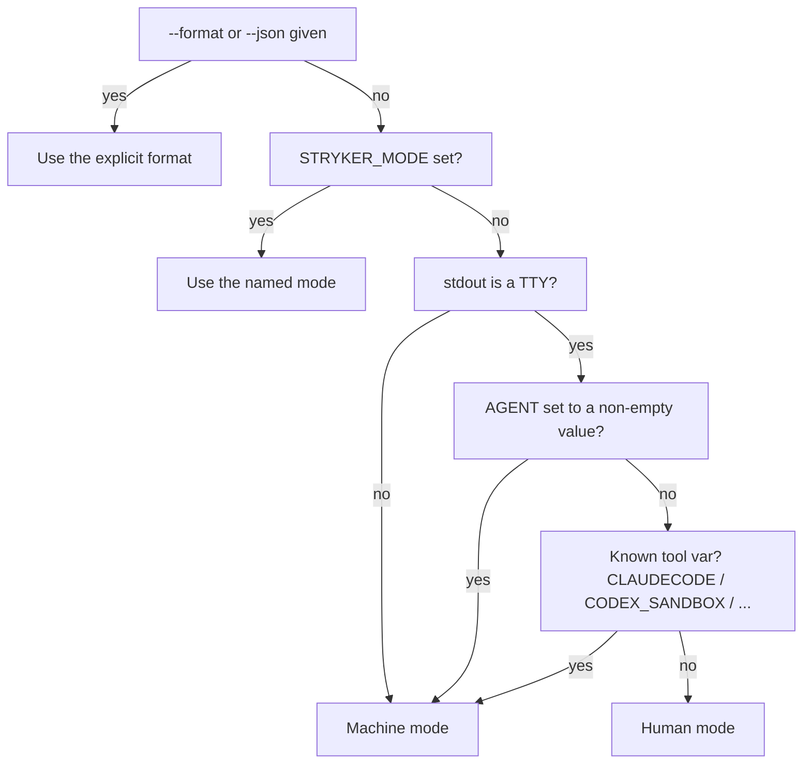
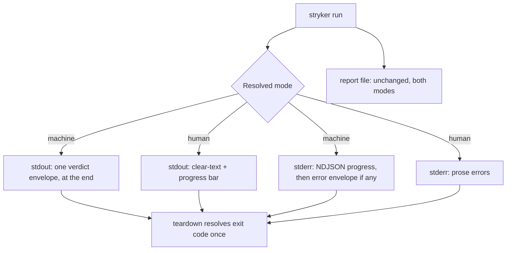
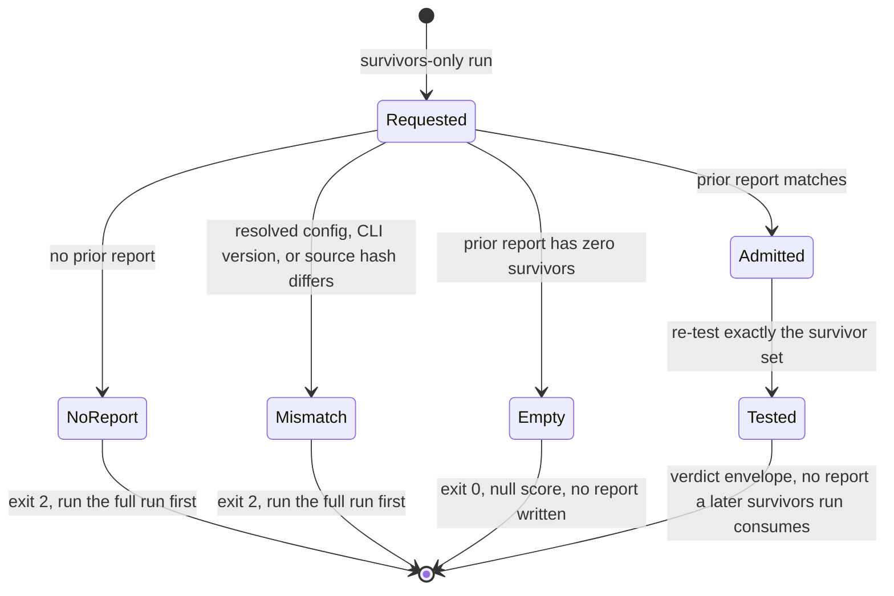

# Agent-Friendly Stryker CLI - Plan

## Goal Capsule

- **Objective:** Rebuild the forked `stryker` CLI (`@systemfsoftware/stryker-js-core`) agent-first on `@effect/cli` for a dual audience of humans and AI coding agents: machine output with context-aware detection, classed exit codes, explicit survivor re-run scoping, and a swept legacy surface.
- **Product authority:** User, via this brainstorm (2026-08-04/05).
- **Authority hierarchy:** Product Contract governs behavior; Planning Contract governs how it is built. Where they conflict, the Product Contract wins and the Planning Contract is corrected. Repo rules (`AGENTS.md`, `CONSTITUTION.md`) outrank both.
- **Execution profile:** One unconditional breaking release. Units land in dependency order; the consumer rewire (U12) is atomic with the surface it consumes.
- **Open blockers:** None. The `@effect/cli@0.77` API mapping is verified against source — every current option has a direct expression, and the residual frictions are named as KTD1-KTD4.
- **Stop conditions:** Stop and surface rather than guess if the external-consumer audit (KTD8) finds a real downstream dependent, or if the catalog bump breaks an unrelated workspace package.
- **Tail ownership:** This plan ends at a green root `pnpm check` plus a passing mutation gate. Publishing is human-controlled (REPO-P1).

---

## Product Contract

**Product Contract preservation:** changed R2 (loud failure now covers config files, not only the command line), R4 (detection reverts to stdout-primary with an explicit override; the stdin condition false-triggered on `< /dev/null`), R5 (envelope carries run id, detected mode, and the survivor matching key — without them R11 is unsatisfiable from the envelope alone), and AE3 (zero-survivor case now pins its exit code and report behavior). Added R17 (progress streaming) because R13 deletes `progress-append-only`, the current non-TTY progress path, and without a replacement the rebuild is a net regression in observability for the audience it targets. All changes confirmed with the user before this plan was written.

### Summary

The `stryker` CLI moves from commander to `@effect/cli`, keeping one surface for humans (terminal output, HTML report) and one for agents (JSON verdict envelope, structured errors, classed exits), detected by TTY/`AGENT`/tool variables with explicit flags always winning. Scoping anchors on opt-in survivor re-runs; deprecated flags, four reporters, the wizard, and the CI-dashboard stack are removed with no backward compatibility. The repo's own agent loop is the proof it works.

### Problem Frame

Agents drive Stryker through a CLI built for humans. There is no `AGENT` variable handling, no `NO_COLOR`, and no machine output on stdout — JSON exists only as a file-writing reporter. Exit codes collapse every failure class into 1. Scoping is globs plus line ranges only. The CI-provider detection stack exists solely to feed dashboard metadata, never behavior. The fork already diverges permanently from upstream (`packages/stryker-js/core/AGENTS.md`: no merge back), so the CLI is ours to reshape; the rebuild is the first agent-first pass over that surface.

### Key Decisions

- **stdout-primary detection, `AGENT` additive, explicit override always available.** `machine = !stdout.isTTY OR AGENT set OR known tool variable`, with `--format`/`--json` first and `STRYKER_MODE` second in precedence. stdout is the signal because it is what the output is being written to, and it is already this repo's convention in two places (`packages/vitest-config/lib/base.js`:5 and `broadcast-reporter.ts`:37-41). A stdin condition was considered and rejected: it misclassifies `stryker run < /dev/null` in a terminal as an agent, which is a more common invocation than the PTY-allocating harness it would rescue. Those harnesses are covered by the tool-variable list instead, which is why the list is load-bearing rather than a fallback — Claude Code today sets `CLAUDECODE`, not `AGENT`. The `AGENT` convention (agents.md #136, still open as of 2026-08-05, implemented by Goose and Amp) stays honored for when the standard lands, and it is already this repo's own convention: `oxlint . ${AGENT:+--format=unix --quiet}` across 34 package manifests.

- **Explicit survivor re-runs over incremental reuse.** `incremental` stays off repo-wide so gates always run full-fidelity; incremental mode silently re-reports killed verdicts and is unsound when test bodies are injected by transform hooks the differ cannot see. The agent loop gets speed from an explicit, opt-in survivors-only run instead.
- **JSON verdict envelope over full-report-on-stdout or TOON.** The full mutation report is large and schema'd; agents need the verdict. A small JSON envelope on stdout plus the report file is interoperable and cheap in context.
- **Run-only surface over a wizard.** Interactive `init` is the legacy being removed; a non-interactive scaffold returns in v2 if bootstrap demand shows up.
- **No backward compatibility.** One unconditional breaking release; the new surface then freezes as the agent contract, additive-only. The package is public on npm (`publishConfig.access: public`, with `0.1.0`, `1.2.2`, `1.2.3`, `1.2.4` published), so "no compatibility" is a decision about _known_ consumers: the release is gated on an external-consumer audit (dependents and download signal) run before the break, not after.
- **Machine mode means "non-interactive but everything actionable."** Per the `AGENT`-variable semantics (agents.md #136), agents want full detail and structure, the opposite of CI's minimal output.

### Requirements

**CLI framework**

- R1. The CLI layer migrates from commander to `@effect/cli` (standalone package, effect v3); the workspace catalog adds `@effect/cli` and bumps `effect` to `^3.22.1` with peers `@effect/platform`, `@effect/printer`, `@effect/printer-ansi`.
- R2. The rebuild ships no backward compatibility: removed flags, reporters, and commands fail loudly as usage errors rather than returning as aliases. The loud failure covers both entry paths — a removed name on the command line and the same name sitting in a config file.
- R3. The `stryker` bin entry, the plugin entry, and the worker subpath exports (`./checker-worker`, `./child-process-proxy-worker`, `./child-process-test-runner-worker`) survive the rewrite.

**Machine interface**

- R4. Machine mode activates when stdout is not a TTY, or `AGENT` is set to any non-empty value, or a known tool variable is set. Precedence is explicit `--format`/`--json` first, then `STRYKER_MODE=human|machine`, then detection. The resolved mode and the signal that decided it appear in the verdict envelope so a misclassified caller can diagnose without guessing.
- R5. Machine mode prints a JSON verdict envelope to stdout: mutation score, thresholds, per-status mutant counts, test-contribution verdict, per-mutant status, the report file path, a run identifier, and the resolved mode. The envelope is the **only** thing machine mode writes to stdout — configured human reporters (`clear-text`, `progress`) and console log output are suppressed there, stderr carries the error envelope and the progress stream, and the full mutation report keeps writing to the configured file.
- R6. Exit codes: 0 success; 1 verdict failure (score below break or test-contribution gate); 2 config or usage error; 3 execution or runtime failure; 4 internal error. The code is decided once, at teardown, by the precedence `4 > 3 > 2 > 1 > 0`. Signal termination stays outside the classed set and keeps the POSIX `128 + n` convention the fork already implements (`unexpected-exit-handler.ts`:18-22; SIGINT yields 130), because shells and agents read that convention directly and a wide bespoke taxonomy is the deprecated pattern (BSD `sysexits.h`). Machine mode still emits the stderr error envelope on a caught signal wherever it can.
- R7. Machine mode writes a JSON error envelope to stderr (error, code, remediation); human mode writes prose errors.
- R8. `NO_COLOR` is honored, machine mode never emits color, and the `--allowConsoleColors` flag is removed.
- R9. The CLI discloses its surface to agents via a `--llms` command manifest (token-efficient, markdown or JSON schema).
- R17. Machine mode streams run progress to stderr as newline-delimited JSON, one object per line, so a caller sees a many-minute run advancing instead of silence. Human mode keeps the interactive progress bar on stdout. This replaces the observability that R13 removes with `progress-append-only`.

**Scoping**

- R10. Survivor re-runs are the scoping anchor: an explicit, opt-in run that re-tests only the mutants that survived a previous run. Its input is the previous run's mutation report, matched on file + location + mutator + replacement; a survivors-only run with no prior report, or one whose prior report no longer matches the current resolved config, CLI version, or source content, exits 2 with remediation naming the full run to do first.
- R11. The verdict envelope exposes per-mutant status keyed the same way R10 matches, so an agent can address individual survivors machine-side without parsing the report file.
- R12. Gates always run full-fidelity, which means `incremental` is off across every mechanism that can enable it, not the config key alone: `"incremental": true` leaves `packages/effect-daemon-spec`, `packages/hex-schema`, and `packages/oxlint-plugins/effect-schema`; `--incremental` leaves the `mutation` scripts in `packages/effect-daemon-spec` and `packages/oxlint-plugins/effect-entrypoint` (where the CLI flag overrides the config); and the `reports/stryker-incremental.json` cache steps leave `.github/workflows/mutation.yml`.

**Cleanup**

- R13. Reporters shrink to `clear-text`, `progress`, `html`, `json`; `dots`, `event-recorder`, `progress-append-only`, and `dashboard` are removed along with the CI-provider detection stack and the five `--dashboard.*` options (`project`, `version`, `module`, `baseUrl`, `reportType` — `stryker-cli.ts`:293-312) that exist only to feed it.
- R14. The command surface is run-only: `stryker run` plus global flags; the `init` wizard and `runServer`/`serve` are removed.
- R15. Config keeps JSON and JS formats; no env-var substitution is added in v1.
- R16. Every in-repo consumer re-wires in the same change — all 23 workspace packages that depend on `@systemfsoftware/stryker-js-core`: `effect-daemon-spec`, `hex-schema`, `stryker-plugins`, and the twenty under `packages/oxlint-plugins/` (`cell-imports`, `cell-taxonomy`, `core`, `effect-acl`, `effect-adapter`, `effect-entrypoint`, `effect-executor`, `effect-handler`, `effect-kernel`, `effect-middleware`, `effect-observer`, `effect-policy`, `effect-schema`, `effect-shape`, `effect-state`, `effect-store`, `effect-workflow`, `property-testing`, `test-hygiene`, `test-placement`).

### Acceptance Examples

- AE1. Detection: `AGENT=1 stryker run` in a TTY emits the JSON envelope; `stryker run --format text` in a pipe emits human text; `stryker run < /dev/null` in a terminal emits human text.
- AE2. Exit codes: score below break exits 1 with an envelope; a missing tsconfig exits 2 with a JSON error on stderr; a runner crash exits 3; an internal defect exits 4; a run that fails its verdict and then crashes exits 3, not 1.
- AE3. Survivor re-run: after a run with survivors, a survivors-only run tests exactly those mutants and reports their status; a run with zero survivors exits 0 with a null score and writes no report; a run with no prior report exits 2 with remediation naming the full run.
- AE4. No-compat: `stryker init`, `--files`, `--allowConsoleColors`, and the `dots` reporter each fail with a clear usage error (exit 2), never a silent acceptance — whether named on the command line or in a config file.
- AE5. Long run: during a machine-mode run, stderr carries one parseable JSON object per line as mutants complete, and stdout stays empty until the single verdict envelope.

### Scope Boundaries

**Deferred for later**

- Symbol-level scoping (`--mutate src/foo.ts#symbol`).
- Non-interactive `stryker init` scaffold.
- MCP server and auto-generated agent skills. The CLI is the v1 interface, but the deferral has a named cost: R14 deletes `runServer`/`serve`, which is the fork's only existing machine protocol (`Content-Length:`-framed JSON-RPC over stdio, `stryker-server.ts`:171-172), so a v2 MCP surface starts from zero instead of from that transport. The field ships both surfaces rather than choosing (incur exposes `--llms` and `--mcp`; ESLint v10 ships an MCP server), so this is a scoping choice, not a bet that CLIs displace MCP.
- Config env-var substitution.
- Mid-run cancellation as a protocol operation. The deleted JSON-RPC server had one; the CLI's replacement is signal-based (R6), which is weaker but sufficient for subprocess callers.

**Outside this rebuild**

- Writing tests for `NoCoverage` mutants — the 243-residual-mutant debt is test coverage, not a CLI gap, and is a separate effort.
- Flipping `incremental: true` — gates stay full-fidelity.
- TOON output format and JS-config removal. TOON is declined on evidence, not taste: its token-saving figure is vendor-claimed with no third-party parse-reliability data, while JSON-on-stdout is the battle-tested contract (gh, cargo, eslint, ripgrep). Revisit if independent parse and token data land.

---

## Planning Contract

### Key Technical Decisions

- KTD1. **The framework migration is the easy half; the machine contract is the work.** Every option in the surviving surface has a direct `@effect/cli` constructor or a one-line combinator — booleans, choices, integers, floats, comma-lists, and the number-or-percent concurrency parser all map without a workaround. Nothing the plan actually promises agents comes from the framework: the exit taxonomy, color suppression, the verdict envelope, the error envelope, the progress stream, and the manifest are all app-side. Size the work accordingly.
- KTD2. **Exit codes are computed once at teardown, and signals interrupt the fiber rather than calling `process.exit`.** The framework's default interpreter maps every failure to 1 and success to 0, with no hook to distinguish usage from execution from defect, so the bootstrap passes a custom teardown that resolves the classed code by precedence. Signals need more than that. The fork's handler (`unexpected-exit-handler.ts`:18-22) calls `process.exit(128 + n)` **synchronously inside a `process.on(signal)` handler**, which does not coexist with an Effect runtime — it wins the race and kills the process before finalizers run, truncating the log, leaving the report file partial, and making R6's "still emits the stderr error envelope on a caught signal" unreachable. So the handler is replaced, not preserved: signals interrupt the main fiber, the runtime unwinds, and the teardown maps a signal-caused interruption to `128 + n`. Precedence at teardown becomes: signal wins with `128 + n`; otherwise `4 > 3 > 2 > 1 > 0`. Verdict gates record a pending code instead of writing `process.exitCode` directly, which is what makes "failed the verdict, then crashed" resolve to the crash.
- KTD3. **Machine mode owns its printing by replacing the `Console` service, not by intercepting errors.** The framework renders help and errors through an ANSI renderer that emits escapes unconditionally, honors no `NO_COLOR`, and exposes no plain-text renderer (`HelpDoc.toAnsiText` only). Critically, there is **no seam to intercept**: the parse-failure branch is `onFailure: e => Effect.zipRight(printDocs(e.error), Effect.fail(e))`, so the document is printed _before_ the failure propagates, and the unknown-argument branch does the same. Any design that catches the error and then formats it has already lost — the ANSI doc is on stderr. The mechanism that does work is that `printDocs` is `Console.error(...)` from `effect/Console`, an Effect **service**: machine mode provides a Console layer that captures instead of writes, then emits the captured content as the JSON error envelope. One override covers errors, `--help`, and `--version` uniformly.
- KTD4. **Every option is wrapped.** Options in this framework are required unless explicitly made optional or given a default; commander's were optional by default. An unwrapped option makes the CLI reject every invocation that omits it. This is the single highest-volume migration trap and it is mechanical: it applies to every non-boolean option in the surface.
- KTD5. **Flag matching is pinned case-sensitive.** The framework defaults to case-insensitive flag matching; commander was case-sensitive. A frozen agent contract needs deterministic matching, so the parser config sets case sensitivity explicitly rather than inheriting a default that makes `--Mutate` silently work.
- KTD6. **Survivor-set validity is one structural comparison, not three flags.** Every mutation report already embeds the resolved options and the framework version (`mutation-test-report-helper.ts`:202-228 writes `config: this.options` and `framework: { ...STRYKER_FRAMEWORK }`), so "different config" and "different CLI version" are one hash comparison over data that already exists — and because thresholds live inside the resolved options, a threshold-only change is caught for free. Source drift needs one addition — a per-file content hash — because the survivor key is location-exact and an editor save shifts line ranges, which would silently re-test a different mutant than the one that survived.
- KTD7. **Survivors runs never produce an input for another survivors run.** Only a full run writes a report that a survivors run consumes. Without this, chaining two survivors runs is undefined: the second either reads a shrunken set or re-tests a stale one. With it, chaining is idempotent or fails loudly.
- KTD8. **The break is gated on an external-consumer audit, and the release window forbids force-push.** The package is public with four published versions, so the audit runs before the break, not after. Separately, a force-push during the release window orphans release tags and crashes the publish — the large consumer-rewire commit is exactly the kind of change that invites a history rewrite, so the window is declared no-force-push.
- KTD9. **Runtime peers are `peerDependencies`, not `dependencies`.** The build externalizes `dependencies` and inlines `devDependencies`; declaring the effect runtime packages as peers is what makes consumers supply a single `effect` runtime instead of receiving a second inlined copy. The catalog entries go in the default block, not the isolated stryker block that exists to keep the mutation axis separately pinned.
- KTD10. **The migration's subtraction half is a deliverable, not a side effect.** Adding `@effect/cli` while leaving the surface it replaces in the tree violates V.7 and ships dead weight to consumers. Deleting `stryker-cli.ts`'s commander usage, `stryker-server.ts`, and the `init` command orphans an entire source tree (`src/initializer/`) and five runtime dependencies (`commander`, `@inquirer/prompts`, `json-rpc-2.0`, `mutation-server-protocol`, `typed-rest-client`) — each verified to have no other importer in `src/`. Nothing in `pnpm check` detects an orphaned dependency, so the removal is an explicit unit obligation with a tarball assertion behind it.

### High-Level Technical Design

Output routing in the two modes — the same run, two different contracts:

Survivor re-run admission — every rejection is exit 2 with the same remediation:

### Assumptions

- `@effect/cli@0.77.0` peer-requires `effect ^3.22.1`, `@effect/platform ^0.97.1`, `@effect/printer ^0.51.0`, `@effect/printer-ansi ^0.51.0` (verified against the package manifest, 2026-08-05).
- `effect@3.22.0` exposes no `unstable/cli` export, so the standalone package is the migration target (verified 2026-08-05).
- Releases 0.70.0 through 0.77.0 are all patch changes with no public API removals or renames; 0.73.1 additionally allows options after positional arguments. Pin `0.77.x` and re-read the changelog before the bump lands.
- The CLI layer is shell, not a decision cell, so it stays out of the mutation `mutate` scope (REPO-S5). The fork's own decision surface (`test-contribution.ts`) keeps its mutation and lint-coverage gates.
- The CLI layer has no tests today — the package's five specs cover the differ, test-contribution, and three helpers. Every CLI test in this plan is greenfield, and none of it pins commander behavior the rebuild deliberately breaks.
- The NoCoverage diagnosis of the 243 residual mutants comes from `docs/residual-review-findings/fix-referenced-project-typecheck.md`; assumed, not re-verified.
- `@systemfsoftware/stryker-js-core` is published public on npm (`0.1.0`, `1.2.2`, `1.2.3`, `1.2.4`; registry check 2026-08-05), so out-of-repo consumers are possible and currently unmeasured.

---

## Implementation Units

| U-ID | Title                                                      | Requirements         | Key files                                                                                                              | Depends on     |
| ---- | ---------------------------------------------------------- | -------------------- | ---------------------------------------------------------------------------------------------------------------------- | -------------- |
| U1   | Catalog and dependency wiring                              | R1                   | `pnpm-workspace.yaml`, `packages/stryker-js/core/package.json`                                                         | —              |
| U2   | Command surface on `@effect/cli`                           | R1, R2, R3, R14, R15 | `src/stryker-cli.ts`, `bin/stryker.js`, `src/index.ts`                                                                 | U1             |
| U3   | Mode detection and output routing                          | R4, R8               | `src/output-mode.ts`, `src/reporters/broadcast-reporter.ts`                                                            | U2             |
| U4   | Verdict envelope                                           | R5, R11              | `src/reporters/verdict-envelope.ts`, `src/reporters/mutation-test-report-helper.ts`                                    | U3             |
| U5   | Exit-code taxonomy and teardown                            | R6                   | `src/utils/object-utils.ts`, `src/unexpected-exit-handler.ts`, `src/reporters/mutation-test-report-helper.ts`          | U2, U4         |
| U6   | Error envelope on stderr                                   | R7                   | `src/stryker-cli.ts`, `src/output-mode.ts`                                                                             | U3, U5         |
| U7   | Progress stream on stderr                                  | R17                  | `src/reporters/progress-stream-reporter.ts`, `src/reporters/index.ts`                                                  | U3, U4         |
| U8   | Survivor re-run                                            | R10, R11             | `src/mutants/survivors.ts`, `src/config/fork-schema.ts`                                                                | U2, U4, U5, U6 |
| U9   | Removal sweep: reporters, CI stack, initializer, dead deps | R13, and KTD10       | `src/reporters/index.ts`, `src/reporters/ci/`, `src/reporters/dashboard-reporter/`, `src/initializer/`, `package.json` | U2, U7         |
| U10  | Loud failure for the removed surface                       | R2                   | `src/config/options-validator.ts`, `src/di/plugin-creator.ts`                                                          | U2, U9         |
| U11  | `--llms` manifest                                          | R9                   | `src/llms-manifest.ts`                                                                                                 | U2, U9, U10    |
| U12  | Consumer rewire and incremental sweep                      | R12, R16             | 23 package manifests, `.github/workflows/mutation.yml`, `CONCEPTS.md`                                                  | U2-U11         |

### U1. Catalog and dependency wiring

- **Goal:** `@effect/cli` and its runtime peers resolve across the workspace with the right dependency category, and the package can run its own type-resolution gate.
- **Requirements:** R1
- **Dependencies:** none
- **Files:** `pnpm-workspace.yaml`, `packages/stryker-js/core/package.json`
- **Approach:** Add `@effect/cli` and bump `effect` in the **default** catalog block. The isolated stryker catalog block exists to pin the mutation axis separately and must not absorb these. Declare `effect`, `@effect/platform`, `@effect/printer`, and `@effect/printer-ansi` as `peerDependencies` (KTD9). Separately, this package has no `attw` script and no `api-extractor.json`, so turbo silently skips both public-surface gates for it today — the published fork is currently ungated on type resolution. Add an `attw` script and the workspace `@systemfsoftware/arethetypeswrong-cli` devDependency, matching the pattern every other package here uses. Do not add api-extractor: the repo api-checks only packages that have a config, and adding one is separate scope.
- **Patterns to follow:** the default-vs-named catalog split in `pnpm-workspace.yaml`; the `attw` script + workspace devDependency pairing in any `packages/oxlint-plugins/*/package.json`.
- **Test scenarios:** Test expectation: none — dependency wiring carries no behavior. The risk it does carry (a peer mis-categorized as a dependency) is invisible to a workspace install and to typecheck, and is caught only by the packaged-tarball smoke named in this unit's verification.
- **Verification:** `pnpm install` resolves with no unmet peer warnings for the new packages; the package builds; `pnpm --filter @systemfsoftware/stryker-js-core attw` passes; and the packaged-tarball smoke from the Verification Contract runs here, not only at U12.

### U2. Command surface on `@effect/cli`

- **Goal:** The commander CLI is replaced by a composed command run through a platform bootstrap, with the bin entry and worker subpath exports untouched and every surviving option's parsing semantics preserved deliberately rather than accidentally.
- **Requirements:** R1, R2, R3, R14, R15
- **Dependencies:** U1
- **Files:** `packages/stryker-js/core/src/stryker-cli.ts`, `packages/stryker-js/core/bin/stryker.js`, `packages/stryker-js/core/src/index.ts`, `packages/stryker-js/core/tsdown.config.ts`, `packages/stryker-js/core/test/unit/stryker-cli.spec.ts`
- **Approach:** Replace the `StrykerCli` class with a composed command value plus subcommand, run through the platform bootstrap. `init`, `runServer`, and `serve` are not declared, and `src/stryker-server.ts` is deleted with them. Every non-boolean option is explicitly wrapped optional-or-defaulted (KTD4); flag matching is pinned case-sensitive (KTD5). The dotted-flag flattening loop goes away with the dashboard options that were its only consumer. The bin entry and the three worker subpath exports keep their entries in both the package manifest and the build config.
  Before commander is removed, run a **characterization pass** over the parsing semantics of the options that survive (CONSTITUTION III.5). The rebuild deliberately breaks the _removed_ surface; it must not accidentally change the _kept_ one, and three asymmetries are easy to flatten by mistake: `--checkerNodeArgs` and `--testRunnerNodeArgs` split on **space** (`createSplitter(' ')`, `stryker-cli.ts`:216 and :229) while every other list splits on comma — and `--testRunnerNodeArgs`' own help text wrongly says "comma separated", so the help is not a safe source of truth; `--cleanTempDir` returns a `true | false | 'always'` tri-state (`parseCleanDirOption`, :25-28) that a plain boolean or choice collapses; and `--concurrency` returns `number | string` (:30-37). Pin these against the current built binary first, then port the assertions to the new surface.
  R15 lands here as a non-change that must be proven: config keeps JSON and JS formats and gains no env-var substitution.
- **Patterns to follow:** the fork's kebab-case module naming; option-level schema validation where it does not flatten a semantic named above.
- **Execution note:** This unit introduces the package's first CLI test file — build the harness here, since every later unit asserts on CLI streams and exit codes.
- **Test scenarios:**
  - Each surviving option parses to the same options shape commander produced, for a representative case per option kind.
  - Characterization, ported from the pre-migration binary: `--checkerNodeArgs "--a --b"` and `--testRunnerNodeArgs "--a --b"` each yield two entries split on space, not one comma-joined entry.
  - Characterization: `--cleanTempDir always`, `--cleanTempDir false`, and `--cleanTempDir true` yield `'always'`, `false`, and `true` respectively — the tri-state survives.
  - Characterization: `--concurrency 4` yields the number `4` and `--concurrency 50%` yields the string `"50%"`.
  - An omitted option is absent from the parsed options rather than present with an undefined value — the config merge treats those differently.
  - The `-m` and `-t` short aliases resolve; a comma list drops empty entries.
  - An unknown flag exits with a usage error; a near-miss flag suggests the correction.
  - `--help` and `--version` each exit 0 and write to stdout.
  - The optional config-file positional parses both before and after other options.
  - `stryker init`, `stryker serve`, and `stryker runServer` are each rejected as unknown commands.
  - R15: a JS config file still loads, and a `${VAR}` inside a config string reaches the resolved options as literal text, unsubstituted.
- **Verification:** `stryker run --help` renders; after a rebuild, the package's own `mutation` script still completes end to end against the real runner.

### U3. Mode detection and output routing

- **Goal:** One resolved mode decides every output decision for the run, and it can always be overridden.
- **Requirements:** R4, R8
- **Dependencies:** U2
- **Files:** `packages/stryker-js/core/src/output-mode.ts`, `packages/stryker-js/core/src/reporters/broadcast-reporter.ts`, `packages/stryker-js/core/test/unit/output-mode.spec.ts`
- **Approach:** Resolve the mode once at startup and thread it through dependency injection rather than re-deriving it at each print site. Precedence is explicit flags, then `STRYKER_MODE`, then stdout TTY, then `AGENT`, then the tool-variable list. Record which signal decided, for the envelope. Colour suppression is app-side (KTD3).
  Removing the broadcast reporter's non-TTY downgrade (`broadcast-reporter.ts`:37-41) opens a hole this unit must close in the same change. That downgrade is the only thing keeping the progress bar off a non-TTY stdout, and `ProgressBarReporter` writes straight to `process.stdout` with no TTY guard of its own. AE1 makes human-mode-on-a-pipe a first-class reachable state, so without a replacement rule the bar's control sequences go into the pipe. Rule: in human mode the progress reporter is suppressed when stdout is not a TTY, decided from the resolved mode's own detection data rather than a second `isTTY` probe.
- **Test scenarios:**
  - A TTY with no agent variables resolves human; a non-TTY stdout resolves machine.
  - `AGENT=1` in a TTY resolves machine; `AGENT=` (empty) in a TTY resolves human.
  - A known tool variable in a TTY resolves machine.
  - `--format text` in a pipe resolves human; `--json` in a TTY resolves machine.
  - `--json` together with `--format text` is a usage error, not a silent winner.
  - `STRYKER_MODE=human` beats a set `AGENT`; `STRYKER_MODE=machine` beats a TTY; an explicit flag beats `STRYKER_MODE`.
  - Regression: stdin redirected from `/dev/null` with stdout on a TTY resolves **human**.
  - `--format text` with non-TTY stdout and `progress` configured emits no progress-bar output at all.
  - `NO_COLOR` suppresses ANSI in human mode; machine mode emits no ANSI regardless of `NO_COLOR`.
- **Verification:** the detection matrix test passes with every row asserted, including the resolved-signal label.

### U4. Verdict envelope

- **Goal:** A machine-mode run ends with exactly one JSON document on stdout carrying everything an agent needs to act without opening the report file.
- **Requirements:** R5, R11
- **Dependencies:** U3
- **Files:** `packages/stryker-js/core/src/reporters/verdict-envelope.ts`, `packages/stryker-js/core/src/reporters/mutation-test-report-helper.ts`, `packages/stryker-js/core/test/unit/verdict-envelope.spec.ts`
- **Approach:** Emit one envelope at end of run carrying the score, configured thresholds, per-status counts, the test-contribution verdict, the report file path, a run identifier, the resolved mode and deciding signal, and a per-mutant list. Each per-mutant entry carries the same key the survivor re-run matches on — file, location, mutator, replacement — plus status; without those fields R11 cannot be satisfied from the envelope alone. In machine mode the human reporters are suppressed from stdout rather than allowed to interleave.
- **Test scenarios:**
  - In machine mode, stdout parses as exactly one JSON document, with no leading or trailing non-JSON output.
  - The envelope carries every named field, and the report file path resolves to a file that exists.
  - Per-mutant entries carry the full matching key — file, location, mutator, replacement, status — for a survivor, a killed mutant, and a no-coverage mutant.
  - Human mode emits no envelope.
  - The report file is written identically in both modes.
  - A configured `clear-text` reporter produces no stdout output in machine mode.
- **Verification:** piping a real machine-mode run to a JSON parser succeeds and the parsed score matches the report file's score.

### U5. Exit-code taxonomy and teardown

- **Goal:** A caller can distinguish verdict failure, usage error, crash, and defect, and a signal-terminated run still unwinds cleanly and keeps its POSIX code.
- **Requirements:** R6
- **Dependencies:** U2, U4
- **Files:** `packages/stryker-js/core/src/utils/object-utils.ts`, `packages/stryker-js/core/src/unexpected-exit-handler.ts`, `packages/stryker-js/core/src/reporters/mutation-test-report-helper.ts`, `packages/stryker-js/core/src/stryker-cli.ts`, `packages/stryker-js/core/test/unit/exit-code.spec.ts`
- **Approach:** The verdict gates in `mutation-test-report-helper.ts` currently call `objectUtils.setExitCode(1)` directly; they change to recording a pending code. A custom teardown resolves the final code once (KTD2). The fork's synchronous signal handler is **replaced** — signals interrupt the main fiber, the runtime unwinds, and the teardown maps a signal-caused interruption to `128 + n`.
  Make the precedence itself a pure function — `resolveExitCode(pending, signal)` — so the ordering is unit-testable without spawning anything. For the crash classes, the plugin registry is the fault seam: a test-runner plugin whose run rejects gives class 3, a reporter plugin whose `onMutantTested` throws gives class 4. Keep one real-binary spawn per class as the integration case so the seam cannot drift from reality.
- **Test scenarios:**
  - `resolveExitCode` over the deciding pairs: `[1,3] → 3`, `[3,4] → 4`, `[2,1] → 2`, `[1] → 1`, `[] → 0`, and any pending set with a signal → `128 + n`.
  - Against the real binary: a clean passing run exits 0; a score below break exits 1; a test-contribution failure exits 1; a malformed config exits 2; an unknown flag exits 2.
  - Via the fault seam: a rejecting test-runner plugin exits 3; a throwing reporter plugin exits 4.
  - A run that fails its verdict and then crashes exits 3 — the verdict does not win.
  - Regression: SIGINT during a run exits 130 and SIGTERM exits 143, neither 0 nor 1.
  - Regression for the handler replacement: a SIGINT'd machine-mode run still flushes its stderr error envelope and leaves no truncated report file.
- **Verification:** each class is exercised against the real binary after a rebuild, since the bin runs built output.

### U6. Error envelope on stderr

- **Goal:** A machine-mode failure is one parseable JSON object on stderr, not a rendered help document.
- **Requirements:** R7
- **Dependencies:** U3, U5
- **Files:** `packages/stryker-js/core/src/stryker-cli.ts`, `packages/stryker-js/core/src/output-mode.ts`, `packages/stryker-js/core/test/unit/error-envelope.spec.ts`
- **Approach:** Provide a capturing `Console` layer in machine mode (KTD3) so the framework's own `printDocs` never reaches the real stderr, then emit the captured content as the envelope with its error, class code, and remediation. Human mode keeps the framework's prose rendering.
- **Test scenarios:**
  - A machine-mode usage error writes exactly one JSON object to stderr and nothing to stdout.
  - The envelope's code matches the process exit code.
  - The remediation names a concrete next action, asserted for the malformed-config case.
  - The framework's own rendered ANSI error document never appears on stderr alongside the envelope.
  - `--help` in machine mode does not leak an ANSI document.
  - Human mode writes prose and no JSON.
- **Verification:** stderr of a machine-mode failure parses as a single JSON document.

### U7. Progress stream on stderr

- **Goal:** A long machine-mode run reports progress instead of going silent for minutes.
- **Requirements:** R17
- **Dependencies:** U3, U4
- **Files:** `packages/stryker-js/core/src/reporters/progress-stream-reporter.ts`, `packages/stryker-js/core/src/reporters/index.ts`, `packages/stryker-js/core/test/unit/progress-stream.spec.ts`
- **Approach:** A reporter on the existing per-mutant event seam (`broadcast-reporter.ts`:94-96 `onMutantTested`, :88-92 `onMutationTestingPlanReady`) writes newline-delimited JSON to stderr in machine mode. No new instrumentation is needed. In human mode this reporter is inert. It registers in the reporter registry as a fifth surviving name — U9 must not prune it.
- **Test scenarios:**
  - During a machine-mode run, stderr accumulates one parseable JSON object per line.
  - Each line parses independently — a consumer reading line-by-line never buffers the whole stream.
  - stdout stays empty until the verdict envelope arrives.
  - The plan event precedes the first mutant event and names the total.
  - Human mode emits no NDJSON.
  - The progress stream and an error envelope on the same stderr remain individually parseable.
- **Verification:** a real run piped through a line-by-line JSON reader yields a monotonically advancing count.

### U8. Survivor re-run

- **Goal:** An agent can re-test exactly the mutants that survived, and is refused loudly whenever that set is stale.
- **Requirements:** R10, R11
- **Dependencies:** U2, U4, U5, U6 — the survivors flag is declared on U2's surface, every rejection is an exit-2 from U5's taxonomy, and the remediation rides U6's envelope
- **Files:** `packages/stryker-js/core/src/mutants/survivors.ts`, `packages/stryker-js/core/src/config/fork-schema.ts`, `packages/stryker-js/core/src/stryker-cli.ts`, `packages/stryker-js/core/test/unit/survivors.spec.ts`
- **Approach:** Read the prior report and admit the run only when a structural hash of the resolved options, the recorded framework version, and a per-file content hash all match (KTD6). Every rejection is exit 2 with the same remediation. Zero survivors exits 0 with a null score and writes no report — never a fabricated perfect score, which is the vacuous-pass shape this fork has already been bitten by. A survivors run never writes a report another survivors run can consume (KTD7).
  Drive the tests from a checked-in fixture — a prior report with a fixed survivor set plus the fixture project's full mutant list — so "tests exactly that set" is assertable in seconds and deterministically, instead of depending on a real multi-minute run that happens to produce survivors.
- **Test scenarios:**
  - Against the fixture: the survivors run's resolved mutant set equals the prior report's survivor set exactly — every non-survivor in the full set is absent.
  - A survivor entry taken from U4's envelope alone is sufficient input to construct the run, with no access to the report file.
  - No prior report exits 2 with remediation naming the full run.
  - A prior report whose resolved config differs exits 2; whose recorded framework version differs exits 2; whose source file content differs exits 2.
  - A threshold-only config change is caught, since thresholds live inside the resolved options.
  - Zero survivors exits 0, reports a null score, and leaves the prior report file untouched.
  - Two survivors runs chained back to back are deterministic: the second either re-tests the same set or exits 2, never a silently shrunken set.
  - Golden fixture: the hash input shape is pinned, so a serialization change to the resolved options fails loudly here rather than silently invalidating every prior report in the wild.
- **Verification:** a full run followed by a survivors run on a real package tests strictly fewer mutants and completes faster.

### U9. Removal sweep: reporters, CI stack, initializer, dead deps

- **Goal:** Everything the rebuild orphans leaves the tree and the tarball in the same change that orphans it.
- **Requirements:** R13, plus the KTD10 subtraction obligation
- **Dependencies:** U2, U7
- **Files:** `packages/stryker-js/core/src/reporters/index.ts`, `.../dots-reporter.ts`, `.../progress-append-only-reporter.ts`, `.../event-recorder-reporter.ts`, `.../dashboard-reporter/`, `.../ci/`, `packages/stryker-js/core/src/initializer/`, `packages/stryker-js/core/package.json`
- **Approach:** Delete the four reporters, the dashboard reporter directory, and the CI-provider detection tree, then prune the registry to the **five** surviving reporters: `clear-text`, `progress`, `html`, `json`, and the `progress-stream` U7 added. The five dashboard options go with them.
  Then take the subtraction half (KTD10). R14 removed `init`, whose sole consumer is `src/initializer/` — delete the tree. That plus the deleted `stryker-server.ts` and the commander rewrite orphans five runtime dependencies with no other importer in `src/`: `commander` (only `stryker-cli.ts`:5), `json-rpc-2.0` and `mutation-server-protocol` (only `stryker-server.ts`), `@inquirer/prompts` (only `initializer/inquire.ts`), and `typed-rest-client` (only `initializer/` and the deleted dashboard reporter). Remove all five from `dependencies`. No repo gate detects an orphaned dependency, so the tarball assertion below is the only thing standing behind this.
- **Test scenarios:**
  - Each of the five surviving reporter names resolves and constructs, including `progress-stream` in machine mode.
  - Each removed reporter name fails loudly when configured.
  - No module in the remaining source tree imports the deleted CI, dashboard, or initializer code.
  - The packed tarball contains no `initializer` directory and none of the five removed dependencies appear in the published `dependencies`.
- **Verification:** typecheck and lint pass with the directories deleted; `npm pack` output is inspected for the removed trees; the package's own mutation run still works.

### U10. Loud failure for the removed surface

- **Goal:** A removed name fails the same way whether it arrives on the command line or in a config file.
- **Requirements:** R2
- **Dependencies:** U2, U9
- **Files:** `packages/stryker-js/core/src/config/options-validator.ts`, `packages/stryker-js/core/src/config/config-reader.ts`, `packages/stryker-js/core/src/di/plugin-creator.ts`, `packages/stryker-js/core/test/unit/removed-surface.spec.ts`
- **Approach:** The command-line half is already covered — an undeclared flag lands in the framework's usage-error path. The config-file half is the gap, and it is wider than "warning-only": `markExcessOptions` (`options-validator.ts`:260-287) warns about unknown keys **only** when `validate` is called with `mark = true` **and** `warnings.unknownOptions` is enabled, so a removed key can be completely silent.
  Placement matters and is easy to get wrong: `schemaValidate` (:237-243) only runs the AJV schema, and a removed key is by definition _absent_ from that schema, so the check cannot live inside it. Add the denylist scan in `validate` (:53-63) ahead of `schemaValidate`, collecting matches into the same `string[]` that feeds `throwErrorIfNeeded` (:245-253). That path raises `ConfigError` unconditionally — independent of `mark` and of any warnings setting. Classify the unknown-reporter throw as a config error so it lands on 2, not 3 or 4. Do not tighten general unknown-key handling; only the known-removed names become hard errors.
- **Test scenarios:**
  - Each removed flag on the command line exits 2.
  - Each removed key in a config file exits 2, with remediation naming the key.
  - The config-file failure fires with `warnings.unknownOptions` disabled, proving it does not ride the warning path.
  - A removed reporter named in a config file exits 2, not a runtime class.
  - An unknown-but-not-removed config key does not become a hard error.
  - The four acceptance cases from AE4 pass in both entry paths.
- **Verification:** a config file carrying a removed key fails the run with an actionable message.

### U11. `--llms` manifest

- **Goal:** An agent can discover the whole CLI surface in one call, and the manifest cannot drift from the real surface.
- **Requirements:** R9
- **Dependencies:** U2, U9, U10
- **Files:** `packages/stryker-js/core/src/llms-manifest.ts`, `packages/stryker-js/core/test/unit/llms-manifest.spec.ts`
- **Approach:** The framework has no manifest serializer, so this is hand-built — but built by walking the command's own descriptors and per-option usage data rather than from a maintained list. Because it reads the same values the parser uses, a newly added option appears without touching manifest code. The dependency on U9 is real (the reporter option's value list comes from the registry U9 prunes); the dependency on U10 is real only because U10's denylist is the canonical removed-names oracle the drift test asserts against.
- **Test scenarios:**
  - The manifest lists every declared option exactly once.
  - Drift guard: adding an option to the command surface makes it appear in the manifest with no manifest-code change.
  - The intersection of the manifest's names and U10's denylist is empty.
  - The output parses in its declared format and the command exits 0.
- **Verification:** the manifest's option list and the parser's declared option list are compared programmatically and match.

### U12. Consumer rewire and incremental sweep

- **Goal:** Every in-repo consumer runs on the new surface, no mechanism re-enables Stryker incremental, and the cutover is proven before it is irreversible.
- **Requirements:** R12, R16
- **Dependencies:** U2 through U11
- **Files:** the 23 consuming package manifests and their `stryker.config.json` files, `.github/workflows/mutation.yml`, `CONCEPTS.md`
- **Approach:** One atomic change across all 23 consumers. Three configs carry `"incremental": true` (`effect-daemon-spec`:36, `hex-schema`:37, `oxlint-plugins/effect-schema`:32), two mutation scripts pass `--incremental` (`effect-daemon-spec/package.json`:46, `oxlint-plugins/effect-entrypoint/package.json`:46), and `.github/workflows/mutation.yml` restores and saves the `stryker-incremental.json` cache at :54 and :64. All three mechanisms go. The `incrementalFile` keys sitting in configs that already have `incremental: false` are inert and must be left alone.
  Two things must happen **before** this lands, because U2-U11 have already deleted the old surface and KTD8 forbids a force-push, which makes this commit unrecoverable by design. First, run KTD8's external-consumer audit and report it — this is its owning checkpoint, not a header aspiration. Second, measure a clean full-fidelity mutation run for each of the three formerly-incremental packages against `mutation.yml`'s `timeout-minutes: 60` budget; those packages lose their only CI speed mechanism here, and R10's survivor re-runs do not help because CI runs a full `stryker run`. If any run approaches the cap, raise the timeout or split the matrix in this same commit.
  Also state the fate of the `--incremental` option itself: it remains a declared option on the new surface. R12 governs what this repo's gates do, not whether the capability exists.
- **Test scenarios:**
  - Every consumer `stryker.config.json` in the workspace loads and passes the new validator, including U10's denylist — a walking test over all of them, which goes red on a typo, a stale key, or a removed reporter name that the absence greps cannot see.
  - The `CONCEPTS.md` machine-mode entry matches the shipped detection rule.
- **Verification:** the three scoped sweeps in the Verification Contract return empty; the measured full-fidelity runtimes are recorded against the 60-minute budget; root `pnpm check` is green.

---

## Verification Contract

| Gate                      | Command                                                                                                                                                                                                                                                                                                                                                | When                                                                                                                                   |
| ------------------------- | ------------------------------------------------------------------------------------------------------------------------------------------------------------------------------------------------------------------------------------------------------------------------------------------------------------------------------------------------------ | -------------------------------------------------------------------------------------------------------------------------------------- |
| Package build             | `pnpm --filter @systemfsoftware/stryker-js-core build`                                                                                                                                                                                                                                                                                                 | Before any CLI invocation — the bin runs built output, so an unbuilt change tests stale code                                           |
| Package tests             | `pnpm --filter @systemfsoftware/stryker-js-core test`                                                                                                                                                                                                                                                                                                  | Every unit                                                                                                                             |
| Types                     | `pnpm --filter @systemfsoftware/stryker-js-core typecheck`                                                                                                                                                                                                                                                                                             | Every unit                                                                                                                             |
| Type resolution           | `pnpm --filter @systemfsoftware/stryker-js-core attw`                                                                                                                                                                                                                                                                                                  | U1, U2, U9 — the script and its devDependency are added in U1 because neither exists today                                             |
| Exports                   | `pnpm check:exports`                                                                                                                                                                                                                                                                                                                                   | U1, U2, U9 — validates the four `exports` entries against real build output, which is what R3 protects                                 |
| Packaged smoke            | `pnpm --filter @systemfsoftware/stryker-js-core exec npm pack`, install the tarball into a scratch dir outside the workspace, then run `stryker --version` **and** `node -e "['./checker-worker','./child-process-proxy-worker','./child-process-test-runner-worker'].forEach(s => require.resolve('@systemfsoftware/stryker-js-core' + s.slice(1)))"` | U1, U9, U12 — the only check that catches a mis-categorized peer or a broken subpath, neither of which a workspace install can surface |
| Root gate                 | `pnpm check`                                                                                                                                                                                                                                                                                                                                           | Before done (REPO-D1, REPO-A1 — run whole, never filtered)                                                                             |
| Mutation                  | `pnpm --filter @systemfsoftware/stryker-js-core mutation`                                                                                                                                                                                                                                                                                              | Before done — 100% on the fork's decision surface                                                                                      |
| Mutants actually ran      | `node -e "const r=require('./packages/stryker-js/core/reports/mutation-report.json');const n=Object.values(r.files).reduce((a,f)=>a+f.mutants.length,0);if(!n)process.exit(1);console.log(n)"`                                                                                                                                                         | Immediately after every mutation run                                                                                                   |
| Stryker incremental sweep | Three scoped searches, each expected empty: `grep -rn 'stryker run.*--incremental' --include=package.json .`; `grep -rn '"incremental": *true' --include=stryker.config.json .`; `grep -n 'stryker-incremental' .github/workflows/mutation.yml`                                                                                                        | U12                                                                                                                                    |

Three standing constraints on this contract:

- **The mutation scope does not widen to CLI files.** The CLI layer is shell, and REPO-S5 forbids adding shell cells to a `mutate` glob — a shell cell decides nothing, so every mutant is equivalent or killed by a composition test proving something else. The package's `mutate` stays `["src/reporters/test-contribution.ts"]`. The CLI is gated by its own contract tests instead.
- **The mutation gate is not trusted on its exit code alone.** This fork has historically reported success on a run that mutated nothing, and U5 rewrites the exit path of the very binary that runs the gate — so a zero-mutant false green is both a known failure mode and a newly plausible one. The "mutants actually ran" row is the assertion that closes it; it is a command, not an instruction to look carefully.
- **The sweep is Stryker-scoped, never repo-wide.** `tsc --noEmit --incremental` appears in roughly fifteen `typecheck` scripts and `"incremental": true` in roughly ten `tsconfig.build.json` files. Those are TypeScript's incremental compilation and are untouched. Equally, `incrementalFile` keys sitting beside `"incremental": false` are inert and stay.

---

## Definition of Done

Global:

- Every requirement R1-R17 maps to at least one implementation unit and is satisfied, or is explicitly deferred in Scope Boundaries.
- All five acceptance examples pass against the built binary, not against unit mocks alone.
- Root `pnpm check` exits 0 from this session after the last edit (REPO-D1, REPO-A2).
- The mutation gate passes **and** the "mutants actually ran" assertion reports a non-zero count.
- The three scoped Stryker-incremental sweeps return empty.
- The packaged smoke resolves the bin, the plugin entry, and all three worker subpaths from the tarball.
- The packed tarball contains no `initializer` tree and none of the five dependencies U9 removes.
- A full-fidelity mutation runtime is recorded for each of the three formerly-incremental packages against the 60-minute CI budget.
- Dead-end and experimental code from abandoned approaches is removed, not left in the diff.
- `CONCEPTS.md`'s machine-mode entry matches the shipped detection rule (owned by U12).
- Publishing is not attempted — it is human-controlled (REPO-P1). The external-consumer audit (KTD8) is reported to the user for the release decision.

Per unit: the unit's own test scenarios pass, its verification line is satisfied, and the package build plus typecheck are green before the next unit starts.

---

## Risks & Dependencies

- **A force-push during the release window orphans release tags and crashes the publish.** The consumer rewire is a large commit and invites history rewrites. Declare the window no-force-push and check tag reachability before releasing.
- **The catalog bump reaches every workspace package, not just this one.** `effect` moves for everyone. The blast radius is the whole repo and is only measured by the root gate.
- **The published package has four public versions and unmeasured external consumers.** The break is unconditional by decision, but the audit runs first (KTD8).
- **The framework's signal and exit defaults are actively wrong for this contract, and so is the fork's current handler.** U5 replaces both. A future framework upgrade could silently reintroduce either, which is why both have regression tests rather than only unit assertions.
- **U12 is unrecoverable by design.** No-backward-compatibility forbids the dual surface that would make a staged cutover possible, and KTD8 forbids the force-push that would undo it. That is accepted, but it means the pre-merge bar includes the two measurements named in U12 — the external-consumer audit and the full-fidelity CI runtimes — because neither a grep nor `pnpm check` can catch a CI timeout or a surprised downstream consumer after the fact.
- **Nothing between U1 and U12 runs the root gate.** The catalog bump touches every package from U1 onward and the consumer rewire only lands at U12, so intermediate states break the whole-repo gate by design and a regression in a sibling package surfaces only at the end. Run the root gate at U1 and again at U12 at minimum; treat a red root gate in between as expected rather than as a signal.
- **Several units verify against real multi-minute runs.** U2, U5, U8, and U12 each end in a real binary or real mutation run. That is deliberate — the seams they exercise cannot be faked without producing the tautologies USER-V5 bans — but it creates schedule pressure to mock them into uselessness. The fixture-driven scenarios exist so the fast checks stay honest and the slow ones stay few.

---

## Sources / Research

- wevm/incur (wevm org, MIT, active) - the closest shipping reference implementation of this plan: isTTY plus `--format` override detection, an `ok`/`data`/`meta` envelope, a built-in `--llms` manifest, and `--mcp` alongside it.
- agents.md issue #136, "Standard environment variable for agent runtime detection" - still OPEN (filed 2026-01-08, last activity 2026-03-22, unmerged). Implemented by Goose (`AGENT=goose`) and Amp (`AGENT=amp`); Claude Code has an open request (#24838). Bun's `isAIAgent()` and `@vercel/detect-agent` each hand-roll a detection matrix because no standard exists - which is what R4 is.
- Exit-code convention - ruff's 0/1/2 "mirrors that of tools like ESLint, Prettier, and RuboCop"; Arcjet ships 0-4; BSD `sysexits.h` is explicitly deprecated; bash 5.3 (2025-05-18) documents `128+n` for signal termination.
- Output-contract survey - opt-in full JSON on stdout (gh `--json <fields>`, eslint `-f json`), NDJSON streaming (cargo `--message-format=json`, ripgrep `--json`), and vitest keeping stdout human while JSON goes to a file. The progress stream in R17 follows the cargo/ripgrep line-delimited shape.
- MCP versus CLI - MCP is an AAIF anchor project (Linux Foundation, 2025-12) and ESLint v10 ships an MCP server, but no evidence shows CLIs being displaced for scripted or one-shot consumption; `mcp2cli` runs the conversion in the other direction.
- Arcjet, "Designing a CLI for AI agents" (2026) - vendor blog, corroborating rather than authoritative: classed exit codes, JSON errors on stderr, non-TTY JSON default.
- In-repo detection precedent - `packages/vitest-config/lib/base.js`:5 (`isAgent = !isCI && !process.stdout.isTTY`) and `AGENT`-gated `oxlint` scripts across 34 package manifests.
- `packages/stryker-js/core/AGENTS.md` - the fork's permanent-divergence mandate and its rebuild-before-running rule.
- `@effect/cli@0.77.0` `dist/cjs/internal/cliApp.js` - `onFailure: e => Effect.zipRight(printDocs(e.error), Effect.fail(e))` with `printDocs = error => Console.error(HelpDoc.toAnsiText(error))`. Read directly from the published package; this is what makes KTD3 a Console-service override rather than an interception.
- `packages/stryker-js/core/src/reporters/mutation-test-report-helper.ts`:202-228 - the report embeds `config: this.options` and `framework: { ...STRYKER_FRAMEWORK }`, which is the data KTD6's admission hash compares.
- `packages/stryker-js/core/src/stryker-cli.ts`:25-28, :216, :229 - the `cleanTempDir` tri-state and the two space-splitting node-args options that U2's characterization pass pins.
- `.github/workflows/mutation.yml`:46, :54, :64 - the 60-minute per-package budget and the incremental cache steps U12 removes.
- `packages/stryker-js/core/src/mutants/incremental-differ.ts`:15-36 - reuse conditions and per-report mutant identity, reused as the survivor matching key.
- `packages/stryker-js/core/src/config/options-validator.ts`:260-287 - unknown config keys warn only when `validate` is called with `mark = true` and the `unknownOptions` warning is enabled, so a removed key can be silently ignored; :245-253 is the unconditional `ConfigError` path U10 hooks instead.
- `packages/stryker-js/core/src/reporters/broadcast-reporter.ts`:94-96 - the per-mutant event seam the progress stream reuses.
