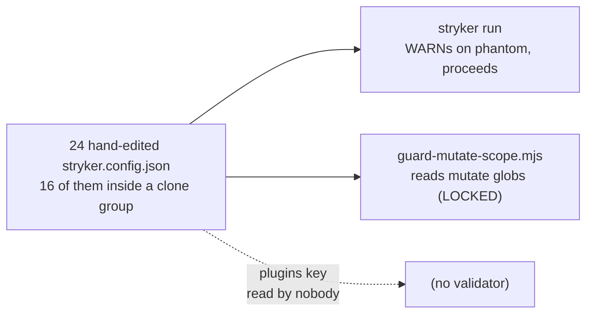
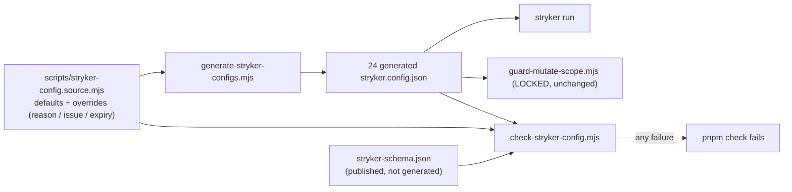
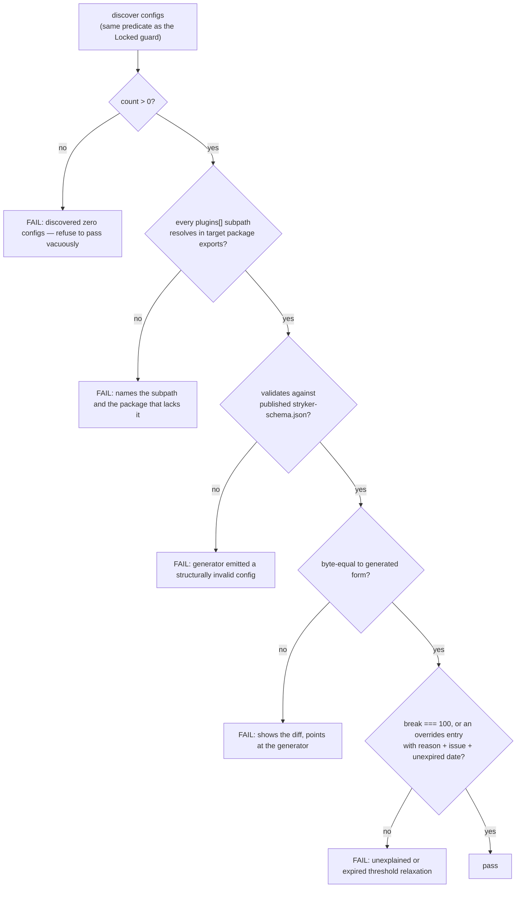

# fix: Mutation config drift and the gate hole that allowed it - Plan

## Goal Capsule

- **Objective:** Delete a plugin declaration that has never existed, replace 24 hand-maintained mutation configs with one generated source of truth, and close the harness holes that let a nonexistent plugin propagate into 13 packages unnoticed.
- **Product authority:** User, 2026-08-05, after measurement of the live tree.
- **Open blockers:** None. The `AGENTS.md` edits in U4 are human-controlled and need approval before landing.

---

## Problem Frame

Mutation testing is this repo's load-bearing quality gate — the constitution makes a perfect score the measure (§III.3) and the root `AGENTS.md` requires it on changed pure-core files. That gate is configured by 24 hand-maintained `stryker.config.json` files with no shared base.

Measured this session against the same discovery predicate the Locked `guard-mutate-scope.mjs` uses (`**/stryker.config.json`, minus `node_modules|dist|reports|coverage|repos|.worktrees|.git`; `.repos/` is gitignored and out of scope):

| Fact                                                                          | Value                                                                       |
| ----------------------------------------------------------------------------- | --------------------------------------------------------------------------- |
| `stryker.config.json` files                                                   | 24 — confirmed by the guard's own live count                                |
| Distinct shapes after normalising package names away                          | 10                                                                          |
| Files sitting in a byte-identical clone group                                 | 16, across 2 groups (13 + 3)                                                |
| Genuine singletons                                                            | 8                                                                           |
| Configs declaring `@systemfsoftware/stryker-plugins/lint-rule-helper-ignorer` | 13                                                                          |
| Commits in history that ever added a file under that name                     | 0, across 621 commits on all refs                                           |
| Packages setting `requireTestContribution`                                    | 0                                                                           |
| `thresholds` distributions                                                    | 20× `low:80`, 3× `low:100`, 1× `break:0`                                    |
| `ignorers` distributions                                                      | 18× `[effect-schema-declarations]`, 5× absent, 1× `+in-source-vitest-block` |
| Packages with reports violating `OX-MG1`                                      | 2 (`effect-daemon-spec`, `hex-schema`)                                      |

**The largest clone group is exactly the phantom cohort.** All 13 files that declare the nonexistent plugin are byte-identical to one another, and those same 13 are one clone group. The phantom did not drift in independently 13 times; one template was copied 13 times, and the error rode along. That is the mechanism this plan has to break.

`@systemfsoftware/stryker-plugins` exports `.` and `./effect-schema-ignorer`; `lint-rule-helper-ignorer` resolves to nothing, so all 13 runs emit `WARN PluginLoader Error during loading` and proceed without it. It was never deleted — `git log --all` finds no commit adding a file by that name, and no such artifact exists anywhere in installed `node_modules`.

Two harness holes let it survive:

1. **`OX-MG2` inspects the wrong key.** Its check reads `stryker.config.json#ignorers`, which is clean in all 24. The drift lives in `plugins`, which nothing inspects.
2. **The 100% mandate is stated at two levels with different checks.** Root `AGENTS.md` requires 100% on changed pure-core files; `packages/oxlint-plugins/AGENTS.md#OX-MG1` requires zero Ignored/Survived/NoCoverage. `effect-daemon-spec` and `hex-schema` violate the stricter form and sit outside the leaf that states it — the universal-but-demoted shape.

---

## Requirements

- **R1** — No `stryker.config.json` declares a plugin subpath the target package does not export.
- **R2** — Mutation config is edited in exactly one place; every tracked config file is generated output, not hand-maintained.
- **R3** — A `pnpm check` gate fails when any on-disk mutation config diverges from the generated form.
- **R4** — Every deviation from the default config (threshold, plugin set, mutate glob, ignorer) is recorded with a reason in the generator source, not discovered by reading 24 files.
- **R5** — `OX-MG2`'s check names a mechanism that actually fires on the drift it describes.
- **R6** — The 100% mutation mandate is stated at exactly one level of the instruction tree.
- **R7** — A threshold relaxation is a time-boxed, tracked exception that expires, never a permanent green.
- **R8** — The gate has at least one oracle independent of the generator, and fails closed when it discovers no configs.

---

## Key Technical Decisions

### KTD1 — Generate `stryker.config.json`; do not migrate to a shared `.mjs` config

A shared config package exporting `defineStrykerConfig()` — mirroring `@systemfsoftware/oxlint-config` — is the more idiomatic DRY mechanism, and the fork's config reader accepts `stryker.config.mjs` (`packages/stryker-js/core/src/config/config-file-formats.ts`). It is genuinely the better-looking option and was not dismissed lightly.

Two grounds decide against it, in order of weight:

1. **A `.mjs` config must be executed to be read.** Every static consumer — the Locked `guard-mutate-scope.mjs`, the new gate, any future audit — would have to import and run package-authored code to answer "what does this config say." That converts cheap static gates into evaluators and puts config-time code execution inside `pnpm check`. Generation keeps the artifact inert and readable by anything that can parse JSON.
2. **It would silently blind an existing Locked gate.** `guard-mutate-scope.mjs` globs `**/stryker.config.json`. Measured this session: run against a tree with zero matching configs, it prints `guard-mutate-scope: 0 stryker config(s) clean` and **exits 0**. A migration would therefore not fail loudly — it would pass vacuously.

Ground 2 is a fact about the current gate, not a reason the gate may never change. `AGENTS.md` explicitly permits proposing changes to Locked surfaces, and if a future change makes `.mjs` worth it, the correct sequence is: propose the guard change, land it, then migrate. This plan does not foreclose that; it declines to do it implicitly as a side effect of a drift fix. R8 exists so the same vacuous-pass hole is not reproduced in the new gate.

Generation also matches the repo's established pattern for generated config — REPO-S4 already requires `package.json#exports` be produced from `tsdown.config.ts` and never hand-edited.

### KTD2 — The overrides table is the exemption record, and relaxations expire

Per-package deviations live as explicit entries in the generator source. A deviation that merely differs from the default (a different mutate glob, an extra ignorer) needs a `reason`. A deviation that **relaxes `thresholds.break` below 100** is a different animal: it suspends the constitution's §III.3 gate for that package, so it additionally requires a tracking issue and an expiry date, and the gate rejects it once that date passes. A reason string alone is not sufficient to lower a gate.

### KTD3 — Two oracles: byte-equality for drift, the published schema for correctness

Byte-comparing disk against regenerated output proves only that disk matches the generator — it cannot detect a generator that faithfully emits the wrong thing. So the gate carries a second, independent check: each generated config is validated against `@systemfsoftware/stryker-js-core`'s published `schema/stryker-schema.json`, which every config already references via `$schema` and which no part of the generator produces.

Mutation-result conformance stays with `pnpm --filter <pkg> mutation`. A gate needing a full mutation run could not live in `pnpm check`.

---

## High-Level Technical Design

Today — every consumer reads a hand-maintained file, and one consumer reads a key nothing validates:



After — one source of truth, generated output, and a gate with two independent oracles:



Gate decision order — fail closed first, then most specific:



---

## Implementation Units

> U-IDs are stable. There is no U5 — it was folded into U2 during review; the gap is deliberate.

### U1. Delete the phantom plugin declaration

- **Goal:** Remove `@systemfsoftware/stryker-plugins/lint-rule-helper-ignorer` from the 13 configs that declare it.
- **Requirements:** R1
- **Dependencies:** none
- **Files:** `packages/oxlint-plugins/{effect-workflow,effect-handler,effect-middleware,effect-policy,effect-store,effect-acl,effect-adapter,effect-shape,effect-state,effect-kernel,effect-observer,effect-entrypoint,cell-imports}/stryker.config.json`
- **Approach:** Delete the array entry only. Leave `effect-schema-ignorer`, `ignorers`, thresholds, and mutate globs untouched — this must be a pure deletion so U2's acceptance stays meaningful. These 13 files are byte-identical, so the same one-line deletion applies to each and they must remain byte-identical afterward. Knowledge-placement row 7: the declaration referenced nothing, so deletion carries no information forward; git history is the archive.
- **Patterns to follow:** none — this is a deletion.
- **Test scenarios:** `Test expectation: none -- deletion of a config entry that resolved to nothing; U3's gate is the durable proof.`
- **Verification:** A mutation run in any affected package no longer emits `WARN PluginLoader Error during loading '@systemfsoftware/stryker-plugins/lint-rule-helper-ignorer'`, its score is unchanged from the pre-edit report, and the 13 files remain byte-identical to each other.

### U2. Single source of truth, generator, and the debt entries

- **Goal:** Encode all 24 configs as one defaults object plus a per-package overrides table, generate the files from it, and record the two known threshold/debt exceptions in that same table.
- **Requirements:** R2, R4, R7
- **Dependencies:** U1
- **Files:** `scripts/stryker-config.source.mjs` (create), `scripts/generate-stryker-configs.mjs` (create), root `package.json` (add `generate:stryker-config`), all 24 `stryker.config.json`
- **Approach:** Three ordered steps.
  1. **Fix discovery scope.** The generator discovers configs with the _same predicate the Locked guard uses_ — `**/stryker.config.json` minus `node_modules|dist|reports|coverage|repos|.worktrees|.git` — which yields 24 and includes `omp/plugins/omp-claude-compat/stryker.config.json`. Do not scope to `packages/**`: that config is git-tracked and already guard-checked, so excluding it would leave a hand-maintained config in permanent violation of R2. Two tools disagreeing about which configs exist is the bug class being fixed, so their discovery predicates must match by construction.
  2. **Normalize, as its own commit.** Emit a canonical key order and formatting, apply it to all 24 files mechanically, and land that alone. Byte-identical regeneration is otherwise unachievable across 10 distinct shapes with divergent key ordering, and mixing normalization into the generator commit would hide real deviations inside formatting churn.
  3. **Encode the table.** `defaults` plus `overrides` keyed by package directory. Every entry carries `reason`. Entries relaxing `thresholds.break` below 100 additionally carry `issue` and `expires` (see KTD2) — this covers `effect-daemon-spec` (`break: 0`, 45 Ignored, 4 Survived as of 2026-08-05) and `hex-schema` (104 Ignored as of 2026-08-05). The `omp-claude-compat` config's distinct shape (`mutate: ["src/*.workflow.ts"]`, its own `ignorePatterns`) becomes an ordinary overrides entry.
- **Execution note:** Build the overrides table by reading the tree, not by designing it — step 3's acceptance only holds if the table encodes what is actually there.
- **Test scenarios:**
  - A package with an empty overrides entry generates exactly the defaults.
  - An override setting `thresholds.break` leaves all other keys at defaults.
  - A package present on disk but absent from the overrides table generates from defaults rather than throwing.
  - Generating twice produces byte-identical output (idempotence).
  - The generated set contains exactly the 24 discovered paths, including the `omp/` config.
- **Verification:** After step 2 is committed, running the generator produces **zero diff** (`git status --porcelain` empty). This is the unit's point: it proves the table faithfully encodes the tree before the table becomes authoritative. Any residual diff is an unrecorded deviation to add to `overrides`, never a reason to loosen the acceptance.

### U3. `check:stryker-config` gate

- **Goal:** Fail `pnpm check` on an empty config set, an unresolvable plugin subpath, a schema-invalid config, drift, or an unexplained/expired threshold relaxation.
- **Requirements:** R1, R3, R8, R7
- **Dependencies:** U2
- **Files:** `scripts/check-stryker-config.mjs` (create), root `package.json` (add `check:stryker-config`, chain it into `check`)
- **Approach:** Implement the decision diagram in its stated order.
  - **Fail closed on zero.** Discover with the guard's predicate; if the count is zero, exit non-zero. This is not optional hardening — measured this session, the Locked guard exits 0 on an empty set, and reproducing that hole in a gate written to prevent it would be self-defeating (R8, KTD1 ground 2). Print the discovered count on success so a silent collapse is visible.
  - **Independent oracle.** Validate each config against `@systemfsoftware/stryker-js-core`'s `schema/stryker-schema.json` — the artifact every config already names in `$schema`, produced by no part of the generator. Byte-equality alone would only ever prove the generator agrees with itself (KTD3).
  - **Resolve plugin subpaths** against the target package's `package.json#exports`. Handle wildcard and conditional export forms rather than assuming a flat map. This is the check that would have caught the phantom the day it was written.
  - **Threshold relaxations** require `reason` + `issue` + an `expires` date that has not passed.
  - Ship `--selftest` and wire the chain as `node scripts/check-stryker-config.mjs --selftest && node scripts/check-stryker-config.mjs`, matching `check:no-hand-rolled-jsonc`, `check:publish-config`, and `check:project-references`. The selftest carries the fixtures in-process, so no separate Vitest file duplicates them. Follow the reporting shape of `scripts/check-exports.mjs`.
- **Test scenarios:**
  - Zero discovered configs fails, and the message says the gate refused to pass vacuously.
  - A config declaring a subpath absent from the target's `exports` fails, naming both subpath and package.
  - A config declaring a subpath that **is** exported passes.
  - A config violating `stryker-schema.json` fails even when it is byte-equal to generated output — the circular-validation guard.
  - A config byte-identical to generated output, schema-valid, passes.
  - A config with one mutated key fails, naming that key.
  - `break: 0` with no overrides entry fails.
  - `break: 0` with an entry carrying `reason` but no `issue` fails.
  - `break: 0` with `reason` + `issue` + a **past** `expires` fails.
  - `break: 0` with `reason` + `issue` + a future `expires` passes.
  - Re-adding `lint-rule-helper-ignorer` to one config fails. This is the load-bearing known-bad fixture: its absence is precisely what let the phantom survive in 13 packages.
- **Verification:** `pnpm check:stryker-config` runs its selftest then exits 0 on the clean tree, printing a config count of 24; `pnpm check` runs it in the chain. Every scenario above is a selftest case, so the gate re-proves itself on each invocation rather than only under `pnpm test`.

### U4. Close the harness holes

- **Goal:** Point `OX-MG2`'s check at a mechanism that fires, and state the 100% mandate at one level only.
- **Requirements:** R5, R6
- **Dependencies:** U3 (the check must exist before a rule can name it)
- **Files:** `packages/oxlint-plugins/AGENTS.md`, root `AGENTS.md`
- **Approach:** Four edits.
  1. `OX-MG2`'s `check` field currently reads `ignorers` and greps for `Stryker disable`. Replace the `ignorers` half with `pnpm check:stryker-config` — the drift it describes lives in `plugins`, and prose can inspect neither key. Knowledge-placement row 5: the rule becomes mechanically enforced rather than review-asserted.
  2. The 100% mandate appears in root `AGENTS.md` (Verification Commands) and in `OX-MG1`. Keep the universal statement at root per the retrieval-gating rule — its harm fires in every package, and two violating packages sit outside the oxlint-plugins subtree. Reduce `OX-MG1` to the oxlint-specific delta and drop the restated universal. Take care that the reduction removes only the restated universal, not any oxlint-specific obligation.
  3. Register `scripts/check-stryker-config.mjs` in the root Surface Classes table as Locked, alongside the existing evaluation gates.
  4. Update the documented `pnpm check` chain in root `AGENTS.md` to include the new gate. The line is being rewritten anyway; write it truthfully, which also means restoring the already-missing `check:project-references`.
- **Execution note:** Both files are Locked or human-controlled surfaces. Land these edits only after explicit user approval (USER-H1, REPO-P1); propose the exact diff first.
- **Test scenarios:** `Test expectation: none -- instruction-file edits.` Proof is the harness validator score plus a literal comparison of the documented chain against the resolved `check` script.
- **Verification:** `node ~/.claude/skills/harness-creator/scripts/validate-harness.mjs --target .` reports hierarchy no worse than the 4/5 baseline; the 100% mandate appears in exactly one instruction file; the documented chain string matches the resolved `check` script token for token; `OX-MG2`'s named check exits non-zero on a planted violation.

---

## Verification Contract

```bash
pnpm check                                                              # full chain, now including check:stryker-config
node scripts/check-stryker-config.mjs --selftest                        # the gate proves itself
node scripts/generate-stryker-configs.mjs && git status --porcelain     # must be empty
pnpm --filter @systemfsoftware/oxlint-plugin-effect-workflow mutation   # spot-check one U1 package
node ~/.claude/skills/harness-creator/scripts/validate-harness.mjs --target .   # hierarchy >= 4/5
```

Byte-equality proves self-consistency only; the schema validation in U3 is what makes the pass mean the configs are structurally correct.

---

## Scope Boundaries

**In scope:** the phantom declaration, config duplication, the drift gate, and the two harness holes.

### Deferred to Follow-Up Work

- Killing the 149 Ignored and 4 Survived mutants in `effect-daemon-spec` and `hex-schema`. U2 records them as expiring, issue-tracked debt; it does not fix them. The `expires` date is what stops the deferral from becoming permanent.
- Correcting `CONCEPTS.md`'s `check-exports` entry, which claims it is "not currently in `pnpm check`'s blocking pipeline" — measured false this session. Real, but unrelated to mutation-config drift; it belongs to a harness-hygiene pass, not here.
- The 44 unkilled mutants in `cell-imports` — long-standing, measured byte-identical at 63.03% on 2026-08-03, unrelated to this drift.
- Tuning `requireTestContribution`, currently unset in all 24 packages.
- The `low: 80` vs `low: 100` split (20 vs 3). U2 records it; choosing one is a separate decision.

### Outside this change's identity

- Any change to what mutation testing _measures_ — the CompileError cohort, bail settings, dominator reduction, the 100% break threshold itself. Those belong to the separate mutation-regime research.
- `packages/stryker-js/**` fork internals.
- The in-flight agent-friendly Stryker CLI rebuild (`docs/plans/2026-08-05-001`). This plan touches config files; that one touches the CLI surface.

---

## Assumptions

Recorded because the scoping confirmation was skipped at the user's instruction.

- **A1** — `lint-rule-helper-ignorer` is deleted rather than implemented. Grounded: no file by that name exists in any commit on any ref, and no such artifact exists in installed `node_modules`. Writing one would be a new feature with no stated requirement.
- **A2** — Generated `stryker.config.json` files stay committed rather than gitignored, because the Locked `guard-mutate-scope.mjs` reads them from the working tree.
- **A3** — The 5 configs with no `ignorers` and the 1 with an extra `in-source-vitest-block` are intentional. U2 step 3 forces a written reason for each; if no honest reason exists, that is a finding for follow-up.

---

## Risks & Dependencies

| Risk                                                                                       | Mitigation                                                                                                          |
| ------------------------------------------------------------------------------------------ | ------------------------------------------------------------------------------------------------------------------- |
| The generator faithfully emits a wrong value into all 24 configs and the gate certifies it | Schema validation against the published `stryker-schema.json` — an oracle the generator does not produce (KTD3, R8) |
| A future `.mjs` migration silently blinds the Locked guard                                 | U3 fails closed on a zero config count and prints the count on success. This is implemented, not "considered"       |
| Normalization churn hides real deviations inside U2's zero-diff acceptance                 | Normalization lands as its own commit before the generator commit (U2 step 2)                                       |
| An override entry becomes a permanent way to keep `break: 0` green                         | Relaxations require `issue` + `expires`, and the gate fails once the date passes (KTD2, R7)                         |
| `OX-MG1` reduction drops an oxlint-specific obligation                                     | Diff the rule text before and after; only the restated universal is removed                                         |
| Two `AGENTS.md` files are Locked surfaces                                                  | U4 is gated on explicit user approval and lands as its own commit                                                   |

---

## System-Wide Impact

24 configs get regenerated; 13 lose a line. No source, test, or published artifact changes. `pnpm check` gains one step. Contributors gain one rule: edit the generator, never the output — the same rule REPO-S4 already states for `package.json#exports`.

---

## Open Questions

- **Q1** — Should the 13 packages that declared the phantom instead register the real `in-source-vitest-block` ignorer? It exists in `packages/stryker-plugins/src/in-source-test-ignorer/` and only one package registers it. Deferred: it changes what is ignored, which is a measurement decision, not a drift fix.
- **Q2** — Should `low` be unified at 80 or 100? U2 records the split; resolving it needs a reason neither value currently has.
- **Q3** — What `expires` horizon is right for the two debt entries? The mechanism is fixed by KTD2; the duration is a judgment the user should set.

---

## Definition of Done

- `pnpm check` exits 0 with `check:stryker-config` in the chain, reporting 24 configs.
- Regenerating produces zero diff.
- Every selftest scenario in U3 passes, including the zero-config and schema-invalid cases.
- No `stryker.config.json` declares an unresolvable plugin subpath.
- The 100% mandate appears in exactly one instruction file.
- The documented `pnpm check` chain matches the resolved script token for token.
- The harness validator's hierarchy subsystem is no worse than its 4/5 baseline.

---

## Sources & Research

- Measured this session from the working tree, using the Locked guard's own discovery predicate: 24 configs, 10 distinct shapes, 16 files in 2 clone groups (13 + 3), 8 singletons, 13 phantom declarations, 0 commits adding the plugin file across 621 commits, threshold and ignorer distributions, `OX-MG1` conformance from on-disk `reports/mutation-report.json` files.
- Measured: `guard-mutate-scope.mjs` run against a tree with zero configs prints `0 stryker config(s) clean` and exits 0. The basis for R8 and KTD1 ground 2.
- Measured: the guard's live count in this repo is 24, confirming `omp/plugins/omp-claude-compat/stryker.config.json` is in its scope; `.repos/` is gitignored.
- `packages/stryker-js/core/src/config/config-file-formats.ts` — the fork accepts `stryker.config.json` and `stryker.config.mjs`.
- `scripts/guard-mutate-scope.mjs` — Locked; globs `**/stryker.config.json` and parses JSON.
- `packages/oxlint-plugins/AGENTS.md` — `OX-MG1`, `OX-MG2`.
- `harness-creator` `references/hierarchy-pattern.md` — retrieval gating and the universal-but-demoted shape (U4 edit 2); `references/knowledge-placement-pattern.md` — escalation chain rows 5 and 7 (U1, U4 edit 1).
- Harness validator baseline this session: overall 80/100, bottleneck hierarchy 4/5.
- Review: five personas (coherence, feasibility, product-lens, scope-guardian, adversarial). Three findings converged across independent reviewers — the missing zero-count assertion, the `reason`-only threshold whitelist, and the uncounted 24th config — and all three are resolved above. The cross-model pass was skipped: the only reachable peer CLI was the host provider itself.
