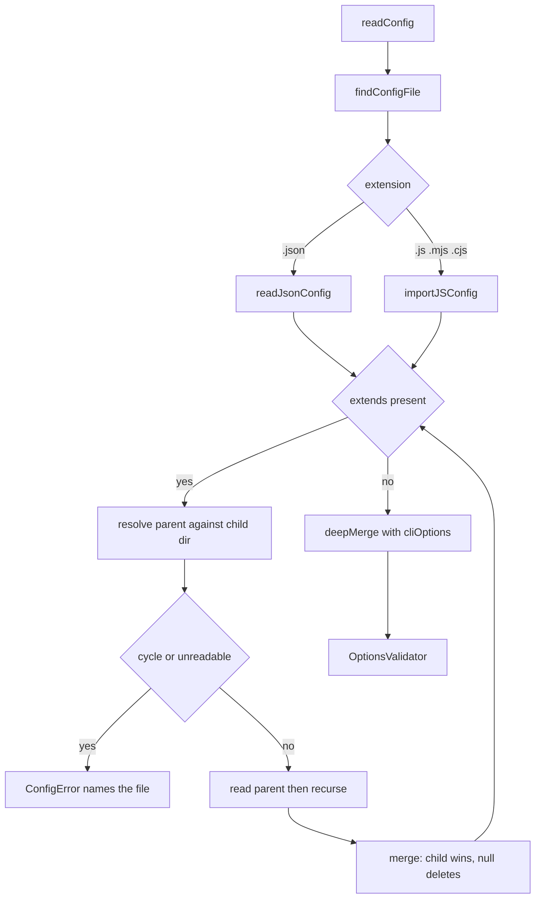
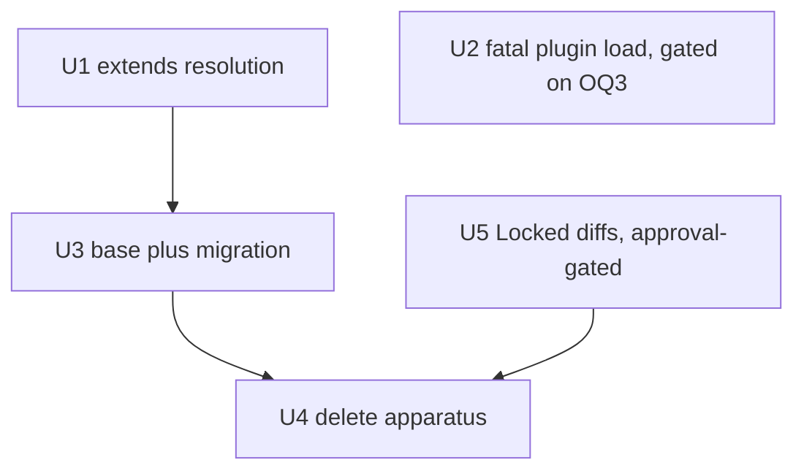

# Stryker Config Inheritance - Plan

## Goal Capsule

- **Objective:** Teach our StrykerJS fork a config `extends` key, move the shared configuration into one repo-root base file, and delete the three-script generator apparatus that existed only because the library could not inherit.
- **Authority hierarchy:** `CONSTITUTION.md` (V.7 subtract-before-add, A.2 prefer the gate, III.3 mutation is the measure, III.4 behavior where the mutator sees it) > root `AGENTS.md` (REPO-S3 vendored read-only, REPO-S4 generated output, REPO-S5 mutate scope, REPO-R1 breaks are mandatory, REPO-A1 full gate) > this plan.
- **Execution profile:** Deep. Five units, two of them gated on human approval.
- **Stop conditions:** Stop and ask before editing any Locked surface (`AGENTS.md` at either level, `scripts/guard-mutate-scope.mjs`). Stop if U3's resolved-options comparison finds a difference the plan does not predict.
- **Tail ownership:** The implementer owns build, test, `pnpm check`, and the mutation spot-checks. Merge, publish, and release remain human-controlled (REPO-P1).

---

## Product Contract

### Summary

Our fork of StrykerJS gains an `extends` key so one `stryker.config.json` can inherit from another. The 24 package configs become hand-maintained files that each declare their own `mutate` list and inherit everything else from a repo-root `stryker.base.json`. The generator, its source module, and its drift gate are then deleted.

### Problem Frame

Twenty-four `stryker.config.json` files share almost all of their content. StrykerJS has no config-level inheritance, so the repo grew its own: `scripts/stryker-config.source.mjs` holds a defaults-plus-overrides table, `scripts/generate-stryker-configs.mjs` renders 24 files from it, and `scripts/check-stryker-config.mjs` gates the rendered output against drift. That apparatus is a workaround for a missing library feature, and it carries its own failure surface — the generator needs a self-test, the gate needs a schema oracle, and both must stay aligned with a third discovery predicate in the Locked `scripts/guard-mutate-scope.mjs`.

The apparatus was not built speculatively. A plugin subpath that never existed, `@systemfsoftware/stryker-plugins/lint-rule-helper-ignorer`, was copied into 13 byte-identical configs and nothing caught it, because Stryker logs an unloadable plugin as a warning and continues. Any replacement has to answer for that incident rather than reopen it.

### Rejected alternative

A `.js`/`.mjs` config importing a shared module would give inheritance today with no library change. It is rejected because a JS config must be _executed_ to be read, and two surviving consumers read these files statically: the Locked `scripts/guard-mutate-scope.mjs`, which parses every config to check `mutate`, and CI discovery. Both would have to execute package-authored code inside `pnpm check` to see a config's contents, and a guard that cannot read a config without running it is a guard that can be fooled by the code it runs. Static JSON keeps the guard dumb and honest. This rationale currently survives only in the header of `scripts/stryker-config.source.mjs`, which U4 deletes, so U5 carries it into the replacement text for `AGENTS.md` line 125 — otherwise a future agent re-proposes JS configs with no trace of the settled decision.

### Requirements

**Library capability**

- R1. A config file may declare `extends` naming one parent config, and the fork resolves the chain before validation.
- R2. Merging is top-level shallow with one level of object merge: a child scalar or array replaces the inherited value wholesale, a child object merges one level deep over the inherited object.
- R3. A child key set to `null` deletes the inherited key.
- R4. Inherited relative path values pass through unrewritten, so each package resolves them against its own working directory.
- R5. A cycle, an unresolvable parent, or a parent that is not valid JSON fails the run with the offending file named.
- R6. `extends` is recognized by both the runtime schema and the shipped `stryker-schema.json`, so it raises no unknown-option warning and editors accept it.

**Compensating control**

- R7. A literal plugin descriptor that cannot be loaded, or that loads without contributing a plugin or a validation schema, fails the run instead of warning and continuing.

**Migration**

- R8. A repo-root `stryker.base.json` carries the shared configuration and all 24 configs inherit from it.
- R9. Every package config keeps its own literal, non-empty `mutate` array.
- R10. Each package's resolved options, ignoring the `extends` key itself, equal the file the migration replaces key for key.

**Removal**

- R11. The three generator scripts are deleted, along with their `package.json` script entries and their wiring into the `check`, `check:ci`, and `pre-push` chains.
- R12. Turbo's `mutation` task inputs include the base file, so editing the base invalidates the cache.
- R13. Deleting the drift gate does not leave `scripts/guard-mutate-scope.mjs` able to pass vacuously on zero discovered configs.
- R14. Locked-surface references to the removed gate receive proposed diffs, never direct edits.

### Scope Boundaries

**Deferred for later**

- The open mutation debt in `packages/effect-daemon-spec`, `packages/hex-schema`, and `packages/oxlint-plugins/cell-imports` keeps its own track; this plan does not move those numbers.
- Widening `extends` to accept an array of parents (KTD6). A single string covers every case in the repo and widening later is backward-compatible.
- The undeclared dependency on `@systemfsoftware/stryker-plugins` in 16 oxlint packages, which resolve its subpath only through the bin-shim `NODE_PATH`. U2 raises the blast radius of that debt from a warning to a hard failure without creating it; declaring the dependency is separate work.

**Outside this product's identity**

- Normalizing or improving the 24 configs while migrating them. The migration reproduces today's resolved values exactly; any change of intent is a separate commit with its own justification. This rule is why no annotation or comment convention is introduced here (OQ4).
- Upstreaming `extends` to `stryker-mutator/stryker-js`. The package under `packages/` is ours (root `AGENTS.md`, Instruction Hierarchy).

### Open Questions

- OQ1 (deferred). The gate's relaxation bookkeeping — every `thresholds.break` below 100 or non-empty `excludedMutations` needed a `reason`, an `issue`, and an unexpired `expires` (`scripts/check-stryker-config.mjs:147-173`) — has no replacement. Recommendation: accept the loss, on these grounds: zero of the 24 configs currently carry a relaxation, so the gate enforces nothing today; the run-time threshold itself is untouched, so a package below `break` still fails its own mutation run; and the tracking data lived in the `overrides` table being deleted, so keeping it means building new structure for a mechanism with no current users. What is lost is exception-tracking, not the threshold — a future developer who lowers `break` to unblock a run gets no expiry forcing renegotiation. Not blocking.
- OQ2 (blocking for U4 landing). U5's Locked-surface diffs need explicit approval before U4 can land, because U4 makes root `AGENTS.md` lines 120 and 125 factually wrong the moment it merges.
- OQ3 (blocking for U2 landing). U2 is a fourth deliverable beyond the confirmed scope of teach-migrate-delete, and it breaks published behavior in `@systemfsoftware/stryker-js-core` v1.2.4. The trade is the user's to make, not the plan's: restore the phantom-plugin protection in the loader where it cannot be wrong (KTD7), or accept C3's loss the way OQ1 accepts C4a's and drop U2 entirely. U1, U3, and U4 do not depend on U2 and can land either way.
- OQ4 (deferred). Eight of the ten `overrides` entries in `scripts/stryker-config.source.mjs` are non-relaxations carrying a prose `reason` — for example `cell-taxonomy` setting `coverageAnalysis: 'off'` because RuleTester suites report no per-test coverage. U4 deletes that file and those reasons with it. An earlier draft required a `<key>_comment` sibling in each config, which `options-validator.ts:266` would accept; that was cut because it changes 24 artifacts during a migration whose own boundary forbids improving them, and because nothing in the surviving chain would enforce it. Recommendation: capture the eight reasons in U4's deletion commit body, where git preserves them, and introduce an annotation convention separately if it earns its own gate. Not blocking.

### Sources

- `packages/stryker-js/core/src/sandbox/ts-config-preprocessor.ts` — the in-repo `extends` resolver precedent, including cycle detection through a `touched` Set.
- `packages/stryker-js/core/src/config/config-reader.ts:46-111` — the insertion point. `readConfig` calls `loadOptionsFromConfigFile` at :49, merges CLI options at :52, and validates at :53.
- `packages/stryker-js/core/src/di/plugin-loader.ts:99-121, 156-205` — literal descriptors pass through `resolvePluginModules` unchanged and reach `loadPlugin`, where all three failure branches warn.
- `packages/stryker-js/core/src/config/options-validator.ts:260-287` — unknown top-level keys are warned, not rejected.
- `packages/stryker-js/core/src/index.ts` — exports `Stryker`, `StrykerCli`, `reporterPluginsFileUrl`, `strykerPlugins`. `ConfigReader` is not among them and `src/config/index.ts` is never re-exported, which is why U3's verifier cannot call the resolver.
- `scripts/guard-mutate-scope.mjs:42-44, 65-72, 111-113` — filesystem glob discovery, the `mutate` array check that makes R9 load-bearing, and the success path that exits 0 on zero configs.
- `docs/plans/2026-08-05-002-fix-mutation-config-drift-plan.md` — the apparatus this plan removes, and the incident that produced it.
- [TypeScript `extends` reference](https://www.typescriptlang.org/tsconfig/#extends) — relative paths resolve against the file they originated in. Our divergence from that rule is KTD1.
- Upstream StrykerJS has no config-level `extends`; issue [#4776](https://github.com/stryker-mutator/stryker-js/issues/4776) concerns `tsconfig` `extends` inside the sandbox, a different mechanism.

---

## Planning Contract

### Key Technical Decisions

- KTD1. **Inherited relative paths are not rewritten.** TypeScript resolves an inherited relative path against the file it came from; Stryker resolves option paths against the working directory. Rewriting would break `incrementalFile: 'reports/stryker-incremental.json'`, carried by 21 of the 24 configs, which must mean a different directory in each package. Only the `extends` pointer itself resolves against the child file's directory. The constraint this buys: the base cannot express a path meant to be relative to the repo root, because every base path is read per-child-cwd.
- KTD2. **`null` deletes an inherited key.** The generator expressed this with an `ABSENT` symbol; JSON has no symbols and `undefined` does not survive serialization. TypeScript has no equivalent, so this is our one addition to the borrowed semantics.
- KTD3. **The `extends` resolver stays internal to the package.** No new subpath export, so no `tsdown.config.ts` entry, no `package.json#exports` edit, and no new obligations under `check:exports` or `check:publish-config`. This covers U1 only; U2 changes published behavior and is governed by KTD9. It also settles how U3 verifies itself — see KTD11.
- KTD4. **Every package config keeps a literal `mutate`.** The Locked guard records a violation for any config whose `mutate` is missing or not an array (`scripts/guard-mutate-scope.mjs:65-72`). Inheriting `mutate` from the base would make the guard blind to the one thing it exists to check.
- KTD5. **The base is `stryker.base.json`, not a root `stryker.config.json`.** The guard globs `**/stryker.config.json` from the repo root, and `**` matches zero directories, so a root config would be discovered and rejected for having no `mutate`.
- KTD6. **`extends` takes one string.** Widening to `string | string[]` later adds no breaking change; starting with the union adds merge-order semantics nothing needs.
- KTD7. **Plugin load failure becomes fatal for literal descriptors only.** This replaces the deleted gate's resolution check. The gate emulated pnpm's hoisted-store resolution from the consumer side; the loader that actually loads plugins cannot be wrong about whether they load. The phantom subpath throws `ERR_PACKAGE_PATH_NOT_EXPORTED`, which misses the `ERR_MODULE_NOT_FOUND` branch at `plugin-loader.ts:189` and lands in the generic branch at `:197` — so promoting all three branches, not just the not-found one, is what catches the original incident.
- KTD8. **Errors reuse `ConfigError` from `packages/stryker-js/core/src/errors.ts`.** `ConfigReaderError` lives in `config-reader.ts`, and the resolver is imported by that file; reusing `ConfigError` keeps the dependency one-directional.
- KTD9. **U2 is a breaking change to a published package.** `@systemfsoftware/stryker-js-core` is public at v1.2.4, and a consumer relying on warn-and-continue for a non-contributing module will now crash. REPO-R1 makes the break correct rather than something to soften, but it must be recorded — U2's commit carries a `BREAKING CHANGE:` footer so semantic-release bumps accordingly. Whether to take the break at all is OQ3.
- KTD10. **Unknown-key rejection degrades from error to warning, and that is accepted.** The deleted apparatus rejected an unknown key twice: the source module threw on a key absent from `KEY_ORDER`, and any hand-edit introducing a stray key failed as byte drift. The library only warns — `stryker-schema.json` sets `additionalProperties: false` on nested objects but not on the root, and `options-validator.ts:272-274` logs rather than throws. Adding root-level `additionalProperties: false` is rejected: plugins contribute top-level keys through `strykerValidationSchema`, merged at runtime, so a closed root would reject legitimate plugin options. The mitigation is structural — a child that typos a key it also inherits still resolves to the base's correct value.
- KTD11. **U3's verifier implements its own merge and never calls the resolver.** Two reasons converge. `ConfigReader` is not exported from `src/index.ts`, so a script cannot reach the production resolver without softening KTD3. And using it would make the oracle self-referential: resolving migrated configs with the code under test, then diffing against a snapshot, cannot detect a merge bug that the migration was iteratively shaped to satisfy. A twenty-line independent merge in the throwaway script keeps the three verification legs independent — U1's unit tests prove the semantics, the verifier proves the decomposition, and the mutation runs prove the real resolver end to end.

### What happens to the deleted apparatus's checks

The gate is not one check. Naming each one's disposition is the argument for deleting it.

| #   | Check                                             | Site                                 | Disposition                                                                                                                                                                                           |
| --- | ------------------------------------------------- | ------------------------------------ | ----------------------------------------------------------------------------------------------------------------------------------------------------------------------------------------------------- |
| C1  | Zero discovered configs fails closed              | `check-stryker-config.mjs:221-224`   | Preserved by proposal — U5's guard line (R13)                                                                                                                                                         |
| C2  | Config validates against `stryker-schema.json`    | `:72-77`                             | Type and structure validation moves into the library, which validates every run; unknown-key rejection degrades to a warning (KTD10)                                                                  |
| C3  | Plugin subpath resolves                           | `:128-141`                           | Moves into the library, strengthened — U2 also catches a module that resolves but contributes nothing, which the gate never checked (KTD7). Dropped instead if OQ3 resolves against U2                |
| C4a | Relaxation carries reason, issue, unexpired date  | `:147-173`                           | Dropped — OQ1                                                                                                                                                                                         |
| C4b | Every override carries a `reason`                 | `:176-180`                           | Dissolves with the source table — it constrained an `overrides` entry, an authoring discipline on the generator, and never applied to a shipped config. The rationale it guarded loses its home (OQ4) |
| C5  | Generated output matches the source byte for byte | `:184-205`                           | Dissolves — no generated output exists                                                                                                                                                                |
| C6  | Config is parseable JSON                          | `:233-236`                           | Moves into the library — the load fails before validation; R5 extends that to parents                                                                                                                 |
| S1  | Override key absent from `KEY_ORDER` throws       | `stryker-config.source.mjs:287-292`  | Dissolves with the table; the residue is KTD10                                                                                                                                                        |
| S2  | Git-tracked discovery agrees with the filesystem  | `generate-stryker-configs.mjs:45-53` | Dissolves — it ran only under `pnpm generate:stryker-config`, never in the gate chain, and the guard's filesystem glob is strictly wider than the git-tracked predicate it compared                   |

One check moves from `pnpm check` time to mutation-run time: the gate resolved every plugin for all 24 configs on every `pnpm check`, while U2 resolves a package's plugins only when that package's mutation runs. All 24 run mutation in CI, so coverage is unchanged; detection latency is not.

### High-Level Technical Design

Resolution happens inside `loadOptionsFromConfigFile`, after the file's own content is read and before `readConfig` merges CLI options over the result. That ordering means an `extends` chain cannot override a CLI flag, which matches how the CLI already wins over a config file.

### Assumptions

- The 24 configs currently on disk are the intended state, and the dying gate certifies them. `node scripts/check-stryker-config.mjs` exits 0 against the working tree today (`24 config(s) clean`), so the files are consistent with `scripts/stryker-config.source.mjs` and are a sound migration source. That certification is the gate's last useful act and must be re-run immediately before U3 takes its snapshot.
- The working tree currently holds 21 modified configs plus a modified `scripts/stryker-config.source.mjs`, uncommitted. Commit that state before starting, so U3's snapshot has a git baseline to diff against and U4's deletion does not mix with unrelated edits.
- No config in the repo is a `.js`/`.mjs` config today, so `extends` inside a JS config is reachable but unexercised by the migration. U1 covers it by unit test.

### Sequencing

U1 and U2 are independent and can land in either order; U2 is additionally gated on OQ3 and may be dropped without affecting the others. U3 requires U1 built, because `packages/stryker-js/core/bin/stryker.js` imports `../dist/index.mjs`. U4 requires U3 and OQ2. U5's guard line is additive and may land ahead of its documentation diffs, which closes the window where neither gate refuses a zero-config run.

---

## Implementation Units

### U1. Resolve `extends` in the config reader

- **Goal:** A `stryker.config.json` declaring `extends` loads with its parent's options merged underneath its own.
- **Requirements:** R1, R2, R3, R4, R5, R6
- **Dependencies:** none
- **Files:**
  - `packages/stryker-js/core/src/config/resolve-extends.ts` (create)
  - `packages/stryker-js/core/src/config/config-reader.ts` (modify — resolve inside `loadOptionsFromConfigFile`)
  - `packages/stryker-js/core/src/config/fork-schema.ts` (modify — add `extends` beside the existing `requireTestContribution` property)
  - `packages/stryker-js/core/schema/stryker-schema.json` (modify — add `extends`)
  - `packages/stryker-js/core/test/unit/resolve-extends.spec.ts` (create)
- **Approach:** Mirror `TSConfigPreprocessor`'s cycle detection — a `Set` of already-visited absolute paths, raising `ConfigError` on re-entry per KTD8. Resolve the `extends` value against `path.dirname(configFile)`, which is in scope as the function's parameter, then read the parent through the same extension dispatch the child used so a `.json` parent and a `.js` parent both work; that dispatch is the if/else at `:73-77`, which needs extracting so both arms flow into resolution. Write the merge in `resolve-extends.ts`; do **not** reuse `deepMerge` from `@stryker-mutator/util`, which fails R2 and R3 on three counts — it recurses instead of merging one level, it treats a `null` child as a value to assign rather than a key to delete, and it throws a `TypeError` when both sides of a key are `null`. Both `fork-schema.ts` and `schema/stryker-schema.json` are hand-maintained with no build step, and must change together: the runtime schema governs the unknown-option warning, the shipped file governs editor completion.
- **Test scenarios:**
  - A config with no `extends` loads exactly as before.
  - A child inherits a key it does not state.
  - A child scalar replaces the inherited scalar.
  - A child array replaces the inherited array wholesale rather than concatenating.
  - A child object merges one level deep over the inherited object.
  - A child key set to `null` is absent from the resolved options.
  - A child sets an object-valued key to `null` where the parent's value is also an object — the key is deleted, not a crash.
  - A grandparent chain resolves, with the nearest child winning.
  - An `extends` pointing at a missing file fails with the path in the message.
  - An `extends` pointing at malformed JSON fails with the parent's path in the message.
  - A two-file cycle fails rather than recursing until the stack overflows.
  - A self-referential `extends` fails.
  - An inherited relative path value is unchanged in the resolved options.
  - A `.js` config declaring `extends` resolves the same way as a `.json` one.
  - A config carrying `extends` produces no unknown-option warning from `OptionsValidator`.
- **Verification:** `pnpm --filter @systemfsoftware/stryker-js-core test` passes; the new spec fails if the resolver is removed.

### U2. Fail the run when a literal plugin descriptor cannot load

- **Goal:** A plugin named in `plugins` that does not resolve, or resolves to a module contributing nothing, stops the run instead of warning.
- **Requirements:** R7
- **Dependencies:** OQ3 resolved in favor of taking the break
- **Files:**
  - `packages/stryker-js/core/src/di/plugin-loader.ts` (modify)
  - `packages/stryker-js/core/test/unit/plugin-loader.spec.ts` (modify or create, matching whichever exists)
- **Approach:** `resolvePluginModules` (`:99-121`) flattens literal descriptors and glob expansions into one `string[]`, erasing the distinction the fatal rule needs. Carry provenance through — pair each module name with whether it came from a glob — and make all three warn branches in `loadPlugin` (`:178`, `:192`, `:197`) throw `ConfigError` when the descriptor was literal. Promoting only the `ERR_MODULE_NOT_FOUND` branch would miss the original incident, which throws `ERR_PACKAGE_PATH_NOT_EXPORTED` and lands at `:197`. Glob-expanded modules keep warning: `@stryker-mutator/*` legitimately matches packages that contribute no plugin. Leave the empty-glob warning at `:141` alone; the gate never covered it. Commit with a `BREAKING CHANGE:` footer per KTD9.
- **Test scenarios:**
  - A literal descriptor for a package that is not installed throws, and the message names the descriptor.
  - A literal descriptor for a package subpath that does not exist throws with `ERR_PACKAGE_PATH_NOT_EXPORTED`, not only with `ERR_MODULE_NOT_FOUND`.
  - A literal descriptor for a module exporting neither `strykerPlugins` nor `strykerValidationSchema` throws.
  - A glob expression whose expansion includes a non-contributing module still warns and the run continues.
  - A glob expression matching nothing still warns and the run continues.
  - U3's two spot-checks exercise three of the four descriptor kinds in use; the fourth, bare `@systemfsoftware/stryker-plugins`, appears only in `packages/effect-daemon-spec` and `packages/hex-schema` and is covered by the CI mutation matrix rather than locally.
- **Verification:** `pnpm --filter @systemfsoftware/stryker-js-core test` passes. Re-running a package's mutation with a deliberately misspelled plugin exits non-zero rather than exiting 0 with a warning.

### U3. Author the base and migrate 24 configs

- **Goal:** One `stryker.base.json` holds the shared configuration; each config declares `extends`, its own `mutate`, and nothing it can inherit.
- **Requirements:** R8, R9, R10
- **Dependencies:** U1, built to `dist`
- **Files:**
  - `stryker.base.json` (create, repo root)
  - 23 configs under `packages/**/stryker.config.json` (modify)
  - `omp/plugins/omp-claude-compat/stryker.config.json` (modify) — the 24th config, outside `packages/`; a `packages/**` glob misses it
- **Approach:** The base holds the **modal** value of each key, not the value identical across all 24 — only four keys (`jsonReporter`, `packageManager`, `testRunner`, `thresholds`) are identical everywhere, so an identical-only rule would yield a four-key base and inherit almost nothing. Most keys sit at 17-23 of 24. That decomposition already exists and is proven: `scripts/stryker-config.source.mjs` holds it as `defaults` plus per-package `overrides`, and the generator renders today's 24 files from exactly that split. Recover the base from `defaults` and each child from its `overrides` entry **before** U4 deletes the module, rather than re-deriving the split by hand. Keys where a package is absent from the modal group need `null` per KTD2: `incrementalFile` is in 21 of 24 and `incremental` in 22 of 24, so the three packages omitting them null the inherited keys. Each child keeps `extends`, its own `$schema`, and its own `mutate`. `$schema` must never be hoisted — `packages/stryker-js/core/stryker.config.json` points at `./schema/stryker-schema.json` while the other 23 point into `node_modules`, and editors read `$schema` before any `extends` resolution.
- **Verification harness:** Re-run `node scripts/check-stryker-config.mjs` and require exit 0, then snapshot all 24 files — pre-migration file content is the fully resolved config, since no `extends` exists yet. Verify with a throwaway script that reads `stryker.base.json` and each child and merges them with its **own** twenty-line implementation of R2/R3, never the production resolver, per KTD11. Strip the `extends` key before diffing: it survives into resolved options and no snapshot contains it. Delete the script and the snapshots before the unit is done.
- **Test scenarios:**
  - Resolved options for each of the 24 configs, minus `extends`, equal the snapshot key for key.
  - Every migrated config still has a literal, non-empty `mutate` array (KTD4).
  - `stryker.base.json` does not match the guard's `**/stryker.config.json` glob (KTD5).
  - `node scripts/guard-mutate-scope.mjs` exits 0 and still reports 24 configs.
  - A package whose config sets a key the base also sets resolves to the package's value.
  - The three packages omitting `incrementalFile` resolve without it rather than inheriting the base's value.
  - `packages/stryker-js/core/stryker.config.json` keeps `./schema/stryker-schema.json` as its `$schema`.
- **Verification:** `pnpm --filter @systemfsoftware/stryker-js-core mutation` and `pnpm --filter @systemfsoftware/oxlint-plugin-effect-workflow mutation` both exit 0, proving a migrated config drives a real run end to end through the production resolver.

### U4. Delete the generator apparatus

- **Goal:** The three scripts and every reference to them are gone from the editable surfaces.
- **Requirements:** R11, R12
- **Dependencies:** U3, and OQ2 resolved
- **Files:**
  - `scripts/stryker-config.source.mjs` (delete)
  - `scripts/generate-stryker-configs.mjs` (delete)
  - `scripts/check-stryker-config.mjs` (delete)
  - `package.json` (modify — remove the `check:stryker-config` and `generate:stryker-config` entries at lines 30-31, and the trailing `&& pnpm check:stryker-config` from all three chains: `pre-push` at line 16, `check` at line 17, and `check:ci` at line 18)
  - `turbo.json` (modify — add the root base file to the `mutation` task inputs at :63-69)
- **Approach:** `.github/workflows/` holds no reference to any of the three, verified by grep, so no workflow changes. Missing `check:ci` would leave CI failing with `Missing script` while `pnpm check` passes locally. Turbo is 2.10.5, where a root-relative input is written `$TURBO_ROOT$/stryker.base.json` and must lead the string; confirm against the installed version rather than trusting this line. Carry the eight non-relaxation `overrides` reasons into the commit body per OQ4 before the module is gone.
- **Test scenarios:**
  - `grep -rn "stryker-config\.source\|generate-stryker-configs\|check-stryker-config"` returns hits only in `docs/plans/` and the git history.
  - `pnpm check` runs to completion with the two links absent from the chain.
  - `pnpm check:ci` runs to completion and does not fail with `Missing script`.
  - Touching `stryker.base.json` and re-running a package's mutation produces a turbo cache miss.
  - Touching an unrelated root file does not produce a mutation cache miss.
- **Verification:** `pnpm check` exits 0.

### U5. Proposed diffs for Locked surfaces

- **Goal:** The Locked files stop describing a gate that no longer exists, and the guard stops passing vacuously on zero configs.
- **Requirements:** R13, R14
- **Dependencies:** none to author; U4 cannot land until these are approved and applied
- **Files (proposals only — do not edit without approval):**
  - `AGENTS.md` — line 59 (Locked table), line 120 (the chain), line 125 (the whole paragraph)
  - `packages/oxlint-plugins/AGENTS.md` — line 21 (OX-MG2's `check:` field)
  - `scripts/guard-mutate-scope.mjs`
- **Approach:** Four edits, one of them behavioral. In root `AGENTS.md`: drop `scripts/check-stryker-config.mjs` from the Locked table at line 59; remove the trailing `→ check:stryker-config` from the chain at line 120, leaving `check:project-references` as the last link; replace the whole of line 125 with a paragraph describing the inheritance model instead of the gate, carrying the rejected-alternative rationale from the Product Contract so it survives the deletion of `scripts/stryker-config.source.mjs`. Line 127 is about `pnpm --filter <pkg> mutation` and is unaffected. Line 125's closing sentence — _"It also refuses to pass when it discovers zero configs, so a future migration cannot silently blind it"_ — is the invariant R13 preserves, so it moves rather than disappears: add the zero-config guard to `scripts/guard-mutate-scope.mjs`, where discovering no configs reports and exits non-zero instead of falling through to the success path at `:111-113`. For `packages/oxlint-plugins/AGENTS.md:21`, OX-MG2's teeth were the drift gate; the replacement is OX-MG1's existing check at line 14, which requires zero Ignored mutants — a hand-added ignorer that suppresses anything makes Ignored non-zero and fails the run. State that honestly, including its limit: OX-MG1 covers every package already at zero Ignored, not the three carrying Ignored debt. Present each diff exactly, then wait.
- **Test scenarios:**
  - With the guard's new line applied, running it against a tree with no `stryker.config.json` exits non-zero.
  - With 24 configs present, the guard still exits 0 and its output is unchanged.
  - No sentence in either `AGENTS.md` names a script that does not exist.
  - OX-MG2's `check:` field names a command that exists and can fail.
- **Verification:** The zero-config branch is executed against a real empty directory, not reasoned about (USER-V4). `node scripts/guard-mutate-scope.mjs` exits 0 on the real tree.

---

## Verification Contract

| Command                                                                 | When                                 | Signal                                                                                |
| ----------------------------------------------------------------------- | ------------------------------------ | ------------------------------------------------------------------------------------- |
| `pnpm --filter @systemfsoftware/stryker-js-core build`                  | After every `src` change in the fork | `bin/stryker.js` imports `../dist/index.mjs`, so an unbuilt change is invisible to U3 |
| `pnpm --filter @systemfsoftware/stryker-js-core test`                   | U1, U2                               | New unit specs pass                                                                   |
| `node scripts/check-stryker-config.mjs`                                 | Immediately before U3's snapshot     | Exit 0 — the dying gate certifies the migration source                                |
| Throwaway independent-merge diff                                        | U3                                   | All 24 resolve to their snapshots; no production resolver involved (KTD11)            |
| `node scripts/guard-mutate-scope.mjs`                                   | U3, U5                               | 24 configs, no forbidden cell, exit 0                                                 |
| `pnpm --filter @systemfsoftware/stryker-js-core mutation`               | U3                                   | Exit 0 — a migrated config drives a real run                                          |
| `pnpm --filter @systemfsoftware/oxlint-plugin-effect-workflow mutation` | U3                                   | Exit 0 — a second package, different `mutate` shape                                   |
| `pnpm check`                                                            | U4, and once after the last edit     | The full chain per REPO-A1, run whole and unfiltered                                  |
| `pnpm check:ci`                                                         | U4                                   | Exit 0 — the third chain, which `pnpm check` does not cover                           |

Mutation spot-checks must hold at 100% on the packages they cover. The three packages carrying known mutation debt are out of scope and their numbers are not a signal for this plan.

---

## Definition of Done

| #  | Criterion                                                                         | Evidence                                                                                             |
| -- | --------------------------------------------------------------------------------- | ---------------------------------------------------------------------------------------------------- |
| 1  | `extends` resolves, with cycles and missing parents failing loudly                | `resolve-extends.spec.ts` passes; deleting the resolver reddens it                                   |
| 2  | An unloadable or non-contributing literal plugin fails the run, or OQ3 dropped U2 | A deliberately misspelled plugin exits non-zero; the `ERR_PACKAGE_PATH_NOT_EXPORTED` case is covered |
| 3  | All 24 configs resolve to their pre-migration values                              | Independent-merge diff, zero differences after stripping `extends`                                   |
| 4  | Every config still declares a literal `mutate`                                    | Guard reports 24 configs, exit 0                                                                     |
| 5  | Two packages complete a real mutation run at 100%                                 | Both `mutation` commands exit 0                                                                      |
| 6  | The three scripts and their wiring are gone from all three chains                 | `grep` finds them only under `docs/plans/`; `pnpm check:ci` exits 0                                  |
| 7  | The mutation cache tracks the base file                                           | Touching the base produces a cache miss                                                              |
| 8  | The guard no longer passes on zero configs                                        | The zero-config branch executed and exited non-zero                                                  |
| 9  | Locked surfaces name no deleted script, and OX-MG2 names a runnable check         | Approved diffs applied; no unapproved Locked edit in the diff                                        |
| 10 | U2's break is recorded, if U2 landed                                              | Commit carries a `BREAKING CHANGE:` footer                                                           |
| 11 | The rejected JS-config rationale survives the deletion                            | Present in `AGENTS.md` line 125's replacement text                                                   |
| 12 | `pnpm check` exits 0 from this session after the last edit                        | Full-chain output recorded (REPO-D1, REPO-A2)                                                        |
| 13 | No scaffolding survives                                                           | The U3 verification script and snapshot files are deleted                                            |
