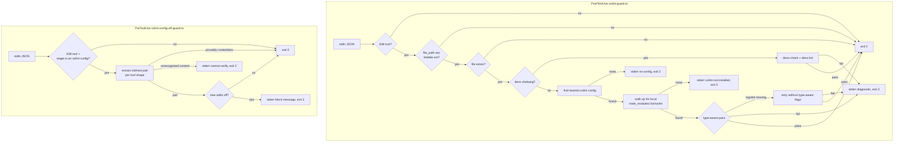

# Oxlint Guard Claude Plugin - Plan

## Supersession - Effect + Bun runtime (2026-08-05)

After this plan was approved, the user replaced the runtime: the hooks are **Effect programs running on Bun**, compiled by tsdown into self-contained ESM bundles, not Deno scripts. That decision overrides R3, KTD1, and KTD3 wherever they name Deno, permission flags, or a zero-import rule. Everything else here - the exit contract, the two events, the matcher, config discovery, local-only oxlint resolution, and the fail-closed posture - is unchanged and still binding.

- **Runtime:** `bun` on `PATH`, not `deno`. Each hook is one self-contained `.mjs` in `dist/` with `effect` and `@effect/platform-bun` inlined, built by tsdown. One build per hook: rolldown rejects `codeSplitting: false` when a config has more than one input, so two entries in one config would silently hoist `effect` into a shared sibling chunk.
- **Dependencies:** "no workspace dependencies" is preserved by _bundling_, not by importing nothing. The artifact carries its deps inside it, so a user's clone resolves nothing from this workspace.
- **Hermeticity:** Bun has no `--allow-net`-style permission flags, so the network guarantee is no longer enforced by the runtime. It is structural instead: the bundles perform no network I/O, and oxlint is resolved only from the edited project's own `node_modules/.bin`, never from `PATH`, `npx`, `bunx`, or a registry.
- **Distribution:** the plugin ships through a repo-root `.claude-plugin/marketplace.json` whose entry is a **relative path** to the plugin directory, installed with `/plugin marketplace add systemfsoftware/systemfsoftware` + `/plugin install oxlint-guard@systemfsoftware`. It is **not** an npm package (`private: true`): Claude Code installs a plugin by copying its directory out of a git clone, so the committed `dist/` is the artifact and the version is the commit SHA. Verified end to end this session — install from a clone-shaped git marketplace yields a 2.2 MB payload under a SHA-named cache directory, and both installed bundles enforce correctly when run through their real `hooks.json` commands. R1's local-folder path still works, with one caveat now documented in the README: a marketplace pointed at a working checkout dereferences symlinks and copies `node_modules`.
- **Tests:** behaviour tests are Gherkin features (`*.integration.test.ts` via `@systemfsoftware/effect-gherkin-spec`) and pure cells carry colocated `*.property.test.ts`, per this repo's test-placement rules.
- **File layout:** the Deno scripts (`hooks/scripts/*.ts`) and their shared `hooks/lib/input.ts` are deleted, replaced by Effect cells under `src/lint-guard/` and `src/config-guard/` plus a shared payload surface at the `src/` root. `hooks/hooks.json` stays and now points at the built bundles. Wherever U3, U4, or U5 names a `hooks/scripts/` or `hooks/lib/` path, read the corresponding `src/` cell.

## Goal Capsule

- **Objective:** Ship a Claude Code plugin, `claude-plugins/oxlint-guard/`, that enforces lint on agent edits: a PostToolUse hook lints each edited file against the nearest oxlint config (non-blocking feedback; deno-shebang files go to `deno check` + `deno lint` instead), and a PreToolUse hook blocks edits that weaken the oxlint config itself by adding `"off"`. Both hooks are Effect programs bundled for Bun, self-contained so the plugin carries no workspace dependencies.
- **Authority hierarchy:** The user's request is the product contract - a Claude plugin, hooks written as Effect programs on Bun, no workspace dependencies, usable through the OMP hook bridge, public-facing docs. Repo rules in `AGENTS.md` bind (REPO-S3: no edits under `repos/`; REPO-D1: `pnpm check` passes).
- **Stop conditions:** Done when both hooks behave per the exit contract, the plugin installs from the repo, docs are public-facing, and the repo-wide gates pass.
- **Tail ownership:** ce-work executes the units; no publishing to npm (out of scope).

## Product Contract

### Summary

A Claude Code plugin named `oxlint-guard` that makes lint part of the agent loop. After every edit to a lintable file, a PostToolUse hook runs oxlint on that file with the project's own config and reports failures back to the agent (deno-shebang files are routed to `deno check` + `deno lint`); before every edit to an oxlint config file, a PreToolUse hook blocks changes that add `"off"` rule severities. The hooks are Effect programs compiled into self-contained Bun bundles, so the plugin works in any repo with Bun installed and needs nothing from this workspace.

### Problem Frame

Lint gates catch violations at CI, but the agent that wrote the violation already moved on — the feedback loop is minutes long and detached from the edit. Two enforcement gaps persist even with a working lint gate: edited files are never linted at the moment of the edit, and the lint configuration itself is editable by the same agent that is trying to make lint pass, so a failing rule can be silenced by editing the config instead of fixing the code. The Claude Code hook system closes both gaps at the right moment: PostToolUse observes the edit, PreToolUse gates the config edit. The OMP hook bridge dispatches the same `.claude/settings.json` hook commands, so a plugin written to the standard hook contract works in both runtimes unchanged.

### Requirements

**Plugin packaging**

- R1. The plugin is installable from the repo by local folder (`/plugin install ./claude-plugins/oxlint-guard`): a `.claude-plugin/plugin.json` manifest and a `hooks/hooks.json` registering both hooks.
- R2. Both hooks register on the edit-tool matcher `Write|Edit|Update|MultiEdit|Create|morph_mcp_edit-file|morph_edit`, with `PostToolUse` for the lint guard and `PreToolUse` for the config guard.
- R3. Each hook is one self-contained ESM bundle executed by `bun`, built from Effect source by tsdown with `effect` and `@effect/platform-bun` inlined. The published artifact resolves nothing from this workspace and fetches nothing at run time; the only external binary it invokes is the edited project's own local `oxlint`.

**PostToolUse lint guard**

- R4. The hook lints a single edited file against the nearest oxlint config — any of the standard names (`oxlint.config.ts`, `oxlint.config.js`, `oxlint.config.mjs`, `oxlint.config.cjs`, `.oxlintrc.json`, `oxlint.json`) — found by walking up from the file's directory, honoring per-package configs (this repo's packages each carry their own `oxlint.config.ts`).
- R5. Files whose first line declares a `deno` shebang are routed to `deno check` and `deno lint` instead of oxlint, because oxlint's type-aware pass resolves types through tsc and cannot resolve the `Deno` global or `jsr:`/`npm:` specifiers.
- R6. Lint failure exits 2 with the linter output on stderr and an explanatory preamble; the edit stands (PostToolUse cannot undo it) and the message instructs fixing the root cause rather than suppressing.
- R7. Exit 0 on every contentless no-op: non-edit tool, non-lintable extension, file missing on disk, `file_path` absent, and malformed stdin JSON. **Missing oxlint config, missing local oxlint binary, and unresolvable oxlint are hard failures, not silent skips** — the hook exits 2 with a stderr note instructing the user to add an `oxlint.config.*` (or `.oxlintrc.json`/`oxlint.json`) and install `oxlint` as a local dev dependency (so the guard never relies on PATH lookup, `npx`/`bunx`/`pnpm exec`, or any network-fetched binary). The hermetic posture is the point: a hijacked oxlint binary on a developer's machine must not be invoked, and a missing dependency is a setup error the agent (or human) should fix before lint claims to have run. "No files found to lint" and the ignored-path crash remain exit 0 (linter noise, not an error).
- R8. Type-aware enforcement degrades gracefully: if the type-aware pass fails because `oxlint-tsgolint` is not installed, the hook retries without `--type-aware --type-check` rather than failing the edit.

**PreToolUse config guard**

- R9. The hook blocks (exit 2) any edit to an oxlint config file whose new content adds a rule severity of `"off"` — in either quote style — that the old content did not have. This is a hard veto on the strongest silencing vector; severity downgrades (`error` → `warn`), `ignorePatterns`, and inline `oxlint-disable` directives are deliberately out of the guard's scope (a documented boundary, see Scope Boundaries).
- R10. The hook extracts the before/after content pair for every supported edit shape: `Edit` (`old_string`/`new_string`), `Write` (full content, with the on-disk file read at hook time as the old side — read before the write lands per PreToolUse semantics; a file absent on disk means an empty old side, so a new config containing `"off"` is blocked), `MultiEdit` (`edits[]` pairs), and the morph tools.
- R11. The hook skips with exit 0 only when the payload is provably contentless — a patch with no `+`/`-` body rows (per the bridge synthesis), or a payload with no content fields at all. An absent pair means nothing to check, never a claim that nothing changed. When the target is an oxlint config file and the payload carries content the hook cannot parse, the hook fails closed with exit 2 and a "cannot verify this edit shape" message telling the agent to rewrite the change using `Edit`/`Write`/`MultiEdit`.
- R12. The blocking message states which rule was turned off and tells the agent to fix the underlying violation instead.

**Bridge and exit contract**

- R13. Hooks follow the documented hook contract the OMP bridge interprets (`CONCEPTS.md` "Hook verdict"): exit 0 allows, exit 2 plus stderr blocks or feeds back a reason, and stdout stays machine-clean — diagnostics go to stderr only.
- R14. Hooks read `tool_input.file_path` from stdin JSON, the field the bridge normalizes, and match tool names exactly as the repo's existing `.claude/settings.json` matcher lists them — the standard tools in PascalCase and the morph tools in their native `morph_edit`/`morph_mcp_edit-file` forms — so the same plugin hooks work in Claude Code and through the bridge. The exact names the bridge emits per tool are verified during implementation (Open Questions).

**Documentation and dogfooding**

- R15. A public-facing `README.md` documents install (local folder), the two hooks, the exit contract, the bridge compatibility note, the runtime prerequisites (Deno 2.x, `oxlint` as a local dev dependency in `node_modules/.bin`), the skip conditions, and the hermetic guarantee (no PATH lookup, no `npx`/`bunx`/`pnpm exec`, no network).
- R16. The same hook commands are wired into this repo's `.claude/settings.json` so the repo's own sessions — including OMP sessions dispatched through the bridge — enforce oxlint on every edit when Deno and a local `oxlint` binary in `node_modules/.bin` are present (the hermetic contract of R7). A missing binary surfaces as a hard failure on the first edit, not a silent skip.

### Scope Boundaries

- **Out of scope:** the other guard hooks from any existing hook set (git, npx/bunx, docker-prune, qmd, and friends) — only the oxlint pair ships.
- **Out of scope:** shipping oxlint rules or a default config — the hooks run whatever `oxlint.config.ts` the project has; this repo's rule surface lives in `packages/oxlint-config/`.
- **Out of scope:** npm publishing, tsdown build, or api-extractor machinery — the plugin is a directory, not a build artifact; the pnpm workspace is untouched.
- **Out of scope:** auto-fixing lint findings (`--fix`) — the guard reports, it does not rewrite.
- **Out of scope:** blocking config severity downgrades (`error` → `warn`), `ignorePatterns`, or inline `oxlint-disable` directives — the guard vetoes `"off"` only (the strongest vector); downgrades remain agent discipline plus the CI gate. Whether oxlint fails on warn-level findings is a documented Open Question that determines how much downgrade-weakening actually silences CI.
- **Out of scope:** detecting `"off"` severities that enter through imported/spread rule sets — the guard scans literal entries in the config file's rules map; rules assembled from imported objects are outside the scan (documented limitation in U4).
- **Out of scope:** edits under `repos/` (vendored, REPO-S3).
- **Deferred to Follow-Up Work:** a CI job running `deno check`/`deno lint`/`deno test` on the plugin directory (the Deno verification contract is session-enforced until then); a root `.claude-plugin/marketplace.json` exposing the plugin for `/plugin marketplace add systemfsoftware/systemfsoftware` (folder install suffices today; the marketplace is an eight-line addition when a second plugin exists or remote distribution is wanted); a Stop-hook lint gate over each turn's changed files (a blocking-completion alternative to per-edit PostToolUse, deferred to avoid colliding with the existing Stop-format hook); extension of the config guard to severity downgrades; a `.claude/settings.local.json` opt-out switch; per-project hook configuration; and porting additional guards from the same family.

## Planning Contract

### Key Technical Decisions

- **KTD1 — No external imports.** The hook scripts import nothing outside the plugin directory: no Deno stdlib, no `jsr:`/`npm:` specifiers, no lockfile. Only relative imports between plugin files (the shared `hooks/lib/input.ts`) are allowed, per R3. `Deno.Command`, `Deno.readTextFile`, `Deno.statSync`, and `JSON.parse` cover everything a ~200-line hook needs. This makes "no workspace dependencies" structural rather than conventional: first run never fetches anything, and the plugin cannot break on dependency drift. The tradeoff (re-implementing tiny helpers like path-walk and shebang detection by hand) is trivial for this size.
- **KTD2 — PostToolUse for lint, PreToolUse for config protection.** The two enforcement surfaces are split by what each must guarantee. The config guard guarantees prevention — a weakened config must never land — so it runs pre-edit and blocks with exit 2. The lint guard runs post-edit because the tradeoff between the two axes lands there: on efficacy, prevention (the violation never lands) beats post-hoc detection, but per-edit pre-blocking lint would interleave an interactive lint/repair loop into every tool call and double the latency of every edit, and the strongest silencing vector (config weakening) is already closed pre-edit by the config guard; on feedback timing, exit 2 after the edit feeds the linter output to the agent immediately, while the change stands. The blocking-alternative (a Stop-hook gate over the turn's changed files) is recorded as a deferred alternative. The known residual is behavioral: enforcement value assumes agents act on the feedback, with the repo's `pnpm check` gate as backstop (Open Questions).
- **KTD3 — Hermetic, local-only oxlint resolution.** The hook runs with `--allow-read --allow-run --allow-env` and **no `--allow-net`**, so the Deno process itself cannot make network calls. Resolution of oxlint is **local-only by construction**: (1) detect the project's package manager by walking up from the edited file's directory for the highest-precedence lockfile (`pnpm-lock.yaml` → pnpm, `bun.lockb`/`bun.lock` → bun, `package-lock.json` → npm, `yarn.lock` → yarn); (2) walk up the directory tree looking for the binary at `<pkgRoot>/node_modules/.bin/oxlint` (and `.cmd`/`.ps1` shims on Windows). There is **no PATH lookup, no `npx`/`bunx`/`pnpm exec`/`yarn exec`, and no implicit network fetch** — a hijacked oxlint on a developer's machine must not be invoked, and the failure mode for a missing binary is exit 2 with a stderr note naming the install command. This is the security posture: a tampered binary can phone home, so the guard refuses to spawn anything that did not come from a locked, local install. The script is invoked from `hooks.json` with the explicit permission set; any additional flag (especially `--allow-net`) is a contract violation.
- **KTD4 — Nearest-config discovery.** Walking up from the edited file to find the nearest oxlint config — checking the standard config names (`oxlint.config.ts`, `oxlint.config.js`, `oxlint.config.mjs`, `oxlint.config.cjs`, `.oxlintrc.json`, `oxlint.json`) — makes the hook honor per-package configs in monorepos (each `packages/*` here carries its own `oxlint.config.ts`) and matches how a developer running oxlint from the package directory would see it. The found config is passed via `-c` and oxlint runs with the config's directory as its working directory. **No config found is a hard failure (exit 2)** with a stderr note naming the file to create — silent skipping would let an agent edit a project that never declared oxlint enforcement, defeating the guard's reason to exist.
- **KTD5 — stdout hygiene and the exit contract.** Diagnostics go to stderr; stdout stays empty. The bridge derives the verdict from exit status plus output (`CONCEPTS.md` "Hook verdict"): exit 0 with no decision reads as allow, exit 2 with stderr reads as a block or reason. Stray stdout is a risk rather than a guaranteed corruption: older bridge versions parsed any exit-0 stdout as a decision payload (the comment-checker incident), and current versions route non-JSON stdout to `ExitNoDecision → Allow` — either way, stdout is never the diagnostics channel, and the discipline costs nothing.

### High-Level Technical Design

Both hooks share `hooks/lib/input.ts` (parse, tool filter, extension filter). The bridge dispatches the same commands when they are wired into `.claude/settings.json`, and normalizes `path` → `file_path` and tool names before the hook reads them, so the hooks need no OMP-specific branch.

### Assumptions

Recorded because this run is headless (pipeline mode); each is the agent's bet, not a user-confirmed decision:

- A1. The plugin lives at `claude-plugins/oxlint-guard/` as a top-level directory outside the pnpm workspace, so "no workspace dependencies" is structural and the root gates (`pnpm check`) are untouched. An alternative home — a `packages/*` member — was rejected because turbo/tsc/vitest would fight the Deno toolchain.
- A2. The plugin name is `oxlint-guard`, matching the enforcement posture and the hook file names.
- A3. Install is by local folder path only; a root `.claude-plugin/marketplace.json` is deferred until remote distribution is wanted (see Scope Boundaries). The repo being public on GitHub is what keeps the deferred marketplace viable later.
- A4. The repo's own `.claude/settings.json` gains the two hook entries (R16), dogfooding the plugin and making it active through the bridge. The existing `comment-checker` PostToolUse entry and the Stop-format hook stay untouched.
- A5. **Hermetic failure** (exit 2 with a stderr note) when the project has no oxlint surface — no `oxlint.config.*`/`oxlint.json`/`.oxlintrc.json` found, or no `node_modules/.bin/oxlint` at any level up from the file — is the right default for a security-first guard. A hijacked oxlint binary on a developer's machine must not be invoked, and a missing dependency is a setup error the agent (or human) should fix before lint claims to have run. Re-reading the file from disk means content can never slip through a payload/content-recovery gap.
- A6. Command timeouts: 120s for the lint guard (type-aware runs can be slow on large files), 30s for the config guard. Both are generous for their work.
- A7. Minimum Deno is the version this machine runs (2.7.7); `Deno.Command` has been stable since 1.33, so the practical floor is lower, but the README states 2.x.
- A8. The plan and all docs are public-facing; the design is presented from first principles and public references, and no private source repository is named or cited anywhere in the artifacts.

### Sequencing

U1 (scaffold) → U2 (shared lib) → U3, U4 (the two hooks, parallelizable after U2) → U5 (repo wiring + docs). Each unit lands as one atomic commit.

## System-Wide Impact

- **Shared hook surface.** `.claude/settings.json` is read by every session in this repo — Claude Code natively and OMP through the bridge. The two new entries run alongside the existing `comment-checker` PostToolUse hook and the Stop-format hook; every edit in the repo now spawns the config guard (pre) and the lint guard (post). The hooks run with `--allow-read --allow-run --allow-env` and **explicitly no `--allow-net`** — the process cannot make network calls, and a hijacked oxlint binary on a developer's machine is not invoked (KTD3). Failure mode: if `deno` is missing from a machine, the raw `deno run ...` command fails with a non-blocking error on every edit — noise, not enforcement; the `command -v deno` guard makes it a silent skip, and the README documents Deno as a prerequisite. If oxlint is missing or unresolvable locally, the guard fails hard (exit 2, stderr note) on the first edit so the missing dependency is visible rather than silently swallowed.
- **Bridge parity.** The bridge normalizes `path` → `file_path` and maps tool names toward the Claude Code set the settings matcher uses (standard tools PascalCase; the morph tools keep their native `morph_edit`/`morph_mcp_edit-file` forms, per the repo's existing matcher), and synthesizes `old_string`/`new_string` from patch sigils — but a patch with no `+`/`-` body rows yields no content keys. The lint guard is immune (it re-reads the file from disk); the config guard's R11 skip covers contentless payloads and fails closed on unrecognized ones. Both hooks therefore behave identically under Claude Code and the bridge without an OMP-specific branch. Whether the bridge loads plugin `hooks/hooks.json` manifests for marketplace-installed plugins is unverified and not claimed — the bridge path is the R16 settings.json wiring.
- **Agent-loop latency.** The lint guard adds a subprocess per edit, and `--type-aware` runs can take seconds on large files. The 120s timeout bounds worst case; scope stays per-file (never whole-repo), and exit 0 is silent so passing edits add no context noise.
- **False-positive block risk.** A PreToolUse exit 2 stops the edit call outright; a false positive on the config guard would force the agent to change strategy mid-task. Detection must therefore scope to rule-severity values in the rules map only — never bare `"off"` occurrences in comments, option strings, or prose — and the test scenarios pin the boundary (options-touch edit must pass).
- **Gates boundary.** `claude-plugins/` sits outside the pnpm workspace, so `pnpm check` and CI exercise nothing there; the Deno verification contract is the only guard. Until a CI job exists (deferred), the Verification Contract commands are the enforcement, and the DoD requires them run in the implementing session.
- **Feedback efficacy.** The lint guard's marginal value over the existing CI gate assumes agents act on non-blocking PostToolUse feedback; an agent that treats an applied edit as done pushes the violation back to `pnpm check` — the status quo. The config guard still closes the silencing vector regardless, and the repo gate remains the backstop (Open Questions).

## Implementation Units

- **Goal:** Create the plugin directory with the manifest and hook registration.
- **Requirements:** R1, R2, R3
- **Dependencies:** none
- **Files:**
  - `claude-plugins/oxlint-guard/.claude-plugin/plugin.json`
  - `claude-plugins/oxlint-guard/hooks/hooks.json`
  - `claude-plugins/oxlint-guard/.gitignore`
- **Approach:** `plugin.json` carries name, version, description, author, license, repository, keywords. `hooks/hooks.json` uses the plugin wrapper format (`{"description": ..., "hooks": {...}}`) with the R2 matcher for both events; each command is `deno run --allow-read --allow-run --allow-env ${CLAUDE_PLUGIN_ROOT}/hooks/scripts/<script>.ts` with the A6 timeouts — the flag set is intentional and final: no `--allow-net`, no `--allow-write` (writes are not needed; if they turn out to be, the change is reviewed separately). No `deno.json` ships — the Verification Contract invokes `deno check`/`deno lint`/`deno test` directly. The manifest and hooks file are pure data — no behavior to unit test.
- **Patterns to follow:** Claude Code plugin layout (`plugin-structure` conventions: `.claude-plugin/plugin.json`, component dirs at plugin root, `${CLAUDE_PLUGIN_ROOT}` in commands); the repo's existing `.claude/settings.json` matcher set for the edit tools — the R2 set extends that matcher with `Create` (its real-tool status is verified in implementation, Open Questions).
- **Test scenarios:**
  - `Test expectation: none -- pure static configuration; correctness is verified by the Verification Contract's JSON-validity item and by U3/U4 smoke tests that load these files.`
- **Verification:** `plugin.json` and `hooks/hooks.json` parse as valid JSON; `hooks.json` uses the wrapper shape and references scripts that exist after U3/U4.

### U2. Shared hook input lib

- **Goal:** Provide the stdin-parsing and filtering helpers both hooks use, as zero-import Deno.
- **Requirements:** R2, R14
- **Dependencies:** U1
- **Patterns to follow:** The `docs/solutions/integration-issues/comment-checker-hook-silently-bypasses-on-patch-mode-edit.md` lesson — absent fields are "nothing to check", not "nothing changed"; the lib returns absent/empty values distinctly.
- **Test scenarios:**
  - `parseHookInput` extracts tool name and file path from a Claude Code PreToolUse payload; returns empty strings for malformed JSON instead of throwing.
- **Approach:** `parseHookInput(raw)` reads `tool_name` and `tool_input.file_path` from the stdin JSON; `isEditTool(name)` checks the R2 tool set (extending the repo's settings matcher with `Create`); `isLintable(path)` matches `\.[mc]?[jt]sx?$`; `isOxlintConfig(path)` matches a basename in the standard config-name set (`oxlint.config.ts`, `oxlint.config.js`, `oxlint.config.mjs`, `oxlint.config.cjs`, `.oxlintrc.json`, `oxlint.json`). All functions total — malformed JSON yields an empty parse, never a throw (a hook must not crash on foreign payloads). Tests live beside the lib under `deno test`.
  - `isLintable` accepts `.ts`, `.tsx`, `.js`, `.jsx`, `.mts`, `.cts`, `.mjs`, `.cjs` and rejects `.md`, `.json`, `.css`, and a path with no extension.
  - `isOxlintConfig` matches every standard config basename (`.oxlintrc.json`, `oxlint.json`, `oxlint.config.ts`, `oxlint.config.js`, `oxlint.config.mjs`, `oxlint.config.cjs`) at any depth and rejects `other.config.ts`.
- **Verification:** `deno test` in the plugin directory passes.

### U3. PostToolUse lint guard

- **Goal:** Lint an edited file after every edit, reporting failures back to the agent without blocking the edit.
- **Requirements:** R4, R5, R6, R7, R8, R13
- **Dependencies:** U1, U2
- **Files:**
  - `claude-plugins/oxlint-guard/hooks/scripts/oxlint-guard.ts`
  - `claude-plugins/oxlint-guard/hooks/scripts/oxlint-guard.test.ts`
- **Approach:** Filter (non-edit tool, non-lintable path, missing file, `file_path` absent, malformed stdin → exit 0). Read the file head; a first-line `deno` shebang routes to `deno check <file>` via `Deno.Command` — a `deno check` failure short-circuits before `deno lint` runs and the `deno check` exit code wins; otherwise run `deno lint <file>`; each failure exits 2 with the R6 preamble and output. For non-deno files, walk up from the file's directory to find the nearest oxlint config (R4); none → exit 2 with a stderr note instructing to add an oxlint config. Detect the project's package manager (KTD3): walk up to find the lockfile, highest precedence wins — `pnpm-lock.yaml` (pnpm), `bun.lockb`/`bun.lock` (bun), `package-lock.json` (npm), `yarn.lock` (yarn, including berry). Resolve oxlint **only** by walking up from the edited file's directory to `<pkgRoot>/node_modules/.bin/oxlint` (no PATH lookup, no `npx`/`bunx`/`pnpm exec` — those could fetch arbitrary code or shell into a tampered binary on a hijacked machine). If the binary is missing at every level, the hook **fails** (exit 2) with a one-line stderr note: `oxlint not found locally — install it as a dev dependency (e.g. pnpm add -D oxlint) so the lint guard never relies on PATH or network-fetched binaries`. The script itself runs with `--allow-read --allow-run --allow-env` only — **no `--allow-net`** — so a hijacked oxlint binary cannot phone home.
- **Patterns to follow:** The exit contract and diagnostics style of the repo's existing `.claude/settings.json` hooks; the robustness handling described in R7/R8.
- **Test scenarios:**
  - Happy path: an edited `.ts` file under a fixture tree with an `oxlint.config.ts` and a local `node_modules/.bin/oxlint` lints clean → exit 0, empty stdout, empty stderr.
  - Violation path: fixture file with a rule violation → exit 2, stderr contains the preamble and the oxlint output, stdout is empty.
  - Deno shebang path: a `.ts` file with a `deno` shebang routes to `deno check`/`deno lint`; a deliberate type error exits 2 with the deno preamble.
  - Skip paths (each → exit 0): Bash tool payload; `Read` payload; non-lintable extension; nonexistent file; `file_path` absent; malformed stdin JSON.
  - Hermetic fail: a config-bearing fixture tree with no `node_modules/.bin/oxlint` resolves to failure → exit 2 with the `oxlint not found locally` stderr note; an oxlint binary on PATH but not in `node_modules/.bin` is ignored (the walk does not see it). The script is invoked with `--allow-read --allow-run --allow-env` only — running it with `--allow-net` enabled is a contract violation and an extra test asserts the script fails to start under network access (a smoke with `--allow-net` removed at the top of the script via `Deno.permissions` would have to be configured; the README and hooks.json specify the flag set).
  - Robustness: "No files found to lint" output → exit 0; ignored-path panic output → exit 0.
- **Verification:** `deno test` plus the smoke runs above; a real edit in a scratch copy of a config-bearing fixture produces exit 2 with the diagnostic when the file violates a rule.

- **Execution note:** Smoke-first — the first proof is piping fixture hook JSON into the script and asserting exit codes (0 for skip paths, 2 + stderr for failures), then unit tests for the decision functions. The first U3 smoke also verifies the OMP bridge's PostToolUse exit-2 behavior (block vs feedback) and the exact `tool_name` values the bridge emits per tool — see Open Questions.

- **Goal:** Block edits to oxlint config files that add `"off"` severities.
- **Requirements:** R9, R10, R11, R12, R13
- **Dependencies:** U1, U2
- **Files:**
  - `claude-plugins/oxlint-guard/hooks/scripts/oxlint-config-off-guard.ts`
  - `claude-plugins/oxlint-guard/hooks/scripts/oxlint-config-off-guard.test.ts`
- **Approach:** Filter (non-edit tool, target not in the standard oxlint-config-name set → exit 0). Extract the before/after pair per tool shape (R10): `Edit` from `old_string`/`new_string`; `Write` from `content` with the on-disk file read at hook time as the old side (PreToolUse, before the write lands); if the file is absent, the old side is empty so a new config containing `"off"` is blocked; `MultiEdit` from each `edits[]` entry's pair, scanning every hunk; the morph tools from their respective fields. A provably contentless payload (R11) exits 0 — a patch with no `+`/`-` body rows, or a payload with no content fields. An unrecognized content shape on an oxlint-config target fails closed (exit 2) with a "cannot verify this edit shape" message telling the agent to rewrite the change using `Edit`/`Write`/`MultiEdit`. Detect rules that went to `"off"` (or `'off'`) in the new content and were not `"off"` in the old — scan for the literal severity in the rules object, ignoring comments and string-literal option values, and diff the sets. Any added `"off"` → exit 2 with a message naming the rule and instructing the agent to fix the underlying violation (R12). The text-scan covers literal entries in the config file's rules map; rules assembled from imported/spread objects are outside the scan (documented limitation). Severity downgrades (`error` → `warn`), `ignorePatterns`, and inline `oxlint-disable` directives are out of the guard's scope by design (R9).
  - MultiEdit: one hunk adds `"off"` → exit 2 even when other hunks are benign.
  - Write creating a new `oxlint.config.ts` whose content contains `"off"` → exit 2 (empty old side per R10).
  - Patch-mode payload with a `+` row adding `"off"` (recoverable via the bridge synthesis) → exit 2 (R10 + R11 boundary).
  - Unrecognized content shape on an oxlint-config target → exit 2 with the "cannot verify this edit shape" message (R11 fail-closed).
  - Allow: `Edit` changing a severity from `"error"` to `"warn"` (severity downgrade is out of guard scope, R9).
  - Write: full-content rewrite that adds `"off"` → exit 2; rewrite that keeps severities → exit 0.
  - Skip (exit 0): non-config target; non-edit tool; provably contentless patch (no `+`/`-` rows); malformed stdin.
  - The blocking message contains the rule identifier and the fix-the-violation guidance.
- **Verification:** `deno test` plus smoke runs: a fixture `Edit` payload that adds `"off"` exits 2 and blocks; a benign edit exits 0.

### U5. Repo wiring and public docs

- **Goal:** Wire the hooks into this repo's sessions and publish the install/usage documentation.
- **Requirements:** R1, R15, R16
- **Dependencies:** U1, U3, U4
- **Files:**
  - `.claude/settings.json` (add two entries; keep the existing `comment-checker` PostToolUse entry and the Stop-format hook intact)
  - `claude-plugins/oxlint-guard/README.md`
- **Approach:** Add the two hook entries to `.claude/settings.json` using `$CLAUDE_PROJECT_DIR`-relative commands (`command -v deno >/dev/null && deno run --allow-read --allow-run --allow-env "$CLAUDE_PROJECT_DIR/claude-plugins/oxlint-guard/hooks/scripts/<script>.ts" || exit 0`) with the same matcher and timeouts as the plugin's `hooks.json` (per U1's manifest), so Claude Code sessions and the bridge both dispatch them (the bridge reads `.claude/settings.json`). The flag set matches the plugin's hooks.json exactly — `--allow-read --allow-run --allow-env`, no `--allow-net` (KTD3). The `command -v deno` guard makes a missing Deno runtime a silent skip instead of a per-edit non-blocking error. Write the public `README.md`: what the plugin does, install (`/plugin install ./claude-plugins/oxlint-guard`), the two hooks, the exit contract, the bridge compatibility note, the runtime prerequisites (Deno 2.x, `oxlint` as a local dev dependency in `node_modules/.bin`), the skip conditions, the hermetic guarantee (no PATH lookup, no `npx`/`bunx`/`pnpm exec`, no network), and the package-manager detection rule.
- **Execution note:** Docs-first would be premature before behavior is proven; write the README after U3/U4 smoke tests pass so the documented exit behavior matches observed behavior.
- **Test scenarios:**
  - `Test expectation: none -- configuration and documentation; correctness is the U3/U4 smoke tests plus JSON-validity checks for settings.json, plugin.json, and hooks/hooks.json.`
- **Verification:** `settings.json`, `plugin.json`, and `hooks/hooks.json` all parse; a `PostToolUse` entry with the R2 matcher exists alongside the untouched existing entries; README commands match the actual install paths; `pnpm check` still passes (workspace untouched).

## Verification Contract

- Repo baseline: `pnpm check` from the repo root passes unchanged (the plugin directory is outside the workspace; any failure here means the wiring touched something it should not).
- Plugin type check: `deno check claude-plugins/oxlint-guard/hooks/` — all hook and lib files compile with no external imports.
- Plugin lint: `deno lint claude-plugins/oxlint-guard/` — the plugin's own code passes Deno's linter (self-hosting).
- Plugin tests: `deno test --allow-read --allow-run --allow-env claude-plugins/oxlint-guard/hooks/` — every scenario in U2/U3/U4 passes; an extra test asserts the `deno test` invocation runs with **no** `--allow-net` (the flag set is fixed at `--allow-read --allow-run --allow-env` and any deviation is a contract violation).
- Hook smoke: pipe a fixture PostToolUse payload (violating file) into `oxlint-guard.ts` → exit 2, stderr diagnostic, empty stdout; pipe a fixture PreToolUse payload (added `"off"`) into `oxlint-config-off-guard.ts` → exit 2 with a blocking message; both with no-op fixtures → exit 0; a smoke with no `node_modules/.bin/oxlint` in the fixture tree → exit 2 with the "oxlint not found locally" stderr note.
- JSON validity: `plugin.json`, `hooks/hooks.json`, and `.claude/settings.json` all parse.
- Artifact hygiene: no file under `repos/` modified (REPO-S3); no reference to any private source repository anywhere in the plan, README, or commit messages.

## Definition of Done

## Definition of Done

- Both hooks are implemented in zero-import Deno, registered in the plugin's `hooks/hooks.json`, and behave per the R4–R12 contracts with the R13 exit semantics. Both hook commands run with `--allow-read --allow-run --allow-env` and **no `--allow-net`**.
- The plugin installs from the repo by folder path (`/plugin install ./claude-plugins/oxlint-guard`), and the repo's own `.claude/settings.json` enforces oxlint on every edit (with the same hermetic flag set) including bridge-dispatched sessions. A missing `node_modules/.bin/oxlint` is a hard failure, not a silent skip.
- `oxlint` is installed as a dev dependency in every consumer repo (this repo's `packages/oxlint-config` and any external user); the README states the install command.
- Every U-ID test scenario passes; `deno check`, `deno lint`, and `deno test` are green in the plugin directory; `pnpm check` is green at the root.
- The README is public-facing and documents install, behavior, the exit contract, bridge compatibility, prerequisites (Deno 2.x, `oxlint` as a local dev dependency), skip conditions, and the hermetic guarantee.
- Cleanup criterion: no abandoned-attempt code (alternate hook shapes, scratch fixtures, unused libs) remains in the diff.

- Claude Code plugin reference and marketplace docs (`code.claude.com/docs/en/plugins-reference`, `/plugin-marketplaces`) — manifest schema, hooks location, marketplace sources, `${CLAUDE_PLUGIN_ROOT}`.
- Claude Code hooks reference (`code.claude.com/docs/en/hooks`) — stdin JSON payload, exit-0/exit-2 semantics, stderr contract.
- oxc docs, type-aware linting (`oxc.rs/docs/guide/usage/linter/type-aware`) and the `oxlint-tsgolint` package — `--type-aware`/`--type-check` flags, the tsgolint backend requirement that drives KTD3's fallback.
- Repo grounding: `CONCEPTS.md` ("Hook bridge", "Hook verdict", "Patch-mode edit"); `docs/solutions/integration-issues/comment-checker-hook-silently-bypasses-on-patch-mode-edit.md` (patch-mode content recovery, skip-vs-pass discipline); `.claude/settings.json` (existing matcher and hook-entry patterns); `packages/oxlint-config/` (the public rule surface the hooks operate against).

## Open Questions

All items are **deferred** — none blocks `implementation-ready`. Resolution happens during U3/U5 smoke and is recorded back into the plan.

- **Bridge PostToolUse exit-2 semantics.** Claude Code native treats PostToolUse exit 2 as feedback (the call has already completed); whether the OMP bridge does the same or treats it as a block is not verified in this plan's cited sources. Resolution: a U3 smoke runs a minimal PostToolUse hook that exits 2 with stderr and observes whether the bridge blocks or warns. If it blocks, the lint guard's design is re-evaluated (fallback: exit 0 with stderr notes, losing the explicit feedback signal).
- **Bridge `tool_name` values for morph tools.** R14 lists the morph tools in their native `morph_edit`/`morph_mcp_edit-file` form based on the repo's existing settings matcher; the actual `tool_name` values the bridge emits in stdin JSON are verified during U3's first smoke.
- **`Create` and `Update` real-tool status.** The R2 matcher extends the repo's settings matcher with `Create`; whether `Create` (and `Update`) are real tool names in both Claude Code native and the bridge is verified in implementation.
- **Bridge loading of plugin `hooks/hooks.json` manifests.** The R16 path is the settings.json wiring, which the bridge reads; whether the bridge also loads marketplace-installed plugin manifests and expands `${CLAUDE_PLUGIN_ROOT}` is unverified and not claimed by this plan.
- **oxlint exit code on warn-level findings.** R9 deliberately scopes the config guard to `"off"` severities; the magnitude of the warn-downgrade gap depends on whether oxlint fails the run on warnings (and whether consumers use `--deny-warnings`). Verification in U3 informs a follow-up guard if the gap is material.
- **The deno-shebang short-circuit on `deno check` failure.** R5 routes deno-shebang files to `deno check` then `deno lint`; U3's first smoke confirms `deno check` failures short-circuit and its exit code wins, and that the two tools together stay hermetic.
