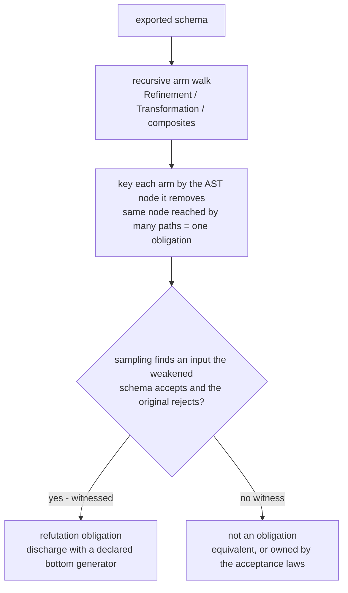
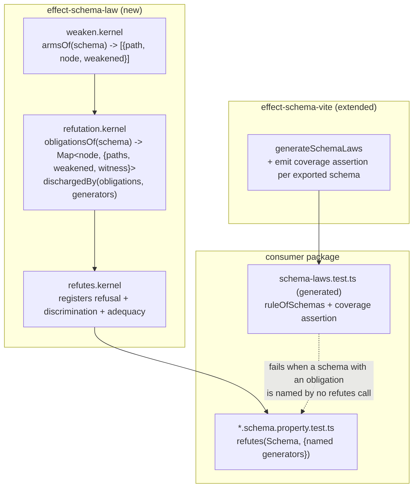

# Schema Refutation Adequacy - Plan

## Goal Capsule

- **Objective.** Give schema refusal properties an instrument that can measure them, and stop the Stryker test-contribution gate from judging a file class it is structurally blind to. Closes issue #55.
- **Product authority.** Repository owner. Grounded in `CONSTITUTION.md` III.3, III.4, V.7 and two landed learnings: `docs/solutions/design-patterns/generated-schema-laws-are-tautological.md`, `docs/solutions/logic-errors/timeout-kills-credited-to-nobody.md`.
- **Execution profile.** Bottom-up: two kernels, then the combinator, then both adoptions, then the generated coverage law last. U1-U3 are pure and property-tested before anything consumes them.
- **Stop conditions.** Stop and ask if refutation adequacy would require weakening a schema the kernel cannot rebuild, if discharging `HexBytes` (U5) turns out to need a contract change rather than a new refusal, or if U7's bail-branch change cannot be shown red-when-deleted.
- **Tail ownership.** This plan ends at a green `pnpm check` plus a green `Mutation (packages/hex-schema)` job. Release and merge stay human-controlled.

**Product Contract preservation.** Changed: R1, R3, R4, R8, R11, R14, and R4b added. R3's obligation rule was refuted by measurement during planning and is restated. R11 named a redundant test that measurement shows is not redundant, and is withdrawn. Review then forced four more: R8's first form would have disabled the gate it claimed to narrow, R1 omitted the `Declaration` composite that carries hex-schema's eighth obligation node, R4 swallowed arms whose arbitrary cannot be built, and R14 must set `disableBail: true` to keep `effect-daemon-spec`'s gate live. Each change is recorded under Key Decisions with the measurement behind it. Every other R-ID is unchanged.

---

## Product Contract

### Summary

Weaken an Effect schema one arm at a time from its own `SchemaAST`, key each weakening by the AST node it removes, and require every node whose removal lets something illegal through to be discharged by a declared refusal generator. This is an exact adequacy criterion computed in-process, replacing the mutation contribution gate for `*.schema.property.test.ts` — a file class whose contracts Stryker's operator catalogue cannot express. The gate keeps its teeth on `.workflow`, `.policy`, and `.kernel` property tests, where the mutant set is rich.

### Problem Frame

The `Mutation (packages/hex-schema)` job has failed on every `main` run since 2026-08-01. The package scores 100% and then fails a second check: every `*.property.test.ts` must kill a mutant nothing else kills. Its schema refusal tests kill none.

The accusation is false. `strict-hex.schema.ts` carries the package's only refinement, `S.pattern(/^[0-9a-f]*$/)`, producing four Regex mutants. Applying each mutant and running each suite in isolation:

| mutant           | `schema-laws.test.ts` (generated)             | `strict-hex.PROP`             | `prefixed-hex.PROP`         | `uint8array.PROP`                |
| ---------------- | --------------------------------------------- | ----------------------------- | --------------------------- | -------------------------------- |
| `/^[0-9a-f]*/`   | kill via `∀x_ColonHexEnc_=x`                  | kill `∀s_StrictHexAlphabet_⊥` | kill `∀b_PrefixedHexCase_⊥` | kill `∀b_Uint8PrefixedHexCase_⊥` |
| `/[0-9a-f]*$/`   | kill via `∀x_ColonHexEnc_=x`                  | kill `∀s_StrictHexAlphabet_⊥` | kill `∀b_PrefixedHexCase_⊥` | kill `∀b_Uint8PrefixedHexCase_⊥` |
| `/^[0-9a-f]$/`   | kill via `∀x_Uint8ArrayFromPrefixedHexEnc_=x` | kill `∀h_StrictHex_=x`        | survives                    | survives                         |
| `/^[^0-9a-f]*$/` | kill via `∀x_ColonHexEnc_=x`                  | kill `∀h_StrictHex_=x`        | kill `∀b_PrefixedHexCase_⊥` | kill `∀b_Uint8PrefixedHexCase_⊥` |

No generated law kills a `StrictHex` mutant through a `StrictHex` law. Every kill is collateral: the mutation corrupts `StrictHex`'s derived arbitrary, that arbitrary feeds a different schema's generator, and the neighbour's round-trip chokes on garbage — counterexample `" "`, a space. The three accused tests kill the same mutants by stating the contract. The gate convicts contract tests on the testimony of an accident, and the accident is the tautology the 2026-07-31 learning diagnosed.

Three further defects were measured. The bail-mode verdict is unsound: `prefixed-hex.PROP` kills three mutants and was accused only for never running first, while the message calls such files "provably toothless." It is also unstable — the same tree yields three files accused at `12b663a48d`, two under the default run, three under `--disableBail`. Two source files, `hex-bytes.schema.ts` and `uint8array-from-prefixed-hex.schema.ts`, report `4 Ignored, 0 killable`: pure composition, no mutant the catalogue can build, so the gate divides by a zero denominator. And `soleKills > 0` is mutation-guided test-suite minimization, which the literature measures at roughly 12.5% average fault-detection loss.

The root cause sits below all three. Stryker's operators perturb expressions; Effect schemas are declarative composition with almost no expression to perturb. The mutant set cannot express these contracts, and the gate reports the operator set's blind spot as the tests' failure.

What the table does not do is settle the question on its own. It is consistent with a second reading: that the refusal tests are simply redundant, because every mutant they kill is killed by something else — which under `--disableBail` is exactly what the `0 sole kills` figure says. Read against Stryker's mutant set, "deleting this file leaves every mutant just as dead" is true. The two readings part company only outside that set, and the evidence that separates them is the extreme-mutation probe: dropping the `S.compose` arm in `uint8array-from-prefixed-hex.schema.ts` is killed by `∀b_Uint8PrefixedHexPrefix_⊥` alone and survives every other suite, including the generated laws. That fault is not a mutant Stryker can build, so accepting the probe means accepting arm-weakening as a fault model — which rests on the cited extreme-mutation and pseudo-tested-method literature, not on the table above. The thesis is that the mutant set is too poor to measure these tests, and the honest support for it is the probe plus that precedent.

### Key Decisions

- **An arm is an obligation iff a witness exists.** Sampling can never prove the containment claim R3 originally stated ("the weakened schema still accepts everything the original accepts"); it can only prove the existential one. Measured consequence of getting this wrong: the containment approximation admitted two phantom obligations (`ColonHex drop-to-arm`, `HexString drop-from-arm`) and condemned three legitimate refusal tests whose arms are _mixed_ — simultaneously more permissive in one direction and less in another. The witness rule is simpler and correct, and every obligation it reports carries a concrete counterexample to show the author.
- **Obligations are keyed by the removed node, not by the path or the schema.** `StrictHex drop-refinement`, `PrefixedHex to/drop-refinement`, and `HexString to/drop-refinement` all remove the same `Refinement` node; they are one contract, not three. Measured: hex-schema's 24 arms collapse to 8 distinct nodes, `effect-daemon-spec`'s 40 collapse to 3. Node identity also dissolves the scoping question — a generator discharges a node wherever that node appears, so nothing depends on which file the generator happens to live in. The dedup rests on reference identity, which holds where schemas share a constraint object and not where two files independently call `S.pattern` with the same regex; independent construction yields two obligations demanding two discharges, which is over-strict rather than unsound, and is the safe direction to fail.
- **Coverage, not uniqueness.** Adequacy asks whether every obligation node is defended, never whether a given test is its only defender. Under node identity exactly one generator in hex-schema is a sole discharger; a sole-discharge criterion would accuse the other eight. That is the same minimization trap `soleKills > 0` fell into, and minimization's fault-detection cost is measured.
- **The walk recurses; composites are traversed, not treated as leaves.** `∀g_ColonHexTripleGroup_⊥` guards a refinement two levels below `ColonHex`'s root, and `effect-daemon-spec` reaches every one of its obligations through struct fields and union members. A top-node walk would have reported both packages as obligation-free and called it a pass. `Declaration` is a composite too, and omitting it is not academic: adding `typeParameters` recursion took hex-schema from 7 obligation nodes to 8. Any container whose element type can carry a refinement — `S.OptionFromSelf`, `S.Set`, `S.Map`, `S.Chunk` — hides arms behind a `Declaration`.
- **The witness search fails loudly or not at all.** A weakened schema whose arbitrary cannot be constructed is an error, never a quiet non-obligation. Measured: 12 of `effect-daemon-spec`'s 40 arms throw on `Arbitrary.make(S.encodedSchema(w))` and were silently swallowed by the planning probe's first draft — its "3 obligation nodes" was right by luck, not by method. The fallback chain (weakened encoded arbitrary, then weakened type arbitrary, then a generic pool) recovers all 12; exhausting it raises.
- **A combinator, not schema annotations with codegen.** Refusal generators stay hand-authored and are passed to `refutes`. Rejection is authorial — deciding what _should_ be rejected requires the contract, not the literal, and that corollary is already landed. Generating refusals would also route them through runtime-injected test bodies the incremental differ cannot see, a hazard already recorded while `hex-schema` runs `incremental: true`.
- **Package-wide coverage is generated, not linted.** `OX-TS2` (`packages/oxlint-plugins/AGENTS.md:58-63`) forbids an oxlint rule from reaching a sibling file and declares such a rule untestable against `OX-MG1`. "Every schema with an obligation has a refusal" is exactly that shape. It moves into `effect-schema-vite`, which already walks the package for exported schemas and already owns the generated-law invariant.
- **Narrow the gate on a stated principle, do not silence it.** The contribution gate applies where the mutator can express the contract. The change lands in the fork default and the rule text, not in one package's config.
- **Under bail the gate refuses to judge, loudly.** The first draft of this plan had it return an unmeasured verdict instead of an accusation, which review caught as vacuous: no package in the repo sets `disableBail`, so that rule would have made the accusation path unreachable everywhere, disabling the gate by default while claiming to narrow it. The honest form is a configuration error — when a package has at least one test file in the gate's scope and bail is on, the run fails and names the fix. Refusing to judge on untrustworthy evidence keeps the gate real; going quiet on it does not. Measured scope after R9: hex-schema has zero files in scope, so its config stays untouched and the error never fires there; `effect-daemon-spec` has three, so it must set `disableBail: true` and pay the slower run to keep a gate that means anything.
- **The smaller alternative was on the table and rejected deliberately.** R9 plus the bail fix alone turn the CI job green — every accused file is a `*.schema.property.test.ts`, so narrowing the suffix ends the accusation. That is the whole of issue #55 read literally. It is rejected because `CONSTITUTION.md` III.3 gates the core on a measure, and removing the only measure over schema refusals without a replacement leaves them ungated. U1-U5 and U9 exist to supply that replacement, U7 to fix a measured bug, U8 to keep the doctrine true. Each addition answers III.3 or a defect; none answers "while we're here."
- **Accuse the source, not the test.** `CONSTITUTION.md` III.4 names the harm as behavior in a file nothing mutates. `hex-bytes.schema.ts` is `0 killable` _and_ carries the package's one undischarged obligation — III.4's harm, now nameable. Weakening turns the rule into a gate: a schema indistinguishable from its own weakened form constrains nothing.
- **`test-contribution.ts` is not a file anybody locked, and U7 is not a special edit.** Traced this session. The Locked row names a _role_ — "evaluation gates" — and its path has been re-pointed three times as the gate moved: `scripts/test-contribution.mjs` → `packages/stryker-plugins/src/test-contribution/` (`ffdb0a36d5`) → `packages/stryker-js/core/src/reporters/test-contribution.ts` (`2d0d579d7f`, the commit that created the file). `ffdb0a36d5`'s message states the reason outright: moving a gate under the Editable `packages/*` glob "would have silently unlocked it," so the row follows the gate. It is anti-drift bookkeeping, not a judgment about this file. The rule is conditional and was read here as absolute: "do not edit **to make verification pass**" bans one motive. U7 has the opposite sign — it removes no failure and adds one, and hex-schema goes green through R9's suffix change, not through U7. The precedent is in the file's own history: `79a062fa4f` fixed the same function's verdict logic the day after the lock landed, with no approval gate and no ceremony, and that fix is the `unattributedKill` branch U7 extends. The red-when-deleted proof stays, re-founded on `CONSTITUTION.md` III.3 — every branch earns its keep by being shown load-bearing — which is the same standard U1's `Declaration` recursion is held to. It was never a concession to a lock.

### Requirements

**The instrument**

- R1. A kernel enumerates the arms of an Effect schema recursively from its `SchemaAST`: a `Refinement` yields its `from`, a `Transformation` yields its `from` and its `to`, and composites (`TypeLiteral`, `Union`, `TupleType`, `Declaration` via `typeParameters`, `Suspend`) are traversed so nested arms are reached and the enclosing tree is rebuilt around each weakening.
- R2. An AST shape the walk cannot rebuild fails loudly rather than yielding zero arms. A leaf with no refinement below it is zero-arm and is not an error; a shape that would silently drop a reachable arm is.
- R3. Each arm is keyed by the AST node its weakening removes. Arms removing the same node are one obligation, however many paths or schemas reach it.
- R4. An arm carries a refutation obligation iff sampling finds an input the weakened schema accepts and the original rejects. The obligation records that witness. Draws come from the weakened schema's encoded arbitrary, then its type arbitrary, then a generic pool spanning the primitive types; a weakened schema for which every source fails raises rather than reporting no obligation.
- R4b. A schema with arms but no obligations is reported as a warning naming the schema. It is the shape a silent miss takes, and the cheapest signal that the witness search came up empty where it should not have.
- R5. A combinator takes one schema and a record of named refusal generators, and registers for each generator a refusal property asserting the schema rejects every draw.
- R6. The same combinator registers for each generator a discrimination property: some draw the original rejects is accepted by some weakening. A generator that discriminates no obligation asserts a refusal not caused by the schema, and fails.
- R7. The same combinator registers one adequacy property per schema: every obligation node reachable from that schema is discharged by at least one generator visible to the call. Failure names the node, the paths that reach it, and the recorded witness.

**The existing gate**

- R8. The contribution gate refuses to judge on bail evidence. When a package has at least one test file matching a required suffix and bail is enabled, the run fails with a configuration error naming `disableBail: true` as the fix. A package with no file in scope is unaffected and needs no config change.
- R9. The fork's default `requireTestContribution` suffix list excludes `.schema.property.test.ts` and retains the workflow, policy, and kernel property-test suffixes.
- R10. Root `AGENTS.md` states the scope rule: the contribution gate applies where the mutator can express the contract, and names refutation adequacy as the schema-class replacement.

**Adoption**

- R11. `effect-schema-vite` emits, per package, a generated assertion that every exported schema carrying an obligation is named by a `refutes` call in that package. Deleting a refusal file fails the generated assertion.
- R12. hex-schema's three `*.schema.property.test.ts` files adopt the combinator, and every refusal asserted today is still asserted.
- R13. hex-schema's one undischarged obligation is discharged: `HexBytes` gains a refusal stating that its wire form is a hex string.
- R14. `effect-daemon-spec` adopts the combinator for its three obligation nodes, and sets `disableBail: true` so that its three in-scope `*.kernel.property.test.ts` files are judged on exact attribution rather than blocking the run under R8.
- R15. `packages/hex-schema/stryker.config.json` is unchanged: same `mutate` globs, same `ignorers`, `thresholds.break` still 100, and no `requireTestContribution` key.
- R16. The `architect-schema` skill and the `src-property-test-cell` and `no-schema-law-duplicate` rule texts name the combinator as the home for refusals, replacing the bare "state what it REJECTS" instruction.

### Acceptance Examples

- AE1. Covers R3.
  - **Given** `StrictHex`, `PrefixedHex`, and `HexString`, whose arms all remove the same `Refinement` node.
  - **When** obligations are computed for the package.
  - **Then** the three arms report as one obligation, discharged once.
- AE2. Covers R4.
  - **Given** `PrefixedHex drop-from-arm`, which drops the `0x` template and simultaneously gains lowercase-hex acceptance and loses `0x`-prefixed acceptance.
  - **When** the arm is classified.
  - **Then** it is an obligation on the strength of its witness, and the acceptance half it also breaks does not exclude it.
- AE3. Covers R7, R13.
  - **Given** `HexBytes drop-from-arm`, whose weakening accepts a raw `Uint8Array` the original rejects.
  - **When** adequacy runs before U5 authors its refusal.
  - **Then** the property fails naming that node and its witness; after U5, it passes.
- AE4. Covers R7, and the counterfactual the contribution gate could not compute.
  - **Given** `∀b_ByteAlignment_⊥`, the sole discharger of `Uint8ArrayFromPrefixedHex drop-to-arm`.
  - **When** it is deleted from the generator record.
  - **Then** adequacy fails, the Stryker dry run fails, and `pnpm --filter @systemfsoftware/hex-schema mutation` exits non-zero.
- AE5. Covers R8.
  - **Given** a package with at least one test file matching a required suffix, running with bail enabled.
  - **When** the contribution gate is asked to judge.
  - **Then** the run fails with a configuration error naming `disableBail: true`, and with `disableBail: true` set the same report is judged normally.
- AE5b. Covers R8, and the scope measurement that makes R15 possible.
  - **Given** hex-schema after R9, whose three property tests are all `*.schema.property.test.ts` and therefore out of scope.
  - **When** its mutation run executes with bail enabled and no `disableBail` key.
  - **Then** no configuration error fires and the config stays unchanged.
- AE5c. Covers R1, and the composite the first walk omitted.
  - **Given** hex-schema's six exported schemas.
  - **When** obligations are computed with `Declaration.typeParameters` recursion and without it.
  - **Then** the recursive walk reports 8 obligation nodes and the non-recursive walk reports 7.
- AE5d. Covers R4, and the silent miss the first probe hid.
  - **Given** the four `effect-daemon-spec` arms whose weakened encoded arbitrary throws.
  - **When** each is classified.
  - **Then** the type-arbitrary fallback supplies the pool and no arm is dropped; with every source stubbed to throw, classification raises instead of reporting no obligation.
- AE6. Covers R11.
  - **Given** a package whose only pure cells are schemas with obligations and no `refutes` call.
  - **When** its test suite runs.
  - **Then** the generated assertion fails naming the unrefuted schema.

### Success Criteria

- `pnpm --filter @systemfsoftware/hex-schema mutation` exits 0 under R15's unchanged config.
- `pnpm check` exits 0.
- The `Mutation (packages/hex-schema)` job is green on the merge commit.
- Deleting any sole-discharging generator makes the mutation command exit non-zero, demonstrated by deleting and re-running. Deleting an entire refusal file is caught by R11's generated assertion. Issue #55's criterion names the mutation command for both; R11 satisfies it through the test run the mutation command performs.
- Net line delta is negative, or the change names what it deleted.

### Scope Boundaries

- Forking `@stryker-mutator/instrumenter` to add schema-aware mutators. `PluginKind` is `{Checker, TestRunner, Reporter, Ignore}` with no mutator extension point, and the in-process instrument makes the fork unnecessary.
- Changing `ruleOfSchemas`. Its acceptance laws are tautological on refinements and load-bearing on narrowings; R4's witness rule leaves them their half of the fault space.
- Dropping an ignorer, lowering a threshold, narrowing a `mutate` glob, or setting `requireTestContribution: null` in any package config.
- Demoting the contribution gate to advisory. Rejected against `CONSTITUTION.md` A.2.

Deferred to follow-up work:

- Applying weakening and refutation obligations to non-schema cells.
- Reporting collateral kills as property-irrelevant, so the 100% score stops crediting `∀x_ColonHexEnc_=x` for defending `StrictHex`. A diagnosis improvement, not a gate.
- Declaring refusal generators on the schema and generating both halves.

### Dependencies / Assumptions

- Effect exposes `SchemaAST` with `Refinement.from`, `Transformation.from`/`.to`/`.transformation`, `Declaration.typeParameters`, and constructors (`new AST.Refinement`, `new AST.Transformation`, `new AST.PropertySignature`, `new AST.TypeLiteral`, `new AST.TupleType`, `new AST.OptionalType`, `new AST.Declaration`, `AST.Union.make`) sufficient to rebuild an enclosing tree around a weakened child. `Schema.make`, exported from `effect/Schema`, builds a usable schema from the result. Verified this session across seventeen schemas in two packages, with zero rebuild failures.
- Stryker aborts when its initial test run fails, which is what makes a failed adequacy property surface as a non-zero exit from the mutation command. Standard behavior; U5's verification confirms it rather than assuming it.
- `weaken` and `refutes` are domain-blind behavior over Effect ASTs, so they are kernels gated by colocated K-law property tests, not mutation. `packages/effect-schema-law` has no `stryker.config.json`, so `scripts/guard-mutate-scope.mjs` is not engaged; any package that later mutates must exclude `*.kernel.ts` in its own config, never in the guard.
- Sampling budget is a correctness input, not a tuning knob: an obligation missed for want of draws is a silent pass. U2 pins the budget against a literal expected table, and R4b warns on the shape a miss takes — a schema with arms and no obligations.
- The instrument defines the obligation set it then checks, so nothing here proves that set is _complete_. R6 falsifies the other direction — a generator whose refusal no weakening explains fails — but no check says "an arm you never enumerated was an obligation." The defences are bounded and named: R1's composite list against a literal expected table, R2 and R4's raise-rather-than-drop rules, and R4b's warning on the shape a miss takes. Beyond the two measured packages a third adopter is on its own, and the honest statement is that this is an adequacy criterion over the arms the walk can reach, not over all faults.

### Outstanding Questions

Deferred, non-blocking:

- Whether `refutes` should accept an explicit `excludes` record for an obligation the author judges undischargeable, and what evidence such an entry must carry. Not needed for either package today — every obligation in both is dischargeable.
- Whether `Suspend` recursion needs a cycle guard beyond the depth cap once a recursive schema adopts the combinator. Neither package has one.

### Sources / Research

Measured this session at `5645a62eed`:

- `pnpm --filter @systemfsoftware/hex-schema mutation` accuses 2 files; `--disableBail` accuses 3; issue #55 records 3 at `12b663a48d`.
- Per-file mutant status from `packages/hex-schema/reports/mutation-report.json`: `hex-bytes.schema.ts` and `uint8array-from-prefixed-hex.schema.ts` are `4 Ignored, 0 killable`; `prefixed-hex.schema.ts` is `4 Ignored, 6 CompileError, 1 Killed`; `strict-hex.schema.ts` is `4 Ignored, 4 Killed`.
- Exact kill attribution with `disableBail`: the three accused files record 3, 4, and 3 total kills and 0 sole kills each.
- Extreme-mutation probe: dropping the `S.compose` arm in `uint8array-from-prefixed-hex.schema.ts` is killed by `∀b_Uint8PrefixedHexPrefix_⊥` alone and survives every other suite including the generated laws.
- Refutation adequacy over hex-schema's six exported schemas: 24 arms, 8 distinct obligation nodes, 7 discharged, 1 undischarged (`HexBytes drop-from-arm`, whose weakening accepts a raw `Uint8Array`). `∀b_ByteAlignment_⊥` is the package's only sole discharger and lives in an accused file. The eighth node appears only once `Declaration.typeParameters` is traversed; a walk without it reports 7 and calls the package covered.
- Refutation adequacy over `effect-daemon-spec`'s eleven exported schemas: 40 arms, 3 distinct obligation nodes — two stacked refinements on `restarts`, one on `limit`. Twelve of the 40 arms throw on `Arbitrary.make(S.encodedSchema(w))` and are only classifiable through the type-arbitrary fallback; the first probe swallowed those failures and reported the same 3 nodes by luck.
- Contribution-gate scope after R9, across all 23 `stryker.config.json` files: `effect-daemon-spec` has 3 in-scope `*.kernel.property.test.ts` files, hex-schema has 0 (all three of its property tests are `*.schema.property.test.ts`), and every other package has none. No package sets `disableBail` except `oxlint-plugins/test-hygiene`, which has no property tests at all.

In-repo:

- `docs/solutions/design-patterns/generated-schema-laws-are-tautological.md` — why generated laws cannot see refinements, and the corollary that rejection is always hand-authored.
- `docs/solutions/logic-errors/timeout-kills-credited-to-nobody.md` — the unmeasurable-versus-toothless distinction this design extends, and its claim that hex-schema's accusation is genuine, which the measurements above refute.
- `docs/residual-review-findings/test-contribution-gate.md` — hex-schema parked as a known repo defect, and the incremental-differ hazard on runtime-injected test bodies.

External:

- Bartocci, Mariani, Ničković, Yadav, _Property-Based Mutation Testing_, arXiv:2301.13615 — φ-killed mutants and the exclusion of φ-trivially-different mutants from the denominator; the precedent for R4.
- Vera-Pérez, Danglot, Monperrus, Baudry, _A Comprehensive Study of Pseudo-tested Methods_, arXiv:1807.05030, and Niedermayr, Juergens, Wagner (2016) — extreme mutation testing and the Descartes operator set.
- Jeffrey and Gupta, _Test Suite Reduction with Selective Redundancy_, ICSM 2005, and the SWQD 2020 minimization evaluation measuring roughly 12.5% fault-detection loss — the basis for choosing coverage over uniqueness.
- Petrović and Ivanković, _State of Mutation Testing at Google_, ICSE-SEIP 2018 — arid nodes, productive mutants, and mutation surfaced as advisory review signal at scale.
- Papadakis, Jia, Harman, Le Traon, _Trivial Compiler Equivalence_, ICSE 2015 — equivalent-mutant detection, and false positives as the critical error class.

---

## Planning Contract

### Key Technical Decisions

- KTD1. **The kernels live in `packages/effect-schema-law`.** It already owns `ruleOfSchemas`, exports through a flat `src/mod.ts`, ships `@effect/vitest` and `effect` as peers, and carries no `stryker.config.json` — so a new `*.kernel.ts` needs no mutate-glob negotiation. The colocated `<cell>.kernel.property.test.ts` scheme is already the package's convention.
- KTD2. **Three cells, not one.** `weaken.kernel.ts` enumerates and rebuilds arms; `refutation.kernel.ts` classifies obligations and computes discharge; `refutes.kernel.ts` registers properties. The first two are pure functions over schemas and are property-testable in isolation; only the third touches `it.prop`. Collapsing them would leave the classification logic reachable only through a test registrar.
- KTD3. **`refutes` reports adequacy for the whole obligation set reachable from its schema**, not just the top node. This is what makes one call per schema sufficient and what lets node identity do the deduplication.
- KTD4. **The generated coverage assertion is emitted by `generateSchemaLaws`.** It already parses `src/` with oxc and already writes the on-disk `schema-laws.test.ts` through the Vite transform hook, so the emission point and the specifier machinery are in place. Finding `refutes` call sites is a second, structurally different traversal rather than a variation on the export walk: `findExportedSchemaNames` reads only top-level `ExportNamedDeclaration` nodes, while a call site can sit anywhere in a statement body, including inside an `import.meta.vitest` block.
- KTD5. **The fork default changes at one literal.** `packages/stryker-js/core/src/config/fork-schema.ts:8` holds `default: ['.property.test.ts']`. R9 replaces it with the explicit retained suffixes rather than adding a negative-exclusion mechanism.
- KTD6. **The bail fix is a verdict change, not a suffix change.** `judgeTestContribution` already receives `disableBail`. R8 makes the bail path refuse to reach a verdict at all — a configuration error naming `disableBail: true` — rather than accusing on evidence the run cannot support. Returning a quiet unmeasured verdict was the first draft and is wrong: with no package setting `disableBail`, it would leave the gate unable to fail anywhere.

### High-Level Technical Design

Data flow through the new cells, and where each existing instrument keeps its half of the fault space:

The two instruments partition single-arm faults. A weakening that lets illegal input through is witnessed and owned by `refutes`; a weakening that breaks legal input is caught by `ruleOfSchemas`, whose acceptance laws are not tautological in that direction. A mixed arm is owned by both and needs no special case.

### Sequencing

U1 → U2 → U3 gate everything. Both adoptions (U5, U9) follow U3 and are independent of each other. **U4 lands last, after both adoptions.** Sequencing it earlier is a measured error: `effect-daemon-spec` runs `inlineSchemaTests` and carries three obligation nodes with no `refutes` call, so a coverage law shipped before U9 turns that package red until U9 arrives, and U4's own verification runs against a fixture rather than that package, so it would not catch it. U6, U7, and U8 are independent of the kernels and of each other.

---

## Implementation Units

### U1. Arm enumeration kernel

- **Goal.** Enumerate every weakenable arm of a schema, recursively, rebuilding the enclosing AST around each weakened child, and record the node each arm removes.
- **Requirements.** R1, R2, R3.
- **Dependencies.** None.
- **Files.** `packages/effect-schema-law/src/weaken.kernel.ts`, `packages/effect-schema-law/src/weaken.kernel.property.test.ts`, `packages/effect-schema-law/src/mod.ts`.
- **Approach.** One recursive function over `SchemaAST`. `Refinement` yields `drop-refinement` (removing the refinement node, weakening to `.from`) then recurses into `.from`, rebuilding with `new AST.Refinement(child, filter, annotations)`. `Transformation` yields `drop-to-arm` and `drop-from-arm` — these return `.from` and `.to` directly and construct nothing — then recurses into both, rebuilding each weakened child with `new AST.Transformation(from, to, transformation, annotations)`, which requires carrying the original's `transformation` field through unchanged. `TypeLiteral` recurses per property signature; `Union` per member; `TupleType` per element; `Declaration` per entry of `typeParameters`; `Suspend` through `.f()` under a depth cap. Every other tag is a zero-arm leaf. Each result carries `{ path, node, ast }` where `node` is the removed node by reference — reference identity is what R3's dedup keys on, and it holds because Effect shares AST nodes across composed schemas.
- **Execution note.** Write the K-law properties first; the rebuild arms are where a silent wrong-tree bug hides, and a property that decodes through the rebuilt schema catches it immediately.
- **Patterns to follow.** `packages/effect-schema-law/src/bounded-union.kernel.ts` for kernel shape and the `Arbitrary`/`FastCheck` import style. `packages/stryker-plugins/src/effect-schema-ignorer/ast-node.kernel.ts` for domain-blind AST reasoning, noting it walks ESTree rather than `SchemaAST`.
- **Test scenarios.**
  - Covers R1. A bare `S.String.pipe(S.pattern(...))` yields exactly one arm, whose weakening accepts a string the original rejects.
  - Covers R1. `S.transform(A, B)` yields exactly two top-level arms, and their weakened schemas decode as `A` and as `B` respectively.
  - Covers R1. A `S.Struct` with one refined field yields that field's arms, and the rebuilt schema differs from the original only in that field — every other field still rejects what it rejected.
  - Covers R1. A `S.Union` of two refined members yields both members' arms, and weakening one member leaves the other's refusals intact.
  - Covers R1. A three-deep composition yields arms at all three depths.
  - Covers R2. A schema whose AST contains a tag the walk does not handle _above_ a reachable refinement raises rather than returning a short list. Assert the message names the tag.
  - Covers R3. Two schemas composed from one shared refinement report arms whose `node` is reference-equal.
  - Covers R2. A `Suspend` cycle terminates at the depth cap rather than hanging.
  - Round-trip: for every arm of every fixture, `Schema.make(arm.ast)` constructs without throwing.
  - Covers R1. A `Declaration` whose `typeParameters` carry a refinement — `S.OptionFromSelf(Refined)` — yields that refinement's arm. Without `Declaration` recursion this fixture yields zero arms, which is the regression this scenario exists to catch.
- **Verification.** `pnpm --filter @systemfsoftware/effect-schema-law test` passes and the new property test is in the run.

### U2. Obligation classification kernel

- **Goal.** Turn arms into node-keyed obligations by witness, and compute which declared generators discharge which obligations.
- **Requirements.** R3, R4.
- **Dependencies.** U1.
- **Files.** `packages/effect-schema-law/src/refutation.kernel.ts`, `packages/effect-schema-law/src/refutation.kernel.property.test.ts`, `packages/effect-schema-law/src/mod.ts`.
- **Approach.** `obligationsOf(schema)` walks `armsOf`, and for each arm searches for a witness — an input the weakened schema accepts and the original rejects. Draws come from a fallback chain: the weakened schema's encoded arbitrary, then its type arbitrary, then a generic pool spanning string, number, boolean, null, and object. Exhausting the chain raises; it never yields "no obligation". Arms with a witness are grouped into a `Map` keyed by removed node, accumulating their paths; arms without are dropped, and a schema with arms but zero obligations emits the R4b warning. `dischargedBy(obligations, draws)` returns, per obligation, the generator names whose rejected draws the weakened schema accepts. The sampling budget is a named module constant, not a parameter, so it cannot be tuned down at a call site.
- **Execution note.** The budget is load-bearing and the pin must be an independent expectation, not an echo. Write the expected obligation nodes as a literal table — hex-schema 8, `effect-daemon-spec` 3, with the per-schema breakdown from Sources — and assert the kernel reproduces it. A pin set to whatever the walk emits asserts nothing; a pin set to the measured table fails loudly when the walk diverges, which is the signal worth having.
- **Patterns to follow.** `packages/effect-schema-law/src/bounded-union.kernel.property.test.ts` for the quantified-over-seeds discipline and the `{ fastCheck: { numRuns } }` override shape.
- **Test scenarios.**
  - Covers R4. Dropping a refinement that genuinely constrains yields an obligation whose recorded witness is rejected by the original and accepted by the weakened schema.
  - Covers R4. An arm whose weakening only loses acceptance yields no obligation.
  - Covers R4. A mixed arm — weakening both gains and loses acceptance — yields an obligation. Build the fixture directly rather than relying on a hex-schema shape.
  - Covers R4. An arm whose weakening is behaviourally identical yields no obligation.
  - Covers R3. Two paths to one shared node produce a single obligation carrying both paths.
  - Covers R4. `dischargedBy` credits a generator only when the weakened schema accepts a draw the original rejects; a generator whose draws the weakened schema also rejects is not credited.
  - Boundary: a schema with no arms yields an empty obligation map, not an error.
  - Budget: with the pinned budget, a fixture with a narrow witness space is still found. Assert the specific obligation, not just a count.
  - Covers R4. An arm whose weakened encoded arbitrary throws is classified from the type arbitrary instead. Use one of the four measured `effect-daemon-spec` arms, or a fixture reproducing the shape.
  - Covers R4. An arm for which every source in the chain throws raises, and the message names the arm. This is the scenario that keeps a silent miss from passing as a non-obligation.
  - Covers R4b. A schema with arms and zero obligations emits the warning naming the schema; a schema with no arms does not.
  - Covers R3, and pins the measurement. The literal expected table reproduces: hex-schema 8 obligation nodes, `effect-daemon-spec` 3.
- **Verification.** `pnpm --filter @systemfsoftware/effect-schema-law test` passes.

### U3. The `refutes` combinator

- **Goal.** One call per schema that registers the refusal, discrimination, and adequacy properties.
- **Requirements.** R5, R6, R7.
- **Dependencies.** U2.
- **Files.** `packages/effect-schema-law/src/refutes.kernel.ts`, `packages/effect-schema-law/src/refutes.kernel.property.test.ts`, `packages/effect-schema-law/src/mod.ts`, `packages/effect-schema-law/etc/effect-schema-law.api.md`.
- **Approach.** `refutes(schema, generators)` where `generators` is a record of name to fast-check arbitrary. For each entry it registers an `it.prop` refusal property named from the key. It then registers one discrimination property per generator and one adequacy property for the schema. Failure messages carry the node tag, every path reaching it, and the witness — a bare "adequacy failed" would leave the author with nothing to act on. Property names follow the house `∀`-prefixed convention with `⊥` for refusals.
- **Execution note.** The API report at `etc/effect-schema-law.api.md` is checked by `pnpm api:check`; update it via `pnpm --filter @systemfsoftware/effect-schema-law api:update` rather than by hand.
- **Patterns to follow.** `packages/effect-schema-law/src/rule-of-schemas.kernel.ts` — same signature shape, same `it.prop` registration, same doc-comment discipline.
- **Test scenarios.**
  - Covers R5. Every named generator produces a registered refusal property, and the property fails when the schema accepts a draw.
  - Covers R6. A generator whose refusal no weakening explains fails discrimination. Build a schema whose refusal comes from a non-weakenable source.
  - Covers R7. A schema with an undischarged obligation fails adequacy; the failure message contains the node tag and the witness.
  - Covers R7. A schema whose obligations are all discharged passes, including when one generator discharges several and several discharge one.
  - Covers R7. Adequacy passes vacuously for a schema with no obligations, and does not register a failing property.
  - Integration: `refutes` and `ruleOfSchemas` on the same schema in one file register disjoint property names.
- **Verification.** `pnpm --filter @systemfsoftware/effect-schema-law test` and `pnpm --filter @systemfsoftware/effect-schema-law api:check` both pass.

### U4. Generated coverage assertion

- **Goal.** Make a package fail when an exported schema carrying an obligation is named by no `refutes` call.
- **Requirements.** R11.
- **Dependencies.** U3, U5, U9. Lands after both adoptions — see Sequencing.
- **Files.** `packages/effect-schema-vite/src/mod.ts`, `packages/effect-schema-vite/__tests__/inline-schema-tests.integration.test.ts`.
- **Approach.** Add a second traversal beside `findExportedSchemaNames`. It is a genuinely separate function, not a new pattern on the existing walk: `findExportedSchemaNames` inspects only top-level `ExportNamedDeclaration` nodes, whereas finding `refutes(...)` call sites means walking every statement in the body, matching a `CallExpression` whose callee is the identifier `refutes`, taking the first argument's identifier name, and descending into `if (import.meta.vitest !== void 0)` blocks. Emit into the generated body, for each exported schema not in that set, an assertion that the schema has no obligations. A schema with obligations and no `refutes` call therefore fails; an obligation-free schema passes.
- **Execution note.** The generated file is rewritten through the transform hook and never committed with real content; the integration test is the only place its shape is pinned. Extend that test rather than inspecting a checked-in artifact.
- **Patterns to follow.** `packages/effect-schema-vite/src/mod.ts:199-222` for body composition and `:206-208` for the relative-specifier computation, which the new imports must reuse.
- **Cost.** The emitted assertion calls `obligationsOf` at test time, which walks the arms and samples for witnesses. That cost is paid per exported schema whether or not it has an obligation — obligation-free schemas are quiet, not free.
- **Test scenarios.**
  - Covers R11. A fixture package with one refined exported schema and no `refutes` call emits an assertion naming it.
  - Covers R11. The same fixture with a `refutes` call emits no assertion for that schema.
  - Covers R11. A `refutes` call inside an `import.meta.vitest` block in the schema file itself counts.
  - Import specifiers for the emitted assertions resolve on disk, matching the existing `'imports resolve'` assertion.
  - An empty `src/` still emits the `no schemas found` body unchanged.
  - A schema exported but obligation-free emits an assertion that passes, and the R4b warning does not fire for it.
  - Covers the sequencing constraint. Running the generator against `effect-daemon-spec` after U9 emits no failing assertion; this is the check U4's fixture tests cannot make.
- **Verification.** `pnpm --filter @systemfsoftware/effect-schema-vite test` passes.

### U5. hex-schema adoption

- **Goal.** Move hex-schema's refusals onto `refutes` and discharge its one naked obligation.
- **Requirements.** R12, R13, R15.
- **Dependencies.** U3.
- **Files.** `packages/hex-schema/src/strict-hex.schema.property.test.ts`, `packages/hex-schema/src/prefixed-hex.schema.property.test.ts`, `packages/hex-schema/src/uint8array-from-prefixed-hex.schema.property.test.ts`, `packages/hex-schema/src/hex-bytes.schema.property.test.ts` (new), `packages/hex-schema/src/colon-hex.schema.ts`, `packages/hex-schema/src/hex-string.schema.ts`, `packages/hex-schema/package.json`.
- **Approach.** Replace each hand-rolled `Either.isLeft(decode(x))` property with a named entry in a `refutes` generator record; the arbitraries themselves are unchanged. `ColonHex` and `HexString` keep their refusals inside their `import.meta.vitest` blocks and call `refutes` there. Add `hex-bytes.schema.property.test.ts` discharging `HexBytes drop-from-arm` — the obligation is that dropping the string side accepts a raw `Uint8Array`, so the refusal states that `HexBytes`' wire form is a hex string, not bytes. `@systemfsoftware/effect-schema-law` is already a devDependency.
- **Execution note.** Land the three conversions first and confirm adequacy fails only on `HexBytes`; that failure is the proof the check is live before this unit silences it. hex-schema carries 8 obligation nodes, 7 already discharged by the existing generators.
- **Patterns to follow.** The existing generator arbitraries in the three files; the in-source dynamic-import shape at `packages/hex-schema/src/colon-hex.schema.ts:44-51`.
- **Test scenarios.**
  - Covers R12. Every refusal asserted before the change is asserted after it — compare the pre- and post-change property-name sets.
  - Covers R13. `HexBytes` rejects a raw `Uint8Array` input.
  - Covers R13. `HexBytes` rejects an odd-length hex body.
  - Covers R7 via AE4. Deleting `∀b_ByteAlignment_⊥` from the record makes the suite fail. Perform the deletion, observe the failure, restore.
  - Covers R15. `packages/hex-schema/stryker.config.json` is byte-identical to its pre-change content.
  - `expectTypeOf` assertions in the two converted files still compile.
- **Verification.** `pnpm --filter @systemfsoftware/hex-schema test` passes, then `pnpm --filter @systemfsoftware/hex-schema mutation` exits 0.

### U6. Fork default suffix list

- **Goal.** Stop the contribution gate judging `.schema.property.test.ts`.
- **Requirements.** R9.
- **Dependencies.** None.
- **Files.** `packages/stryker-js/core/src/config/fork-schema.ts`, `packages/stryker-js/core/schema/stryker-schema.json`, `packages/stryker-js/core/test/unit/**` as the existing tests require.
- **Approach.** Replace the default at `fork-schema.ts:8` with the explicit retained suffix list, and update the `description` string so it states the scope rule rather than implying every property test is judged. Mirror the description into `stryker-schema.json:576-580`, which is tracked and checked.
- **Patterns to follow.** The existing option definition in the same file; `scripts/check-no-hand-rolled-jsonc.mjs` governs how the JSON schema is edited.
- **Test scenarios.**
  - A run over a package containing only `.schema.property.test.ts` files produces no contribution verdict.
  - A run over a package containing a `.workflow.property.test.ts` file still produces one.
  - An explicit `requireTestContribution` in a config still overrides the default.
- **Verification.** `pnpm --filter @systemfsoftware/stryker-js-core test` passes.

### U7. Bail-mode verdict correction

- **Goal.** Stop the gate reaching a verdict from bail evidence, without letting it go quiet.
- **Requirements.** R8.
- **Dependencies.** None.
- **Files.** `packages/stryker-js/core/src/reporters/test-contribution.ts`, `packages/stryker-js/core/src/config/fork-schema.ts`, `packages/stryker-js/core/schema/stryker-schema.json`, `packages/stryker-js/core/test/unit/test-contribution.spec.ts`.
- **Approach.** `judgeTestContribution` already takes `disableBail`. Under bail, a file credited with zero kills is unmeasurable rather than toothless — the same distinction `unattributedKill` already draws. But returning an unmeasured verdict is not enough: no package in the repo sets `disableBail`, so that alone would make the accusation path unreachable everywhere and disable the gate while claiming to narrow it. The verdict therefore becomes a configuration error — when at least one test file matches a required suffix and bail is on, the run fails and names `disableBail: true` as the fix. A package with nothing in scope is untouched, which is what keeps R15 true for hex-schema. Remove the "provably toothless" claim from the message, which measurement refutes, and remove the "Under bail only files that killed nothing at all are accused" sentence from the option description in `fork-schema.ts`, which this change falsifies; mirror the description into `stryker-schema.json`.
- **Execution note.** Ordinary bug fix in an ordinary file — see Key Decisions for why the Locked row does not bite here. What it does owe is the same thing every branch owes under `CONSTITUTION.md` III.3: after implementing, delete the bail branch, run the package tests, confirm the R8 scenarios go red, restore. A branch that survives its own deletion is not defended by anything.
- **Patterns to follow.** The existing `unattributedKill` handling in the same file — this is the third application of the same precedent.
- **Test scenarios.**
  - Covers R8. A package with an in-scope file and bail enabled fails with a configuration error whose message names `disableBail`.
  - Covers R8. The same package with `disableBail: true` is judged normally, and an accusation still fires for a genuinely zero-kill file.
  - Covers R8, AE5b. A package whose only property tests are out of scope produces no configuration error under bail.
  - A file with a recorded sole kill is unaffected under both settings.
  - The unmeasurable-run case (no kill credited to any file) is unchanged.
  - Covers the option description. The `fork-schema.ts` description and `stryker-schema.json` description are identical strings, and neither claims files are accused under bail.
- **Verification.** `pnpm --filter @systemfsoftware/stryker-js-core test` passes; then the red-when-deleted proof above is executed and the file restored.

### U8. Rule text and doctrine

- **Goal.** State the gate's scope where the next agent will read it, and point refusal authoring at the combinator.
- **Requirements.** R10, R16.
- **Dependencies.** None.
- **Files.** `AGENTS.md`, `packages/oxlint-plugins/test-placement/AGENTS.md`, `packages/oxlint-plugins/effect-schema/src/rules/no-schema-law-duplicate.ts`, `packages/oxlint-plugins/test-placement/src/rules/src-property-test-cell.ts`.
- **Approach.** Add the scope sentence to root `AGENTS.md` where the contribution gate is described. Update TP4 to name `refutes` as the form a refusal takes. Update the two rule messages so the user-facing text names the combinator; the rule logic does not change, so no new lint rule and no registration hop is involved.
- **Execution note.** Root `AGENTS.md` is Locked as a first-class entry, and unlike the gate file that is not a re-pointed path — this one needs the owner's sign-off. The paragraph at `AGENTS.md:127` describing the contribution gate goes false the moment R9 lands, so correcting it is required, not optional polish. Propose the diff; do not self-apply.
- **Test scenarios.** Test expectation: none — message and prose changes with no behavioral branch. The existing rule tests already pin the message strings and must be updated in step.
- **Verification.** `pnpm --filter @systemfsoftware/oxlint-plugin-effect-schema test` and `pnpm --filter @systemfsoftware/oxlint-plugin-test-placement test` pass.

### U9. effect-daemon-spec adoption

- **Goal.** Discharge the three obligation nodes the second `inlineSchemaTests` consumer carries.
- **Requirements.** R14.
- **Dependencies.** U3.
- **Files.** `packages/effect-daemon-spec/src/__tests__/restart-decision.schema.property.test.ts`, one new `*.schema.property.test.ts` for the intensity schemas, `packages/effect-daemon-spec/package.json`, `packages/effect-daemon-spec/stryker.config.json`.
- **Approach.** The three nodes are two stacked refinements on `restarts` and one on `limit`, reached through `IntensityConfig`, `BoundedIntensity`, `ChildPolicyConfig`, `Intensity`, and `DynamicLimitExceeded`. Because obligations are node-keyed, one `refutes` call on the schema that owns each refinement discharges every path. Add `@systemfsoftware/effect-schema-law` as a devDependency. Set `disableBail: true` in the package's `stryker.config.json`: it is the one package with files still in the contribution gate's scope after R9 — three `*.kernel.property.test.ts` — so under R8 it either opts into exact attribution or fails configuration. This buys a slower mutation run in exchange for a gate whose verdict means something.
- **Execution note.** Twelve of this package's forty arms need the witness fallback chain because their weakened encoded arbitrary throws. If U2's chain regresses, this is the package that shows it first.
- **Patterns to follow.** `packages/effect-daemon-spec/src/__tests__/restart-decision.schema.property.test.ts` for the existing bound-refusal shape, which already refuses out-of-range values.
- **Test scenarios.**
  - Covers R14. A `restarts` value below the refinement's floor is rejected.
  - Covers R14. A non-integer `restarts` is rejected, separately from the bound, so the two stacked refinements are discharged independently.
  - Covers R14. A `limit` outside its refinement is rejected.
  - Covers R11. The generated coverage assertion reports no unrefuted schema for the package.
- **Verification.** `pnpm --filter @systemfsoftware/effect-daemon-spec test` passes.

---

## Verification Contract

| Gate                        | Command                                                                                                      | Applies to | Done signal                                                      |
| --------------------------- | ------------------------------------------------------------------------------------------------------------ | ---------- | ---------------------------------------------------------------- |
| Package tests               | `pnpm --filter <pkg> test`                                                                                   | U1-U9      | Exits 0 with the new property tests in the run                   |
| API report                  | `pnpm --filter @systemfsoftware/effect-schema-law api:check`                                                 | U3         | Exits 0; `etc/effect-schema-law.api.md` reflects the new exports |
| Full gate                   | `pnpm check`                                                                                                 | All        | Exits 0 after the last edit                                      |
| Mutation                    | `pnpm --filter @systemfsoftware/hex-schema mutation`                                                         | U5, U6, U7 | Exits 0 under the unchanged config                               |
| Deletion counterfactual     | Delete `∀b_ByteAlignment_⊥`, re-run the mutation command, restore                                            | U5         | Non-zero exit while deleted; 0 after restore                     |
| Naked-schema counterfactual | Delete `hex-bytes.schema.property.test.ts`, re-run `pnpm --filter @systemfsoftware/hex-schema test`, restore | U4, U5     | Generated assertion fails while deleted                          |
| Daemon-spec tests           | `pnpm --filter @systemfsoftware/effect-daemon-spec test`                                                     | U4, U9     | Exits 0; no unrefuted-schema assertion fires                     |
| Daemon-spec mutation        | `pnpm --filter @systemfsoftware/effect-daemon-spec mutation`                                                 | U7, U9     | Exits 0 with `disableBail: true`; configuration error without it |
| Bail-branch proof           | Delete U7's bail-branch change, run `pnpm --filter @systemfsoftware/stryker-js-core test`, restore           | U7         | R8 scenarios red while deleted; green after restore              |
| Declaration-recursion proof | Drop `Declaration` from U1's walk, re-run `pnpm --filter @systemfsoftware/effect-schema-law test`, restore   | U1, U2     | Expected-table pin fails at 7 nodes instead of 8                 |

`pnpm check` runs the full chain (`install --frozen-lockfile` → turbo `format:check`, `lint`, `typecheck`, `test`, `attw`, `api:check` → `check:exports`, `check:mutate-scope`, `check:lint-coverage`, `check:no-hand-rolled-jsonc`, `check:publish-config`, `check:project-references`). Run it whole; never a filtered subset.

---

## Definition of Done

Global:

- Every requirement R1-R16 (including R4b) is implemented or explicitly withdrawn in this document.
- `pnpm check` exits 0 from this session after the last edit.
- `pnpm --filter @systemfsoftware/hex-schema mutation` exits 0 with `stryker.config.json` unchanged.
- All four counterfactuals in the Verification Contract were executed and observed, not asserted. None is optional: a branch that survives its own deletion is undefended, whichever file it lives in.
- No threshold, ignorer, or `mutate` glob was relaxed, and no `requireTestContribution` key was added to any package config. `disableBail: true` in `effect-daemon-spec` is a strengthening — it buys exact attribution — and is the only package config that changes.
- U8's root `AGENTS.md` diff was proposed to the owner and not self-applied. U7 needs no such handling; see Key Decisions.
- Abandoned probe files and scratch tests are removed; `git status --porcelain` shows only intended changes.
- Net line delta is negative, or the change names what it deleted. The honest accounting here is that the instrument is net-additive and is the deliverable; what it deletes is nine hand-rolled `Either.isLeft` assertions collapsing into `refutes` calls, and one false accusation path.

Per unit:

- U1-U3: colocated `*.kernel.property.test.ts` present and passing; no kernel enters any package's `mutate` glob.
- U4: the integration test pins the emitted coverage assertion for both the naked and the covered case.
- U5: hex-schema's obligation set is fully discharged and the pre-change refusal set is preserved.
- U6, U7: `packages/stryker-js/core` tests cover the in-scope-under-bail error, the `disableBail` verdict, and the out-of-scope-under-bail silence; the two description strings match.
- U8: rule tests updated in step with the message strings.
- U9: `effect-daemon-spec`'s three obligation nodes are discharged, its coverage assertion is silent, and its mutation run is green under `disableBail: true`.
