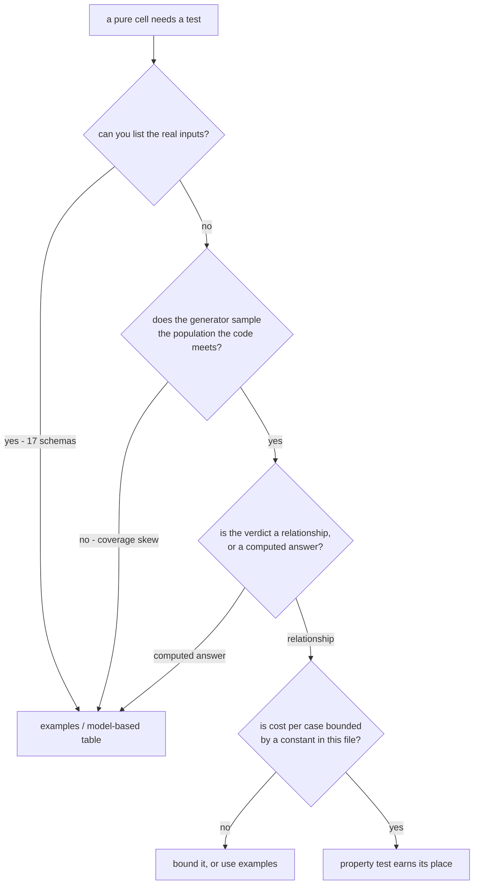

# Rule Corpus Integrity - Plan

## Goal Capsule

- **Objective.** Give the rule corpus an observer. Every rule declares the enforcement channel that carries it and the shape it takes, a gate rejects rules whose declaration does not match reality, and the property-test cell that exposed the gap is repaired as the first instance.
- **Product authority.** Repository owner. Grounded in `CONSTITUTION.md` A.2 (prefer the gate), III.2, III.3, III.5, and V.7, and in the published `packages/oxlint-plugins/*` rule corpus. Nothing in this plan is grounded in an artifact outside this repository: a doctrine file that lives in one operator's home directory binds one machine, which is the same defect as `gate: review` at larger scale, and citing it here would make the plan unfalsifiable for anyone who clones the repo.
- **Open blockers.** None. The document carries four phases and thirteen units across two audiences, and no phase waits on one it does not name. Phase A repairs the failing cell and drops a sanction nothing executes (R20, R21, R23, R24, R26); its user is this repository and it claims no enforcement reach. Phases B and C ship the portable-enforcement corpus (R1-R3, R14-R17, R22, R24-R28) to a stranger installing the packages, with R22's model-based assertions landing in Phase C behind U9's reshape. Phase D turns the same test on `CONSTITUTION.md` (R29, R30) and is where the plan is falsifiable against itself: the document demanding mechanization is read by a command whose first run is expected to fail every rule in it. The "the cell proves the rule fires" link is narrative — the real proof named in Success Criteria is RuleTester coverage plus a USER-V4 exit code per rule. They are sequenced for gate reasons stated under Implementation Units, not dependency.

---

## Product Contract

### Summary

Doctrine ships as a pair — a skill that explains and a mechanism that enforces — and a restraint that names no enforcing mechanism is advice, not doctrine. The line the corpus splits on is not distribution but ignorability: a document travels fine, by subtree, by vendoring, by an operator's skill directory, and none of that binds anyone, because a reader who disagrees or an agent that never loads the file simply proceeds. Only a mechanism that fails a command binds. So step-adding guidance stays prose, and a restraint moves to a channel that produces an exit code — a type the build rejects, a generator that emits the conformant file, a tool gate that denies the action, or a lint rule. Counted this session, the four channels are unevenly built here: 107 lint rules, one tool gate, two rules carried by a published type or by module resolution, and no generator at all. The largest single defect is not that `CONSTITUTION.md` travels poorly but that nineteen of its thirty-one rules sit at `gate: review`, a channel that runs no command here or anywhere. Three requirements were previously dropped for failing a distribution test; that test was the wrong one, and they are restored to Outstanding Questions on the correct axis. What survives is the harder half: every rule this plan adds carries RuleTester coverage proving it fires, and the property-test cell that produced a 273-second CI failure is repaired as instance one.

### Problem Frame

`packages/effect-schema-law/src/__tests__/refutation.kernel.property.test.ts` fails in CI. Measured this session on one tree, one commit:

| property                               | local, `numRuns: 100` | CI, `numRuns: 1000` |
| -------------------------------------- | --------------------- | ------------------- |
| `∀r_VacuousRefinements_≡NoObligations` | 11.2s                 | 78.0s               |
| `∀r_EachWitness_≡DischargesItsOwnArm`  | 50.1s                 | timeout at 120s     |
| `∀r_NoGenerators_≡NoCredits`           | 3.6s                  | 17.5s               |
| `∀r_ConstructibleSchema_≡NoBlindArms`  | 4.1s                  | 18.9s               |
| `∀r_ScanObligations_≡ObligationsOf`    | 5.8s                  | 25.9s               |
| file total                             | 74.9s, green          | 273.1s, red         |

Three defects sit under that table, and the fourth is what allowed all three.

CI multiplies work and budget in opposite directions. `packages/vitest-config/lib/base.js:7` sets the CI timeout to `30_000`, 3.75x the local `8_000`. `packages/effect-schema-law/vitest.setup.ts:9` sets CI `numRuns` to `1000`, 10x the local `100`. Every property test in the monorepo runs about 2.7x tighter in CI than locally, by construction. This package already bought headroom against that: `packages/effect-schema-law/vitest.config.ts:12` overrides `testTimeout` to `120_000`, four times the shared CI value. The gate was bent once and nothing recorded it.

The generator bounds depth and leaves fan-out free. `boundedUnion` caps recursion at `maxDepth: 1`, but `packages/effect-schema-law/src/schema-recipe.observer.ts:26` builds struct fields as `S.Array(inner)` with no length constraint. Cost per case is `arms x WITNESS_BUDGET` full-tree decodes and arms scale with fan-out. The comment four lines above that definition names both axes as magnitude knobs; the code bounds one.

Two of the five properties should not exist in their current form. `∀r_ScanObligations_≡ObligationsOf` asserts `scanObligations(s).obligations.size === obligationsOf(s).size`, and `packages/effect-schema-law/src/refutation.kernel.ts:162` defines `obligationsOf` as `scanObligations(s).obligations`. It compares a value with itself, and `sample` is seeded at `refutation.kernel.ts:79`, so even nondeterminism cannot make it fail. `∀r_EachWitness_≡DischargesItsOwnArm` calls `dischargedBy` once per obligation while `dischargedBy` loops every obligation against every generator, each sampling 256 draws — quadratic in the generated schema's obligation count.

The fourth defect is upstream and is the reason this plan is not a patch to one file. Nothing in the doctrine decides whether a property should exist — and worse, the rules that look like they do, do something else. `src-property-test-cell.ts:21,27` returns early unless the linted file _is_ a `*.property.test.ts`: it fires only on a property test sitting in a cell `PROPERTY_CELLS` (`packages/oxlint-plugins/test-placement/src/rules/path.config.ts:44`) does not sanction, and it has no branch that fires on an absent test. `no-test-file-in-src.ts:52-61` reports every test file under `src/` except `schema-laws.test.ts` and `*.property.test.ts`. So the pair mandates nothing; it channels. No rule requires a kernel to carry a test, and the only colocated form permitted is a property test. `property-file-purity`, `no-assert-in-property`, `no-silent-return`, `require-effect-fastcheck`, and `pbt-naming` then govern that property's form. Not one governs its cost, its population, or whether an example would be stronger. An author who wants a characterization test beside a kernel has no legal colocated form at all — and of the two directories the rules sanction outside the cell, `tests/` is executed by nothing in this repo, which is U4's subject.

That gap has a measured consequence in this repo. `docs/plans/2026-08-05-005-feat-schema-refutation-adequacy-plan.md:282` specified a literal expected table — hex-schema 8 obligation nodes, `effect-daemon-spec` 3 — and warned that a pin set to whatever the walk emits asserts nothing. That table never shipped. Searching both kernel property tests for `8`, `hex`, or `daemon` returns nothing. It had no legal home beside the code it describes: `property-file-purity` permits only `it.prop` in a property file, so the table cannot sit in the kernel's own property test, and `CLAUDE.md` USER-V6 reserves `import.meta.vitest` for a named residual, which a first-choice model-based table is not. One home is open and the plan states it rather than overreaching — `no-test-file-in-src.config.ts:10` directs such a file to `__tests__/<name>.integration.test.ts`, and `packages/effect-schema-law/vitest.config.ts:10` does include `__tests__/**/*.test.ts`, so a file placed there runs. The honest claim is therefore not that every home was closed but that every _colocated_ home was, and the one open home moves a per-cell assertion out of the cell it describes. The rule set has an opinion about where a property test may sit and none about whether a property is the cell's strongest test at all.

`CONSTITUTION.md` A.2 explains the mechanism precisely, working as written. III.2 (properties over examples) carries five lint rules. III.5 (pin behavior with tests over real examples) carries none. Where both apply, the mechanized one wins regardless of which is right for the cell.

That is the local story. The systemic one is that the doctrine's restraints live overwhelmingly at channels that fail no command, so an author — or an agent that never loads the file — violates them at no cost.

| where a rule lives                                        | count    | fails a command when violated                  |
| --------------------------------------------------------- | -------- | ---------------------------------------------- |
| oxlint rule descriptors under `packages/oxlint-plugins`   | 107      | yes — lint exits non-zero                      |
| rules carried by a published type or by module resolution | 2        | yes — the code does not compile                |
| `CONSTITUTION.md` rules declaring `gate: review`          | 19 of 31 | no — no command runs them, here or anywhere    |
| `CONSTITUTION.md` rules declaring `gate: lint`            | 10       | the rule does; the article is prose beside it  |
| `CONSTITUTION.md` rules declaring `gate: type-checker`    | 1        | the type does; the article is prose beside it  |
| `CONSTITUTION.md` rules declaring `gate: mutation`        | 1        | yes — `pnpm check:mutate-scope` exits non-zero |
| skills stating restraints with no rule id beside them     | 5+       | no — an agent reads it and proceeds            |

Three things follow, and each is a defect the corpus currently exhibits.

Sixty-one percent of the constitution is a restraint at a channel that runs nothing. Every `gate: review` entry carries a `dont:`, and no command anywhere evaluates it — not in this clone, not in a subtree of it, not for an agent that loaded the file and understood it perfectly. Distribution is not the problem: the document copies fine and a reader may even agree with it. The problem is that agreeing is optional and nothing detects the disagreement. This includes A.2 itself, "Prefer the Gate", the rule requiring that every principle able to fail a command must fail that command, which fails no command anywhere.

Where a rule does have a mechanism, the doctrine and the enforcement have already drifted and nothing can tell. `CONSTITUTION.md` III.2 declares `gate: review` while five published oxlint rules — `property-file-purity`, `no-assert-in-property`, `no-silent-return`, `require-effect-fastcheck`, `pbt-naming` — enforce it at the lint channel. The article says a human decides; the corpus says a machine already does. Nineteen of the constitution's thirty-one rules carry `gate: review`, including A.2 itself, the rule demanding that everything mechanizable be mechanized. The drift is invisible because nothing compares the two: no command reads a `gate:` declaration and checks whether a mechanism answering to it exists. A document that says `gate: review` beside a rule five linters already enforce is not merely stale — it is a false statement about the corpus that the corpus cannot contradict.

The lint channel is carrying the whole load. One hundred seven rules — counted this session as the files under `packages/oxlint-plugins/*/src/rules/` that call `defineRule`, excluding seven shared helpers that declare no rule — sit at AST lint; two sit at the channels that make an illegal state unrepresentable. Lint is being used as the primary mechanism rather than as the residue left after types and module resolution have taken what they can carry — and the residue channel is the one an author can silence with a config line.

The property-test failure is one leaf of this. `src-property-test-cell` mandates a property per kernel — a step-adding rule at the lint channel, the configuration that works — while the correction that would have stopped the bad property is a restraint, and the only place the doctrine had to put it was prose. The corpus produced exactly what its channel distribution predicts.

### Key Decisions



- **Admissibility is four terms, and it sits upstream of which property to write.** A property buys exactly one thing: quantification over a space that cannot be enumerated. It earns its place only when the domain is unenumerable, the generated population is the population the code actually meets, no trivial implementation satisfies the verdict, and cost per case is bounded by a constant declared in the file. Term three is quantified deliberately: not "some constant implementation fails this" — which almost every property satisfies and which therefore decides nothing — but "there exists no implementation that returns a fixed value without consuming the generated input and still passes". `obligationsOf ≡ emptyMap` consumes nothing and satisfies `∀r_VacuousRefinements_≡NoObligations`, so that property fails term three; nothing that ignores its input satisfies `∀r_EachWitness_≡DischargesItsOwnArm`, because the witness has to reach the credit, so that one passes. Comparing a value with itself is the degenerate case: `∀r_ScanObligations_≡ObligationsOf` compares `scanObligations(s).obligations.size` against `obligationsOf(s)`, which `refutation.kernel.ts:162` defines as `scanObligations(s).obligations`, so every implementation whatsoever satisfies it. Scored against all four, `bounded-union.kernel.property.test.ts` passes at 326ms; of the five properties in `refutation.kernel.property.test.ts`, four fail term three and only `∀r_EachWitness_≡DischargesItsOwnArm` survives it. All six satisfy every lint rule in the repo identically. Term three is a review judgment — the trivial implementation is constructed by a reader, not substituted by a script — so it is labelled as one and never presented as a gate.

- **Recursion is not the discriminator; interpretation is.** Both files generate recursive values. `bounded-union` _inspects_ its draws with a fold, so cost is `SEEDS x SAMPLE_SIZE`. `refutation` _interprets_ its draws — builds a schema, walks its AST, derives an arbitrary per arm, samples 256 draws per arm, decodes each twice. A rule banning property tests over recursive data would delete the better of the two files. The rule keys on whether the generated value is interpreted, because that is when per-case cost becomes a function of the generated value's size and `numRuns` stops being a budget.

- **Hughes' taxonomy is the vocabulary for the second decision.** _How to Specify It!_ names five kinds and measures their bug-finding power: model-based ("the most effective approach overall, revealing all our bugs with a small number of properties"), metamorphic ("almost as effective... especially in situations where a model is expensive to construct"), inductive, postconditions, and validity/invariants (weakest). Naming them gives an agent something to choose between; today the doctrine offers only "write a property test."

- **The four properties in the failing file map onto that taxonomy, and the mapping prescribes different fixes.** `bounded-union` is Hughes' `prop_ArbitraryValid` — a generator test, which he calls essential, and which is cheap precisely because it inspects rather than interprets. `∀r_EachWitness_≡DischargesItsOwnArm` is metamorphic: the right instrument with the wrong generator, so it keeps its invariant and loses its recipe generator. `∀r_ScanObligations_≡ObligationsOf` violates Hughes' one prohibition — "avoid replicating your code in your tests" — past its limit, since it does not replicate the implementation but calls it twice, so it is deleted outright. The 8/3 table that never shipped is model-based, the strongest kind he measured.

- **"No machine decides this" is a claim with an expiry date, and nothing in the corpus re-checks it.** The judgments this doctrine reserves for human review are largely decided by machines already: fast-check and Hypothesis report over-filtering, generator cost, oversized generated data, and quantification nested inside a predicate — the last being the exact quadratic shape that times out here. Term 4 is a runner option in fast-check itself, `interruptAfterTimeLimit`, working on synchronous and asynchronous properties since 1.19.0, with `markInterruptAsFailure` turning any overrun into a failure. Under A.2 a principle that can fail a command must fail that command, so a review-gated row survives only while no shipping framework has mechanized it — and no row currently records when that was last checked.

- **Suppression is visible in config, never by deletion.** Hypothesis's model — per-check, named, in settings, with the docs encouraging suppression where the user has evaluated it — is the same shape the repo already uses for `requireTestContribution: null`. Every gate this plan adds is suppressible the same way, so the escape hatch is a diff a reviewer sees rather than a test that quietly disappears.

- **Generating schemas is not wrong in principle; it is wrong unconfigured.** The compiler-fuzzing literature calls this coverage skew: a random program generator's distribution diverges from real programs, and swarm testing and feature-aware configuration exist to counter it. `FixturePlainRecipe` is three variants with one refinement kind and no patterns, templates, or unions. Configuring it to sample the real population would cost more than the 17 measured schemas do, so the model-based table wins here on cost as well as on strength.

- **Fix the failing cell and the rule that produced it, in one change.** Deleting one property and re-generating another turns CI green and teaches the repo nothing; the next kernel reproduces it. Writing doctrine without repairing the cell leaves a red gate and an unproven rule. The cell is the proof that the rule fires.

- **The criterion is a derivation, not a rule an agent reads.** A convention sticks only when a mechanism the author cannot bypass carries it. Ordered strongest to weakest, the channels are six: the type system and module resolver, where the illegal state is unrepresentable; the generator that births the file already correct; a rule that blocks or reports the action; a short in-context spec with one canonical form; named feedback quoting the violated clause; and prose the author must recall and choose to obey. The mechanized region is the top three, and R1 splits the third — a tool gate that denies the action, and a lint rule that reports it — because the two differ in what the author must do to proceed; that split is why R1 counts four mechanized channels against this ladder's six rungs, and the two enumerations are the same ladder at two grains rather than two ladders. The ordering is by how much the author must supply for the rule to bind — nothing at the top, everything at the bottom — and restraints sit worst on it, because "do not write a property test when the domain is enumerable" gives the author no step to take and only a step to omit. So the four-term test is not published as a rule an agent reads; each term that can be a gate becomes one, and what remains is labelled as what it is.
- **The rule that produced the garbage is the rule that works.** `src-property-test-cell` mandates a colocated property test for every kernel. That is a step-adding rule at the lint channel, and step-adding rules are the ones models follow reliably. It therefore manufactures a property test for every kernel and cannot ask whether one should exist. Adding a restraint rule beside a working step-adding rule does not cancel it. The mandate has to change shape: require a test and an observer, not a property.
- **A rule that fails no command does not exist.** Installation is not adherence, and neither is distribution: `CONSTITUTION.md` can be subtreed into any repo and a skill can be installed into any agent, and in both cases the reader — human or model — remains free to not load it, not recall it, or read it and proceed anyway. Text cannot detect its own violation. The question for every rule is therefore not "does it reach them" but "when they violate it, does something exit non-zero". Two conditions qualify that question, and neither softens it. A check waived often enough stops being a gate: around a five percent false-positive rate a static check is still accepted as enforcement, and by roughly twenty percent it is switched off in practice and survives as prose with a config entry — which is why R14's discriminator must clear a five percent band before it ships as a gate at all, rather than shipping on principle and being disabled later. And suppression does not collapse a gate into prose so long as suppressing it is itself an artifact: a named option in the consumer's config is a line a reviewer reads and a diff records, whereas a disable comment at the violation site leaves the violating file looking clean. That is the difference R16 encodes by giving every new rule a declared option instead of relying on a comment. Where a rule fails no command under both conditions, it moves to a channel that produces an exit code — a type, a generator, a tool gate, or a lint rule — or it is labelled advice. This is why `scripts/guard-mutate-scope.mjs` is enforcement and `CONSTITUTION.md` A.2 is not, despite the constitution being the more widely readable of the two.
- **Restraints ship as code; step-adding ships as prose.** A restraint delivered as prose asks the author to recall it and choose to obey; a step-adding rule delivered as prose adds a step to work the author is already doing. Only the second survives the channel reliably, so a restraint written into a skill is a defect in the skill rather than a weak rule. Hughes' five property kinds is the shape that works in a skill, because choosing among five named options adds a step rather than withholding one. The asymmetry is measured rather than merely argued, and the measurement is what makes the split non-arbitrary: at the named-feedback channel, step-adding rules recover to between 77 and 100 percent compliance once the violated clause is quoted into context, while restraint rules never exceed 23 percent there and sit at zero in unaided prose. That gap is the entire reason a restraint must move channel and a step-adding rule need not. Underneath it the binary still decides placement: a mechanism reports the violation whether or not anyone was paying attention, and prose does not.

### Requirements

Two tiers. The first moves the doctrine's restraints onto channels that fail a command; the second is the instance that proves one fires. Within the instance tier, requirements are grouped by enforcement channel, strongest first.

**System — enforcement that fails a command**

Verified this session: **the doctrine's largest channel runs nothing.** Nineteen of `CONSTITUTION.md`'s thirty-one rules declare `gate: review`, A.2 included, and no command in this repository evaluates any of them. Separately, no publishable `package.json` names `CONSTITUTION.md` in its `files` array — but that is a distribution fact and it is not the defect: the document is subtreeable and the skills are installable, and a rule that arrives intact and is then ignored is exactly as unenforced as one that never arrived. What decides a rule's existence is whether violating it produces an exit code.

- R1. Every restraint the doctrine states is carried by a mechanism that fails a command when violated, or it is labelled advice. The mechanized channels are four, ordered by how little the author must supply for the rule to bind: a type or module resolution, where the illegal state is unrepresentable; a generator that births the file already conformant; a tool gate that denies the violating action; and a lint rule. Below them sit in-context spec, named feedback, and prose. Those three are not inert, and this requirement does not claim they are: a complete in-context spec with one canonical form measurably collapses the author's decision space, and a quoted clause recovers step-adding compliance to between 77 and 100 percent. What they cannot carry is a restraint — there the same channels cap at 23 percent, and at zero for unaided prose — and restraints are what this requirement governs. A rule that withholds a step is the shape those channels fail at, whatever their reach. Reach is a separate axis and is not this test: `CONSTITUTION.md` is subtreeable and a skill is installable, so "it does not ship" never justifies deleting a rule, and a repo-local gate such as `scripts/guard-mutate-scope.mjs` is real enforcement for whoever runs it even though no consumer sees it. REPO-S6 survives this reading unchanged, reinterpreted: it governs _where a mechanism is placed_ — a concern we publish should be mechanized inside the published artifact so consumers get mechanism rather than prose — not whether an unshipped mechanism enforces. This is the plan's thesis and it binds the plan's own favourites: any deletion justified by "no carrier" must name which of the four mechanized channels was considered and why each fails, and no deletion may be justified by distribution alone.
- R2. Every rule this plan adds carries a RuleTester suite proving it fires on the violation and stays silent on the compliant form, under `OX-TS1`: cases named `Should_[Behavior]_When_[Condition]`, assertions on report `data` fields and not on `messageId` alone. Verified this session: the shipped corpus already satisfies this, so this binds only new rules. `OX-MG1` binds them further — each new rule's package must report zero Ignored, Survived, and NoCoverage mutants, so a new rule costs a mutation-complete suite and not one fixture pair.
- R3. Every rule's fix message names a location the consumer's own build executes, and declares that location in its own options rather than reading it. The option is the right design for a testability reason, not a capability one — a rule that stats the consumer's build config has no constructible RuleTester valid case (R28) — so the sanctioned set is an option with a default and the plugin's own suite checks the default against fixture packages. Verified this session, the instance is `tests/`: `test-placement/src/rules/path.config.ts:3` and `cell-taxonomy/src/rules/cell-suffix-required.config.ts:32` both sanction it, `test-file-outside-tests-dir.config.ts:5` names it in the stated expectation, and no `vitest.config.ts` in this repo includes `tests/**` — the executed directories are `src/**`, `__tests__/**`, and `test/**`. A rule sanctioning a directory nothing runs is a rule bug. Under `OX-EF1` the message keeps the four-field form, and under `OX-EF2` its `{{fix}}` must be able to end in deletion.
- R29. Every rule in `CONSTITUTION.md` declares a mechanism class that exists, and where that class is mechanical, names the artifact realizing it. Two fields carry this and they are deliberately separate. `gate:` names the class only — `type-checker`, `lint`, `build-script`, `mutation`, or `review` — drawn from a closed vocabulary, because the class is portable and a subtreed copy of this document must keep its meaning in a repository where none of our artifacts exist. `carrier:` names the artifact here: the oxlint rule ids, the exported type, the script path. Every non-`review` gate declares a `carrier:` that resolves. `gate: review` is then admissible in exactly two shapes, both declared rather than assumed. A rule that is mechanizable but not yet mechanized carries `debt:`, naming the channel it will move to and the date the claim was made; it is a labelled obligation, not a passing grade. A rule no mechanism can carry declares `permanent: true` with a `rationale:` that enumerates the mechanical subsets considered and says why each fails — a rationale naming no rejected subset is not a rationale, and the reader who can name a subset it omits has refuted it. Where part of a rule is mechanizable and part is not, the mechanizable part splits into its own rule and is mechanized, and the rationale states the split: a sound subset may not shelter inside a semantic whole. This is R1 turned on the document R1's ancestor lives in. Verified this session: of the twenty-four rules that currently parse, twelve declare `gate: review` and not one rule of any gate names an artifact, while III.2 declares `review` although `property-file-purity`, `no-assert-in-property`, `no-silent-return`, `require-effect-fastcheck`, and `pbt-naming` all enforce it.
- R30. The comparison between a declaration and the mechanism it names is itself a command. Nothing reads a `gate:` value today, which is how III.2's false declaration survived and how Article V came to sit inside an unterminated code fence — verified this session: `CONSTITUTION.md` opens a `yaml` fence at line 286 and never closes it, leaving 11 fence markers for 6 openers, so V.1 through V.7, every one of them `gate: review`, do not parse and render as literal text. A document no command reads cannot report its own drift, and this one has been silently truncated for long enough that no session noticed. What the command can decide is bounded, and the bound is stated here rather than discovered after it goes green: it decides that the document parses, that every rule carries a gate class from the closed vocabulary, that every mechanical gate's `carrier:` resolves to an artifact that exists, and that every `review` gate carries either a dated `debt:` or `permanent: true` with a non-empty enumerated `rationale:`. It does not decide that a named carrier enforces the rule's content, and it cannot — that a lint rule id exists says nothing about whether it catches what the clause describes. That residual stays a review obligation and is recorded as one rather than counted as covered.

**Instance — AST residue**

- R14. Lint reports an unbounded collection arbitrary in a fixture builder feeding a property generator — the fan-out axis a depth cap leaves open.
- R15. Lint reports quantification nested inside a property predicate whose iteration is driven by the generated value, the quadratic shape Hypothesis reports as `nested_given`.
- R16. Every rule this plan adds — R3, R14, R15, and R17's mandate change — is suppressible per check by a named key in the consumer's own rule options, and is never satisfied by deleting the test it accuses. The precedent is in the shipped corpus and is copied rather than invented: `core/ban-classes` takes a `whitelist` option decoded through `S.optionalWith(S.Array(S.String), { default: () => [] })`, and `cell-taxonomy/cell-suffix-required` takes an `exempt` list checked against the basename.

**Subtraction**

- R17. A pure cell is required by a rule to carry a test, and the sanctioned form of that test is declared per cell rather than fixed at "a property" for every cell. This reshapes two published rules rather than relaxing one, because neither mandates a test today. The per-cell keying is not imported from outside: `test-placement/src/rules/path.config.ts:44` already declares `PROPERTY_CELLS = ['workflow', 'policy', 'schema', 'kernel']`, and `:26` forbids `*.schema.test.ts` by name because a schema's laws are generated. Widening to "any test that adds coverage" would erase a distinction the plugin already ships, so the reshape keeps the keying and changes only what a cell's declaration is allowed to sanction. Verified this session: `src-property-test-cell.ts:21,27` returns early unless the linted file _is_ a `*.property.test.ts`, so it fires only on a property test in an unsanctioned cell and has no absence branch; `no-test-file-in-src.ts:52-61` reports every test file under `src/` except `schema-laws.test.ts` and a `*.property.test.ts` sitting inside a nested `__tests__` directory. That nested-directory refinement sharpened the pair rather than loosening it, and the channelling prohibition survives intact: the `__tests__` exemption at line 56 is gated on the file being a property test, so a characterization test in `src/foo/__tests__/` is still reported, and nothing anywhere requires a kernel to have a test at all. An author wanting a characterization test beside a kernel must write a property they do not need, or move it outside `src/` and rename it an integration test (R25) — which is how four tautologies arrived. So the rules change: the exemption widens to admit a colocated test whose basename names its cell and whose kind that cell's declaration sanctions, and `src-property-test-cell` gains the presence arm it never had. That arm reads the consumer's declaration through `options`/`settings` rather than the disk, which is what makes it testable under RuleTester — see R28. It requires a test to exist; whether that test covers anything is not in the AST, is enforced by nothing this plan ships, and is disclosed as a gap rather than implied closed.
- R28. `OX-TS2` states a capability ban the platform does not support and is restated as the testability constraint it actually is. Verified this session: `@oxlint/plugins@1.74.0` `index.d.ts` exposes `readonly physicalFilename` (`:3741`), `readonly cwd` (`:3751`), and `readonly settings: Readonly<JsonObject>` (`:4074`) on `Context`, and a rule runs in Node, so a filesystem read is possible. What is not possible is a passing RuleTester case for a rule that depends on a real sibling file. The rule therefore becomes: a rule may not depend on facts RuleTester cannot supply, project knowledge arrives through `options` or `settings`, and the plugin's own suite checks those declarations against fixture packages. This is not a technicality — inside this plan the mis-statement nearly pushed R3's sanctioned-directory option and R17's presence arm off the lint channel, and both are load-bearing units.

**The failing cell**

- R20. Four of the five properties in `refutation.kernel.property.test.ts` are deleted, not one. `∀r_ScanObligations_≡ObligationsOf` (25.9s CI) is satisfied by every possible implementation, since `obligationsOf` is defined as the thing it is compared against — the one case here that genuinely fails term three, because its verdict is a computed answer compared with itself rather than a relationship. `∀r_VacuousRefinements_≡NoObligations` (78.0s CI) and `∀r_ConstructibleSchema_≡NoBlindArms` (18.9s CI) are each satisfied by an implementation that ignores its input and returns an empty result. Those two are postconditions asserted against a literal constant — Hughes' weakest kind — and the term they actually fail is the second, not the third: the population they quantify over is `FixturePlainRecipe`'s three variants with one refinement kind and no patterns, templates, or unions, which is not the population the kernel meets. Naming that a term-three failure would misname the defect and point the next author at the verdict's shape when the generator is what is wrong. `∀r_NoGenerators_≡NoCredits` (17.5s CI) is worse than tautological: `dischargedBy(schema, obligations, {})` at `refutation.kernel.ts:193-206` iterates the generator record, so an empty record cannot produce a credit under any implementation, and the property asserts a structural fact about iterating `{}`. `∀r_ConstructibleSchema_≡NoBlindArms` is additionally misplaced: asserting zero blind arms over generated recipes is an assertion about `schema-recipe.observer.ts` producing constructible schemas, and an observer does not carry its own test. Their coverage moves into R22's table as a per-schema blind-arm column. The four named CI timings sum to 140.3s; the file's total CI time is 273s and the five properties account for 190.4s of it, so the remainder is fixture and import cost that deletion does not recover. No saving is claimed beyond the measured per-property figures, and the surviving cost must be re-measured after R21 replaces the generator rather than predicted here.
- R21. `∀r_EachWitness_≡DischargesItsOwnArm` keeps its invariant and loses its recipe generator. The witness-to-credit relationship is asserted over the real schemas rather than over synthetic recipes.
- R22. The model-based expectation specified at `docs/plans/2026-08-05-005-feat-schema-refutation-adequacy-plan.md:282` ships, in the packages that own the schemas rather than as one table in the kernel package. Verified this session: `packages/hex-schema` and `packages/effect-daemon-spec` both depend on `effect-schema-law` and import `refutes` from it, and `effect-schema-law` lists neither as a dependency — so importing them into its test is a package cycle and the single-table shape is unbuildable. It splits: `hex-schema` asserts its own obligation-node count of 8 with the per-schema breakdown, `effect-daemon-spec` asserts its own count of 3, each in its own suite, each already carrying a `stryker.config.json` and a `mutation` script. The assertion lands beside the schema it describes, which is where a model belongs, and no fixture is copied.
- R23. The surviving properties run inside their declared budget under CI's `numRuns` without raising `testTimeout`.

**Delivery gaps**

- R24. The `tests/` sanction earns an executed home or stops being named. Verified this session: `path.config.ts:3` and `cell-suffix-required.config.ts:32` both sanction `tests`, `test-file-outside-tests-dir.config.ts:5` tells authors outside `src/` to use `tests/` or `__tests__/`, and no `vitest.config.ts` in this repo includes `tests/**`. `packages/effect-schema-law/vitest.config.ts:9` includes `src/**/*.test.ts` and `__tests__/**/*.test.ts`; `packages/hex-schema/vitest.config.ts:9` includes only `src/**/*.test.ts`. A test placed in `tests/` is silently never run in either. This is the case R3 accuses.
- R25. A characterization or model-based test over real fixtures has a legal, executed home for a pure cell, reachable without renaming it an integration test.
- R26. The CI relationship between `numRuns` and `testTimeout` is a stated ratio or is removed in favor of per-property budgets. `packages/vitest-config/lib/base.js` sets three timeouts — 30s under CI, 15s for a non-TTY agent, 8s locally — while `packages/effect-schema-law/vitest.setup.ts` multiplies `numRuns` tenfold under CI only, and `packages/effect-schema-law/vitest.config.ts` overrides `testTimeout` to 120s to survive the product. No typed budget makes the global multiplier unreachable, so this requirement carries the whole load.

### Acceptance Examples

AE1, AE2, and AE10 are cross-cutting and are named by no single unit on purpose: AE1 tests R1, which is satisfied by construction rather than by a unit; AE2 tests R2 and AE10 tests R16, and every rule unit — U6, U7, U8, U9 — must satisfy both. An AE claimed by one unit there would let the other three off. Every remaining AE is claimed by the unit that owes it.

- AE1. Covers R1.
  - **Given** a restraint stated only in prose — "never narrow the generator to hide a counterexample" — with no mechanism named beside it, in a `CONSTITUTION.md` that has been subtreed into a consumer's repository and a skill that has been installed into their agent.
  - **When** an author or an agent writes the narrowed generator, having never loaded the file, or having loaded it and disagreed.
  - **Then** nothing exits non-zero, and this plan does not claim otherwise. The restraint is either given a mechanism on one of the four channels, or it is labelled advice. Distribution changes nothing here: the text arrived intact and still bound no one, which is why reach is not the test.

- AE2. Covers R2.
  - **Given** any published oxlint rule with no RuleTester case that fails on a violation.
  - **When** the plugin package's suite runs.
  - **Then** it fails naming the rule. A rule nobody has watched fire is indistinguishable from a rule that cannot.

- AE3. Covers R3.
  - **Given** the `tests/` directory sanctioned by `path.config.ts:3` and named in `test-file-outside-tests-dir.config.ts:5`, in a package whose vitest include list is `src/**/*.test.ts` and `__tests__/**/*.test.ts`.
  - **When** an author complies with the rule and puts a test in `tests/`.
  - **Then** that test is executed, or the rule stops sanctioning the directory and reports the misconfiguration instead. It never sends an author to a location where the test is silently never run.

- AE4. Covers R28.
  - **Given** a rule that would learn a project fact by reading a sibling file from disk — the executed test directory out of `vitest.config.ts`, say, or a `stryker.config.json`.
  - **When** a RuleTester valid case is written for it.
  - **Then** no passing valid case exists: RuleTester resolves every filename into `node_modules`, so the rule can never see a real sibling file, and an untestable rule cannot meet `OX-MG1`. The read itself is possible — `Context` carries `cwd` and `physicalFilename` (`@oxlint/plugins@1.74.0` `index.d.ts:3741,3751`) and a rule runs in Node — so what `OX-TS2` legitimately bans is untestability, not capability. The declaration-driven form is testable and is the form R3's option and R17's presence arm both take; the filesystem form stays banned.

- AE5. Covers R17, and the over-firing this reshape must not do.
  - **Given** `bounded-union.kernel.property.test.ts`, which generates a recursive `Expr`, inspects its draws with a fold, and declares `SEEDS` and `SAMPLE_SIZE` at lines 82 and 90, and its cell.
  - **When** the reshaped rules run — the widened exemption and the new presence arm.
  - **Then** both files are untouched and still pass, and the presence arm counts the existing property test as satisfying. A reshape that disturbs a property which already earned its place has traded one defect for another.

- AE6. Covers R17, and the over-firing a newly published presence rule must not do on arrival.
  - **Given** a consuming package that declares no cell list at all, holding source files whose basenames name cells.
  - **When** the reshaped `src-property-test-cell` runs there.
  - **Then** nothing is reported. The presence arm fires only against a declaration the consumer wrote, because a rule that demands a test from every cell-named file the day it ships accuses every consumer of a defect they did not introduce.

- AE7. Covers R20.
  - **Given** `∀r_ScanObligations_≡ObligationsOf` and `obligationsOf` defined at `refutation.kernel.ts:162` as `scanObligations(s).obligations`.
  - **When** the property is scored against term three by constructing an implementation that returns a fixed value without consuming the generated input.
  - **Then** it passes — as does every other implementation, since the property compares a value with itself — so it cannot fail and is deleted rather than re-budgeted.

- AE9. Covers R22.
  - **Given** `packages/hex-schema` and `packages/effect-daemon-spec`, both of which depend on `effect-schema-law` and import `refutes` from it.
  - **When** an implementer tries to assert the 8/3 counts from inside `effect-schema-law`.
  - **Then** it is a package cycle and cannot be built. The assertion instead lives in each consuming package against its own schema, where the dependency already points the right way and a `mutation` script already exists.

- AE10. Covers R16.
  - **Given** a package with a property whose cost genuinely exceeds the default bound and whose owner has evaluated it.
  - **When** the owner opts out.
  - **Then** the opt-out is a named key in that package's config, visible in the diff, and the property still runs.

- AE11. Covers R29, R30.
  - **Given** a rule in `CONSTITUTION.md` declaring `gate: lint` while no oxlint rule enforces it, or declaring `gate: review` with no stated reason, or sitting inside a code fence that is never closed.
  - **When** `pnpm check` runs.
  - **Then** it exits non-zero naming the rule id, the declared gate, and the mechanism it failed to resolve — and for the fence, failing before any gate is resolved, because a document that cannot be read cannot be audited. A rule that names no mechanism and no reason is a failure, not a default.

### Success Criteria

- `pnpm check` exits 0.
- `packages/effect-schema-law`'s suite completes under CI settings without any per-package `testTimeout` override above the shared value, or the override survives with a stated reason recorded next to it.
- Every rule this plan adds or reshapes — R3's option, R14, R15, R17's two reshaped rules — has produced a real exit code against this repository in the session that introduces it, per `CLAUDE.md` USER-V4, and each names the published plugin package that carries it per REPO-S6.
- Every new rule's package reports zero Ignored, Survived, and NoCoverage mutants, per `OX-MG1`. This is stricter than the root score gate and is the real cost of a new rule in this family.
- Every `*.property.test.ts` this plan touches carries a recorded four-term verdict — the six properties across `refutation.kernel.property.test.ts` and `bounded-union.kernel.property.test.ts`, scored this session — and U7's and U8's new rules have been run across all fifteen `*.property.test.ts` files in the repo with their false-positive counts recorded beside each rule. That is the part a command decides. A four-term verdict on the other thirteen files is deliberately not claimed here: term three is a review judgment by construction, so a repo-wide verdict is a review pass wearing a criterion's name. It is recorded in Deferred to Follow-Up Work with its file count rather than asserted as met.
- Every `CONSTITUTION.md` rule declares a gate class from the closed vocabulary, every mechanical class names a carrier that resolves, and every `review` class carries a dated `debt:` or `permanent: true` with an enumerated `rationale:` — and `pnpm check:ci` fails when one does not. That green asserts declaration shape and carrier existence, not that a named carrier enforces its rule's content; the residual is a review obligation carried in the PR body per R30. A doctrine document no command reads is the defect this plan names; repairing one of its instances while leaving the document unread would reproduce it.
- Net line delta is negative, or the change names what it deleted.

### Scope Boundaries

- Banning property tests over recursive data. It would delete `bounded-union.kernel.property.test.ts`, which passes all four terms at 326ms. Admissibility is the necessary condition, not the sufficient one: a property that passes all four still has to kill a mutant nothing else kills, which `packages/stryker-js/core/src/reporters/test-contribution.ts` already measures per `*.property.test.ts`. This plan neither restates that gate nor relaxes it.
- Lowering `WITNESS_BUDGET`. `refutation.kernel.ts:34` states the sampling budget is a property of the contract, and plan 005 records that an obligation missed for want of draws is a silent pass. The budget is correct; the generator that multiplies it is not.
- Configuring `FixturePlainRecipe` into a swarm that samples the real schema population. Rejected on cost: the 17 measured schemas are cheaper and stronger.
- Forking fast-check. `interruptAfterTimeLimit` is an existing runner option in the resolved 4.9.0.
- Deleting `src-property-test-cell` or `PROPERTY_CELLS`. Both are reshaped, not removed: R17 gives the first the presence arm it never had and redefines what the second sanctions. Requiring a pure cell to carry a test is correct and currently unenforced; permitting only a property as the colocated form is the defect.
- Rewriting the other published rules to match R28's corrected constraint. R28 amends the doctrine line, but no existing rule is refactored on that basis in this plan — the corrected reading is applied to new work and the audit of old work is not opened here.
- Applying the criterion to composition, contract, or integration tests. Their cost profile and population question are different and unmeasured here.
- Enforcing that a colocated test covers something. Coverage is not in the AST, and no gate this plan ships reaches it — see U9. The presence arm is what ships and the gap is named.

### Deferred to Follow-Up Work

- Forcing the property-test budget at the type channel. A wrapper whose required fourth argument makes the budget unomittable was measured this session against `@effect/vitest` 0.30.0 and the resolved `fast-check` 4.9.0, with a throwaway probe compiled under `--strict` and mutation-checked by removing a `@ts-expect-error` and confirming the error appeared: omitting the budget is `TS2554: Expected 4 arguments, but got 3`, a partial budget fails on the missing member, and no cast is needed. Two negatives hold too — borrowing the predicate type as `Parameters<typeof it.prop>[2]` does not compile, and the upstream mapped type must be copied rather than imported. Deferred on cost shape: the program needs a wrapper, a copied upstream type, a contract test pinning the copy, a lint rule closing the bare-`it.prop` escape, a RuleTester suite, a scaffold, and a suppression key — to stop one failing cell, in a repo where `bounded-union.kernel.property.test.ts:82,90,174` already declares `SAMPLE_SIZE`, `SEEDS`, and a per-test `{ fastCheck: { numRuns: SEEDS } }` by hand and runs in 326ms. R14, R15, and R23 catch the same cost shape directly. This entry is the measurement a later session needs.

- A four-term verdict on the thirteen `*.property.test.ts` files this plan does not touch. Term three — that no implementation returning a fixed value without consuming the generated input passes — is decided by a reader constructing that implementation, so the audit is a review pass and not a gate, and running it here would put a judgment the size of the corpus inside a plan whose other units are all mechanical. The verdict shape is settled and the file list is fifteen minus the two scored this session; what is deferred is the labour, not the criterion.
- Auditing the module-surface rule set against R1. A separate body of doctrine — public entry points, enumerated exports, one access path per symbol, where the composition root may sit, and versioning against the declared surface — was adjudicated this session and records in its own ledger that no published artifact carries any of it. That is this plan's thesis meeting a second corpus, and it is the sharper case: the two axes those rules turn on, import direction and export surface, are the two a static check decides most cleanly, and no cell suffix currently keys on either. It is out of scope here because none of it touches the property-test corpus or `CONSTITUTION.md`, and folding it in would double the plan around a second audience. The next plan in this line should run R29's four-outcome classification over that set before any of it is written into prose.

### Dependencies / Assumptions

- `interruptAfterTimeLimit`, `markInterruptAsFailure`, and `numRuns` all exist in the `fast-check` this package actually resolves — 4.9.0, confirmed against `packages/effect-schema-law/node_modules/fast-check/package.json` — and reach the runner through `@effect/vitest` 0.30.0's `timeout?: number | V.TestOptions & { fastCheck?: FC.Parameters<…> }` parameter.
- `effect-schema-law` does not depend on `hex-schema` or `effect-daemon-spec`. R22's table needs a fixture strategy that does not create a package cycle; whether the table lives in this package with copied fixtures or in the consuming packages is a planning decision, not a product one.
- REPO-S5 and `guard-mutate-scope.mjs` agree: the `dont:` clause prohibits both adding a forbidden cell to a `mutate` glob and leaving `mutate` unset, and the guard enforces exactly that at lines 66-72 and 78-93. There is no drift between them, so neither can serve as in-repo evidence for the drift thesis. The guard also validates only the configs that exist and demands none — measured this session it exits 0 at 24 clean configs while `effect-schema-law` carries no `stryker.config.json` — so a package holding no pure decision owes it no file.
- The four-term test is an admissibility criterion, not a completeness claim. It decides whether a property earns its place; it does not decide that the surviving properties are sufficient. Hughes' taxonomy addresses strength and the mutation gate measures it; neither is replaced here.

### Outstanding Questions

**Resolved during planning**

- Where R22's fixtures live. In `hex-schema` and `effect-daemon-spec`, one assertion each against their own schemas — see U10. The single shared table is a package cycle, so the question had no answer in the shape it was asked.
- Whether R15's quadratic check can be expressed as a single-file AST rule. Provisionally yes — `property-testing/src/rules/no-silent-return.ts:199-203` already walks `it.prop` predicates from a `CallExpression` selector using the shared `prop-call.ts` helpers, and U8 extends that. The residual risk is over-firing, carried below rather than as a channel question.
- Whether the R17 presence obligation can live at the lint channel at all. Yes, declaration-driven. `@oxlint/plugins@1.74.0` `index.d.ts:3741,3751,4074` shows `Context` carrying `physicalFilename`, `cwd`, and `settings`, so reading `OX-TS2` as a capability ban misroutes the obligation, and R28 fixes the doctrine line. The coverage half does not follow it to lint — see Open, below.

**Open**

- Which real schemas U2's surviving property draws from. The plan's "17 schemas" is a repo-wide count, not a set inside `effect-schema-law`; `Hexish` in `refutes.kernel.property.test.ts` is the only confirmed local fixture. If the reachable set is too thin to carry the witness-to-credit invariant, U2 reports that rather than restoring a generator.
- How U7 decides that a collection arbitrary "reaches a property generator". Following the import is out — not because the filesystem is unreachable (R28) but because a cross-file conclusion has no constructible RuleTester case. So the rule keys on file-local structure and will over-fire on files that merely declare a schema. The narrowing is U7's main design work and its `Should_StaySilent_When_ArrayIsNotInAGenerator` case is where it gets settled.
- Whether the coverage half of R17 ever ships, and where. Nothing rejects an in-source block that adds no branch, so the presence arm is satisfiable by a test that proves nothing. The plausible published home is `packages/stryker-js/core`'s reporter, which already consumes a full mutation result and already owns `requireTestContribution` — the same declaration-driven shape KTD6 describes, one channel over. Not costed, and not assumed to be worth doing. Two sub-questions come with it if it is built: which coverage `include` the branch diff runs under, and whether the extra pass runs on every CI run or only when an `import.meta.vitest` block changes.
- Which `CONSTITUTION.md` rules turn out to be unmechanizable, and whether A.2 is one of them. U15 classifies all thirty-one, but the split between "mechanizable, not yet mechanized" and "genuinely advice" is the judgment the unit makes rather than one the plan can make for it. The sharpest case is A.2 itself — "Prefer the Gate", the rule requiring that every principle able to fail a command must fail that command. If it lands in the advice bucket, the stated reason for that is the most consequential sentence in the document, and it should be reviewed as such rather than waved through with the other thirty.
- Whether R28's corrected reading obliges an audit of the existing rule corpus. Scope Boundaries says no for this plan. But if `OX-TS2` nearly pushed R3's option and R17's presence arm off the lint channel here, it plausibly pushed something off before, and nobody has looked. That is the next plan's question, recorded so the answer is a decision rather than an oversight.

### Sources / Research

Measured this session, at commit `561d28c9c7`, both runs on the same tree:

- `pnpm --filter @systemfsoftware/effect-schema-law test` — 29 tests, 79.79s, green. `refutation.kernel.property.test.ts` is 74.87s of it; `bounded-union.kernel.property.test.ts` is 326ms.
- `CI=true … vitest run src/__tests__/refutation.kernel.property.test.ts` — 273.14s, one failure: `∀r_EachWitness_≡DischargesItsOwnArm`, `Test timed out in 120000ms`, observed at 132.78s.
- Searching `refutation.kernel.property.test.ts` and `weaken.kernel.property.test.ts` for `8`, `hex`, or `daemon` returns no matches: plan 005's specified expected table never shipped.

In-repo:

- `packages/vitest-config/lib/base.js:7` — `sharedTestTimeout = isCI ? 30_000 : isAgent ? 15_000 : 8_000`.
- `packages/effect-schema-law/vitest.setup.ts:8-12` — `numRuns` 1000 in CI, 100 otherwise.
- `packages/effect-schema-law/vitest.config.ts:9,12` — `include: ['src/**/*.test.ts', '__tests__/**/*.test.ts']`, `testTimeout: 120_000`.
- `packages/effect-schema-law/src/refutation.kernel.ts:38,79,162` — `WITNESS_BUDGET = 256`; `fc.sample(arbitrary, { numRuns: budget, seed: 1 })`; `obligationsOf = (s) => scanObligations(s).obligations`.
- `packages/effect-schema-law/src/schema-recipe.observer.ts:20-26` — the comment naming depth and fan-out as magnitude knobs, above the unbounded `S.Array(inner)`.
- `packages/effect-schema-law/src/__tests__/bounded-union.kernel.property.test.ts:82,90,174` — `SAMPLE_SIZE = 200`, `SEEDS = 25`, and the per-test `{ fastCheck: { numRuns: SEEDS } }` precedent, declared by hand, which is why the typed-budget program is deferred rather than needed.
- `packages/oxlint-plugins/test-placement/src/rules/path.config.ts:3,44` and `test-file-outside-tests-dir.config.ts:5` — the sanctioned dirs, `PROPERTY_CELLS`, and the fix message naming `tests/`.
- `docs/plans/2026-08-05-005-feat-schema-refutation-adequacy-plan.md:282` — the specified 8/3 table and the warning that a pin set to whatever the walk emits asserts nothing.
- `CONSTITUTION.md` A.2, III.2, III.3, III.5, V.7.
- `packages/oxlint-plugins/property-testing/src/rules/` — four of the five shipped rules enforcing III.2 at the lint channel while the article declares `gate: review`. `pbt-naming` is the fifth and lives in `packages/oxlint-plugins/test-hygiene/src/rules/`, so the five span two plugins and a consumer must register both to be bound by all of them.

External:

- Hughes, _How to Specify It! A Guide to Writing Properties of Pure Functions_, LNCS 12053 (2020) — https://research.chalmers.se/publication/517894/file/517894_Fulltext.pdf. The five kinds, the measured ranking, "avoid replicating your code in your tests", and "test your tests".
- Goldstein, Cutler, Dickstein, Pierce, Head, _Property-Based Testing in Practice_, ICSE 2024 — https://harrisongoldste.in/papers/icse24-pbt-in-practice.pdf. Thirty interviews at Jane Street: practitioners struggle to convince themselves a distribution exercises the property, and lament the lack of visible feedback on test effectiveness. PBT performance requirements are named as an open problem.
- Hypothesis `HealthCheck` — https://hypothesis.readthedocs.io/en/latest/reference/api.html#hypothesis.HealthCheck. `filter_too_much`, `too_slow`, `data_too_large`, `large_base_example`, `nested_given`, and the per-check suppression model.
- fast-check timeouts — https://fast-check.dev/docs/configuration/timeouts/. `interruptAfterTimeLimit` on synchronous and asynchronous properties since 1.19.0, `markInterruptAsFailure`, and `skipAllAfterTimeLimit`.
- Coverage skew in random program generation: swarm testing and feature-aware configuration, K-Config — https://arxiv.org/pdf/1908.10481. The evidence that an unconfigured program generator samples a distribution unlike the real one.

---

## Planning Contract

### Grounding measured this session

Eight facts constrain the units below. Each was verified against this tree, not inferred.

| fact                                                                                                   | evidence                                                                                                                                                                                                                                                                                                                                         | consequence                                                                                                                                                                      |
| ------------------------------------------------------------------------------------------------------ | ------------------------------------------------------------------------------------------------------------------------------------------------------------------------------------------------------------------------------------------------------------------------------------------------------------------------------------------------ | -------------------------------------------------------------------------------------------------------------------------------------------------------------------------------- |
| Nineteen of thirty-one `CONSTITUTION.md` rules sit at `gate: review`                                   | twelve of the twenty-four rules that parse, plus all seven of V.1-V.7, which had to be counted by hand because they sit inside the unterminated fence below; the parseable remainder is 10 lint / 1 type-checker / 1 mutation                                                                                                                    | the majority of the doctrine fails no command; distribution is irrelevant to this and does not excuse it (R1)                                                                    |
| `CONSTITUTION.md` Article V sits inside an unterminated code fence                                     | the file opens a `` ```yaml `` fence at line 286 and closes no fence after it; 11 fence markers for 6 openers; V.1 through V.7 do not parse and render as literal text                                                                                                                                                                           | the doctrine document is partly unreadable and no session noticed, because no command reads it (R30, U14)                                                                        |
| No `gate:` declaration names the artifact that enforces it                                             | all 24 parseable rules carry a bare gate value with no rule id, symbol, or script beside it; III.2 says `review` while five published lint rules enforce it                                                                                                                                                                                      | the declaration cannot be compared against reality by anything, so drift is undetectable rather than merely undetected (R29, U15)                                                |
| `OX-TS2` is our doctrine, not a platform limit, and it is stated as a capability ban it cannot support | `@oxlint/plugins@1.74.0` `index.d.ts` puts `readonly filename` (`:3731`), `readonly physicalFilename` (`:3741`), `readonly cwd` (`:3751`), and `readonly settings: Readonly<JsonObject>` (`:4074`) on `Context`. A rule runs in Node; nothing stops `node:fs`. The leaf's own stated reason is a RuleTester testability argument, not an API one | project knowledge is a testable channel through `settings`/`options`; U13 amends the leaf, and R3's option and R17's presence arm are buildable only under the corrected reading |
| `OX-MG1` demands zero Ignored, Survived, NoCoverage per plugin package                                 | same leaf, stricter than the root score gate                                                                                                                                                                                                                                                                                                     | every new rule costs a mutation-complete suite, not one fixture pair                                                                                                             |
| `OX-TS1` forbids messageId-only assertions                                                             | same leaf — assert report `data` fields, name cases `Should_X_When_Y`                                                                                                                                                                                                                                                                            | sets R2's fixture shape, overriding the generic RuleTester guidance                                                                                                              |
| `hex-schema` and `effect-daemon-spec` depend on `effect-schema-law`                                    | their `package.json` deps; `effect-schema-law` lists neither                                                                                                                                                                                                                                                                                     | R22 ships as two per-package assertions; the single-table shape is a package cycle                                                                                               |
| `guard-mutate-scope.mjs` validates the configs that exist and requires none                            | run this session: exits 0 reporting 24 clean configs while `effect-schema-law` carries no `stryker.config.json` at all                                                                                                                                                                                                                           | a package of kernels owes no mutation config; adding one to move the count to 25 observes nothing, so that unit is cut                                                           |

### Key Technical Decisions

- **KTD1. New rules go into the existing plugins that own their concern, never a new package.** R14 and R15 are property-test contract rules and belong in `packages/oxlint-plugins/property-testing`. R17's mandate change and R3's sanctioned-dirs option belong in `packages/oxlint-plugins/test-placement`, which `TP2` names sole owner of test placement. Both plugins already use `defineRule` per `OX-A1`, so no API decision is open. A new package would need its own build, api-extractor config, publish metadata, and `oxlint.config.ts`, and would add a registration the consumer has to opt into.
- **KTD2. Static config in `*.config.ts`, behaviour in the rule file.** `OX-CS1` requires it and the mutation glob excludes `*.config.ts`, so putting a message template or a default list in the rule file inflates the mutation surface with equivalent mutants that `OX-MG1` will then refuse to let anyone ignore. Every unit that adds a rule adds two files.
- **KTD3. Options go through `JSONSchema.make(Options)`, and the precedent to copy is `ban-classes`, not `cell-suffix-required`.** `packages/oxlint-plugins/core/src/rules/ban-classes.config.ts:3-8,26` declares `Options` as an Effect `S.Struct`, defaults `whitelist` with `S.optionalWith(S.Array(S.String), { default: () => [] })`, and publishes it as `schema: [JSONSchema.make(Options)]`. That is the shape R16's suppression option and R3's directory option both take. `cell-taxonomy/cell-suffix-required.config.ts:47-57` reaches the same behaviour with a hand-written JSON Schema literal plus `defaultOptions`. No checklist in the plugin leaf names that form — verified this session, `OX-OB1` is titled "Keep an obligation, not only prohibitions" and says nothing about how options are authored — so the preference is argued here rather than cited. Hand-rolling the schema duplicates a shape `JSONSchema.make` derives from the struct, which is the same defect `check:no-hand-rolled-jsonc` already gates one format over, and it forfeits the decode-time validation the Effect struct gives for free. It is named as the anti-precedent so an implementer copying the nearest neighbour does not copy it. Reporting it, not fixing it: `cell-suffix-required` is outside this plan's scope and repairing it is a separate change.
- **KTD3b. Suppression and configuration are different things and must not share a default.** R16's option is an escape hatch whose empty default is correct — nothing is suppressed until someone opts out. R3's option is configuration whose default must be the true sanctioned list, because a consumer who sets nothing still gets a fix message and it must name a real directory. `ban-classes`'s `default: () => []` is right for the first and wrong for the second. U6 and U7/U8 therefore share the decode mechanism and not the default.
- **KTD3c. The sanctioned test directories are already declared twice; U6 must not make it three.** `test-placement/src/rules/path.config.ts` declares them, and `cell-taxonomy/src/rules/cell-suffix-required.config.ts:32` declares `SANCTIONED_TEST_DIRS = new Set(['tests', '__tests__'])` again in a different plugin. `TP2` names test-placement the sole owner of test placement, so U6's option default resolves from test-placement's declaration and the duplicate is recorded as debt rather than extended.
- **KTD4. The failing cell is repaired before any rule is written.** The repair turns CI green and is independent of the corpus work; the rules are what stop the next kernel reproducing it. Sequencing the repair first means a red gate does not block rule development, and it means the rules can be validated against a tree that is otherwise clean.
- **KTD6. A rule may know project facts through `settings` or options; what it may not do is learn them in a way RuleTester cannot reproduce.** This is the corrected form of `OX-TS2`, and it is load-bearing rather than pedantic: read as a capability ban, the leaf pushes rules off the lint channel that belong on it — R3's sanctioned-directory option and R17's presence arm both survive only under the corrected reading. `Context` carries `cwd`, `physicalFilename`, and `settings` (`@oxlint/plugins@1.74.0` `index.d.ts:3741,3751,4074`), and RuleTester can supply `settings` and `options` in a test case while it cannot supply a real sibling file. So the testable design is declaration-driven: the consumer declares the fact, the rule enforces against the declaration, and the plugin's own suite checks the declaration against fixture packages. A genuine filesystem read stays banned — not because the API forbids it, but because its passing case is unconstructible at this layer.
- **KTD7. The rules in this repo are ours to reshape, and this plan reshapes one.** `test-placement` is published by us, is pre-1.0 under REPO-R1, and root `AGENTS.md` classes `packages/*/` Editable including the oxlint rules. Where a rule's current shape is the defect, the plan changes the rule rather than working around it or relabelling the problem cultural. The one prohibition that still binds is the Editable-surface rule: never weaken a rule to make the current change pass. U9 and U13 both strengthen.

### Requirement coverage

Every surviving requirement maps to a unit, or is satisfied by construction with the construction named. None is unassigned.

| req | unit                          | note                                                                                                                                                                                                                                                                                                                                         |
| --- | ----------------------------- | -------------------------------------------------------------------------------------------------------------------------------------------------------------------------------------------------------------------------------------------------------------------------------------------------------------------------------------------- |
| R1  | by construction, plus U14-U16 | Every rule this plan adds lands on a mechanized channel per KTD1, so the mandate is met by where the units put their files. Its audit arm is no longer out of scope: Phase D turns R1 on `CONSTITUTION.md` itself. The earlier exclusion rested on the document shipping in no package, which is a distribution argument R1 no longer makes. |
| R2  | U6, U7, U8, U9                | each ships a RuleTester suite that fails on a violation, per `OX-OB1` and `OX-TS1`                                                                                                                                                                                                                                                           |
| R3  | U6                            | with U4 as the repo-side half                                                                                                                                                                                                                                                                                                                |
| R14 | U7                            |                                                                                                                                                                                                                                                                                                                                              |
| R15 | U8                            |                                                                                                                                                                                                                                                                                                                                              |
| R16 | U6, U7, U8, U9                | both suppression arms tested in each                                                                                                                                                                                                                                                                                                         |
| R17 | U9                            |                                                                                                                                                                                                                                                                                                                                              |
| R20 | U1                            |                                                                                                                                                                                                                                                                                                                                              |
| R21 | U2                            |                                                                                                                                                                                                                                                                                                                                              |
| R22 | U10                           |                                                                                                                                                                                                                                                                                                                                              |
| R23 | U2, U5                        | per-property budgets in U2, the CI ratio in U5                                                                                                                                                                                                                                                                                               |
| R24 | U4                            | the sanction is deleted rather than serviced — measured, `tests/` has no executor and no user                                                                                                                                                                                                                                                |
| R25 | U9                            | the widened exemption is what gives a colocated characterization test a legal home; U4 no longer contributes, since deleting a directory nothing runs does not create one                                                                                                                                                                    |
| R26 | U5                            |                                                                                                                                                                                                                                                                                                                                              |
| R28 | U13                           |                                                                                                                                                                                                                                                                                                                                              |
| R29 | U14, U15                      | the gate in U14, the classification it judges in U15                                                                                                                                                                                                                                                                                         |
| R30 | U14, U16                      | the command exists in U14 and runs on every `pnpm check` from U16                                                                                                                                                                                                                                                                            |

R-, U-, and AE-id gaps are intentional. Ids retired during planning are not reused, so a citation in a commit or a review comment keeps resolving to the thing it named.

### Implementation Units

Four phases. Phase A turns CI green and is independently shippable. Phase B reshapes the rules that produced the defect. Phase C ships the model assertions plan 005 never landed. Phase D turns the plan's own thesis on the doctrine document, which is the corpus's largest instance of it: nineteen of thirty-one rules fail no command, and seven of those nineteen have been unparseable inside an unterminated fence with nothing to notice. Every unit lands in, or is proven by, a mechanism that fails a command.

**Phase gates.** Phase B does not begin until `CI=true pnpm --filter @systemfsoftware/effect-schema-law test` exits 0 — U7 and U8 are validated against the shapes U1 and U2 leave behind, and U2 deletes U7's original instance, so a half-finished Phase A moves both targets. Within Phase B, U13 lands after U9, so the amendment is justified by a rule that depends on the corrected reading rather than by argument alone. Phase C waits on U9 as well as U1: U10's assertion is a model-based example test, and until U9 widens the exemption there is no location that `no-test-file-in-src` permits and `hex-schema`'s vitest include actually runs.

Phase D is independent of A through C and may run in parallel with them — it touches `CONSTITUTION.md`, `scripts/`, and root `package.json`, and no file any other unit edits. Inside it the order is strict and is the point: U14 builds the gate and observes it red, U15 clears the baseline, U16 wires it into `pnpm check`. Wiring before U15 would break the baseline for every other unit in the plan, and classifying before U14 would make the classification self-graded.

**Phase A — repair the failing cell.**

### U1. Delete the four properties that cannot fail

- **Goal.** Remove the four properties in the failing file that no implementation can break, leaving one.
- **Requirements.** R20. Covers AE7.
- **Dependencies.** None.
- **Files.** `packages/effect-schema-law/src/__tests__/refutation.kernel.property.test.ts` (modify).
- **Approach.** Delete `∀r_ScanObligations_≡ObligationsOf`, `∀r_VacuousRefinements_≡NoObligations`, `∀r_NoGenerators_≡NoCredits`, and `∀r_ConstructibleSchema_≡NoBlindArms`. Drop the now-unused imports of `makeVacuousSchema`, `makeRestrictiveSchema`, `scanObligations`, and `FixturePlainRecipe` if the surviving property does not use them. Do not re-budget any of the four — each fails term three and re-budgeting a property that cannot fail buys a faster tautology.
- **Execution note.** Measure the file's wall-clock before and after under `CI=true`, and record both numbers in the commit body. The plan claims 140.3s of the 273s is recoverable and explicitly does not claim the rest; the measurement either confirms that or corrects it.
- **Test scenarios.**
  - Covers AE7. The file runs green with exactly one `it.prop` remaining.
  - `pnpm --filter @systemfsoftware/effect-schema-law test` passes with `CI=true` set, at the shared 30s timeout rather than the package's 120s override, or the override's survival is recorded under U5.
  - No import in the file is unused — `pnpm --filter @systemfsoftware/effect-schema-law lint` passes.
  - `refutes.kernel.property.test.ts` and `weaken.kernel.property.test.ts` are untouched and still pass, proving the deletion did not reach a sibling.
- **Verification.** The file contains one property, the suite is green under CI settings, and the before/after timings are recorded.

### U2. Re-ground the surviving property on real schemas

- **Goal.** `∀r_EachWitness_≡DischargesItsOwnArm` keeps its metamorphic invariant and stops generating synthetic recipes.
- **Requirements.** R21, R23.
- **Dependencies.** U1.
- **Files.** `packages/effect-schema-law/src/__tests__/refutation.kernel.property.test.ts` (modify), `packages/effect-schema-law/src/schema-recipe.observer.ts` (**delete**).
- **Approach.** The witness-to-credit relationship is the invariant worth keeping; the recipe generator is what makes it quadratic, because `dischargedBy` loops every obligation against every generator at `WITNESS_BUDGET` draws each and the generated schema's obligation count drives the outer loop. Replace the `FixturePlainRecipe` arbitrary with the schemas the package already has on hand — `Hexish` in `refutes.kernel.property.test.ts` is the local precedent for a real fixture schema. Keep the declared `numRuns` in the per-test `{ fastCheck: { … } }` object, following `bounded-union.kernel.property.test.ts:174`.
- **Open input.** The plan's "17 real schemas" is a repo-wide count from an earlier measurement, not a set that exists inside this package. The implementer enumerates what is actually reachable without adding a dependency, and if that set is too thin to carry the invariant, the property is reported as such rather than propped up with a generator that reintroduces the cost. Recorded in Outstanding Questions.
- **The observer module dies with the generator.** `schema-recipe.observer.ts` exports `FixturePlainRecipe`, `FixtureRecipe`, `makeVacuousSchema`, and `makeRestrictiveSchema`, and — verified this session — `refutation.kernel.property.test.ts:4-9` is its only importer anywhere under `packages/`. `mod.ts` does not re-export it. So once U1 deletes four properties and U2 replaces the fifth's arbitrary, the whole 4.7KB module is unreachable and is deleted here rather than left as an orphan that `knip` will report and the next reader will mistake for live fixture infrastructure. This is the "one property generator" the Definition of Done counts, and until this line it was counted but unassigned.
- **Sequencing consequence for U7.** U7's rule targets `schema-recipe.observer.ts:26` as its real-world instance. This unit deletes that file, and U7 is in a later phase, so U7 cannot verify against the live line and must use a fixture reproducing the shape — corrected in U7's Verification. Deleting the instance before writing the rule that catches it is the right order anyway: the rule has to catch the shape, not one file.
- **Test scenarios.**
  - The property still fails when the witness-to-credit link is broken — remove one arm's witness from `dischargedBy`'s credit path and confirm red. This is the term-three check run as a test rather than asserted.
  - Per-case cost no longer scales with a generated schema's arm count: the property completes inside its declared `numRuns` with `CI=true`.
  - The property's arbitrary draws only from real schemas — no `FixturePlainRecipe` import remains in the file.
- **Verification.** The property is red when the invariant is broken, green when it holds, and runs inside its declared budget under CI.

### U4. Drop the `tests/` sanction nothing executes

- **Goal.** The sanctioned test directories are exactly the ones a build runs.
- **Requirements.** R24. Covers AE3.
- **Dependencies.** None.
- **Files.** `packages/oxlint-plugins/test-placement/src/rules/path.config.ts` (modify — `SANCTIONED_TEST_DIRS`), `packages/oxlint-plugins/cell-taxonomy/src/rules/cell-suffix-required.config.ts` (modify — the duplicate set named in `KTD3c`), both plugins' affected `__tests__` files (modify).
- **Approach.** Measured this session: `SANCTIONED_TEST_DIRS` is `new Set(['tests', '__tests__'])` in both plugins, `test-file-outside-tests-dir.config.ts:5` derives its stated expectation from that set, no `vitest.config.ts` in this repo includes `tests/**`, and no package contains a `tests/` directory at all — against 54 `__tests__/` directories under `packages/`, 35 of them tracked. The sanction has no executor and no user. R24 offers two arms and the measurement picks the second: delete `'tests'` rather than add a glob. Adding `tests/**/*.test.ts` to one package's include would leave every other package still sanctioning a directory it does not run — the same defect, one instance smaller — while deleting the member fixes every consumer at once and is a net subtraction under `CONSTITUTION.md` V.7.
- **Consequence for U6.** With the set down to one member, U6's option default is `['__tests__']`. The option is still needed; its default is now simply true instead of half-true, and `Should_NameConfiguredDir_When_OptionSet` is what serves a consumer whose build genuinely differs.
- **Breaking-change note.** This narrows two published rules. Per REPO-R1 the break is in scope and is recorded with the `api!` marker or a `BREAKING CHANGE:` footer. A consumer who does keep a `tests/` directory starts being reported and sets the U6 option — the correct signal, since their tests were being collected only because their own config said so, never because this sanction did anything.
- **Test scenarios.**
  - `Should_Report_When_TestIsInTestsDir` in `test-file-outside-tests-dir`'s suite — the newly narrowed branch, and the one that proves the deletion took effect rather than merely compiled.
  - `Should_StaySilent_When_TestIsInNestedTestsDir` — `__tests__/` is untouched. A deletion that also drops the surviving member trades one defect for another.
  - The repo-wide collected test count is identical before and after: nothing here lived in `tests/`, so the change is observable only in lint, and a moved count would mean the edit reached further than intended.
- **Verification.** Both plugins' `test` and `mutation` exit 0, the collected test count is unchanged, and no `'tests'` member survives in either `SANCTIONED_TEST_DIRS`.

### U5. State the CI budget relationship

- **Goal.** The `numRuns`-versus-`testTimeout` relationship is written down or removed, and the package's 120s override either goes away or carries its reason.
- **Requirements.** R26, R23.
- **Dependencies.** U1, U2.
- **Files.** `packages/effect-schema-law/vitest.config.ts` (modify), `packages/effect-schema-law/vitest.setup.ts` (modify), `packages/vitest-config/lib/base.js` (modify only if the ratio is centralized).
- **Approach.** `base.js` sets 30s under CI, 15s for a non-TTY agent, and 8s locally; `vitest.setup.ts` multiplies `numRuns` tenfold under CI only. The product is that every property runs roughly 2.7x tighter in CI than locally, by construction, and this package bought headroom by overriding `testTimeout` to 120s with nothing recording why. After U1 and U2 the file should fit the shared budget. Drop the override and let the shared value apply; if the suite does not fit, keep the override with a comment naming the measured figure that requires it.
- **Execution note.** This unit is measurement-led. Run the suite under `CI=true` with the override removed before deciding which arm applies — do not pick the arm from the plan.
- **Test scenarios.**
  - The package suite passes under `CI=true` with no `testTimeout` override, or the override is present with a comment naming the measured wall-clock that requires it.
  - Removing the `numRuns` CI multiplier does not change any surviving property's verdict — if a property only passes because CI runs it more, that is a finding about the property, not the budget.
- **Verification.** Either the override is gone and the suite is green under shared settings, or the override is annotated with a number measured in this session.

**Phase B — the rules that stop recurrence.**

### U6. Declare the sanctioned test directories as a rule option

- **Goal.** `no-test-file-in-src` names a directory the consumer's build executes, declared in options rather than read from disk.
- **Requirements.** R3, R16.
- **Dependencies.** U4.
- **Files.** `packages/oxlint-plugins/test-placement/src/rules/no-test-file-in-src.config.ts` (modify), `packages/oxlint-plugins/test-placement/src/rules/no-test-file-in-src.ts` (modify), `packages/oxlint-plugins/test-placement/src/rules/__tests__/no-test-file-in-src.test.ts` (modify).
- **Approach.** Add an `Options` struct carrying the sanctioned directory list with a default, per `KTD3`'s precedent in `core/ban-classes.config.ts`, and interpolate the resolved value into the message strings rather than baking the directory names into them. Today `no-test-file-in-src.config.ts:6,10` writes `src/**/__tests__/` and `__tests__/<name>.integration.test.ts` as literal prose, so a consumer whose build globs something else is told to move a file somewhere their runner ignores. The option is the contract because a rule that reads the consumer's build config has no constructible RuleTester valid case (`KTD6`, R28) — not because the read is impossible. Per `KTD3b` this default is configuration and must be the true sanctioned list, which after U4 is `['__tests__']`, not the empty default a suppression option takes. Keep the four-field `OX-EF1` message shape, and under `OX-EF2` its `{{fix}}` must be able to end in deletion.
- **Patterns to follow.** `core/src/rules/ban-classes.ts` for the `S.decodeUnknownSync(S.Array(Options))(context.options)` shape and `ban-classes.config.ts:26` for `schema: [JSONSchema.make(Options)]`. `cell-taxonomy/src/rules/cell-suffix-required.ts` for an allow-list checked against a basename — its _rule_ body only; its config is the hand-rolled-schema anti-precedent named in `KTD3`.
- **Test scenarios.**
  - `Should_NameConfiguredDir_When_OptionSet` — the fix message interpolates the configured directory, asserted on the report `data` field per `OX-TS1`, not on `messageId`.
  - `Should_NameDefaultDir_When_OptionOmitted` — the default fires with no options supplied.
  - `Should_StaySilent_When_TestIsInSanctionedDir` — a valid case per configured directory, proving the option is read rather than ignored.
  - `Should_Report_When_TestIsInSrc` — the existing invalid case still fires, proving the option did not widen the rule into silence.
  - A near-miss case: a directory whose name is a prefix of a sanctioned one is still reported. This distinguishes an `includes` mutant from a `===` mutant.
- **Verification.** `pnpm --filter @systemfsoftware/oxlint-plugin-test-placement test` and `mutation` both exit 0, with zero Ignored, Survived, and NoCoverage per `OX-MG1`.

### U7. Report an unbounded collection arbitrary in a generator

- **Goal.** Lint catches the fan-out axis a depth cap leaves open.
- **Requirements.** R14, R16, R2.
- **Dependencies.** None.
- **Files.** `packages/oxlint-plugins/property-testing/src/rules/no-unbounded-fanout.config.ts` (create), `.../no-unbounded-fanout.ts` (create), `.../__tests__/no-unbounded-fanout.test.ts` (create), `packages/oxlint-plugins/property-testing/src/index.ts` (modify — register the rule and add it to `configs.recommended`).
- **Approach.** The instance is `packages/effect-schema-law/src/schema-recipe.observer.ts:26`, where struct fields are built as `S.Array(inner)` with no length constraint while `boundedUnion` caps recursion at `maxDepth: 1`. Cost per case is arms times `WITNESS_BUDGET` full-tree decodes and arms scale with fan-out, so a depth cap alone bounds nothing. Report a collection arbitrary — `S.Array`, `fc.array`, `S.Record` — that reaches a property generator with no length or `maxLength` constraint. `OX-IN1`: `configs.recommended` is a rules bag and nothing else.
- **Open input.** Whether "reaches a property generator" is decidable in a single file's AST. Following the import is ruled out by testability rather than capability (R28): a cross-file conclusion has no constructible RuleTester case. So the rule likely keys on a collection arbitrary inside a file that also exports a schema or recipe consumed by a generator — which over-fires on files that merely declare a schema. Narrowing this is the unit's main design work and is recorded in Outstanding Questions. The narrowing is also this rule's admission gate, and the mutation score is not: a check is enforcement-grade only at a false-positive rate at or below five percent, and one that decides the right thing most of the time is a suggestion wearing a gate's clothes. U7 therefore ships with a measured false-positive count over the surviving corpus recorded beside the rule, and if the schema-declaration over-fire cannot be narrowed under that band the rule ships as a warning-severity suggestion rather than as a gate.
- **Test scenarios.**
  - `Should_Report_When_ArrayArbitraryHasNoLengthBound` — the `schema-recipe.observer.ts:26` shape, asserted on `data`.
  - `Should_StaySilent_When_ArrayHasMaxLength` — the compliant form.
  - `Should_StaySilent_When_ArrayIsNotInAGenerator` — proves the rule is scoped and does not flag every `S.Array` in the repo.
  - `Should_Report_When_SuppressionListOmitsThisFile` and `Should_StaySilent_When_FileIsExempt` — R16's option, both arms.
  - Boundary: `maxLength: 0` is bounded and silent; a `maxLength` read from a non-literal is reported, since the rule cannot prove it is bounded.
- **Verification.** U2 deletes `schema-recipe.observer.ts`, so the live instance is gone by the time this unit runs. Verify against a fixture reproducing the `S.Array(inner)`-under-`maxDepth` shape that file had at line 26, and additionally run the rule across the whole repo to confirm it finds no false positive in the surviving corpus — a rule whose only evidence is its own fixture has not been shown to discriminate. The plugin's `test` and `mutation` both exit 0 with zero Ignored.

### U8. Report quantification nested inside a property predicate

- **Goal.** Lint catches the quadratic shape that produced the timeout.
- **Requirements.** R15, R16, R2.
- **Dependencies.** U7 — both units register a rule into `packages/oxlint-plugins/property-testing/src/index.ts`, so they land in order rather than in parallel. Nothing else in U8 depends on U7's content.
- **Files.** `packages/oxlint-plugins/property-testing/src/rules/no-nested-quantification.config.ts` (create), `.../no-nested-quantification.ts` (create), `.../__tests__/no-nested-quantification.test.ts` (create), `packages/oxlint-plugins/property-testing/src/index.ts` (modify).
- **Approach.** The instance is the deleted `∀r_EachWitness_≡DischargesItsOwnArm` shape: the predicate iterates the generated value and calls a function that itself loops, so per-case cost is a function of the generated value's size rather than of `numRuns`. Hypothesis reports the same shape as `nested_given`. Key on an iteration construct inside an `it.prop` predicate whose iterable derives from a predicate parameter. Reuse the shared `prop-call.ts` helpers rather than re-deriving the `it.prop` detection.
- **Patterns to follow.** `packages/oxlint-plugins/property-testing/src/rules/prop-call.ts:6` for `isPropCallee` and `:18` for `getPredicate` — the shared helpers, not local to any one rule. `no-silent-return.ts:199-203` for the `CallExpression` selector that gates on `isPropCallee` then pulls the predicate, and `no-silent-return.ts:151` for the `collectGenerators` walker. That trio is the closest existing shape and U8 extends it rather than starting a fourth traversal.
- **Test scenarios.**
  - `Should_Report_When_PredicateIteratesGeneratedValue` — a `for` or `.every` over a predicate parameter.
  - `Should_StaySilent_When_PredicateIteratesAConstant` — iteration over a module-level literal is bounded and fine. This is the case that separates the real rule from a ban on loops in predicates.
  - `Should_StaySilent_When_PredicateFoldsWithoutNestedCall` — `bounded-union.kernel.property.test.ts` inspects its draws with a fold and must not fire. This is AE5's over-firing check expressed as a rule test.
  - `Should_Report_When_NestedCallLoopsInternally` — the `dischargedBy` shape, where the loop is behind a call.
  - Both R16 suppression arms.
- **Verification.** U1 has already deleted the property by the time this unit runs, so the live instance is gone: verify against a fixture reproducing the deleted `∀r_EachWitness_≡DischargesItsOwnArm` shape, and confirm the rule fires on it and stays silent on `bounded-union`. Record the same measured false-positive count over the surviving corpus that U7 records, and hold the rule to the same five-percent admission band — `Should_StaySilent_When_PredicateFoldsWithoutNestedCall` is the narrowing that band depends on, so a corpus run that fires on any surviving fold demotes this rule to a suggestion. Plugin `test` and `mutation` exit 0 with zero Ignored.

### U9. Reshape the placement pair into a presence rule with a declared sanction

- **Goal.** A pure cell is required to carry a test, that requirement is enforced by a rule rather than by doctrine prose, and the sanctioned form of that test is whatever the consumer declares for that cell — not a property for every cell, and not any test at all.
- **Requirements.** R17, R16, R25. Covers AE5, AE6.
- **Dependencies.** U4, U6, U7, U8. U4 first because the sanctioned set must be true before a rule widens what it permits — widening on top of a member nothing runs would bake the dead directory into the new exemption and into every message derived from it. U6 because it rewrites the same three `no-test-file-in-src` files this unit reshapes, and two units editing one rule in parallel is a merge rather than a design. U7 and U8 because the relaxation must not land before the rules that catch what it lets through.
- **What the rules do today, precisely.** `src-property-test-cell.ts:21,27` returns early unless the file _is_ a `*.property.test.ts` — it fires only when a property test sits in a cell that `PROPERTY_CELLS` does not sanction. It has no absence branch. `no-test-file-in-src.ts:52-61` reports any test file under `src/` _except_ `schema-laws.test.ts` and a `*.property.test.ts` inside a nested `__tests__` directory, and the exemption at line 56 is gated on the file being a property test — so a characterization test in `src/foo/__tests__/` is reported just the same. The pair is therefore not a mandate at all: it is a channelling prohibition. Nothing requires a kernel to have a test, and if you want one colocated, a property test is the only legal form. An author who wants a characterization test beside a kernel must either write a property they do not need, or move it outside `src/` and rename it an integration test. That is a sharper indictment than "the rule is too strict": the rule manufactures the exact artifact this plan is deleting four instances of.
- **Approach — change the rule, do not work around it.** `test-placement` is ours, published, pre-1.0 under REPO-R1, and Editable per root `AGENTS.md`. The fix is a deliberate breaking reshape in three parts. First, `no-test-file-in-src` widens its exemption so a colocated test whose basename names a cell is legal, which gives R25's characterization test a colocated home and removes the channelling pressure. Second, `src-property-test-cell` gains the presence arm it never had: for a source file under `src/` whose basename names a cell in the consumer's declared cell list, report when the file carries no colocated test and no in-source block. Third, `PROPERTY_CELLS` stops meaning "these cells must have a property test" and becomes the sanction list for _which_ colocated forms are legal per cell.
- **How the presence arm is testable — `settings`, not the filesystem.** `OX-TS2` reads as a ban on seeing a sibling file; `KTD6` restates it as the testability constraint it actually is. `Context` exposes `cwd`, `physicalFilename`, and `settings` (`@oxlint/plugins@1.74.0` `index.d.ts:3741,3751,4074`), and RuleTester can populate `settings` and `options` while it cannot populate a real sibling. So the rule does not stat the disk — it reads the consumer's declaration of which cells require a test and which colocated forms are sanctioned, and the presence arm fires against that declaration plus what the linted file itself contains. An in-source `import.meta.vitest` block is visible in the file's own AST, so the commonest satisfying form needs no external knowledge at all. The plugin's own suite then checks the declaration against fixture packages, which is where the filesystem question legally lives.
- **Files.** `packages/oxlint-plugins/test-placement/src/rules/path.config.ts` (modify — `PROPERTY_CELLS` semantics), `.../no-test-file-in-src.config.ts` and `.../no-test-file-in-src.ts` (modify — widen the exemption), `.../src-property-test-cell.config.ts` and `.../src-property-test-cell.ts` (modify — add the presence arm and the `Options`/`settings` decode), both rules' `__tests__` files (modify). No script and no root `package.json` change — see the residual note below.
- **Breaking-change note.** This changes the meaning of two published rules and of `PROPERTY_CELLS`. Per REPO-R1 that is in scope and mandatory to record: the commit carries the `api!` marker or a `BREAKING CHANGE:` footer, and the rules' `docs.description` strings are rewritten, because a description that still says "property test" after this lands is the same declaration-versus-reality drift the plan exists to close.
- **What this unit does not close.** The presence arm can require _a_ test; it cannot tell whether that test covers anything, because coverage is not in the AST. `packages/effect-schema-law/vitest.config.ts:10` already sets `includeSource: ['src/**/*.ts']`, so a redundant in-source block satisfying the presence arm is buildable today and nothing here rejects it. Closing that takes a coverage-diff gate, and nothing forbids one: REPO-S6 bans a script gate as the _carrier of a doctrine we publish_, not repo-local gates as such, which is why `scripts/guard-mutate-scope.mjs` is correctly placed. A repo-local coverage gate would be real enforcement for whoever runs it, and under R1 that is enforcement, full stop — reach is a separate axis. It is not sized here because it has not been designed, and because the concern is one consumers have, so its right home is the published plugin or `packages/stryker-js/core`'s reporter rather than a script. So what ships is "a pure cell must carry a test", and "the test must cover something" is mechanized nowhere yet. The gap is carried in Outstanding Questions with that reporter named as the plausible home, rather than assumed closed.
- **Test scenarios.**
  - `Should_Report_When_DeclaredCellHasNoColocatedTestAndNoInSourceBlock` — the presence arm, the branch the rule has never had. This is the scenario that proves the reshape did something.
  - `Should_StaySilent_When_CellCarriesInSourceBlock` — satisfied from the file's own AST, no external knowledge.
  - `Should_StaySilent_When_CellIsNotInDeclaredList` — covers AE6. A consumer who declares nothing is not accused. The presence arm must be opt-in by declaration or it fires on every source file in every consuming package the day it ships.
  - Covers AE5. `bounded-union.kernel.property.test.ts` and its cell are untouched and still pass — the property that earned its place is not disturbed by the reshape, and the presence arm counts it as satisfying.
  - `Should_StaySilent_When_CellCarriesColocatedCharacterizationTest` — covers R25. The form `no-test-file-in-src` used to forbid is now legal, which is the point of widening the exemption.
  - `Should_Report_When_TestSitsInUnsanctionedCell` — the original placement behaviour survives the reshape. A reshape that silently drops the existing branch trades one gap for another.
- **Verification.** The presence arm fires and stays silent across all six lint scenarios with zero Ignored under `OX-MG1`; AE5 and AE6 both reproduce; and the plugin's `test` and `mutation` both exit 0.

### U13. Amend `OX-TS2` to say what it means

- **Goal.** The plugin leaf stops asserting a capability the platform does not lack, so the next author is not pushed off the lint channel by a rule that was never about capability.
- **Requirements.** R28. Covers AE4. The corrected form is `KTD6`.
- **Dependencies.** U9 — the amendment is justified by a rule that now depends on the corrected reading, not by argument alone.
- **Files.** `packages/oxlint-plugins/AGENTS.md` (modify — `OX-TS2`).
- **Approach.** `OX-TS2` today reads as "filesystem-backed rules are banned", evidenced by the absence of `existsSync`/`statSync`/`readdirSync` under `src/rules/`. The absence is real; the inference is not. `@oxlint/plugins@1.74.0` puts `cwd`, `physicalFilename`, and `settings` on `Context` (`index.d.ts:3741,3751,4074`) and a rule runs in Node, so nothing stops the read. The leaf's own stated reason is that RuleTester cannot give such a rule a passing valid case — a testability constraint, which is a different and better rule. Restate it that way: a rule may not depend on facts RuleTester cannot supply; project knowledge arrives through `options` or `settings`; the plugin's own suite checks those declarations against fixture packages. In this plan alone the mis-statement nearly cost R3 its option and R17 its presence arm.
- **Surface note.** `packages/oxlint-plugins/AGENTS.md` is **Editable** under root `AGENTS.md` Surface Classes, which name every `packages/*/` tree editable and say so of the oxlint rules explicitly — the leaf docs that govern them come with that. There is no Locked class; the one prohibition binding every surface is never to weaken a rule, threshold, budget, glob, or instruction in order to make the current change pass. This amendment strengthens: it replaces an unfalsifiable capability claim with a testable constraint. Strengthening is always in scope, and it still lands in its own commit with the reason stated, separate from U9's rule change.
- **Test scenarios.**
  - `Test expectation: none` — this unit edits a doctrine file. Its correctness is demonstrated by U9 landing a rule the old wording forbade and the new wording permits, with that rule's suite green. A test asserting the file's text would assert source text, which `CLAUDE.md` USER-V5 bans.
- **Verification.** U9's presence arm exists, is tested, and does not read the filesystem — which is the amendment's claim made concrete. `pnpm check` stays green.

**Phase C — the model assertions.**

### U10. Ship the obligation-count assertions where the schemas live

- **Goal.** The model-based expectation from plan 005 finally ships.
- **Requirements.** R22. Covers AE9.
- **Dependencies.** U1 and U9. The blind-arm coverage the deleted `∀r_ConstructibleSchema_≡NoBlindArms` provided moves here. U9 is a hard prerequisite rather than a courtesy: this assertion is a model-based example test, which is precisely the form the current placement pair leaves with no legal executed home.
- **Files.** `packages/hex-schema/src/**/__tests__/` — a test asserting its own obligation-node count of 8 with the per-schema breakdown and a blind-arm column; `packages/effect-daemon-spec/src/**/__tests__/` — the same for its count of 3. Both are schema cells, and a schema cell's only sanctioned colocated form today is the generated `schema-laws.test.ts`, with `*.schema.test.ts` forbidden by name at `path.config.ts:26`. Under R17's per-cell keying, "whatever U9's widened exemption sanctions" is not an answer: U9 must explicitly sanction a model-table form for the schema cell, and if its declaration does not name one, this unit does not ship and R22 returns to Outstanding Questions. It is not a `*.property.test.ts` either: calling a literal-count table a property to satisfy a filename rule is the same lie R17 exists to stop.
- **Approach.** Two assertions, not one table. Both packages already depend on `effect-schema-law` and import `refutes` from it, both already carry a `stryker.config.json` and a `mutation` script, and neither creates a cycle. The assertion is a literal table — the counts are written down, not computed from the walk — because a pin set to whatever the walk emits asserts nothing, which is the warning plan 005 recorded at line 282. Placement is constrained and was measured: `packages/hex-schema/vitest.config.ts:9` includes only `src/**/*.test.ts`, so a file under an out-of-src `__tests__/` would never run there, and `no-test-file-in-src.ts:52-61` reports every in-src test that is neither a property test in a nested `__tests__` nor the generated `schema-laws.test.ts`. U9's widened exemption is what opens the one location that is both legal and executed.
- **Test scenarios.**
  - Covers AE9. Removing an arm of the recursive walk in `effect-schema-law` so `hex-schema` reports 7 nodes makes the `hex-schema` assertion fail on the literal count. This is the counterfactual the synthetic recipes could not compute, and it must be run, not assumed.
  - The per-schema breakdown fails on a changed distribution even when the total still sums to 8. A total-only assertion survives a mutant that moves a node between schemas.
  - The blind-arm column is zero for every listed schema, and a schema with a blind arm fails naming it.
  - `effect-daemon-spec`'s count of 3 fails the same way independently, proving the two assertions are not one test in two files.
- **Verification.** Both counterfactuals produce red in this session; `pnpm --filter @systemfsoftware/hex-schema mutation` and the `effect-daemon-spec` equivalent still exit 0.

**Phase D — the doctrine document.**

### U14. Make the doctrine document machine-readable and check its gate declarations

- **Goal.** A command reads every `CONSTITUTION.md` rule's gate declaration and fails when the class is outside the closed vocabulary, when a mechanical class names no carrier or names one that does not resolve, or when a `review` class carries neither a dated `debt:` nor `permanent: true` with an enumerated `rationale:`. Nothing reads the file today, which is how Article V has been truncated and unnoticed.
- **Requirements.** R29, R30. Covers AE11 in part.
- **Dependencies.** None.
- **Files.** `CONSTITUTION.md` (modify — close the unterminated fence, and nothing else in this unit), `scripts/check-constitution-gates.mjs` (create), `pnpm-workspace.yaml` (modify — add `"@std/yaml": "jsr:^1.2.0"` to `catalog`, following the existing `@std/jsonc`, `@std/toml`, and `@std/path` entries; verified this session that `1.2.0` is the current release on `npm.jsr.io`), root `package.json` (modify — add the dependency), `scripts/guard-script-provenance.mjs` (modify — manifest entry, separate commit). REPO-S2 is untouched: `minimumReleaseAgeExclude` is not edited, and a package first published years ago clears the 24h cutoff by construction.
- **Approach.** Parse with `@std/yaml` from the workspace catalog, never a regex: `check:no-hand-rolled-jsonc` already bans hand-rolling a format a library owns, and this is the same defect one format over. Extract every fenced `yaml` block whose root key is `rules`, then decide each rule against the closed gate vocabulary `type-checker | lint | build-script | mutation | review`. A class outside that set is reported as an unknown class rather than resolved. For a mechanical class the rule's `carrier:` must resolve: `lint` to oxlint rule ids backed by `defineRule` files under `packages/oxlint-plugins/*/src/rules/`, `type-checker` to a file and exported symbol that exist, `build-script` and `mutation` to a script or config path that exists. For `review` the rule must carry either `debt:` — a channel name from the mechanical set plus an ISO date — or `permanent: true` together with a `rationale:` listing at least one rejected mechanical channel and its reason. `permanent: true` beside a `carrier:` is contradictory and is reported. Fence arithmetic is checked first and independently — an odd fence count, or a `yaml` block that fails to parse, exits before any gate is resolved and with a distinguishable message, because a document that cannot be read cannot be audited. A `yaml` block that parses to something other than `{rules: [...]}` is skipped rather than failed; the Preamble has none.
- **Patterns to follow.** `scripts/validate-publish-config.mjs` and `scripts/guard-script-provenance.mjs` for the `--selftest` convention and fixture shape — both run as `node scripts/<name>.mjs --selftest` and then for real.
- **Evaluator note.** This script judges the doctrine, so it is an Evaluator surface under root `AGENTS.md`: it lands in its own commit, unwired from `pnpm check`, and its first real run is expected red. The manifest entry in `guard-script-provenance.mjs` is a second commit, because that manifest is itself a locked evaluator.
- **Test scenarios.**
  - `--selftest` fixtures: a `lint` rule whose `carrier:` ids all resolve (silent) and one whose carrier names a rule that does not exist (reports); a `lint` rule with no `carrier:` at all (reports, and distinctly from an unresolved carrier); a gate class outside the vocabulary (reports as unknown class); a `review` rule with a dated `debt:` (silent); a `review` rule with `permanent: true` and a `rationale:` naming a rejected channel (silent); a `review` rule with neither (reports); a `review` rule with `permanent: true` and an empty `rationale:` (reports); `permanent: true` beside a `carrier:` (reports as contradictory); an unterminated fence (reports, and by the distinct pre-resolution path); a `yaml` block that is not a rules bag (skipped, not reported).
  - Boundary: a rule naming two lint rule ids where one resolves and one does not is reported, and the message names the unresolved id rather than the rule id alone.
  - Run against the live `CONSTITUTION.md` and record the red output, broken down by gate value.
- **Verification.** `node scripts/check-constitution-gates.mjs --selftest` exits 0. The real run exits non-zero against the live document, and the recorded baseline is expected to be **all thirty-one rules**, not the drifted subset: no rule carries a `carrier:` field today and no `review` rule carries `debt:` or `permanent:`, so every rule fails the new shape on its first read. That total is recorded in the commit body as the baseline U15 must clear, broken down by which condition each rule failed. `node scripts/guard-script-provenance.mjs --selftest` and its real run both exit 0 after the manifest commit.

### U15. Classify all thirty-one rules onto a channel that runs

- **Goal.** Every rule in `CONSTITUTION.md` sits in one of four declared outcomes, and the count of each is the unit's real output.
- **Requirements.** R29. Covers AE11 in part.
- **Dependencies.** U14 — the classification is judged by the gate rather than by its author's reading.
- **Files.** `CONSTITUTION.md` (modify — all thirty-one rule blocks).
- **Approach.** Four outcomes, and every rule lands in exactly one. **Mechanized:** the mechanism exists and the declaration is corrected to name it — III.2 is the known instance, flipping to `gate: lint` with a `carrier:` naming the five rule ids that already enforce it. **Debt:** mechanizable, not yet mechanized — `gate: review` with `debt:` naming the target channel and today's date, and the intended rule id recorded in Deferred to Follow-Up Work. It does not become `lint` before the rule exists, because the gate would catch that, which is the point. **Permanent semantic:** no mechanism can carry it — `gate: review`, `permanent: true`, and a `rationale:` enumerating the mechanical channels considered and why each fails. A.1 is the likely first, since whether a harm is present is a judgment about a specific change and no AST predicate decides it. **Deleted:** the rule states nothing a mechanism could carry and nothing a reader needs, so it goes rather than being dressed as permanent. The rationale requirement is what stops the third bucket from absorbing the second: a rule whose rationale names no rejected mechanical subset has not been classified, and where a subset _is_ mechanizable it splits out into its own rule and is mechanized, with the split stated. A.2 is classified first and reviewed separately, because a rule demanding mechanization that is itself unmechanized is the corpus's sharpest instance of its own defect.
- **Anti-goal.** No rule is weakened, deleted, or narrowed to reach green. Root `AGENTS.md` Surface Classes permits editing the rules that govern us and prohibits exactly one thing: loosening one so the current change passes. A rule that cannot be mechanized gets a reason, never a softer `dont:`.
- **Test scenarios.** Test expectation: none — this unit edits a doctrine file. Correctness is demonstrated by U14's gate moving from the recorded all-thirty-one red baseline to green, and by the four outcome counts summing to thirty-one in the PR body. The PR body also carries, for each permanent-semantic rule, the rejected channels its rationale names — that list is the artifact a reviewer refutes, and a rule whose rationale a reviewer can extend with an unlisted mechanizable subset returns to the debt bucket.
- **Verification.** `node scripts/check-constitution-gates.mjs` exits 0. The debt rule ids appear in Deferred to Follow-Up Work, so a promise to mechanize later is recorded somewhere a later session reads rather than in a `gate:` value that lies in the meantime. What this green does not assert is that any named carrier enforces its rule's content; per R30 that residual is a review obligation, stated in the PR body rather than counted as covered.

### U16. Wire the constitution gate into the check chain

- **Goal.** The declaration-versus-reality check runs wherever the repo's gates run — `pnpm check`, `pnpm pre-push`, and CI — so the drift cannot silently return.
- **Requirements.** R30.
- **Dependencies.** U15 — wiring a red gate breaks the baseline for every other unit in the plan.
- **Files.** `package.json` (modify — add a `check:constitution` script and a `//#check:constitution` entry to the `check:ci` turbo task list).
- **Approach.** Wire it where the other root guards are wired, not onto the outer `check` script. Verified this session: `check:ci` is the single definition of the gate — it runs `//#check:mutate-scope`, `//#check:lint-coverage`, `//#check:no-hand-rolled-jsonc`, `//#check:publish-config`, `//#check:script-provenance`, and `//#check:project-references` in one parallel turbo call — and all three callers reach it, since `pnpm check` prepends the frozen install, `pnpm pre-push` pins concurrency, and `.github/workflows/reusable-checks.yml:27` runs `corepack pnpm check:ci` directly. Appending to `check` instead would give a gate that never fires in CI or on push, which is the same silence this plan exists to close. The new entry sits beside `//#check:mutate-scope` in the `check:ci` list and needs no `dependsOn`, because it reads source rather than `dist/`.
- **Evaluator note.** Own commit, per root `AGENTS.md`.
- **Test scenarios.** Test expectation: none — packaging. Correctness is the counterfactual below.
- **Verification.** `pnpm check:ci` exits 0, and so does `pnpm check`. Reverting a single `gate:` value to its pre-U15 form turns both red, and that counterfactual is run rather than assumed.

### Verification Contract

Run in order. Every gate below has produced a real exit code against this tree this session unless marked otherwise.

| gate               | command                                                                                          | status                                                                     |
| ------------------ | ------------------------------------------------------------------------------------------------ | -------------------------------------------------------------------------- |
| mutation scope     | `node scripts/guard-mutate-scope.mjs`                                                            | run this session — 0 at 24 configs, with `effect-schema-law` carrying none |
| JSONC hand-rolling | `pnpm check:no-hand-rolled-jsonc`                                                                | run this session — 0, 967 files clean                                      |
| package suite      | `pnpm --filter @systemfsoftware/effect-schema-law test`                                          | to run — currently red, this is the failure being repaired                 |
| plugin suites      | `pnpm --filter @systemfsoftware/oxlint-plugin-test-placement test`, same for `-property-testing` | to run per U6-U9                                                           |
| plugin mutation    | `pnpm --filter <plugin> mutation`                                                                | to run — `OX-MG1` requires zero Ignored, Survived, NoCoverage              |
| constitution gates | `node scripts/check-constitution-gates.mjs`                                                      | to run per U14 — expected red at U14, green from U15 onward                |
| root chain         | `pnpm check`                                                                                     | to run last, per REPO-A1 — never a subset                                  |

### Definition of Done

- `pnpm check` exits 0 from this session after the last edit, per REPO-D1 and REPO-A1.
- `packages/effect-schema-law`'s suite is green under `CI=true`, and either the 120s `testTimeout` override is gone or it carries a measured reason.
- Every rule added or reshaped by U6 through U9 has fired on a real violation and stayed silent on the compliant form, per USER-V4, and its plugin package reports zero Ignored, Survived, and NoCoverage mutants per `OX-MG1`. For U9 that includes the presence arm — the branch `src-property-test-cell` has never had — and the original placement branch, which must survive the reshape.
- U9's breaking change is recorded as one: the commit carries the `api!` marker or a `BREAKING CHANGE:` footer per REPO-R1 and REPO-C1, and both reshaped rules' `docs.description` strings no longer say "property test". A description left stale after this change is the exact drift the plan exists to close, shipped by the change that closes it.
- No unit in this plan invents a gate whose only job is to restate a doctrine we publish, which is REPO-S6's actual prohibition. Every rule it adds is carried by a published plugin and proven by that plugin's own RuleTester suite. Where a mechanism is missing, the plan records the missing mechanism rather than the missing distribution.
- The REPO-S6 split is stated, not implied: U9's presence arm is mechanized in the published plugin because the concern is one consumers have, and the coverage half is recorded as an unmechanized gap rather than dressed as enforced. Neither half is justified or excused by whether a document travels.
- U13 landed in its own commit, after U9, with the reason stated — the amendment strengthens `OX-TS2` rather than weakening it, which is the only test the Editable surface applies.
- U10's counterfactuals were run, not assumed: removing a walk arm turns `hex-schema` red on the literal count.
- Every requirement appears in the Requirement coverage table with a unit or a named construction. None is unassigned, and none was silently waived.
- Every `CONSTITUTION.md` rule resolves to a mechanism that exists or carries a stated reason, `node scripts/check-constitution-gates.mjs` exits 0, and it runs inside `pnpm check`. The three classification outcome counts are stated in the PR body and sum to thirty-one.
- U14 and U16 each landed in their own commit as Evaluator surfaces, with U14's gate observed red against the live document before U15 and green after, per root `AGENTS.md`. No rule was weakened to reach green, and the fence closure in U14 changed no rule text.
- Net line delta is negative, or the change names what it deleted. This plan deletes four properties and the whole `schema-recipe.observer.ts` module (4.7KB, sole importer removed by U2), and adds two rule files with their suites, two rule reshapes, and Phase D's gate script. Phase D is net-additive on purpose and states so: it adds a command where none existed, which is the only way the rule it enforces stops being prose. The delta is stated in the PR body with both figures rather than asserted here, since only the implementation knows the real count.

### Product Contract preservation

Changed, and in both directions — read this before implementation begins. Three requirements are expansions. R17 is a deliberate breaking reshape of two published rules rather than a relaxation, because `src-property-test-cell.ts:21,27` has no absence branch and there is no mandate to relax. R28 is new: `OX-TS2`'s filesystem ban is our own doctrine mis-stated as a platform limit — `@oxlint/plugins@1.74.0` exposes `cwd`, `physicalFilename`, and `settings` on `Context` — and the real constraint is RuleTester testability. R29 and R30 are new and are a scope expansion the owner directed after review: R1's thesis was originally stated on a distribution axis, which was the wrong test, and once it is restated as "does violating it fail a command" the doctrine document becomes the corpus's largest instance rather than an out-of-scope one. R16 and R22 are narrower: R16 to the surviving rules, R22 into the two packages that own the schemas, because the single-table shape is a package cycle. R1 now carries both arms — the mandate for new rules by construction, and the audit arm through Phase D. The typed-budget program is deferred at the owner's direction on cost shape, with its measurement kept under Deferred to Follow-Up Work. No product behavior was invented during planning, and no requirement was weakened to make a gate pass.
