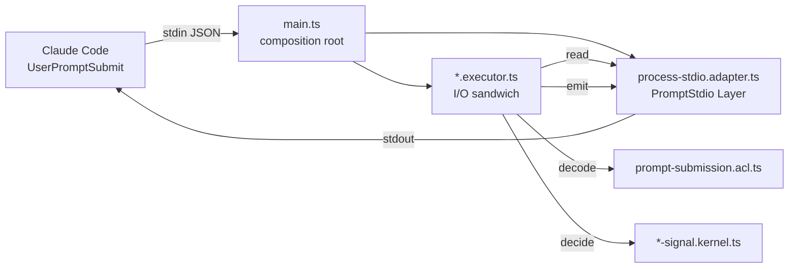

## Goal Capsule

- Objective: the two `UserPromptSubmit` hooks vendored in `.repos/WireBlast/.claude/` — correction capture and the frustration/"you diverged" guard — ship from this monorepo as a single installable Claude Code plugin whose hook entrypoints are tsdown-built ESM, with the stdin→stdout sandwich and the full detection table exercised by Gherkin composition tests.
- Authority: `repos/constitution/CONSTITUTION.md` > root `AGENTS.md` > `omp/AGENTS.md` (cell taxonomy) > the `skill://architect-*` cell skills > this plan. Where a cell skill and this plan disagree, the skill wins.
- Execution profile: one new workspace package `packages/claude-correction-plugin`, private (never published to npm; distributed as a Claude Code plugin directory). No edits under `.repos/` or `repos/` — both are read-only vendored trees.
- Stop conditions: stop and ask if satisfying a cell-lint rule would require inventing an `S.TaggedError` that no real input constructs (`workflow-schema-required` forbids exactly that), or if `pnpm check` fails for a reason outside this package that pre-existed on `main`.
- Tail ownership: the executor owns implementation, `pnpm check`, and a real end-to-end smoke run of both built hook scripts against sample stdin. It does not own publishing, marketplace registration, or installing the plugin into the user's Claude Code.

---

## Product Contract

### Summary

Add `packages/claude-correction-plugin`: a Claude Code plugin (`.claude-plugin/plugin.json` + `hooks/hooks.json`) declaring two `UserPromptSubmit` command hooks. Each hook is a tsdown-built ESM entrypoint that reads the hook payload from stdin, decodes it through a Schema ACL, runs a pure detector, and writes an intervention notice to stdout when the user's prompt reads as a correction (hook 1) or as frustration/competence challenge (hook 2). Silence is the default: no match, no output, exit 0.

### Problem Frame

The two hooks exist only inside `.repos/WireBlast/.claude/hooks/`, a vendored scratch checkout. They are Bun-shebang scripts wired through that repo's `.claude/settings.json`, so they are bound to one project and one runtime, and they carry two defects:

- `frustration-guard.ts` calls `JSON.parse(raw)` with no guard, so malformed stdin throws and the hook exits non-zero. `correction-capture.ts` catches and coerces to an empty prompt. The two hooks disagree on the same input.
- Detection logic, hook I/O, and the notice text sit in one file each, so the only reachable test is on the extracted `correctionSignal` helper; `detectFrustration` — the larger and more error-prone of the two — has no test at all.

### Requirements

**Packaging**

- R1. `packages/claude-correction-plugin/.claude-plugin/plugin.json` declares the plugin with a kebab-case `name`, `version`, `description`, `author`, and `license`.
- R2. `packages/claude-correction-plugin/hooks/hooks.json` uses the plugin wrapper format (`{ "hooks": { "UserPromptSubmit": [...] } }`) and registers both hooks in one matcher group. `UserPromptSubmit` has no matcher support, so no `matcher` key is written.
- R3. Each hook handler uses exec form — `"command": "node"` with `"args": ["${CLAUDE_PLUGIN_ROOT}/dist/<name>.js"]` — so the path placeholder is passed as one argument with no shell quoting.
- R4. `tsdown` builds both entrypoints to `dist/correction-capture.js` and `dist/frustration-guard.js` as ESM, from `tsconfig.build.json`.

**Behavior parity with the WireBlast originals**

- R5. Correction capture emits its notice when the prompt matches any correction pattern, and stays silent otherwise. The pattern set is carried over verbatim from `.repos/WireBlast/.claude/lib/correction.ts`.
- R6. Frustration guard scores the prompt with the weighted category model carried over verbatim from `.repos/WireBlast/.claude/hooks/frustration-guard.ts`: structural categories weight 2 and count once; keyword categories weight 1 and stack per matched pattern; an ALL-CAPS word of 3+ characters adds +1 to each matched keyword category; quoted spans, fenced and inline code, and `<--` arrow annotations are stripped before matching; the notice fires at score >= 2.
- R7. A blank prompt never fires either hook.
- R8. The emitted notice text is the WireBlast text, unchanged.

**Robustness (fixes the vendored defects)**

- R9. Malformed or non-JSON stdin never crashes a hook and never blocks the prompt: both hooks emit nothing and exit 0. This unifies the two hooks' divergent behavior on the same input.
- R10. A payload whose `prompt` field is absent or not a string decodes to an empty prompt and therefore stays silent.

**Verification**

- R11. The detection tables are covered by row-per-pattern `scenarioOutline` cases inside the composition suites — one corrective phrase per correction regex, one outburst per weight-2 frustration category, and the weight-1 stacking, caps-boost, and quoted-span suppression rules. No property test ships: see KTD8.
- R12. Each hook's stdin→stdout sandwich has a `__tests__/*.integration.test.ts` Gherkin feature built with `makeFeature` from `@systemfsoftware/effect-gherkin-spec`, covering: detected prompt emits the notice, silent prompt emits nothing, malformed stdin emits nothing.
- R13. `pnpm check` exits 0 from the repo root after the last edit.

### Scope Boundaries

- Out: deleting or editing anything under `.repos/WireBlast` — it is a vendored scratch clone, read-only under REPO-S3's spirit and not part of this workspace's git tree.
- Out: porting any of WireBlast's other 30+ hooks. Only the two named hooks move.
- Out: publishing to npm or to a Claude Code marketplace. The package is `private: true`.
- Out: a `SessionStart` or memory-persistence hook. The notices instruct the agent to persist; the plugin does not persist anything itself.
- Out: prompt-type (LLM) hooks. Both hooks stay deterministic command hooks.

---

## Planning Contract

### Key Technical Decisions

- KTD1. **Detectors are `*.kernel.ts`, not `*.workflow.ts`.** Both detections are total: prompt in, notice-or-silence out, with no failure mode. `workflow-schema-required` requires an exported `Either.Either<Decision, Error>` backed by a declared `S.TaggedError`, and its own fix text says "if the decision is total, relocate the file out of `*.workflow.ts` — a bare union is not a workflow; do not invent an `S.TaggedError` to satisfy this rule". Kernel is the repo's cell for pure behavior with no error channel, and `kernel-no-junk-drawer-name` is satisfied by naming each file for its detector. Kernel is also a `PROPERTY_CELLS` member, which permits a colocated property test but does not require one — KTD8 records why none ships. Declared bypass (Constitution V.6): `skill://architect-kernel` describes kernels as vocabulary-free and domain-blind; these two carry domain vocabulary. No lint rule encodes domain-blindness, and every alternative either invents an error variant the rule forbids or hides regex behavior in a declaration file (Constitution III.4).
- KTD2. **Two executors, not one parameterised executor.** `.integration.test.ts` may not import `.kernel`, so a single executor taking the detector as a parameter would leave the composition test unable to supply the real detector without an observer shim. Two self-contained executors let each Gherkin feature import exactly one executor and exercise the real detector. The duplicated sandwich is ~8 lines and matches the repo's own precedent (`omp/plugins/omp-claude-compat/src/internal/run-*-hooks.executor.ts`).
- KTD3. **stdin/stdout is a driven adapter behind a port.** `process-stdio.adapter.ts` owns the single external system (the Node process's standard streams) and exports one Layer. Each executor's `<Executor>Deps` Tag borrows the port's method types by indexed access, as `executor-deps-borrowed-types` requires. Composition tests bind an in-memory Layer to the same Deps Tag.
- KTD4. **Fail-open lives in the executor, not the composition root.** The ACL surfaces a `ParseError` for malformed stdin; the executor maps it to silence with `Effect.orElseSucceed`. Putting it in `main.ts` would make R9 untestable, because `main.ts` runs on import.
- KTD5. **Foreign payload and domain type are declared inside the ACL.** The canonical in-repo ACL (`omp/plugins/omp-claude-compat/src/hook-output.acl.ts`) declares both inline. A separate `.shape.ts` plus `.schema.ts` for a 20-line boundary buys two files and no reader.
- KTD6. **Plain-text stdout, not `hookSpecificOutput.additionalContext`.** Both are documented context-injection paths for `UserPromptSubmit`. Plain stdout preserves the WireBlast behavior exactly (R8) and keeps the emit port a `string => Effect<void>`.
- KTD7. **`node` runs the hooks, not `bun`.** The originals carry `#!/usr/bin/env bun`. The monorepo's own tooling runs on `node`, tsdown emits portable ESM, and the docs' exec-form guidance names the `node` plus script-path pattern as the cross-platform one.
- KTD8. **No property test ships for either detector.** A first pass wrote one per kernel and both were deleted rather than kept: their generators were `fc.constantFrom` over a hand-picked list of phrases, which is `architect-property-tests` PT9 — an enumerated sample of an open domain, scenario testing wearing a generator — and their two strongest-looking invariants (`≡SameNotice`, casing-equivalence) both survive a constant-returning implementation, which is PT4. A detector that is a table of regexes has no universal invariant that is not either a restatement of the table or a tautology, so the honest layer is example coverage: one composition row per pattern, where enumeration is the point rather than a disguise. USER-V5's deletion test was run for real — dropping `THRESHOLD` from 2 to 3 and removing one correction regex turned 29 of the 46 cases red, and the removed regex was killed by exactly the one outline row that depends on it.

### High-Level Technical Design



The sandwich in each executor is read (impure) → decode (pure) → detect (pure) → emit (impure), with no I/O between the pure steps (Constitution II.3).

### Files

```
packages/claude-correction-plugin/
├── .claude-plugin/plugin.json
├── hooks/hooks.json
├── README.md
├── package.json
├── oxlint.config.ts
├── tsconfig.json
├── tsconfig.build.json
├── tsconfig.node.json
├── tsdown.config.ts
├── vitest.config.ts
├── src/
│   ├── prompt-submission.acl.ts
│   ├── correction-signal.kernel.ts
│   ├── frustration-signal.kernel.ts
│   ├── process-stdio.adapter.ts
│   ├── capture-correction.executor.ts
│   ├── guard-frustration.executor.ts
│   ├── correction-capture/main.ts
│   └── frustration-guard/main.ts
└── __tests__/
    ├── correction-capture.integration.test.ts
    └── guard-frustration.integration.test.ts
```

### Implementation Constraints

- Every `src/**/*.ts` that is not `index.ts`/`main.ts`/`mod.ts` must be named `<name>.<cell>.ts` from the `CELLS` allowlist (`packages/oxlint-plugins/cell-taxonomy/src/rules/cell-suffix-required.config.ts:4-20`).
- Under `src/`, the only sanctioned test file is `*.property.test.ts` on a `workflow|policy|schema|kernel` stem — none ships here (KTD8). Outside `src/`, the only sanctioned suffix is `*.integration.test.ts`, it must live in `__tests__/`, and it must be a `makeFeature` Gherkin suite that imports no runner from `vitest`/`@effect/vitest`.
- `.kernel.ts` may not import `.schema`, `.acl`, or any Node runtime module — detectors take and return plain strings.
- `.executor.ts` may import `.adapter` type-only; the Layer binding happens in `main.ts`.
- The package must ship `oxlint.config.ts` containing the literal `@systemfsoftware/oxlint-config` and declare it as a devDependency, or `pnpm check:lint-coverage` fails.
- `tsconfig.node.json` must extend exactly `@systemfsoftware/tsconfig/node` and compile, or `pnpm check:project-references` fails.
- `private: true` makes `check-exports`, `check-runtime-deps`, and `validate-publish-config` skip the package; no `stryker.config.json` means `check:mutate-scope` passes trivially.

---

## Implementation Units

- U1. **Package scaffold.** Create `package.json` (private, name `@systemfsoftware/claude-correction-plugin`, scripts `build`/`clean`/`typecheck`/`test`/`lint`), `tsconfig.json`, `tsconfig.build.json`, `tsconfig.node.json`, `tsdown.config.ts` (two entries), `vitest.config.ts`, `oxlint.config.ts`. Files: as listed. Verification: `pnpm install`, then `pnpm --filter @systemfsoftware/claude-correction-plugin typecheck` runs (may fail on missing src until U2). Dependencies: none.
- U2. **Boundary cell.** `src/prompt-submission.acl.ts`: `S.transformOrFail(S.String, SubmittedPrompt)`, `strict: true`, decode parses JSON and decodes the foreign `UserPromptSubmit` payload (`prompt` optional string, defaulted to empty), encode returns `ParseResult.Forbidden`. Exports one transform plus the domain type. Test scenarios: covered through U5's features (an ACL takes no test of its own). Dependencies: U1.
- U3. **Correction detector.** `src/correction-signal.kernel.ts`: the nine correction regexes verbatim from `.repos/WireBlast/.claude/lib/correction.ts:1-11`, plus the notice text from `correction-capture.ts:19-29`. Exports one total function `string => Option.Option<string>`. No colocated test (KTD8). Coverage lands in U5 as one outline row per regex plus four ordinary requests that must stay silent, and one scenario asserting the notice byte-for-byte. Dependencies: U1.
- U4. **Frustration detector.** `src/frustration-signal.kernel.ts`: the structural and keyword category tables, the quoted-span stripping, the caps-shout test, the weighting rule, and `THRESHOLD = 2`, all verbatim from `.repos/WireBlast/.claude/hooks/frustration-guard.ts:21-215`, plus the intervention template from lines 241-256. Exports one total function `string => Option.Option<string>`. No colocated test (KTD8). Coverage lands in U5: one outline row per weight-2 category fires alone; each weight-1 grumble alone stays silent; the same grumble plus a shouted word fires; two grumbles in one message fire; a trigger inside a fenced block, inline code, single quotes, double quotes, or after a `<--` arrow stays silent; and one scenario asserts the intervention byte-for-byte. Dependencies: U1.
- U5. **Sandwich and entrypoints.** `src/process-stdio.adapter.ts` (one `PromptStdio` Tag + one Layer over `process.stdin`/`process.stdout`), `src/capture-correction.executor.ts` and `src/guard-frustration.executor.ts` (one operation and one `<Executor>Deps` Tag each, borrowing the port's method types), `src/correction-capture/main.ts` and `src/frustration-guard/main.ts` (Layer binding plus run). Files: as listed. Test scenarios: in `__tests__/correction-capture.integration.test.ts` and `__tests__/guard-frustration.integration.test.ts`, each as a `makeFeature` Gherkin suite over an in-memory `PromptStdio` — a payload whose prompt trips the detector writes exactly the notice to stdout; a payload whose prompt does not trip it writes nothing; non-JSON stdin writes nothing and does not fail. Dependencies: U2, U3, U4.
- U6. **Plugin manifest and docs.** `.claude-plugin/plugin.json`, `hooks/hooks.json`, `README.md` documenting installation with `claude --plugin-dir` and the build step. Verification: `node -e` JSON parse of both manifests plus a real stdin smoke run of both built scripts. Dependencies: U5.

---

## Verification Contract

- `pnpm --filter @systemfsoftware/claude-correction-plugin test` — both Gherkin suites green (46 cases).
- `pnpm --filter @systemfsoftware/claude-correction-plugin build` — both entrypoints emitted to `dist/`.
- Smoke, run from the repo root after the build, both must print the notice on a tripping prompt, print nothing on a neutral prompt, and exit 0 on garbage:
  ```
  echo '{"hook_event_name":"UserPromptSubmit","prompt":"fix it, that is wrong"}' | node packages/claude-correction-plugin/dist/correction-capture.js
  echo '{"hook_event_name":"UserPromptSubmit","prompt":"you are wrong"}'        | node packages/claude-correction-plugin/dist/frustration-guard.js
  echo 'not json'                                                               | node packages/claude-correction-plugin/dist/frustration-guard.js
  ```
- `pnpm check` from the repo root — the full gate (REPO-A1: run it whole, no filters).

No `stryker.config.json` ships with this package: REPO-S5 restricts mutation scope to pure decisions, both kernels are driven end to end by the composition suites, and every shell cell is gated by lint provenance plus those same suites. The kill check was run by hand instead — see KTD8.

---

## Definition of Done

- Every requirement R1-R13 is satisfied and traceable to a file in the package.
- Both hook scripts run from `dist/` against real stdin and behave as the smoke block specifies.
- `pnpm check` exits 0 from this session after the last edit.
- No file under `.repos/` or `repos/` is modified.
- No dead-end or experimental code remains in the diff; the package contains only the files this plan lists.
