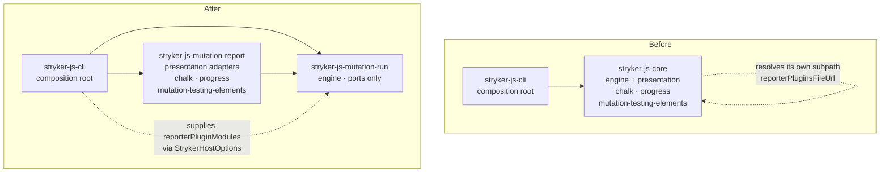
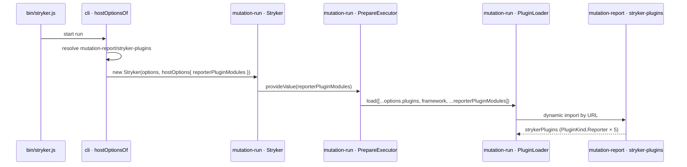
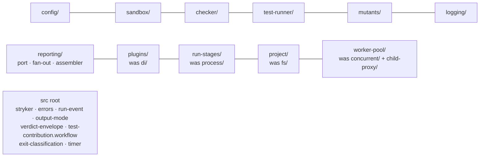

# refactor: Capability-named Stryker packages and a rule that keeps them that way

**Product Contract preservation:** no upstream Product Contract existed. Every plan in `docs/plans/` that carries `artifact_contract` is already `implementation-ready`; none is `requirements-only`. This plan is authored fresh with `product_contract_source: ce-plan-bootstrap`.

---

## Summary

`packages/stryker-js/core` is named for a layer, not a capability. Its `src/` tree repeats the error five more times (`utils/`, `di/`, `process/`, `fs/`, `concurrent/`), and its `reporters/` directory holds four unrelated actors, one of which drags a browser bundle and a terminal-colour library into an engine that a machine-only CI consumer never renders with.

None of that is an accident, and none of it is caught: the constitutional naming rule declares `gate: lint`, and **no lint rule in this repository keys on a directory name**. The one plugin that governs naming (`cell-suffix-required`) checks file suffixes only, and this package is exempt from the shared lint config entirely.

So the refactor has two halves, and shipping only the first would be theatre:

1. **Move the structure** — rename the package for the capability it owns, extract the presentation adapters into their own published package bound at the composition root, and give every remaining directory a name that answers "of what?".
2. **Ship the observer** — author a published oxlint rule that fails on layer-named and junk-drawer directory segments, so the next file cannot land in `utils/` again.

Nine units. The engine becomes `@systemfsoftware/stryker-js-mutation-run`; the adapters become `@systemfsoftware/stryker-js-mutation-report`; `packages/stryker-js/cli` binds them together and remains the only composition root.

---

## Problem Frame

### What is wrong

**P1 — The package is named for a layer.** `core` is the canonical banned layer name. The constitution's organization article names it directly in its prohibition list, and the corpus carries the same ruling at **axiom** band (its strongest, sourced to that constitutional article) plus a **convention**-band atom that enumerates `core` in the junk-drawer ban list. Nothing about the fork's provenance changes this: the repository's own root instructions say a fork under `packages/` is ours, and that "upstream" is never a reason to preserve a diff nobody will merge.

**P2 — The error repeats inside `src/`.** Ten of the package's thirteen top-level source directories were inherited; five of them fail the same test:

| Directory                      | Files | What a reader must already know to find it            | Harm                                                       |
| ------------------------------ | ----- | ----------------------------------------------------- | ---------------------------------------------------------- |
| `utils/`                       | 10    | nothing — it is the drawer you check last             | Named in the constitution's own prohibition list           |
| `di/`                          | 4     | that the plugin loader is a wiring concern            | A reader hunting "how plugins load" never looks here       |
| `process/`                     | 5     | that "process" means run-stage, not OS process        | Actively misleading — OS processes live in `child-proxy/`  |
| `fs/`                          | 5     | that `Project`/`ProjectReader` are filesystem types   | A reader hunting "the project under test" never looks here |
| `concurrent/` + `child-proxy/` | 4 + 6 | that pooling and child-process hosting are two topics | One actor split across two directories                     |

**P3 — `reporters/` holds four actors.** Verified by reading every import in all 17 files:

| Actor                   | Files                                                                                                                                                                                                                             | Direction                                         |
| ----------------------- | --------------------------------------------------------------------------------------------------------------------------------------------------------------------------------------------------------------------------------- | ------------------------------------------------- |
| Presentation adapters   | `clear-text-reporter`, `clear-text-score-table`, `progress-reporter`, `progress-bar`, `progress-keeper`, `progress-stream-reporter`, `html-reporter`, `json-reporter`, `reporter-util`, `report-type`, `index`, `stryker-plugins` | Outbound — leaves                                 |
| Outbound port + fan-out | `broadcast-reporter`, `strict-reporter`, `mutation-test-report-helper`                                                                                                                                                            | The engine's own — stays                          |
| Run-output contract     | `verdict-envelope`                                                                                                                                                                                                                | A declaration — stays                             |
| Evaluator               | `test-contribution`                                                                                                                                                                                                               | A pure decision, the sole mutation target — stays |

**P4 — The engine names its own presentation registry.** `src/reporters/index.ts:35` computes `reporterPluginsFileUrl` by resolving a published subpath **of itself**, and `src/process/1-prepare-executor.ts:75` splices that constant into the plugin descriptor list. While presentation lives inside the engine this is merely a circularity of naming; the moment it moves out, that line becomes an outward import — the exact edge the dependency-direction ruling forbids at **canon** band (three independent captured sources: coupling points toward the centre, the centre cannot call the shell, the import graph is acyclic).

**P5 — Presentation dependencies are billed to the engine.** Verified import sites:

| Dependency                  | Sites                                                                                                                                                               | Can the engine drop it?                                 |
| --------------------------- | ------------------------------------------------------------------------------------------------------------------------------------------------------------------- | ------------------------------------------------------- |
| `progress`                  | `reporters/progress-bar.ts:1`                                                                                                                                       | **Yes** — one site, all presentation                    |
| `mutation-testing-elements` | `reporters/html-reporter.ts:50` (`require.resolve` of a browser bundle)                                                                                             | **Yes** — one site, all presentation                    |
| `chalk`                     | `reporters/clear-text-reporter.ts:7`, `reporters/clear-text-score-table.ts:7`, **`mutants/diff-statistics-collector.ts:1`**, **`mutants/incremental-differ.ts:16`** | **Only after** the two engine log sites are de-coloured |
| `mutation-testing-metrics`  | 5 sites, of which `reporters/verdict-envelope.ts` and `reporters/mutation-test-report-helper.ts` **stay**                                                           | **No** — the engine keeps it                            |

> **Correction to the verdict that preceded this plan.** That verdict claimed four dependencies "exist solely to serve presentation". Two of those four are wrong: `chalk` has two engine sites in `mutants/`, and `mutation-testing-metrics` is called at runtime by two files that stay. The honest number is **three droppable, one retained**, and one of the three is conditional on a behaviour change (U5).

**P6 — There is no observer.** `cell-suffix-required` (`packages/oxlint-plugins/cell-taxonomy/src/rules/cell-suffix-required.ts:36-73`) inspects the _basename_ only; directory segments are used solely to skip test directories. No other rule in `packages/oxlint-plugins/**` keys on a directory name. Meanwhile `scripts/check-lint-coverage.mjs:58-61` exempts this package from the shared config wholesale, and its `oxlint.config.ts` is a bare baseline. Every rename in this plan is therefore unenforced the day after it lands.

### Why moving reporting into the CLI is ruled out

Four engine modules import `reporters/` today: `process/1-prepare-executor.ts:14`, `process/3-dry-run-executor.ts`, `process/4-mutation-test-executor.ts`, `mutants/mutant-test-planner.ts`. The CLI already depends on the engine. Hosting reporting in the CLI would make the engine import its own consumer — a cycle, condemned at **canon** band. The presentation package must therefore be a _sibling_ the composition root binds, not the CLI itself.

### What is not wrong

The words `core` and `shell` remain live doctrine as **behavioural regimes** (pure decision versus imperative shell) at axiom band. The prohibition is on `core` as a _package or directory name_. This plan renames directories; it does not retire the vocabulary.

---

## Requirements

| ID | Requirement                                                                                                          | Verified by                                                                                                                                                               |
| -- | -------------------------------------------------------------------------------------------------------------------- | ------------------------------------------------------------------------------------------------------------------------------------------------------------------------- |
| R1 | No package directory or `src/` subdirectory in the Stryker fork is named for a layer, a mechanism, or a junk drawer  | U9's rule reports zero violations across `packages/stryker-js/**`                                                                                                         |
| R2 | The mutation engine's manifest declares neither `chalk`, `progress`, nor `mutation-testing-elements`                 | `pnpm check:runtime-deps` green with those three absent from the engine manifest                                                                                          |
| R3 | The engine names no presentation package — no import, and no resolved specifier                                      | `grep` for `mutation-report` across the engine's `src/` returns nothing                                                                                                   |
| R4 | Presentation reporters reach a run only because the composition root supplied them                                   | A run driven by `bin/stryker.js` still emits clear-text and progress output                                                                                               |
| R5 | The naming rule ships inside a published artifact, not a repo-local script, and fails a command                      | The rule's own RuleTester suite has a failing fixture; `pnpm lint` fails on a planted violation                                                                           |
| R6 | Every gate in `pnpm check` passes, and no gate, threshold, or glob is weakened to get there                          | `pnpm check` exits 0; the diff adds no exemption covering a package this plan touches                                                                                     |
| R7 | The published surface stays coherent — exports generated by tsdown, api report regenerated, publish metadata correct | `pnpm check:exports`, `pnpm api:check`, `pnpm check:publish-config` green                                                                                                 |
| R8 | The mutation gate keeps a real target after the evaluator moves                                                      | `pnpm --filter <engine> mutation` reports 100% **and** a mutant count greater than zero read from `reports/mutation-report.json` — a score over an empty set is a failure |

---

## Key Technical Decisions

### KTD1 — The engine is `mutation-run`; the adapters are `mutation-report`

The capability test asks what the unit owns, phrased so the name answers "of what?". The engine performs a mutation test run: it resolves config, instruments mutants, plans coverage, sandboxes and executes runners and checkers, and assembles the result. The adapter package renders that run for a consumer — terminal, HTML file, JSON file, NDJSON stream. `mutation-run` and `mutation-report` are the two halves of one sentence, and both survive the "of what?" test unaided.

The corpus was searched for a ruling that would reject these names — `engine`, `runtime`, `mutation` — and returned a **genuine nil**: the only occurrences are the mutation-testing gate concept and unrelated agent-harness senses. No band forbids them; they must merely pass the generic capability test, which they do.

Rejected: `mutation-testing` (the CLI does mutation testing too, and it collides with the npm packages `mutation-testing-metrics` / `mutation-testing-elements`); `engine` (answers "of what?" only with context).

### KTD2 — The plugin registry is host-supplied, not engine-resolved

`StrykerHostOptions` already exists as "what the host resolved for this run", and `src/stryker.ts:73-90` already `provideValue`s each of its seven fields into the root injector, from which `PrepareExecutor` is constructed. Adding an eighth field is the smallest change that severs P4:

- Delete `reporterPluginsFileUrl` and `strykerPlugins` from the engine.
- `StrykerHostOptions` gains `reporterPluginModules: readonly string[]`.
- `1-prepare-executor` splices that value where the constant was.
- `packages/stryker-js/cli/src/stryker-cli.executor.ts` (`hostOptionsOf`) resolves the presentation package's `stryker-plugins` subpath and supplies it.

This is precisely the composition-root binding the corpus requires: an adapter is bound only at the runtime cell, never imported by a domain cell, and a port is public exactly when a consumer binds it. The CLI binds it, so it is public.

Rejected: leaving the constant and adding the presentation package as an engine dependency (recreates the forbidden edge); a plugin auto-discovery scan (invents machinery no requirement asks for).

### KTD3 — The gate is authored first, registered last

The naming rule cannot be enabled before the tree complies without leaving `pnpm check` red across several commits, and it cannot be enabled _after_ without ever having been observed red — which would make it a gate that has never executed.

Both are satisfied by splitting authorship from registration. **U1** authors the rule with RuleTester fixtures, including invalid cases that fail on `utils/`, `di/`, `fs/`, `concurrent/`, and `core` segments — the repository's stated pattern of putting the failing fixture in the owning package's own suite. U1 also records a one-off manual run of the rule against the _pre-rename_ tree as the red-before evidence. **U9** enables it in `packages/oxlint-config/src/oxlint-config.base.ts` and in the engine's own `oxlint.config.ts`, by which point the tree is compliant and the gate goes green for the right reason. Every commit stays green.

### KTD4 — The rule lives in the cell-taxonomy plugin

Enforcement for a concern we publish must ship inside the published artifact, never as a `scripts/*.mjs` gate — a consumer installs packages, not this repository. `@systemfsoftware/oxlint-plugin-cell-taxonomy` already owns naming taxonomy and already ships `cell-suffix-required`. A directory-name rule is the same axis. Adding a second rule there beats a new plugin package (no new manifest, no new registration) and beats a script (which would bind one clone).

### KTD5 — The engine is enrolled for the naming rule only, not for the shared config

`packages/oxlint-config/src/oxlint-config.base.ts` sets `ban-classes: error`, `no-new-promise-in-effect`, and the rest of the Effect-idiom family. The Stryker fork is class-based throughout; enrolling it wholesale would demand either a long disable list (weakening) or an Effect rewrite (a different project). The exemption's stated reason — that cell rules are the wrong observer — holds for _those_ rules and does not extend to naming.

So the engine's `oxlint.config.ts` loads the cell-taxonomy plugin directly and enables `capability-named-directory` alone. `scripts/check-lint-coverage.mjs` still classifies it as tooling, but its reason string is corrected to record that the package now carries the naming rule directly. That is a strengthening edit, not a weakening one.

### KTD6 — `test-contribution` becomes a workflow cell so the mutation gate stops naming one file

The engine's `stryker.config.json` pins `mutate: ["src/reporters/test-contribution.ts"]`. A hardcoded filename means a new pure decision added tomorrow is silently unmutated while the score reads 100% — the score certifies nothing. The file is a pure decision (`judgeTestContribution`: input to verdict, no I/O), so renaming it `test-contribution.workflow.ts` and setting `mutate: ["src/**/*.workflow.ts"]` makes the glob auto-enrol every future decision. `scripts/guard-mutate-scope.mjs`'s forbidden list is cell suffixes for _shell_ cells; `workflow` is the one suffix it explicitly permits.

### KTD7 — Two subpaths become public because the split requires them

The presentation package injects `coreTokens` and constructs a `Timer`, both currently internal (`src/di/index.js`, `src/utils/timer.js`) and reachable only by relative import. After the split they must cross a package boundary, so the engine publishes them as new tsdown entries. `verdict-envelope` and `run-event` are already published subpaths and need only their paths updated.

---

## High-Level Technical Design

### Package graph



The `After` graph is acyclic and every edge points inward. The dotted edge carries a _string_ the host resolved — the engine never names the package that string refers to.

### Registry binding sequence



### Engine `src/` after the move



`utils/` is gone; ten directories become ten capability names plus a root that holds the package's declarations and single-file concerns.

---

## Output Structure

```text
packages/stryker-js/
├── cli/                          # unchanged name; gains a dependency and a host-options field
├── mutation-run/                 # was core/
│   ├── src/
│   │   ├── config/  sandbox/  checker/  test-runner/  mutants/  logging/
│   │   ├── reporting/            # broadcast-reporter, strict-reporter, mutation-test-report-helper, index
│   │   ├── plugins/              # was di/ — plugin-loader, plugin-creator, injection-tokens
│   │   ├── run-stages/           # was process/ — the four ordered executors
│   │   ├── project/              # was fs/ — project, project-file, project-reader, file-system
│   │   ├── worker-pool/          # was concurrent/ + child-proxy/ + the framing helpers from utils/
│   │   ├── index.ts  stryker.ts  errors.ts  run-event.ts  output-mode.ts
│   │   ├── verdict-envelope.ts   test-contribution.workflow.ts
│   │   └── exit-classification.ts  timer.ts  unexpected-exit-handler.ts
│   ├── AGENTS.md  README.md  oxlint.config.ts  stryker.config.json
│   ├── tsdown.config.ts  api-extractor.json  etc/  package.json
│   └── vitest.config.ts  vitest.stryker.config.ts  tsconfig.json
└── mutation-report/              # NEW
    ├── src/
    │   ├── clear-text-reporter.ts  clear-text-score-table.ts
    │   ├── progress-reporter.ts  progress-bar.ts  progress-keeper.ts
    │   ├── progress-stream-reporter.ts
    │   ├── html-reporter.ts  json-reporter.ts
    │   ├── reporter-util.ts  report-type.ts  render-text.ts
    │   ├── index.ts              # the plugin registry
    │   └── stryker-plugins.ts    # the enumerated entry the loader imports by URL
    ├── AGENTS.md  README.md  oxlint.config.ts
    ├── tsdown.config.ts  api-extractor.json  etc/  package.json
    └── vitest.config.ts  tsconfig.json
```

The per-unit **Files** lists remain authoritative; this tree is the scope declaration.

---

## Implementation Units

### Phase A — Author the observer

#### U1. Author `capability-named-directory` in the cell-taxonomy plugin

**Goal** — A published oxlint rule that reports any path whose directory segments include a layer name, a mechanism name, or a junk drawer, with a documented `exempt` escape for packages outside this plan's reach.

**Requirements** — R5. Groundwork for R1.

**Dependencies** — none.

**Files**

- `packages/oxlint-plugins/cell-taxonomy/src/rules/capability-named-directory.ts` (create)
- `packages/oxlint-plugins/cell-taxonomy/src/rules/capability-named-directory.config.ts` (create)
- `packages/oxlint-plugins/cell-taxonomy/src/rules/__tests__/capability-named-directory.test.ts` (create)
- `packages/oxlint-plugins/cell-taxonomy/src/index.ts` (modify — register the rule)
- `packages/oxlint-plugins/cell-taxonomy/etc/*.api.md` (regenerate)

**Approach** — Mirror `cell-suffix-required`'s shape exactly: `defineRule` from `@oxlint/plugins`, options decoded through an Effect `Schema.Struct`, message ids and constants in a sibling `.config.ts`, report on `Program` so one violation is reported per file. Split `context.filename` on `/`, drop the basename, and test the remaining segments against a banned set. Seed the banned set from the constitution's own prohibition — layer names (`core`, `shell`), junk drawers (`util`, `utils`, `service`, `services`, `manager`, `managers`, `helper`, `helpers`, `common`, `shared`, `misc`, `lib`) and mechanism names (`di`, `fs`, `impl`).

**Scope the rule to product structure.** Skip any path carrying a test-root segment — `__tests__`, `test`, `tests`, `__mocks__`, `testResources`, `fixtures` — alongside `node_modules`, `dist`, `.stryker-tmp`, and `repos/`. This is a scope decision, not an escape hatch, and it is load-bearing: `packages/effect-daemon-spec/__tests__/helpers/` holds five files and that package extends the shared base config at `packages/effect-daemon-spec/oxlint.config.ts:5`, so a rule that reached into test subtrees would turn `pnpm lint` red in a package this plan never touches. The harm the naming doctrine names — a file no one can locate — does not occur there: a test helper is reached from the test that imports it, not by navigating the product tree. `packages/stryker-plugins/__tests__/helpers/` is the same shape.

Carry an `exempt` array of repo-relative directory prefixes for genuine debt, each requiring a reason string in the config so an undocumented exemption is itself a defect.

Do **not** register the rule anywhere in this unit (KTD3).

**Patterns to follow** — `packages/oxlint-plugins/cell-taxonomy/src/rules/cell-suffix-required.ts` for rule shape and options decoding; `packages/oxlint-plugins/cell-taxonomy/src/rules/__tests__/_tester.ts` for the RuleTester harness.

**Execution note** — Write the invalid fixtures first: they are the red-before evidence this plan depends on, and a rule authored against its own fixtures cannot be written to pass vacuously.

**Test scenarios**

- Invalid: `packages/stryker-js/core/src/index.ts` reports once, naming `core`.
- Invalid: `packages/x/src/utils/string-utils.ts` reports once, naming `utils`.
- Invalid: `packages/x/src/di/plugin-loader.ts` reports once, naming `di`.
- Invalid: `packages/x/src/fs/project.ts` reports once, naming `fs`.
- Invalid: a path with two banned segments reports once, not twice — the report is per file.
- Valid: `packages/stryker-js/mutation-run/src/reporting/broadcast-reporter.ts` reports nothing.
- Valid: `packages/x/src/sandbox/sandbox.ts` reports nothing — `sandbox` is a domain noun.
- Valid: a banned segment under an `exempt` prefix reports nothing.
- Valid: `node_modules/pkg/src/utils/x.ts` and `repos/vendor/src/utils/x.ts` report nothing.
- Valid: `packages/effect-daemon-spec/__tests__/helpers/test-utils.ts` and `packages/x/test/unit/thing.spec.ts` report nothing — test roots are out of scope.
- Invalid: one fixture per word in the declared banned set, so a rule authored with a narrower set fails its own suite. U9's planted probe exercises `utils` only; this suite is what proves the rest.
- Valid: a banned word as a _basename_ (`src/reporting/core.ts`) reports nothing — this rule governs directories; suffixes are `cell-suffix-required`'s job.
- Edge: a file directly under `src/` with no intermediate directory reports nothing.

**Verification** — The plugin's own suite passes with every invalid fixture failing for the stated reason. Separately, run the rule once by hand against the current unrenamed tree and record the violation list; that recording is the gate's red-before evidence and is referenced by U9.

---

### Phase B — Rename the engine package

#### U2. Rename `core` to `mutation-run` across the workspace

**Goal** — `packages/stryker-js/core` becomes `packages/stryker-js/mutation-run` and `@systemfsoftware/stryker-js-core` becomes `@systemfsoftware/stryker-js-mutation-run`, with every consumer edge moved in the same commit.

**Requirements** — R1 (package level), R7.

**Dependencies** — none. Ordered before U3 so the Evaluator edit has something to bless.

**Files**

- `packages/stryker-js/core/**` → `packages/stryker-js/mutation-run/**` (move)
- `packages/stryker-js/mutation-run/package.json` (modify — `name`, `repository.directory`, `homepage`)
- `packages/stryker-js/mutation-run/api-extractor.json`, `etc/stryker-js-core.api.md` → `etc/stryker-js-mutation-run.api.md` (rename the report to match the new package)
- `packages/stryker-js/mutation-run/src/reporters/index.ts` (modify — the self-resolved specifier at line 36)
- `packages/stryker-js/mutation-run/stryker.config.json` (modify — the `extends` self-reference)
- 23 consumer manifests: `packages/stryker-js/cli`, `packages/stryker-js/stryker-plugins`, `packages/effect-daemon-spec`, `packages/hex-schema`, all 20 of `packages/oxlint-plugins/*`, `omp/plugins/omp-claude-compat`
- 24 `**/stryker.config.json` files carrying `extends: "@systemfsoftware/stryker-js-core/config/base"`
- `packages/stryker-js/cli/src/*.ts` and `packages/stryker-js/cli/__tests__/*.ts` — 24 import statements across 12 files (9 source, 3 test); `stryker-cli.executor.ts` carries 9 of them and `run-event-stream.adapter.ts` 3
- `scripts/bench-mutation.mjs:36`, `packages/oxlint-plugins/recommended/scripts/guard-no-behavior.mjs:15` (hardcoded name lists)
- `pnpm-lock.yaml` (regenerate via install — never hand-edit)

**Approach** — Move the directory first, then rewrite the manifest, then fan out. The dependency-edge rewrite and the `stryker.config.json` `extends` rewrite must land together: under pnpm's strict layout an `extends` specifier resolves only against the declaring package's own direct dependencies, so a half-applied rename leaves 24 configs unresolvable. Use `lsp rename_file` or `ast_edit` for the CLI's TypeScript import sites rather than text substitution; a text pass over `stryker-js-core` would also hit `packages/oxlint-plugins/core`, which is an unrelated package.

Leave `scripts/check-lint-coverage.mjs` and `scripts/validate-publish-config.mjs` untouched — they are Evaluator surface and belong to U3.

**Patterns to follow** — `docs/plans/2026-07-15-002-stryker-core-ts7-fork-plan.md` established the current layout; `docs/solutions/tooling-decisions/tsdown-manages-publishconfig-during-build.md` governs the manifest: `exports` and `publishConfig.exports` are generated by tsdown and must never be hand-edited.

**Execution note** — This is mostly a mechanical move; prefer a build-and-smoke check (`pnpm --filter @systemfsoftware/stryker-js-mutation-run build` then a real run against `packages/stryker-js/cli/__tests__/fixtures/minimal-project`) over new unit coverage.

**Test scenarios**

- The existing engine suite passes unchanged under the new package name.
- A real run against the minimal fixture exits 0 and prints a mutation score — proving the 24 `extends` chains and the self-resolved plugin URL still resolve after the rename.
- `pnpm install` regenerates the lockfile with 23 `link:../../../packages/stryker-js/mutation-run` entries and no residual `stryker-js/core` link.
- `grep` for `stryker-js-core` across `packages/`, `scripts/`, and `omp/` returns only the two Evaluator scripts U3 owns.
- Every one of the 24 consumer `stryker.config.json` files resolves its `extends` chain. Run the config-resolution path for each (a `--dryRun`-equivalent is enough) rather than trusting the commit boundary: `resolve-extends.ts:115-122` does throw on a bad target, but `mutation` is not part of `pnpm check`, so a missed string would otherwise pass every gate and surface days later.

**Verification** — Engine and CLI build; the minimal-fixture run succeeds; `pnpm check` fails **only** on `check-lint-coverage` and `check-publish-config`, which is the expected red U3 clears.

---

#### U3. Realign the two Evaluator gates to the new name

**Goal** — The lint-coverage classification and the publish-config selftest name the renamed package, restoring `pnpm check` to green.

**Requirements** — R6.

**Dependencies** — U2.

**Files**

- `scripts/check-lint-coverage.mjs` (modify — line 58's `['core', 'typescript-checker', 'vitest-runner']` member and its reason string)
- `scripts/validate-publish-config.mjs` (modify — `PACKAGE_NAME` at line 155, `REL_DIR` at line 156, and the wrong-path fixture)

**Approach** — Change `'core'` to `'mutation-run'` in the tooling map's name list and update the accompanying reason to record what U9 will make true: the package carries the naming rule directly while remaining out of the Effect-idiom rule set. In the publish-config selftest, retarget both constants; the wrong-path fixture keeps pointing at `packages/stryker-js/typescript-checker`, which is still a real, different package and therefore still a valid negative.

**Execution note** — Root instructions classify both files as Evaluator surface: they must not change in the same commit as the work they judge. This unit is that separate commit, and the gate is observed red before it and green after — for the right reason, which is the rename and nothing else.

**Test scenarios**

- Before this unit: `pnpm check:lint-coverage` exits 1 naming `packages/stryker-js/mutation-run` as an uncovered production package.
- After: `pnpm check:lint-coverage` exits 0 and reports one more tooling package than production packages changed.
- Before: `pnpm check:publish-config` selftest exits non-zero because it exercises a package name that no longer exists.
- After: `pnpm check:publish-config` exits 0, and its wrong-path fixture still fails as designed (verify by temporarily corrupting `repository.directory` and confirming the scan rejects it).

**Verification** — `pnpm check` exits 0 on the renamed tree.

---

### Phase C — Cut the presentation edge

#### U4. Replace the engine-resolved registry with a host-supplied one

**Goal** — The engine no longer resolves, names, or exports a reporter registry; the host supplies the module specifiers.

**Requirements** — R3. Prerequisite for R4 and for the extraction in U6.

**Dependencies** — U2.

**Files**

- `packages/stryker-js/mutation-run/src/stryker.ts` (modify — add `reporterPluginModules` to `StrykerHostOptions`; `provideValue` it)
- `packages/stryker-js/mutation-run/src/di/core-tokens.ts` (modify — add the token)
- `packages/stryker-js/mutation-run/src/process/1-prepare-executor.ts` (modify — inject the value, drop the constant import at line 15)
- `packages/stryker-js/mutation-run/src/reporters/index.ts` (modify — delete `reporterPluginsFileUrl`)
- `packages/stryker-js/mutation-run/src/index.ts` (modify — stop re-exporting `reporterPluginsFileUrl`)
- `packages/stryker-js/mutation-run/etc/stryker-js-mutation-run.api.md` (regenerate)
- `packages/stryker-js/cli/src/stryker-cli.executor.ts` (modify — `hostOptionsOf` supplies the specifier)

**Approach** — Keep `strykerPlugins` and the `stryker-plugins.ts` entry in place for now; only the _URL constant_ moves. The CLI temporarily resolves the engine's own subpath, so behaviour is unchanged and the commit is a pure seam change with the presentation files still where they were. U6 retargets the CLI's specifier once the presentation package exists.

**Patterns to follow** — `StrykerHostOptions` at `src/stryker.ts:30-42` already declares eight fields; seven are threaded by the `provideValue` chain at `src/stryker.ts:73-90` and two (`loggerConsoleOut`, `showColors`) go through `provideLoggingBackend` earlier. Add the ninth field the same way, with its `coreTokens` counterpart.

**Execution note** — Start from a failing composition check: assert that a run with an empty `reporterPluginModules` loads zero reporters. That test is what proves the value is actually threaded rather than a constant re-read.

**Test scenarios**

- A run with `reporterPluginModules: []` completes and emits no reporter output — proves the host controls the set.
- A run with the registry specifier supplied emits clear-text output identical to today's.
- Two specifiers are both loaded, and their plugins are merged with `options.plugins` and `options.appendPlugins` in the existing order.
- A specifier that resolves to a module with no `strykerPlugins` export produces the loader's existing diagnostic, not a crash.
- `grep` for `reporterPluginsFileUrl` across the repo returns nothing.

**Verification** — The minimal-fixture run still prints a score; the api report no longer lists `reporterPluginsFileUrl`.

---

#### U5. De-colour engine logging and separate the presentation string helpers

**Goal** — `chalk` has no engine call site, and the three presentation-only string helpers are separated from the framing helpers the worker pool needs.

**Requirements** — R2. Prerequisite for U6's dependency move.

**Dependencies** — U2.

**Files**

- `packages/stryker-js/mutation-run/src/mutants/diff-statistics-collector.ts` (modify — lines 1, 7, 45)
- `packages/stryker-js/mutation-run/src/mutants/incremental-differ.ts` (modify — lines 16, 239)
- `packages/stryker-js/mutation-run/src/utils/string-utils.ts` (modify — remove `getEmojiForStatus`, `plural`, `stringWidth`)
- `packages/stryker-js/mutation-run/src/utils/index.ts` (modify — barrel)
- `packages/stryker-js/mutation-run/src/reporters/render-text.ts` (create — temporary home for the three helpers; moves to the new package in U6)
- `packages/stryker-js/mutation-run/src/reporters/clear-text-reporter.ts`, `clear-text-score-table.ts` (modify — retarget imports)

**Approach** — `DiffChanges.toString()` and `createTotalsReport()` return plain strings; `incremental-differ`'s reuse-count log line drops its `yellowBright` wrapper. These are log messages, not rendered output — the engine states a fact and the presentation layer decides how it looks. Verified that the three moved helpers have no engine consumer: `getEmojiForStatus` and `plural` are used only by `clear-text-reporter`, `stringWidth` only by `clear-text-score-table`. `deserialize`, `serialize`, `padLeft`, and `StringBuilder` stay — `child-proxy/child-process-proxy.ts:12` and `child-process-proxy-worker.ts:10` depend on them.

**Test scenarios**

- `DiffChanges.toString()` returns `+3 -1` for three added and one removed — no escape sequences, asserted on the raw string.
- `createTotalsReport()` names the changed-file count with no escape sequences.
- The incremental-differ reuse log line contains the counts and no escape sequences.
- Clear-text output is byte-identical to today's for a fixture run — the helpers moved, their behaviour did not.
- `grep -c "from 'chalk'"` under the engine's `src/` returns 0.

**Verification** — Engine suite green; a fixture run's clear-text output diffed against a pre-change capture shows no change.

---

#### U6. Extract `@systemfsoftware/stryker-js-mutation-report`

**Goal** — A new published package owns every `PluginKind.Reporter` implementation and the three presentation dependencies; the CLI binds it; the engine's manifest sheds `chalk`, `progress`, and `mutation-testing-elements`.

**Requirements** — R2, R3, R4, R7.

**Dependencies** — U4, U5.

**Files**

- `packages/stryker-js/mutation-report/` (create — full package per Output Structure)
- Moved from the engine: `src/reporters/{clear-text-reporter,clear-text-score-table,progress-reporter,progress-bar,progress-keeper,progress-stream-reporter,html-reporter,json-reporter,reporter-util,report-type,render-text,index,stryker-plugins}.ts`
- `packages/stryker-js/mutation-run/package.json` (modify — drop three dependencies)
- `packages/stryker-js/mutation-run/tsdown.config.ts` (modify — drop the `reporters/stryker-plugins` entry; add entries for the injection tokens and `timer`; set `clean: true`, see below)
- `packages/stryker-js/mutation-run/src/di/index.ts`, `src/utils/timer.ts` (modify — these become published surface)
- `packages/stryker-js/cli/package.json` (modify — add the dependency)
- `packages/stryker-js/cli/src/stryker-cli.executor.ts` (modify — resolve the new package's subpath)
- `packages/stryker-js/cli/src/llms-manifest.kernel.ts:5` (modify — retarget the `strykerPlugins` import)
- `packages/stryker-js/mutation-report/etc/*.api.md` (generate)

**Approach** — The new package's `tsdown.config.ts` declares two entries: `index` and `stryker-plugins`. The enumerated `stryker-plugins` entry is load-bearing and must not be collapsed into the barrel: tsdown inlines source modules into shared chunks and mangles export names, so only a generated entry wrapper for a _declared subpath_ re-exports `strykerPlugins` under its real name. The barrel additionally exports the reporter classes, which do not belong in the surface the loader reads.

The new package depends on the engine for `coreTokens`, `RunEventSink`, `isActionableStatus`, and `Timer` — hence KTD7's two new engine subpaths. It declares `chalk`, `progress`, `mutation-testing-elements`, `mutation-testing-metrics`, `typed-inject`, and `@stryker-mutator/api`. It gets no `stryker.config.json`: every file in it is an adapter, and adding shell cells to a mutate glob is explicitly forbidden.

**Clean the engine's `dist/` in this unit.** `tsdown.config.ts:26` sets `clean: false`, so content-hashed chunks accumulate — the engine's `dist/` currently holds 50 `.mjs` files including a stale `reporters-*.mjs` that still carries `import chalk from "chalk"` and `import ProgressBar from "progress"`. `scripts/check-runtime-deps.mjs` walks all of `dist/` and checks every emitted file's static imports against the manifest, so the moment U6 drops those two dependencies the stale chunk fails the gate: correct at source, red at the gate, for a file no longer built. Flip `clean: true`, or run the package's existing `clean` script before the rebuild. Note that `mutation-testing-elements` would _not_ trip it — it is reached through `require.resolve`, which the scanner deliberately excludes — which is exactly why the gate alone is insufficient evidence and the fixture runs below are load-bearing.

Register it the way every published package here is registered — `oxlint.config.ts`, `tsconfig.json`, `vitest.config.ts`, `api-extractor.json`, `repository.url` and `repository.directory` matching its real path, and `publishConfig.provenance`.

**Patterns to follow** — `packages/stryker-js/mutation-run/src/reporters/stryker-plugins.ts`'s own docstring explains why the enumerated entry exists; carry that reasoning to the new package. `docs/solutions/build-errors/tsdown-private-dependency-bare-import-dist.md` warns that a private workspace helper in `dependencies` breaks `dist/` outside the monorepo — the new package must depend only on published names.

**Test scenarios**

- Covers R4. A run driven by `bin/stryker.js` against the minimal fixture prints clear-text output and a progress bar, proving the CLI-supplied registry reaches the loader.
- Covers R2. The engine's manifest lists none of the three dependencies, and `pnpm check:runtime-deps` is green — proving no engine `dist/` import is left undeclared.
- Covers R3. `grep` for `mutation-report` under the engine's `src/` returns nothing.
- The `--llms` manifest still enumerates all five reporter names, now read from the new package.
- Machine mode still emits the NDJSON run-event stream — `progress-stream-reporter` works across the package boundary with the host-provided sink.
- HTML reporter resolves the `mutation-testing-elements` bundle from the new package's own `node_modules`, not the engine's.
- A consumer installing only the engine can run with `reporters: []` and no unmet peer.
- `pnpm check:exports` and both api reports are green after regeneration.
- **Regression test for the mangling failure, in the new package's own suite.** Import the _built_ `dist/stryker-plugins.mjs` and assert it exports `strykerPlugins` as an array of five `PluginKind.Reporter` entries. Every build-time gate passes when tsdown inlines that entry into a shared chunk and mangles the export to a single letter: `check:exports` only checks that files exist, and api-extractor reads `.d.ts` generated from source, not from the emitted JS. The observable failure is a run that exits 0 and prints nothing, so reading the built artifact is the only thing that catches it.

**Verification** — Real runs in both human and machine mode; the three dependencies absent from the engine manifest; both api reports regenerated and committed.

---

### Phase D — Make the engine's own tree answer "of what?"

#### U7. Rehome the reporting remainder

**Goal** — `src/reporters/` is gone; the port, the fan-out, and the assembler live under a name that describes them, and the two declarations sit at the package root with their siblings.

**Requirements** — R1, R8.

**Dependencies** — U6.

**Files**

- `src/reporters/{broadcast-reporter,strict-reporter,mutation-test-report-helper}.ts` → `src/reporting/` (move)
- `src/reporting/index.ts` (create — replaces the deleted `reporters/index.ts`, exporting `BroadcastReporter` and the `StrictReporter` type)
- `src/reporters/verdict-envelope.ts` → `src/verdict-envelope.ts` (move)
- `src/reporters/test-contribution.ts` → `src/test-contribution.workflow.ts` (move + rename)
- `src/process/{1-prepare,3-dry-run,4-mutation-test}-executor.ts`, `src/mutants/mutant-test-planner.ts`, `src/run-event.ts`, `src/index.ts` (modify — import paths)
- `test/unit/reporter-wiring.spec.ts:12`, `test/unit/test-contribution.spec.ts:13`, `test/unit/verdict-envelope.spec.ts:9` (modify — all three import `../../src/reporters/…`; the engine has an 11-file `test/` tree that its `src/`-shaped file lists would otherwise miss)
- `tsdown.config.ts` (modify — `reporters/verdict-envelope` becomes `verdict-envelope`)
- `stryker.config.json` (modify — `mutate: ["src/**/*.workflow.ts"]`)
- `packages/stryker-js/cli/src/stryker-cli.executor.ts` (modify — the `reporters/verdict-envelope` subpath import)
- `etc/stryker-js-mutation-run.api.md` (regenerate)

**Approach** — `reporting/` names one actor: announcing a run's results to whatever the host bound. The port (`StrictReporter`), the fan-out (`BroadcastReporter`), and the assembler (`MutationTestReportHelper`) are the three parts of that one job. `verdict-envelope` and `test-contribution` are not part of it — the first is the run-output contract and belongs beside `run-event.ts` and `output-mode.ts`; the second is a pure decision that happens to be consumed by reporting, and its `.workflow.ts` suffix is what lets the mutation glob find it and every future decision (KTD6).

**Execution note** — Run the mutation gate immediately after the config change. A glob that matches nothing would leave the gate green while defending nothing, which is the precise failure the change exists to prevent.

**Test scenarios**

- Covers R8. `pnpm --filter @systemfsoftware/stryker-js-mutation-run mutation` reports 100% **and** a mutant count greater than zero in `reports/mutation-report.json`. Assert the count, not the score: the glob change and the file rename must be committed together, and a glob matching nothing reports 100% instantly over an empty set. The count is the only thing that tells the two apart.
- The test-contribution check still fails a package whose property test kills nothing unique — the evaluator's behaviour survived the move.
- The CLI's verdict envelope import resolves at the new subpath and a machine-mode run emits a well-formed envelope with a `runId`.
- `glob` for `src/reporters/**` in the engine returns nothing.

**Verification** — Mutation gate green over a non-empty set; api report regenerated; machine-mode run emits a valid envelope.

---

#### U8. Dissolve `utils/` and rename the four remaining layer-named directories

**Goal** — Every `src/` subdirectory in the Stryker fork names a capability — the engine's ten, and `typescript-checker`'s `fs/`.

**Requirements** — R1, R7.

**Dependencies** — U7.

**Files**

- `src/utils/` (delete, after redistributing):
  - `exit-classification.ts` + the exit members of `object-utils.ts` → `src/exit-classification.ts`
  - `timer.ts` → `src/timer.ts`
  - `exit-handler.ts` → `src/unexpected-exit-handler.ts`
  - `temporary-directory.ts` → `src/sandbox/temporary-directory.ts`
  - `string-utils.ts`, `string-builder.ts`, `json-rpc-event-deserializer.ts` → `src/worker-pool/`
  - `file-utils.ts` → **shared, not single-consumer.** Verified consumers: `config/config-reader.ts:12`, `di/plugin-loader.ts:10`, `sandbox/sandbox.ts:14` — three capabilities. Split along its members' seams, or keep one root module named for what it does; do not park it in a new drawer.
  - the non-exit members of `object-utils.ts` → **shared across six capabilities.** Verified consumers: `child-proxy/child-process-proxy.ts:10` (`kill`), `config/options-validator.ts:16` (`isWarningEnabled`), `mutants/mutant-test-planner.ts:22`, `process/3-dry-run-executor.ts:30` (`map`), `reporters/mutation-test-report-helper.ts:18` (`toSchemaLocation`), `sandbox/disable-type-checks-preprocessor.ts:11`, `sandbox/sandbox.ts:15`, `test-runner/command-test-runner.ts:20`. Dismantle by member — `kill` to the worker pool, `isWarningEnabled` to config, `map` and the schema-location helpers to their owners. A single relocation is the wrong move: this module is a genuine grab bag
  - `index.ts` → deleted
- `src/di/` → `src/plugins/`, with `core-tokens.ts` → `src/plugins/injection-tokens.ts` and the exported `coreTokens` renamed `injectionTokens`
- `src/process/` → `src/run-stages/`
- `src/fs/` → `src/project/`
- `src/concurrent/` + `src/child-proxy/` → `src/worker-pool/`
- `tsdown.config.ts` (modify — six entry paths change)
- `packages/stryker-js/cli/src/*.ts`, `packages/stryker-js/mutation-report/src/*.ts` (modify — subpath imports that moved)
- `test/unit/{exit-code,log-sink,removed-surface}.spec.ts` and `test/integration/ts-config-preprocessor.it.spec.ts` (modify — they import `../../src/utils/object-utils.js`, `../../src/di/index.js`, `../../src/process/index.js`, `../../src/di/plugin-creator.js`, and `../../src/fs/*.js` respectively)
- `packages/stryker-js/typescript-checker/src/fs/` → `src/project/` (move — the fork's _second_ `fs/`, holding 8 files. R1 covers the whole Stryker fork, not just the engine, and this directory would otherwise satisfy no unit)
- `etc/stryker-js-mutation-run.api.md` (regenerate)

**Approach** — Directory renames first, one commit-sized step each, using `lsp rename_file` so import rewriting is symbol-aware rather than textual. The `coreTokens` to `injectionTokens` rename touches roughly 35 files — about 26 source modules plus their tests, heaviest in `process/` (35+ references across the four executors) and `logging/` (14) — and must go through `lsp rename`: `src/di/index.ts:1` re-exports it as a namespace (`export * as coreTokens`), which a text pass would leave behind. The CLI does not import it. `concurrent/` and `child-proxy/` merge because they are one actor — pooling work across child processes — currently split across two directories, and collapsing a boundary that costs more than it buys is the subtraction the constitution asks for before any addition.

`file-utils.ts` and the non-exit remainder of `object-utils.ts` were read during review and are **not** single-consumer modules. Their verified consumer lists are in the Files section above, and both must be dismantled rather than relocated. That is the largest piece of real work in this unit and should not be estimated as a rename.

**Execution note** — Purely structural. Verify by build, typecheck, and a real fixture run; do not add unit coverage for a move.

**Test scenarios**

- The engine suite passes unchanged — a move that changes behaviour is a bug in the move.
- A real fixture run in both human and machine mode succeeds, exercising the worker pool, the checker, and the test runner across the renamed directories.
- The child-process worker entries (`child-process-proxy-worker`, `checker-worker`, `child-process-test-runner-worker`) still resolve from `dist/` at their new paths — these are forked by URL, so a stale entry fails only at runtime, never at build.
- `pnpm check:exports` green — the six changed tsdown entries produced matching `dist/` and `.d.mts` sidecars.
- `glob` for `src/{utils,di,process,fs,concurrent,child-proxy}/**` in the engine, and `src/fs/**` in `typescript-checker`, returns nothing.

**Verification** — Build, typecheck, full engine suite, and a real run in both modes; api report regenerated.

---

### Phase E — Register the observer and realign the prose

#### U9. Enable `capability-named-directory` and correct the documentation

**Goal** — The naming rule runs in CI, the Stryker fork is subject to it, and no document describes a path that no longer exists.

**Requirements** — R1, R5, R6.

**Dependencies** — U1, U8.

**Files**

- `packages/oxlint-config/src/oxlint-config.base.ts` (modify — load the cell-taxonomy plugin, enable this one rule, leave `cell-suffix-required` opt-in as today)
- `packages/stryker-js/mutation-run/oxlint.config.ts`, `packages/stryker-js/mutation-report/oxlint.config.ts` (modify/create — load the plugin, enable the one rule; KTD5)
- `packages/oxlint-plugins/cell-taxonomy/src/rules/capability-named-directory.config.ts` (modify — exemption entries with reasons for the packages named in Deferred work)
- `AGENTS.md` (modify — lines 66 and 149 name `packages/stryker-js/core/src/reporters/test-contribution.ts`)
- `packages/stryker-js/mutation-run/AGENTS.md` (modify), `README.md` (create — the package has none today)
- `packages/stryker-js/mutation-report/AGENTS.md`, `README.md` (create)
- `packages/stryker-js/cli/AGENTS.md` (lines 3, 7), `packages/stryker-js/cli/README.md` (lines 87, 102)
- `packages/stryker-js/typescript-checker/src/tsconfig-helpers.ts:83` (modify — a stale path in a comment)

**Approach** — Enabling the rule is the moment the gate starts blocking, and by now the tree it governs is compliant, so it goes green for the right reason. The recording from U1 against the pre-rename tree is the matching red. Exemptions are added only for packages **outside** this plan's write scope — `packages/oxlint-plugins/core` and `packages/arethetypeswrong/core` — each with a reason naming the follow-up. No exemption covers a package this plan touched; an exemption added to make this change pass would be a weakening edit and is out of bounds.

Documentation is prose, never a gate input, so it lands last and no script reads it.

**Execution note** — Prove the gate before trusting it, on both reach paths. Plant `src/utils/x.ts` in the engine and confirm `pnpm lint` fails naming `utils`; plant one in a package that extends the shared base and confirm the same. A gate that has never blocked anything is not a gate, and a gate proven on only one registration path is proven for only that path.

**Test scenarios**

- Covers R5. With a planted `src/utils/x.ts` in the engine, `pnpm --filter @systemfsoftware/stryker-js-mutation-run lint` exits non-zero naming `utils`; with it removed, exit 0. The probe covers one banned word only — the full set is proven by U1's per-word RuleTester fixtures, not here.
- The same planted violation in a package that extends the shared base config also fails — proving base registration reaches ordinary packages.
- An exempted package with a `core` segment does not fail, and its exemption carries a reason string.
- `pnpm check:lint-coverage` still exits 0 — the engine remains classified as tooling and the correction is to its reason, not its classification.
- `pnpm lint` stays green in `packages/effect-daemon-spec` and `packages/stryker-plugins`, whose `__tests__/helpers/` directories carry a banned segment that U1's test-root scope deliberately excludes. This is the specific out-of-scope package the rule would otherwise break.
- `grep` for `stryker-js-core` and `packages/stryker-js/core` across `packages/`, `scripts/`, `omp/`, `.github/`, `AGENTS.md`, and `README.md` returns nothing. Historical plans under `docs/plans/` are exempt: they are dated records of what was true.

**Verification** — `pnpm check` exits 0; the planted-violation probe fails and recovers.

---

## Scope Boundaries

### In scope

The two Stryker packages named above, the CLI's binding of them, the two Evaluator scripts that name the old package, the shared oxlint config's rule registration, and one new rule in the cell-taxonomy plugin.

### Deferred to Follow-Up Work

- **`packages/oxlint-plugins/core` and `packages/arethetypeswrong/core`** fail the same axiom-band naming ruling as the package this plan renames. Each has its own consumer graph and its own published name; renaming them is a separate refactor. U9 lands them as exemptions with reasons, which makes the debt visible in the rule's own config rather than invisible in prose.
- **`packages/stryker-js/cli` as a name.** `cli` is not on any ban list and it does answer "of what?" — it is the command-line interface to the fork. It was tested against the naming ruling and passed. Recorded here because a reader will ask.
- **Enrolling the Stryker fork in the full shared lint config.** KTD5 explains why this is a different project: the fork is class-based and the shared config bans classes. The naming rule reaches it; the Effect-idiom rules deliberately do not.
- **`src/logging/`, `src/config/`, `src/sandbox/`, `src/checker/`, `src/test-runner/`, `src/mutants/`.** Each was tested against the naming ruling and passed — they are the fork's domain nouns, four of them lifted directly from Stryker's own plugin-kind vocabulary.

### Non-goals

- Rewriting the fork as Effect cells. Nothing in the ask or the rulings requires it, and the exemption covering Effect-idiom rules is reasoned, not inherited.
- Changing any observable CLI behaviour. Clear-text output, machine-mode NDJSON, exit codes, and the `--llms` manifest are byte-identical before and after, and several unit test scenarios assert exactly that.
- Publishing. Every controlled action — merge, publish, deploy — stays with the user.

---

## Assumptions

- **A1 (resolved during review, no longer an assumption).** An earlier draft assumed `file-utils.ts` and the non-exit members of `object-utils.ts` each served one capability. Both were checked and both are false — three consumers and eight call sites across six capabilities respectively. U8 now carries the verified lists and treats them as dismantle-work; nothing in this plan rests on the withdrawn assumption.
- **A2.** The presentation package is worth its own boundary because a machine-only consumer installs the engine without it — three dependencies including a browser bundle. If, at implementation, the engine turns out to be unusable without the presentation package (for instance because a default `reporters` value cannot be satisfied), the reversal trigger below fires.
- **A3.** No published consumer outside this repository imports `@systemfsoftware/stryker-js-core`. Everything is pre-1.0 alpha here and breaks are mandatory, so this is recorded rather than mitigated.

---

## Risks and Reversal

| Risk                                                                         | Signal                                                                                      | Response                                                                                                                                                                                                                                                                                                                                                                                                                                                             |
| ---------------------------------------------------------------------------- | ------------------------------------------------------------------------------------------- | -------------------------------------------------------------------------------------------------------------------------------------------------------------------------------------------------------------------------------------------------------------------------------------------------------------------------------------------------------------------------------------------------------------------------------------------------------------------- |
| The 24 `extends` chains break mid-rename                                     | A consumer's `pnpm --filter … mutation` throws `ConfigError: Cannot resolve extends target` | U2 lands the edges and the `extends` strings in one commit. Be honest about the limit: `src/config/resolve-extends.ts:115-122` always throws, so the failure is loud — but `mutation` is not part of `pnpm check`, so a missed `extends` string passes every gate and surfaces days later. U2's verification therefore resolves all 24 configs explicitly rather than trusting the commit boundary                                                                   |
| A child-process worker entry goes stale                                      | Build and typecheck pass; a real run hangs or crashes                                       | U8 scenario 3 exists for exactly this — the three worker entries are forked by URL and are only exercised by a real run                                                                                                                                                                                                                                                                                                                                              |
| A stale `dist/` chunk fails `check:runtime-deps` after U6 drops a dependency | The gate names `chalk` or `progress` in a package whose manifest no longer declares them    | `clean: false` at `tsdown.config.ts:26` is the cause; U6 flips it to `clean: true`. Verified: the engine's `dist/` holds a stale `reporters-*.mjs` importing both today                                                                                                                                                                                                                                                                                              |
| The presentation package becomes a forwarder                                 | Its own behaviour drops below 5 files or 200 non-glue lines                                 | **Reversal trigger,** now falsifiable. Measured at planning: 13 files, 6 declared dependencies, ~937 lines of reporter behaviour against ~39 lines of glue. If a future extraction lands under either threshold, fold it back into `mutation-run` as `src/reporting-adapters/` and keep only the host-supplied registry seam from U4                                                                                                                                 |
| The new rule fails packages this plan never touched                          | `pnpm lint` red in unrelated packages                                                       | Enumerated at planning by walking every tracked source path. Outside the fork the only banned segments are `packages/oxlint-plugins/core` and `packages/arethetypeswrong/core` (exempted with reasons), test-root `helpers/` directories in `effect-daemon-spec` and `stryker-plugins` (out of scope per U1), and vendored `repos/` (skipped). If the set fires somewhere unforeseen, narrow the set or correct the scope — never exempt a package this plan renamed |
| Mutation glob matches nothing after the rename                               | Gate reports 100% instantly over zero files                                                 | U7 asserts the mutant count from `reports/mutation-report.json`, not the score; the rename and the glob change land in one commit                                                                                                                                                                                                                                                                                                                                    |

---

## System-Wide Impact

- **23 workspace manifests** and **24 stryker configs** change one string each. All are internal; none is published metadata beyond the two renamed packages.
- **`pnpm-lock.yaml`** regenerates. It is generated output and must never be hand-edited.
- **Two Evaluator scripts** change, in their own commit, per the root instruction that an evaluator never moves in the same commit as the work it judges.
- **The shared lint config** gains one rule for every package that extends it. This is the only change in this plan with a blast radius outside `packages/stryker-js/`, which is why U9 probes it with a planted violation before trusting it.
- **Published names change** for one existing package and one new one. Everything here is alpha; the better name wins over compatibility, and the break is recorded with the conventional-commit breaking marker.

---

## Sources and Research

Grounded in five parallel read-only investigations of this worktree, then attacked by a correctness pass and an adversarial pass, with every load-bearing claim re-verified against the file before it was acted on.

**What the review changed.** Six defects were found and fixed rather than noted:

- Assumption A1 was **false**. `file-utils.ts` has three consumers across three capabilities and `object-utils.ts`'s non-exit members have eight call sites across six. U8 now carries the verified lists and treats both as dismantle-work, which is the largest real task in that unit and was previously sized as a rename.
- The new rule would have turned `pnpm lint` **red in `packages/effect-daemon-spec`**, which extends the shared base config and holds `__tests__/helpers/`. U1 now scopes the rule out of test roots on harm grounds, and U9 carries a scenario asserting that package stays green.
- `tsdown.config.ts:26` sets `clean: false`, and the engine's `dist/` holds a stale `reporters-*.mjs` importing `chalk` and `progress`. Dropping those dependencies in U6 would have failed `check:runtime-deps` against a file no longer built. U6 now flips `clean: true`.
- The engine has an **11-file `test/` tree** that the plan's `src/`-shaped file lists ignored; seven of those files import paths U7 and U8 move. Both units now list them.
- `packages/stryker-js/typescript-checker/src/fs/` is a second `fs/` inside the fork that no unit covered, though R1 claims the whole fork. U8 now moves it.
- The reversal trigger's numbers were wrong (13 files and 6 dependencies, not 12 and 3) and its threshold was unfalsifiable. Both are fixed, and the trigger now names a concrete cutoff.

Two smaller corrections: the CLI carries 24 import statements across 12 files, not 12 sites; and `StrykerHostOptions` declares eight fields, of which seven are threaded in the cited block.

**Corpus rulings** — restated here in this document's own words rather than cited by path, because the corpus is gitignored and does not ship with a clone. Warrant bands are read from each ruling's per-claim table, not from page metadata:

- _A top-level unit is named for the capability it owns, and layer names and junk drawers are banned_ — **axiom** band, sourced to the constitution's organization article, with a **convention**-band companion enumerating `core` in the ban list.
- _A unit holds one actor; two unrelated actors in one unit fails, and so does a unit that only forwards a neighbour's exports_ — **posit** band, corpus-constructed, no external source. This is the weakest load-bearing claim in the plan and it carries the presentation split; the reversal trigger above exists because of its band.
- _Coupling points toward the centre; the centre cannot call the shell; the import graph is acyclic_ — **canon** band, three independent captured sources. This is what rules out hosting reporting in the CLI.
- _An adapter is bound only at the composition root and never imported by a domain cell; a port is public exactly when a consumer binds it_ — adapter and runtime cell definitions plus a **convention**-band atom.
- _Nothing rules on renaming a published package, on migration sequencing, or on the words `engine`, `runtime`, or `mutation` as names_ — **genuine nil**, searched with those terms rooted at the corpus directory. The naming and sequencing choices in this plan are therefore free, subject only to the generic capability test.

**Repository facts** — every claim below was verified by reading the file in this session:

- Presentation dependency sites, and the two engine `chalk` sites that make the "four presentation dependencies" claim wrong (`src/mutants/diff-statistics-collector.ts:1`, `src/mutants/incremental-differ.ts:16`).
- The registry seam: `src/reporters/index.ts:35-37`, `src/process/1-prepare-executor.ts:72-78`, and the seven host-options fields already threaded at `src/stryker.ts:73-90`.
- The two gates that hardcode the old name: `scripts/check-lint-coverage.mjs:58-61` and `scripts/validate-publish-config.mjs:155-156`. Every other gate is glob- or `pnpm ls`-driven and needs no edit; `turbo.json` needs none at all.
- The absence of an observer: `cell-suffix-required` inspects basenames only, and no rule under `packages/oxlint-plugins/**` keys on a directory name.
- The enrolment predicate at `scripts/check-lint-coverage.mjs:112-115` — a literal string test — and the class-banning rules in `packages/oxlint-config/src/oxlint-config.base.ts:28` that make wholesale enrolment the wrong move.

**Institutional learnings applied** — `docs/solutions/tooling-decisions/tsdown-manages-publishconfig-during-build.md` (exports are generated, never hand-edited), `docs/solutions/build-errors/exports-types-rollup-drift.md` (api-extractor must be wired into build), `docs/solutions/build-errors/tsdown-private-dependency-bare-import-dist.md` (a private workspace dependency breaks `dist/` outside the monorepo).

**No external research was run.** Every question this plan resolves is about this repository's own structure and its own rulings; nothing turned on a library's current behaviour.
