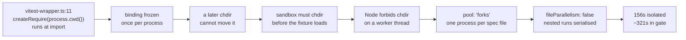
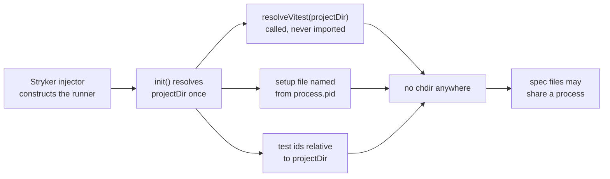

# Remove the import-time cwd binding in the Vitest runner and cut test cost - Plan

## Goal Capsule

**Objective.** Delete the import-time working-directory binding in
`@systemfsoftware/stryker-js-vitest-runner`, then remove the test-suite
machinery that exists only to work around it, and measure what the package
suite costs afterwards.

**Target.** The request that produced this plan asked for an order-of-magnitude
reduction in this package's test cost. It is recorded here because KTD6 and the
Risks section both reason against it, and a reference with no antecedent cannot
be audited. It is an aspiration, not a commitment: this plan promises the
measurement and an honest report of the factor, and explicitly does not promise
the factor. No Definition of Done item passes or fails on reaching it.

**Product authority.** Direct planning. No upstream requirements document.

**Open blockers.** None.

---

## Problem Frame

`src/vitest-wrapper.ts` resolves the project's Vitest installation at module
load. Lines 10-21 run inside the module body: they build a `require` rooted at
`process.cwd()`, resolve `vitest/node`, `await import` it, and read a version
from disk. The result is frozen into `export const vitestWrapper` at line 23.

Three consequences follow, and they are the whole problem.

1. The binding is fixed for the life of the process, at the moment of first
   import. A later `process.chdir()` cannot move it.
2. So the integration suite must change directory _before_ the fixture
   project is loaded. `test/util/temp-test-directory-sandbox.ts` does exactly
   that at line 42.
3. So each spec file needs its own fresh process. Node forbids `chdir` on a
   worker thread, which forces `pool: 'forks'`, and two nested Vitest runs on
   one core forced `fileParallelism: false`. Both are pinned in
   `vitest.config.ts` lines 13-14, and the comment above them records the
   reasoning.

The measured cost of that chain is 156 seconds for this package in isolation
and roughly 321 seconds inside the full gate, where it is the longest task.

Two further defects sit on the same chain and are fixed by the same work.

- `src/vitest-test-runner.ts` lines 62-64 build the local setup-file path in a
  **field initializer**, so it resolves against whatever directory happens to
  be current when the object is constructed - which is before the sandbox
  changes directory. The file name falls back to a constant when
  `STRYKER_MUTATOR_WORKER` is unset, and it is unset here, so every concurrent
  runner picks the same name and they delete each other's file. This was
  observed as a surviving mutant in
  `test/integration/related.it.spec.ts` - a correctness failure, not a flake.
- `src/vitest-helpers.ts` line 83 builds test identifiers with
  `path.relative(process.cwd(), file)`, so identifiers depend on the ambient
  directory too.

### Why the runner should not be reading the directory at all

The project's internal doctrine corpus settles this, and the ruling is
restated here in full because the corpus does not ship with the clone.

A composition root has two constitutive marks: it is a unique location, and it
is where the object graph is finally composed, meaning executed. Only
applications should have composition roots; libraries and frameworks should
not. That prohibition is canon-grade in the corpus.

The block at `vitest-wrapper.ts:10-21` holds **both** marks. It executes at
load, and it is a module singleton no consumer can replace or re-run. By that
definition it is a composition root, and it is sitting inside a library.

The corpus is equally clear that this does not forbid a library from
composing. A library publishes constructible parts, and the consuming
application composes them at the application's own root. Our runner already
conforms to that shape everywhere except the wrapper: `static inject` at lines
55-59 declares constructor injection, Stryker's plugin injector supplies the
options, and `init()` already receives the project directory at line 99 as
`this.options.vitest.dir`. The wrapper ignores the directory the consumer's
root supplied and reads the ambient one instead.

The corpus also records that a library's own test suite is itself a consuming
process, and that the test process's root is the only composition altitude the
tests may use. That is the licence for many spec files to share a process once
the frozen binding is gone.

**Warrant, stated honestly.** The corpus additionally carries a blanket
prohibition on any import-time effect in a published module, with an
import-purity check as its gate. That prohibition is banded as the corpus's own
hardening, weaker than canon, and the corpus records canon-grade
counter-authority against it: a normative style guide that permits importing a
module for its load-time effects, and a standards body whose answer to
import-time cost is deferral rather than prohibition. **This plan does not rest
on that prohibition.** It rests on the canon-grade composition-root definition
above, and on the canon-grade observation that eager evaluation at import is a
recognised performance cost whose standard remedy is to defer it.

### Why the cost claim is measured and not asserted

A superseded cost claim already warns that cost belongs to a specific
observer-and-domain pair, never to a class of test. So "integration tests are
slow" is not an explanation here, and neither is a promised speed-up. This plan
commits to a measurement and to reporting it whichever way it lands.

---

## Requirements

- **R1.** Importing any module under `src/` must perform no module resolution,
  no filesystem read, and no dynamic import.
- **R2.** The Vitest installation must be resolved from a directory supplied by
  the caller, not from the ambient working directory.
- **R3.** Two runners in one process, given two different project directories,
  must each resolve and report their own Vitest, with no cross-contamination.
- **R4.** Concurrent runners in different processes must not share or delete
  each other's setup file.
- **R5.** Test identifiers must be derived from the supplied project directory.
- **R6.** No file in the package may call `process.chdir()`.
- **R7.** No file under `src/` may call `process.cwd()`, except one documented
  default at the composition edge (see KTD3).
- **R8.** The package suite's wall time must be measured before and after with
  the same command, on the same machine, in the same session, and reported with
  the factor. A baseline carried over from an earlier session does not satisfy
  this: it must be re-measured immediately before the post-change run so both
  numbers share a machine and a system load.
- **R9.** Behaviour visible to Stryker must not change. The plugin contract,
  the options shape, and the reported test identifiers relative to the project
  root all stay as they are.

---

## Key Technical Decisions

**KTD1 - The wrapper publishes a function, not a resolved object.**
`export const vitestWrapper = { createVitest, version }` becomes
`export async function resolveVitest(dir: string)` returning the same two
members. Import then constructs a description and executes nothing, which is
what makes the module stop being a root. The existing fallback to the bundled
`vitest/node` is preserved as the behaviour when the project directory has no
local Vitest.

**KTD2 - The resolver is injected as a constructor parameter with a default.**
`VitestTestRunner`'s constructor gains a fourth parameter defaulting to
`resolveVitest`. Stryker's `static inject` array lists three tokens, so the
injector supplies three arguments and the fourth takes its default; the
consumer's root is unaffected. Tests pass their own resolver. This replaces the
module spy at `test/unit/vitest-runner.spec.ts:32`, which substitutes at a
module boundary - a double the corpus rules illegal everywhere in a package,
on the ground that a module is not a port and the spy pins internal file shape
so any refactor breaks a passing test. A default-carrying constructor
parameter is a port, and it is the library shape the corpus prescribes:
constructible parts plus a convenience default.

**KTD3 - The project directory is read once, at `init()`, into a field.**
`this.options.vitest.dir` is the supplied value. When the consumer supplies
nothing, the runner falls back to `process.cwd()` **once**, in `init()`, into
a single private field that every later use reads. This is deliberately not
the same thing as the defect being removed: it is a default computed at call
time, inside a method the consumer invoked, in the consumer's own process -
not a binding frozen at import that no consumer can influence. It must appear
exactly once in `src/`, and R7 permits exactly that one occurrence.

**KTD4 - The setup file is named from the operating-system process id.**
Not from `STRYKER_MUTATOR_WORKER`. That variable is unusable as a
disambiguator here for two independent reasons, both confirmed in the source
during investigation. First, our Stryker fork builds the child
environment as `{ STRYKER_MUTATOR_WORKER: workerId, ...process.env }` in
`packages/stryker-js/mutation-run/src/worker-pool/child-process-proxy.ts` at
line 70, so the spread lands _after_ the key and the parent's value overwrites the
fresh worker id. Second, under `pnpm --filter ... mutation` the whole Vitest
run sits inside a single Stryker worker, so every Vitest fork inherits the same
id regardless. `process.pid` is unique per operating-system process, which is
the actual unit of collision. The `?? 0` fallback is deleted.

**KTD5 - The sandbox keeps the copy and loses the directory change.**
The copy exists for a reason that still holds and is documented at
`test/util/temp-test-directory-sandbox.ts` lines 5-9: ESM caches modules, so a
fixture project cannot be loaded twice from the same path. The `chdir` served
two purposes, not one. It fed the ambient reads this plan removes, and it also
positioned the nested Vitest's project root, because the test factory supplies
no `dir` of its own. That second purpose is why U4 must pass the directory
explicitly rather than merely deleting the call. Copy stays, `chdir` goes, the
directory becomes explicit.

**KTD6 - Scope covers all three terms, with the third gated on measurement.**
The 1.5x measured so far (156s to 105s) came from the setup-file fix plus
parallel spec files, with the directory change still in place. That is not "the
first two terms on their own": it already borrows the third term's lever and it
exercises none of U1, U3, or U4. Against the Goal Capsule's order-of-magnitude
target, nothing measured so far comes close, so the third term is in scope. Its
payoff is unproven and this plan does not assert it.

---

## High-Level Technical Design

Today, one import-time read propagates all the way to the gate's longest task:

After the change, the directory arrives through the channel the consumer's
root already uses:

---

## Implementation Units

### U1. Make Vitest resolution inert

**Goal.** Importing `src/vitest-wrapper.ts` executes nothing; resolution takes
a directory.

**Requirements.** R1, R2, R3.

**Dependencies.** None.

**Files.**

- `packages/stryker-js/vitest-runner/src/vitest-wrapper.ts` (modify)

**Approach.** Replace the module-body `try`/`catch` at lines 10-21 and the
`vitestWrapper` object at lines 23-26 with an exported async function taking
the project directory and returning `{ createVitest, version }`. Build the
`require` from `path.join(dir, 'package.json')`. Keep the existing fallback
path - when the project has no resolvable Vitest, use the bundled `vitest/node`
and its version. `export type * from 'vitest/node'` at line 28 is type-only and
stays.

Do **not** add a memo in this unit. If U5's measurement shows repeated
resolution is material, a memo keyed by resolved directory may be added behind
the function; a memo shared across consumers is process-lifetime state and
needs that evidence first.

**Test scenarios.**

- Importing the module in a fresh process whose working directory contains no
  `package.json` succeeds silently and performs no filesystem read. Under the
  current code that directory is exactly what the import-time branch reads.
- `resolveVitest` given a directory with a local Vitest returns that
  installation's `createVitest` and its version.
- `resolveVitest` given a directory with no local Vitest falls back to the
  bundled `vitest/node` and reports the bundled version.
- Two different directories resolved in one process each return their own
  version. This is the property the frozen singleton could not hold, and it is
  the direct expression of R3.

---

### U2. Resolve the project directory once and name the setup file per process

**Goal.** The setup-file path derives from the supplied directory and cannot
collide across concurrent processes.

**Requirements.** R2, R4, R7, R9.

**Dependencies.** U1.

**Files.**

- `packages/stryker-js/vitest-runner/src/vitest-test-runner.ts` (modify)

**Approach.** Delete the `localSetupFile` field initializer at lines 62-64.
Add the resolver constructor parameter from KTD2. In `init()`, before the
`copyFile` at line 80, resolve the project directory once into a private field
per KTD3, then derive the setup-file path as
`path.resolve(projectDir, 'stryker-setup-' + process.pid + '.js')`. Replace
`vitestWrapper.createVitest` at line 82 and `vitestWrapper.version` at line 106
with the members returned by the injected resolver, called with the resolved
directory. Pass the same field to `dir` at line 99. Confirm `dispose()` still
removes only this runner's file.

**Test scenarios.**

- Two runners constructed in one process with different project directories
  write two distinct setup files, and neither disposal removes the other's.
- `dispose()` removes the file this runner created and no other.
- The setup file lands inside the supplied project directory, not the ambient
  working directory.
- When the consumer supplies no directory, the runner uses the process working
  directory and still functions - the KTD3 default.
- Behaviour reported to Stryker is unchanged for a single-runner run.

---

### U3. Derive test identifiers from the supplied directory

**Goal.** `normalizeTestId` and `normalizeCoverage` become pure - no ambient
read.

**Requirements.** R5, R7, R9.

**Dependencies.** U2 (supplies the directory field).

**Files.**

- `packages/stryker-js/vitest-runner/src/vitest-helpers.ts` (modify)
- `packages/stryker-js/vitest-runner/src/vitest-test-runner.ts` (modify)

**Approach.** `normalizeTestId(id, dir)` and `normalizeCoverage(rawCoverage,
dir)`. Both stop reading `process.cwd()`. Update every callsite: the internal
use at `vitest-helpers.ts:32`, the recursion at line 90, and the `.map(
normalizeCoverage)` at `vitest-test-runner.ts:264`, which must become an
explicit arrow passing the directory. Find callsites with the language server's
reference lookup, not text search.

**Test scenarios.**

- `normalizeTestId` returns a path relative to the supplied directory, with
  backslashes normalised to forward slashes.
- The same absolute file under two different supplied directories yields two
  different identifiers. This is the property the ambient read could not
  express.
- `normalizeCoverage` maps every per-test key through the supplied directory
  and leaves `static` untouched.

---

### U4. Remove the directory change from the test sandbox

**Goal.** No `process.chdir()` anywhere in the package.

**Requirements.** R6, R9.

**Dependencies.** U1, U2, U3.

**Files.**

- `packages/stryker-js/vitest-runner/test/util/temp-test-directory-sandbox.ts`
  (modify)
- `packages/stryker-js/vitest-runner/test/integration/related.it.spec.ts`
  (modify - sandbox `multiple-files`, constructed at line 34)
- `packages/stryker-js/vitest-runner/test/integration/timeout-on-infinite-loop.it.spec.ts`
  (modify - sandbox `infinite-loop`, constructed at line 22)
- `packages/stryker-js/vitest-runner/test/integration/vitest-test-runner.it.spec.ts`
  (modify - six sandboxes: `simple-project` line 47, `multiple-configs` line
  289, `workspaces` line 325, `async-failure` line 371, `deep-project` line
  403, `vitest-fixtures` line 430)
- `packages/stryker-js/vitest-runner/test/unit/vitest-runner.spec.ts` (modify)

**Approach.** The two `chdir` calls at lines 42 and 52 go. The saved
`originalWorkingDir` field CANNOT be deleted alongside them - it has two other
readers, and dropping it breaks the class outright:

- line 35 passes it to `path.resolve` when building `tmpDir`, so deleting the
  field turns that into `path.resolve(undefined, ...)`, which throws on every
  non-soft sandbox;
- lines 49-51 use it as the `dispose()` guard, so deleting the field makes
  `dispose()` always throw `Disposed without initialized`.

Order of operations: replace the line-35 use with a direct `process.cwd()` call

- correct now that the directory never changes - re-point the `dispose()` guard
  at `!this.tmpDir`, and only then remove the field declaration at line 13 and its
  assignment at line 30. Keep the copy and the temp-directory construction; the
  ESM reason at lines 5-9 still holds. `this.from` at line 22 resolves at
  construction against the package root and is unaffected.

Integration specs then pass `sandbox.tmpDir` as the runner's project directory
instead of relying on the ambient one. In the unit spec, replace the module spy
at line 32 with the injected resolver from KTD2 - a substitute at a declared
parameter, which is a port, rather than at a module boundary.

**Three traps an implementer will otherwise hit.**

1. **A relative `dir` already exists in the suite.**
   `vitest-test-runner.it.spec.ts:408` sets `options.vitest.dir = 'packages'`.
   Today that resolves against the changed-into sandbox. With the change
   removed it would resolve against the package root and the test would load
   the wrong tree. It must become an absolute path built from
   `sandbox.tmpDir`. Check every `dir` assignment in the suite for the same
   shape, not just this one.
2. **Integration specs run against built output, not source.** All three
   `*.it.spec.ts` files import from `../../dist/index.mjs`. A local loop that
   edits `src/` and runs Vitest directly will exercise a stale `dist/` and
   report confusing passes. Build between edit and integration run; the
   repository's task graph already orders `test` after `build`, so the full
   command is correct and only the hand-run loop is exposed.
3. **`fileName` assertions resolve against the working directory too.**
   `vitest-test-runner.it.spec.ts` asserts `fileName: path.resolve('tests/add.spec.ts')`
   at lines 63, 69, 75, and 81, and the same bare-relative shape recurs later in
   the file. Those resolve against the current directory, so today they land in
   the sandbox and after the change they would land in the package root, while
   the runner still reports the absolute path Vitest gives it. Every such
   assertion becomes `path.resolve(sandbox.tmpDir, ...)`. Fix the assertions,
   not the runner: `convertTestToTestResult` reporting an absolute `fileName` is
   existing behaviour and R9 keeps it. Sweep the whole file for bare
   `path.resolve('...')` in an expectation - the four cited lines are the shape,
   not the full list.

**Behaviour-preservation evidence.** The `workspaces` case at lines 327-328
asserts test identifiers such as
`packages/foo/src/math.spec.js#min should min 44, 2 = 42` - already relative to
the sandbox root. After U3 the identifier is built relative to the supplied
project directory, which for that spec is the sandbox root, so the expected
strings are unchanged. That case is the sharpest existing check that R5 and R9
hold together.

**Test scenarios.**

- Every integration spec passes with no directory change in the suite.
- `related.it.spec.ts` "should support related = true when mutation testing"
  kills its mutant. This test currently reports a survivor because of the
  shared setup file, so it is the specific regression this work must clear.
- The `deep-project` case at line 403 still reports an `ErrorResult` with its
  `dir` pointing at a subdirectory of the sandbox.
- A spec constructing two sandboxes in one process gets two distinct fixture
  projects and neither interferes with the other.
- The unit spec drives the runner through the injected resolver and never
  reaches into the wrapper module.

---

### U5. Re-enable parallel spec files and measure

**Goal.** Remove the pins that only existed for the directory change, then
record what the suite costs.

**Requirements.** R8.

**Dependencies.** U4.

**Files.**

- `packages/stryker-js/vitest-runner/vitest.config.ts` (modify)

**Approach.** Delete `pool: 'forks'` at line 13, `fileParallelism: false` at
line 14, and the comment at lines 10-12 that justified them. Let the shared
config decide the pool. Keep the timeouts.

**Measurement, which is this unit's real output.**

- Command, identical before and after:
  `pnpm turbo test --filter=@systemfsoftware/stryker-js-vitest-runner --force`
- Baseline: re-measure it in this session, on this machine, immediately before
  the post-change run. The 156 seconds recorded earlier came from a different
  session and is a sighting shot, not the control.
- Record the new wall time and state the factor plainly.
- Banked comparison point: 105 seconds, measured during planning from the
  setup-file fix plus parallel spec files while the directory change was still
  present. It is a different-session number, so treat it as an order-of-size
  reference rather than a precise gate. If the full change lands slower than the
  freshly measured baseline it is a regression
  against work already proven, and the fallback is `pool: 'forks'` with
  `fileParallelism: true`.

**Test expectation.** The package suite is itself the test for this unit.

---

## Verification Contract

Run from the repository root, after the last edit, in one session.

| #  | Check                                                                        | Pass condition                                                            |
| -- | ---------------------------------------------------------------------------- | ------------------------------------------------------------------------- |
| V1 | `pnpm check`                                                                 | Exits 0. Full command, no filters, per the repository's anti-bypass rule. |
| V2 | `grep -rn 'process\.chdir' packages/stryker-js/vitest-runner`                | No matches.                                                               |
| V3 | `grep -rn 'process\.cwd' packages/stryker-js/vitest-runner/src`              | Exactly one match, the KTD3 default in `vitest-test-runner.ts`.           |
| V4 | U1's import-purity scenario                                                  | Passes.                                                                   |
| V5 | `pnpm turbo test --filter=@systemfsoftware/stryker-js-vitest-runner --force` | Green, and the wall time recorded.                                        |

**Mutation.** The repository requires a perfect mutation score on changed pure
decisions. Every file this plan touches is a shell cell - an adapter, the
runner, a helper, a test, or config - and none is enrolled in the mutation
scope, which the repository's scope guard enforces and `pnpm check` runs. So no
mutation run is required by this change. `vitest-helpers.ts` becomes pure as a
side effect of U3 but is not a decision cell and is not enrolled.

---

## Definition of Done

- [ ] U1 through U5 landed.
- [ ] `pnpm check` exits 0, run in this session after the final edit.
- [ ] V2, V3, V4 all pass.
- [ ] Baseline and post-change wall times were measured in the same session on
      the same machine, and both numbers plus the factor are recorded in the
      pull request description, stated plainly whichever way it lands. The
      Goal Capsule's order-of-magnitude target does not gate this item.
- [ ] `related.it.spec.ts` mutation survivor is gone.
- [ ] Publishable package metadata unchanged - this plan touches no
      `package.json`.

---

## Scope Boundaries

**In scope.** `src/vitest-wrapper.ts`, `src/vitest-test-runner.ts`,
`src/vitest-helpers.ts`, `test/util/temp-test-directory-sandbox.ts`, the
integration specs that consumed the ambient directory,
`test/unit/vitest-runner.spec.ts`, and `vitest.config.ts`.

**Out of scope.**

- **The environment-spread bug in our Stryker fork.**
  `packages/stryker-js/mutation-run/src/worker-pool/child-process-proxy.ts` places
  `...process.env` after `STRYKER_MUTATOR_WORKER` when building the child
  environment, so the parent's value overwrites the fresh worker id. It is a
  real one-line bug in a different package and deserves its own change. KTD4
  routes around it rather than fixing it.
- **Redesigning how the runner discovers its project directory.** Stryker's
  plugin contract exposes no directory token. `options.vitest.dir` is the
  existing channel and this plan uses it.
- **The `.gitignore` entry hiding `stryker-setup-*.js`.** Once the file is
  named per process and disposed correctly the entry is moot, but removing it
  is a separate tidy.

### Deferred to Follow-Up Work

- Memoising Vitest resolution per directory, if and only if U5's measurement
  shows repeated resolution is material.
- Auditing the rest of the monorepo for the same import-time-binding shape.
  Two occurrences are already known outside this package and neither is on
  this plan's path.

---

## Risks

- **Removing the directory change may expose other implicit directory
  dependencies inside the fixture projects.** A fixture's own config or a
  relative path in fixture source could have been relying on the ambient
  directory. U4 runs the full integration suite, and any fixture that breaks
  names its own path in the failure.
- **A thread pool changes the parent of each nested Vitest run.** A nested
  Vitest that spawns its own workers may behave differently under a thread
  parent than under a fork parent. U5's measurement doubles as the correctness
  check: the suite must stay green, and if it does not, the banked
  `forks` plus parallel-files result stands.
- **The setup file's location moves.** It currently lands in whatever directory
  is current; after U2 it lands in the supplied project directory. If a
  consumer points that at a subdirectory, Vite could refuse to serve a file
  outside the project root. U2's third scenario asserts the location, and the
  supplied directory is the project root in every path we control.
- **The order-of-magnitude target may not be reached.** The plan's obligation
  is the measurement and an honest report, not the factor.

---

## Open Questions

None blocking. The only design question - whether resolution needs a memo - is
deliberately answered by U5's measurement rather than by argument, and is
recorded under Deferred to Follow-Up Work.
