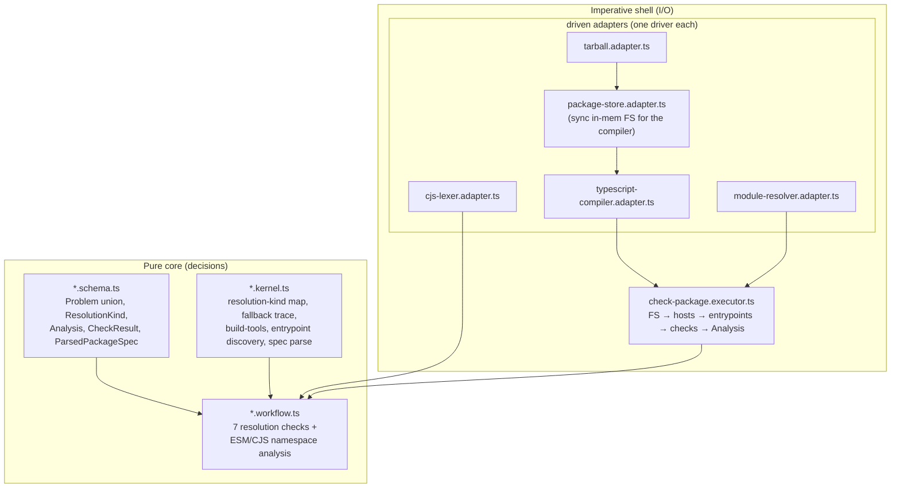
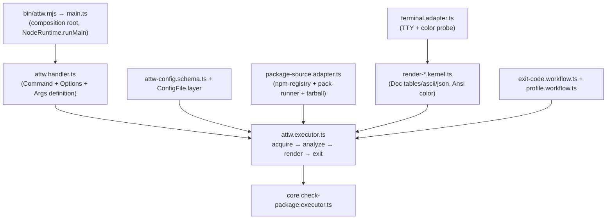
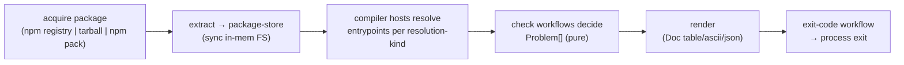

# Rewrite `arethetypeswrong` into a fully Effect-TS CLI

## Goal Capsule

Rewrite both subpackages of the `arethetypeswrong` fork (`core` and `cli`) into a fully Effect-TS application with no compromises: the CLI onto `@effect/cli` + `@effect/platform-node`, the analysis engine into the repo's cell architecture (pure workflows, driven adapters, executor shell, branded Schemas), and rendering onto `@effect/printer` + `@effect/printer-ansi`. The existing brittle snapshot/mock tests are wiped and replaced with a testcontainers contract integration lane plus property tests for the pure decisions.

- **Objective:** a single `attw` bin that is Effect-native end to end — command surface on `@effect/cli`, I/O on `@effect/platform`, analysis as pure workflows behind driven adapters, presentation on `@effect/printer` — preserving the observable behavior the repo's own gate depends on.
- **Authority:** user request ("Rewrite are the types wrong cli to be fully effect-ts and use @effect/cli @effect/platform et al"; "Full effect no compromises"). Constitution §I–V governs cell shape; root `AGENTS.md` REPO-S3 (vendored read-only) does not apply — this fork is ours to change.
- **Execution profile:** full rewrite of two published packages, behavior-pinned first via characterization, clean cutover last so the repo's `attw` gate stays green throughout.
- **Stop conditions:** `pnpm check` exits 0; the testcontainers lane passes against the rebuilt binary; the pure-core cells pass mutation at 100%; every non-Effect dependency with an Effect-native equivalent is removed.
- **Tail ownership:** after the last unit merges, the `attw` bin is Effect-native, the old commander/chalk/cli-table3/marked code and all snapshot/mock tests are deleted, and `pnpm check` (which runs the `attw` turbo task) is green.

---

## Product Contract

### Summary

The `arethetypeswrong` fork becomes a fully Effect-TS CLI. The `cli` package is rebuilt on `@effect/cli` (command, options, args, config-file) and `@effect/platform-node` (filesystem, http client, command execution, terminal). The `core` package's analysis engine — today an imperative class-and-Promise codebase wrapping the TypeScript compiler — is decomposed into the repo's cell architecture: pure type-resolution decisions become `*.workflow.ts` cells, the external systems (TypeScript compiler, `@loaderkit/resolve`, `cjs-module-lexer`, tarball/gzip) become single-driver `*.adapter.ts` cells, orchestration becomes a `*.executor.ts`, and the domain types become branded `Schema` declarations. Presentation moves from chalk/cli-table3/marked to `@effect/printer` + `@effect/printer-ansi`. The brittle snapshot and mock tests are deleted and replaced with a testcontainers contract lane (real containerized node + a local verdaccio registry) and property tests over the pure cells.

The observable CLI surface — bin name, options, exit codes, output formats — is preserved because this repo's own type-resolution gate (`pnpm check:ci` → turbo `attw`) and external `npm i -g` consumers depend on it. The rewrite is internal; the contract is external.

### Problem Frame

The current fork is a near-verbatim port of upstream `arethetypeswrong`, written in an imperative style: a `commander`-driven `index.ts` action handler, a `Package` class that bundles in-memory filesystem state with domain identity and Promise-returning I/O, and an analysis engine that mixes compiler-API calls with decision logic in `defineCheck` blocks. It does not match the constitution's functional-core/imperative-shell discipline this repo enforces everywhere else, it carries presentation dependencies (chalk, cli-table3, marked) that have Effect-native replacements already pinned in the catalog, and its tests are snapshot- and mock-based — exec'ing a built binary against byte-compared snapshots, and fabricating in-memory packages that bypass real npm/pack behavior.

The cost is real: the package is the repo's type-resolution gate, so its non-Effect shape is the one place the constitution is silently waived, and its tests go stale without a signal (snapshot churn on compiler-version bumps is already a documented maintenance burden).

### Requirements

- R1. The `attw` bin is rebuilt on `@effect/cli` + `@effect/platform-node`, preserving the observable CLI surface: the optional positional `[file-directory-or-package-spec]` argument, every current option (`--pack`, `--from-npm`, `--definitely-typed`, `--format`, `--quiet`, `--entrypoints`/`--include-entrypoints`/`--exclude-entrypoints`, `--entrypoints-legacy`, `--ignore-rules`, `--profile`, `--summary`, `--emoji`, `--color`, `--config-path`), the exit-code semantics, and the five output formats (`auto`, `table`, `table-flipped`, `ascii`, `json`).
- R2. The core analysis engine is refactored into Effect cells: the type-resolution checks become pure `*.workflow.ts` decisions, the TypeScript compiler / module resolver / CJS lexer / tarball extraction become single-driver `*.adapter.ts` cells, the `checkPackage` orchestration becomes a `*.executor.ts` owning a `Context.Tag` deps interface, and the domain types (`Problem` union, `ResolutionKind`, `Analysis`, `CheckResult`, `ParsedPackageSpec`) become branded `Schema` declarations.
- R3. Every non-Effect dependency with an Effect-native equivalent is removed: `commander`, `chalk`, `cli-table3`, `marked`, `marked-terminal` (cli), and the bare-Promise/Class I/O surface of core. `typescript@6` (the analysis driver), `@loaderkit/resolve`, `cjs-module-lexer`, and the gzip/untar libraries stay as adapter drivers — no Effect equivalent exists for compiler-API or tarball work.
- R4. Presentation is rebuilt on `@effect/printer` + `@effect/printer-ansi`. The typed table (entrypoints × resolution-kinds matrix, normal and flipped), the ascii layout, and the untyped report are `Doc`-built; color is `Ansi` annotation; `--no-color` strips annotations.
- R5. The `.attw.json` config is loaded through `@effect/cli`'s `ConfigFile` layer and decoded through a `Schema`, replacing the manual `readConfig.ts` JSON-poke.
- R6. Tests are wiped and replaced: a testcontainers contract integration lane (real node container with the packed tarball installed; a verdaccio container as a local npm registry for `--from-npm`) characterizes the observable behavior, and property tests cover the pure decisions. No mock-based adapter unit tests remain.
- R7. The repo's own `attw` gate stays green throughout the rewrite via characterize-then-rewrite sequencing: the contract lane pins the current binary's behavior before any source is touched, new cells build alongside the old source, and a final cutover unit swaps the bin/tsdown entry and deletes the old source.
- R8. At completion `pnpm check` exits 0; both packages build, typecheck, lint, pass their tests, and the pure-core cells pass mutation at 100%.

### Scope Boundaries

**In scope:**

- `packages/arethetypeswrong/core/` — full cell rewrite (schemas, kernels, workflows, adapters, executor) of the analysis engine and package acquisition.
- `packages/arethetypeswrong/cli/` — full `@effect/cli` rewrite of the command surface, rendering, and orchestration.
- Both packages' `package.json` (dependencies, exports via tsdown), `tsdown.config.ts`, `tsconfig*.json`, `oxlint.config.ts`, `vitest.config.ts`, `stryker.config.json`.
- The `attw` bin entry and the repo's `attw` turbo task wiring (cutover only — the task definition in root `package.json` is unchanged).
- New testcontainers test infrastructure under both packages' `__tests__/` (global-setup, adapter, env).

### Deferred to Follow-Up Work

- A machine/agent-mode output format (NDJSON stream like the stryker CLI's). The Effect architecture makes it trivial to add later; it is not requested now and adding it would expand the observable surface beyond "preserve behavior."
- Migrating the core off `typescript@6`. This is a documented ceiling (`docs/solutions/tooling-decisions/arethetypeswrong-core-requires-js-typescript-api.md`) — the JS compiler API is the analysis driver and TypeScript 7 removed it.
- Rewriting the resolution-trace fidelity (the `resolvedThroughFallback` trace string parsing) to use a structured trace object. Behavior-preserving means the string-parsing kernel stays verbatim for now.

---

## Planning Contract

### Key Technical Decisions

**KTD1 — TypeScript stays the analysis driver, pinned at 6.** The compiler adapter wraps `createProgram`/`resolveModuleName`/compiler-host against `typescript@6` (`catalog:attw`). TypeScript 7 is native Go with no JS compiler API; this is settled and documented. The pin is the adapter's one external system.

**KTD2 — The `defineCheck` pattern maps directly to workflows.** Each upstream check is `defineCheck({ name, dependencies, execute })` where `dependencies` is a pure function of context and `execute` is a pure decision returning `Problem[]`. In the rewrite, the executor resolves the dependencies through the driven adapters (compiler, resolver, lexer — the impure read), then hands the resolved `EntrypointResolutionAnalysis` to a `*.workflow.ts` that decides `Problem[]` purely. The check is the pure core; the compiler call is the imperative shell (constitution II.1/II.6).

**KTD3 — `@effect/printer` has no table primitive; tables are hand-built grids.** Confirmed against the installed `@effect/printer@0.51.0`: no `Doc.table`. The typed matrix renders as `Doc.vsep` of rows, each row a `Doc.hcat` of cells padded to computed column widths via `Doc.column`/`Doc.width`/`Doc.fill`/`Doc.spaces`, with `Doc.punctuate` for separators. Color is `Ansi` annotation (`Ansi.color`, named colors, `bold`) applied through `AnsiDoc`, rendered via the Ansi-aware renderer; `--no-color` renders with annotations stripped (`Doc.unAnnotate`). This is real work but removes three presentation dependencies for one Effect-native one.

**KTD4 — `@effect/cli` `ConfigFile` replaces manual config reading.** Confirmed: `@effect/cli` ships `ConfigFile.layer(fileName, { formats, searchPaths })` returning a `Layer` providing a `ConfigProvider` over `Path | FileSystem`. `.attw.json` maps to `ConfigFile.layer('.attw.json', { formats: ['json'] })`; the command's options read from that provider. The current `readConfig.ts` (manual `JSON.parse` + `setOptionValueWithSource`) is deleted.

**KTD5 — Characterize-then-rewrite sequencing keeps the gate green.** Constitution III.5 requires pinning behavior before rebuild. U1 lands the testcontainers lane against the _current_ binary first. Units U2–U9 add new Effect cells alongside the old source (different filenames, so no conflict; tsdown entry stays the old `index.ts` so the built bin is unchanged). U9 is the clean cutover: it repoints `bin/attw.mjs` + tsdown entry at the new `main.ts`, deletes the old commander source, and re-runs the lane. The repo's `attw` turbo task never goes red mid-rewrite.

**KTD6 — The compiler needs a synchronous filesystem; the adapter owns it.** The TypeScript compiler API requires synchronous `fileExists`/`readFile`. `@effect/platform/FileSystem` is Effect-based (async). The `package-store` adapter therefore materializes the extracted tarball into a synchronous in-memory map that the compiler adapter reads from. The Effect boundary is the service `Context.Tag`; adapter-internal imperative state is permitted (constitution II.6 judges pure-vs-effectful by return type, not by folder — the adapter returns `Effect`, its internals may be imperative).

**KTD7 — testcontainers: node container + verdaccio.** Mirrors the established `packages/stryker-js/cli/__tests__/global-setup.ts` pattern: a `global-setup` packs the CLI + core (+ workspace deps) tarballs, starts a `node:22-alpine` container, installs them, and provides the container id via vitest context; a `CliAdapter` (`Context.Tag`) execs the bin inside the container. A second `verdaccio` container is the local npm registry for `--from-npm` tests — real registry behavior, no hitting npmjs.org, no mocks.

**KTD8 — No mocks.** Property tests for the pure cells (workflows, kernels, schemas); testcontainers integration for the I/O sandwich (acquire → analyze → render → exit). Adapters are exercised through real containers and real inputs, never faked. This is the explicit directive replacing the "brittle mock shitter tests."

**KTD9 — Behavioral preservation is the backbone, not a constraint to fight.** Exit codes, option semantics, and output formats are preserved because the repo's gate and external consumers depend on them. REPO-R1 permits breaking changes, but the user's ask is "rewrite the internals to Effect," not "redesign the product." Modernization (machine-mode) is deferred (Scope Boundaries).

**KTD10 — One driver per adapter.** The analysis surface touches four external systems; each is its own `*.adapter.ts` so the single-driver lint principle holds: `typescript-compiler.adapter.ts` (typescript), `module-resolver.adapter.ts` (`@loaderkit/resolve`), `cjs-lexer.adapter.ts` (`cjs-module-lexer`), `tarball.adapter.ts` (fflate + `@andrewbranch/untar.js` — one tarball-extraction concern).

### High-Level Technical Design

The rewrite follows the repo's established cell topology (the stryker CLI is the precedent). Two layers: a pure core of workflows/kernels/schemas that decide, and an imperative shell of adapters/executors that read and write. Dependencies point inward (adapters → workflows ← executor; constitution II.4).

The CLI is a second cell stack on top of core's executor:

The end-to-end flow is the I/O sandwich (read → transform → write):

### Assumptions

- The five resolution kinds (`node10`, `node16-cjs`, `node16-esm`, `bundler`) and twelve problem kinds are unchanged — this is behavior preservation, not a fidelity redesign.
- The existing real `.tgz` fixtures under `core/test/fixtures/` and `cli/test/snapshots/` are reusable as testcontainers inputs (they are real package tarballs, not mocks).
- `effect-memfs` (`@systemfsoftware/effect-memfs`) is a candidate for the package-store backing, but the compiler's synchronous-FS requirement means the adapter likely holds its own sync map; reuse is an implementation-time call, not a plan decision.

### Sequencing

Characterize first (U1), then build the pure core bottom-up (U2–U3), then the core I/O shell (U4–U5), then the CLI stack (U6–U9) with the cutover last (U9), then tests + gate (U10). Each unit leaves the tree building; only U9 changes what the built bin is.

---

## Implementation Units

| U-ID | Title                                         | Files touched                                                                      | Depends on     |
| ---- | --------------------------------------------- | ---------------------------------------------------------------------------------- | -------------- |
| U1   | testcontainers characterization lane          | `cli/__tests__/*`, `cli/vitest.contract.config.ts`                                 | —              |
| U2   | core schemas + kernels                        | `core/src/*.schema.ts`, `*.kernel.ts`                                              | —              |
| U3   | core check workflows                          | `core/src/checks/*.workflow.ts`, `esm/*.workflow.ts`                               | U2             |
| U4   | core driven adapters                          | `core/src/*.adapter.ts`                                                            | U2             |
| U5   | core check-package executor                   | `core/src/check-package.executor.ts`                                               | U3, U4         |
| U6   | CLI command surface + config + pure decisions | `cli/src/attw.handler.ts`, `attw-config.schema.ts`, `*.workflow.ts`, `*.kernel.ts` | U2             |
| U7   | CLI acquisition adapters + terminal           | `cli/src/*.adapter.ts`                                                             | U4             |
| U8   | CLI rendering                                 | `cli/src/render-*.kernel.ts`                                                       | U3, U6         |
| U9   | CLI executor + main + cutover                 | `cli/src/attw.executor.ts`, `main.ts`, `bin/attw.mjs`, `tsdown.config.ts`          | U5, U6, U7, U8 |
| U10  | cell tests + remove old tests + gate          | both packages' `test/`, `__tests__/`, `stryker.config.json`                        | U1–U9          |

### U1. testcontainers characterization lane

- **Goal:** Pin the _current_ binary's observable behavior in a real containerized environment, so the rewrite (U2–U9) has a safety net and U10 can prove parity.
- **Requirements:** R6, R7.
- **Dependencies:** none (runs against the current built binary).
- **Files:** `packages/arethetypeswrong/cli/__tests__/global-setup.ts`, `packages/arethetypeswrong/cli/__tests__/attw-cli.adapter.ts`, `packages/arethetypeswrong/cli/__tests__/attw-cli-env.ts`, `packages/arethetypeswrong/cli/__tests__/cli-contract.integration.test.ts`, `packages/arethetypeswrong/cli/vitest.contract.config.ts`.
- **Approach:** Mirror `packages/stryker-js/cli/__tests__/`. A `global-setup` packs `arethetypeswrong-cli` + `arethetypeswrong-core` tarballs, asserts docker is reachable, starts a `node:22-alpine` container (`sleep infinity`), copies the tarballs + the existing real `.tgz` fixtures, installs the tarballs, and provides the container id via vitest `project.provide`. A `verdaccio` container is started for `--from-npm` scenarios; a fixture package is published to it. The `AttwCli` `Context.Tag` adapter exposes `run(args, opts)` / `sh(script, opts)` exec'ing the bin inside the container. The contract test exercises representative fixtures and asserts exit codes + output structure (NOT byte snapshots — assert exit code, presence of expected problem-kind markers per fixture, and that `--format json` yields parseable JSON with the right top-level keys).
- **Execution note:** Build the lane to pass against the current binary first; record the observed exit codes so U10 can diff against them. Use behavior-asserting checks (exit code, problem-kind presence, JSON structure), never byte-for-byte snapshots — the whole point is to escape snapshot brittleness.
- **Patterns to follow:** `packages/stryker-js/cli/__tests__/global-setup.ts`, `stryker-cli.adapter.ts`, `stryker-cli-env.ts`, `cli-contract.integration.test.ts`.
- **Test scenarios:**
  - Happy path: `attw axios@1.4.0.tgz` exits non-zero and stdout contains a `false-export-default` / `named-exports` marker (characterizing a package known to report problems).
  - Clean package: `attw klona@2.0.6.tgz` exits 0 and reports "No problems found" equivalent.
  - Format: `attw <pkg>.tgz -f json` produces parseable JSON with `analysis` and (when typed) `problems` keys; `--format ascii` / `table` / `table-flipped` each render without throwing.
  - Entrypoint options: `attw vue@3.3.4.tgz --entrypoints .` and `--exclude-entrypoints` change the reported entrypoint set observably.
  - Profile: `attw axios@1.4.0.tgz --profile node16` changes the exit code vs `--profile strict` (node10 problems ignored).
  - `--from-npm`: against the verdaccio container, `attw --from-npm <published-fixture>@<ver>` acquires and analyzes it (exit code matches the local-tarball run of the same package).
  - `--pack`: `attw --pack <fixture-dir>` packs and analyzes a directory.
  - Integration: exit code propagation is consistent across all format variants.
- **Verification:** `pnpm --filter @systemfsoftware/arethetypeswrong-cli test:contract` passes against the current built binary (run `pnpm --filter @systemfsoftware/arethetypeswrong-cli build` first).

### U2. core schemas + kernels

- **Goal:** Establish the branded domain types and pure helpers as the foundation every other cell depends on.
- **Requirements:** R2.
- **Dependencies:** none.
- **Files:** `packages/arethetypeswrong/core/src/problem.schema.ts` (12 `Schema.TaggedClass` Problem variants + branded `ProblemKind`), `resolution.schema.ts` (branded `ResolutionKind`/`ResolutionOption`, `Resolution`, `EntrypointResolutionAnalysis`, `ProgramInfo`, `ModuleKind`), `analysis.schema.ts` (`Analysis`, `UntypedResult`, `CheckResult`, `AnalysisTypes`), `package-spec.schema.ts` (`ParsedPackageSpec`), `resolution-kind.kernel.ts` (`getResolutionOption`, `getResolutionKinds`, `allResolutionKinds`/`Options`), `fallback.kernel.ts` (`resolvedThroughFallback` over trace strings), `build-tools.kernel.ts` (`getBuildTools`, `allBuildTools`), `entrypoint-discovery.kernel.ts` (`getEntrypoints`, `getSubpaths`, `hasExportTarget`, `getProxyDirectories` — pure over the exports object), `problem-info.kernel.ts` (`problemKindInfo` metadata, `filterProblems`, `groupProblemsByKind`, `problemAffects*` — moved from `problems.ts`), `package-spec.kernel.ts` (`parsePackageSpec` returning `Either`).
- **Approach:** Convert the `types.ts` interfaces to branded `Schema` declarations (TaggedClass for the Problem union so `Match.tag` dispatch is exhaustive — constitution I.3/I.5). The `Failable<T>` pattern becomes `Either`. Pure helpers from `utils.ts`/`problems.ts` move to kernels with no I/O imports. `parsePackageSpec` returns `Either<ParseError, ParsedPackageSpec>` (the error gets its own variant).
- **Patterns to follow:** any `*.schema.ts` / `*.kernel.ts` in `packages/hex-schema` or `packages/effect-schema-extensions`; the constitution's workflow/kernel gates.
- **Test scenarios:**
  - Property: every Problem variant round-trips through Schema encode/decode; the `kind` discriminant is stable.
  - Property: `getResolutionOption(getResolutionKinds(option))` covers exactly the kinds for that option, for all four kinds.
  - Property: `resolvedThroughFallback` is true iff a trace sequence contains the fallback marker, over generated trace arrays.
  - Property: `parsePackageSpec` accepts `name`, `name@version`, `@scope/name`, `@scope/name@version` and rejects malformed input with a typed error.
  - Edge: `getEntrypoints` over an exports object with nested conditions yields the documented subpath set; wildcard exports are flagged.
- **Verification:** `pnpm --filter @systemfsoftware/arethetypeswrong-core typecheck` and the U2 property tests pass.

### U3. core check workflows

- **Goal:** Lift the seven resolution checks and the ESM/CJS namespace analysis into pure `*.workflow.ts` cells.
- **Requirements:** R2, R3.
- **Dependencies:** U2 (schemas + kernels).
- **Files:** `packages/arethetypeswrong/core/src/checks/entrypoint-resolutions.workflow.ts`, `module-kind-disagreement.workflow.ts`, `export-default-disagreement.workflow.ts`, `named-exports.workflow.ts`, `cjs-only-exports-default.workflow.ts`, `unexpected-module-syntax.workflow.ts`, `internal-resolution-error.workflow.ts`; `packages/arethetypeswrong/core/src/esm/esm-bindings.workflow.ts`, `cjs-bindings.workflow.ts`, `esm-namespace.workflow.ts`, `cjs-namespace.workflow.ts`.
- **Approach:** Each upstream `defineCheck({ execute })` becomes a workflow: a typed command (the resolved `EntrypointResolutionAnalysis` + the `programInfo`/`entrypoints` context) in, an `Either`/list of `Problem` out, no I/O, no compiler import. The `dependencies` half of `defineCheck` is NOT in the workflow — that was the impure read (compiler/resolver/lexer) and moves to the executor (U5). The ESM/CJS namespace files are pure computations over source text and lexer output (the lexer itself is an adapter, U4); their binding/namespace logic becomes workflows. Dispatch over the `Problem` union uses `Match.value`/`Match.tag`/`Match.exhaustive` (constitution I.6).
- **Patterns to follow:** `skill://architect-workflow` (the nine gates); `packages/stryker-js/cli/src/survivors.workflow.ts`.
- **Test scenarios:**
  - `entrypoint-resolutions`: no resolution → `NoResolution`; JS-without-types resolution → `UntypedResolution`; a fallback trace → `FallbackCondition`; node16-cjs resolving an ESM module → `CJSResolvesToESM`.
  - `module-kind-disagreement`: implementation `.d.ts` says ESM but `.js` is CJS (and vice versa) → `FalseESM`/`FalseCJS` with correct module-kind pair.
  - `named-exports`: a CJS module whose runtime named exports disagree with its `.d.ts` → `NamedExports` (driven by the namespace workflows' output).
  - `export-default-disagreement` / `cjs-only-exports-default` / `missing-export-equals`: each produces its variant on the characterized input shape.
  - `unexpected-module-syntax` / `internal-resolution-error`: the file-text-range problems surface with correct range.
  - Property: each workflow is total over generated `EntrypointResolutionAnalysis` inputs — never throws, always returns a `Problem[]` (possibly empty).
- **Verification:** `pnpm --filter @systemfsoftware/arethetypeswrong-core typecheck` + U3 property tests pass; mutation scope (`stryker.config.json` `mutate`) names these workflow files.

### U4. core driven adapters

- **Goal:** Wrap each external system behind a `Context.Tag` + `Layer` adapter, one driver each.
- **Requirements:** R2, R3.
- **Dependencies:** U2 (schemas; the package-store seeds from the tarball adapter).
- **Files:** `packages/arethetypeswrong/core/src/typescript-compiler.adapter.ts` (`TypeScriptCompiler` Tag — `createProgram`, `resolveModuleName`, the LRU-cached `CompilerHostWrapper` from `multiCompilerHost.ts`, `minimalLibDts`), `package-store.adapter.ts` (`PackageStore` Tag — sync in-memory FS materialized from a file map, feeding the compiler; `fileExists`/`readFile`/`directoryExists`/`containsTypes`), `module-resolver.adapter.ts` (`ModuleResolver` Tag — `@loaderkit/resolve` cjs/esm, the `resolve.ts` wrappers), `cjs-lexer.adapter.ts` (`CjsLexer` Tag — `cjs-module-lexer` `init` + `parse`), `tarball.adapter.ts` (`Tarball` Tag — fflate gunzip + `@andrewbranch/untar.js` untar → file map).
- **Approach:** Each adapter owns one external system and returns `Effect`. The compiler adapter keeps its internal sync FS reads and LRU cache (imperative internals permitted — KTD6); its public surface is `Effect<ResolveResult, TsError, …>`. Transient driver errors (lexer init, gunzip failure) are absorbed or mapped to typed errors (`Schema.TaggedError`). The `package-store` is seeded by the executor from the `tarball` adapter output. `typescript@6` stays the compiler pin (KTD1).
- **Execution note:** The compiler adapter is the riskiest cell — it wraps the most stateful surface. Port `CompilerHostWrapper` faithfully; characterize resolution results against the current `multiCompilerHost.ts` before trusting the port.
- **Patterns to follow:** `skill://architect-adapter`; `packages/effect-memfs/src/memory-file-system.adapter.ts` (single-driver adapter shape).
- **Test scenarios:** testcontainers / real-input (no mocks — KTD8):
  - `tarball`: extracting a real fixture `.tgz` yields the expected file map (package.json present, entry paths correct).
  - `cjs-lexer`: parsing real CJS source from a fixture yields its named exports.
  - `module-resolver`: resolving a real specifier against a package-store seeded from a fixture resolves to the expected file.
  - `typescript-compiler`: resolving an entrypoint against node16 yields the same resolution + trace the current `CompilerHostWrapper` produces (characterization).
  - Error path: a corrupt tarball → typed `TarballError`; a missing specifier → typed resolution error.
- **Verification:** `pnpm --filter @systemfsoftware/arethetypeswrong-core typecheck`; adapter characterization tests pass against real fixtures.

### U5. core check-package executor

- **Goal:** Replace `checkPackage.ts` orchestration with a `*.executor.ts` that wires the adapters to the check workflows through the I/O sandwich.
- **Requirements:** R2.
- **Dependencies:** U3 (workflows), U4 (adapters).
- **Files:** `packages/arethetypeswrong/core/src/check-package.executor.ts` (`CheckPackageExecutorDeps` `Context.Tag` bundling `TypeScriptCompiler`/`PackageStore`/`ModuleResolver`/`CjsLexer`; the `checkPackage` `Effect.fn`), `entrypoint-info.kernel.ts` or `.executor.ts` (the `getEntrypointInfo` resolution orchestration, now driving the compiler adapter).
- **Approach:** The executor reads (create compiler hosts via adapter → resolve entrypoints per resolution-kind via adapter → gather module kinds), transforms (run the seven check workflows over each `EntrypointResolutionAnalysis`, purely), and writes (collect `Problem[]` into an `Analysis`). This is exactly the read→transform→write sandwich. The `defineCheck` "dependencies" computation becomes the executor's read step. `CheckPackageOptions` becomes a Schema-decoded command. The public API surface (`checkPackage`) returns `Effect<CheckResult, CheckError, CheckPackageExecutorDeps>`.
- **Patterns to follow:** `skill://architect-executor`; `packages/stryker-js/cli/src/stryker-cli.executor.ts` (deps Tag shape).
- **Test scenarios:** composition through the I/O sandwich (real adapters, no mocks):
  - `checkPackage` over a real fixture (e.g. `axios@1.4.0.tgz`) produces an `Analysis` whose problem set matches the current core's output for the same fixture (characterization parity — this is the proof the rewrite preserved fidelity).
  - An untyped package (no types, no `@types`) yields `UntypedResult` and skips the checks.
  - `@types` merging: a types package merged with an implementation package resolves types correctly.
  - Entrypoint options: `entrypoints`/`includeEntrypoints`/`excludeEntrypoints`/`entrypointsLegacy` shape the analyzed set.
- **Verification:** `pnpm --filter @systemfsoftware/arethetypeswrong-core typecheck` + the parity composition test passes against a real fixture.

### U6. CLI command surface + config + pure decisions

- **Goal:** Define the `attw` command on `@effect/cli` and port the pure CLI-side decisions.
- **Requirements:** R1, R2, R5.
- **Dependencies:** U2 (reuses core schemas).
- **Files:** `packages/arethetypeswrong/cli/src/attw.handler.ts` (`Command.make` with `Args`/`Options`), `attw-config.schema.ts` (`.attw.json` Schema + `ConfigFile.layer('.attw.json', { formats: ['json'] })`), `problem-utils.kernel.ts` (`problemFlags`, `resolutionKinds`, `moduleKinds` — from `problemUtils.ts`), `exit-code.workflow.ts` (`getExitCode` pure decision), `profile.workflow.ts` (`applyProfile`/`profiles`).
- **Approach:** The positional arg is `Args.optional(Args.text(...))`. Each option maps to `Options.text`/`Options.boolean`/`Options.choice`/`Options.repeated` with the same short/long names and defaults. `--definitely-typed` is the one tri-state (absent / `true` / a version-or-path string) — model as an option whose decoded value is a tagged union. `--ignore-rules` and `--profile` use `Options.choice` constrained to the valid values. Config is layered via `ConfigFile` so option values flow from `.attw.json` through the same provider (KTD4). The exit-code and profile logic are pure workflows over the decoded options + `Analysis`.
- **Patterns to follow:** `packages/stryker-js/cli/src/stryker-cli.handler.ts` (Command/Options/Args shape, the absent-when-false and choice patterns).
- **Test scenarios:**
  - Property: the command parses the full option set from argv and round-trips; `--help` renders without error.
  - `exit-code.workflow`: problems-present-and-not-ignored → exit 1; all problems ignored by rule/resolution → exit 0; untyped result → exit 0.
  - `profile.workflow`: `node16` adds `node10` to ignoreResolutions; `esm-only` adds `node10` + `node16-cjs`; `strict` adds none; explicit ignoreResolutions concatenate.
  - Config: a `.attw.json` with `ignoreRules`/`profile` decodes via Schema and merges with CLI flags (CLI wins); an invalid `profile` value in config → typed decode error; `configPath` set _inside_ the config is rejected.
- **Verification:** `pnpm --filter @systemfsoftware/arethetypeswrong-cli typecheck` + the handler/profile/exit-code property tests pass.

### U7. CLI acquisition adapters + terminal

- **Goal:** Move package acquisition (npm registry, npm pack, tarball read) and terminal/color probing onto `@effect/platform`.
- **Requirements:** R1, R3.
- **Dependencies:** U4 (reuses the core `tarball` adapter).
- **Files:** `packages/arethetypeswrong/cli/src/npm-registry.adapter.ts` (`NpmRegistry` Tag — `@effect/platform/HttpClient` GET of packument + tarball URL, `definitelyTyped` resolution, the `getNpmTarballUrl`/`resolveTypesPackageForPackage` logic), `package-source.adapter.ts` (`PackageSource` Tag — coordinates from-npm / local-tarball / directory-pack acquisition into a core `PackageStore`), `pack-runner.adapter.ts` (`PackRunner` Tag — `@effect/platform/Command` running `npm pack`, capturing the produced `.tgz` path, cleaning up), `terminal.adapter.ts` (`TerminalProbe` Tag — TTY detection, color/emoji resolution from flags + `FORCE_COLOR`).
- **Approach:** The `fetchTarball` global-`fetch` becomes `HttpClient.get(url).pipe(...)` returning bytes; the `execSync('npm pack')` becomes `Command.run` capturing stdout. The directory-requires-`--pack`-confirmation prompt (today a `readline` question, only when `stdout.isTTY`) becomes a `Terminal`-gated prompt or is auto-skipped when `--pack` is passed / not a TTY. Transient network errors map to typed errors. `createPackageFromNpm`/`createPackageFromTarballUrl`/`createPackageFromTarballData` collapse into the `PackageSource` service returning a seeded `PackageStore`.
- **Patterns to follow:** `packages/stryker-js/cli/src/output-mode.adapter.ts` (TTY/mode probe Tag shape), `run-event-stream.adapter.ts`.
- **Test scenarios:**
  - `npm-registry`: against the verdaccio container, fetching a published fixture's tarball returns the right bytes; a 404 → typed `Npm404Error`; `definitelyTyped` resolution finds the `@types` package.
  - `pack-runner`: `npm pack` in a fixture directory produces the expected `.tgz` filename (`<name>-<version>.tgz`); cleanup removes it.
  - `package-source`: from-npm, from-tarball, and from-directory-pack paths each yield a `PackageStore` whose package.json is readable.
  - `terminal`: color probe respects `--no-color` / `FORCE_COLOR=0`; emoji respects `--no-emoji`; TTY detection gates the pack confirmation prompt.
- **Verification:** `pnpm --filter @systemfsoftware/arethetypeswrong-cli typecheck` + adapter scenarios (verdaccio-backed for npm).

### U8. CLI rendering

- **Goal:** Rebuild all output formats on `@effect/printer` + `@effect/printer-ansi`, removing chalk/cli-table3/marked.
- **Requirements:** R1, R3, R4.
- **Dependencies:** U3 (problem schemas), U6 (problem-utils kernel, render options).
- **Files:** `packages/arethetypeswrong/cli/src/render-table.kernel.ts` (the `Doc` grid builder — column-width computation via `Doc.column`/`Doc.width`, `Doc.fill` padding, `Doc.vsep`/`Doc.hcat`/`Doc.punctuate`), `render-typed.kernel.ts` (the typed analysis → `Doc` — header, summary, the entrypoint×resolution-kind matrix, normal + flipped), `render-untyped.kernel.ts`, `render-ascii.kernel.ts`, `render-json.kernel.ts` (`JSON.stringify` of the Schema-encoded `CheckResult` + grouped problems), `render-ansi.kernel.ts` (color/emoji → `Ansi` annotation; `--no-color` → `Doc.unAnnotate`), `render.workflow.ts` (format dispatch: `auto` picks table-flipped when TTY else ascii — pure decision over options + terminal probe result).
- **Approach:** The current `typed.ts` builds a `cli-table3` `Table` with computed cell symbols (emoji per problem kind) and a flipped variant. The `Doc` version computes column widths from the entrypoint headers, builds each row as `hcat` of `fill`-padded cells, stacks rows with `vsep`, and lets `Doc.column` align the grid. Markdown via `marked` is removed — the summary is plain `Doc.text` lines (the markdown was only styling summary counts). `auto` format resolution is a pure workflow over (terminal width, isTTY). Color/emoji are `Ansi` annotations applied conditionally, stripped under `--no-color`.
- **Execution note:** The table grid is the most fiddly `Doc` work — characterize the current table output's column structure first (from U1's captured output) and reproduce the alignment, rather than redesigning the layout.
- **Patterns to follow:** `@effect/printer` `Doc` combinators (confirmed: `column`, `width`, `fill`, `vsep`, `hcat`, `punctuate`, `spaces`); `@effect/printer-ansi` `Ansi.color`/`AnsiDoc`.
- **Test scenarios:**
  - `render-json`: output parses as JSON with `analysis` + `problems` keys; problem grouping by kind is correct.
  - `render-table` (typed): the grid has one column per resolution kind + one header column; each cell carries the correct problem-kind symbol for a fixture's known problems; flipped orientation swaps axes.
  - `render-ascii`: produces the simplified text layout without ANSI codes.
  - `render-untyped`: an untyped result renders the "no types" report.
  - `--no-color`: rendered output contains no ANSI escape sequences (assert via regex).
  - `--quiet`: produces no stdout output.
  - Property: every format produces stable output for a fixed `Analysis` (deterministic — no embedded timestamps/paths).
- **Verification:** `pnpm --filter @systemfsoftware/arethetypeswrong-cli typecheck` + render property/scenario tests pass.

### U9. CLI executor + main + cutover

- **Goal:** Wire the CLI stack into a single `attw.executor.ts` use case and a `main.ts` composition root, then cut over the bin to the Effect binary and delete the old source.
- **Requirements:** R1, R2, R7.
- **Dependencies:** U5 (core executor), U6 (handler), U7 (acquisition/terminal), U8 (render).
- **Files:** `packages/arethetypeswrong/cli/src/attw.executor.ts` (`AttwExecutorDeps` Tag bundling `PackageSource`/`NpmRegistry`/`CheckPackageExecutorDeps`/`TerminalProbe`; the `Effect.fn` running acquire → checkPackage → render → exit-code), `packages/arethetypeswrong/cli/src/main.ts` (composition root: merge layers, `NodeRuntime.runMain` with a teardown that emits the resolved exit code — mirrors `stryker-js/cli/src/main.ts`), `packages/arethetypeswrong/cli/bin/attw.mjs` (repoint at `../dist/main.mjs`), `packages/arethetypeswrong/cli/tsdown.config.ts` (entry → `src/main.ts` + the export map), deletion of old source (`index.ts`, `readConfig.ts`, `getExitCode.ts`, `profiles.ts`, `problemUtils.ts`, `write.ts`, `render/*.ts`).
- **Approach:** The executor is the I/O sandwich: read (acquire package via `PackageSource`) → transform (`checkPackage` via core executor) → write (render via `render.workflow` + `Terminal`, emit exit code). The exit code is resolved by `exit-code.workflow` and communicated to `NodeRuntime.runMain`'s teardown (the stryker pattern: a mutable `{ current }` ref updated by the run, read in teardown). The cutover changes `bin/attw.mjs` to import `../dist/main.mjs` (the stable committed bin entry stays, per its existing comment about pnpm shim linking), swaps the tsdown entry, and deletes the commander-era files. After cutover the contract lane (U1) must pass against the _new_ binary.
- **Execution note:** This is the clean-cutover unit (KTD5). Before it, the old `index.ts` still produces the built bin and the gate is green. After it, the new `main.ts` produces the bin. Run the contract lane immediately after cutover — if it regresses, the characterization from U1 names exactly what moved.
- **Patterns to follow:** `packages/stryker-js/cli/src/main.ts` (NodeRuntime.runMain + teardown exit-code), `stryker-cli.executor.ts` (executor deps Tag).
- **Test scenarios:** end-to-end via the U1 contract lane against the _new_ binary:
  - Every U1 scenario passes against the rebuilt `attw` (exit codes, problem markers, formats, entrypoint/profile options, `--from-npm` via verdaccio, `--pack`).
  - Parity: for each fixture, the new binary's exit code matches the U1-captured current-binary exit code.
  - `--help` / `--version` render the cli/core/typescript version strings.
  - Error path: a non-existent file and a non-existent npm package each exit non-zero with a clear message.
- **Verification:** `pnpm --filter @systemfsoftware/arethetypeswrong-cli build` then `pnpm --filter @systemfsoftware/arethetypeswrong-cli test:contract` passes against the rebuilt binary; the old commander source files are deleted.

### U10. cell property tests + remove old tests + full gate

- **Goal:** Complete the test restructure — property tests for every pure cell, deletion of all old snapshot/mock tests, and a green full gate.
- **Requirements:** R6, R8.
- **Dependencies:** U1–U9.
- **Files:** `packages/arethetypeswrong/core/src/**/*.property.test.ts` (workflows/kernels/schemas), `packages/arethetypeswrong/cli/src/**/*.property.test.ts` (exit-code/profile/handler/render), deletion of `packages/arethetypeswrong/core/test/**` (snapshots, `getProbableExports.test.ts`, `getEntrypointInfo.test.ts`, `problems/*.test.ts`, `utils.ts`, the `snapshots/` JSON, `scripts/createSnapshotFixture.js`), deletion of `packages/arethetypeswrong/cli/test/**` (`snapshots.test.ts`, `snapshots/*.md`), both packages' `stryker.config.json` (`mutate` scoped to the new `*.workflow.ts` cells), both packages' `oxlint.config.ts` (enroll in the cell-suffix/property/test-placement families).
- **Approach:** Property tests are generated from each Schema's own arbitrary (round-trip, rejection) and from domain-contract generators for the workflows (per `skill://architect-property-tests` — generators derived from the contract, never read back off the refinement). The old tests are deleted entirely (they are the "brittle mock shitter tests" being replaced). Mutation scope names only the genuine decision cells (the check workflows, exit-code/profile workflows) — never the shell/adapter cells (REPO-S5). Keep the real `.tgz` fixtures (reused by U1's container). Both packages enroll in the shared oxlint config so the cell-suffix and purity rules govern the new code.
- **Execution note:** Apply the USER-V5 tautology check to each new test file — delete it, re-run the gate it serves, confirm the removal changed something (a mutant survives or a check fails). A property test that changes nothing is deleted or rewritten.
- **Patterns to follow:** `packages/stryker-js/cli/stryker.config.json` (mutate scope), `oxlint.config.ts` (enrolment); `skill://architect-property-tests`.
- **Test scenarios:**
  - Mutation: each pure cell's property test suite kills every mutant in its `mutate` scope (100%); no shell cell is in a mutate glob.
  - Test-contribution: every `*.property.test.ts` kills at least one mutant nothing else kills.
  - Removal proof: deleting each new test file turns a gate red (documented per file).
- **Verification:** `pnpm --filter @systemfsoftware/arethetypeswrong-core mutation` and `…cli mutation` at 100%; `pnpm check` exits 0 whole (REPO-D1, REPO-A1).

---

## Verification Contract

| Concern           | Command                                                                             | Applies to                                                                          |
| ----------------- | ----------------------------------------------------------------------------------- | ----------------------------------------------------------------------------------- |
| Build             | `pnpm --filter @systemfsoftware/arethetypeswrong-core build` / `…cli build`         | Every unit; required before the contract lane                                       |
| Types             | `pnpm --filter @systemfsoftware/arethetypeswrong-core typecheck` / `…cli typecheck` | Every unit                                                                          |
| Lint              | `pnpm --filter @systemfsoftware/arethetypeswrong-core lint` / `…cli lint`           | Once oxlint enrolled (U10); every unit after                                        |
| Unit/property     | `pnpm --filter @systemfsoftware/arethetypeswrong-core test` / `…cli test`           | U2, U3, U6, U8, U10                                                                 |
| Contract lane     | `pnpm --filter @systemfsoftware/arethetypeswrong-cli test:contract`                 | U1 (current binary), U9 + U10 (rebuilt binary)                                      |
| Mutation          | `pnpm --filter @systemfsoftware/arethetypeswrong-core mutation` / `…cli mutation`   | U10 — 100% on pure-core cells                                                       |
| attw (self-check) | `pnpm --filter @systemfsoftware/arethetypeswrong-core attw` / `…cli attw`           | After cutover (U9) — the rebuilt packages must pass their own type-resolution check |
| Exports           | `pnpm check:exports`                                                                | U9 — validates regenerated exports against dist                                     |
| Root gate         | `pnpm check`                                                                        | Before done (REPO-D1, REPO-A1 — run whole, never filtered)                          |

**Two windows where the full gate is intentionally in flux, both scheduled (not accidental):**

1. Before U1: the contract lane does not yet exist, so `test:contract` is absent — the lane is added by U1 against the current binary.
2. At U9 cutover: the bin repoints. The contract lane must pass against the new binary immediately after. Between the tsdown entry swap and the lane re-run, an unbuilt tree would fail `check:exports` loudly (by design — the dist-readers fail on stale builds rather than passing silently).

The repo's `attw` turbo task (root `pnpm check:ci`) must stay green at every unit boundary _except_ the moment of the U9 cutover rebuild — the characterize-first sequencing (KTD5) is what guarantees this.

---

## Definition of Done

- The `attw` bin is Effect-native end to end: `@effect/cli` surface, `@effect/platform` I/O, `@effect/printer` presentation, cell-architecture core.
- Every non-Effect dependency with an Effect-native equivalent is removed (`commander`, `chalk`, `cli-table3`, `marked`, `marked-terminal`); the adapter drivers (`typescript@6`, `@loaderkit/resolve`, `cjs-module-lexer`, fflate, untar.js) remain as the only external systems.
- The testcontainers contract lane passes against the rebuilt binary with exit-code parity to the pre-rewrite characterization (U1 capture).
- The old commander-era source and all snapshot/mock tests are deleted.
- The pure-core cells pass mutation at 100%; no shell/adapter cell is in a mutate glob.
- `pnpm check` exits 0 from this session after the last edit (REPO-D1).
- Abandoned-attempt / experimental code from the rewrite is removed from the diff (the tree contains only the shipping Effect implementation).

---

## Sources & Research

- **Precedent (in-repo):** `packages/stryker-js/cli/` — the established `@effect/cli` + `@effect/platform-node` + testcontainers pattern; `src/main.ts` (composition root + `NodeRuntime.runMain` teardown), `src/stryker-cli.handler.ts` (Command/Options/Args), `src/stryker-cli.executor.ts` (deps Tag), `__tests__/global-setup.ts` + `stryker-cli.adapter.ts` + `stryker-cli-env.ts` (testcontainers wiring). This is the template the attw rewrite mirrors.
- **Current implementation (being rewritten):** `packages/arethetypeswrong/cli/src/index.ts` (commander action handler), `readConfig.ts`, `getExitCode.ts`, `profiles.ts`, `render/typed.ts`; `packages/arethetypeswrong/core/src/checkPackage.ts`, `createPackage.ts`, `internal/multiCompilerHost.ts`, `internal/getEntrypointInfo.ts`, `internal/defineCheck.ts`, `internal/checks/*`, `internal/esm/*`, `types.ts`, `problems.ts`, `utils.ts`.
- **API grounding (verified against installed catalog versions this session):** `@effect/printer@0.51.0` `Doc.d.ts` — no `table` primitive; `column`/`width`/`fill`/`vsep`/`hcat`/`punctuate`/`spaces` available for hand-built grids. `@effect/printer-ansi@0.51.0` — `Ansi.color`/`bold`/named colors + `AnsiDoc`. `@effect/cli@0.77.0` `ConfigFile.d.ts` — `ConfigFile.layer(fileName, { formats, searchPaths })` for `.attw.json`; `CliConfig.d.ts` for parser config. `@effect/platform` — `FileSystem`/`Path`/`Terminal`/`Command`/`HttpClient` (confirmed via the stryker handler imports).
- **Documented constraint:** `docs/solutions/tooling-decisions/arethetypeswrong-core-requires-js-typescript-api.md` — the `typescript@6` pin and why the compiler API cannot move to 7 (KTD1).
- **Catalog:** `pnpm-workspace.yaml` — `@effect/cli@^0.77.0`, `@effect/platform@^0.97.1`, `@effect/platform-node@^0.108.1`, `@effect/printer@^0.51.0`, `@effect/printer-ansi@^0.51.0`, `effect@^3.22.1`, `testcontainers@^12.1.0`, `typescript@^6.0.3` (catalog:attw).
