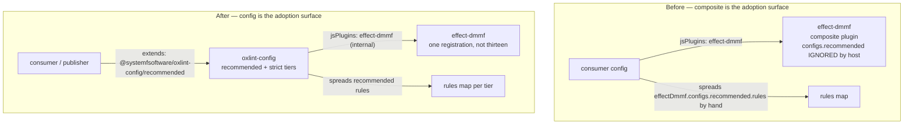
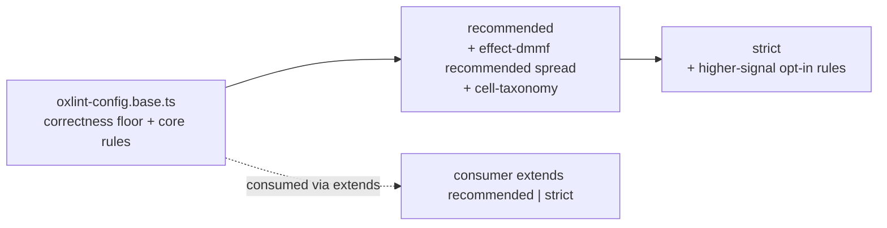
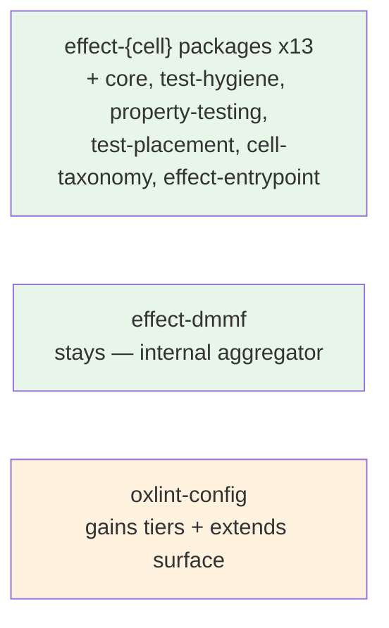

# refactor: oxlint plugin architecture — config-extends adoption topology

**Product Contract preservation:** no upstream Product Contract existed. Authored fresh with
`product_contract_source: ce-plan-bootstrap`. This plan is a SPECIFICATION only — it is not
executed in the session that produced it (the charter was plan-only: research + wiki
augmentation + this plan, no `packages/` changes). It is `implementation-ready` for a future
execution pass.

---

## Summary

A hyper-research run across six lint-plugin ecosystems (ESLint, typescript-eslint, oxlint,
Biome, Stylelint, remark/unified) adjudicated five design questions — plugin scoping, rule
count, single responsibility, re-export composability, incremental adoption — against this
repo's wiki. The verdict: **the current architecture is mostly right; the shareable config that
already does the composition work is under-exposed as the adoption surface, and the repo ships
no escalating config tiers.**

What is right and stays: plugins are scoped one-per-architecture-cell (each a distinct
capability answering "of what?"), each carries an obligation rule, severity is `error`. This
is `package-by-feature` and the cell taxonomy, and the research found every pluggable host
does the same — one plugin per domain.

What is under-exposed: the **consumer-facing composition artifact is a composite _plugin_**
(`effect-dmmf`) when oxlint's host-native and ecosystem-consistent composition mechanism is a
shareable **config** consumed via `extends`. The consumer always faced `oxlint-config` (which
registers `effect-dmmf` and spreads its rules), so this is not a backwards state to repair but
an under-exposed one to publish: `oxlint-config` should be the named adoption surface, not an
internal file the composite happens to sit behind. oxlint's host type is `{ meta?, rules }` and
reads nothing else — `configs` is absent from the type and never dereferenced — so a composite
plugin's `configs.recommended` reaches the consumer only because the config hand-spreads it.
ESLint, Stylelint, and remark/unified all compose at the config/preset layer. The composite is
**legal** (inert, enumerated, no smuggled decision) but **non-idiomatic**, and a registry
census found the composite pattern rare on oxlint: 1 of 28 framework-using `oxlint-plugin-*`
packages re-exports another (`oxlint-plugin-inhuman`); single-domain dominates.

The plan: **elevate the shareable config (`oxlint-config`) to the primary adoption surface**
with escalating tiers (`recommended` → `strict`), **keep `effect-dmmf` as an internal
registration convenience** (one `jsPlugin` to register instead of thirteen, its recommended
set spread by the config — exactly what it does today), keep granular per-cell packages for
incremental opt-in, gate rule count on budgets (`N×p` and **runtime**, the latter a measured
leg the wiki had not addressed), and confirm `error`+baseline severity. Five units; no cell
package is renamed or merged.

---

## Problem Frame

### What is right (and why it stays)

**P-OK1 — Plugins are scoped one per cell.** Each `effect-{cell}/` package owns one
architecture cell — a distinct coordinate tuple with its own keyed rules. This is
`package-by-feature` ([[package-by-feature-not-layer]], `convention`, canon-grounded) and
[[conventions-ruled-without-cell]] (`axiom` V.7 + `convention`): a new package is minted only
for a distinct tuple with a keyed mechanical rule; a second label every rule treats identically
is deleted. The research confirmed every pluggable host scopes one plugin to one domain
(eslint-plugin-react, typescript-eslint, the oxlint-plugin census). **No change.**

**P-OK2 — Each cell carries an obligation rule.** OX-OB1 keeps a rule per cell that fails for
LACKING something, so an empty file cannot pass and the cell does not collapse to a naming
convention. This is the "too few" floor on rule count. **No change.**

**P-OK3 — Severity is `error`.** The base config commits no `warn`. [[warn-severity-is-dominated]]
(`derived`): `warn` is dominated by `error`+a dated baseline on every goal. **No change.**

### What is under-exposed

**P1 — The adoption surface is a composite plugin, not a config.** `oxlint-config.base.ts`
registers `effect-dmmf` as a `jsPlugin` and spreads `effectDmmf.configs.recommended.rules`
into its `rules` map. So the _consumer-facing_ composition artifact is the `effect-dmmf`
plugin's recommended set. But oxlint's host type is `{ meta?, rules }` — `configs` is absent
from the type and never dereferenced ([[composite-plugin-re-export]] A1, `canon`, grounded in
`load.ts`). The composite's `configs.recommended` is therefore inert metadata the host ignores;
the value reaches the consumer only because the config hand-spreads it. The host's _native_
shareable mechanism is config-object `extends` ([[composite-plugin-re-export]] A9, `canon`),
which is the ESLint/Stylelint/remark composition model and the one oxlint actually supports.

**P2 — The composite fights the host in two ways it cannot win.** First, because `configs` is
unread, any consumer who takes `effect-dmmf` directly (not through `oxlint-config`) gets no
recommended set without manual spread — the composite advertises a `configs.recommended` the
host will not apply. Second, the host throws on a duplicate plugin name (a behavior of
`load.ts`'s registration path, not in the captured Plugin-type span), so a composite whose name
overlaps its sources collides unless every rule is re-aliased — the practical reason
`effect-dmmf` re-keys `<source>/<rule>` → `<dmmf/<rule>`. Config composition never triggers
that throw. The aliasing is a workaround for a problem the wrong composition layer creates.

**P3 — Adoption is coarser than the ecosystem expects.** A consumer who wants one cell's rules
today must either install the granular package and bypass the composite, or take the whole
`effect-dmmf` bundle. typescript-eslint, ESLint, and remark all offer escalating named config
tiers (`recommended` → `strict` / `recommended-type-checked`) with semver-stability claims, so
a consumer dials severity/scope without swapping packages. oxlint has the mechanism (`extends`

- per-rule override) but the repo does not expose tiers.

### What the research added (and did not contradict)

**P4 — Rule count has a runtime leg the wiki had not addressed.** [[lint-rules-are-not-instructions]]
(`derived`) refuted "too many rules" as a _context_-cost argument; the real ceiling it named is
`N×p` ([[aggregate-false-positive-budget]]). The research found a _fourth_, non-context cost:
lint runtime scales with rule count × files scanned — ESLint RFC #104 measured 4m39s → 22s on
154,988 LoC by disabling `warn` rules ([[lint-rule-count-runtime-cost]] A1, `measurement`). This
is an addition, not a contradiction: count is still not a fixed ceiling, but an enabled rule
costs its per-file runtime across the scanned tree, which is why disabling (not `warn`) a rule
that should not run is correct — itself a consequence of [[warn-severity-is-dominated]].

### What is not wrong

`effect-dmmf` is not a violation. [[composite-plugin-re-export]] adjudicates that a package MAY
aggregate other plugins' rules when it is inert ([[inert-composition-value]]), enumerated
([[enumerated-exports-only]]), and free of a smuggled decision ([[export-topology]]'s unit
re-export ban reaches signature cells, not package re-exports). `effect-dmmf` meets all three.
The defect is positional — it sits where a config should sit — not existential. remark/unified
presets validate the aggregate pattern in the wider ecosystem; the plan keeps the aggregate,
just not as the adoption surface.

---

## Requirements

| ID | Requirement                                                                                                                                                       | Verified by                                                                                                      |
| -- | ----------------------------------------------------------------------------------------------------------------------------------------------------------------- | ---------------------------------------------------------------------------------------------------------------- |
| R1 | Every plugin package is scoped to one capability (answers "of what?"); no package is renamed or merged by this plan                                               | existing `capability-named-directory` + review; the cell set is unchanged                                        |
| R2 | The primary adoption surface is a shareable config consumed via `extends`, exposing escalating tiers (`recommended`, `strict`)                                    | a consumer/publisher `extends` the config and gets exactly the tier's rules; `oxlint-config` exports both tiers  |
| R3 | `effect-dmmf` is registered as one internal `jsPlugin` and its recommended set is spread by the config — its `configs.recommended` is never relied on by the host | the host's `load.ts` path is unchanged (it cannot read `configs`); the config is the only spread site            |
| R4 | Rule population is gated on budgets, not a number: aggregate false-positive (`N×p`) and runtime (rule count × files), the latter measured                         | a runtime measurement (oxlint equivalent of `--stats`) exists; an enabled-but-unwanted rule is `off`, not `warn` |
| R5 | No committed `warn` severity anywhere in the published config                                                                                                     | config audit finds zero `warn` resting-state entries                                                             |
| R6 | Every gate in `pnpm check` passes; no gate, threshold, or glob is weakened                                                                                        | `pnpm check` exits 0; the diff adds no exemption covering a package this plan touches                            |
| R7 | The published surface stays coherent — exports, api report, publish metadata                                                                                      | `pnpm check:exports`, `pnpm api:check`, `pnpm check:publish-config` green                                        |

---

## Key Technical Decisions

### KTD1 — Scope by capability; keep the per-cell packages unchanged

The plugin unit is one answer of "of what?" — the domain its rules enforce. The per-cell
packages (`effect-{workflow,executor,handler,middleware,acl,adapter,store,state,schema,shape,
policy,kernel,observer}`, plus `core`, `test-hygiene`, `property-testing`, `test-placement`,
`cell-taxonomy`, `effect-entrypoint`) already pass this test: each is a distinct coordinate
tuple with keyed rules ([[package-by-feature-not-layer]], `convention`;
[[conventions-ruled-without-cell]], `axiom`/`convention`). The research found every pluggable
host scopes one plugin per domain; typescript-eslint holds 132 rules in one plugin because they
are all "lint TypeScript" — one responsibility, deep module ([[module-granularity-constraints]]).
**No package is renamed or merged.** Q3 (single responsibility) reduces to this: responsibility
is the shipped domain, not the host-owned entry bag ([[surface-decision-holder]], `posit`).

### KTD2 — The adoption surface is the shareable config, consumed via `extends`

oxlint's host owns the composition mechanism ([[surface-decision-holder]]: the host contract
owns the plugin entry shape; the author owns the shipped scope). That mechanism is config-object
`extends` ([[composite-plugin-re-export]] A9, `canon`, captured from the oxlint config docs), the
ESLint/Stylelint/remark model: a shared package exports a config object the consumer imports and
`extends`, configs merged last-wins. One caveat the capture states explicitly: npm-package
`extends` requires the `oxlint.config.ts` form (package imports are unsupported in
`.oxlintrc.json`); the repo already uses `oxlint.config.ts`, so this is free here. `oxlint-config`
is already a config object; it becomes the **primary** adoption surface: consumers (and the
repo's own packages) `extends` it and get a named tier. This is the enforcement-channel the
corpus ranks ([[enforcement-channel-ordering]]): a config the consumer extends is a stronger,
more deterministic adoption path than a composite plugin whose recommended set the host silently
ignores.

Rejected: making `effect-dmmf` the public adoption surface (P1/P2 — the host cannot read its
`configs`, so it is a dead advertisement); a plugin auto-discovery scan (invents machinery no
requirement asks for — V.7 subtract-before-add).

### KTD3 — `effect-dmmf` stays, as an internal registration convenience

`effect-dmmf` is a legal composite ([[composite-plugin-re-export]]: inert per
[[inert-composition-value]], enumerated per [[enumerated-exports-only]], no smuggled decision).
It is **retained as the single `jsPlugin` the config registers** for the Effect cell family —
one registration instead of thirteen — and its `recommended` set is spread by the config, which
is exactly what `oxlint-config.base.ts` does today. What changes is its **positioning**: it is
an internal aggregator the config consumes, not a public adoption surface. Its `configs.recommended`
is treated as a data convenience the config reads, never as something the host applies
(because the host cannot — P1).

A standalone "all-in-one" publication of `effect-dmmf` remains available for a consumer who
wants one plugin without the config, documented as a convenience, not the default.

### KTD4 — Escalating config tiers: `recommended` → `strict`

`oxlint-config` exposes two named tiers. `recommended` is the current baseline (correctness
floor + the cell rules); `strict` adds the higher-signal rules currently opt-in or off. A
consumer dials scope by choosing the tier, not by swapping packages — the typescript-eslint
model (escalating configs with semver-stability claims). This serves incremental adoption (Q5):
take `recommended` to start, move to `strict` when ready, override individual rules per-file.
Granular per-cell packages remain available for a consumer who wants only one capability
([[enforcement-channel-ordering]]: the strongest channel is the one the consumer cannot bypass;
tiers + per-rule override give fine control without abandoning the config).

The two-tier _shape_ is a `convention` pick among under-determined options, not a ruling the
corpus derives — nothing forbids one tier or three. Two mirrors the typescript-eslint precedent
and is the smallest dial (off → recommended → strict).

### KTD5 — Rule count is gated on budgets, including a measured runtime budget

"Too many rules" has no number; it has two budgets. **Aggregate false positives** (`N×p`,
[[aggregate-false-positive-budget]]): affordability is the product, not the count — a large
near-deterministic rule set is cheap, a small heuristic set is not. **Runtime** (rule count ×
files, [[lint-rule-count-runtime-cost]]): an enabled rule costs its per-file run time across the
scanned tree. The captured runtime figure is ESLint-sourced (RFC #104); the principle generalizes
(every linter pays rule count × files), but an oxlint-specific measurement is a pending capture,
not yet grounded. The repo measures rule runtime (oxlint's timing surface) and treats an
enabled-but-unwanted rule as `off`, never `warn` (a `warn` rule still runs — P4;
[[warn-severity-is-dominated]]). "Too few" remains the OX-OB1 obligation floor. No fixed
rule-count ceiling is introduced (it would contradict [[lint-rules-are-not-instructions]]).

### KTD6 — Severity stays `error` + dated baseline, never `warn`

Direct from [[warn-severity-is-dominated]] (`derived`): for every goal `warn` is chosen for,
`error` + a dated baseline is strictly better. A new violation is blocked today; an old one is
enumerated as shrinking debt. No committed `warn`. This is already the repo's posture; the plan
confirms it and removes any `warn` that crept in.

### KTD7 — No new plugin package, no new gate that weakens

The composition change is config-layer only: `oxlint-config` exports tiers and is consumed via
`extends`; `effect-dmmf` is repositioned, not created or deleted. No new package (a second label
every rule treats identically is deleted, not added — V.7). Any new measurement gate (KTD5
runtime) is an addition that strengthens, not a weakening of an existing threshold ([[aggregate-
false-positive-budget]] is untouched).

---

## High-Level Technical Design

### Adoption topology (before → after)



In `After`, the consumer extends a **config tier**; the composite is an internal aggregator the
config consumes, never a surface the host is asked to apply `configs` from.

### Config tier shape



### What does NOT move



No package is renamed, merged, created, or deleted. One config file gains tiers and an
`extends`-consumable surface; one composite is repositioned in documentation and registration
intent.

---

## Output Structure

```text
packages/oxlint-config/
├── src/
│   ├── oxlint-config.base.ts        # correctness floor + core (largely unchanged)
│   ├── oxlint-config.recommended.ts # NEW tier — base + effect-dmmf recommended spread
│   ├── oxlint-config.strict.ts      # NEW tier — recommended + higher-signal rules
│   └── index.ts                     # exports the three presets for extends consumption
├── package.json                     # exports the tier subpaths
└── oxlint.config.ts
packages/oxlint-plugins/
├── effect-dmmf/                     # UNCHANGED structurally — repositioned as internal aggregator
│   └── README.md                    # clarify: internal convenience, not the adoption surface
└── effect-{cell}/ ...               # UNCHANGED — per-cell packages stay
```

---

## Implementation Units

> These units are a SPECIFICATION for a future execution pass. They are not executed in the
> research/plan session that produced this plan (charter boundary: plan-only).

### Phase A — Make the config the adoption surface

#### U1. Expose escalating config tiers and an `extends`-consumable surface

**Goal** — `oxlint-config` exports `recommended` and `strict` presets consumable via
`extends`, with the `effect-dmmf` recommended set spread internally (its current behavior),
not relied on as a host-applied `configs`.

**Requirements** — R2, R3, R7.

**Dependencies** — none.

**Files**

- `packages/oxlint-config/src/oxlint-config.recommended.ts` (create — factors the current base rule spread into a named tier)
- `packages/oxlint-config/src/oxlint-config.strict.ts` (create — recommended + higher-signal rules)
- `packages/oxlint-config/src/index.ts` (modify — export the presets)
- `packages/oxlint-config/package.json` (modify — export tier subpaths)
- `packages/oxlint-config/tsdown.config.ts` (modify — exports come from tsdown, never hand-edited per REPO-S4)

**Approach** — The current `oxlint-config.base.ts` already spreads
`...effectDmmf.configs.recommended.rules`. Factor that into `recommended` (the current effective
set) and add `strict` (recommended plus rules currently `off`/opt-in that the corpus rates
high-signal). Export both as named presets so a consumer writes
`extends: ['@systemfsoftware/oxlint-config/recommended']`. `effect-dmmf` remains the single
registered `jsPlugin` for the Effect family (KTD3); its `configs.recommended` is read by the
config, never by the host.

**Patterns to follow** — the existing `oxlint-config.base.ts` registration; typescript-eslint's
`recommended`/`strict` tier split.

**Verification** — `pnpm --filter @systemfsoftware/oxlint-config test`; a consumer config that
`extends` the recommended tier gets exactly its rules; `pnpm check:exports`, `pnpm api:check`,
`pnpm check:publish-config` green.

---

#### U2. Reposition `effect-dmmf` in documentation and registration intent

**Goal** — `effect-dmmf`'s README and the leaf `AGENTS.md` record that it is an internal
registration aggregator the config consumes, not a public adoption surface; its
`configs.recommended` is a data convenience the config reads, not a host-applied set.

**Requirements** — R3.

**Dependencies** — U1.

**Files**

- `packages/oxlint-plugins/effect-dmmf/README.md` (modify)
- `packages/oxlint-plugins/AGENTS.md` (modify — the `effect-dmmf` row of the Package Deltas table)

**Approach** — No code change to `effect-dmmf/src/index.ts` (it is already a correct inert,
enumerated composite). The change is doctrinal: state, in the artifact a consumer reads, that
the host does not read `configs` ([[composite-plugin-re-export]] A1), so a consumer takes the
config tier, not the composite's `configs`. Cite the wiki ruling.

**Verification** — review; the README names the host constraint and points at
`oxlint-config`'s tiers as the adoption path.

---

### Phase B — Budget-based rule gating

#### U3. Add a rule-runtime measurement and adopt budget gating

**Goal** — Rule population decisions cite two budgets (`N×p`, runtime), not a count; a
rule-runtime measurement (oxlint equivalent of `--stats`) is available; enabled-but-unwanted
rules are `off`, never `warn`.

**Requirements** — R4, R5.

**Dependencies** — U1.

**Files**

- `packages/oxlint-config/src/oxlint-config.strict.ts` (the tier where runtime-sensitive rules live)
- a measurement note in `packages/oxlint-plugins/AGENTS.md` recording the runtime budget and the wiki ruling it rests on

**Approach** — Measure rule runtime on the repo's own tree (oxlint's timing surface, or a
captured run under `raw/runs/` per the wiki's measurement convention). Gate any rule whose
runtime is unjustified by its signal at `off` (not `warn`). Record the budget decision with a
pointer to [[aggregate-false-positive-budget]] and [[lint-rule-count-runtime-cost]]. Introduce
no fixed count ceiling (it would contradict [[lint-rules-are-not-instructions]]).

**Verification** — no committed `warn` in the published config (R5); the measurement is
captured and dated; `pnpm check` green.

---

### Phase C — Verify

#### U4. Full gate + surface coherence

**Goal** — Every gate passes; no threshold weakened; published surface coherent.

**Requirements** — R6, R7.

**Dependencies** — U1, U2, U3.

**Verification** — `pnpm check` exits 0; `pnpm check:exports`, `pnpm api:check`,
`pnpm check:publish-config` green; the diff adds no exemption covering a touched package;
`pnpm --filter <pkg> mutation` unaffected (no rule logic changed).

---

## Grounding — every decision names the ruling it rests on

| Decision                                    | Ruling (wiki)                       | Band             | Relationship                 |
| ------------------------------------------- | ----------------------------------- | ---------------- | ---------------------------- |
| KTD1 scope by capability                    | [[package-by-feature-not-layer]]    | convention       | DIRECT                       |
| KTD1 mint only for a distinct tuple         | [[conventions-ruled-without-cell]]  | axiom/convention | DIRECT                       |
| KTD1 single responsibility = shipped domain | [[surface-decision-holder]]         | posit            | DIRECT                       |
| KTD2 config-extends is host-native          | [[composite-plugin-re-export]] A9   | canon            | EXTENDS (new page)           |
| KTD2 host owns composition mechanism        | [[surface-decision-holder]]         | posit            | DIRECT                       |
| KTD2 stronger adoption channel              | [[enforcement-channel-ordering]]    | posit            | DIRECT                       |
| KTD3 composite legal iff inert+enumerated   | [[composite-plugin-re-export]]      | posit/derived    | EXTENDS (new page)           |
| KTD3 inert aggregate                        | [[inert-composition-value]]         | posit            | DIRECT                       |
| KTD3 enumerated, no wildcard                | [[enumerated-exports-only]]         | decision         | DIRECT                       |
| KTD3 unit re-export ban is a unit rule      | [[export-topology]]                 | posit            | DIRECT                       |
| KTD4 escalating tiers (shape)               | typescript-eslint precedent         | convention       | convention pick, not derived |
| KTD5 N×p budget                             | [[aggregate-false-positive-budget]] | derived          | DIRECT                       |
| KTD5 runtime budget                         | [[lint-rule-count-runtime-cost]]    | measurement      | EXTENDS (new page)           |
| KTD5 count is not the axis                  | [[lint-rules-are-not-instructions]] | derived          | DIRECT                       |
| KTD6 error+baseline, never warn             | [[warn-severity-is-dominated]]      | derived          | DIRECT                       |
| KTD7 no new package / subtract first        | CONSTITUTION V.7                    | axiom            | DIRECT                       |

**No claim rests on a ruling the wiki contradicts.** The two EXTENDS rulings
([[composite-plugin-re-export]], [[lint-rule-count-runtime-cost]]) were added by the research
that produced this plan, grounded in captured primaries (oxlint `load.ts`; oxlint config docs;
ESLint RFC #104) and derived from existing bedrock; all pass `deno task warrant` with zero
findings. Where a claim rests on a `posit` atom (KTD1 responsibility, KTD3 parents, KTD2 channel
ordering) it is named as such; the one central architectural decision (KTD2) rests on A9, now
`canon` after the post-review capture of the oxlint config docs.

---

## Research provenance

This plan rests on a hyper-research (light tier) report at
`/tmp/oxlint-plugin-research/notes/final_report_oxlint-plugin-architecture.md` and the wiki
ground artifact at `local://oxlint-plugin-research-ground.md`. Primary sources captured to
`wiki/raw/`: oxlint `load.ts` (Plugin interface), oxlint config docs (the `extends` mechanism),
ESLint RFC #104 (runtime figure), the remark preset aggregate, the typescript-eslint shared-configs
tiers, and a registry census of 41 `oxlint-plugin-*` packages (single-domain dominates; 1 composite,
`oxlint-plugin-inhuman`). The one remaining uncaptured primary (Biome's all-or-nothing pole) is
cited in the Q5 wiki page as a posit atom, primary identified.
