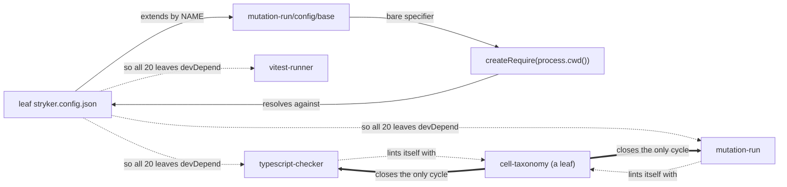
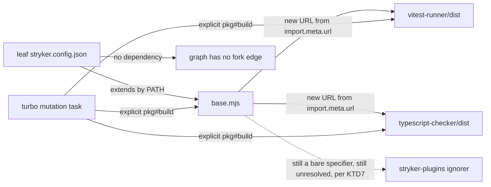
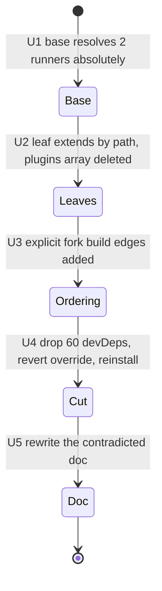

# refactor: make the shared Stryker base self-locating so the workspace graph cannot cycle

**Product Contract preservation:** no upstream Product Contract existed. Authored fresh with
`product_contract_source: ce-plan-bootstrap`. Scope was confirmed with the user before writing.

---

## Summary

The 20 oxlint plugin packages each devDepend on three packages of the self-hosted Stryker fork
for one reason only: the shared base preset names its runner plugins as **bare specifiers**, and
those are resolved against **the consuming package**. That single indirection is what puts 60
edges into the workspace graph and lets a lint plugin and its own mutation toolchain form a
cycle.

This plan removes the cause rather than gating the symptom. The base preset resolves its two
runner plugins from its own module URL, so no consumer needs a dependency to reach them. Four
leaf configs then lose a `plugins` array they were duplicating from the base anyway, and 60
devDependencies are deleted. Build ordering moves to explicit task-level edges in turbo, which is
where the real dependency has always lived — on built output, not on a package identity.

The result is that the cycle stops being _detectable_ and starts being _unrepresentable_. No new
gate is added; turbo's existing hard cycle failure, already inside `pnpm check`, remains the
enforcement.

---

## Problem Frame

### The mechanism

`packages/stryker-js/mutation-run/src/config/base-preset.ts:14-18` declares:

```
plugins: [
  '@systemfsoftware/stryker-js-vitest-runner',
  '@systemfsoftware/stryker-js-typescript-checker',
  '@systemfsoftware/stryker-plugins/effect-schema-ignorer',
]
```

Those are bare specifiers. `packages/stryker-js/mutation-run/src/config/module-loader.ts:7-11`
routes `./`, `/`, and `file://` strings straight to `import()`, and sends **everything else**
through `createRequire(process.cwd() + '/noop.js').resolve()`. The Stryker CLI never calls
`process.chdir` (`packages/stryker-js/cli/src/main.ts`), so `process.cwd()` is the consuming
package. Therefore each consumer must carry the runners as its own dependencies for the base
preset to resolve — and that is the entire reason the 60 edges exist.

The file's own doc comment states the consequence and treats it as inherent. It is not: the
loader already accepts absolute paths and `file://` URLs on the same code path.

### Why this is a graph defect, not a build defect

Turbo derives `build` -> `build` task edges from the pnpm workspace graph, and that graph
includes devDependencies. A lint plugin dev-depending on the toolchain that mutation-tests it is
legitimate at the package level and false at the build level: nothing in the plugin's build
consumes the fork's `dist`. Under the project's own doctrine an arrow that carries no data is not
an edge, so the correct repair is to stop asserting the arrow — not to subtract it per consumer
after the fact.

### Measured state

| Fact                                                            | Value                                                                                                                                                    |
| --------------------------------------------------------------- | -------------------------------------------------------------------------------------------------------------------------------------------------------- |
| Packages under `packages/oxlint-plugins/` with a `package.json` | 22                                                                                                                                                       |
| Of those, carrying all three fork devDeps                       | 20 (`effect-dmmf` and `recommended` carry none)                                                                                                          |
| Workspace edges removed                                         | 60                                                                                                                                                       |
| Plugin **source** files importing any fork package              | 0 — the 41 matching files are 20 `package.json`, 20 `stryker.config.json`, and `recommended/scripts/guard-no-behavior.mjs` (a forbidden-dependency list) |
| Packages on a **closed** cycle                                  | 1 — `cell-taxonomy` only                                                                                                                                 |
| Fork packages with a back edge to a plugin                      | 3 — `mutation-run`, `typescript-checker`, `mutation-report`, all to `cell-taxonomy`                                                                      |
| Reference sites per plugin                                      | 2 (`extends`, `plugins`) — the `mutation` script needs no change                                                                                         |

The `stryker` binary is **not** a plugin-level edge: it comes from the root devDep
`@systemfsoftware/stryker-js-cli: workspace:^`, linked at `node_modules/.bin/stryker`. Nothing
depends on the root, so that edge cannot participate in a cycle.

### Only one of the 20 is actually cyclic

A forward edge alone cannot cycle; it needs a return path. Measured this session with a Tarjan SCC
pass over all 95 workspace packages, the only non-trivial SCC in our tree is
`{mutation-run, typescript-checker, cell-taxonomy}` — three fork packages lint themselves with
`cell-taxonomy`, which is itself one of the 20 leaves. `vitest-runner` has **no** back edge to any
plugin. `stryker-js-cli` devDepends `effect-entrypoint` and `test-placement`, but only the repo
root depends on `cli` and nothing depends on the root, so that path is a dead end.

So **R1's minimum change set is one package.** The other 19 plugins' 57 edges are acyclic one-way
devDeps that no `pnpm install` warning names today. R2's 20-package sweep is therefore deliberate
_uniformity_ scope — it makes the false-edge class uniformly absent rather than fixing a live
failure in 19 packages — and it is the reason the lockfile refresh perturbs unrelated resolutions.
That split is stated here so the sizing is auditable rather than implied.

### A dead ignorer this plan deliberately does not fix

`@systemfsoftware/stryker-plugins/effect-schema-ignorer` is `MODULE_NOT_FOUND` from **all 20**
plugin directories — none of them declares that package, and it is absent from every
`node_modules` on their lookup chain. Only `omp-claude-compat`, `effect-daemon-spec`, and
`hex-schema` declare it.

Measured, the 20 split cleanly in two:

| Shape                                          | Count | Effective state today                                                                                                                                      |
| ---------------------------------------------- | ----- | ---------------------------------------------------------------------------------------------------------------------------------------------------------- |
| `plugins` and `ignorers` keys both absent      | 16    | inherit all three base plugins **and** the base's `ignorers: ['effect-schema-declarations']`; the ignorer plugin fails to load, so the ignorer never fires |
| `plugins` = 2 runner entries, `ignorers: null` | 4     | the leaf array replaces the base's, so the third entry is never requested; `null` deletes the inherited `ignorers` key                                     |

`mergeConfigs` (`resolve-extends.ts:69-85`) replaces arrays wholesale and treats a `null` child
value as a key deletion, and `loadPlugin` (`plugin-loader.ts:187-203`) catches every load failure,
logs a warning, and returns `undefined` for the caller to filter out. So the missing plugin is a
warning in 16 packages and never a failure — proven by the code and, independently, by those 16
passing mutation today.

This inverts the obvious move. Making the ignorer resolvable would make it _activate_ in those 16
packages, converting counted mutants into Ignored ones and putting OX-MG1's zero-Ignored rule at
risk. So U1 resolves **only the two runners** and leaves the ignorer a bare specifier, preserving
today's effective behaviour exactly. `stryker-plugins` is not one of the 60 edges, so the cycle
fix never needed to touch it.

---

## Requirements

- **R1** — The pnpm workspace graph contains no cycle: `pnpm install` emits no
  `WARNING There are cyclic workspace dependencies`, and turbo constructs the task graph without
  `Cyclic dependency detected`.
- **R2** — No oxlint plugin package declares a dependency on any `@systemfsoftware/stryker-js-*`
  or `@systemfsoftware/stryker-plugins` package.
- **R3** — Every one of the 20 packages still resolves and loads the vitest runner and the
  TypeScript checker when its mutation run executes, and the effect-schema ignorer stays exactly
  as it is today: requested by 16 packages, unresolvable, warned, and skipped.
- **R4** — Mutation ordering remains correct: a mutation run never executes against absent or
  stale fork `dist` output.
- **R5** — No new enforcement gate, `scripts/` entry, or `pnpm check` step is introduced. R1's
  enforcement is turbo's existing hard cycle failure.
- **R6** — Mutation semantics are unchanged: each package's `mutate` globs and effective
  `ignorers` value are untouched, no package gains or loses an _active_ ignorer, and every package
  still satisfies OX-MG1 (exit 0, zero Ignored, Survived, and NoCoverage).
- **R7** — The solution doc whose rationale this change contradicts is corrected in the same
  change, not left asserting a superseded mechanism.

---

## Key Technical Decisions

**KTD1 — Resolve siblings by URL arithmetic from `import.meta.url`, then convert to a path.**
`fileURLToPath(new URL('../../../vitest-runner/dist/index.mjs', import.meta.url))` is deterministic
and cwd-independent. The `fileURLToPath` step is load-bearing, not cosmetic: `String(new URL(...))`
begins with `file://`, and `path.isAbsolute()` returns **false** for it, so a raw URL would fail
U1's own absolute-entry assertion. `import.meta.resolve()` is rejected: it re-enters package
resolution and so would reintroduce the dependency requirement this plan exists to remove.

**KTD2 — One path expression is correct under both resolution conditions, because of depth
parity.** The package exports `./config/base` as `./src/config/base-preset.ts` under the
`@systemfsoftware/source` condition and `./dist/config/base.mjs` by default. Both are exactly two
levels below the package root, so `../../../<sibling>/...` resolves identically from either. This
parity is load-bearing and is asserted by a test in U1 rather than left as a comment.

**KTD3 — `extends` uses a relative path; plugin paths do not.** Verified in the fork's source:
`extends` resolves relative paths against the **declaring config's own directory**
(`packages/stryker-js/mutation-run/src/config/resolve-extends.ts`), which is stable and
committable — so leaf configs use `../../stryker-js/mutation-run/dist/config/base.mjs`. Plugin
entries resolve relative paths against **`process.cwd()`**, which is not stable, so plugin paths
are never written relatively in a committed config; they are computed absolutely inside the base.
`extends` additionally rejects the `file://` scheme, so a plain path is the only correct form
there.

**KTD4 — `extends` targets `dist`, not `src`.** A path bypasses the export map, so the
`@systemfsoftware/source` condition no longer applies. This matches today's behaviour: the
`source` condition is a TypeScript-resolution condition, and the Node process running Stryker
already resolved `./config/base` to `dist/config/base.mjs`.

**KTD5 — Ordering is expressed as explicit `<pkg>#build` edges on the `mutation` task.** With the
package edges gone, root `turbo.json`'s `"mutation": { "dependsOn": ["^build"] }` no longer
reaches the fork. `^build` is kept — it still correctly orders each package's own workspace
dependencies — and explicit fork edges are added beside it. This is the honest edge: it names
built output, which the run genuinely consumes.

**KTD6 — No cycle gate is added.** Turbo already fails hard on a cyclic task graph and already
runs inside `pnpm check`; that is the gate. Adding a dedicated cycle check would be pure
accretion, and a larger agent-writable enforcement surface is a measured hazard, not tidiness. It
would also require an Evaluator-surface commit to `scripts/guard-script-provenance.mjs` for no
new coverage.

**KTD7 — `ignorers` is not touched, and the ignorer plugin stays unresolvable.** OX-MG2 constrains
that field and OX-MG1 requires zero Ignored mutants. 16 packages already carry the base's active
`ignorers: ['effect-schema-declarations']` while the plugin providing it fails to load, so making
it resolvable would newly activate it and convert counted mutants into Ignored ones. The ignorer
therefore keeps its bare specifier: same warning, same skip, same mutant set.

**KTD8 — This introduces the repo's first path-reference convention.** The precedent scan found
none: every cross-package reference today is a bare name. Accepted deliberately, because the
resolver is the strongest available enforcement rung, and recorded in U5 so the next author finds
a stated convention rather than an anomaly.

---

## High-Level Technical Design

Resolution today — the consumer is on the resolution path, which is what creates the edge:



After: resolution closes inside the fork, and the consumer leaves the path entirely.



Landing order matters, because two intermediate states are broken:



Reordering U4 before U1/U2 removes the devDeps while the base still names its runners as bare
specifiers resolved against each consumer; reordering U4 before U3 lets a mutation run start
against unbuilt fork `dist`.

---

## Implementation Units

### U1. Make the shared base preset self-locating

**Goal:** the base preset resolves its two runner plugins from its own module URL, so no consumer
needs a dependency to reach them.

**Requirements:** R3, and the precondition for R1/R2.

**Dependencies:** none.

**Files:**

- `packages/stryker-js/mutation-run/src/config/base-preset.ts` (modify)
- `packages/stryker-js/mutation-run/test/unit/base-preset.spec.ts` (create — the package's
  convention, confirmed: 11 existing `test/unit/*.spec.ts` files)

**Approach:** replace the two runner bare specifiers with absolute paths derived from
`import.meta.url`. From `<pkg>/{src,dist}/config/`, the sibling targets are
`../../../vitest-runner/dist/index.mjs` and `../../../typescript-checker/dist/index.mjs`. Leave
`@systemfsoftware/stryker-plugins/effect-schema-ignorer` as the bare specifier it is today, per
KTD7 — it is unresolvable from all 20 plugin directories, `loadPlugin` warns and skips it, and
making it resolvable would change 16 packages' mutant sets. Replace the file's existing comment,
which states the cwd-relative behaviour as inherent, with one naming the depth-parity invariant
from KTD2 and the deliberate exception for the third entry.

**Patterns to follow:** `packages/stryker-js/mutation-report/test/unit/stryker-plugins.spec.ts:12`
already uses `new URL('../../dist/stryker-plugins.mjs', import.meta.url)` for exactly this kind
of self-location.

**Execution note:** write the resolution test first — it is the only thing standing between this
design and a silent breakage when a build layout changes.

**Test scenarios:**

- Both resolved runner paths point at a file that exists on disk after the fork is built. Fails if
  a sibling's output path or the preset's own depth changes.
- Both runner entries are absolute — asserting the property that makes them cwd-independent, not
  the literal strings.
- The third entry is still a bare specifier: neither absolute nor prefixed with `./` or `../`.
  This pins KTD7, so a future author who "completes" the conversion cannot silently change 16
  packages' mutant sets.
- The `src/config/` and `dist/config/` forms produce the same sibling targets, pinning the KTD2
  depth-parity invariant that one expression depends on.
- No entry begins with `file://` — the plugin loader would in fact accept that form, but
  `path.isAbsolute()` is false for it, so it would break the absolute-entry property above. This
  pins KTD1's `fileURLToPath` step against a future author "helpfully" converting these to URLs.

**Verification:** `pnpm --filter @systemfsoftware/stryker-js-mutation-run test` exits 0; the fork
builds; one representative plugin's mutation run loads both runners and logs the same "Cannot find
plugin" warning for the ignorer as it does today.

---

### U2. Repoint the 20 leaf configs at a path and drop the four redundant plugins arrays

**Goal:** leaf configs stop naming fork packages, and the four that duplicate a plugin list the
base already owns stop doing so.

**Requirements:** R2, R3, R6.

**Dependencies:** none hard. U1 is a landing-order preference, not a requirement: landing U2 first
merely makes those four packages request the base's three entries — the same warned-and-skipped
shape the other 16 already run — and the runners still resolve through consumer devDeps until U4.
The hard constraints are U1+U2+U3 before U4, and U4 before U5.

**Files:**

- `stryker.config.json` in each of the 20 packages under `packages/oxlint-plugins/` carrying fork
  devDeps — `cell-imports`, `cell-taxonomy`, `core`, `effect-acl`, `effect-adapter`,
  `effect-entrypoint`, `effect-executor`, `effect-handler`, `effect-kernel`, `effect-middleware`,
  `effect-observer`, `effect-policy`, `effect-schema`, `effect-shape`, `effect-state`,
  `effect-store`, `effect-workflow`, `property-testing`, `test-hygiene`, `test-placement`. Exclude
  `effect-dmmf` and `recommended`, which carry none.
- Of those, only `cell-taxonomy`, `core`, `effect-schema`, and `test-hygiene` have a `plugins`
  array to delete. The other 16 have no `plugins` key at all and change only their `extends`.

**Approach:** in all 20, set `extends` to `../../stryker-js/mutation-run/dist/config/base.mjs` —
resolved against the config's own directory per KTD3. In the four that carry one, delete the
`plugins` array so the base's list applies; those four keep their `ignorers: null`, which deletes
the inherited `ignorers` key exactly as it does today. Leave `mutate`, `vitest`,
`coverageAnalysis`, and `ignorers` byte-identical in all 20, per KTD7.

**Patterns to follow:** the existing shape of
`packages/oxlint-plugins/cell-taxonomy/stryker.config.json`; change only the two target keys.

**Test scenarios:** this unit has a real behavioural surface for the four packages that lose a
`plugins` array — they go from requesting two plugins to requesting three, the third being the
unresolvable ignorer. So verify per shape rather than declaring none:

- On one of the four (`cell-taxonomy`): the mutation run loads both runners, warns on the ignorer,
  and reports the same score, killed count, and zero Ignored as before the change.
- On one of the 16 (`effect-workflow`): the outcome is unchanged — this shape moves only its
  `extends` string, and the assertion is that nothing else moved with it.
- The resolved `extends` target exists: `packages/stryker-js/mutation-run/dist/config/base.mjs` is
  reachable from a leaf config's own directory after a fork build.

**Verification:** the two spot runs above, one per shape, both exiting 0 with unchanged scores.

---

### U3. Express fork build ordering as explicit task edges

**Goal:** mutation runs stay correctly ordered after the package edges are gone.

**Requirements:** R4.

**Dependencies:** U1, U2.

**Files:** `turbo.json` (modify the `mutation` task, lines 82-102)

**Approach:** keep `"^build"` and add explicit
`@systemfsoftware/stryker-js-mutation-run#build`,
`@systemfsoftware/stryker-js-vitest-runner#build`, and
`@systemfsoftware/stryker-js-typescript-checker#build` to the `mutation` task's `dependsOn`. All
three are load-bearing: `mutation-run` because U2 points `extends` at its built
`dist/config/base.mjs`, and the two runners because U1 points at their built `dist/index.mjs`.
`@systemfsoftware/stryker-plugins` is deliberately **not** listed — no oxlint plugin loads it, per
KTD7. `^build` still correctly orders each package's own workspace dependencies; the explicit
edges replace only what the removed devDeps used to imply. Land this **before** U4 so no window
exists in which mutation can run against unbuilt fork output.

**Patterns to follow:** `packages/stryker-js/vitest-runner/turbo.json` and
`packages/arethetypeswrong/cli/turbo.json` both already use a task-level `dependsOn` override of
the form `["^build", "build"]` — this is the same instrument, addressed at named packages.

**Test scenarios:** `Test expectation: none — task-graph configuration.` Proven by U4's clean-cache
run, where a missing edge manifests as a mutation run failing on absent fork `dist`.

**Verification:** `pnpm turbo run mutation --filter @systemfsoftware/oxlint-plugin-cell-taxonomy --dry=json`
shows `mutation-run#build`, `vitest-runner#build`, and `typescript-checker#build` as dependencies
of the mutation task.

---

### U4. Drop the 60 devDependencies, revert the override, and prove the graph is acyclic

**Goal:** the edges are gone, the per-consumer workaround is gone, and the absence of the cycle
is demonstrated rather than assumed.

**Requirements:** R1, R2, R5, R6.

**Dependencies:** U1, U2, U3.

**Files:**

- `package.json` in each of the 20 packages listed in U2 (remove the three fork devDeps)
- `packages/oxlint-plugins/cell-taxonomy/turbo.json` (delete the file — removing the
  `"build": { "dependsOn": [] }` override leaves it configuring nothing, per Q3)
- `pnpm-lock.yaml` (regenerated, not hand-edited)

**Approach:** remove exactly the three fork devDeps from each package, leaving every other
dependency untouched. Revert the override only in this unit — reverting it while the cycle still
exists would make turbo fail hard. Then refresh the lockfile with a real resolution pass; a
frozen install cannot express a dependency removal. Do not touch
`minimumReleaseAgeExclude` (REPO-S2) or any catalog entry.

**Execution note:** the proof of this unit is a _clean-cache_ run. A cached turbo run can pass
while the task graph is still wrong, because the graph is constructed before any task executes.

**Test scenarios:** `Test expectation: none — dependency-graph change, with no code under test.`
Its proof is the verification below, which is an observation of the real graph rather than a
test asserting the change was typed correctly.

**Verification:**

- `pnpm install --no-frozen-lockfile` completes with **no** `cyclic workspace dependencies`
  warning, then `pnpm install --frozen-lockfile` exits 0 against the regenerated lock.
- Turbo constructs the graph with no `Cyclic dependency detected` and no `ELIFECYCLE`.
- All 20 packages lint clean, and `pnpm --filter <pkg> mutation` exits 0 for each with zero
  Ignored, Survived, and NoCoverage (OX-MG1).
- `pnpm check:lint-coverage` still exits 0 — the three fork packages remain exempt for their
  stated reason and this change must not alter that.

---

### U5. Correct the contradicted solution doc and record the convention

**Goal:** the repo does not carry a doc whose rationale this change refutes, and the new
convention is stated where the next author will find it.

**Requirements:** R7, KTD8.

**Dependencies:** U4.

**Files:**

- `packages/oxlint-plugins/AGENTS.md` (one sentence: the `Cannot find plugin` warning for the
  effect-schema ignorer is deliberate and must not be "fixed" by declaring
  `@systemfsoftware/stryker-plugins` as a devDependency, which would activate the ignorer and
  break OX-MG1 — this is the leaf a plugin maintainer actually reads when the warning appears)
- `docs/solutions/build-errors/turbo-build-cycle-from-self-hosted-devdeps.md` (rewrite)
- `packages/stryker-js/mutation-run/AGENTS.md` (add the delta stating that the base preset
  resolves siblings by URL arithmetic and why a bare specifier must not be reintroduced)

**Approach:** the existing doc's prescription — a per-consumer `dependsOn: []` override — is now
wrong, and its rationale, that the mutual devDep graph is load-bearing, is now false. Rewrite it
to record what actually happened: the diagnosis it got right (turbo derives build edges from
devDependencies, and a task-graph cycle is a masking failure that hides every other failure), the
remedy it got wrong, and why the root cause was a bare specifier resolved against the consumer.
Keep the masking-failure lesson — it was correct and was independently confirmed. Add the
accretion note: the override multiplied per consumer, which is what made it the wrong rung.

**Patterns to follow:** sibling docs in `docs/solutions/build-errors/`; keep the existing
frontmatter contract (`category`, `module`, `severity`, `symptoms`, `tags`, `problem_type`,
`resolution_type`).

**Test scenarios:** `Test expectation: none — documentation.` Doctrine is never an input to a
gate in this repo, so no check may parse it.

**Verification:** the doc no longer prescribes the reverted override; the `AGENTS.md` delta names
the invariant; no `scripts/` file reads either (`pnpm check:script-provenance` exits 0).

---

## Scope Boundaries

**In scope:** the three fork references reachable from the 20 oxlint plugin packages, the turbo
task ordering that replaces the removed package edges, the reverted override, and the doc that
contradicts the result.

**Not in scope:**

- Approach B (depending on the _published_ fork, rustc's `stage0` shape) — rejected because
  mutation testing would then run against the last published fork rather than the working copy,
  and `minimumReleaseAge: 1440` plus human-controlled publish puts a 24h wall in front of every
  fork iteration.
- Approach C (keep the per-consumer override) — rejected as the accretion this plan removes.
- **Fork-side reverse-edge fix** — surfaced by adversarial review _after_ the A/B/C approach
  decision was taken, so it was never weighed against it. All three fork packages that close the
  cycle load `cell-taxonomy` via `import.meta.resolve('@systemfsoftware/oxlint-plugin-cell-taxonomy')`
  in their own `oxlint.config.ts`; oxlint 1.77.0 accepts a bare filesystem path there with no
  `package.json` edge (live-verified this session). Converting those three entries to path-based
  URLs and dropping the three back devDeps breaks the **only** closed cycle in roughly six files,
  introduces no consumer-side convention, and leaves the 57 acyclic edges untouched. It satisfies
  R1 but **not** R2: the false-edge class stays representable, and the 60 install-time edges
  remain. See Open Questions — this is a live scope decision, not a settled rejection.
- Native Rust rules — `oxlint`'s rule registry is a closed generated enum with no third-party
  ABI, the only path is a PR into `oxc`, and it would cost the JS `RuleTester`.
- `dependency-cruiser` adoption — it detects **module** and **folder** cycles only; its schema
  scope enum is exactly `["module","folder"]`, so it cannot see a package-level cycle at all, and
  it does not traverse `import.meta.resolve`. It remains the right instrument for a different
  question.
- Any change to `mutate` globs, `ignorers`, mutation thresholds, or scores.

### Deferred to Follow-Up Work

- The other three `@systemfsoftware/stryker-plugins` consumers (`omp-claude-compat`,
  `effect-daemon-spec`, `hex-schema`) still reference fork packages by name. They are not cycle
  participants today, so they are out of this change; converting them would be a consistency pass.
- The `ignorers: null` departure from OX-MG2's stated `do` predates this plan and is left as
  found (KTD7).
- `effect-schema-ignorer` is dead configuration in 16 packages: they request the base's
  `ignorers: ['effect-schema-declarations']` while the plugin providing it cannot resolve. Fixing
  it is a mutation-semantics change — it would activate the ignorer and convert counted mutants
  into Ignored ones across 16 packages — so it needs its own change, its own OX-MG1
  reconciliation, and its own score review. Do not fold it into this one.
- The 20 packages' mutation configs remain individually maintained; centralising more of them into
  the base is a separate consolidation question.

---

## Assumptions

- **A1** — `packages/stryker-js/mutation-run`'s built output stays at `dist/config/base.mjs`, two
  levels below the package root. U1's test pins this rather than trusting it.
- **A2** — Loading a plugin by absolute path leaves its own imports resolving from its own
  location, so the runners continue to reach their `vitest` and `typescript` dependencies. Proven
  by U4's mutation sweep.
- **A3 (resolved during planning — no longer an assumption)** — `mergeConfigs`
  (`resolve-extends.ts:69-85`) replaces arrays wholesale, excluding arrays from its object-merge
  predicate via `!Array.isArray` on both sides, and treats a `null` child value as a key deletion.
  Verified by reading; it is what makes the 16/4 split exact rather than inferred.

---

## Risks & Dependencies

| Risk                                                            | Likelihood | Impact                                  | Mitigation                                                                                                               |
| --------------------------------------------------------------- | ---------- | --------------------------------------- | ------------------------------------------------------------------------------------------------------------------------ |
| A build-layout change silently breaks sibling resolution        | Low        | High — every mutation run fails at once | U1's existence test fails immediately and loudly; the invariant is stated in `AGENTS.md`                                 |
| A future author "fixes" a path back to a bare specifier         | Medium     | High — reintroduces all 60 edges        | The `AGENTS.md` delta names the prohibition and the reason; turbo's cycle failure catches the graph consequence          |
| A missing explicit turbo edge lets mutation run on stale `dist` | Medium     | Medium — confusing false results        | U3 lands before U4, and U4's proof is a clean-cache run                                                                  |
| Lockfile refresh perturbs unrelated resolutions                 | Low        | Medium                                  | Diff the lock for changes outside the 20 packages before committing; do not touch catalogs or `minimumReleaseAgeExclude` |
| A future author "completes" U1 by making the ignorer absolute   | Medium     | High — 16 packages' mutant sets change  | KTD7 states the reason; U1's test asserts the third entry stays a bare specifier                                         |

**External dependency:** a full green `pnpm check` is **blocked on a host reboot**, for a cause
outside this repo — the Manjaro upgrade replaced the kernel modules tree, so the running kernel
`6.12.77` has no modules directory (only `6.12.101` is on disk), `xt_addrtype` cannot load,
`dockerd` cannot install its NAT rules, and the `test:contract` lane therefore cannot start a
container. This plan does not cause it and cannot fix it.

---

## Alternatives Considered

| Alternative                                                               | Why not                                                                                                                                                                                                      |
| ------------------------------------------------------------------------- | ------------------------------------------------------------------------------------------------------------------------------------------------------------------------------------------------------------ |
| Published `stage0` (rustc's mechanism)                                    | Strongest isolation, but mutation would test the last published fork, not the working copy — the exact lag self-hosting exists to avoid                                                                      |
| Checked-in built output (TypeScript's `lib/`, ESLint's `lib/`)            | Same publish-lag class, plus a large generated diff in every fork change                                                                                                                                     |
| A dedicated workspace-cycle gate script                                   | Pure accretion; turbo already fails hard on the cycle inside `pnpm check`, and adding a `scripts/` entry requires an Evaluator-surface commit for no new coverage                                            |
| `peerDependencies` instead of devDeps (upstream Stryker's shape for core) | Peer semantics are wrong here: nothing consumes these plugins and provides the runner. Upstream's _other_ mechanism — path-based plugin loading — is the one that transfers, and it is what this plan adopts |
| Rewrite the rules in Rust                                                 | Not a self-hosting escape: our input language stays TypeScript, so the relation survives the language change. Independently blocked by a closed rule enum and no plugin ABI                                  |

---

## Verification Contract

1. `pnpm install --no-frozen-lockfile` — no `cyclic workspace dependencies` warning.
2. `pnpm install --frozen-lockfile` — exits 0 against the regenerated lock.
3. Turbo constructs the task graph with no `Cyclic dependency detected` and no `ELIFECYCLE`.
4. `pnpm --filter @systemfsoftware/stryker-js-mutation-run test` — exits 0, including U1's
   resolution test.
5. For each of the 20 packages: `pnpm --filter <pkg> lint` and `pnpm --filter <pkg> mutation`
   exit 0, with zero Ignored, Survived, and NoCoverage (OX-MG1).
6. `pnpm check:lint-coverage` and `pnpm check:script-provenance` exit 0.
7. `pnpm check` — expected to reach the same failure set as the pre-change baseline **minus** the
   cycle, and no further. Full green is gated on the reboot named above; record the residual
   failures rather than claiming green (REPO-A3 still blocks a _done_ claim on the overall gate).

---

## Definition of Done

- [ ] The workspace graph is acyclic, demonstrated by a real install and a clean-cache turbo run.
- [ ] No oxlint plugin package declares any fork dependency; 60 edges removed.
- [ ] All 20 packages lint and mutate clean with zero Ignored, Survived, and NoCoverage.
- [ ] U1's resolution test exists and fails when a sibling path or the preset's depth changes.
- [ ] The reverted override is gone and no replacement gate was added.
- [ ] The contradicted doc is rewritten and the `AGENTS.md` delta states the invariant.
- [ ] `mutate` globs, `ignorers`, and thresholds are byte-identical to before.
- [ ] Residual `pnpm check` failures are recorded with their causes, and the reboot dependency is
      stated rather than worked around.

---

## Open Questions

- **Q1 — answered.** The config merge replaces the `plugins` array rather than concatenating, and
  a `null` child value deletes the key (`resolve-extends.ts:69-85`). This established the exact
  16/4 split and changed the plan — see KTD7 and U1.
- **Q2 — answered.** `mutation-run`'s convention is `test/unit/*.spec.ts` (11 existing files,
  including `resolve-extends.spec.ts`), with `test/integration/*.it.spec.ts` alongside. U1's new
  file is `test/unit/base-preset.spec.ts`.
- **Q3 — answered.** Removing the `build` override from
  `packages/oxlint-plugins/cell-taxonomy/turbo.json` leaves `$schema`, `extends: ["//"]`, and an
  empty `tasks` object — a file that configures nothing. Delete it.
- **Q4 — open, and it is a scope decision only the author can make.** An SCC pass over all 95
  workspace packages, run this session, shows the only closed cycle is
  `{mutation-run, typescript-checker, cell-taxonomy}`. R1's minimum is therefore one package, and
  the fork-side reverse-edge fix in Alternatives satisfies R1 in roughly six files with no new
  convention. This plan's 20-package sweep is justified by R2 (make the false-edge class
  _unrepresentable_, not merely absent) — a real but discretionary goal that was chosen before the
  1-vs-20 fact was measured. Ruling needed: keep R2 and this plan as written, or narrow to R1 and
  adopt the fork-side fix. Units U1–U5 are written for the R2 answer.

---

## Sources & Research

Fork source, read this session:

- `packages/stryker-js/mutation-run/src/config/base-preset.ts:14-18` — the three bare specifiers.
- `packages/stryker-js/mutation-run/src/config/module-loader.ts:7-11` — `./`, `/`, `file://` go to
  `import()`; everything else through `createRequire(process.cwd())`.
- `packages/stryker-js/mutation-run/src/config/resolve-extends.ts:69-85` — `mergeConfigs` replaces
  arrays and deletes any key whose child value is `null`; `extends` resolves paths against the
  declaring config's directory and rejects `file://`.
- `packages/stryker-js/mutation-run/src/plugins/plugin-loader.ts:108-111,187-203` — plugin entries
  accept relative, absolute, and `file://` forms; a relative entry goes through `path.resolve()`
  against cwd; every load failure is caught, warned, and filtered out rather than thrown.
- `packages/stryker-js/mutation-run/src/config/fork-schema.ts`,
  `.../options-validator.ts` — no schema constraint on the string shape of either option.
- `packages/stryker-js/cli/src/main.ts` — no `process.chdir`.

External mechanisms, verified against upstream sources:

- Upstream `stryker-mutator/stryker-js` loads its own plugins by relative path into a sibling's
  `dist/` and declares core as a `peerDependency`; its `@stryker-mutator/*` workspace graph is a
  DAG, and the self-references that exist are runtime edges downstream of the build.
- ESLint self-hosts via a path-shaped self-dependency and requires its rules from its own tree, so
  it lints itself with working-copy rules and no package cycle.
- `rustc` and TypeScript both break the bootstrap with previously-built output (a pinned prebuilt
  toolchain; checked-in `lib/`), which is the publish-lag class rejected above.
- Biome escapes the relation only because its implementation language is not its input language —
  which does not transfer here.
- `oxlint` 1.77.0 resolves a `jsPlugins` entry from a bare filesystem path with no `package.json`
  edge, live-verified across relative, absolute, `file://`, and `import.meta.resolve()` forms.
  Its native rule registry is a closed generated enum with no third-party plugin ABI.
- `dependency-cruiser` 18.1.1 analyses modules and folders only; its scope enum is exactly
  `["module","folder"]`, so a package-level cycle produces no edges for it to report.

Repo state, measured this session: 22 packages with a `package.json` under
`packages/oxlint-plugins/`, 20 carrying all three fork devDeps; 0 plugin source files importing
any fork package; `effect-schema-ignorer` `MODULE_NOT_FOUND` from all 20 plugin directories and
absent from every `node_modules` on their lookup chain; 16 of the 20 carry neither a `plugins` nor
an `ignorers` key, while 4 carry a 2-entry `plugins` array with `ignorers: null`; `stryker` binary
supplied by the root devDep on the CLI.

Adversarial review: one correctness pass over this plan confirmed the path arithmetic, the KTD2
depth-parity claim against `tsdown.config.ts:9`, and KTD4's source-condition reasoning. Its
headline finding — that 16 packages set `"plugins": null` — was re-measured and is false; no
package sets that key to `null`. Its valid contributions were U2's missing behavioural surface and
Q3, since answered.
