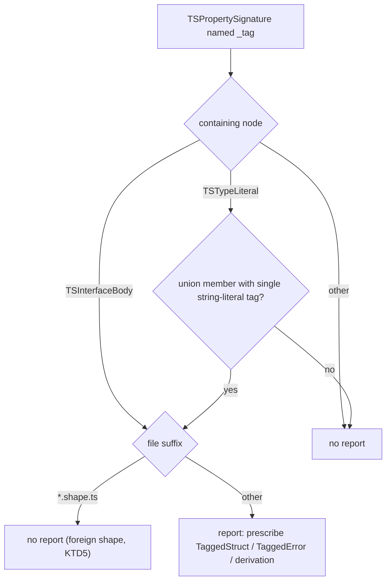

# Manual Tagged Union Ban - Plan

## Goal Capsule

- **Objective.** Ship an oxlint rule in the existing `effect-schema` plugin that bans hand-declared `_tag` members in union-member type literals and interface bodies and prescribes Effect Schema `S.TaggedStruct` / `S.TaggedError` (or a schema-derived type), enabled at `error` repo-wide, with the in-repo declarations it flags migrated in the same change.
- **Product authority.** Repository owner. Grounded in `CONSTITUTION.md` I.5 (tagged union for mutually-exclusive states), II.5 (decode, never cast), REPO-S6 (enforcement ships in the published artifact), and the wiki rulings `conventions-ruled-without-cell` and `enforcement-channel-ordering`.
- **Open blockers.** None.
- **Execution profile.** Code. One change: rule, migration, baseline, and surface refresh land together; commits ordered so no intermediate commit lints red (rule implemented and migrated before it registers at `error`).
- **Stop conditions.** Repo lint red after registration with the migration incomplete; the dated baseline `allow` entries not load-bearing; the measured false-positive or runtime budget exceeded.
- **Tail ownership.** This plan opens a PR and drives CI to green; publish is human-controlled (REPO-P1).

---

## Product Contract

### Summary

A new rule, `no-manual-tag-member`, in the published `@systemfsoftware/oxlint-plugin-effect-schema` flags hand-declared `_tag` members in union-member type literals and in interface bodies, and prescribes `S.TaggedStruct` (or `S.TaggedError` for error-shaped variants, or deriving the type from the schema). It joins the `recommended` set and reaches repo-wide lint at `error` through the existing `effect-dmmf` → `oxlint-config` chain. The flagged in-repo members migrate to schema-derived forms in the same change (`NodeFate`, `IntensitySpec`, `CliRequest`, `StdoutWriteError`, the `bounded-union` test fixtures); the wire-contract types (`PartialEncoded`/`Encoded`) and the published interface names (`Initial`/`Success`/`Failure`, `Capture`, `Step`) ride an enumerated dated baseline (KTD6). The rule reaches every base-extending package through the `effect-dmmf` → `oxlint-config` chain; the standalone packages (`effect-atom/atom`, `storybook-gherkin`) opt in via their own configs (U4); plugin packages are out of reach by design (their config cannot extend the base — CO4 cycle).

### Problem Frame

The class form of a manual tag is already banned: `no-manual-tag-property` flags any class declaring its own `_tag` (class declaration, class expression, constructor parameter property) and prescribes `TaggedClass` / `TaggedError`. The type-literal form — `type X = { readonly _tag: 'A' } | { readonly _tag: 'B' }`, the shape agents and authors write most for plain tagged unions — is flagged nowhere. A search of every rule in the 22 oxlint-plugin packages found no rule that detects type-literal `_tag` members; only tag _access_ is policed (`no-direct-tag-access`, `no-either-tag-assertions`, `executor-no-domain-branch`).

A manual tagged union exists only in type space. It derives no schema, so it gains no encode/decode, no generated laws, no property-test arbitrary, and its tag strings can drift from — or never meet — a schema. The doctrine's answer is `S.TaggedStruct` for plain variants, which is already used in this repo (`packages/effect-atom/atom/src/Result.ts:849`), and `S.TaggedError` for error-shaped variants.

This is a restraint rule — the channel class prose cannot carry. The wiki's `enforcement-channel-ordering` and the rule-corpus plan's measured split (restraint rules recover to at most 23% under named feedback and 0% unaided) place the lint channel as the right home, and REPO-S6 requires the enforcement to ship in a published artifact rather than a doctrine file.

### Key Decisions

- **KTD1 — Home is the existing `effect-schema` plugin.** Leaf ES1: "add a rule here when it changes as Effect Schema or the generated-law stack changes" — a rule prescribing `S.TaggedStruct` co-varies with Effect Schema's API. Wiki `conventions-ruled-without-cell` (A2-A4): a new package is minted only for a distinct coordinate tuple; the schema cell already carries declaration-form enforcement, and a second plugin label would be one cell with two names. No new plugin.
- **KTD2 — A sibling rule, not an extension of `no-manual-tag-property`.** The two forms carry different prescriptions (TaggedStruct for type literals vs TaggedClass/TaggedError for classes) and different `allow` semantics (type names vs class names). The granularity ruling (lint-rule-granularity A11) is explicit that consolidation pays only where the merged rule bans one construct through a denylist entry; these members differ in detection and in message, so merging would force one config to carry two wordings and degrade the message to a generic sentence. A sibling rule leaves the tested class rule untouched.
- **KTD3 — Detection fires on union members with a single string-literal tag, not on every type literal and not on non-literal tags.** A `_tag` member inside a type literal that is a member of a union of two or more tagged literals is unambiguously a manual variant tag; a lone `{ readonly _tag: 'X' }` record is not a union of states (CONSTITUTION.md I.5), and an open or union-typed tag (`_tag: string`, `_tag: 'X' | 'Y'`, `_tag: STEP_TAG`) cannot be expressed by any of the prescriptions, so reporting it would name an inapplicable migration. The class rule's any-`_tag` breadth does not transfer: a `_tag` member in a class is always a tag; a `_tag` member in an anonymous literal is not.
- **KTD4 — Interface bodies are in scope for v1.** An `interface` with a hand-declared `_tag` is equally manual, and the visitor is one case over `TSInterfaceBody` — cheaper now than a follow-up migration later. The internal interface sites migrate with the rest (`run-event-stream.adapter.ts` `StdoutWriteError` → `S.TaggedError`, the `bounded-union` property-test fixtures); the published interface names (`effect-atom`'s `Initial`/`Success`/`Failure`, `storybook-gherkin`'s `Capture`/`Step`) ride the dated baseline of KTD6 because migrating them is a breaking API change.
- **KTD5 — `*.shape.ts` files are excluded.** Shape cells are the foreign-declaration cell — the only cell that imports foreign constructors (`cell-atlas`) — and a `_tag` in a foreign wire payload is given, not authored; re-declaring it as a domain schema would move the declaration into a decision-bearing construct and change the shape cell's purpose. Leaf ES2 permits keying on the suffix that identifies the artifact being linted.
- **KTD6 — Severity is `error` via the recommended set; migration covers the flagged sites except two dated-baseline cohorts.** The architecture plan's KTD6 (error + dated baseline, never `warn`) governs. With 25 flagged members across 8 files (14 migrate, 11 baseline), migrating in the same change is cheaper than a baseline — except two cohorts that cannot migrate without a breaking published-package change: the wire-contract types `PartialEncoded`/`Encoded` (they are the schema's own `Encoded` shape, embedding `CauseEncoded`/`OptionEncoded`; the schema constructor already builds the encoded shape via `S.Union(TaggedStruct(...))` with `encode: identity`, so the wire bytes would not change — the binding constraint is that re-declaring would couple the published `Encoded` type to schema metadata and require reworking the transform machinery) and the published interface names (`effect-atom`'s `Initial`/`Success`/`Failure`, `storybook-gherkin`'s `Capture`/`Step`). The 11 baseline members sit behind 7 `allow` entries — `PartialEncoded` 3, `Encoded` 3, `Initial`/`Success`/`Failure`/`Capture`/`Step` 1 each — so 14 migrate + 11 baseline = 25. Those ride an enumerated dated baseline per `warn-severity-is-dominated` A2 — `error` blocks new violations while the baseline names a set that only shrinks.
- **KTD7 — No auto-fix.** Field types cannot be mechanically inferred into schema constructor arguments, so the migration is message-guided; the rule is not `meta.fixable`.

### Requirements

**Detection**

- R1. The rule reports every property signature named `_tag` — key as identifier or string literal — whose containing `TSTypeLiteral` is a member of a union of two or more such literals (union type alias, inline annotation, or generic argument) and whose tag value is a single string literal, regardless of `readonly`/optional modifiers. Single-member literals, open tags (`_tag: string`), union-typed tags (`_tag: 'X' | 'Y'`), and constant-referenced tags (`_tag: STEP_TAG`) are not reported (KTD3).
- R2. The rule does not report object expressions (value space), class property definitions (already covered by `no-manual-tag-property`), method signatures named `_tag`, or any member inside a `*.shape.ts` file.
- R3. Interface-body members with a hand-declared `_tag` are reported in v1 (KTD4); inherited tags live in the base declaration, not the body, and are not reported.
- R4. Options are `allow` (type or interface names, case-insensitive) with its default in `<rule>.config.ts` (OX-CS1). No `expected`/`fix` override options: no in-repo config exercises the class rule's overrides, and the option-growth doctrine admits options only for requested use cases (lint-rule-granularity A8).

**Prescription and message**

- R5. The message follows OX-EF1: `{{name}} is forbidden. Expected: {{expected}}. Actual: {{actual}}. Fix: {{fix}}.`, with `name` = `type <Name> with manual _tag member` (or `<anonymous>`).
- R6. The default prescription names `S.TaggedStruct` for plain variants, `S.TaggedError` for error-shaped variants (fields such as `name`/`message`/`cause`), and schema derivation (`S.Schema.Type` / `S.Schema.Encoded`) when the union restates an existing schema's shape; per OX-EF2 the fix must be able to end in deleting the manual union.
- R7. The rule declares no fixer (KTD7).

**Packaging and registration**

- R8. The rule lives in `packages/oxlint-plugins/effect-schema/src/rules/` with static config in `no-manual-tag-member.config.ts`; no new plugin package.
- R9. The rule is registered in `packages/oxlint-plugins/effect-schema/src/index.ts` in both the `rules` map and `configs.recommended` at `error`; the `effect-dmmf` composite and the `packages/oxlint-config` base-config rules spread pick it up after the `effect-dmmf` rebuild, with no `oxlint-config` edit. Reach is by config: every package extending the base config runs the rule automatically; the standalone packages (`effect-atom/atom`, `storybook-gherkin`) opt in via their own config rule entries (U4); plugin packages are out of reach because their config cannot extend the base (CO4 cycle) and `check-lint-coverage` exempts them.
- R10. The suite follows OX-TS1: RuleTester wired to vitest, `Should_<Behavior>_When_<Condition>` names, `messageId` plus report-`data` assertions, a distinguishing case per conditional; mutation-complete per OX-MG1 (zero Ignored/Survived/NoCoverage in the package).
- R11. The published surface is refreshed in the same change: `packages/oxlint-plugins/effect-schema/etc/oxlint-plugin-effect-schema.api.md` (api-extractor), the README rules table, and all `pnpm check` gates including `check:lint-coverage`.

**In-repo baseline**

- R12. Adoption passes the architecture plan's budgets before merge: the aggregate false-positive rate stays within the `N×p` budget and the runtime contribution (rule count × files) is measured on the full repo lint run (2026-08-08-002 R4).
- R13. The flagged `_tag` members migrate to schema-derived forms in the same change: `packages/effect-atom/atom/src/internal/node-lifetime.observer.ts` (`NodeFate`), `packages/effect-daemon-spec/src/internal/intensity.kernel.ts` (`IntensitySpec`), `packages/stryker-js/cli/src/stryker-cli.executor.ts` (`CliRequest`), `packages/stryker-js/cli/src/run-event-stream.adapter.ts` (`StdoutWriteError`), and the `bounded-union` property-test fixtures in `packages/effect-schema-law/src/__tests__/bounded-union.kernel.property.test.ts`; the rule's own run over the repo is the authority for the final list. Single-member tagged records — including `build-worker-loop.kernel.ts`'s loop shapes, `daemon-spec.schema.ts`'s `PollLoop`/`StreamLoop`/`SubscriptionLoop`, `daemon-poll.kernel.ts`'s `PollLoopResult`, and the inline return types in `daemon-stream.kernel.ts`/`daemon-subscription.kernel.ts` — are not flagged under KTD3 and need no migration. `packages/effect-atom/atom/src/Result.ts` (`PartialEncoded`, `Encoded`) and the published interface names (`Initial`/`Success`/`Failure`, `Capture`, `Step`) ride the dated baseline of KTD6, enumerated in the change; migrated exports keep their structure (`S.TaggedStruct` unions or schema-derived types), and every migrated package's api-extractor and changelog gates run in the same change.

**Release**

- R14. The published consumer surface carries the change: a changelog entry and a migration note naming the new error rule in `@systemfsoftware/oxlint-plugin-effect-schema`, released as a breaking change — rule additions to a published `recommended` set are major version bumps (incremental-adoption-topology A1).

### Detection boundary



### Acceptance Examples

- Given `type NodeFate = | { readonly _tag: 'Alive' } | { readonly _tag: 'RemoveNow' }`, the rule reports at each `_tag` key with the TaggedStruct prescription.
- Given `const step = { _tag: 'Step', model, run }` (object expression), no report.
- Given `class MyEvent { readonly _tag = 'MyEvent' }`, no report from this rule; the class rule already reports.
- Given `interface Success extends Proto { readonly _tag: 'Success' }`, report — interface bodies are in scope (KTD4); the published names ride the dated baseline.
- Given a `*.shape.ts` declaring `{ readonly _tag: 'A' } | { readonly _tag: 'B' }`, no report.
- Given `type E = { readonly _tag: 'X' | 'Y' }` (union-typed tag), no report — an open tag is not a recognizable variant and no prescription can express it (KTD3).
- Given `type Legacy = { readonly _tag: 'Legacy' } | { readonly _tag: 'Modern' }` with `options: [{ allow: ['Legacy'] }]`, no report on `Legacy` and a report on `Modern`.

### Scope Boundaries

**Deferred for later**

- A `Data.TaggedClass` ban — deferred: `ban-data-taggederror` matches only `S.TaggedError` declarations and `ban-classes` exempts `TaggedClass` patterns, so no existing rule covers bare `Data.TaggedClass` use — and a ban would forbid the very form the class rule prescribes; no requirement names a defect it prevents.
- An auto-fix (KTD7) — field-type inference into schema constructors is not mechanical.

**Deferred to Follow-Up Work**

- Named-reference unions (`type A = X | Y` where `X`/`Y` are tagged aliases or interfaces) and mixed unions (literal + reference members) — detection is syntactic in v1 (KTD3, KTD11); alias resolution is a follow-up extension.
- Open, union-typed, and constant-referenced tag values in type literals — deliberately unreported (no expressible prescription).
- Inline foreign payloads carrying `_tag` outside `*.shape.ts` files — the suffix-only exclusion is the v1 boundary.
- Shrinking the dated baseline (KTD6) — each `allow` entry is removed when its type migrates or when U5's per-name firing check finds it stale; tracked by the dated comments.

**Outside this rule's identity**

- Object-expression `_tag` values — the in-repo construction sites (`storybook-gherkin` capture/feature/steps observers, `stryker-cli` handler, the daemon kernels' `loop:` values) and test fakes — constructing a schema-backed type's value is not declaring a tag.
- `interface`-based tagged unions — detected in v1 (KTD4); the published names ride the dated baseline (KTD6), everything else migrates.
- Tag access (`obj._tag === 'X'`) — already policed by `no-direct-tag-access`.

### Dependencies / Assumptions

- oxlint's TS parser covers type positions; the corpus's existing type-position rules (`schema-exports-only-schemas`, `workflow-schema-required`) prove the surface.
- `S.TaggedStruct` and `S.TaggedError` exist in the resolved `effect` 3.22.1; in-repo usage at `packages/effect-atom/atom/src/Result.ts:849` confirms the pattern.
- The `effect-dmmf` composite forwards new `recommended` rules without `oxlint-config` edits; the spread chain was verified at `packages/oxlint-plugins/effect-dmmf/src/index.ts:32-40,53,75` and `packages/oxlint-config/src/oxlint-config.base.ts:78`.
- The object-expression `_tag` sites are not flagged (value space), so no migration is needed there.
- RuleTester can supply the file suffix for the `*.shape.ts` exclusion via `filename` (OX-TS2 permits facts RuleTester can supply).

### Outstanding Questions

Both planning-time questions are resolved in the Planning Contract: the `allow` key semantics (KTD8) and the error-shaped prescription default (KTD9). No blocking questions remain.

### Sources / Research

- Grounding dossier with verified quotes: `/tmp/compound-engineering/ce-brainstorm/tagged-union-rule/grounding.md` (scout extraction, 11 items with `file:line`).
- `packages/oxlint-plugins/effect-schema/src/rules/no-manual-tag-property.ts` + `.config.ts` + tests — the class-form rule this rule completes.
- `packages/oxlint-plugins/AGENTS.md` — OX-CS1, OX-EF1, OX-EF2, OX-TS1, OX-TS2, OX-MG1, OX-IN1, OX-OB1.
- `docs/solutions/tooling-decisions/rule-admission-severity-and-accretion.md` — repo measured at 125 deny / 3 allow / 0 warn; error + dated baseline is the documented migration pattern; the N×p aggregate false-positive formula (`1-(1-P)^(1/N)` per rule) and the 5%/20% thresholds.
- `docs/solutions/architecture-patterns/workflow-error-channel-gates.md` — Gate A: decision variants use `S.TaggedStruct`, error variants `S.TaggedError`, never the reverse — the prescription vocabulary behind R6.
- `docs/plans/2026-08-08-002-refactor-oxlint-plugin-architecture-plan.md` — KTD6 severity (error + dated baseline), rule budgets (N×p aggregate false-positive, runtime = rule count × files, measured), KTD2 adoption surface.
- `docs/plans/2026-08-05-006-feat-rule-corpus-integrity-plan.md` — OX-MG1 cost of a new rule.
- Wiki: `conventions-ruled-without-cell`, `cell-atlas`, `enforcement-channel-ordering`, `warn-severity-is-dominated`, `lint-rule-granularity`, `incremental-adoption-topology`, `gate-vs-suggestion-threshold`; `CONSTITUTION.md` I.5, II.5; root `AGENTS.md` REPO-S6.

---

## Planning Contract

**Product Contract preservation note:** changed — R13 migrate set corrected (the `build-worker-loop` loop shapes and the `daemon-stream`/`daemon-subscription` inline return types removed: they are single-member tagged records by named reference, not flagged under the reviewed KTD3; verified against source), `bounded-union` fixtures pinned to `packages/effect-schema-law`, `Step` added to the baseline cohort, `CliRequest` confirmed in the migrate set (2-member inline union, flagged under the reviewed KTD3; structural identity preserved — a type alias erased at compile time), KTD6 counts corrected to 25 members / 8 files and its wire-contract rationale refined (identity-encoded; the binding constraint is published-type coupling and the transform machinery), R9 reach clarified (base-extending vs standalone vs plugin packages). Product intent unchanged: ban manual tagged unions, prescribe schemas, migrate in the same change, baseline the irreducible cohorts.

### Key Technical Decisions

- **KTD8 — `allow` matches the nearest enclosing named type declaration.** A report is suppressed when the union alias or interface name matches an `allow` entry, case-insensitive, mirroring `no-manual-tag-property`. Anonymous union members have no `allow` handle and are always reported. Resolves the origin's deferred `allow` question; the RuleTester suite pins the semantics.
- **KTD9 — The error-shaped prescription is a field-set test.** `S.TaggedError` is named only when every non-`_tag` field of the member is one of `name`/`message`/`cause`; any other field (e.g. `IntensitySpec`'s `restarts`/`window`) selects `S.TaggedStruct`. Deterministic and immune to legitimate domain fields named `message`.
- **KTD10 — Members with type-parameter fields get the derivation prescription.** A member whose fields carry type parameters cannot be expressed as a bare `S.TaggedStruct`; the message's expected slot names deriving the type from a schema (`S.Schema.Type`) instead. The same branch applies when the union restates an existing schema's shape.
- **KTD11 — Detection is syntactic; named-reference unions are out of scope for v1.** The rule fires on inline union members only (`TSTypeLiteral` directly inside a `TSUnionType` with two or more literal members). Unions formed by named references and mixed unions are follow-up work (Scope Boundaries); the scope is false-positive-safe by construction and every report names an expressible migration.
- **KTD12 — The dated baseline is per-package `allow` entries in the standalone configs.** `effect-atom/atom` and `storybook-gherkin` do not extend the base config, so the rule is opted in there with an `allow` list carrying the baseline names and a dated comment (KTD6). Base-extending packages need no entries: every flagged site they contain migrates. Plugin packages never run the rule (their config cannot extend the base — CO4 cycle; `check-lint-coverage` exempts them).
- **KTD13 — Commit order keeps every intermediate commit lint-green.** The rule is implemented (U1) and the flagged sites migrated (U3) before the rule registers at `error` (U2); the baseline configs (U4), budget measurement (U5), and release docs (U6) follow.

### High-Level Technical Design

The detection decision tree lives in the Product Contract's Detection boundary diagram. The rule's visitor shape (directional):

```text
visitor:
  TSTypeLiteral node:
    if parent is TSUnionType with >= 2 TSTypeLiteral members:
      for each TSPropertySignature named "_tag" (identifier or string-literal key):
        if the tag value is a single string literal -> report
        else -> silent (open / union-typed / const-referenced tag)
  TSInterfaceBody node:
    for each hand-declared TSPropertySignature named "_tag" -> report
    (inherited tags are not in the body)
name resolution for message + allow:
  nearest enclosing TSTypeAliasDeclaration / TSInterfaceDeclaration name, else <anonymous>
file gate: context.filename ends with ".shape.ts" -> skip (KTD5)
```

### Assumptions

- The `S.TaggedStruct` / `S.TaggedError` / `S.Schema.Type` surface of the resolved `effect` 3.22.1 covers every migrated form; in-repo usage at `packages/effect-atom/atom/src/Result.ts` proves the pattern.
- `Step` is exported from `packages/storybook-gherkin` and joins the published-name baseline (verified at `src/steps.observer.ts`).
- Adding schemas where none existed may extend a package's schema-law obligation-node count (e.g. `effect-daemon-spec`); the per-package literal assertions are updated with the migration, in the same change.
- RuleTester supplies `filename` for the `*.shape.ts` exclusion (OX-TS2).

### Sequencing

U1 (rule + suite) → U3 (migration) → U2 (registration + surface) → U4 (baseline configs) → U5 (budget measurement) → U6 (release docs). One change, one PR; the rule's own run over the repo (performed during U1 against real files) is the authority for the final flagged set (R13).

---

## Implementation Units

### U1. Implement the rule, config, and RuleTester suite

- **Goal:** `no-manual-tag-member` detects and reports the KTD3/KTD4 scope with the KTD8/KTD9/KTD10 prescriptions, tested per OX-TS1.
- **Requirements:** R1-R7, R10 (suite); KTD3, KTD4, KTD5, KTD7, KTD8, KTD9, KTD10.
- **Dependencies:** none.
- **Files:**
  - `packages/oxlint-plugins/effect-schema/src/rules/no-manual-tag-member.ts` (create)
  - `packages/oxlint-plugins/effect-schema/src/rules/no-manual-tag-member.config.ts` (create)
  - `packages/oxlint-plugins/effect-schema/src/rules/__tests__/no-manual-tag-member.test.ts` (create)
- **Approach:** `defineRule` with a TS visitor over `TSTypeLiteral` (union-member predicate per KTD3) and `TSInterfaceBody` (any hand-declared `_tag`, KTD4); name resolution per KTD8; options `S.Struct({ allow })` decoded with `S.decodeUnknownSync`, `meta.schema` as `[Options]` (the plugin's local convention, matching `no-manual-tag-property`); message per OX-EF1 with `name`/`expected`/`actual`/`fix` from config constants (OX-CS1); `expected` branches per KTD9/KTD10; `*.shape.ts` exclusion via `context.filename`; no fixer (KTD7).
- **Patterns to follow:** `no-manual-tag-property.ts` (allow gate, message data, options decode), `no-manual-tag-property.config.ts` (message template constants), `ban-classes.ts` (`getClassName` anonymous-name resolution).
- **Test scenarios** (RuleTester wired to vitest; `Should_<Behavior>_When_<Condition>` names; messageId plus report-`data` assertions; `filename` passed for the shape-file case):
  - Covers the Acceptance Examples: the NodeFate union reports at each `_tag` with the TaggedStruct prescription; object expression silent; class property silent (the class rule's job); tagged interface reported; `*.shape.ts` union silent; union-typed tag silent; `allow` suppressing a named union.
  - `Should_Report_EachMember_WhenUnionOfLiteralTaggedMembers` — the `type E = { readonly _tag: 'A' } | { readonly _tag: 'B' }` shape, two reports, `data.name` = alias name, `data.expected` names `S.TaggedStruct`.
  - `Should_Report_WhenTaggedInterfaceIsErrorShaped` — `_tag` plus `cause` only → `data.expected` names `S.TaggedError` (KTD9).
  - `Should_PrescribeTaggedStruct_WhenMemberHasDomainFields` — `{ _tag: 'Bounded'; restarts: number; window: Duration }` → TaggedStruct (KTD9).
  - `Should_PrescribeDerivation_WhenMemberCarriesTypeParameter` — `{ _tag: 'X'; value: A }` → `S.Schema.Type` derivation (KTD10).
  - `Should_StaySilent_WhenSingleMemberLiteral`; `Should_StaySilent_WhenUnionOfNamedReferences`; `Should_StaySilent_WhenOpenTag`; `Should_StaySilent_WhenConstReferencedTag`; `Should_StaySilent_WhenUnionMemberIsNotLiteral` (mixed union); `Should_StaySilent_WhenShapeFile` (filename `foo.shape.ts`); `Should_StaySilent_WhenInheritedInterfaceTag` (extends a base carrying `_tag`); `Should_Report_WhenAnonymousUnionMember` (no alias, `<anonymous>` name); `Should_Report_WhenStringLiteralKey`; `Should_Report_WhenOptionalOrReadonlyTagMember`; `Should_StaySilent_WhenMethodNamedTag`.
- **Verification:** `pnpm --filter @systemfsoftware/oxlint-plugin-effect-schema test` green; `pnpm --filter @systemfsoftware/oxlint-plugin-effect-schema mutation` green with zero Ignored/Survived/NoCoverage (OX-MG1). Run the implemented rule against the real repo files (temporary invocation) and record the flagged set — it is the authority for U3's migration list.

### U3. Migrate the flagged in-repo sites

- **Goal:** the in-scope members become schema-derived forms; every consumer and test stays green.
- **Requirements:** R13; KTD6 (migrate cohort); R6.
- **Dependencies:** U1.
- **Files:**
  - `packages/effect-atom/atom/src/internal/node-lifetime.observer.ts` — `NodeFate` (3-member union) → `S.TaggedStruct` union plus derived type; the constructions at the top of the file are object expressions and stay legal; `decideNodeFate`'s return type and `registry.ts` consumers keep their shape via `S.Schema.Type`.
  - `packages/effect-daemon-spec/src/internal/intensity.kernel.ts` — `IntensitySpec` (2-member union) → a `S.TaggedStruct` schema const living in the same kernel file, exported alongside the derived `IntensitySpec` type (`window` mapped through the Duration schema); the file header's domain-blind note is updated to cover the schema form — the schema is a shape declaration (structural, no domain behavior), and `src/mod.ts`'s domain-typed re-export continues unchanged; `Match.tag` dispatch and the in-source `import.meta.vitest` tests unchanged.
  - `packages/stryker-js/cli/src/stryker-cli.executor.ts` — `CliRequest` (2-member union) → `S.TaggedStruct`; `Match.tag` dispatch unchanged.
  - `packages/stryker-js/cli/src/run-event-stream.adapter.ts` — `StdoutWriteError` interface → `S.TaggedError('stdout-write-error', { cause: ... })`; the three construction sites (~lines 98, 102, 118) switch from object literals to the constructor; the Sink's typed error channel and the `catchAll` consumer stay unchanged.
  - `packages/effect-schema-law/src/__tests__/bounded-union.kernel.property.test.ts` — delete the six hand-declared interfaces (`Lit`/`Id`/`Binary`/`Member`/`Conditional`/`Call`) and derive the types from the already-declared `S.TaggedStruct` consts (`type Lit = S.Schema.Type<typeof Lit>`, etc., declared after their consts). The hoisted `type Expr = Lit | Id | Binary | Member | Conditional | Call` union alias stays first — type aliases are hoisted, so the recursive consts' field references (`left: Expr`) and the consts' explicit annotations (`const Binary: S.Schema<Binary>`, `const Expr: S.Schema<Expr>`) resolve to the derived types declared later; the derived `type Expr` is the union of the six derived member types. The one in-repo recursive-schema precedent (`effect-schema-ignorer/ast-node.kernel.ts`) keeps recursive members as interfaces, but those carry `type:` keys, not `_tag` — outside this rule's scope — so this fixture is the first `_tag` recursive derivation; the property tests quantifying over the same `Expr` population are the proof it is structurally identical.
- **Approach:** each migration keeps the exported name and structural shape, so `Match.tag`, `catchAll`, and object-expression constructions compile unchanged except the `StdoutWriteError` constructor sites. Where a package's schema-law harness auto-generates law tests for new schemas, the generated laws must pass; where a literal obligation-node assertion pins a count (e.g. `effect-daemon-spec`), update the count in the same change and name it in the commit.
- **Execution note:** migrate with the rule implemented but not yet registered — the rule's own reports define the exact set; register only after every site is clean (U2).
- **Test scenarios:**
  - Per package: the existing suite stays green with the migrated types (encode/decode roundtrips where schemas exist, `Match.tag` dispatch, error handling).
  - `IntensitySpec`: the in-source tests still construct `make({ _tag: 'Unbounded' })`, and the `Bounded` member's `restarts`/`window` fields survive the schema roundtrip.
  - `StdoutWriteError`: the adapter's three construction sites produce values the Sink's typed error channel accepts, and the `catchAll` path still observes `_tag: 'stdout-write-error'`.
  - `bounded-union`: the property tests still quantify over the same `Expr` population (the derived types are structurally identical to the deleted interfaces).
- **Verification:** `pnpm --filter <package> test` green for `@systemfsoftware/effect-atom`, `@systemfsoftware/effect-daemon-spec`, `@systemfsoftware/stryker-js-cli`, and `@systemfsoftware/effect-schema-law`; mutation on the changed pure-core files at 100% (REPO-D1); the flagged set from U1 is empty after migration.

### U2. Register the rule and refresh the published surface

- **Goal:** the rule is live at `error` in the recommended set and the published surface documents it.
- **Requirements:** R8, R9, R11; OX-IN1.
- **Dependencies:** U1, U3.
- **Files:**
  - `packages/oxlint-plugins/effect-schema/src/index.ts` (modify — rules-map row plus `configs.recommended` entry at `error`)
  - `packages/oxlint-plugins/effect-schema/etc/oxlint-plugin-effect-schema.api.md` (modify — api-extractor report refresh)
  - `packages/oxlint-plugins/effect-schema/README.md` (modify — rules-table row; the migration note lands in U6)
- **Approach:** one import, one rules-map row, one recommended row (rules-only bag per OX-IN1); the `effect-dmmf` composite forwards automatically (`recommendedFrom` keys by plugin name plus rule name) — no `effect-dmmf` or `oxlint-config` edit; api-extractor regenerates the report via the package's `api:check` script.
- **Test expectation:** none for the wiring itself — the gates prove it: `check:lint-coverage` must still pass with the new rule counted, and the full `pnpm check` chain must be green with the rule at `error` (which also proves U3/U4 left the repo clean).
- **Verification:** `pnpm check` green after U2-U4 land (REPO-A1: the full command, run in the implementing session); `api:check` green; `check:lint-coverage` green.

### U4. Dated baseline for the wire-contract and published names

- **Goal:** the baseline members are explicitly allowed with a dated, shrink-only record, and the standalone packages run the rule.
- **Requirements:** KTD6, KTD12; R4, R9 (reach).
- **Dependencies:** U1 (the rule must exist to fire).
- **Files:**
  - `packages/effect-atom/atom/oxlint.config.ts` (modify — `'effect-schema/no-manual-tag-member': ['error', { allow: ['PartialEncoded', 'Encoded', 'Initial', 'Success', 'Failure'] }]` with a dated comment naming the wire-contract and published-API cohorts)
  - `packages/storybook-gherkin/oxlint.config.ts` (modify — same at `error` with `allow: ['Capture', 'Step']` and a dated comment)
- **Approach:** these two packages do not extend the base config; each config adds a `jsPlugins` entry resolving `@systemfsoftware/oxlint-plugin-effect-schema` (the base config's own plugin-loading mechanism) plus the rule entry at `error` with the `allow` list. The comment records date, cohort, and the shrink obligation (warn-severity-is-dominated A2): each entry is removed when its type migrates or when it stops firing. Base-extending packages need no entries — all their flagged sites migrated in U3.
- **Test expectation:** none — config change.
- **Verification:** `pnpm check` green; the baseline is load-bearing — for each baseline name, temporarily removing only that entry makes that package's lint report exactly that name's members and restoring it turns lint green, proved once per name and recorded in the commit. `allow` is not shrink-monotonic: a name whose members all migrated fires nothing, so lint stays green with the entry in place — U5's per-name firing check is what detects a stale entry.

### U5. Measure the adoption budget

- **Goal:** R12's budgets are measured, not assumed.
- **Requirements:** R12.
- **Dependencies:** U2, U4.
- **Files:** none (measurement).
- **Approach:** capture the pre-registration full-repo lint runtime during U1 (before the rule registers), then with the rule live repo-wide record (a) the rule's reports across the repo — expected to be exactly the baseline names, zero false positives, since every report is a migration site or an allowed name; the rate sits inside the 5% band and the N×p per-rule budget (`1-(1-P)^(1/N)`); (b) the post-registration runtime, reporting the delta (rule count × files); and (c) per baseline name, the report set produced when only that entry is removed — the shrink check: a name that produces no reports is stale (its members migrated or vanished) and its entry is removed in the same change.
- **Test expectation:** none — measurement unit.
- **Verification:** the budget numbers (a)/(b) and the per-name firing check (c) recorded in the PR; repo lint green.

### U6. Consumer release contract

- **Goal:** consumers of the published plugin learn about the new error rule and the breaking release.
- **Requirements:** R14.
- **Dependencies:** U2.
- **Files:** `packages/oxlint-plugins/effect-schema/README.md` (modify — migration note naming the rule, its message-guided migration, and the absence of an auto-fix).
- **Approach:** the README rules-table row and a migration note with one worked before/after example per prescription branch — `S.TaggedStruct` (plain variants), `S.TaggedError` (error-shaped variants), and `S.Schema.Type` derivation (type-parameter or schema-restating members, KTD10) — plus the `allow` escape: case-insensitive type/interface name keys, and the caveat that anonymous union members have no `allow` handle and are always reported (KTD8). The release is breaking (rule addition to a published recommended set — incremental-adoption-topology A1), so the change's commit carries the `BREAKING CHANGE:` footer (REPO-R1/REPO-C1) and the release tooling bumps major at publish. Publish itself is human-controlled (REPO-P1).
- **Test expectation:** none — docs and commit discipline.
- **Verification:** the commit message carries the breaking marker; the README renders the new row.

---

## Verification Contract

| Command                                                                        | Scope                                                                                                                                                                  | Gate                                             |
| ------------------------------------------------------------------------------ | ---------------------------------------------------------------------------------------------------------------------------------------------------------------------- | ------------------------------------------------ |
| `pnpm check`                                                                   | full chain (frozen install → `check:ci`: format, lint, typecheck, test, attw, api:check plus six root guards; then `check:exports` + `check:runtime-deps` after build) | exits 0 after the last edit (REPO-A1, REPO-A3)   |
| `pnpm --filter @systemfsoftware/oxlint-plugin-effect-schema test` + `mutation` | rule suite                                                                                                                                                             | green; zero Ignored/Survived/NoCoverage (OX-MG1) |
| `pnpm --filter <package> test`                                                 | `effect-atom`, `effect-daemon-spec`, `stryker-js-cli`, `effect-schema-law`, `storybook-gherkin`                                                                        | green                                            |
| `pnpm --filter <package> mutation`                                             | changed pure-core files (`NodeFate`, `IntensitySpec`, `CliRequest` cells)                                                                                              | 100% (REPO-D1)                                   |
| `pnpm check:lint-coverage`                                                     | new rule counted                                                                                                                                                       | green                                            |
| Budget measurement (U5)                                                        | false-positive rate ~0% within the N×p budget; runtime delta                                                                                                           | recorded in PR                                   |

---

## Definition of Done

- R1-R14 all satisfied; the rule is registered at `error` in the recommended set and fires in every in-scope package.
- The in-scope members migrated; the baseline members enumerated in dated per-package `allow` entries that demonstrably bind.
- Repo lint green end-to-end; `pnpm check` exits 0 from the implementing session after the last edit.
- Published surface refreshed (`api.md`, README row plus migration note); the commit carries the `BREAKING CHANGE:` footer.
- Budget numbers (R12) measured and recorded.
- No abandoned code: the temporary registration/migration scaffolding from U1's repo run is removed before the PR.
