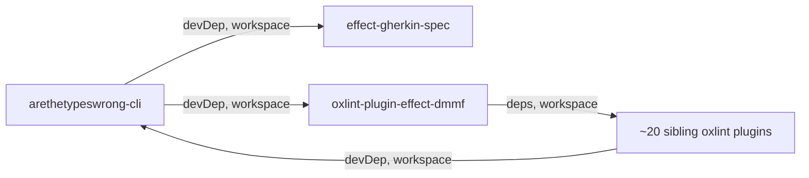
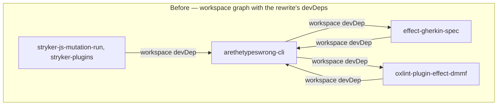
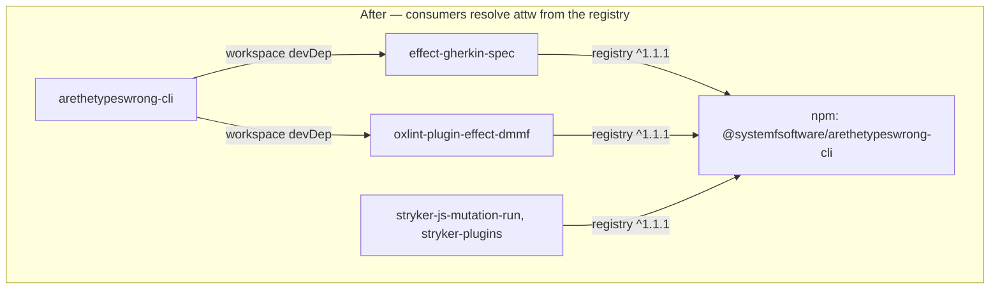

# refactor: consume the arethetypeswrong fork from npm so the workspace graph cannot cycle through it

**Product Contract preservation:** no upstream Product Contract existed. Authored fresh with `product_contract_source: ce-plan-bootstrap`. Scope was confirmed with the user in-session; the two confirmed scope decisions are the effect-dmmf inclusion and the decision to leave the other attw consumers workspace-linked.

---

## Goal Capsule

- **Objective:** switch every package that consumes `@systemfsoftware/arethetypeswrong-cli` (36 today — `effect-gherkin-spec`, the stryker packages, the effect-dmmf lint plugin the in-flight attw rewrite devDepends on, and all remaining consumers) from workspace-linking the fork to consuming the npm-published version, so the workspace graph cannot contain a cycle through the attw CLI.
- **Authority:** user-confirmed scope, expanded at execution: the originally confirmed four-package subset was measured (Tarjan over the lockfile's `link:` edges) to leave a 25-package SCC through attw in the rewrite-branch state, so the sweep is the minimum scope satisfying R4. The `attw-cli` worktree's rewrite is context, not work this plan executes.
- **Stop conditions:** all consumer manifests, the `attw` catalog entry, and the lockfile are updated; `pnpm check` exits 0; the SCC proof shows no cycle containing the attw CLI; `attw --pack .` succeeds in a switched package.
- **Tail ownership:** ce-work or a human implements the units in dependency order; nothing here publishes to npm.
- **Execution profile:** dependency-graph config work — the proof is install, graph, and smoke, not unit coverage. No pure-core files change, so no mutation gate runs.

---

## Product Contract

### Summary

Every package in this repo consumes the arethetypeswrong fork (`@systemfsoftware/arethetypeswrong-cli`) through the `workspace:^` protocol — 36 packages today. The in-flight rewrite of that CLI (the `attw-cli` worktree) adds devDependencies back onto two of those consumers — `effect-gherkin-spec` and `oxlint-plugin-effect-dmmf` — which closes workspace cycles the moment the rewrite merges. Measured at execution: the two devDependencies do not stop at two 2-cycles — `effect-dmmf` is the umbrella lint plugin with workspace dependencies on ~20 sibling plugins, and those plugins still devDepend on the CLI from the workspace, so the branch state closes one 25-package SCC through attw (witness cycle: `attw-cli → effect-dmmf → oxlint-plugin-test-placement → attw-cli`). This plan removes the cause for every consumer: all 36 stop linking the fork from the workspace and resolve it from the npm registry instead, where it already exists at `^1.1.1`. The fork's own development stays workspace-linked; only the packages that could form a loop with it move to the registry.

### Problem Frame

**The mechanism.** pnpm links a workspace package into a consumer only when the dependency uses the `workspace:` protocol (or `linkWorkspacePackages` is enabled; this repo has no `.npmrc`). A plain version range — including one reached through a catalog — resolves from the registry. Every `@systemfsoftware/*` edge in this repo's lockfile is a `link:` entry today, so the whole cross-package graph is workspace-linked, and every one of those edges is a potential cycle participant once the target package starts dev-depending back on its consumers.

**The trigger is the attw rewrite, not this repo's main branch.** On main, the only non-trivial strongly-connected component is the known `{oxlint-plugin-cell-taxonomy, stryker-js-mutation-run, stryker-js-typescript-checker}` triple (owned by the path-resolved-base plan). The `attw-cli` worktree adds `@systemfsoftware/effect-gherkin-spec` and `@systemfsoftware/oxlint-plugin-effect-dmmf` to the CLI's devDependencies. Both of those packages devDepend on the CLI from the workspace today, and `effect-dmmf` transitively reaches ~20 sibling oxlint plugins that also consume the CLI from the workspace — so the branch state closes one 25-package SCC through the CLI, not two clean 2-cycles:

The witness 3-cycle measured from the lockfile's `link:` edges: `arethetypeswrong-cli → oxlint-plugin-effect-dmmf → oxlint-plugin-test-placement → arethetypeswrong-cli`. Every consumer with a workspace edge into the CLI is a potential loop-closer; only a uniform switch removes the class.

**Measured state.**

| Fact                                                                         | Value                                                                                       |
| ---------------------------------------------------------------------------- | ------------------------------------------------------------------------------------------- |
| Packages consuming `@systemfsoftware/arethetypeswrong-cli` via `workspace:^` | 36                                                                                          |
| Stryker packages among them                                                  | 2 — `stryker-js-mutation-run`, `stryker-plugins`                                            |
| Packages the rewrite's attw-cli devDepends on (workspace)                    | 2 — `effect-gherkin-spec`, `oxlint-plugin-effect-dmmf`                                      |
| Cycles the rewrite creates (with only the named four switched)               | 1 SCC of 25 packages through the CLI (witness: attw-cli → dmmf → test-placement → attw-cli) |
| Published CLI version                                                        | `1.1.1`, published 2026-08-04 (clears `minimumReleaseAge: 1440`)                            |
| Published CLI's own core pin                                                 | `@systemfsoftware/arethetypeswrong-core@1.1.0` (workspace core is 1.1.1)                    |
| Behavior delta between workspace CLI and published CLI                       | none — both are version 1.1.1; the Effect rewrite is not yet published                      |

### Requirements

- R1. `effect-gherkin-spec` declares `@systemfsoftware/arethetypeswrong-cli` through the `attw` catalog (registry range `^1.1.1`), never through the workspace protocol.
- R2. Every stryker package that consumes the attw CLI — `stryker-js-mutation-run` and `stryker-plugins` — declares it the same way; the other four stryker packages, which declare no attw dependency today, change nothing but are bound by the recorded rule in U6.
- R3. `oxlint-plugin-effect-dmmf` declares it the same way, closing the second cycle the rewrite would create.
- R4. The workspace graph contains no non-trivial strongly-connected component that includes the attw CLI — both as main stands today and with the rewrite branch's devDependencies applied.
- R5. The `attw` script in each switched package still validates the package's own built output: `attw --pack .` exits 0 in at least one switched package.
- R6. The fork's own packages are untouched: `arethetypeswrong-cli` keeps its `workspace:*` runtime link to `arethetypeswrong-core`, and its rewrite-branch devDependencies remain workspace links.
- R7. No new enforcement gate, `scripts/` entry, or `pnpm check` step is introduced; the convention is recorded in a solution doc, matching the path-resolved-base plan's precedent.
- R8. Every package in the workspace that consumes `@systemfsoftware/arethetypeswrong-cli` declares it through the `attw` catalog (registry range `^1.1.1`), never through the workspace protocol — no workspace edge into the attw CLI remains anywhere, so no future attw devDependency can close a loop. This subsumes R1–R3; it was added at execution when the four-package scope was measured to leave the 25-package SCC.

### Scope Boundaries

**In scope:**

- The `attw` catalog entry in `pnpm-workspace.yaml`.
- The attw devDependency in every consumer manifest: `effect-gherkin-spec`, the stryker packages (`stryker-js-mutation-run`, `stryker-plugins`), `oxlint-plugin-effect-dmmf`, and the remaining 32 consumers swept in U7 (all effect libraries, oxlint plugins, and effect-atom packages that declare the dependency).
- The regenerated lockfile and the solution-doc convention record.

**Out of scope:**

- The attw-cli / attw-core Effect rewrite itself — that is the `attw-cli` worktree's own work; this plan only removes the cycles the rewrite would otherwise introduce.
- The `{cell-taxonomy, mutation-run, typescript-checker}` cycle — owned by `docs/plans/2026-08-08-003-refactor-path-resolved-stryker-base-plan.md`.
- Publishing anything — the consumed artifact already exists on npm.

**Deferred to Follow-Up Work:**

- None: the originally deferred uniform sweep became U7 at execution, because the four-package scope was measured to leave the 25-package SCC — the sweep is the minimum scope satisfying R4, not optional hygiene.

### System-Wide Impact

- **The `attw` verification of every switched package now tracks the published release, not the working tree.** During the rewrite window, the workspace CLI and the released CLI diverge by construction; all 36 consumers keep validating against `^1.1.1` until the rewrite publishes. That is the accepted cost named in KTD2, not a defect — the alternative (workspace linking) is the cycle this plan removes.
- **CI is unaffected in shape.** The frozen install resolves the registry CLI from the lockfile; `attw` still runs per package with the same script and bin name.
- **Published artifacts of the switched packages are unaffected.** The change is confined to devDependencies, which never ship in the tarballs.
- **This is the repo's first registry consumption of its own fork package.** The convention and its rationale are recorded in U6 so a future author extends it deliberately rather than by accident.

---

## Planning Contract

### Key Technical Decisions

- **KTD1 — A catalog range is a registry range; that is the whole mechanism.** With no `.npmrc` in this repo, `linkWorkspacePackages` defaults to false and pnpm links a workspace package only under the `workspace:` protocol. So `"@systemfsoftware/arethetypeswrong-cli": "catalog:attw"` with the catalog entry `^1.1.1` installs the registry package — no override, no alias, no lockfile surgery. The existing `attw` catalog (which already pins the TS6 `typescript` for attw-core) is the natural home for the entry. The sibling plan's path arithmetic cannot extend here: it resolves config-loaded plugin references from the base preset's own module URL, while attw is consumed as a bin through each package's `attw` script — a bin devDependency has no path-resolution mode, so the registry is the only non-workspace resolution.
- **KTD2 — The published version is the current release, and that is the accepted cost.** `@systemfsoftware/arethetypeswrong-cli@1.1.1` (2026-08-04) is older than the 24-hour `minimumReleaseAge`, and is behaviorally identical to the workspace package at the same version. The in-flight Effect rewrite reaches consumers only at its next publish — the deliberate trade of the registry model: attw development decouples from attw consumers, and consumers no longer participate in attw's workspace graph.
- **KTD3 — The edge direction is asymmetric, and that asymmetry is the invariant.** The rewrite's attw-cli keeps its workspace devDependencies on gherkin and dmmf; gherkin, dmmf, the stryker packages, and every other consumer resolve attw from the registry. General form: _no package may carry a workspace edge to attw-cli_ — because attw-cli's devDependencies can reach any consumer transitively (measured: dmmf reaches ~20 sibling plugins), a direct-edge rule is not enough. One-way edges cannot cycle, so the graph stays acyclic no matter what devDependencies the rewrite later adds.
- **KTD4 — No new gate.** pnpm's cyclic-workspace warning and turbo's hard cycle failure (already inside `pnpm check`) remain the enforcement, exactly as the path-resolved-base plan's KTD6 decided for the same reason. The convention is recorded in prose (U6), never read by a script.
- **KTD5 — The registry CLI pins core at 1.1.0 while the workspace core is 1.1.1.** Accepted: consumers install the CLI's transitive core from the registry and never import `arethetypeswrong-core` directly; the fork's own workspace still links the 1.1.1 core.

### High-Level Technical Design

Before — the rewrite's devDependencies close two cycles, because every consumer reaches attw through the workspace:

After — attw's consumers resolve the CLI from the registry, so the workspace graph holds only one-way edges out of attw:

Landing order is simple: the catalog entry (U1) must precede the manifest edits (U2-U4), and the lockfile regeneration (U5) must follow them. There is no broken intermediate state: at every commit the manifests are consistent and the graph is acyclic through attw.

### Assumptions

- The rewrite's workspace devDependencies on gherkin and dmmf survive the rewrite (user confirmed the dmmf switch in scope; if that devDep is abandoned, U4 still stands — the sweep is independent).
- "All stryker packages" means the two that currently consume attw; the four without an attw dependency get no manifest edit but are bound by the rule recorded in U6.
- The remaining consumers are swept in U7 (added at execution): the four-package scope was measured to leave a 25-package SCC through attw in the rewrite-branch state, so the uniform switch is the minimum scope satisfying R4.

### Sources & Research

- pnpm catalogs documentation (`https://pnpm.io/catalogs`) and workspaces documentation (`https://pnpm.io/workspaces`) — the `linkWorkspacePackages` default and the `workspace:` protocol semantics that make KTD1 true.
- `docs/solutions/build-errors/turbo-build-cycle-from-self-hosted-devdeps.md` — the repo's recorded cycle class and its fix-precedence: package-level mutual devDependencies, build-level false edges.
- `docs/plans/2026-08-08-003-refactor-path-resolved-stryker-base-plan.md` — the sibling strategy (path-resolved base preset) and the no-new-gate precedent this plan follows.
- Measured this session: a Tarjan strongly-connected-component pass over all 48 workspace packages; the full 36-package consumer enumeration; npm registry publish times for the attw packages.

---

## Implementation Units

### U1. Add the published attw CLI to the attw catalog

**Goal:** `catalog:attw` resolves `@systemfsoftware/arethetypeswrong-cli@^1.1.1` from the registry.

**Requirements:** R1, R2, R3 (precondition), R4.

**Dependencies:** none.

**Files:**

- `pnpm-workspace.yaml` (modify)

**Approach:** add `"@systemfsoftware/arethetypeswrong-cli": "^1.1.1"` to the existing `catalogs.attw` block, which already pins the TS6 `typescript` for attw-core. Leave the default `catalog`, `catalogMode`, `overrides`, and `minimumReleaseAge` untouched — `minimumReleaseAgeExclude` is a protected surface (REPO-S2).

**Patterns to follow:** the existing named catalogs (`catalog:stryker`, `catalog:attw`'s typescript entry) and their `catalog:` references across the repo's manifests.

**Test expectation:** none — catalog configuration; proven by U5's install and graph checks.

**Verification:** a fresh install resolves the entry; the lockfile shows `@systemfsoftware/arethetypeswrong-cli@1.1.1` with a registry resolution rather than a `link:` entry for the four consumers.

### U2. effect-gherkin-spec consumes the published attw CLI

**Goal:** gherkin's attw devDependency moves to `catalog:attw`, breaking the rewrite's first cycle (`arethetypeswrong-cli ↔ effect-gherkin-spec`).

**Requirements:** R1, R4, R5.

**Dependencies:** U1.

**Files:**

- `packages/effect-gherkin-spec/package.json` (modify)

**Approach:** change the devDependencies entry from `"@systemfsoftware/arethetypeswrong-cli": "workspace:^"` to `"catalog:attw"`. Nothing else in the manifest changes; the `attw` script keeps running `attw --pack .` against the package's own dist.

**Patterns to follow:** `catalog:` references in sibling manifests; the peer/dev separation already in this manifest.

**Test expectation:** none — manifest-only change; the behavior proof is U5's smoke run.

**Verification:** `attw --pack .` in this package (after build) exits 0 using the registry-installed CLI.

### U3. Stryker packages consume the published attw CLI

**Goal:** the stryker → attw edge class becomes registry-only, so no future attw devDependency can close a cycle through a stryker package.

**Requirements:** R2, R4, R5.

**Dependencies:** U1.

**Files:**

- `packages/stryker-js/mutation-run/package.json` (modify)
- `packages/stryker-plugins/package.json` (modify)

**Approach:** apply the same one-line change in both manifests. The other four stryker packages (`stryker-js-cli`, `stryker-js-typescript-checker`, `stryker-js-vitest-runner`, `stryker-js-mutation-report`) declare no attw dependency today and change nothing; the rule that binds them — stryker packages never workspace-depend on attw — is recorded in U6.

**Patterns to follow:** U2's edit; the uniform one-line dependency change the path-resolved-base plan applied across its consumer sweep.

**Test expectation:** none — manifest-only change; proven by U5.

**Verification:** U5's graph proof shows no workspace edge from any stryker package to attw.

### U4. oxlint-plugin-effect-dmmf consumes the published attw CLI

**Goal:** close the rewrite's second cycle (`arethetypeswrong-cli ↔ oxlint-plugin-effect-dmmf`).

**Requirements:** R3, R4.

**Dependencies:** U1.

**Files:**

- `packages/oxlint-plugins/effect-dmmf/package.json` (modify)

**Approach:** the same one-line change. This unit exists because the rewrite's attw-cli devDepends on dmmf (user confirmed inclusion); if that devDependency is abandoned on the rewrite branch, drop this unit — U2 and U3 stand alone.

**Patterns to follow:** U2's edit.

**Test expectation:** none — manifest-only change; proven by U5.

**Verification:** U5's graph proof shows the dmmf cycle absent with the rewrite's devDependencies applied.

### U7. Sweep the remaining attw consumers to the catalog

**Goal:** no workspace edge into the attw CLI remains, so the rewrite's devDependencies cannot close any loop through the oxlint-plugin cluster or anywhere else.

**Requirements:** R8, R4.

**Dependencies:** U1.

**Files:**

- All remaining consumer manifests (32): the effect libraries (`effect-cell-types`, `effect-daemon-spec`, `effect-memfs`, `effect-schema-extensions`, `effect-schema-law`, `effect-schema-vite`, `hex-schema`, `rx-effect`, `storybook-gherkin`), the oxlint plugins (`cell-imports`, `cell-taxonomy`, `core`, `effect-acl`, `effect-adapter`, `effect-entrypoint`, `effect-executor`, `effect-handler`, `effect-kernel`, `effect-middleware`, `effect-observer`, `effect-policy`, `effect-schema`, `effect-shape`, `effect-state`, `effect-store`, `effect-workflow`, `property-testing`, `recommended`, `test-hygiene`, `test-placement`), and the effect-atom packages (`atom`, `atom-react`) — each under `packages/…/package.json` (modify).

**Approach:** apply U2's one-line change (`"@systemfsoftware/arethetypeswrong-cli": "workspace:^"` → `"catalog:attw"`) in every manifest that still declares the workspace protocol. This unit was added at execution: with only the four named packages switched, the rewrite-branch graph still contained a 25-package SCC through attw (witness cycle `attw-cli → effect-dmmf → oxlint-plugin-test-placement → attw-cli`), because `effect-dmmf` is the umbrella plugin depending on ~20 siblings that consume the CLI from the workspace. The sweep is the minimum scope satisfying R4.

**Patterns to follow:** U2's edit; the uniform one-line dependency change the path-resolved-base plan applied across its consumer sweep.

**Test expectation:** none — manifest-only change; proven by U5.

**Verification:** U5's graph proof shows zero workspace edges into `@systemfsoftware/arethetypeswrong-cli` from any package; the only non-trivial SCC in both graph states is the known triple.

### U5. Regenerate the lockfile and prove the graph acyclic through attw

**Goal:** the install, the graph, and the smoke run are the evidence the change works end to end.

**Requirements:** R4, R5, R6, R8.

**Dependencies:** U2, U3, U4, U7.

**Files:**

- `pnpm-lock.yaml` (regenerated)

**Approach:** run a full install to rewrite the lockfile, then verify. Expected perturbation: all 36 consumers' attw entries change from `link:` entries to registry resolutions, and the registry CLI brings its own transitive tree (chalk, commander, cli-table3, marked, marked-terminal, and core@1.1.0). That is the same lockfile-perturbation class the path-resolved-base plan documented for its devDependency sweep.

**Execution note:** smoke-first — run the attw script in one switched package and the SCC proof before spending the full `pnpm check`.

**Test expectation:** none — no behavior code changes; this unit's deliverable is the regenerated lockfile, and its proof is the Verification Contract's graph, install, and smoke checks.

**Verification:**

- A Tarjan strongly-connected-component pass over `workspace:` edges from all package manifests shows the only non-trivial SCC is the known `{cell-taxonomy, mutation-run, typescript-checker}` triple, and `@systemfsoftware/arethetypeswrong-cli` appears in none.
- The same pass with the rewrite branch's devDependencies applied (attw → gherkin, attw → dmmf) shows no SCC containing attw — the branch merges without closing a loop.
- `pnpm install --frozen-lockfile` succeeds, proving the lockfile is current.
- `attw --pack .` exits 0 in a switched package against its built dist.
- The fork's own manifests are untouched (R6): the lockfile still shows `arethetypeswrong-cli` → `arethetypeswrong-core` as a `link:` entry, and no file under `packages/arethetypeswrong/` changed in this work's diff.

### U6. Record the registry-consumption convention

**Goal:** the next author finds a stated convention, not an anomaly — and the attw-adjacent cycle class has a documented prevention.

**Requirements:** R7.

**Dependencies:** U5 (the record rests on the mechanism being proven in this repo).

**Files:**

- `docs/solutions/tooling-decisions/registry-consumption-of-self-hosted-forks.md` (create)

**Approach:** document the mechanism (only the `workspace:` protocol links workspace packages; catalog ranges resolve from the registry), the invariant (no package carries a workspace edge to the attw CLI — measured to be necessary because `effect-dmmf` reaches ~20 sibling plugins), the 25-package SCC the rewrite would have created, and the accepted cost (attw changes reach consumers only via publish, subject to `minimumReleaseAge`). Match the frontmatter format of sibling docs.

**Patterns to follow:** `docs/solutions/tooling-decisions/pnpm-catalogs-for-monorepo-dependency-management.md` and the turbo-cycle learning's structure (symptoms, root cause, solution, prevention).

**Test expectation:** none — documentation unit.

**Verification:** the doc states the mechanism and the invariant in its own words and carries the sibling frontmatter shape; no script reads it (REPO-S6 / script-provenance gate stays green).

---

## Verification Contract

| Check          | How                                                                          | Applies to | Done signal                                                   |
| -------------- | ---------------------------------------------------------------------------- | ---------- | ------------------------------------------------------------- |
| Frozen install | `pnpm install --frozen-lockfile`                                             | all units  | exits 0                                                       |
| Full gate      | `pnpm check`                                                                 | all units  | exits 0, run in this session after the last edit              |
| Graph proof    | Tarjan SCC pass over `workspace:` edges, main state and rewrite-branch state | U1-U5      | only the known triple SCC; attw in none                       |
| attw smoke     | `attw --pack .` in a switched package after build                            | U2         | exits 0                                                       |
| Mutation gate  | —                                                                            | none       | not run — no pure-core file changes (REPO-S5 scope untouched) |

---

## Definition of Done

- All four consumers declare `@systemfsoftware/arethetypeswrong-cli` through the `attw` catalog; the lockfile carries registry resolutions for them; `pnpm check` exits 0 in this session after the last edit.
- The SCC proof is recorded for both graph states — main and rewrite-branch — and shows no cycle through the attw CLI.
- The convention is recorded in `docs/solutions/tooling-decisions/registry-consumption-of-self-hosted-forks.md`.
- No gate, threshold, or `minimumReleaseAgeExclude` value was loosened; no `scripts/` entry was added.
- Cleanup: no scratch or probe files remain; `git status --porcelain` shows only the intended files.
