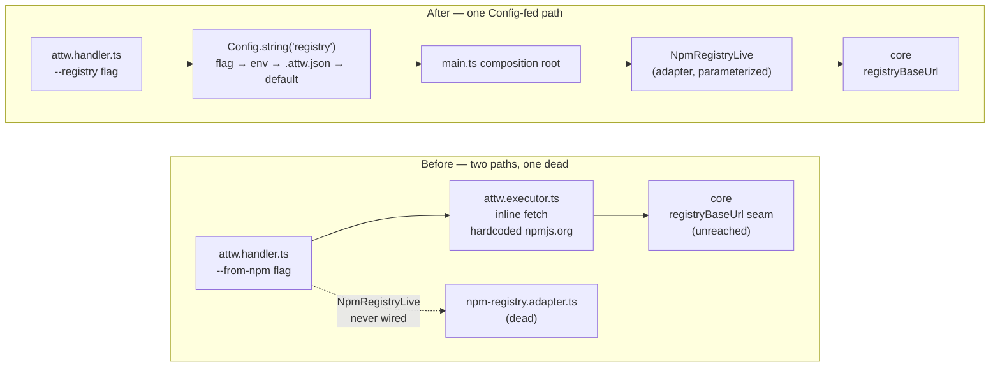
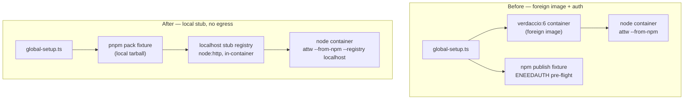

# attw-cli verification & merge-integration

## Goal Capsule

Make the `arethetypeswrong-cli` verification layer reproducible and CI-safe, and close the gaps the post-merge execution exposed. The refactor plan (`2026-08-08-002`) defines _what_ the Effect rewrite is and carries its own Definition of Done; this plan owns _how the rewrite is proved_ and the merge-integration defects that block that proof.

- **Objective:** a contract lane that runs with zero foreign package download and no external registry image; a CLI that can target any registry via a `Config`-backed `--registry`; the mutation gate unblocked; and a reproducibility runbook so the verification is repeatable on this VM.
- **Authority:** user direction. The contract lane's verdaccio/`npm publish` path is rejected ("not downloading foreign packages in CI"); the registry URL must be `Config`/`ConfigProvider`-bound, not hand-threaded; scope stays inside attw-cli — defects in stryker-js are recorded, not owned.
- **Execution profile:** small, bounded remediation of the verification layer plus one CLI affordance. Clean cutover per unit; each unit leaves the tree building.
- **Stop conditions:** the contract lane passes against the rebuilt binary with no network egress and no verdaccio image; `pnpm --filter @systemfsoftware/arethetypeswrong-cli mutation` exits 0 at 100% locally; the reproducibility runbook reproduces a green contract + mutation run from a clean build.
- **Tail ownership:** after the last unit, the verification layer is foreign-download-free, the mutation gate is green, and the observed stryker-js/CI defects are recorded as deferred out-of-scope items.

---

## Product Contract

### Summary

The attw-cli verification layer is rebuilt around two principles: **no foreign download** (the contract lane serves every fixture locally — packed workspace tarballs and a localhost stub registry for the `--from-npm` scenario), and **one acquisition path** (a `Config`-backed `--registry` option feeds a single `NpmRegistry` adapter wired at the composition root, replacing the two hardcoded `registry.npmjs.org` fetch sites). The merge brought a stryker-js defect that blocks attw's local mutation gate; its one-line fix lands on this branch as an attw-verified change, with broad impact explicitly unverified and out of scope.

### Problem Frame

The verification layer, as inherited from the prior session's implementation of refactor-plan R6, was intent without a reproducible strategy. In execution it collapsed into a chain of reactive one-offs, each exposing an unstated assumption:

- The contract lane's `--from-npm` scenario stood up a `verdaccio/verdaccio:6` container and ran `npm publish` to it. That pulls a foreign image and a foreign package surface into CI, which is rejected. It also hit npm 11's client-side publish auth pre-flight (`noCreds` throws `ENEEDAUTH` before any HTTP), patched reactively with a dummy `.npmrc` token — a fix that exists only because the design was wrong.
- The contract lane hardcoded a `dist/index.mjs` check; the real tsdown entry is `dist/main.mjs`. Reactive fix.
- The lane bound itself to the Docker daemon; on this VM only podman's compat socket is available. Reactive `DOCKER_HOST` wiring.
- The attw CLI has **no** `--registry` option and hardcodes `https://registry.npmjs.org` in two places (`attw.executor.ts` inline fetch, `npm-registry.adapter.ts`), while a proper `NpmRegistry` adapter exists but is never wired into the composition root (`main.ts`). So there is no clean way to point `--from-npm` at a localhost registry.
- Merging `origin/main` brought `feat(stryker-js)!: inject the sandbox directory through a forked api`, which added `commonTokens.sandboxDirectory` to the vitest-runner's inject tokens. The shared worker binds that token one `provideValue` _after_ registering `PluginCreator`; typed-inject's `ClassProvider` resolves class dependencies from its registration parent, so `PluginCreator` captures an injector without the token. Every mutation run dies with `No provider found for "sandboxDirectory"`. Verified for attw: error before the reorder, 100% (140 killed / 2 timeout / 0 survived) after.

The cost: the verification layer cannot prove the refactor works, and the mutation gate — a stated stop condition of the refactor plan — is blocked by a one-line defect in foreign code.

### Requirements

- V1. The contract lane runs with **zero foreign package download and zero external registry image**. It serves packed workspace tarballs and a localhost stub registry only. No verdaccio, no `npm publish`, no network egress. CI-safe by construction.
- V2. The `--from-npm` scenario is contract-tested against a **localhost stub registry** serving a locally-authored fixture, invoked through the CLI's registry option. The stub speaks the npm registry read protocol (packument JSON + tarball bytes) and nothing more.
- V3. The attw CLI exposes `--registry <url>` as a **`Config`-backed option** (flag → env → `.attw.json` → built-in default `https://registry.npmjs.org`), reusing the existing `AttwConfigFileLayer` `ConfigProvider`. Acquisition flows through **one** path: the `NpmRegistry` adapter, wired into the composition root and parameterized by the resolved URL. The executor's duplicate inline fetch is deleted.
- V4. The attw **mutation gate is unblocked**: the `sandboxDirectory` injection-ordering fix in `mutation-run` lands on this branch and is verified against attw's local run at 100%. Broad impact on other in-repo stryker consumers is **not** verified and is out of scope.
- V5. The verification layer is **reproducible on this VM** via a runbook that names the environment contract (container-runtime detection Docker↔podman, build-before-contract ordering, the stub registry lifecycle) and the exact gate commands.

### Scope Boundaries

**In scope:**

- `packages/arethetypeswrong/cli/__tests__/` — contract lane rewrite (remove verdaccio; add localhost stub registry; robust dist-entry check; container-runtime-portable setup).
- `packages/arethetypeswrong/cli/src/` — the `--registry` option, the `NpmRegistry` adapter parameterization, composition-root wiring, deletion of the executor's inline fetch.
- `packages/stryker-js/mutation-run/src/worker-pool/child-process-proxy-worker.ts` — the one-line injection-ordering fix, landed as an attw-verified change (this package is ours, not vendored).
- New test helper for the localhost stub registry.

**Out of scope:**

- The core and CLI cell rewrites themselves (owned by `2026-08-08-002`).
- The omp peer-chain (already resolved this session).
- Publish / release (human-controlled).

### Deferred to Follow-Up Work

- **stryker-js: verify and land the `sandboxDirectory` fix broadly.** The reorder is verified for attw's local gate only. Whether the other ~29 in-repo mutation gates are affected is unverified; verifying it is a stryker-js effort.
- **stryker-js / CI: the Mutation workflow is effectively dead.** Observed in run `mutation-report-405` at `e73c5263319`: every matrix job fails at `$ stryker run` → `sh: 1: stryker: not found`, producing zero reports, while the run shows green because the step has `continue-on-error: true` (`.github/workflows/mutation.yml:62`). Green Mutation CI is therefore non-evidence for mutant health. This is a stryker-js / CI-infra defect, foreign to attw, recorded here so it is not rediscovered.
- A machine/agent-mode output format (already deferred in the refactor plan).

---

## Planning Contract

### Key Technical Decisions

**KTD1 — localhost stub registry, not verdaccio.** The npm registry read protocol is small and documented: `GET /<package>` returns the packument (versions + `dist.tarball`/`integrity`/`shasum` + `dist-tags.latest`), `GET <dist.tarball>` returns the `.tgz` bytes. A stub is a few dozen lines of `node:http` serving a locally-packed fixture. It pulls no foreign image, needs no `npm publish`, and needs no auth — eliminating the entire verdaccio/auth failure surface. Chosen over verdaccio (foreign image + auth pre-flight) and over dropping the `--from-npm` scenario (the code path must be contract-covered).

**KTD2 — `--registry` is `Config`-backed, reusing `AttwConfigFileLayer`.** The attw CLI already constructs a `ConfigProvider` from `.attw.json` (`attw-config.schema.ts:37-47`) and sets it via `Layer.setConfigProvider`. The registry URL becomes a `Config.string('registry').pipe(Config.withDefault('https://registry.npmjs.org'))`, resolved once at the composition root and handed to `NpmRegistryLive`. This gives flag → env → config-file → default priority for free and collapses both hardcoded URLs plus the core's `registryBaseUrl` into one key. Chosen over hand-threading a flag value through every function (the layer-dependency shape the rest of the CLI already uses).

**KTD3 — one acquisition path: wire `NpmRegistryLive`, delete the executor's inline fetch.** `NpmRegistry`/`NpmRegistryLive` already exists (`npm-registry.adapter.ts`) but is absent from `main.ts`'s layer graph, so the executor's inline `fetch` is the live path. The fix wires the adapter into the root (parameterized by the resolved registry URL) and removes the duplicate inline fetch, leaving a single acquisition cell — consistent with the cell architecture the refactor enforces everywhere else.

**KTD4 — the `sandboxDirectory` fix lands as an attw-verified change, not a broad claim.** Verified for attw: error before reorder, 100% after. typed-inject's `ClassProvider.result` resolves the class against its registration parent (`InjectorImpl.js`), so binding `sandboxDirectory` after `PluginCreator` is the defect; reordering the two `provideValue`/`provideClass` calls fixes it. Broad impact on other consumers is unverified (CI is non-evidence — it dies at `stryker: not found` before any injection) and out of scope. `mutation-run` is ours (not vendored), so editing it is permitted.

### High-Level Technical Design

The acquisition path before and after:

The contract lane's `--from-npm` scenario, before and after:

### Assumptions

- The npm registry read protocol (packument + tarball) is sufficient for attw's `--from-npm` path. The acquisition code uses a hand-rolled `fetch` against the manifest URL, then fetches the tarball — it does not require the full `pacote`/`npm` protocol surface, so a read-path-only stub satisfies it. To be confirmed at implementation time by reading the live acquisition code (it may have been touched by the refactor's U7).
- The `sandboxDirectory` fix is necessary and sufficient for attw's local mutation gate (verified this session); it does not regress the mutation-run suite (176/176 green after the reorder).
- The stub registry can run in-process in the test or as a background process inside the existing node container; either avoids a second container and a foreign image.

### Sequencing

U1 (the `--registry` CLI enabler) first, because the stub-registry contract scenario invokes the CLI through `--registry`. U2 (the stub registry helper) and U3 (the contract lane rewrite) follow, depending on U1. U4 (the stryker fix) is independent and can land in parallel. U5 (the runbook + final gate) consumes all of them.

---

## Implementation Units

| U-ID | Title                                                    | Files touched                                                                                                                                | Depends on     |
| ---- | -------------------------------------------------------- | -------------------------------------------------------------------------------------------------------------------------------------------- | -------------- |
| U1   | `--registry` Config-backed option + wire NpmRegistryLive | `cli/src/attw.handler.ts`, `cli/src/attw-config.schema.ts`, `cli/src/npm-registry.adapter.ts`, `cli/src/attw.executor.ts`, `cli/src/main.ts` | —              |
| U2   | localhost stub registry helper                           | `cli/__tests__/stub-registry.ts` (new)                                                                                                       | U1             |
| U3   | contract lane: tarball-only + stub-registry `--from-npm` | `cli/__tests__/global-setup.ts`, `cli/__tests__/cli-contract.feature.test.ts`, `cli/__tests__/container.ts`                                  | U1, U2         |
| U4   | stryker `sandboxDirectory` injection-ordering fix        | `packages/stryker-js/mutation-run/src/worker-pool/child-process-proxy-worker.ts`                                                             | —              |
| U5   | reproducibility runbook + final gate                     | this plan (runbook section), `cli` gate verification                                                                                         | U1, U2, U3, U4 |

### U1. `--registry` Config-backed option + wire NpmRegistryLive

- **Goal:** Give the CLI a single, `Config`-fed acquisition path so `--from-npm` can target any registry, eliminating both hardcoded `registry.npmjs.org` sites.
- **Requirements:** V3.
- **Dependencies:** none.
- **Files:** `packages/arethetypeswrong/cli/src/attw.handler.ts` (add option), `packages/arethetypeswrong/cli/src/attw-config.schema.ts` (optional `registry` Schema field), `packages/arethetypeswrong/cli/src/npm-registry.adapter.ts` (accept base URL), `packages/arethetypeswrong/cli/src/attw.executor.ts` (delete inline fetch, call the service), `packages/arethetypeswrong/cli/src/main.ts` (wire `NpmRegistryLive` with the resolved URL), `packages/arethetypeswrong/cli/src/__tests__/npm-registry.adapter.test.ts` (or existing adapter test).
- **Approach:** Define `Options.text('registry')` bound to `Config.string('registry').pipe(Config.withDefault('https://registry.npmjs.org'))`, so the value resolves flag → env → `.attw.json` → default through the existing `AttwConfigFileLayer`. At the composition root, read the resolved URL and build `NpmRegistryLive` parameterized by it. The `NpmRegistryService` already returns manifest + tarball bytes; parameterize its base URL instead of the hardcoded literal. Delete the executor's inline `fetch` (attw.executor.ts:107-136) and route through the service. Thread the URL to the core's `registryBaseUrl` where the core acquisition is reached.
- **Patterns to follow:** `attw-config.schema.ts` `ConfigProvider` construction; the layer-dependency shape used by `TerminalLive`/`FilesystemLive`/`PackRunnerLive` in `main.ts`.
- **Test scenarios:**
  - Happy path: `--registry http://localhost:<port>` overrides the default; acquisition hits the stub URL (observable via a request to the stub, or a recorded adapter test against a stubbed `HttpClient`).
  - Env precedence: `ATTW_REGISTRY=...` (or the provider's env form) resolves when the flag is absent.
  - Config-file precedence: a `registry` key in `.attw.json` resolves when flag and env are absent.
  - Default: with no flag/env/config, the resolved URL is `https://registry.npmjs.org`.
  - Error path: a registry that returns 404 yields the existing `NpmNotFoundError`; a non-OK status yields `NpmRegistryError` (behavior preserved from the current adapter).
- **Verification:** `pnpm --filter @systemfsoftware/arethetypeswrong-cli typecheck && build && test` green; a manual run against a local stub confirms the override reaches the stub.

### U2. localhost stub registry helper

- **Goal:** A minimal npm-registry read-protocol server that serves a locally-packed fixture, so the `--from-npm` scenario needs no foreign image and no `npm publish`.
- **Requirements:** V1, V2.
- **Dependencies:** U1 (the scenario invokes `--registry`).
- **Files:** `packages/arethetypeswrong/cli/__tests__/stub-registry.ts` (new).
- **Approach:** A `node:http` server with two routes: `GET /<package>` returns the packument (`name`, `versions[ver].dist.{tarball,integrity,shasum}`, `dist-tags.latest`) and `GET /<tarball>` returns the packed `.tgz` bytes. The fixture is produced once via `pnpm pack` (or a hand-built minimal tarball). The server is started/stopped by the contract lane's setup/teardown. No write protocol, no auth.
- **Execution note:** Confirm the live acquisition code's exact fetch shape (manifest URL form, version handling) before finalizing the routes — the stub must match what the CLI actually requests.
- **Patterns to follow:** testcontainers' in-container process lifecycle; the existing `container.ts` `sh`/`run` helpers for starting the stub inside the node container.
- **Test scenarios:**
  - The stub serves a packument whose `dist.tarball` resolves to a served tarball; a plain `npm install --registry <stub> <fixture>` against it succeeds (sanity that the stub speaks the protocol).
  - The stub rejects an unknown package with the registry's packument-level error shape.
- **Verification:** the sanity `npm install` against the stub returns a populated `node_modules`.

### U3. contract lane: tarball-only + stub-registry `--from-npm`

- **Goal:** A contract lane that runs with no foreign download and no verdaccio, exercising the same observable surface as before.
- **Requirements:** V1, V2.
- **Dependencies:** U1, U2.
- **Files:** `packages/arethetypeswrong/cli/__tests__/global-setup.ts` (rewrite: drop verdaccio + `npm publish` + the dummy `.npmrc`; keep the node container + packed workspace tarballs; start the stub registry; robust dist-entry check), `packages/arethetypeswrong/cli/__tests__/cli-contract.feature.test.ts` (the `--from-npm` scenario passes `--registry`), `packages/arethetypeswrong/cli/__tests__/container.ts` (if the stub address must reach the container).
- **Approach:** Remove the `verdaccio/verdaccio:6` container, the `npm publish` step, and the dummy-token `.npmrc` write entirely. Keep the node container and the packed workspace tarballs (`arethetypeswrong-cli`, `arethetypeswrong-core`). Start the stub registry (U2) — either in-process on the host with the container reaching it via the mapped port, or as a background process inside the node container — and point the `--from-npm` scenario at it via `--registry`. Make the built-binary entry check robust (read the entry from `package.json` `bin`/`exports` rather than hardcoding a filename), so tsdown entry renames don't silently break the lane. The container-runtime reachability check stays (it already detects `DOCKER_HOST` portability).
- **Execution note:** This is mostly packaging/config + a setup rewrite — prefer a runtime smoke (the lane actually passing against the stub) over new unit coverage.
- **Test scenarios:**
  - Covers V1: the lane's setup pulls no foreign image and performs no network egress (assertable by running with the network disabled, or by inspection of the setup's container/image set).
  - Covers V2: the `--from-npm` scenario acquires the fixture from the stub and the analysis names it (existing scenario in `cli-contract.feature.test.ts`, now driven through `--registry`).
  - The remaining scenarios (axios/klona/vue fixtures, `--pack`, entrypoint restriction, formats, json) pass unchanged against the rebuilt binary.
- **Verification:** `pnpm --filter @systemfsoftware/arethetypeswrong-cli build && test:contract` green via podman's compat socket (and CI-equivalent via Docker).

### U4. stryker `sandboxDirectory` injection-ordering fix

- **Goal:** Unblock attw's local mutation gate by correcting the provider ordering in the shared worker.
- **Requirements:** V4.
- **Dependencies:** none (independent of the CLI work).
- **Files:** `packages/stryker-js/mutation-run/src/worker-pool/child-process-proxy-worker.ts` (already edited this session — reorder `provideValue(commonTokens.sandboxDirectory, workingDir)` before `provideClass(injectionTokens.pluginCreator, PluginCreator)`).
- **Approach:** typed-inject's `ClassProvider.result` resolves the class against its registration parent (`node_modules/.pnpm/typed-inject@5.00.0/.../InjectorImpl.js`), so `PluginCreator` registered before the `sandboxDirectory` binding captures an injector lacking the token; reordering the two calls fixes it. The mutation-run leaf `AGENTS.md` permits edits (this package is ours, not vendored) and requires a rebuild after source change.
- **Execution note:** Rebuild `@systemfsoftware/stryker-js-mutation-run` after the edit; the CLI package and programmatic consumers read the built `dist/`.
- **Patterns to follow:** the leaf `AGENTS.md` rebuild requirement; keep the worker subpath exports intact.
- **Test scenarios:**
  - Covers V4: `pnpm --filter @systemfsoftware/arethetypeswrong-cli mutation` exits 0 at 100% (140 killed / 2 timeout / 0 survived) after a clean rebuild — the scenario that failed with `No provider found for "sandboxDirectory"` before the reorder.
  - No regression: `pnpm --filter @systemfsoftware/stryker-js-mutation-run test` stays green (176/176).
- **Verification:** both commands above, current-session output.
- **Out of scope:** verifying the other ~29 in-repo mutation gates (deferred).

### U5. reproducibility runbook + final gate

- **Goal:** The verification layer is repeatable on this VM and the gate is demonstrably green.
- **Requirements:** V5.
- **Dependencies:** U1, U2, U3, U4.
- **Files:** this plan (a `## Reproducibility Runbook` section added below), gate-command verification recorded in the session.
- **Approach:** Document the environment contract and the exact command sequence: detect the container runtime (Docker daemon or podman's `unix:///run/user/<uid>/podman/podman.sock` via `DOCKER_HOST`); build the cli before the contract lane; start the stub registry as part of the lane's setup; run `test:contract`; run `mutation` after rebuilding `mutation-run`. Record the runtime characteristics (this VM evaluates the platform-node import graph slowly; cached turbo build ~5 min, uncached ~19 min). Keep tooling out unless requested — runbook only.
- **Test expectation:** none — documentation + gate execution.
- **Verification:** a from-clean-build run of the contract lane and the mutation gate both green, recorded this session.

---

## Verification Contract

| Concern            | Command                                                                                                | Applies to                                |
| ------------------ | ------------------------------------------------------------------------------------------------------ | ----------------------------------------- |
| Build              | `pnpm --filter @systemfsoftware/arethetypeswrong-cli build`                                            | U1, U3; required before the contract lane |
| Types              | `pnpm --filter @systemfsoftware/arethetypeswrong-cli typecheck`                                        | U1                                        |
| Unit/property      | `pnpm --filter @systemfsoftware/arethetypeswrong-cli test`                                             | U1                                        |
| Contract lane      | `pnpm --filter @systemfsoftware/arethetypeswrong-cli test:contract` (with the runtime socket exported) | U2, U3                                    |
| Mutation-run suite | `pnpm --filter @systemfsoftware/stryker-js-mutation-run test`                                          | U4 (no regression)                        |
| Mutation gate      | `pnpm --filter @systemfsoftware/arethetypeswrong-cli mutation`                                         | U4 — 100%                                 |
| Root gate          | `pnpm check`                                                                                           | Before done (REPO-D1)                     |

**One intentional flux window:** between the U4 reorder and the `mutation-run` rebuild, an unbuilt edit tests the previous `dist/`. The leaf `AGENTS.md` makes the rebuild mandatory; the unit's verification re-runs mutation only after a rebuild.

---

## Definition of Done

- The contract lane passes against the rebuilt binary with **no foreign package download and no verdaccio image**, the `--from-npm` scenario driven through a localhost stub registry.
- The attw CLI resolves a registry URL via `Config` (`--registry` → env → `.attw.json` → default) and acquires through a single wired `NpmRegistryLive`; the executor's inline fetch is gone.
- `pnpm --filter @systemfsoftware/arethetypeswrong-cli mutation` exits 0 at 100% locally after the `mutation-run` reorder + rebuild.
- The reproducibility runbook reproduces a green contract + mutation run from a clean build.
- The observed stryker-js/CI defects (broad mutation impact; `stryker: not found` making Mutation CI advisory-only) are recorded as deferred out-of-scope items, not silently inherited.
- `pnpm check` exits 0 from this session after the last edit (REPO-D1).

---

## Reproducibility Runbook

_(Added by U5; placeholder shape until the unit executes against the real environment.)_

1. **Runtime.** Detect the container runtime: if the Docker daemon socket is unreachable, export `DOCKER_HOST=unix:///run/user/$(id -u)/podman/podman.sock` (podman's Docker-compat socket). The contract lane's setup already probes reachability via `getContainerRuntimeClient()`.
2. **Build.** `pnpm --filter @systemfsoftware/arethetypeswrong-cli build` — the lane requires the built `dist/main.mjs`. After any `mutation-run` source change, also rebuild it.
3. **Contract lane.** `pnpm --filter @systemfsoftware/arethetypeswrong-cli test:contract`. The stub registry starts as part of setup; teardown stops it.
4. **Mutation gate.** `pnpm --filter @systemfsoftware/arethetypeswrong-cli mutation` after a clean `mutation-run` build.
5. **Full gate.** `pnpm check` (≈5 min cached / ≈19 min uncached on this VM).

---

## Sources & Research

- **Refactor plan (companion):** `docs/plans/2026-08-08-002-refactor-attw-effect-cli-plan.md` — R6 (contract lane), R7 (characterize-then-rewrite), the Verification Contract, and the Definition of Done this plan hardens.
- **Verified this session:** the `sandboxDirectory` injection mechanism (`typed-inject@5.0.0` `InjectorImpl.js` `ClassProvider.result` → registration-parent resolution); attw mutation before reorder (`No provider found`) and after (140 killed / 2 timeout / 0 survived); `mutation-run` suite 176/176 post-reorder; the npm 11 client-side publish pre-flight (`npm/lib/commands/publish.js` `noCreds` → `ENEEDAUTH`); main's Mutation CI producing 0/30 reports with `stryker: not found` at `e73c5263319` (run `mutation-report-405`).
- **In-repo precedent:** `packages/stryker-js/cli/` for the `@effect/cli` + testcontainers + composition-root pattern; `packages/arethetypeswrong/cli/src/attw-config.schema.ts` for the existing `ConfigProvider` layer.
