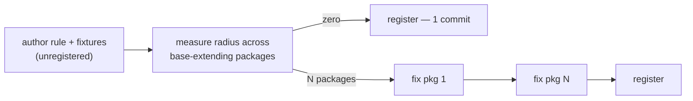

# Refactor: Interface Doctrine as Shipped Enforcement, Landed as Revertable Increments

## Summary

Rebuild `packages/effect-daemon-spec` into the shape the interface doctrine
describes, then ship the lint rules that hold that shape in place — in that
order, as a queue of independently revertable increments.

**The specimen first.** `effect-daemon-spec` goes from a single 177-line mixed
barrel exposing 78 names into concept directories behind named subpath exports
with a sealed internal tree, and carries one lifecycle ordering constraint as a
typed refusal a consumer's compiler prints.

**Then the rules that fence it.** Derive the rule set the doctrine needs from the
closed enumeration of surface decisions, ship the subset a per-file linter can
decide, and name the rest as uncarried rather than faking them. The existing rule
estate is an input to that audit, not its baseline: a rule contradicting the
target architecture is deleted, not repaired.

**Why that order, and why it is not the order the first draft had.** A rule
cannot register green while its own subject violates it. Ordering rules first
made the specimen's cleanup depend on rules whose registration depended on the
cleanup — a cycle this plan's review found from two directions. Inverting it
dissolves the cycle and buys a better verification story: each rule registers
against a tree that already satisfies it, so the rule _confirms_ an achieved
shape instead of _driving_ an unachieved one, and a registration that reports
non-zero is then a real defect rather than expected debt.

**What each half is worth, honestly.** The corpus ranks enforcement channels, and
the two halves sit on different rungs. The typed refusal rides in the package's
own emitted `.d.ts` and binds every installer unconditionally — the compiler
rung, the strongest available, where compliance is by construction. The lint
rules are a tool gate — real, measured elsewhere as a compliance jump from 67.0%
to 88.3%, but weaker, and reaching only a consumer who also extends the published
shared config. So the specimen is the load-bearing proof and the rules are the
durable fence around it. That ordering of worth is also the delivery order.

---

## Problem Frame

### The specimen's shape

`packages/effect-daemon-spec/src/mod.ts` is 177 lines that both assemble a
surface and define behaviour. It carries 15 re-export statements from 14 sources,
8 of them `export *`, and 15 behaviour-bearing definitions — `poll`, `stream`,
`subscription`, `leader`, `task`, `supervision`, `dynamic`, `oneForAll`,
`oneForOne`, `restForOne`, and three `as const` namespace objects. The file
carries no cell suffix, so none of those definitions is reachable by any cell
rule or by the mutation classifier.

It also holds two `Layer.effect` composites. Those are **not** a problem — see
KTD-8. The first draft of this plan thought they were, and invented an entry
split to solve it. The corpus says otherwise and both go.

The package declares one subpath. Its rolled declaration exposes 79 export
declarations — 17 class, 30 const, 15 type, 15 interface, 1 function, 1
re-export — and api-extractor emits 20 `ae-forgotten-export` warnings, meaning 20
names reach the published type surface without anyone deciding they should.

### Enforcement points the wrong way

`no-barrels` bans barrel files, `export *`, named re-export from a barrel, and
barrel imports — and is set to `'off'` in the shared config. It is off because it
forbids the entry-module shape the doctrine requires. Separately,
`cell-suffix-required.config.ts` exempts both `index.ts` and `mod.ts` from the
suffix requirement, so the tree sanctions two barrel names and no rule can key on
either as _the_ entry.

Across the repo, three files ending `.kernel.ts` are test harnesses —
`effect-gherkin-spec/src/feature.kernel.ts`,
`effect-schema-law/src/refutes.kernel.ts`, and
`.../rule-of-schemas.kernel.ts` — so one suffix currently spans both a pure
combinator and a test harness, and the import boundary applies identical rules to
both.

### Why the previous attempt did not land

**The evaluator moved while it judged.** `AGENTS.md` § Surface Classes requires an
evaluator change to land in its own commit, with the gate observed red before and
green after. The previous attempt activated new rules and edited the code those
rules judge inside single commits. Every measurement taken afterward was against
a moving instrument, so no green reading certified anything.

**Blast radius was discovered after registration, not before.** Registering a rule
in `packages/oxlint-config/src/oxlint-config.base.ts` makes it bite every
base-extending package at once. Registering first and measuring after converted
each new rule into a repo-wide emergency.

**Scope leaked past the declared boundary.** The boundary named the daemon plus
the plugins. Execution also rewrote three unrelated packages because a newly
registered rule had made them red.

---

## Requirements

The specimen:

- **R1** — `packages/effect-daemon-spec` exposes concept-scoped subpaths, each
  with its own `types` and `default` condition.
- **R2** — Nothing under `src/internal/` is reachable by a consumer.
- **R3** — The surface entry and every directory barrel carry no
  behaviour-bearing definition. Enumerated re-exports, chunk namespace objects,
  and lazy wiring values are surface content, not behaviour (KTD-8).
- **R4** — No file with a pure cell suffix imports a file with an impure one.
- **R5** — One lifecycle ordering pair is carried in the type such that
  mis-ordering produces a compiler error naming the required order, at a call
  site a consumer writes.

The fence:

- **R6** — `export * from` is rejected in every package that extends the shared
  oxlint config, by a rule shipped in a published plugin.
- **R7** — A module matched as a declared entry contains only surface content, or
  only its own definitions, never both.
- **R8** — A module that is _not_ a declared entry re-exports only names it
  declares itself.
- **R9** — The count of top-level names a declared entry exposes is measured and
  bounded, with the bound configurable per package.
- **R10** — The entry rules key on one declared pattern, set once in shared
  config, and a package whose barrel differs declares it rather than going
  unjudged.
- **R11** — A pure cell cannot import a test runtime.
- **R12** — A test harness has its own cell, distinct from both the pure cell it
  is mistaken for and the observer cell it is not.
- **R13** — A behaviour-bearing cell cannot import a directory barrel.
- **R14** — A type-only declaration module has a cell that forbids runtime
  exports, and every cell may import it.
- **R15** — Every surface decision the doctrine enumerates is either carried by a
  shipped rule or listed as uncarried with the reason it cannot be. No decision
  is silently absent.
- **R16** — `no-barrels` is deleted, not left dormant beside its successors.

Delivery — binding on every unit:

- **R17** — Every increment leaves `pnpm check` exiting 0. No increment is landed
  on the promise that a later one repairs it.
- **R18** — A rule and the code it judges never change in the same commit.
- **R19** — A rule's blast radius across base-extending packages is measured
  before it is registered, and the measurement is recorded in the registration
  commit body.
- **R20** — No increment edits a package outside its own declared scope. Fallout
  a measurement reveals becomes its own increment rather than being absorbed.
- **R21** — Each increment is revertable alone: reverting it restores a green
  tree without touching any other increment.

---

## Key Technical Decisions

### KTD-1 — Specimen before fence

A rule registers only against a tree that already satisfies it. This is forced:
R17 requires green at every increment, and a rule whose own subject is red cannot
register green. It is also better verification — the rule confirms an achieved
shape rather than driving an unachieved one, so a non-zero reading at
registration is a genuine defect and not expected debt.

The specimen does not need the rules in order to be restructured. It is guided by
the doctrine and verified by the existing suite and gates. The rules arrive
afterward and lock the result in.

### KTD-2 — Registration is the deployment event, so it is its own commit

Authoring a rule file changes nothing; adding it to the shared config deploys it
to every base-extending package simultaneously. Treating those as one step is
what made the previous attempt a big bang. They are split in every rule unit
below, and the measurement between them is mandatory (R19).

### KTD-3 — The landing recipe adapts to measured radius

A zero-radius rule costs one commit; an N-package rule costs N+2. This keeps R20
honest — fallout becomes visible before it is load-bearing. Under KTD-1 the
daemon is never part of that N, because it was cleaned first.

### KTD-4 — Activation is scheduled, not deferred, and the guarantee is conditional

Set every rule to `error` in shared config, and keep `pnpm check` green with no
filtered run. As one step those cannot both hold. Decoupling registration from
authorship reconciles them: each rule registers after the packages it breaks are
clean, so the tree is green at every commit.

**The guarantee is conditional on queue completion.** If a rule's fallout stalls —
and the span rule's is the most likely to — that rule stays authored and
unregistered until the fallout is fixed. That is the "one rule ships
unregistered" outcome, bounded in time by a scheduled fix rather than accepted
indefinitely. Saying otherwise would overclaim.

### KTD-5 — Barrel filename is `mod.ts`, and the entry pattern is declared

The doctrine excludes the barrel filename from the public surface: the
entry-module filename and the type-declaration filename are invisible behind the
package's exports map, so renaming barrels repo-wide buys nothing a consumer can
see. Both entry rules read one shared pattern constant, so the key is defined in
one place and the two rules cannot drift on what an entry is. A package whose
barrel is `index.ts` passes the option; nothing is renamed.

The honest cost is recorded in Risks, and it is larger than it looks: with the
pattern set to `mod.ts`, every `index.ts` is a _non-entry_ module and falls under
R8 rather than R7.

### KTD-6 — The wildcard ban is what makes the span counter decidable

The plugin API gives a rule per-file context only. A span count over an entry is
sound only when every name that entry exposes is written in that file, which is
exactly what banning `export *` guarantees. The wildcard ban is a precondition of
the span rule, and it is also the coupling that makes the span rule expensive,
because enumerating a wildcard is what makes a previously invisible surface
countable.

### KTD-7 — The vocabulary is the enforcement substrate; the rule polices it

A suffix makes a file classifiable; a rule holds the classification to account.
Where the existing vocabulary has no name for a real kind of file — a test
harness, a type-only declaration module — the fix is a new cell plus its keyed
rule, not a broader rule over the old vocabulary or an exemption carved into an
existing one.

### KTD-8 — A published lazy `Layer` is surface content, not behaviour

The corpus settles this directly and it removes a problem the first draft
invented. A package may publish adapter bindings — values pairing concrete
adapters with dependency ports, `Layer` being the named example — provided the
binding is lazy, meaning importing the module constructs a description and
executes nothing. A value that starts the loop, opens the connection, or spawns
the worker at import time is a hidden composition root and is forbidden; a
`SomethingLive: Layer<…>` is not. Warrant: `posit`, from a stable decision page
whose discriminator is Seemann's constitutive definition of a composition root
(not unique, executes nothing → not a root) and De Goes's description-versus-
interpretation altitude test.

The companion ruling enumerates what a declared entry may contain: enumerated
re-exports, chunk namespace objects, binders, and lazy wiring values. A
`Layer.effect` composite is a lazy wiring value.

Therefore the daemon's two composites stay in the surface entry. There is no
three-rule collision: `executor-no-layer-binding` bans Layers inside
`*.executor.ts`, which is where they are not; the entry rule permits lazy wiring
values, which is what they are; and R3 is worded to match. No second entry file
is created, and no unit needs to name one.

### KTD-9 — The depth floor has no shippable carrier and is declared, not faked

The doctrine's depth rule requires counting implementation modules hidden behind
an entry and comparing exposed names against available candidates. Both need
cross-module knowledge a per-file linter does not have, and a repo-local script
would violate REPO-S6 by enforcing a published concern outside the published
artifact. It is exhibited, not enforced — and the statement saying so ships in
the package's own README, which U5 writes.

### KTD-10 — The typed-refusal exemplar is chosen for boundary reach

Eight lifecycle ordering pairs exist in the package. The chosen pair is
policy-before-supervisor, because a consumer writes that call site. A pair
reachable only from inside the package would prove the mechanism compiles but not
that it crosses the package boundary, which is the whole claim.

### KTD-11 — Multi-subpath follows the in-repo reference, not a new pattern

`packages/effect-schema-extensions` already emits multiple named subpaths with
per-subpath `types` and `default`, using one tsdown entry map plus per-entry
api-extractor configs. Follow it. Never hand-edit `package.json#exports` or
`publishConfig.exports` (REPO-S4) — the manifest is build output.

---

## What This Plan Refuses

Each was built during the previous attempt and is refused here, on a ruling or a
measurement rather than a preference. None is to be re-introduced without
re-opening the ruling first, in its own change.

| refused                                                                         | grounds                                                                                                                                                                                                                                                            |
| ------------------------------------------------------------------------------- | ------------------------------------------------------------------------------------------------------------------------------------------------------------------------------------------------------------------------------------------------------------------ |
| A `.port.ts` cell and a `port-declaration-only` rule                            | The cell atlas admits no `port` cell. It assigns the consumer-named deps port to the **executor**, and uses `port` only as a coordinate value on the adapter row. `port` is a role, not a file kind. Warrant: `convention`.                                        |
| Inverting `executor-requires-deps-tag` to let an executor borrow a provider Tag | A provider-named Tag exposing the whole provider surface **is** the header-interface anti-pattern that rule exists to kill. Warrant: `canon` — Fowler's role-vs-header interface distinction, cited by the repo's own rule description.                            |
| Deleting the daemon's four `<Executor>Deps` tags                                | A consequence of that inversion. Measured under the restored rule: 6 errors in the daemon, 1 in `effect-memfs`, all caused by the deletion.                                                                                                                        |
| Widening the `observer-operational-exports` whitelist with domain stems         | Rule weakening to make a change pass, forbidden on every surface by § Surface Classes.                                                                                                                                                                             |
| A second "runtime entry" holding the `Layer.effect` composites                  | KTD-8 — the corpus permits lazy wiring values in a surface entry, so the collision that motivated the split does not exist.                                                                                                                                        |
| Making the cell import table a total allow-list in this plan                    | Deferred, not refused on principle. The plan itself adds two cells and explicitly defers the repo-scale taxonomy question, so hardening the table while the enumeration is admittedly open is premature — and it was the plan's only unit with no measured radius. |

---

## Implementation Units

Three phases. Each unit ends with `pnpm check` green (R17). Every rule unit
follows the KTD-3 recipe, so its commit count is decided by measurement.

All rules live in existing published plugins and follow the grouped
meta-in-`.config.ts` convention used by `ban-classes.ts` / `ban-classes.config.ts`:
`defineRule({ meta, create })`, options parsed with `S.decodeUnknownSync`, report
via `context.report({ node, messageId, data })`, tested with `RuleTester` from
`oxlint/plugins-dev` under vitest. Stated once here rather than in each unit.

### Phase A — Foundation

#### U0. Confirm the ground-zero baseline

**Goal:** Establish that the starting tree is green, so every later red reading is
attributable.

**Files:** none. **Dependencies:** none.

**Approach:** Run `pnpm check`. If red, repair that first as its own commit — a
red baseline invalidates every measurement in this plan.

**Verification:** `pnpm check` exits 0.

**Test expectation:** none — this is a measurement, not a change.

---

#### U1. Land the doctrine record

**Goal:** Commit the architecture paper and its package-boundary addendum, so the
reasoning survives independently of the code that implements it.

**Requirements:** R15. **Dependencies:** U0.

**Files:** `docs/papers/architecture-for-machine-authors.md`,
`docs/papers/addendum-what-crosses-the-package-boundary.md`, `docs/audits/**`.

**Approach:** Docs-only commit. These are the artifacts later units cite for their
warrant, so they land first.

**Verification:** `pnpm check` exits 0; the diff touches only `docs/`.

**Test expectation:** none — documentation carries no behaviour.

---

#### U2. `check-exports.mjs` accepts a sealed subpath

**Goal:** A `null`-valued export entry is a deliberate seal, not a crash.

**Requirements:** R2 (precondition). **Dependencies:** U0.

**Files:** `scripts/check-exports.mjs`.

**Approach:** The script iterates every exports subpath and reads `.default` and
`.types` off each value; a `null` value throws. Skip null-valued subpaths before
the condition checks, and count them separately so a sealed path is visible in the
run's output — the script already counts what it saw specifically so a skipped run
cannot report zero issues.

**Execution note:** Evaluator surface (§ Surface Classes). Its own commit, reason
stated. Observe the gate red on a null subpath before and green after, and confirm
it still fails on a subpath missing `types` — the repair must not widen into a
pass.

**Test scenarios:**

- A fixture manifest with `"./internal/*": null` exits 0 and reports one sealed
  subpath.
- A fixture manifest with a subpath missing `types` still exits non-zero.
- A fixture manifest with no null entries behaves unchanged.
- The build-count assertion still fires on an unbuilt tree.

---

### Phase B — The specimen

Nothing in this phase depends on a new lint rule. It is guided by the doctrine and
verified by the existing suite, `pnpm check`, and the package's API report.

#### U3. Evict behaviour from the daemon barrel and enumerate its wildcards

**Goal:** The surface entry carries no behaviour-bearing definition and no
wildcard; no pure cell imports an impure one.

**Requirements:** R3, R4. **Dependencies:** U0.

**Files:** `packages/effect-daemon-spec/src/mod.ts`, the ten cells named below,
`src/supervision.schema.ts`, `src/internal/supervisor-body.executor.ts`, and a
new `.type.ts` module for the shared declaration. **No new cell file beyond that
one is created.**

**Approach:** The fifteen definitions in the barrel are thin wrappers over cells
that already exist — `poll` pins type arguments on `pollKernel`, `leader` is two
lines of `Effect.flatMap` over `leaderKernel`, `dynamic` applies one default over
`dynamicKernel`. A wrapper belongs in the cell it wraps:

| definition     | merges into                         |
| -------------- | ----------------------------------- |
| `poll`         | `daemon-poll.kernel.ts`             |
| `stream`       | `daemon-stream.kernel.ts`           |
| `subscription` | `daemon-subscription.kernel.ts`     |
| `leader`       | `supervision-leader.kernel.ts`      |
| `task`         | `supervision-task.kernel.ts`        |
| `supervision`  | `supervision-worker.kernel.ts`      |
| `dynamic`      | `supervisor-dynamic.kernel.ts`      |
| `oneForAll`    | `supervisor-one-for-all.kernel.ts`  |
| `oneForOne`    | `supervisor-one-for-one.kernel.ts`  |
| `restForOne`   | `supervisor-rest-for-one.kernel.ts` |

`Daemon`, `run`, and `Supervision` stay in the barrel as chunk namespace objects.
The two `Layer.effect` composites stay too, as lazy wiring values (KTD-8).

Also enumerate the eight `export *` statements in the same file, in the same
commit series. Doing it here rather than under the later wildcard rule keeps the
daemon out of that rule's radius entirely.

Separately, `src/supervision.schema.ts` imports
`src/internal/supervisor-body.executor.ts` — the one pure-to-impure edge in the
package. Break it by moving the shared declaration into a `.type.ts` module both
sides import, not by re-exporting through a third file.

**Execution note:** Merging a wrapper into its kernel changes that kernel's shape,
so the barrel's re-export line changes with it. One cell at a time, barrel
compiling between each; a batch merge makes a failure un-attributable.

**Test scenarios:**

- The `.kernel.ts` file count is unchanged at 22 — the merge must not add cells.
- `mod.ts` contains no `export *`.
- Every existing test passes with its import specifier unchanged at this unit's
  boundary.
- A parse of `src/**/*.ts` finds zero pure-to-impure edges.
- `pnpm --filter @systemfsoftware/effect-daemon-spec api:check` shows only
  relocations in the report diff.

---

#### U4. Concept directories with enumerated barrels

**Goal:** Files sit in directories named for the capability they serve, each with
an enumerated barrel.

**Requirements:** R1 (precondition), R3. **Dependencies:** U3.

**Files:** all of `packages/effect-daemon-spec/src/`, plus the tests under
`__tests__/` and `src/**/__tests__/`.

**Approach:** The import graph shows eight groupings. Two are self-contained and
are the strong seams: `leader-lock/` (`leader-lock.adapter.ts`,
`leader-lock.kernel.ts`, `leader-lock.schema.ts`, `lock-primitive.schema.ts`) and
`intensity/` (`intensity.kernel.ts`, `intensity-window.kernel.ts`). The rest
cluster as `backoff/`, `supervision-policy/`, `daemon-metrics/`, `daemon-health/`,
`daemon-spec/` (the types-and-brands root nearly everything imports), and
`runtime/` (the executors and loop builders, with the 405-line supervisor body as
their hub). `daemon-reporter.adapter.ts` is imported only by executors and the
barrel; fold it into `runtime/` rather than giving it a directory of one.

Directories name capabilities and files stay flat inside each — no
technology-layer segment above a capability, no `util/`, `common/`, `helpers/`.

**Execution note:** One directory per commit. Move files with `lsp` `rename_file`
so import rewrites are handled by the language server. Lint and typecheck after
each directory; a failure must cost one directory, not the package.

**Test scenarios:**

- Each new directory has exactly one barrel, and no barrel contains `export *`.
- No cell imports a sibling directory's barrel — the shape U13 will later enforce
  holds here already.
- The full suite passes; test import specifiers name the barrel file explicitly.
- `tsc --noEmit` is clean — a directory import that lost its filename fails TS2307
  and must surface here.

---

#### U5. Named subpaths, per-subpath types, sealed internal, and the depth-floor note

**Goal:** The package publishes concept-scoped subpaths, `./internal/*` is
unreachable, and the depth floor's declared-not-enforced status is stated where a
consumer reads it.

**Requirements:** R1, R2, and KTD-9's statement. **Dependencies:** U2, U4.

**Files:** `packages/effect-daemon-spec/tsdown.config.ts`, `api-extractor.json`,
new per-subpath `api-extractor.<name>.json`, `package.json` (build script only),
`etc/*.api.md`, `packages/effect-daemon-spec/README.md`.

**Approach:** Follow the `effect-schema-extensions` reference (KTD-11): an `entry`
map with one key per subpath, `exports.customExports` injecting `types` and
`default` per subpath, and one api-extractor config per entry chained in the build
script. Add `"./internal/*": null` through the same hook.

Which concepts become subpaths is a subset of U4's directories, not all of them: a
directory groups files, a subpath exists because a consumer imports from it. Start
from the names the integration tests actually reach for.

Add one README paragraph stating the depth floor is exhibited, not enforced, and
why no shippable carrier exists for it (KTD-9). Without this the R15 gap-note
lands only in a paper that does not ship with the package.

**Execution note:** One subpath per commit, each with its regenerated API report.

**Test scenarios:**

- `pnpm check:exports` exits 0 and reports the sealed subpath.
- `attw` passes for every declared subpath, not only `.`.
- Importing `…/internal/anything` fails to resolve.
- Each `etc/*.api.md` regenerates and `ae-forgotten-export` reaches zero, or every
  remaining warning is named in the unit report with a reason.
- The README paragraph exists and names the depth floor.
- The API report diff for each commit contains only relocations.

---

#### U6. Policy-before-supervisor as a typed refusal

**Goal:** A consumer passing a hand-built supervision policy to a supervisor
constructor gets a compiler error naming the required order.

**Requirements:** R5. **Dependencies:** U5.

**Files:** `packages/effect-daemon-spec/src/daemon-spec.schema.ts` (the
`SupervisionPolicy` brand and the `SupervisorOpts.supervision` parameter type),
the surface entry's `Supervision.*` and `oneFor*` signatures, and a new
consumer-perspective type test.

**Approach:** Brand `SupervisionPolicy` so only `Supervision.leader` / `worker` /
`task` / `custom` construct one. `oneForAll` / `oneForOne` / `restForOne` accept
the branded policy and, for anything else, resolve the `supervision` parameter to
a literal type whose text names the required order and the reason. This is a
breaking change to a published type and is intended (REPO-R1).

**Execution note — spike first, and it gates the unit.** The claim is that the
sentence survives api-extractor's `dtsRollup` into the emitted declaration. That is
unproven and the whole unit rests on it. Before any signature changes, build a
minimal branded refusal, run the package build, and confirm the sentence appears
in the rolled `.d.ts`. If it does not survive, stop and report — the mechanism, not
the wording, is what failed, and the plan needs a different carrier. Do not spend
the signature work ahead of that reading.

**Test scenarios:**

- `oneForAll({ supervision: Supervision.worker(cap), … })` compiles.
- `oneForAll({ supervision: Effect.succeed({ intensity, backoff, cooldown }), … })`
  fails, and the error text contains the sentence.
- The sentence appears verbatim in `dist/*.d.ts` after a build.
- A consumer fixture outside the package reproduces the error, proving it crosses
  the package boundary rather than only holding inside the repo.
- Every existing supervisor construction in the package's tests still compiles
  unchanged.

---

### Phase C — The fence

Every rule here registers against a tree in which the daemon already complies.

#### U7. `no-wildcard-reexport`

**Goal:** Reject `export * from "…"` in every package extending the shared config.

**Requirements:** R6. **Dependencies:** U3 (the daemon's wildcards are already
gone).

**Files:** `packages/oxlint-plugins/core/src/rules/no-wildcard-reexport.ts`,
`.config.ts`, `__tests__/no-wildcard-reexport.test.ts`, `core/src/index.ts`.

**Approach:** Visitor is `ExportAllDeclaration`. `export * as Ns from` is a
distinct construct and is **not** banned — it is a namespace object, which the
doctrine names as a legitimate chunking device and which U11 counts as one name.
The message names the mechanism, not the preference: the default export is
dropped, and colliding names from two wildcard statements are both lost.

**Measured expectation:** seven `src/mod.ts` barrels outside the daemon carry
`export *` — `effect-cell-types`, `effect-gherkin-spec`,
`effect-schema-extensions` (×2), `effect-schema-law`, `hex-schema`, `rx-effect`.
Enumerating a wildcard is mechanical and each of these barrels is pure re-export,
so each conversion is its own small commit.

**Test scenarios:**

- `export * from './x.js'` reports.
- `export * as Ns from './x.js'` does not report.
- `export { a, b } from './x.js'` does not report.
- `export type * from './x.js'` reports — a type-only wildcard is still
  undeclared surface.
- `import * as ns from './x.js'` does not report.
- Two wildcards in one file produce two reports, not one.

---

#### U8. The `.harness.ts` cell and `harness-no-module-scope-registration`

**Goal:** Give test harnesses their own cell, so a harness stops being mistaken for
a pure kernel and stops needing an exemption to import a test runtime.

**Requirements:** R12, R11. **Dependencies:** U0.

**Files:**
`packages/oxlint-plugins/cell-taxonomy/src/rules/cell-suffix-required.config.ts`
(add `harness` to `CELLS`),
`.../rules/harness-no-module-scope-registration.ts`, `.config.ts`, its `__tests__`
file, `cell-taxonomy/src/index.ts`,
`packages/oxlint-plugins/cell-imports/src/cell-import-table.config.ts` (the harness
row); then, in separate commits, the three renamed files and their importers.

**Approach:** A harness builds test structure for a consumer to run; it is not
itself a test and it is not an observer. The corpus names a library-native
test-harness cell rather than folding it into the observer frame — a library
publishes harnesses as product. Warrant: `posit`, derived from the
library-cell-vocabulary ruling; its falsifiable prediction is tested by U9
reporting zero after the rename.

The keyed rule forbids **registration at module scope**: a top-level
`RuleTester.run(…)`, `describe(…)`, or `it(…)` call in a `.harness.ts` file.
Construction at module scope is fine. A harness must let its consumer decide _when_
the tests register; a harness that registers on import has stolen that decision.

Rename `feature.kernel.ts`, `refutes.kernel.ts`, and `rule-of-schemas.kernel.ts` to
`.harness.ts` with `lsp` `rename_file`. This is a rename only: no body changes, no
signature changes, no re-export shims. If a package's public surface names one of
these files, the subpath changes — a break REPO-R1 permits and prefers over a
compatibility alias.

**Execution note:** The renames are the code half of an evaluator change and must
not share a commit with the rule or the `CELLS` entry (R18). Check whether any of
the three is a published entry before renaming; if so its `tsdown.config.ts` entry
map changes with it, never `package.json#exports` by hand.

**Test scenarios:**

- A top-level `RuleTester.run(…)` in `a.harness.ts` reports.
- The same call inside an exported function in `a.harness.ts` is clean.
- `export const harness = makeHarness()` at module scope in `a.harness.ts` is
  clean — construction is not registration.
- `a.observer.ts` with a module-scope registration is clean.
- After the renames, U9 reports zero violations repo-wide.
- `cell-suffix-required` accepts all three new names.
- Each renamed package's own suite passes unchanged.

---

#### U9. `no-test-runtime-in-pure-cell`

**Goal:** A file with a pure cell suffix cannot import a test runtime.

**Requirements:** R11. **Dependencies:** U8 (its two violations are fixed by that
rename, so it registers after).

**Files:**
`packages/oxlint-plugins/cell-imports/src/rules/no-test-runtime-in-pure-cell.ts`,
`.config.ts`, its `__tests__` file, `cell-imports/src/index.ts`.

**Approach:** Lives in `cell-imports` beside `cell-import-boundary`, since it is an
import-edge rule keyed on the same filename-suffix arithmetic. Pure suffixes are
`workflow`, `kernel`, `schema`, `shape`; banned specifiers are `vitest`,
`@effect/vitest`, `fast-check` and their subpaths, configurable. A test file is
exempt regardless of suffix.

The rule binds **runtime** imports only, and that is what makes it shippable.
`import type` from a banned specifier is exempt, because a type-only import leaves
no runtime dependency to ban — Dependency Rejection by type parameter, the shape a
well-built harness already uses. A dynamic `await import('vitest')` inside an
`import.meta.vitest` guard is exempt for the same reason plus a stronger one: it is
the repo's sanctioned in-source test block, and a rule that flagged it would flag
the daemon's own kernels.

**Measured expectation:** two violations, both outside the daemon —
`effect-schema-law/src/refutes.kernel.ts` and `.../rule-of-schemas.kernel.ts`,
which import `@effect/vitest` and `vitest` as runtime values. Both are resolved by
U8's rename.

**Test scenarios:**

- `a.kernel.ts` with `import { it } from '@effect/vitest'` reports.
- `a.kernel.ts` with `import type { TestAPI } from 'vitest'` is clean.
- `a.kernel.ts` with `await import('vitest')` inside `if (import.meta.vitest)` is
  clean.
- `a.kernel.ts` with a bare top-level `await import('vitest')` reports.
- `a.executor.ts` importing `vitest` is clean — the rule binds pure cells only.
- `a.kernel.test.ts` and `__tests__/a.kernel.ts` importing `vitest` are clean.
- `a.schema.ts` importing `fast-check/something` reports — subpaths count.

---

#### U10. `entry-surface-or-unit`, including the non-entry clause

**Goal:** A declared entry contains only surface content or only its own
definitions, never both; and a non-entry module re-exports only what it declares.

**Requirements:** R7, R8. **Dependencies:** U3 (the daemon barrel already
complies), U7.

**Files:** `packages/oxlint-plugins/core/src/rules/entry-surface-or-unit.ts`,
`.config.ts`, its `__tests__` file, `core/src/index.ts`.

**Approach:** Entry detection is filename-based on `context.filename`, matching the
`ENTRYPOINT_FILE` regex convention already used by `entrypoint-no-exports.ts` —
default `/(?:^|[\\/])mod\.ts$/u`, overridable through options. Classify by walking
top-level statements once: a re-export marks surface; an export carrying a
behaviour-bearing declaration marks unit. Report when both marks are set, on the
second-kind node.

Three clauses carry weight.

_The namespace-object clause._ `export const X = { a, b, c } as const`, where every
property value is an identifier bound by an import in the same file, is **surface**.
It names no new behaviour, it chunks existing names, and U11 counts it as one. An
object with an inline function, literal, or call expression among its values is a
definition and marks unit.

_The lazy-wiring clause (KTD-8)._ A `Layer` value built from imported bindings is
surface, not behaviour. Without this clause the rule would report the daemon's own
compliant barrel, and the corpus ruling it would be contradicting is the one that
permits it.

_The non-entry clause (R8)._ A module that is not an entry may re-export only names
it declares itself. Re-exporting a name whose home is another module gives that
name a second home, and since the import table decides on the specifier, the second
home launders an edge the table would otherwise refuse.

**Measured expectation — re-measured at ground zero, superseding the first draft's
stale figure.** The first draft cited `effect-gherkin-spec/src/feature.observer.ts`,
which does not exist on disk; that filename came from working-tree state that was
later discarded. Measured now: one non-entry re-export in
`effect-gherkin-spec/src/feature.kernel.ts`
(`export { type RegisterMode } from './feature-runtime.kernel.js'`, which U8 renames
to `feature.harness.ts` first), and six across five files in the `stryker-js` fork
packages. Because the entry pattern is `mod.ts` (KTD-5), every `index.ts` is also a
non-entry module — `effect-memfs/src/index.ts` is the known case. Confirm which of
these packages actually extend the shared config before counting them in the
radius; `pnpm check:lint-coverage` is what defines that set, and it is never
re-derived by hand.

**Open sub-question this unit must answer before its fixtures are written:** does
the non-entry clause exempt a type-only re-export, and does it apply to a
`.harness.ts` cell? Answer it in the rule's config docs, not in an ad-hoc exemption.

**Test scenarios:**

- An entry with only `export { a } from './a.js'` is clean.
- An entry with only `export const a = 1` is clean — a unit that happens to be an
  entry is permitted.
- An entry with both reports once, at the definition.
- A non-entry file with both is clean under the entry clause.
- An entry re-exporting plus a non-exported local helper is clean.
- An entry with `export type { T } from './t.js'` plus `export const a = 1` reports.
- A custom option pattern of `index.ts` judges `index.ts` and not `mod.ts`.
- An entry with re-exports plus `export const Daemon = { poll, stream } as const`,
  both identifiers imported, is clean.
- The same with `{ poll: () => 1 }` reports.
- An entry with re-exports plus `export const XLive = Layer.effect(Tag, make)` is
  clean — the lazy-wiring clause.
- An entry with a value that invokes an effect at module scope reports.
- A **non-entry** module re-exporting a name whose home is elsewhere reports.
- A non-entry module re-exporting a name it declares itself is clean.

---

#### U11. `entry-name-span` and the shared entry pattern

**Goal:** Count the top-level names a declared entry exposes and report above a
configured bound; make both entry rules read one pattern constant.

**Requirements:** R9, R10. **Dependencies:** U7 (KTD-6), U10, and — for the daemon
to be under the bound — U5.

**Files:** `packages/oxlint-plugins/core/src/rules/entry-name-span.ts`, `.config.ts`,
its `__tests__` file, `core/src/index.ts`, and the shared pattern constant read by
both entry rules' config modules.

**Approach:** Share entry detection with U10 through the config module. A namespace
object — `export * as Ns`, or an exported `as const` object literal — counts as
**one** name, since chunking is the sanctioned escape from the bound. Report on the
entry's last export node with the actual count and the bound. The default bound is
an option; the doctrine's 7±2 is the shared config's pick, not the rule's.

**Execution note:** This is the highest-radius rule in the plan and the one whose
registration is genuinely expensive. Measured against a bound of nine, only two of
the seven barrels U7 opens clear it — `effect-cell-types` (7) and `rx-effect` (1).
Five barrels across four packages do not: `hex-schema` (10) and the two
`effect-schema-extensions` barrels (10 each) miss by one, `effect-schema-law` (16)
by seven, and `effect-gherkin-spec` (30) by twenty-one. Counts come from each
package's own `etc/*.api.md`.

The daemon is **not** in that list, and that is the point of KTD-1: U5 already split
its surface into subpaths, so it clears the bound before this rule exists. Had this
rule come first, its registration would have required U5, which required U4, which
required U3 — the cycle this ordering removes.

Registering therefore owes four package restructures. Under KTD-4 that is a
schedule: land the rule and its fixtures, land each package's chunking as its own
commit, then register. If a package's split cannot get under the bound, say whether
the bound was wrong or the split was too shallow — never raise the number to pass.

**Test scenarios:**

- An entry with 9 flat names and bound 9 is clean.
- An entry with 10 flat names and bound 9 reports, and the message carries both
  numbers.
- An entry with 30 names inside one `export * as Ns` counts 1 and is clean.
- An entry with an exported `as const` object of 12 keys counts 1.
- A non-entry file with 40 exports is clean.
- `export { a as b }` counts the exported name `b`, once.
- Both entry rules resolve the same default pattern from the shared constant.
- A package overriding the pattern to `index.ts` has `index.ts` judged by both rules
  and `mod.ts` judged by neither.
- Changing the shared constant changes both rules in one edit.

---

#### U12. Retire `no-barrels`

**Goal:** Delete the conflated rule now that its successors carry every clause it
had a right to.

**Requirements:** R16. **Dependencies:** U7, U10, U11.

**Files:** `packages/oxlint-plugins/core/src/rules/no-barrels.ts`, `.config.ts`,
`__tests__/no-barrels.test.ts` (all deleted), `core/src/index.ts`,
`packages/oxlint-config/src/oxlint-config.base.ts`.

**Approach:** Remove the `'off'` entry rather than leaving a disabled key behind.
Deleted only after its replacements are registered and green, so the tree is never
without both.

**Test scenarios:**

- `no-barrels` is absent from the plugin's exported rule map.
- No config file references it.
- `pnpm check:lint-coverage` still exits 0.

---

#### U13. `no-barrel-import-in-cell`

**Goal:** A behaviour-bearing cell cannot import a directory barrel, so the import
table keeps deciding at every intra-package edge.

**Requirements:** R13. **Dependencies:** U4 (the daemon's directories already obey
it).

**Files:**
`packages/oxlint-plugins/cell-imports/src/rules/no-barrel-import-in-cell.ts`,
`.config.ts`, its `__tests__` file, `cell-imports/src/index.ts`.

**Approach:** A relative specifier names a barrel when its final path segment, after
stripping the optional module extension, is a sanctioned barrel name (`index`,
`mod`) or resolves to a directory. That derivation is identical to the one
`cell-import-boundary.ts` already performs, and the two must share it rather than
each carrying a copy — a divergence between them is a silent hole.

The reason is the addendum's: a barrel cannot launder an edge. A per-file linter
observes one import at a time, so when a cell imports `../Lock/index.js` the table
sees a directory name with no cell suffix and cannot judge what was reached.
Requiring leaf imports inside a package keeps every edge classifiable.

**Measured expectation:** one violation repo-wide, in `effect-memfs`.

**Test scenarios:**

- `import { x } from '../Lock/index.js'` in `a.executor.ts` reports.
- `import { x } from '../Lock/leader-lock.adapter.js'` is clean.
- `import { x } from './mod.js'` from inside the same directory reports.
- A barrel import from a test file is clean.
- An import of an external package is clean.
- A specifier written without an extension is classified the same way as one written
  with `.js` — the derivation is resolution-agnostic.

---

#### U14. The `.type.ts` cell and `no-runtime-export-in-type-cell`

**Goal:** Give type-only declaration modules a cell, so the module U3 introduced is
classified rather than untyped-by-convention.

**Requirements:** R14. **Dependencies:** U8 (same `CELLS` list and import table, so
these serialize rather than contend), U3 (which created the first `.type.ts`).

**Files:** `cell-taxonomy/src/rules/cell-suffix-required.config.ts`,
`.../no-runtime-export-in-type-cell.ts`, `.config.ts`, its `__tests__` file,
`cell-taxonomy/src/index.ts`, `cell-imports/src/cell-import-table.config.ts`; then
the daemon's mis-suffixed declaration files, in a separate commit.

**Approach:** A `.type.ts` file exports types and interfaces and nothing that emits
at runtime. Every cell may import from it, which makes it the right home for shared
declarations a pure cell and an impure cell both need — the alternative being the
pure-to-impure edge R4 forbids.

**Test scenarios:**

- `export type X = string` and `export interface X {}` in `a.type.ts` are clean.
- `export const x = 1` in `a.type.ts` reports.
- `export class X {}` in `a.type.ts` reports — a `Context.Tag` subclass is a runtime
  value, and this is the case that matters.
- `export enum X {}` reports.
- `export declare const x: number` is clean — ambient, no emit.
- A pure cell importing `a.type.ts` is clean under the import table.

---

## Verification Contract

Per unit: that unit's own test scenarios, run by the orchestrator, never accepted on
a worker's report.

| gate                                          | when                                                                |
| --------------------------------------------- | ------------------------------------------------------------------- |
| `pnpm check`                                  | after every unit, without exception (R17)                           |
| the changed plugin's own `test` + `typecheck` | before that plugin's rule is registered                             |
| a recorded blast-radius measurement           | in the body of every registration commit (R19)                      |
| a revert rehearsal                            | for U2 and U5, the two units with irreversible-looking shapes (R21) |
| the U6 rollup spike                           | before any U6 signature change                                      |

`pnpm check` runs `format:check`, `lint`, `typecheck`, `test`, `attw`, `api:check`
and the six root guards under `--continue`, then the two dist-reading gates. No
filtered or partial run substitutes for it (REPO-A1), and a failure anywhere blocks
the unit even when it looks unrelated (REPO-A3).

Then `pnpm --filter @systemfsoftware/effect-daemon-spec mutation` — 100% on changed
pure-core files. `guard-mutate-scope` forbids enrolling `kernel`, `executor`,
`adapter`, `state`, or `schema`-only cells in a `mutate` glob; the daemon's mutation
surface is its `*.workflow.ts` files, and Phase B adds no new mutation scope.

---

## Scope Boundaries

**In scope:** the interface layer of `effect-daemon-spec`; the rules named in
U7–U14; the retirement of `no-barrels`; the null-subpath repair to
`check-exports.mjs`; the doctrine papers; and — only where a measurement proves a
registered rule made them red — the specific named files in `effect-cell-types`,
`effect-gherkin-spec`, `effect-schema-extensions`, `effect-schema-law`,
`effect-memfs`, `hex-schema`, and `rx-effect`.

**Out of scope:** supervision semantics, poll behaviour, leader-lock logic, backoff
maths. No behaviour changes; if a test asserting daemon behaviour changes, the
refactor is wrong. Also out of scope: `repos/**` (REPO-S3), hand-edited
`package.json#exports` (REPO-S4), `minimumReleaseAgeExclude` (REPO-S2).

### Deferred to Follow-Up Work

- **The total cell import allow-list.** Converting the table from permissive-default
  to a closed allow-list is right eventually and premature now: this plan adds two
  cells, and the repo-scale taxonomy question below is open. It also had no measured
  radius, which no implementation-ready unit should lack. Revisit once the taxonomy
  is settled, and measure before scheduling.
- **The discard-class consumption rule.** The paper's enumeration of the
  cross-boundary band ends with the discard class plus the protocol gap. This plan
  carries the protocol gap (U6) and does **not** carry the discard rule. It is
  uncarried for a stated reason rather than absent: the paper grades its own
  mechanism "derived in mechanism and unmeasured in yield" and requires a recall
  measurement before it is believed. Ship the measurement first, then the rule.
- Applying the typed-refusal mechanism to the remaining seven ordering pairs. U6
  proves one; the rest change many signatures and belong in their own plan.
- `effect-memfs`'s `memory-file-system.executor.ts`, mis-suffixed independently of
  this work — it is a factory, not an operation shell.
- Re-testing KTD-7 at repo scale. U8 re-suffixes the three harnesses U9 catches, but
  the wider kernel population still spans several dependency profiles no rule reads.
- Re-opening the refused `port` cell question against the corpus, if a case is made.

---

## Risks and Dependencies

- **The span bound will be contentious.** 79 declarations today against a doctrinal
  7±2 is a 10× overshoot, and hitting it needs real chunking, not re-labelling. If
  U5's subpath split cannot get the root entry under the bound, say whether the
  bound was wrong or the split was too shallow, in the unit report, rather than
  raising the number to pass.
- **U11 owes four package restructures.** The single most expensive registration and
  the one most likely to stall. It is scheduled last for that reason, and every unit
  before it is independently valuable if it does stall. Under KTD-4 the honest
  consequence of a stall is one authored-but-unregistered rule, not a red tree.
- **U6 rests on a rollup behaviour nobody has measured here.** Its spike gate exists
  because the alternative is discovering it after the signature work.
- **Rules break packages outside the specimen.** Expected, and evidence the rules
  bind. Never a reason to weaken them (§ Surface Classes, Editable).
- **`ae-forgotten-export` may not reach zero.** Twenty warnings exist today. Some are
  genuine surface that should be declared; some are leaks that vanish when internal
  is sealed. Classify each rather than suppress the class.
- **The entry pattern leaves most barrels unjudged as entries, and judges them as
  non-entries instead.** 56 `src/**/index.ts` files across 36 package directories are
  not `mod.ts`, so U11 does not bound them while U10's non-entry clause does bind
  them. That asymmetry is the real cost of rejecting a repo-wide rename, and U10's
  radius measurement is where it becomes visible.
- **U8 and U14 both edit `CELLS` and the import table; U10, U11, and U12 all edit the
  shared config.** Serialized above; must not be parallelized (REPO-M1).

---

## Open Questions

- **Q1 — Which directories become subpaths?** U5 says "a subset, driven by what
  consumers reach for," and the integration tests are the only consumer evidence in
  the repo. Where that evidence is thin, do not publish the subpath — an unpublished
  directory is free to move, a published one is not.
- **Q2 — Does `no-wildcard-reexport` survive U10?** The two overlap on
  `export * from`. Resolve by measuring at U10: if no fixture distinguishes them,
  delete the narrower rule in U10's registration commit rather than carrying two
  names for one law.
- **Q3 — Does the non-entry clause exempt type-only re-exports, and does it reach a
  `.harness.ts` cell?** U10 must answer this in its config docs before its fixtures
  are written; the measured radius depends on the answer.

---

## Definition of Done

- Every unit landed as its own commit, each with `pnpm check` green at that commit,
  and no commit containing both a rule and a change to code that rule judges.
- Every registration commit body carries the measured radius that preceded it.
- The daemon's surface entry carries no behaviour-bearing definition and no
  `export *`; its two lazy `Layer` bindings remain, and `entry-surface-or-unit`
  reports zero on it when that rule later registers.
- `./internal/*` is sealed and `pnpm check:exports` reports it.
- Every declared subpath carries its own `types` and `default` and passes `attw`.
- The package README states the depth floor is exhibited, not enforced.
- The policy-before-supervisor sentence appears verbatim in the emitted `.d.ts` and
  a consumer fixture outside the package reproduces the error.
- `no-barrels` is deleted; every rule this plan ships is `error` in the shared
  config; both entry rules read one shared pattern constant.
- `no-test-runtime-in-pure-cell` reports zero repo-wide, and the daemon's kernel
  count is unchanged at 22.
- Every surface decision the doctrine enumerates is either a shipped rule or a stated
  gap (R15) — including the discard class, which is named in Deferred with its
  reason.
- Nothing in "What This Plan Refuses" is present in the tree.
- `pnpm check` exits 0, from this session, after the last edit.
- No file changed outside the units' declared scopes.
