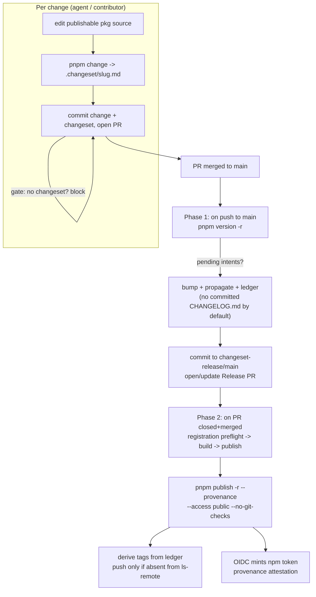

## Goal Capsule

- **Objective:** Replace the broken semantic-release per-package release loop with pnpm-native workspace release management (`pnpm change` → `pnpm version -r` → `pnpm publish -r`), publishing via npm OIDC trusted publishing, and enforce that every change to a publishable package carries a changeset.
- **Authority hierarchy:** This plan obeys the repo `AGENTS.md` and `CONSTITUTION.md`. Where they bind (Evaluator-surface discipline, REPO-S2/S4, testing trophy), they override anything softer here.
- **Stop conditions:** The migration is _code-complete_ when the new release path is implemented, `pnpm check` exits 0, the changeset gate blocks a no-changeset PR, and the U1 preflights (signature ruleset, dirty-tree, registration) pass. It is _released_ when a maintainer completes npm trusted-publisher registration out-of-repo and a first real release publishes + tags + attests provenance end-to-end. The real release is a maintainer-gated handoff, not a unit the agent can complete alone. If a preflight or the canary release proves the pnpm-native path non-functional on 11.21.0 after diagnosis, stop and surface the blocker; semantic-release stays in place as the fallback until the canary succeeds.
- **Execution profile:** Multi-file refactor across release tooling, CI, and the agent harness. Accepts breaks (REPO-R1 — every package is pre-1.0 ALPHA).
- **Tail ownership:** The plan author owns implementation through code-complete and the canary release; the first full 46-package release is gated on the maintainer's out-of-repo npm registration and is handed off, not auto-shipped.

---

## Product Contract

### Summary

The repo ships 46 publishable `@systemfsoftware/*` packages from one pnpm workspace, 45 of them interlinked through `workspace:` ranges. Releases currently run through a hand-rolled `scripts/release.mjs` loop that invokes `semantic-release` once per package. That loop is broken in production: `pnpm version` aborts with `ERR_PNPM_UNCLEAN_WORKING_TREE` because the prior fix (commit `29338581f2d`, "stop semantic-release pushing release commits to main") removed the only step that committed each package's version bump, so the first releasing package dirties the tree for every later one. Two further documented failure modes compound this — orphaned tags after force-push crash tag creation, and `release-monorepo-filter.mjs` overflows its buffer on large commits.

This plan replaces that path with pnpm's native workspace release management: developers and agents record change intents with `pnpm change`; at release time `pnpm version -r` consumes every pending intent in one atomic pass (propagating through `workspace:` ranges), then `pnpm publish -r` publishes via npm OIDC trusted publishing with provenance attestation. A CI gate blocks any PR that touches a publishable package without a changeset, so agents author them by necessity. The old semantic-release toolchain is removed only after the new path has published a real release end-to-end, so a failure falls back instead of dead-ending.

### Problem Frame

The semantic-release loop has accumulated three independent failure modes, each rooted in driving a single-package tool across a monorepo:

- **Unclean working tree** (the live failure): `pnpm version --no-git-tag-version` rewrites each package's `package.json` on disk but, with `@semantic-release/git` removed, nothing commits the bump. The first releasing package dirties the tree; `pnpm version` enforces a clean tree as a precondition that `--no-git-tag-version` does not disable, so every later package aborts.
- **Orphaned tags** (`docs/solutions/integration-issues/orphaned-tags-block-semantic-release.md`): after a force-push, release tags can point outside `main`'s ancestry; semantic-release recomputes the same version and crashes creating a tag that already exists.
- **Buffer overflow** (`docs/solutions/runtime-errors/enobufs-release-monorepo-filter-large-commits.md`): `release-monorepo-filter.mjs` runs `git diff-tree` per commit and overflows on large vendored imports.

Intent-driven versioning removes the first two at their origin — there is no per-package loop to dirty the tree, and no commit-history analysis to recompute conflicting versions. The tag surface is not eliminated; it is relocated. Tags are now created explicitly, once, in the Phase 2 publish job (U3), derived from the consumed-intent ledger — so a tag failure surfaces in CI rather than silently mid-loop. The elimination claim is scoped to the _origin_ of each failure mode, not to the abstract possibility of a tag ever failing.

### Requirements

- R1. A change to any publishable package is releasable only when a `.changeset/` intent file accompanies it (authored via `pnpm change`); a `none` intent satisfies the requirement for non-releasable touches, but a misclassified `none` on a behavior-visible change is the same silent-non-release failure the gate exists to catch.
- R2. `pnpm version -r` consumes all pending intents in one workspace-wide pass, propagating version bumps through `workspace:` dependent ranges, with no per-package loop and no clean-tree precondition between packages.
- R3. Packages publish to npm via OIDC trusted publishing — `id-token: write`, no static `NPM_TOKEN` or `registry-url`, with provenance attestation.
- R4. Every release produces a git tag `name@v<version>` and a published npm artifact for each changed package; tags are derived from the consumed-intent ledger and pushed only if absent from the remote.
- R5. Version bumps and consumed intents land on `main` through a path that satisfies the `required_signatures` branch ruleset (no unsigned direct push to `main`). The ruleset's actual merge-commit behavior is verified in a U1 preflight, not assumed.
- R6. The semantic-release toolchain is removed — but only after the new path has published a real release end-to-end (U7 canary), so the fallback survives a failed cutover.
- R7. The agent harness (`AGENTS.md`) carries a repo-boundary rule directing agents to author a changeset for publishable-package changes, naming the gate that enforces it.
- R8. corepack's pnpm is bumped to the latest stable release that carries the native release-management commands and the OIDC auth-override fix.

### Scope Boundaries

**In scope:** pnpm-native release commands, the release workflow rewrite, the changeset gate, the AGENTS.md rule, the pnpm bump, and (post-canary) removal of the semantic-release path.

**Deferred to follow-up work:**

- A `versioning:` configuration beyond defaults — fixed-release groups for the `oxlint-plugin-effect-*`, `stryker-js-*`, and `arethetypeswrong-*` suites, lanes, and epics. Start with independent per-package versions (pnpm-native default).
- Committed `CHANGELOG.md` files. The pnpm-native default (`versioning.changelog.storage: registry`) composes changelog sections at publish time and packs them into the tarball; no `CHANGELOG.md` is committed to the repo. If the team wants committed changelogs, set `versioning.changelog.storage: repository` as a follow-up — it is not required for the migration to function.
- Backfilling `publishConfig.provenance: true` on the 8 of 46 packages that lack it (publish already carries `--provenance`, so this is declarative cleanup only).

**Outside this product's identity:**

- Adopting the changesets CLI or `changesets/action`. This migration uses pnpm-native commands (`pnpm change`, `pnpm version -r`), which read/write the compatible `.changeset/` format.
- Commit signing infrastructure (GPG keys, API-signed commits). The release-PR landing pattern is chosen specifically to avoid needing it; whether the GitHub-signed web-flow merge satisfies `required_signatures` is settled by the U1 preflight, not presumed.

---

## Planning Contract

### Key Technical Decisions

- **KTD1 — Intent-driven over commit-driven.** Releases derive from `.changeset/` intent files consumed by `pnpm version -r`, not from Conventional-Commits analysis per package. This removes the unclean-tree and orphaned-tag failure modes at their origin: there is no per-package loop to dirty the tree, and no per-commit version recomputation to conflict. The tag surface is relocated, not abolished — tags are created explicitly in Phase 2, so a tag failure surfaces in CI rather than silently. The recursive-mode clean-tree precondition is verified gone in U1 (dirty-tree test), not asserted.
- **KTD2 — Release-PR landing pattern.** Version bumps and consumed intents reach `main` through a PR a maintainer lands, not a CI push. The bump commit is created by the merge; the publish and tag steps run after merge in a job whose token may push tags. _Rejected alternative — CI commits with a signed identity:_ this was dismissed in one sentence in the prior draft as "reopening the signing problem." That dismissal was too quick. The honest comparison: a one-time CI signing key (or GitHub's web-flow-signed merges, if they satisfy `required_signatures`) is cheaper than permanent Release-PR machinery _if_ the U1 preflight shows signed merges satisfy the ruleset. The Release-PR flow is chosen because it works regardless of that answer and gives a reviewable batch boundary; the preflight's result may justify revisiting this. The prior draft's fallback ("squash-merge by a signing identity") presumed a signing identity exists — if one does, the rejected alternative is viable, so the fallback and the dismissal cannot both stand. This KTD no longer claims the rejection is final; it claims the Release-PR flow is the robust default pending the preflight.
- **KTD3 — OIDC trusted publishing.** Publish uses npm's OIDC flow: `id-token: write` permission, no static `_authToken`/`NPM_TOKEN`, no `actions/setup-node registry-url` (which writes a static auth that overrides OIDC — see npm/docs#1960), and `--provenance` for attestation. pnpm 11.21.0 carries the fix from pnpm/pnpm#11495 that lets OIDC override any residual static auth. _Out-of-repo prerequisite:_ each package must be registered as a trusted publisher on npmjs.com pointing at this repo + the publish workflow; the publish job runs a registration preflight so a gap fails before any package publishes, not mid-batch. Every _future_ publishable package added to the workspace inherits this prerequisite — its first publish aborts with an OIDC auth error until registered.
- **KTD4 — Changeset enforcement is a hard CI gate, not prose.** Per the harness-creator doctrine ("a rule a command can fail on must be that command"), a PR touching a publishable package without a changeset fails CI and blocks merge. The gate parses `.changeset/*.md` frontmatter as changeset-shaped (`"<pkg>": <none|patch|minor|major>`), so a bare `README.md` or arbitrary markdown does not satisfy it. The bot exemption is scoped to the `changeset-release/main` branch, not to every `github-actions[bot]` PR. Dependabot dependency-bump PRs are auto-provisioned a patch changeset so routine bumps keep a release path.
- **KTD5 — pnpm pinned to latest stable 11.21.0.** Native release management landed in 11.13.0; the OIDC override fix is in this line. pnpm 12.x is the Rust port and is still release-candidate — not used for production release tooling. The prior draft's "correct first-release behavior in 11.16.0" claim was uncited; it is not asserted here. The first-release behavior is exercised by a single-package canary (U7) before any 46-package release. 11.21.0 is well past the `minimumReleaseAge: 1440` 24h gate (REPO-S2 — the version is set in `package.json`, the gate threshold is untouched).

### High-Level Technical Design

The release flow has two phases, on two triggers:

- **Phase 1 (intent → version PR):** Triggers on `push` to `main`. Runs `pnpm version -r`; if pending intents exist, it bumps all affected packages (propagating to `workspace:` dependents), updates `.changeset/ledger.yaml`, and commits the bumps + ledger + consumed-intent deletions to a `changeset-release/main` branch, then opens/updates a "Release packages" PR. Under the default `changelog.storage: registry`, no `CHANGELOG.md` is committed — sections are composed at publish time and packed into the tarball. The Release PR body surfaces every consumed `none` intent for spot review (KTD4 / R1).
- **Phase 2 (merge → publish):** Triggers on `pull_request: types: [closed]` against `main`, gated on `github.event.pull_request.merged == true` AND the PR head branch being `changeset-release/main` — so the OIDC-privileged publish job fires only on a Release-PR merge, not on every push to `main`. Steps: (1) registration preflight — assert every changed package is a registered trusted publisher, else fail before publishing; (2) `corepack pnpm build` (every package publishes `files: ["dist"]` against a gitignored `dist/`, and no package carries a `prepack` hook, so the build is an explicit step — the current `release.yml` already runs it at line 35); (3) `pnpm publish -r --provenance --access public --no-git-checks` with `id-token: write`; (4) derive `name@v<version>` tags from the ledger and push only those absent from `git ls-remote --tags origin`. `--no-git-checks` disables pnpm's clean-tree and commit-is-HEAD verification — recorded here because the version-bump commit from Phase 1 need not be HEAD-of-remote at Phase 2 publish time; do not propagate the flag to other trigger contexts.

### Assumptions

- The `required_signatures` ruleset permits a version-bump commit landing via PR merge. **Verified in the U1 preflight** (a single `gh api .../rulesets/<id>` call plus one trial merge), not assumed. If merge commits are rejected, the Release PR is landed by a path that does satisfy it (e.g., GitHub web-flow-signed merge, if the preflight shows it qualifies); the plan does not presume a separate signing identity.
- npm-side trusted-publisher registration for the 46 packages is performed out-of-repo by the maintainer. The Phase 2 registration preflight fails loudly on any gap before a partial publish can occur.
- `pnpm version -r` dependent propagation across the 45 interlinked packages behaves as documented; its first real output is reviewed via `--dry-run`, and a single-package canary precedes any 46-package release.

---

## Implementation Units

### U1. Bump pnpm and run the load-bearing preflights

- **Goal:** Bring the native release commands into the toolchain, and verify the three assumptions the rest of the plan builds on — _before_ U2–U6 are constructed on top of them.
- **Requirements:** R5, R8.
- **Dependencies:** none.
- **Files:** `package.json` (`packageManager`), `pnpm-lock.yaml` (regenerated by install).
- **Approach:** Set `"packageManager": "pnpm@11.21.0"` and run `corepack pnpm install`. Then run three preflights whose results gate U3's design:
  1. **Signature ruleset.** `gh api repos/systemfsoftware/systemfsoftware/rulesets/19622269` (the active "main" branch ruleset, verified to exist this session) and read its `rules` + `bypass_actors`. Determine whether a Release-PR merge commit satisfies `required_signatures`. Do one trial PR-merge to `main` to confirm. The result decides whether KTD2's rejected alternative (signed CI commits) should be revisited.
  2. **Dirty-tree.** Dirty the working tree, then run `pnpm version -r --dry-run`. Confirm it does _not_ raise `ERR_PNPM_UNCLEAN_WORKING_TREE` (the recursive mode drops the start-of-pass precondition). If it still raises, the migration's headline benefit is unverified — stop and surface it before building U2–U6.
  3. **Native commands.** Confirm `pnpm change` and `pnpm version -r` resolve (they error on 11.9.0).
- **Patterns to follow:** The existing `install-deps` composite action already drives corepack, so no action change is needed for CI.
- **Test scenarios:**
  - Happy path: `corepack pnpm install` completes; `pnpm --version` reports 11.21.0; `pnpm change --help` and `pnpm version --help` list the recursive-release options.
  - Dirty-tree: a dirtied tree does not abort `pnpm version -r --dry-run`.
  - Signature: the trial merge lands (or the preflight names exactly what landing path does satisfy the ruleset).
  - Regression: `pnpm check` passes on the new pnpm.
- **Verification:** `pnpm check` exits 0; the three preflight results are recorded in the PR. A preflight that fails blocks U3.
- **Execution note:** This is toolchain config plus investigation; prefer runtime smoke verification over unit coverage.

### U2. Establish the changeset workspace

- **Goal:** Stand up the `.changeset/` directory pnpm-native reads from and writes to, with the ledger and intent files tracked.
- **Requirements:** R1, R2.
- **Dependencies:** U1.
- **Files:** `.changeset/` (created by `pnpm change`), `.changeset/README.md` (intent-file convention — note: this README must not satisfy the U4 gate, which parses changeset frontmatter), `.gitignore` (ensure `.changeset/` is NOT ignored).
- **Approach:** Run `pnpm change` once to seed `.changeset/`. Confirm `pnpm version -r --dry-run` reports no pending intents on a clean tree and produces a plan when an intent is added. pnpm-native works without a `versioning:` block (defaults apply, including `changelog.storage: registry`), so none is added here. The `.changeset/` format is changesets-compatible; no changesets CLI dependency is introduced.
- **Test scenarios:**
  - Happy path: after adding an intent, `pnpm version -r --dry-run` lists that package's planned bump and the dependent propagation it triggers.
  - Idempotency: `pnpm version -r --dry-run` on a tree with no pending intents is a clean no-op, exit 0.
- **Verification:** A seeded intent produces a correct dry-run plan; removing it returns the no-op.

### U3. Rewrite the release workflow around pnpm-native

- **Goal:** Replace the semantic-release job with the two-phase pnpm-native flow (version-PR + publish), fully specified so an implementer does not invent load-bearing mechanisms.
- **Requirements:** R2, R3, R4, R5.
- **Dependencies:** U1 (preflights must pass), U2.
- **Files:** `.github/workflows/release.yml` (rewrite), `.github/actions/install-deps/action.yml` (no change expected — confirm corepack path).
- **Approach:**
  - **Phase 1** triggers on `push` to `main`, runs `pnpm version -r`, and on pending intents commits bumps + ledger + consumed-intent deletions to `changeset-release/main` and opens/updates a Release PR (`peter-evans/create-pull-request` or `gh pr create`). The Release PR body lists every consumed `none` intent for spot review.
  - **Phase 2** triggers on `pull_request: types: [closed]` against `main`, gated on `merged == true` AND head branch `changeset-release/main`. Steps: (a) registration preflight — for each changed package, assert trusted-publisher registration, else fail; (b) `corepack pnpm build`; (c) `pnpm publish -r --provenance --access public --no-git-checks` with `id-token: write`; (d) derive `name@v<version>` tags from `.changeset/ledger.yaml` and push only those absent from `git ls-remote --tags origin`.
  - Keep `HUSKY: 0` on release jobs. The publish job must NOT set `registry-url`/`NODE_AUTH_TOKEN` (would override OIDC). Keep `actions/checkout` with `fetch-depth: 0`.
- **Patterns to follow:** The current `release.yml` permissions block (`contents: write`, `id-token: write`) is reusable. The current file already runs `corepack pnpm build` (line 35) before release — preserve that step.
- **Test scenarios:**
  - Trigger contract: Phase 2 fires only on a `changeset-release/main` merge, not on every push to `main` (a direct package.json-bump merge does not publish).
  - Build contract: published tarballs contain built `dist/` (not empty).
  - Publish contract: authenticates via OIDC (no `NPM_TOKEN` in the workflow); tarball carries provenance.
  - Tag contract: each published version gets exactly one `name@v<version>` tag; a re-run pushes nothing (tags already in `ls-remote`).
  - Registration contract: a publish whose changed set includes an unregistered package fails at the preflight, before any package publishes.
- **Verification:** A canary merge (U7) publishes, builds, tags, and attests end-to-end.
- **Execution note:** This is an Evaluator-surface file. Per AGENTS.md it lands in its **own commit**, gate observed red before and green after — do not bundle with unrelated work. (U4's "add a job to an existing PR CI workflow" option carries the same own-commit discipline.)

### U4. Add the changeset-enforcement CI gate

- **Goal:** Block PRs that touch a publishable package without a changeset, and keep routine automated bumps releaseable.
- **Requirements:** R1.
- **Dependencies:** U2.
- **Files:** `.github/workflows/changeset-check.yml` (new), or a job added to the existing PR CI workflow (own-commit if it touches an Evaluator file).
- **Approach:** The check fails a PR when the diff touches any file under a publishable package directory AND no _changeset-shaped_ `.changeset/*.md` is added or modified. "Changeset-shaped" = frontmatter parses as `"<pkg>": <none|patch|minor|major>` entries per the `pnpm change` format; `.changeset/README.md` and non-frontmatter markdown do not satisfy it. Exempt only PRs whose head branch is `changeset-release/main` (scoped, not identity-keyed to `github-actions[bot]`). For `dependabot[bot]` PRs touching publishable manifests, auto-provision a `patch` changeset via a workflow step so routine weekly bumps keep a release path instead of failing the gate or slipping past it silently.
- **Patterns to follow:** harness-creator — a rule a command can fail on must be that command; land at error severity in the same change.
- **Test scenarios:**
  - Block: a PR editing `packages/<pkg>/src/*.ts` with no `.changeset/` change — fails.
  - Block-on-README: a PR that adds only `.changeset/README.md` and edits source — still fails (README is not changeset-shaped).
  - Pass with intent: source edit plus a valid changeset — passes.
  - Bot exemption: a PR from `changeset-release/main` consuming intents — passes; a `github-actions[bot]` PR on another branch editing source — does not get the exemption.
  - Dependabot: a dependabot manifest bump gets an auto `patch` changeset and passes.
- **Verification:** Plant each scenario on a branch and confirm the pass/fail outcome.

### U5. Add the changeset-authoring rule to AGENTS.md

- **Goal:** Carry the repo-boundary rule that directs agents to author changesets, naming the gate that enforces it and the misclassification failure mode.
- **Requirements:** R7.
- **Dependencies:** U4 (names its gate).
- **Files:** `AGENTS.md` (Release and Commits section, or a new Release subsection).
- **Approach:** One earned rule block (`do`/`dont`/`harm`/`check`). The named mistake covers two shapes: (1) an agent ships a publishable-package change with no `.changeset/` file, so it never releases; (2) an agent routes a behavior-visible change through a `none` intent to get CI green, which is the same silent non-release wearing a satisfied gate. `check:` names the U4 gate. Repo-boundary (ships with `git clone`), not operator-layer.
- **Patterns to follow:** Existing `AGENTS.md` rule-block style (e.g., REPO-S5/S6); reference what survives a move (the gate, a glob `packages/**`), not a brittle path.
- **Test scenarios:**
  - Test expectation: none — instruction-file edit; enforcement is the U4 gate. Validate by the U4 smoke tests.

### U6. Remove the semantic-release toolchain (after the canary succeeds)

- **Goal:** Complete the cutover by deleting the dead release path and its dependencies — _only after_ U7's canary release has proven the new path end-to-end, so the fallback survives a failed cutover.
- **Requirements:** R6.
- **Dependencies:** U7 (canary release succeeds first). This unit is sequenced last, deliberately, so semantic-release remains the fallback until the replacement is proven.
- **Files:** `scripts/release.mjs` (delete), `scripts/release-monorepo-filter.mjs` (delete), `scripts/guard-script-provenance.mjs` (delete the two MANIFEST entries for those scripts at lines 124–128, including the description string `"semantic-release plugin, loaded by release.mjs."`), `package.json` (remove `release`/`release:dry` scripts or repoint `release`), `package.json` devDependencies (remove `semantic-release`, `@semantic-release/commit-analyzer`, `@semantic-release/exec`, `@semantic-release/github`, `@semantic-release/release-notes-generator`, `conventional-changelog-conventionalcommits`), `pnpm-workspace.yaml` (remove the orphaned `@semantic-release/git` catalog entry), `pnpm-lock.yaml` (regenerated).
- **Approach:** Remove the scripts, deps, catalog entry, and the guard MANIFEST entries in one change. Run `corepack pnpm install` to drop the packages from the lockfile.
- **Patterns to follow:** Clean cutover — migrate every reference, leave no alias. `guard-script-provenance.mjs` is a LOCKED/Evaluator surface — its MANIFEST edit lands in its own commit, with the guard observed to report a stale-entry error _before_ the fix and `pnpm check` green _after_.
- **Test scenarios:**
  - Before fix: with the scripts deleted but MANIFEST unchanged, `pnpm check:script-provenance` fails ("manifest entry naming a file that no longer exists").
  - After fix: `pnpm check` passes; no remaining `semantic-release`/`release-monorepo-filter` reference outside `docs/`.
- **Verification:** `pnpm check` exits 0; a search for `semantic-release` or `release-monorepo-filter` outside `docs/` returns nothing.

### U7. Canary release, then hand off the full release

- **Goal:** Prove the new path end-to-end with one low-risk package before any 46-package release, and block a no-changeset PR. Code-complete the migration; hand the full release to the maintainer.
- **Requirements:** R2, R3, R4, R5.
- **Dependencies:** U3, U4, U5. (U6 runs after this unit's canary succeeds.)
- **Files:** none (verification + a real canary publish); observations in the PR.
- **Approach:**
  1. `pnpm version -r --dry-run` on a branch with a seeded intent; review propagation across interlinked packages.
  2. **Canary:** register ONE low-risk package as a trusted publisher out-of-repo (maintainer), seed a `patch` intent, and run the full Release-PR → Phase 2 → publish+tag+provenance flow for that single package. Confirm the tarball is non-empty, the tag lands, and provenance is visible on npm. This exercises OIDC + build + tag + ledger-derived tagging once before scaling to 46.
  3. **Gate block:** open a throwaway PR editing a publishable package with no changeset; confirm U4 blocks it.
  4. **Handoff:** the first full 46-package release is gated on the maintainer completing trusted-publisher registration for the remaining packages. The migration is code-complete at this point; the full release is a maintainer-gated event, not an agent unit.
- **Test scenarios:**
  - Canary: one package publishes, attests provenance, tags — non-empty tarball.
  - Gate: a no-changeset PR is blocked.
  - Signature: the Release-PR merge does not trip the ruleset (already confirmed in U1; re-confirm on the canary).
- **Verification:** one successful canary release + one blocked no-changeset PR. The canary passing unblocks U6.

---

## Verification Contract

| What                                 | Command / action                                                        | When                                       |
| ------------------------------------ | ----------------------------------------------------------------------- | ------------------------------------------ |
| Full gate on the migrated tree       | `pnpm check`                                                            | after every unit; must exit 0 (REPO-A1/A3) |
| Native commands present              | `pnpm change --help` and `pnpm version --help`                          | U1                                         |
| Dirty-tree precondition gone         | dirty tree → `pnpm version -r --dry-run` does not abort                 | U1 preflight                               |
| Signature ruleset allows the landing | `gh api .../rulesets/19622269` + one trial merge                        | U1 preflight (moved out of U7)             |
| Dry-run release plan correct         | `pnpm version -r --dry-run` with a seeded intent                        | U2, U7                                     |
| Phase 2 trigger scoped               | publish fires only on `changeset-release/main` merge                    | U3, U7 canary                              |
| Build before publish                 | `corepack pnpm build` runs; tarballs non-empty                          | U3, U7 canary                              |
| Registration preflight               | unregistered package fails before publish                               | U3, U7 canary                              |
| Tags idempotent                      | re-run pushes no tags already in `ls-remote`                            | U7 canary                                  |
| Evaluator-surface discipline         | `release.yml` + guard MANIFEST each in their own commit; red-then-green | U3, U6                                     |
| Gate fires                           | a no-changeset PR is blocked                                            | U7                                         |
| No stale references                  | search `semantic-release`/`release-monorepo-filter` (excl. `docs/`)     | after U6                                   |

The exit criterion for _code-complete_ is: `pnpm check` green, the changeset gate blocking a no-changeset PR, and one canary release published + tagged + attested. The exit criterion for _released_ is a maintainer-gated full release after npm registration — a handoff, not a unit.

---

## Definition of Done

- **Code-complete (agent-owned):** the new release path is implemented; `pnpm check` exits 0 after the last edit (REPO-D1); the changeset gate blocks a no-changeset PR; one canary package publishes via OIDC with a non-empty tarball, a provenance attestation, and a `name@v<version>` tag; `AGENTS.md` carries the changeset-authoring rule.
- **Cutover (agent-owned, after canary):** `scripts/release.mjs`, `scripts/release-monorepo-filter.mjs`, their `guard-script-provenance.mjs` MANIFEST entries, and the `@semantic-release/*` dependencies are gone; no stale references remain.
- **Full release (maintainer-gated handoff):** a 46-package release publishes + tags + attests after the maintainer completes npm trusted-publisher registration. This is the handoff point; it is not an agent unit.

---

## Risks & Dependencies

- **required_signatures vs. the Release PR.** Whether a Release-PR merge satisfies the ruleset is verified in the U1 preflight, not assumed. _Mitigation:_ if it does not, the landing path that does (per the preflight) is used; KTD2's rejected alternative is revisited if a signing key turns out cheaper than the Release-PR machinery.
- **npm trusted-publisher registration is out-of-repo.** All 46 packages must be registered; incomplete registration aborts the first publish. _Mitigation:_ the Phase 2 registration preflight fails before any package publishes (no partial publish); the canary registers one package first to prove the flow before scaling.
- **Dependent propagation surprise.** `pnpm version -r` propagates through 45 interlinked ranges. _Mitigation:_ review `--dry-run`; the single-package canary precedes the 46-package release.
- **pnpm-native recency.** Native release management is months old; the "correct first-release in 11.16.0" claim is uncited and not asserted. _Mitigation:_ pin 11.21.0, dry-run, and canary before scaling.
- **New packages inherit the OIDC prerequisite.** Every future publishable package needs out-of-repo trusted-publisher registration before its first publish, or it aborts with an OIDC auth error. _Mitigation:_ document in onboarding; the registration preflight surfaces it.
- **Evaluator-surface discipline.** `release.yml` and `guard-script-provenance.mjs` are Evaluator files; each ships in its own commit with the gate observed red→green.

---

## System-Wide Impact

- **Release UX shifts** from fully-automatic (push to `main` → release) to merge-gated (a Release PR must merge before publish). The operating pattern: the maintainer merges the Release PR the same working day an intent lands (auto-merge only behind a required human approval, so the review control the trade buys is real); all intents accumulated since the previous Release-PR merge ship together in one publish. This permanent human-in-the-loop is the real cost, not "one merge step."
- **Every contributor and agent** authors a `.changeset/` file for publishable-package changes. The U4 gate enforces presence; the U5 rule covers the misclassified-`none` failure mode and makes authoring discoverable.
- **CI permissions** keep `id-token: write` and `contents: write`; no new secrets (OIDC removes the need for `NPM_TOKEN`).
- **46 packages** move from independent commit-derived versioning to intent-driven workspace versioning with dependent propagation.

---

## Sources & Research

- pnpm "Release management" — `https://pnpm.io/versioning` (native `pnpm change` + `pnpm version -r`; recursive mode skips commit/tag; default `changelog.storage: registry` commits no `CHANGELOG.md`).
- pnpm "Versioning Settings" — `https://pnpm.io/settings/versioning` (`versioning:` block, `changelog.storage` options).
- pnpm/pnpm#11495 — OIDC trusted publishing override of a static `_authToken` (fix carried in 11.21.0).
- npm/documentation#1960 — `actions/setup-node registry-url` interferes with OIDC (avoided: install uses corepack, no `registry-url`).
- npm "Trusted publishing for npm packages" — `https://docs.npmjs.com/trusted-publishers/`.
- `docs/solutions/integration-issues/orphaned-tags-block-semantic-release.md` — orphaned-tag failure mode of the current loop.
- `docs/solutions/runtime-errors/enobufs-release-monorepo-filter-large-commits.md` — buffer-overflow failure mode of `release-monorepo-filter.mjs`.
- `docs/solutions/tooling-decisions/tsdown-manages-publishconfig-during-build.md` — `publishConfig` is tsdown-managed (REPO-S4); provenance via the `--provenance` flag.
- Prior fix commit `29338581f2d` — `required_signatures` rejects unsigned direct pushes to `main`; tag pushes are not blocked.
- Live failure — CI run `31443419282`, `ERR_PNPM_UNCLEAN_WORKING_TREE` at the `pnpm version` prepare step (the trigger for this migration).
- Repo-grounded facts verified this session: `guard-script-provenance.mjs` lines 124–128 reference both scripts; `.gitignore` line 2 ignores `dist/`; packages publish `files: ["dist"]` with no `prepack`; current `release.yml` line 35 runs `corepack pnpm build` before release; the "main" branch ruleset exists (id 19622269, enforcement active). Its per-rule `bypass` structure was NOT verifiable via the list endpoint and is therefore checked in the U1 preflight, not asserted here.
