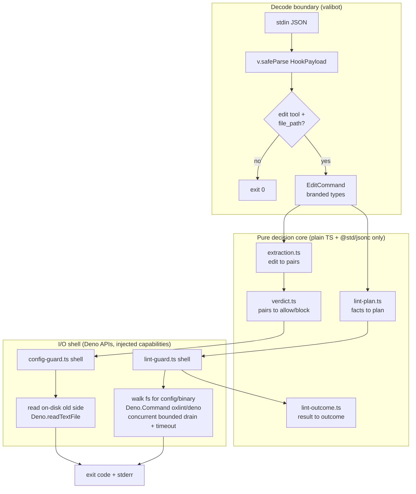

# Migrate oxlint-guard to a Standalone Deno 2.0 Monorepo - Plan

## Goal Capsule

- **Objective:** Convert `claude-plugins/oxlint-guard` from an Effect-on-Bun pnpm-workspace package into a self-contained Deno 2.0 monorepo under `claude-plugins/` — removing Effect, `@systemfsoftware/effect-memfs`, every `workspace:` dependency, and the tsdown/vitest Node toolchain. The plugin's enforced behavior is unchanged; only the implementation, runtime, and dependency surface change.
- **Authority hierarchy:** The user's request is the product contract: Deno 2.0, Effect removed, `@std/*` plus valibot (user-confirmed), no monorepo dependencies, `claude-plugins/` becomes a separate Deno workspace. One further external dependency — `npm:fast-check`, for the property tests — is agent-introduced, not user-named; see A2. Repo rules in `AGENTS.md` and `CONSTITUTION.md` bind (REPO-S3 vendored trees untouched; REPO-D1 `pnpm check:local` green at root; CONST-T5 pin behavior before rebuilding, see KTD6).
- **Stop conditions:** Done when both hooks run under `deno run` with exit/skip/block behavior matching the pre-migration characterization fixtures (KTD6), the Deno verification contract is green, `claude-plugins/` is decoupled from the pnpm workspace with zero `workspace:` deps, and `pnpm check:local` is green at the root.
- **Tail ownership:** ce-work executes the units; no npm publishing (the plugin ships by git-clone-copy).

## Product Contract

### Summary

A Claude Code plugin that enforces oxlint on every agent edit — a PostToolUse hook lints each edited file against the nearest oxlint config (deno-shebang files route to `deno check` + `deno lint`), and a PreToolUse hook blocks edits that add `"off"` rule severities to an oxlint config. Today it is an Effect program bundled for Bun with four workspace dependencies. This plan migrates it to a standalone Deno 2.0 monorepo built on `@std/*` and valibot, with no ties to the pnpm workspace. The behavior the hooks enforce stays identical; the runtime, dependency graph, and source expression change.

### Problem Frame

The plugin works, but its implementation is load-bearing on a stack the rest of `claude-plugins/` does not need: Effect's runtime, Layer/Context/Stream, `@effect/platform`'s Command/FileSystem/Path, Effect Schema, `@effect/vitest`, and four workspace packages. That coupling means the plugin cannot evolve without the monorepo's pnpm toolchain, cannot run without Bun, and carries a heavyweight runtime for two ~200-line hooks. The Node build pipeline (tsdown → `dist/*.mjs` with Effect inlined) exists solely because Effect must be bundled to run standalone — a constraint that vanishes when the hooks are plain Deno TypeScript run from source.

**What Effect was chosen to provide, and what must replace it.** An earlier plan for this plugin specified zero-import Deno and was then deliberately superseded to Effect+Bun. That supersession bought three capabilities, and this migration is only sound if each is replaced rather than dropped:

1. **A test seam.** `Layer`/`Context` let the integration tests substitute the filesystem and the command executor. Replacement: injected capability parameters (KTD2).
2. **Decode type-safety at the boundary.** Effect Schema gave branded types and a one-direction ACL transform over untrusted stdin. Replacement: valibot at the decode boundary (KTD3).
3. **Structured behavioural specs.** `effect-gherkin-spec` gave the ~500-line integration suites their Given/When/Then structure. Replacement: `@std/testing/bdd` (U3, U4).

Where a replacement is weaker than what it replaces, that is a cost this plan accepts explicitly, not an oversight. Note also that this migration is **not** a return to the original zero-import design: KTD5 permits `jsr:`/`npm:` dependencies with a first-run fetch, a posture neither prior plan occupied.

### Requirements

**Workspace decoupling**

- R1. `claude-plugins/` becomes a Deno 2.0 workspace with a root `deno.json` (`"workspace": ["./oxlint-guard"]`) and a member `claude-plugins/oxlint-guard/deno.json` (`"name"`, `"exports"`, lint/fmt/test config). It owns a **committed** `deno.lock` (KTD5).
- R2. `claude-plugins/*` is removed from `pnpm-workspace.yaml`. No `package.json`, `tsconfig*.json`, `tsdown.config.ts`, or `vitest.config.ts` remains in the plugin. The plugin declares zero `workspace:` dependencies.
- R3. The root `deno.json` carries the shared import map inherited by the member; the member carries only its own lint/fmt/test/task config plus `name`/`exports`.

**Runtime replacement**

- R4. Effect, `@effect/*`, and all workspace packages are removed. `@std/*` covers path, jsonc, and testing utilities; valibot (`jsr:@valibot/valibot`) covers decode-boundary validation; fast-check (`npm:fast-check@^4`) covers property tests. No other external deps.
- R5. Both hooks are invoked by `deno run` on TypeScript source — no `dist/`, no build step, no bundling. The committed source is the distributed artifact.

**Behavior preserved (unchanged contract)**

- R6. PostToolUse lint guard: lints a single edited file against the nearest oxlint config; deno-shebang files route to `deno check` then `deno lint`; exit 0 on every contentless no-op (non-edit tool, non-lintable extension, missing file, absent `file_path`, malformed stdin); missing config or local oxlint binary is a hard exit-2 failure with a remediation note; oxlint is resolved only from the edited project's `node_modules/.bin`, never PATH/`npx`/`bunx`; type-aware pass degrades gracefully when `oxlint-tsgolint` is absent.
- R7. PreToolUse config guard: blocks (exit 2) edits to oxlint config files whose new content adds a rule severity of `"off"`/`"allow"`/`0` the old content lacked; extracts before/after pairs for Edit/Write/Create/MultiEdit/Update/morph shapes; reads on-disk content as the old side; fails closed (exit 2) on an unrecognized content shape targeting a config file; skips (exit 0) provably contentless payloads.
- R8. Diagnostics go to stderr; stdout stays clean. Exit 0 allows; exit 2 blocks or feeds back a reason. The hermetic oxlint-resolution posture (local-only binary, project-root-bounded walk, minimal subprocess env) is preserved.

**Tests**

- R9. The pure decision modules keep property-test coverage (fast-check) ported to Deno's test runner. Each I/O shell keeps its composition-test coverage, ported alongside the shell it exercises, using Deno temp-directory fixtures and injected fakes in place of `effect-memfs` and the `@effect/platform` CommandExecutor shim.

**Repo integration**

- R10. `.claude/settings.json` dogfooding entries and the plugin's `hooks/hooks.json` switch from `bun ".../dist/*.mjs"` to `deno run --allow-read --allow-run --allow-env ".../src/*.ts"`. **The missing-runtime guard keeps its current fail-closed posture: `exit 1` with an install message, not `exit 0`.**

### Scope Boundaries

- **Out of scope:** the plugin's product behavior — exit contract, matcher set, skip conditions, fail-closed posture, block message wording. Preserved verbatim and pinned by KTD6 fixtures.
- **Out of scope:** migrating any other directory (`packages/`, `omp/`, `repos/`) to Deno.
- **Out of scope:** npm publishing. The plugin remains `private`, shipped by git-clone-copy.
- **Out of scope:** extracting `claude-plugins/` into a separate git repository. "Completely separate" means toolchain/workspace decoupling within this repo, not a physical repo split.
- **Out of scope:** authoring a governance doc (AGENTS.md) for the Deno monorepo — but see the Risks note: the migration does exit the repo's mutation and lint gates, and that cost is real.
- **Deferred to Follow-Up Work:** a CI job running `deno check`/`deno lint`/`deno test` on `claude-plugins/`; whether `deno.lock` stays committed **long-term** (U6 commits it and KTD5 requires it — only the long-term policy is the user's open call).

## Planning Contract

### Key Technical Decisions

- **KTD1 — Plain TypeScript pure core with a tiny Result/Option helper.** The four pure decision modules become plain functions over discriminated-union types, dispatched by `switch` on `_tag`. A small `result.ts` provides `Result<T, E>` and `Option<T>` with `map`/`flatMap`/`match`. valibot owns the _decode boundary_ only; the pure core consumes already-decoded plain values. **The pure core imports `result.ts`, sibling modules, and `@std/jsonc` — nothing else.** The `@std/jsonc` exception is deliberate and narrow: `verdict.ts` must parse JSONC config text, and parsing is a pure operation (same input, same output, no I/O), so it satisfies CONST-P1 without moving to the shell. Pushing the parse into the shell purely to satisfy a "zero imports" slogan would add indirection for no architectural gain.
- **KTD2 — Injected I/O capabilities replace Layer/Context.** Each shell is a function taking injected capabilities: `readFile`, `exists`, `runCommand`. Production passes Deno-API implementations; tests pass in-memory fakes. This is the same substitution seam `Context.GenericTag` + `Layer` provided, expressed as function parameters.
- **KTD3 — valibot maps the Effect Schema surface.** `S.TaggedClass`/`S.TaggedError` unions → `v.variant('_tag', [...])`, or plain TS unions where no decode is needed. `S.NonEmptyString.pipe(S.brand('X'))` → `v.pipe(v.string(), v.minLength(1), v.brand('X'))`. The one-directional `S.transformOrFail` (HookPayload → EditCommand) → a plain decode function returning `Result<EditCommand, DecodeError>`; valibot's bidirectional transform machinery is overkill for a decode-only boundary. **`S.EitherFromSelf({ left, right })` in `verdict-command.schema.ts` → the `Result<T, E>` type from `result.ts`** — the wrappers dissolve and `DecideCommand.extraction` becomes `Result<Extractable, UnrecoverableError>`.
- **KTD4 — Subprocess via `Deno.Command`, with three properties that must be carried across deliberately.** The port replaces `@effect/platform` Command+Stream, and each of the following is load-bearing:
  - **Concurrent drain.** stdout and stderr MUST be drained concurrently (`Promise.all`), matching the current `Effect.all({ concurrency: 'unbounded' })` (`adapter.ts:227-229`). Sequential reads deadlock: a linter emitting >64 KiB on the stream read second fills its OS pipe buffer and blocks the child while the first stream is still draining. Small-output smoke tests pass either way, so this bug ships silently if unstated.
  - **The real env allowlist.** The forwarded set is exactly `PATH, HOME, TMPDIR, TEMP, TMP, USERPROFILE, HOMEDRIVE, HOMEPATH, SystemRoot, COMSPEC, PATHEXT` (`executor.ts:119-131`). It does **not** include `CLAUDE_PROJECT_DIR`. Forward this list verbatim — widening it hands a binary the guard does not control more of the agent's environment.
  - **Windows `.cmd` wrapping.** When the resolved binary path ends in `.cmd`, invoke `Deno.Command("cmd.exe", { args: ["/c", binaryPath, ...args] })`, matching `executor.ts:184-186`. npm-installed oxlint on Windows produces `oxlint.cmd`, which cannot be executed directly.
  - Timeouts use `AbortSignal.timeout(ms)` passed as `Deno.Command`'s `signal`; the 64 KiB per-stream cap and truncation marker are preserved.
- **KTD5 — No build step, and the first-run fetch is a trust boundary.** Deno runs TypeScript natively, so `dist/` and tsdown are deleted. The hooks point at `src/` entry modules. **This introduces a security boundary the inlined bundle did not have:** on a cold cache the hook fetches and executes `jsr:`/`npm:` module code with the hook's own `--allow-read`/`--allow-run`/`--allow-env` permissions, so a registry compromise, account takeover, or typosquat of `@valibot/valibot`, an `@std/*` package, or any transitive dep yields arbitrary code execution in the agent's context. Note also that **module resolution is not gated by `--allow-net`** — omitting that flag does not prevent the fetch. Mitigation, required not recommended: a **committed `deno.lock`** pinning an integrity hash for every `jsr:`/`npm:` specifier, verified by a Verification Contract check and by running the hooks with `--frozen`. This is a distinct surface from the _oxlint-binary_ hermeticity (local-only resolution), which is unaffected and still holds.
- **KTD6 — Pin behavior before rebuilding (CONST-T5).** The migration rewrites the pure core, both shells, and the test suite that would catch a regression in them. Nothing else certifies the "behavior preserved" claim, and the plugin simultaneously exits the repo's mutation gate. Therefore U1 captures **characterization fixtures** from the _current_ Effect-on-Bun hooks — for every skip, block, fail-closed, hermetic-failure, and output-cap path, the exact exit code and stderr — before any source is rewritten. The Verification Contract asserts the Deno port reproduces them byte-for-byte. Without this step the ported test silently encodes the ported (possibly drifted) expectation.

### High-Level Technical Design

The shells sit in the Shell subgraph, not the Core: they perform I/O through injected capabilities. `lint-outcome.ts` is pure but is invoked _after_ the subprocess returns, which is why its edge runs back from the shell.

### Assumptions

- A1. Deno 2.7.7 (installed, verified this session) is the floor; the README states Deno 2.x.
- A2. **Verified, not assumed:** `npm:fast-check@^4` loads and runs under Deno 2.7.7 (confirmed during review). It remains an agent-introduced dependency the user did not name — if the user prefers an `@std`-only test surface, the property suites need hand-written generators instead, and that decision is cheapest before U1 lands the import map.
- A3. The plugin's `.claude-plugin/plugin.json` stays unchanged.
- A4. `deno.lock` is **required and committed** (KTD5 integrity pin), not optional. Whether it remains committed long-term is the user's call; the migration commits it.
- A5. The repo's `.claude/settings.json` dogfooding entries keep the current **fail-closed** missing-runtime posture (`exit 1` + install message). This preserves today's behavior exactly: on a machine without the runtime, the PreToolUse config guard currently blocks edits loudly, and it will continue to.

### Sequencing

U1 (scaffold + decouple + characterization fixtures) → U2 (pure core) → **U3 → U4** (serialized: both edit `hooks/hooks.json`) → U5 (property tests) → U6 (docs, settings rewire, `dist/` deletion, cleanup). Each unit lands as one atomic commit.

**`dist/` survives until U6.** The repo's own `.claude/settings.json` invokes `bun .../dist/*.mjs`, so deleting the bundle before the rewire would break every edit in this repo — including the implementing session's own — for five units.

## System-Wide Impact

- **pnpm workspace.** Removing `claude-plugins/*` from `pnpm-workspace.yaml` takes the plugin out of `pnpm install`, turbo, and root `pnpm check`. Nothing imports `@systemfsoftware/oxlint-guard`, so the removal is clean.
- **Gate exit — a real, accepted cost.** The plugin leaves the pnpm gate surface, which today includes the Stryker mutation gate and the repo lint coverage. The replacement CI job is deferred, so after the implementing session ends the guard is code with no automated verification. KTD6's characterization fixtures and the Verification Contract are the compensating control until the CI follow-up lands; this is a downgrade from the current mutation gate, not an equivalent.
- **`.claude/settings.json`.** Both hooks switch from Bun to Deno, keeping matchers, timeouts, and the `exit 1` missing-runtime posture. A machine with Deno sees identical enforcement; a machine without sees the same loud block it sees today when Bun is absent.
- **First-run module fetch.** See KTD5 — a new remote-code-execution trust boundary, mitigated by the committed lockfile.
- **Distribution shape.** The committed artifact changes from `dist/*.mjs` to source `.ts`. The plugin stops carrying a multi-megabyte bundle.

## Implementation Units

### U1. Deno workspace scaffold, pnpm decoupling, and characterization fixtures

- **Goal:** Stand up the Deno workspace, remove the plugin from the pnpm workspace, and pin current behavior before any rewrite.
- **Requirements:** R1, R2, R3; KTD6
- **Dependencies:** none
- **Files:**
  - `claude-plugins/deno.json` (create — workspace root + shared import map)
  - `claude-plugins/oxlint-guard/deno.json` (create — member)
  - `claude-plugins/oxlint-guard/deno.lock` (create, commit)
  - `claude-plugins/oxlint-guard/__fixtures__/characterization/*.json` (create)
  - `pnpm-workspace.yaml` (remove `claude-plugins/*`)
  - delete: `package.json`, `tsconfig.json`, `tsconfig.build.json`, `tsdown.config.ts`, `vitest.config.ts`, `oxlint.config.ts`
  - **not** deleted here: `dist/` (see Sequencing)
- **Approach:** Root `deno.json` sets `"workspace": ["./oxlint-guard"]` and the shared `imports` map (`@std/path`, `@std/jsonc`, `@std/assert`, `@std/testing`, `valibot` → `jsr:@valibot/valibot`, `fast-check` → `npm:fast-check@^4`). Member carries `name`, `exports`, `fmt`/`lint`, and `tasks`. Resolve and commit `deno.lock`. **Characterization capture:** before touching source, drive the _current_ Bun hooks with a fixture payload per behavioral path (clean, violation, each skip condition, no-config, no-binary, broken-binary, output-cap, deno-shebang; and for the config guard: each block shape, allow, fail-closed, contentless, oversize) and record exit code + stderr verbatim as JSON fixtures.
- **Test scenarios:**
  - The characterization capture is itself the test artifact: each fixture records an observed exit code and stderr from the pre-migration binary. A fixture that cannot be produced means the path is unreachable and must be reconciled before the port.
- **Verification:** `deno check`/`deno lint` recognize the new config; `pnpm check:local` passes at the root with the workspace entry gone; every behavioral path in R6/R7 has a committed fixture; the repo's existing hooks still work (`dist/` intact).

### U2. Pure decision core, schemas, and Result/Option helper

- **Goal:** Port the four pure decision modules and the decode boundary to plain TypeScript + valibot.
- **Requirements:** R4, R6, R7
- **Dependencies:** U1
- **Files:**
  - `src/result.ts`, `src/schemas.ts` (create)
  - `src/lint-plan.ts`, `src/lint-outcome.ts`, `src/extraction.ts`, `src/verdict.ts` (create)
  - `src/lint-plan.test.ts`, `src/lint-outcome.test.ts`, `src/extraction.test.ts`, `src/verdict.test.ts` (create — each module's property test travels with it)
  - delete the `*.workflow.ts`, `*.schema.ts`, `*.shape.ts`, `*.acl.ts` files they replace
- **Approach:** Tagged unions become plain discriminated unions; `Match.value().pipe(Match.tag(...))` becomes `switch (value._tag)`. `Either`/`Option` pipelines use `result.ts`. `verdict.ts` keeps `@std/jsonc` (KTD1). The HookPayload decode validates via `v.safeParse` then branches to `Result<EditCommand, DecodeError>`. `DecideCommand.extraction` becomes `Result<Extractable, UnrecoverableError>` (KTD3). Each module's existing property test ports in the same commit, so the port has immediate feedback rather than waiting for U5.
- **Test scenarios:** the four ported property suites (invariants unchanged — see U5 for their content; they simply live with their modules).
- **Verification:** `deno test src/*.test.ts` passes; `deno check src/` clean; grep for `effect/`, `@effect/`, `@systemfsoftware/` in `src/` returns nothing.

### U3. PostToolUse lint-guard shell

- **Goal:** Port the lint-guard shell to Deno APIs with injected capabilities, preserving every hermetic property.
- **Requirements:** R5, R6, R8, R10
- **Dependencies:** U1, U2
- **Files:**
  - `src/lint-guard.ts` (create — merges executor + adapter + main)
  - `src/lint-guard.integration.test.ts` (create — ported here, not in U5, so this unit's verification is executable)
  - `hooks/hooks.json` (update PostToolUse command; `exit 1` guard preserved)
  - delete the old `lint-guard/` cell files
- **Approach:** `runLintGuard(raw, cwd, deps)` with injected `readFile`/`exists`/`runCommand`. Stdin capped at 1 MiB. The config/binary walk is bounded by `CLAUDE_PROJECT_DIR`. Subprocesses run per KTD4 — concurrent `Promise.all` drain, the verbatim 11-key env allowlist, Windows `.cmd` wrapping, `AbortSignal.timeout`, 64 KiB cap with truncation marker.
- **Execution note:** Smoke-first, then replay the U1 characterization fixtures for every lint-guard path before considering the unit done.
- **Test scenarios:**
  - Happy path → exit 0, empty stderr. Violation → exit 2 with preamble + output.
  - Deno shebang routes to `deno check`/`deno lint`; type error → exit 2.
  - Skip paths (each → exit 0): non-edit tool, non-lintable extension, missing file, absent `file_path`, malformed stdin.
  - Hermetic fail: no local binary → exit 2; ancestor-planted binary is **not** reached (walk bounded by project root).
  - Broken binary (directory at the binary path) → exit 2 with not-executable note.
  - Type-aware degradation: tsgolint-missing output → retry without type-aware flags.
  - Output cap: >64 KiB → stderr ends with the truncation marker.
  - Timeout: injected non-resolving `runCommand` → exits within the per-command budget.
  - **Env isolation:** inject a sentinel credential into the hook process env; assert the spawned subprocess env contains only the 11 allowlisted keys and never the sentinel.
  - **Windows `.cmd`:** a resolved `oxlint.cmd` path invokes via `cmd.exe /c`.
  - Every U1 lint-guard characterization fixture reproduces byte-for-byte.
- **Verification:** `deno test src/lint-guard.integration.test.ts` passes; characterization replay green.

### U4. PreToolUse config-guard shell

- **Goal:** Port the config-guard shell to Deno APIs, preserving fail-closed behavior.
- **Requirements:** R5, R7, R10
- **Dependencies:** U1, U2, **U3** (both edit `hooks/hooks.json`)
- **Files:**
  - `src/config-guard.ts` (create)
  - `src/config-guard.integration.test.ts` (create — ported here, not U5)
  - `hooks/hooks.json` (update PreToolUse command; `exit 1` guard preserved)
  - delete the old `config-guard/` cell files
- **Approach:** `runConfigGuard(raw, cwd, deps)` with injected `readFile`. Path resolution, extraction, verdict, and all message wording preserved. Absent/unreadable on-disk file yields `none` (indistinguishable by design). Oversize stdin fails closed.
- **Execution note:** Smoke-first, then replay the U1 config-guard characterization fixtures.
- **Test scenarios:**
  - Block: Edit/MultiEdit/Write/Create/morph adding `"off"`/`"allow"`/`0` → exit 2, message names the rules.
  - Allow: severity downgrade, `ignorePatterns` edit, non-rule `"off"` in prose/options, overrides that stay enabled.
  - Fail closed: unrecognized content shape on a config target → exit 2 with cannot-verify message.
  - Contentless skip, non-config target, non-edit tool → exit 0.
  - Oversize stdin → exit 2 with the documented oversize message.
  - Every U1 config-guard characterization fixture reproduces byte-for-byte.
- **Verification:** `deno test src/config-guard.integration.test.ts` passes; characterization replay green.

### U5. Remaining test-suite consolidation

- **Goal:** Finish the test migration and delete the Node-era test trees.
- **Requirements:** R9
- **Dependencies:** U2, U3, U4
- **Files:** delete `__tests__/` and `src/**/__tests__/`; reconcile any straggler helpers into the ported suites.
- **Approach:** The four property suites landed in U2 and the two integration suites in U3/U4; this unit removes the originals and consolidates shared fixture helpers. **Budget note:** the `effect-memfs` `Contents` trees (~30 entries each, with directory entries keyed by a trailing `/`) become imperative `Deno.makeTempDir` + `Deno.writeTextFile`/`Deno.mkdir` setup, and the `CommandExecutor` shim becomes a `Map<string, ProcessResult>` keyed by binary path with `hang`/`spawn-failure` sentinels. This fixture rewrite is the largest mechanical task in the migration — it is not a find-and-replace.
- **Test scenarios:** the full suite runs green as one invocation; no test file references `@effect/*`, `effect-memfs`, or `effect-gherkin-spec`.
- **Verification:** `deno test --allow-read --allow-run --allow-env claude-plugins/oxlint-guard/` passes; scenario count matches the pre-migration suite.

### U6. Docs, dogfooding rewire, `dist/` removal, cleanup

- **Goal:** Repoint the repo's own hooks at Deno, delete the bundle, and publish updated docs.
- **Requirements:** R1, R5, R10
- **Dependencies:** U3, U4, U5
- **Files:**
  - `README.md` (update)
  - `.claude/settings.json` (rewire both entries)
  - `claude-plugins/oxlint-guard/dist/` (delete — here, not U1)
  - `claude-plugins/oxlint-guard/.gitignore` (drop the `dist/` exception)
- **Approach:** Rewire both settings entries to `command -v deno >/dev/null 2>&1 || { echo '<plugin>: deno not found - install Deno 2.x (https://deno.com)' >&2; exit 1; }; exec deno run --allow-read --allow-run --allow-env "$CLAUDE_PROJECT_DIR/claude-plugins/oxlint-guard/src/<entry>.ts"` — preserving `exit 1`, matchers, and timeouts. Delete `dist/` in this same commit so the rewire and the removal are atomic. README documents the Deno 2.x prerequisite, install, both hooks, the exit contract, the local-only oxlint guarantee, and the first-run module fetch with its lockfile mitigation.
- **Test scenarios:**
  - `Test expectation: none -- documentation and configuration; correctness is the U3/U4 characterization replay plus JSON-validity of settings.json.`
- **Verification:** settings.json parses and both entries resolve to existing modules; an edit in this repo fires both Deno hooks successfully; `deno check`/`deno lint`/`deno test` green; `pnpm check:local` green.

## Verification Contract

- **Root baseline:** `pnpm check:local` passes with `claude-plugins/*` removed.
- **Characterization replay (KTD6):** every fixture captured in U1 reproduces byte-for-byte (exit code + stderr) under the Deno port. This is the primary evidence for "behavior preserved" and replaces the mutation gate the plugin is leaving.
- **Type check / lint:** `deno check claude-plugins/oxlint-guard/src/`; `deno lint claude-plugins/oxlint-guard/`.
- **Tests:** `deno test --allow-read --allow-run --allow-env claude-plugins/oxlint-guard/`.
- **Dependency audit:** no `effect`, `@effect`, `@systemfsoftware`, or `workspace:` in `src/`; imports resolve only to `@std/*`, `valibot`, `fast-check`, or relative paths.
- **Lockfile integrity:** `deno.lock` exists, is committed, and pins an integrity hash for every `jsr:`/`npm:` specifier; the hooks run clean under `--frozen`.
- **Subprocess env isolation:** the U3 sentinel test asserts the forwarded env contains only the 11 allowlisted keys.
- **Hook smoke:** violating PostToolUse fixture → exit 2 + stderr; clean → exit 0; off-adding PreToolUse fixture → exit 2 + block message; benign → exit 0; missing-runtime → exit 1 with install message.
- **Artifact hygiene:** no `dist/`, no Node toolchain file, no abandoned-attempt code; nothing under `repos/` modified (REPO-S3).

## Definition of Done

- Both hooks run under `deno run` from source and reproduce every U1 characterization fixture byte-for-byte.
- `claude-plugins/` is a Deno 2.0 workspace with committed `deno.json`/`deno.lock`, out of `pnpm-workspace.yaml`, with zero `workspace:` deps and no Effect imports.
- `deno check`, `deno lint`, `deno test` green in the plugin; `pnpm check:local` green at the root.
- The three hermetic properties are mechanized by tests, not just prose: project-root-bounded walk, 11-key env allowlist, 64 KiB output cap.
- `.claude/settings.json` invokes Deno with the `exit 1` missing-runtime guard; an edit in this repo fires both hooks successfully.
- README documents the Deno prerequisite, the exit contract, the local-only oxlint guarantee, and the first-run fetch with its lockfile mitigation.
- Cleanup criterion: no Node toolchain file, no `dist/`, no Effect import, no migration debris in the diff.

## Open Questions

- **Deferred — least-privilege permission scopes.** The hooks run with blanket `--allow-read --allow-run --allow-env`. Narrowing them would bound the blast radius of a compromised fetched module (KTD5). `--allow-env=<11 keys>` and `--allow-read=$CLAUDE_PROJECT_DIR,$DENO_DIR` look achievable; `--allow-run` is the hard one, because the oxlint binary is a _dynamically resolved absolute path_ and Deno's run-allowlist matches the program as invoked, so a static name list will not match. Resolve during U3 by testing whether an absolute-path allowlist entry can be composed at invocation time; if not, document the residual.
- **Deferred — fast-check vs. an `@std`-only test surface (A2).** fast-check is verified working but was never user-named. Confirm before U1 lands the import map; rejecting it later costs a property-suite rewrite.

## Sources & Research

- Deno workspaces — `docs.deno.com/runtime/fundamentals/workspaces/`: singular `"workspace"` key, member `name`/`exports`, inherited root `imports`.
- valibot — `valibot.dev/api/variant/`, `/api/brand/`, `/api/pipe/`: the surface replacing Effect Schema. Via `jsr:@valibot/valibot`.
- fast-check — confirmed loading under Deno 2.7.7 via `npm:fast-check@^4`.
- Current implementation, read this session: `executor.ts:119-131` (the 11-key env allowlist), `executor.ts:184-186` (Windows `.cmd` wrapping), `adapter.ts:227-229` (concurrent stream drain), `adapter.ts:30` (64 KiB cap), `adapter.ts:45-52` (project-root walk ceiling), `verdict.workflow.ts:1` (`@std/jsonc`), `verdict-command.schema.ts` (`S.EitherFromSelf`).
- `.claude/settings.json:21,72` — the current `exit 1` missing-runtime posture this plan preserves.
- Repo grounding: `CONSTITUTION.md` CONST-T5 (pin behavior before rebuilding — KTD6), CONST-P1 (purity — the `@std/jsonc` carve-out); `CONCEPTS.md` ("Hook verdict", "Patch-mode edit"); the prior plan `docs/plans/2026-08-05-005-feat-oxlint-guard-claude-plugin-plan.md` and its Supersession note, engaged in the Problem Frame.
