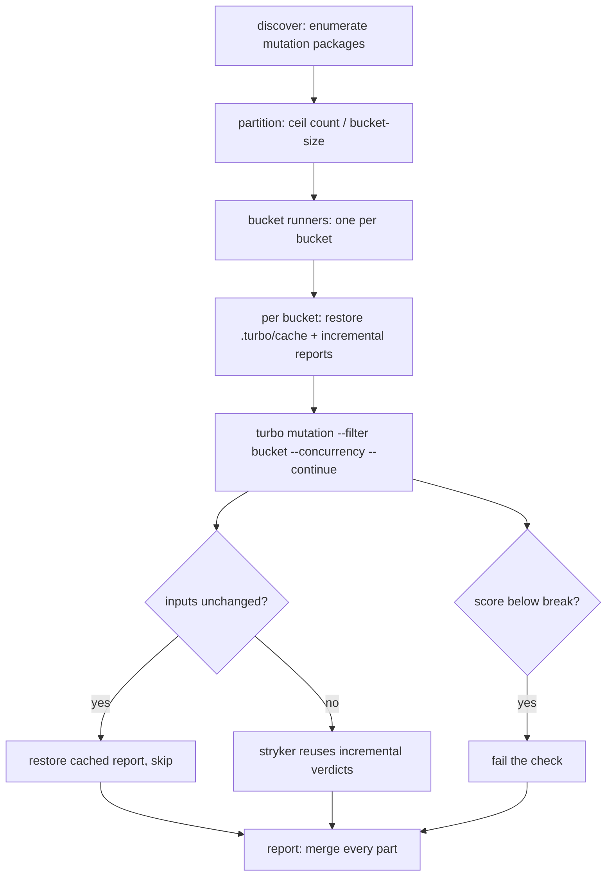

# Mutation CI Consolidation - Plan

## Goal Capsule

**Objective.** Rework the mutation CI so every mutation package runs on a handful of runner machines whose count scales with the package count, keep both incremental mechanisms working, and make the mutation score gate PRs.

**Authority hierarchy.** Product Contract settled by ce-brainstorm (this session's dialogue). Planning Contract and Implementation Units settle the HOW here. No upstream requirements document.

**Execution profile.** CI-config rework: the workflow, the turbo mutation task definition, and one doctrine line. No stryker code changes, no new dependencies, no new packages. Verified by exercising the workflow itself, not by new unit tests.

**Stop conditions.** Fail if the workflow stops producing a merged report spanning every package, if a sub-threshold package no longer fails the check, or if `pnpm check:local` breaks.

**Tail ownership.** PR opened and watched to green (REPO-D1/D2); merge to `main` stays human (REPO-P1).

**Preservation.** Product Contract unchanged from the requirements-only brainstorm (R1–R7, Key Decisions, Acceptance Examples preserved; the one deferred question is now resolved by KTD1).

---

## Product Contract

### Summary

Rework the mutation CI to run every mutation package on a small number of runner machines that scale with the package count, instead of one runner per package. Keep the per-package incremental report and turbo's task cache so a warm run re-tests only what changed. Make the mutation score a blocking gate: a package below its threshold fails the check.

### Problem Frame

The mutation workflow runs one runner per mutation package — roughly 25 jobs — and every runner pays a full checkout, install, and build before running a single package's mutation. Turbo's mutation cache is declared but never hits, for two reasons: the cache directory is not restored in the mutation job, and the incremental report is hashed as a task input even though the run itself rewrites it. The score is advisory: the workflow never fails on a low score, only when a run produced no report. The 100% mutation requirement lives in the local Definition of Done, not in CI.

### Requirements

**Machine consolidation**

- R1. All mutation packages run on a small number of runner machines, not one per package.
- R2. The runner count is derived at runtime from the discovered package count, not hardcoded in the workflow.

**Incremental reuse**

- R3. An unchanged package is restored from the turbo task cache and skipped, rather than re-run.
- R4. A changed package reuses prior verdicts through the per-package incremental report.
- R5. The merged mutation report spans every mutation package.

**Gating**

- R6. A package scoring below its threshold fails the check.
- R7. A run that produces no report fails the check, distinct from a score failure.

### Key Decisions

- **Fewer runners over worst-case speed.** Steady-state PRs stay fast; a cold full run may be slow. Governs R1. (session-settled: user-directed — chosen over bounding worst-case wall-clock: the reported pain is machine count, not latency.)
- **Dynamic runner count.** Runner count scales with the package count, computed at runtime. Governs R2. (session-settled: user-directed — chosen over a fixed bucket count: the count should track the work.)
- **Full-coverage report.** The merged report spans every package. Governs R5. (session-settled: user-directed — chosen over changed-only: the report stays a complete picture.)
- **Absolute-score gating.** A sub-threshold score fails the check, reversing the advisory posture. Governs R6, R7. (session-settled: user-directed — chosen over advisory and regression-only: the score must block.)

### Acceptance Examples

- AE1 (Covers R3). A warm run on a package whose inputs are unchanged restores the cached report instead of re-running mutation.
- AE2 (Covers R6). A package scoring below its break threshold fails the check; other packages still run and report.
- AE3 (Covers R7). A package whose run produces no report fails the check with an infrastructure-failure signal, distinct from a score verdict.

### Scope Boundaries

- Hosted remote turbo cache is out of scope — no new dependency or secret; the local cache restored via Actions is the mechanism.
- The stryker incremental mechanism itself is unchanged; this work only ensures it keeps working alongside the task cache.

### Dependencies / Assumptions

- All mutation packages currently pass their break threshold. If any does not, gating makes CI red on arrival and bringing it up to threshold is part of the work.

### Sources / Research

- The mutation workflow (`.github/workflows/mutation.yml`) runs a per-package matrix; the mutation job restores the incremental report but never the turbo cache directory.
- The turbo mutation task (`turbo.json`) declares the incremental report as an input — a volatile input per CONCEPTS.md, which makes the task cache miss permanently.
- The repo's doctrine on cache-key correctness: CONCEPTS.md "Volatile input" and "Stale pass"; `docs/solutions/performance-issues/turbo-cache-never-warm.md`; `docs/solutions/tooling-decisions/turbo-cache-requires-complete-input-hash.md`.

---

## Planning Contract

### Key Technical Decisions

- **KTD1. A packages-per-bucket ratio sizes the matrix.** The discover job partitions its package list into buckets of a fixed size, emitting a matrix of `ceil(count / size)` jobs; each bucket runs `turbo mutation --filter=<its packages> --concurrency=<cores> --continue=dependencies-successful`. The bucket size (default 5) and the per-bucket concurrency (`<cores>`, sized to the runner) are the two tunables. Instantiates the dynamic-runner-count product decision. Governs R1, R2.
- **KTD2. The incremental report leaves the mutation cache key.** `reports/stryker-incremental.json` is tool-written state the run rewrites — a volatile input — so hashing it moves the key every run and the cache never hits. Removing it from `mutation.inputs` makes the key hash source only. Safe because the report affects run performance, not the result: the result is fully determined by source, which `$TURBO_DEFAULT$` and `dependsOn: ^build` already capture. The report stays gitignored and is managed by the workflow's incremental-report cache. Governs R3, R4.
- **KTD3. The mutation job restores and saves the turbo cache under a mutation-specific key.** Add an `actions/cache` restore of `.turbo/cache` immediately after install-deps (before the build) and a save on main after a successful run. Use a mutation-specific, per-bucket key prefix (`turbo-mutation-${{ runner.os }}-...`) distinct from the check job's `turbo-...` key, so the two jobs never collide on the same commit. This is what makes an unchanged package restore instead of re-run. Governs R3.
- **KTD4. The score gates through the mutation step's exit code.** Remove `continue-on-error: true` from the mutation step so stryker's break-threshold non-zero exit fails the job; the "Require a mutation report" step stays as the distinct no-report signal. Instantiates the absolute-score-gating product decision. Governs R6, R7.

### High-Level Technical Design

The cache-hit branch (G) is what makes the steady-state PR fast: unchanged packages never re-run. The score branch (I→J) is what makes the gate blocking: a sub-threshold package fails the job even though its report still merges. The `--continue` flag is what keeps a sub-threshold package from cancelling its bucket siblings, so the merged report still spans every package.

### Sequencing

U1 before U2 (the cache key must be fixed before restoring the cache buys anything). U2 before U3 (bucketed runners still need the warm cache to skip unchanged packages). U4 last, on top of the consolidated matrix. The `.github/workflows/mutation.yml` changes are an Evaluator surface (AGENTS.md Surface Classes): land them observed red-before/green-after in their own commit, and keep U4's AGENTS.md doctrine edit a separate commit from the workflow change. U4's doctrine edit is deliberate: gating reverses REPO-D1's "continue-on-error and never carries that verdict" claim, so the two change together.

---

## Implementation Units

### U1. Remove the incremental report from the mutation cache key

**Goal.** Make the turbo mutation task's cache key hash source only, so it can hit.

**Requirements.** R3, R4.

**Dependencies.** None.

**Files.**

- `turbo.json` (modify)

**Approach.** Delete `reports/stryker-incremental.json` from the `mutation` task's `inputs`. Leave the file gitignored and managed by the workflow's incremental-report cache — stryker still reads and writes it as its own incremental state. No other change.

**Execution note.** Verify the defect exists before editing: `turbo mutation --filter=<pkg> --dry=json` should list the incremental report in the resolved input map.

**Test scenarios.**

- `turbo mutation --filter=<pkg> --dry=json` no longer lists the incremental report in the resolved inputs.
- Two consecutive local mutation runs on an unchanged package hit the cache the second time (the key stops moving).

**Verification.** The dry-run input map excludes the incremental report; a source edit moves the task hash and a revert moves it back.

### U2. Restore and save the turbo cache in the mutation job

**Goal.** Warm the mutation job's turbo cache so unchanged packages are restored, not re-run.

**Requirements.** R3, R4.

**Dependencies.** U1.

**Files.**

- `.github/workflows/mutation.yml` (modify)

**Approach.** Add an `actions/cache` restore of `.turbo/cache` immediately after install-deps and before `pnpm build` (so both build and mutation are warm), and a save step on main after a successful run under a mutation-specific, per-bucket key prefix (see KTD3 — distinct from the check job's `turbo-...` key). Re-key the incremental-report cache: the current per-package key templates `${{ matrix.package }}` into both path and key, which no longer resolves under a bucket matrix; replace it with one workspace-wide key and a globbed path list (`**/reports/stryker-incremental.json`) restored and saved once per bucket job, saving on main with a run-specific suffix.

**Test scenarios.**

- A PR on a warm cache reports turbo cache hits for unchanged packages and produces the merged report from restored results.
- A PR that changes one package re-runs only that package (plus its affected dependents); the rest are restored.

**Verification.** The workflow's turbo summary shows cache hits for unchanged packages; wall time drops on the second run of an unchanged tree.

### U3. Bucket the matrix

**Goal.** Run every package on a handful of runner machines derived from the package count.

**Requirements.** R1, R2, R5.

**Dependencies.** U2.

**Files.**

- `.github/workflows/mutation.yml` (modify)

**Approach.** The discover job partitions its package list into buckets of a fixed size and emits the bucket matrix; the mutation job iterates buckets, each running `turbo mutation --filter=<its packages> --concurrency=<cores> --continue=dependencies-successful` (so a sub-threshold package does not cancel its bucket siblings). The per-package report steps — require a report, record part metadata, upload the part — become bucket-scoped, iterating the bucket's packages. The report job is unchanged: it merges every part into one aggregate report. Keep the full `pnpm build`; it becomes a cache hit once U2 lands. Raise the job and step timeouts from their one-package values (70/60 min) to cover a full cold bucket, sized from per-package wall times (measured in U4), so a slow-but-healthy cold run is not mislabeled an infra failure. The bucket size is KTD1's tunable.

**Patterns to follow.** `scripts/tools/merge-mutation-reports.mjs` already merges per-package parts via `aggregateResultsByModule` into one `mutation-report.json`, one `mutation-report.html` dashboard (mutation-testing-elements showing every package), and one `summary.md` table (an `**all**` row plus per-package rows and survivors, written to the PR checks summary). The report job stays as-is; only the upload side changes from one part per package to many parts per bucket.

**Test scenarios.**

- With N packages and bucket size K, the matrix runs `ceil(N/K)` jobs.
- Each bucket runs its assigned packages; the merged report still spans all N packages.
- A bucket where one package scores below break still reports its siblings (no cancellation).

**Verification.** The workflow runs `ceil(count/size)` mutation jobs; the merged report covers every discovered package.

### U4. Gate the score and update the doctrine note

**Goal.** Make a sub-threshold score fail the check; keep the infra-failure signal distinct.

**Requirements.** R6, R7.

**Dependencies.** U3.

**Files.**

- `.github/workflows/mutation.yml` (modify)
- `AGENTS.md` (modify)

**Approach.** Remove `continue-on-error: true` from the mutation step so stryker's break-threshold exit fails the job; the "Require a mutation report" step stays as the distinct no-report signal. Before flipping, run a full cold mutation pass to measure current per-package scores and wall times — confirming the "all packages pass their break threshold" assumption and providing the numbers that size U3's bucket timeouts. Update the AGENTS.md Definition-of-Done line that states the workflow is `continue-on-error` and never carries the score verdict.

**Test scenarios.**

- A package scoring below its break threshold fails the check; other packages still run and report.
- A package whose run produces no report fails with the infra-failure message, distinct from a score failure.
- A tree where every package passes its threshold exits green.

**Verification.** Observe the workflow red on a sub-threshold package and green on a passing tree; the doctrine note matches the new behavior.

---

## Verification Contract

| Check                                     | Action                                                                                                              | Units  |
| ----------------------------------------- | ------------------------------------------------------------------------------------------------------------------- | ------ |
| Turbo config valid                        | `pnpm check:local` after the last edit                                                                              | U1     |
| Cache key excludes the incremental report | `turbo mutation --filter=<pkg> --dry=json`                                                                          | U1     |
| Warm-cache skip                           | Push a branch, watch the Mutation workflow's turbo summary for cache hits                                           | U2, U3 |
| Aggregate report                          | Merged artifact carries `mutation-report.json`, `mutation-report.html`, and a `summary.md` with an all-packages row | U3     |
| Gating                                    | Sub-threshold package fails the check; missing report fails with the infra signal                                   | U4     |

## Definition of Done

- The mutation workflow runs every package on a bucketed matrix whose size derives from the package count, not one runner per package.
- Unchanged packages are restored from the turbo cache; changed packages reuse the incremental report.
- A package scoring below its break threshold fails the check; a run producing no report fails with the infra-failure signal.
- The AGENTS.md Definition-of-Done note no longer claims the workflow is advisory.
- `pnpm check:local` exits 0 after the last edit; the PR is opened and watched to green.

**Cleanup.** No abandoned experimental code — no leftover temporary gating toggles, test-bucket formulas, or debug cache keys.
