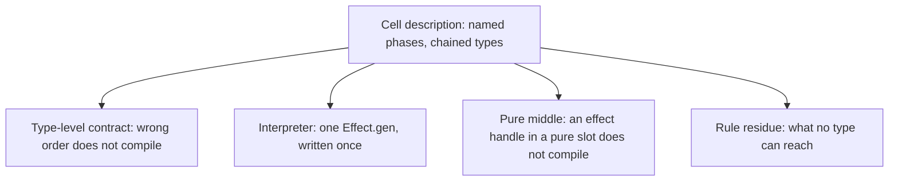
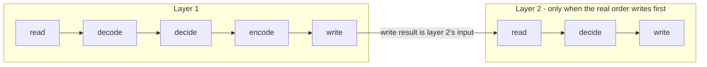
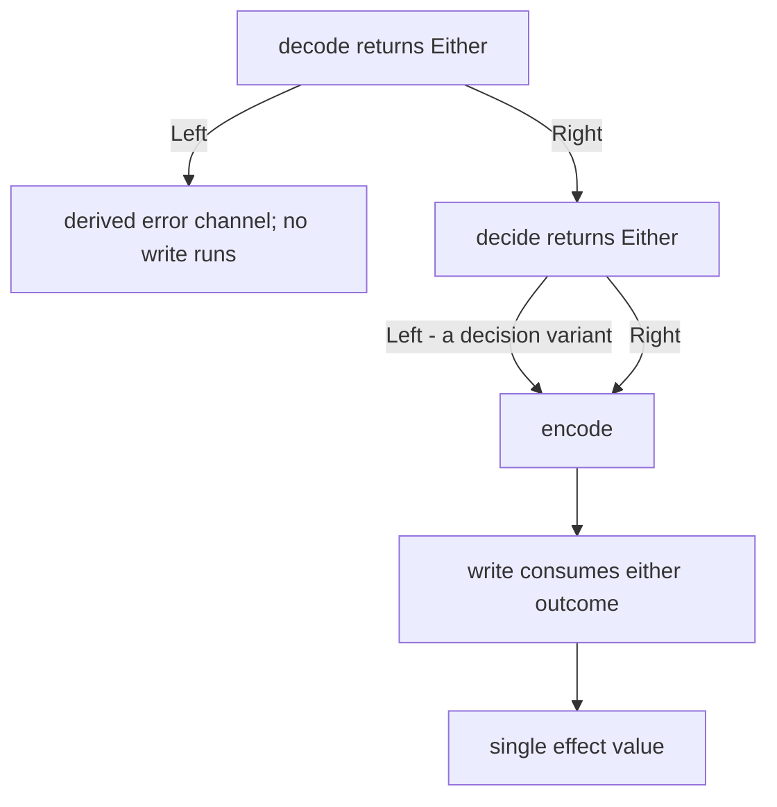

# Phase Order as a Description - Plan

## Goal Capsule

- **Objective.** Make the I/O sandwich's phase order a consequence of types rather than a claim in prose, by shipping a cell description whose phases chain by type — and correct the claims that assert an ordering nothing decides. The guarantee holds inside a description, and descriptions become the sanctioned shape for this seam; it does not reach a body that stays hand-written.
- **Product authority.** The repository owner, in the invoking session. This plan owns the `workflow`/`executor` seam only; kernel observers, the inference-versus-declaration observer allocation, and the two untracked derivation documents are named in Scope Boundaries and are not active scope.
- **Open blockers.** None. Three questions are recorded under Outstanding Questions as deferred to planning.
- **Execution profile.** Type-level machinery first: the description's contract is proven by type tests before any shell migrates, because a wrong chain shape discovered during migration invalidates every migrated shell.
- **Tail ownership.** The implementer owns the branch, the gate run, and the pull request. Merging stays with the owner.

**Product Contract preservation.** Restructured and changed. Changed: `AE3` — its transaction claim asserted atomicity the mechanism does not provide; `R4` — split the failure rule by the two kinds of `Left` a phase can return; `R7` and Dependencies — the migration surface is discovered rather than counted, so no enumeration is asserted. Each change corrects a claim that was false, not a scope decision. No requirement was weakened and no R-ID was renumbered.

**Warrant discipline.** Every design decision below names the derivation it rests on. Where this plan cites a repository file, that citation settles a question of fact — what exists, what a gate runs, what a rule rejects, what a dependency does — never what ought to be. An existing rule, a shipped default, a sibling file, or the number of packages already doing something is not a reason for any choice here; where a derivation and the repository disagree, the repository is what changes.

---

## Product Contract

### Summary

Ship a `Cell` description — a record of named phases whose output types feed the next phase's input, in one or more impure/pure layers — from which the interpreter, the type-level contract, and an effect-free pure middle are all derived. Inside a description, phase order stops being a property anyone checks and becomes the only wiring that compiles, and that covers every call site that reaches a workflow once migrated. It does not reach a body left hand-written with `Effect.gen`, so the doctrine sentence asserting the order is rescoped to what a channel now decides rather than left standing. Correct `executor-no-io-in-filling` to claim what it decides, and keep it — rescoped to phase bodies — because no return type can see I/O a closure captured.

### Problem Frame

`CONST-B3` writes the sandwich out in full — `read → decode → decide → shape → write` — and nothing in the repository enforces that order. The gap is not a bug that shipped; it is a doctrine asserting a property no channel decides, which is the condition `CONST-E1` exists to prevent.

Three attempts to close it have failed, and the reasons are now measured rather than argued. A constructor cannot type a sequence, which the vocabulary already states as "ordering is not expressible over a value." A phase-parameter constructor was designed and withdrawn when a real HTTP use case turned out to write before it could classify. An indexed `Cell<Phase, …>` threaded through `Effect.gen` was considered and rejected on a claim that turns out to be false as stated — that `yield*` erases the index.

What `yield*` actually does is union every yielded effect into one type parameter, then extract the error and requirement channels from that union. Type information crosses `yield*` intact; it is the _union_ that loses order, because union is commutative. Compiled this session: a body that reads then decides, and a body that decides then reads, are the same type. Effect v4 does not change this, and a TypeScript generator carries exactly one shared `TNext`, so no amount of index-threading recovers order from a generator body.

The one rule in the area claims more than it can decide. Its expectation reads "every input already read and decoded before the decision" while its check walks a single call's argument list for a suspension or an I/O call. A read placed after the workflow call passes it.

### Key Decisions

- KD1. **Order is carried by type-chaining across a phase record, never by sequencing.** A product of arrows sharing type variables makes the wrong order fail to compile without expressing "and then" at all. (session-settled: user-directed — chosen over an indexed monad over `Effect.gen` and over a fluent typestate builder: the first is barred by union commutativity, the second imports an idiom this ecosystem does not use.) Governs R1, R2, R3.
- KD2. **The interpreter is written once, inside the description's module.** Authors stop hand-sequencing a shell; `Effect.gen` survives as the interpreter's own body and inside individual phases, not as the shape authors compose. The chain therefore decides the order of the phases an author _declares_: a phase's interior is not type-visible, so each impure phase is one named step — a single read or a single write — and each pure phase is already one expression under the existing cyclomatic-complexity-1 gate. Governs R4, R7.
- KD3. **A pure slot's type decides that no effect handle was supplied; it does not decide purity.** `decode`, `decide`, and `encode` resolve to an uninhabited type when handed an effect-returning function, so that failure needs no AST rule. Behavioural purity is a strictly weaker claim to make from a type: effect tracking is not expressible over a return type, so I/O reached through a captured signer, store, or clock stays invisible to it and remains what a rule and review decide. Claiming otherwise would repeat the overclaim this plan exists to remove. Governs R3, R5, R9, R10.
- KD4. **A rule whose message overstates its check is repaired by narrowing the message, never by widening the check.** Global order is unreachable from a per-file AST rule for the same reason a per-file rule cannot count instances. The same repair applies to a doctrine that overstates: it is rescoped to what a channel decides. Governs R5, R6, R11.
- KD5. **The write-then-decide shape is one description carrying two layers, not two descriptions composed by hand.** The hand-composed alternative fails on its own terms: routing one shell's decision through a second threads an I/O response between two pure fillings, so neither filling is pure and neither ordering is legible. A multi-layer sandwich is the shape instead — extra I/O mid-decision is admissible exactly while the I/O segments stay separate from the decision segments — so the layers stay type-chained end to end. Governs R8.
- KD6. **The harm justifying this work is the unenforced assertion, not an incident.** (session-settled: user-directed — chosen over waiting for a shipped defect: no such defect exists, and the doctrine's own claim is the thing being falsified.)

The derivation fan-out this buys:

### Requirements

**The description and what derives from it**

- R1. A cell description accepts named phases whose types chain, so that each phase's input is the immediately preceding phase's output. A phase may carry a product, so one read gathers everything the decision needs, and a description may carry more than one impure/pure layer.
- R2. A description whose phases are supplied in an order the chain does not admit fails to compile, and the failure names the phase that broke the chain. Each phase slot carries a branded marker, so the diagnostic names the phase rather than reporting a mismatched structural type.
- R3. The pure phases resolve to an uninhabited type when handed an effect-returning function, so supplying one in a pure slot fails to compile with no lint rule having run.
- R4. Applying a description yields a single effect value whose error and requirement channels are derived from the phases, with no channel widened by the derivation. A validation failure from `decode` is fatal and surfaces in the derived error channel; a `Left` from `decide` or `encode` is a success value that the write phase consumes, because a decision cell's error variants are outcomes rather than faults.

**Honesty repair on the existing rule**

- R5. `executor-no-io-in-filling` states an expectation no broader than what it decides: no I/O inside the arguments of the workflow call it inspects.
- R6. The vocabulary's ordering claim records that order is unreachable over a union-accumulated value, distinguishing that from order over a chained description.
- R11. `CONST-B3` states only the order it decides: inside a description the chain decides it, and for a body left hand-written the doctrine no longer asserts it.

**Migration**

- R7. Every in-repo call site that reaches a workflow is expressed as a description, identified by its import of a workflow rather than by its filename, so an entry point that hand-sequences a workflow without carrying the shell suffix is inside the surface. No exemption is recorded, because a layered description can express any order a call site actually has — so an unmigrated site is a defect the check names rather than a choice an author justifies in prose.
- R8. A call site whose real order writes before it decides is expressed as one description carrying two layers, with no chain relaxed to accommodate the order.

**Observation**

- R9. Each claim about the description's type behavior is asserted in the type-test suite, including at least one assertion that fails when a phase is supplied out of order.
- R10. Once descriptions ship, `executor-no-io-in-filling` is retargeted from the workflow-call arguments R5 narrowed it to, onto phase bodies, where it decides what a pure slot's type cannot: an I/O call reached through a captured value. It is kept rather than retired for that reason. Any other workflow or executor rule the description makes unreachable is either retired with its removal recorded, or kept with a statement of what it decides that the types do not.

### Acceptance Examples

- AE1. Out-of-order construction
  - **Covers R2.**
  - **Given** a description whose `decide` phase consumes the output of `decode`.
  - **When** an author supplies `decide` a value produced before `decode` has run.
  - **Then** the package's type check fails, naming the phase whose input did not match.
- AE2. An effect in a pure slot
  - **Covers R3.**
  - **Given** a description's `decide` slot, typed to return a plain value.
  - **When** an author supplies a function returning an effect.
  - **Then** the type check fails without any lint rule having run.
- AE3. Write before decide
  - **Covers R8.**
  - **Given** a call site that must persist a record before it can classify the outcome.
  - **When** it is migrated.
  - **Then** it is expressed as one description whose second layer consumes the write's result, and no chain is relaxed.
- AE4. The narrowed rule still fires
  - **Covers R5.**
  - **Given** a workflow call with a suspended effect among its arguments.
  - **When** the rule runs.
  - **Then** it reports, and its message describes only the argument list it inspected.
- AE5. A decision error reaches the write
  - **Covers R4.**
  - **Given** a description whose `decide` phase returns an error variant its write phase renders.
  - **When** the description is applied and `decide` returns that variant.
  - **Then** the write phase runs and receives it, and the derived error channel stays empty.
- AE6. A failure between layers leaves the first layer's write standing
  - **Covers R4, R8.**
  - **Given** a two-layer description whose second layer's read fails.
  - **When** the description is applied.
  - **Then** the derived error channel carries that failure and the first layer's write is not undone, because the description declares no compensation.

<!-- ce-section: work-relationships -->

### How This Work Fits Together

This plan owns one area: making phase order a consequence of types at the workflow/executor seam. The breakdown below is how the surrounding work is currently understood, not a committed roadmap — a later plan may revise, split, merge, or discard any of it.

- Observer completeness across publishable packages — which cells' type-level contracts get an inference observer with reach, rather than a declaration observer alone.
  - Shares the type-test suite this plan extends, so both touch the same observer surface.
  - Can proceed independently of this plan; neither blocks the other.
- Kernel observers — kernel cells carrying no property test, with no gate requiring one.
  - Can proceed independently of this plan.
  - Still to decide: whether the reclassification of a cell from one suffix to another should itself fail a check.
- The two untracked derivation documents from the prior session.
  - Enables this plan's provenance: they hold the withdrawal reasoning this plan corrects.
  - Still to decide: whether they ship, are distilled, or are discarded. Owner's call.

### Scope Boundaries

- The kernel observer gap — kernel cells carrying no property test, and no gate requiring one — is tracked separately and stays out of this plan.
- The inference-versus-declaration observer allocation across publishable packages is a separate decision; this plan adds type-test assertions only for the description it ships.
- The two untracked derivation documents from the prior session are not touched here; whether they ship is the owner's call.
- Call sites that reach no workflow are out of scope: with no decision to wrap, they have no sandwich to describe.
- No attempt is made to enforce order inside a body left hand-written with `Effect.gen`; that order is unreachable, so this plan stops claiming it and rescopes the doctrine to match. Descriptions are the sanctioned shape for this seam, so a hand-written body is a shape being retired, not a second idiom kept in parallel.
- Compensation and rollback across layers are not modelled. A description declares phases, not a transaction; `AE6` states the resulting end-state.

#### Deferred to Follow-Up Work

- A description-aware replacement for the rules `R10` retires, should the retirement list turn out to be large enough to warrant its own admission pass.
- Extending descriptions to the store and adapter cells, which today have no decision to wrap.

### Dependencies and Assumptions

- The description ships from the package that already owns the workflow contract, so consumers gain no new dependency edge beyond the one that package already requires at runtime.
- Assumption, load-bearing: every call site that must migrate is discoverable by its import of a workflow module. The migration rule re-derives that set rather than the plan asserting a count, because a document asserting a count of another document drifts silently.
- Assumption: each migrating site has a phase order expressible as a layered chain. One writes before deciding and is the `R8` case. Fan-in is not a limit, since a read phase carries a product; and a step that performs I/O is a read however it is named, so an effectful decode is a read rather than a bent pure slot.

### Outstanding Questions

**Deferred to planning**

- The description's exported name and the names of its phase slots, including whether the pure middle is one slot or three.
- Which of the workflow and executor rules `R10` retires; the classification needs the description's final shape before it can be settled.

### Sources and Research

- `repos/effect/packages/effect/src/Effect.ts:2760-2767` — `gen` collects every yielded effect into one union type parameter and extracts the error and requirement channels from it. The mechanism behind the order result.
- `repos/effect-v4/packages/effect/src/Effect.ts:1403-1429` — v4 accumulates identically; no upstream change makes order reachable.
- `lib.es2015.generator.d.ts` — `Generator<T, TReturn, TNext>` carries one shared `TNext` for every yield in a body, so a generator cannot name per-step types.
- Compiled experiment, this session, since deleted: a body that reads then decides and a body that decides then reads are mutually assignable; a stage chain rejects out-of-order construction; a requirement-channel membership check rejects a body missing a phase. Each expectation was falsified by removing its expect-error directive and confirming the real diagnostic.
- `packages/oxlint-plugins/effect-executor/src/rules/executor-no-io-in-filling.ts:77-86` with `executor-no-io-in-filling.config.ts:11-15` — the check walks one call's arguments; the message asserts every input read and decoded before the decision.
- `CONSTITUTION.md:159-175` — `CONST-B3`'s text, cited as the doctrine `U8` amends. Its force as a warrant comes from the corpus registering the constitution's articles at band `axiom`, not from the file sitting in this tree.
- `CONCEPTS.md:185` — the local vocabulary's claim that ordering is not expressible over a value; cited as the text `U8` amends. The corpus states the sharper and correctly-scoped form: a _naming_ carrier cannot express order, while a type-level carrier can and was measured doing so — wiki `[[type-error-text-as-a-carrier]]` A7.
- `packages/effect-cell-types/src/Workflow.ts` — `UninhabitedDecision` and `UninhabitedError` exist. A fact about the module `U1` extends; `KTD3` does not adopt their shape.
- `packages/effect-cell-types/AGENTS.md` — `CELL-T1` and `CELL-T2`, the leaf text `U10` rewrites.
- wiki `[[type-error-text-as-a-carrier]]` — the measured carrier `KTD3` and `R2` rest on. A1–A4 band `measurement`; A6 prices the published-surface cost; §5 records the unmeasured declaration-rolling gap this plan inherits.
- wiki `[[test-placement]]` B20 and `[[prove-core-shell-composition]]` — the placement rulings `KTD10` adopts, each with its band: the testing trophy, properties-over-examples and the pure-core mutation gate are `axiom`; Shore's mock-lock-in and sociable-test claims and Bernhardt's boundaries-are-values are `canon`; the prohibition on unit-testing a shell is `posit`, whose own ground records that no captured source asserts it.
- `skill://place-tests` — read this session and deliberately **not** used as authority. It presents as binding rulings what the corpus bands `posit`, and it is a repository file besides, so it settles nothing here.
- `docs/solutions/architecture-patterns/a-prohibition-must-close-transitively.md` — records a prohibition that stopped at the direct form and was evaded through a re-export; the failure mode `KTD6`'s barrel closure exists to prevent.
- `docs/solutions/tooling-decisions/rule-admission-severity-and-accretion.md` — records a rule admitted at warn and thereafter ignored; why `U6` ships at deny with a stated false-positive band.
- `docs/solutions/architecture-patterns/provenance-ritual-gates.md` — records a gate that checked the form of a justification rather than the fact it asserted; why `KTD6`'s check recomputes instead of reading a stamp.
- `docs/solutions/documentation-gaps/a-document-asserting-a-count-of-another-document.md` — records a count that drifted silently once the counted set changed; why `R7` discovers the migration surface instead of pinning a number.
- `docs/solutions/build-errors/stale-api-report-outlives-toolchain.md` — records a cached golden-report pass outliving the toolchain that earned it; why `U9` regenerates rather than trusting a green `api:check`.
- `docs/solutions/design-patterns/generated-schema-laws-are-tautological.md` — records assertions that passed without ever being able to fail; why every claim in `U3` is observed red once.

---

## Planning Contract

### Key Technical Decisions

- KTD1. **The chain is a product of arrows in which each phase's return type carries the member the next phase's parameter requires.** This is the measured arrangement, not a construction of mine: the producing function returns a type extending its input and adding the sentence-named member, the consuming function's parameter demands that type, and supplying the un-advanced value fails in both the object-literal and the typed-variable call shape (wiki `[[type-error-text-as-a-carrier]]` §1 with A1–A3, band `measurement`). The force sits on the producer's return and is collected at the consumer's parameter, with both sides concrete — a marker introduced only as a generic inference site would be solved to `unknown` and reject nothing. Instantiates KD1; governs R1, R2.
- KTD2. **The order check is a constraint per adjacent phase pair, not an invariant about the last phase.** A query whose write is its own response has no terminal write, and a single-phase description has no adjacent pair at all; stating the check pairwise keeps both legal and makes the check vacuously true rather than false where there is no edge. Governs R1, R2.
- KTD3. **The per-phase diagnostic is a required member whose name is the sentence stating the rule.** A missing required member prints that member's name, so the rule arrives as diagnostic text with nothing installed in the consumer beyond the package itself. Measured: a published package forcing `supervise` before `start` compiles clean in the correct order and fails both wrong-order call shapes with `TS2741`, the sentence appearing verbatim in the diagnostic, against consumer trees carrying no lint plugin, no rule file and no hook — wiki `[[type-error-text-as-a-carrier]]` A1–A4, band `measurement`. This displaces the marker-whose-property-_type_-is-a-literal shape: that form depends on an assignability diagnostic printing a type, a path the corpus has not measured. What is measured is that the sentence _arrives_; the corpus warns explicitly that arrival must not be read as effect, so `R2` claims delivery of the message and never that it changes an author's behaviour. Governs R2.
- KTD4. **The two `Left` kinds are routed differently, and the interpreter — not the author — decides which.** A `decode` failure is promoted into the derived error channel and short-circuits before any write. A `decide` or `encode` `Left` is threaded as a success value into the write phase. A uniform rule was tested against real shells and breaks one either way. Instantiates R4.
- KTD5. **The interpreter adds no scope and no interruption boundary.** Requirements union across the impure phases; a phase needing a scoped resource contributes `Scope.Scope` to that union and the caller discharges it. Each phase stays interruptible; an author who needs an atomic write-then-decide wraps that inside one phase. "One scope" is a caller responsibility, never a property the description enforces. Governs R4, R8.
- KTD6. **The migration check keys on the workflow import and recomputes the answer.** It matches a call site by what it imports rather than by its filename suffix, so a non-suffixed entry point cannot escape it; it closes over re-export barrels, because a prohibition is unenforceable until it is closed transitively; and it recomputes "declares no description" on every run rather than reading a stamp, because a gate that checks the form of a justification is a ritual. It ships at deny severity — warn is silent under the agent's quiet output — with a known-bad fixture and a stated false-positive band. Instantiates R7.
- KTD7. **Only the phase-chaining product is local; the diagnostic carrier is measured doctrine.** `KTD3`'s mechanism is wiki-measured, so nothing there is invented. For the chaining itself, `REPO-W8`'s research obligation was discharged by reading two maintained candidates: tRPC's procedure builder threads eight type parameters and emits named diagnostics, but its stages are order-free channels merged by intersection — it never feeds one stage's output into the next and never rejects stage order; kysely threads its own parameters and names constraint violations, but its operator interfaces are open, order-independent mixins. `@effect/schema` transform, `Effect.fn` and `@effect/workflow` chain values without naming a stage. Those readings establish a fact — no maintained implementation ships this — and are not themselves a warrant for the design.
- KTD8. **Theoretical correctness outranks migration cost and repo precedent for this work.** (session-settled: user-directed — chosen over weighting consumer and migration cost: every package here is pre-1.0 alpha, so API stability is not a design constraint, and a shape that is right is preferred to one that is cheap to adopt.) This is why `R7` carries no exemption and why `R10` retargets a rule rather than keeping both forms.
- KTD9. **The two-`Left` routing is a pure cell the interpreter calls, never a branch in the interpreter's body.** Bedrock legs: the mutation gate holds on the pure core at a perfect score (wiki `[[prove-core-shell-composition]]` A3, band `axiom`), and mutation is what measures a suite's adequacy at all (wiki `[[test-placement]]` A22, band `canon`). The routing is therefore the interpreter's only mutation-bearing content, and leaving it inline would place a decision beyond the one measure that reaches it. The further leg — that a shell carries no decision — is corpus `posit`, adopted here rather than claimed as settled. Instantiates KD2; governs R4.
- KTD10. **The interpreter's observer is a composition test, no unit test is written for it, and any double binds a declared port rather than a module.** Bedrock: investment is widest at composition (wiki `[[test-placement]]` A19, band `axiom`), and mock-based interaction tests "tend to lock in implementation" and "can end up only testing themselves" (A24, band `canon`). Adopted, not forced: the prohibition on unit-testing a shell is corpus `posit` — its own ground records that no captured source prohibits it — so this plan takes it as the cheaper construct and says so. The better-grounded half is the substitution _site_: a double binds a declared dependency port and never a module, because a module-substituting double pins the implementation's file shape and any later refactor then breaks a passing test (A6, A29, band `posit`, derived from Bernhardt's boundaries-are-values at band `canon`). The interpreter reaches no external system, so it needs no doubles at all.
- KTD11. **This package's leaf rules are rewritten by this change, never consulted as a constraint on it.** `CELL-T1` describes a package whose only runtime export is an identity cast, and `CELL-T2` admits no behavioural assertion; the design gives the package one pure decision and one shell, so neither sentence stays true of it. That text is a _description_ of the package, and a description is not a warrant — it is rewritten when the thing it describes changes, in the same commit, so no reader is left trusting a stale one. The mutation gate the package gains is scoped to the pure cell alone, because that cell holds the only mutant worth catching (`KTD9`). The rewrite is declared rather than silent. Governs R4.
- KTD12. **No stop-after-pure variant ships.** Fact: no caller in this repository wants the decision without the write, so the variant would exist for a hypothetical consumer, and a second entry point doubles the surface `R2`'s required members must span. Recorded as judgement rather than derivation — the corpus was not consulted on speculative API surface, and a caller appearing later reopens it. Resolves the question the Product Contract deferred to planning.
- KTD13. **The sentence-named member is a published API token, and that cost is accepted rather than mitigated.** It becomes part of the exported type: it surfaces in `keyof`, in hovers, and in completions for values of that type, and rewording it is a breaking change because the text _is_ the identifier — wiki `[[type-error-text-as-a-carrier]]` A6, band `derived`. Accepted on two grounds: every package here is pre-1.0, so a reworded rule costs a major bump carrying no consumer migration; and the completion-noise cost has no remedy at all, so it is paid rather than engineered around. Governs R2.

### High-Level Technical Design

Directional guidance for review, not implementation specification.

The description is a list of layers; each layer is an impure segment followed by a pure segment. Types chain across the whole list, not within a layer:

The two `Left` kinds route differently, which is the interpreter's central branch:

### Assumptions

- The `dist` type entry for `packages/effect-cell-types` is tsdown's own emit rather than an api-extractor rollup, so adding an export does not reintroduce the rollup-drift failure recorded in `docs/solutions/build-errors/exports-types-rollup-drift.md`. Verified in `packages/effect-cell-types/tsdown.config.ts`, whose comment states the relation explicitly.
- No cell suffix has to be added to the taxonomy. The description is a contract module inside an existing package, and `packages/oxlint-plugins/cell-taxonomy/src/rules/cell-suffix-required.config.ts:20` exempts `index.ts`, `main.ts`, and `mod.ts` while PascalCase contract modules name the symbol they export.
- `supervisor-body.executor.ts`'s write-before-decide is safe under `AE6` today because the write is a `Ref.update` whose error channel is `never`. The migration must not silently generalise that safety to a persistent store.

### Sequencing

The type-level contract lands and is proven before any call site migrates. A wrong chain shape found during migration would invalidate every site already converted, so `U1`–`U3` gate `U4`–`U5`. The rule work splits deliberately: `U6` narrows the existing message immediately (an honesty repair that stands alone and needs no description), while `U7` retargets that rule only after descriptions exist to target.

### Risks and Dependencies

- **The order diagnostic degrades to a structural error.** Cross-field generic inference can report a whole-argument mismatch instead of the offending slot. `U3` is the control: its type test asserts the message names the phase, and it must be observed failing before the marker exists.
- **The migration rule over-rejects.** A check keyed on imports will see legitimate non-shell importers such as tests and type-only re-exports. `U6` ships the rule with a stated false-positive band and a known-bad fixture rather than assuming the predicate is tight.
- **The golden API report drifts.** A new export changes `packages/effect-cell-types/etc/effect-cell-types.api.md`; `api:check` fails until `api:update` regenerates it, and a cached pass can outlive the toolchain that earned it. `U9` owns regenerating and committing it.
- **The routing cell's property test kills no unique mutant.** A property that restates the mapping passes while proving nothing, and `check:mutate-scope` fails a `*.property.test.ts` that kills nothing another test does not already kill. `U2`'s properties must discriminate between channels rather than echo the cell's own dispatch.
- **The package's character change is missed by a reader.** Anyone trusting the current leaf text would conclude no runtime behaviour exists in `effect-cell-types`. `U10` rewrites that text in the same change, so the stale description never outlives the code it describes.
- **The carrier may not survive declaration rolling.** Whether a bundler that rolls declarations into one file preserves a sentence-named member is **unmeasured** — wiki `[[type-error-text-as-a-carrier]]` §5 records it untested, and the measured probe shipped `dist/index.d.ts` directly. This plan's tsdown assumption is therefore load-bearing for the mechanism itself and not merely for packaging: if the emit rolls declarations, `R2`'s diagnostic degrades to a structural mismatch. `U3` asserts the message text, so that is where the degradation surfaces; `U9` confirms the emit shape.
- **A `posit` this plan adopts is later defeated.** The shell-no-unit-test rule and the port-not-module substitution site are corpus superstructure, defeasible by a counterexample or a cheaper construct. Nothing in this plan's mechanism depends on them — they shape only where coverage is written — so a later defeat relocates tests without invalidating `R1`–`R11`.

### System-Wide Impact

- **A cardinal rule changes.** `U8` amends `CONSTITUTION.md`, which every other document defers to. Any text quoting `CONST-B3`'s order as unconditional goes stale in the same commit, so the amendment states its reach explicitly rather than leaving the old absolute reading available.
- **A published type surface widens.** The package gains an export, so its golden API report, its `attw` verdict, and its export map move together. `U9` owns them as one step; a partial update fails `api:check` rather than shipping quietly.
- **A package's declared character changes.** `effect-cell-types` moves from a type surface plus an identity cast to a package carrying one pure decision and one shell, which is why `U10` rewrites its leaf rules and scopes a mutation gate to the decision alone.
- **Three governed trees are touched.** Migration reaches `packages/`, `omp/`, and `claude-plugins/`, each carrying its own leaf governance. `U5` discovers the site list rather than trusting this plan's enumeration, so a tree that gains a call site after this plan was written is still caught.
- **A lint rule's subject changes twice.** `executor-no-io-in-filling` is narrowed in `U6` and retargeted in `U7`. Between them it is honest but weaker than its final form; sequencing both in one branch keeps that window inside unreviewed work rather than on `main`.
- **Failure propagation is now stated.** A mid-description failure leaves earlier writes applied. `AE6` is the record, so a consumer who read the old prose as transactional learns it never was.

---

## Implementation Units

### U1. Ship the phase record and its order constraint

- **Goal.** A description type exists whose phases chain by type, whose advance is carried by a sentence-named required member, and whose inadmissible orders do not compile.
- **Requirements.** R1, R2. Instantiates KTD1, KTD2, KTD3.
- **Dependencies.** None.
- **Files.** `packages/effect-cell-types/src/Cell.ts` (create), `packages/effect-cell-types/src/mod.ts` (modify).
- **Approach.**
  1. Declare the layer and phase slot types as a product of arrows over shared type variables, with the adjacency constraint expressed per pair.
  2. Give each phase's return type the sentence-named required member that the next phase's parameter demands, so the advance _is_ what the next call requires rather than a separate assertion alongside it.
  3. Export the type and its constructor from `src/mod.ts`; the package's export map already routes `.` through it.
- **Shape to follow.** The measured declaration in wiki `[[type-error-text-as-a-carrier]]` §1: an exported interface extending the input type and adding `readonly "<sentence>": true`, with the producing function returning it and the consuming function requiring it. That is the arrangement the `TS2741` result was measured against, so following it keeps the measurement applicable rather than importing a local convention.
- **Test scenarios.** None here — the contract's proof is `U3`, which is the observer this cell type is assigned. `Test expectation: none -- type-level contract, proven by U3's type tests under tstyche.`
- **Verification.** `pnpm --filter @systemfsoftware/effect-cell-types typecheck` passes and the new export resolves from `src/mod.ts`.

### U2. Ship the interpreter

- **Goal.** Applying a description yields one effect value whose channels are accumulated by `gen` from what the interpreter actually yields, so the two `Left` rules hold by construction rather than by a rule that inspects them.
- **Requirements.** R4. Instantiates KTD4, KTD5.
- **Dependencies.** U1.
- **Amended once.** The original approach put the channel choice in `phase-outcome.kernel.ts` with property tests and a mutation verdict. Two findings killed it. First, `scripts/guards/guard-mutate-scope.mjs` lists `kernel` in `FORBIDDEN` and its header assigns mutation to `*.workflow.ts` only, naming a mutated kernel a wrong-observer error — so the stated verification was not merely unwired but prohibited. Second, there is no decision to extract: the fold's position in the chain is static, and no runtime input can make a `decode` Left travel forward, so a routing cell would manufacture a decision in order to have a mutation target. `KTD9`'s premise — that the routing rule is a pure decision needing an observer — is withdrawn.
- **Files.** `packages/effect-cell-types/src/Cell.ts` (modify), `packages/effect-cell-types/__tests__/interpreter.integration.test.ts` (create). No kernel, no stryker config, no property test: nothing here decides.
- **Approach.**
  1. Carry the two `Left` rules in the phase types. `EncodePhase`'s parameter is `Either<decision, decisionError>`, so a `decide` Left cannot be unwrapped and must travel forward; `decodeError` has no downstream consumer, so a `decode` Left can only be yielded as a failure.
  2. Leave the interpreter's return type un-annotated. `gen` infers `E` and `R` from the union of what is yielded, so an over-claimed channel is unrepresentable rather than merely discouraged.
  3. Fold the layer list — yield impure phases, apply pure ones. The branches that remain are presence checks over optional slots, not decisions.
  4. Add no scope and no interruptibility change; let requirements union and let `Scope.Scope` reach the caller.
- **Patterns to follow.** `repos/effect/packages/effect/src/Effect.ts:2760-2767` — `gen`'s `E` and `R` are `[Eff] extends [YieldWrap<Effect<infer _A, infer E, infer _R>>] ? E : never` over the yielded union, with the same tuple wrap `Workflow.ts` uses. Read this session; this is why leaving the return un-annotated is what makes the derivation honest.
- **Test scenarios.**
  - Type: a description whose `decode` can fail derives an error channel containing that failure.
  - Type: a description whose `decide` returns an error variant derives an error channel that does **not** contain it.
  - Type: a description declaring no requirements derives `R = never`; one requiring a service derives exactly that service and nothing more.
  - Covers AE5, composition: a description whose `decide` returns an error variant runs its write phase with that variant, and the run succeeds.
  - Composition: a `decode` failure surfaces in the error channel and no write runs.
  - Covers AE6, composition: a two-layer description whose second-layer read fails surfaces that failure, and the first layer's write stays applied.
- **Verification.** `pnpm --filter @systemfsoftware/effect-cell-types test` and `test:types` both pass, and the error-channel claims are asserted by type tests rather than by a mutation score.

### U3. Prove the type-level contract

- **Goal.** Every type claim the description makes is asserted, and each assertion is observed failing before it passes.
- **Requirements.** R9, and the observation half of R2, R3.
- **Dependencies.** U1.
- **Files.** `packages/effect-cell-types/test-types/Cell.tst.ts` (create).
- **Approach.**
  1. Assert the admissible chain type-checks, and that each inadmissible adjacent pair does not.
  2. Assert the failure text names the offending phase, not a structural mismatch.
  3. Assert an effect-returning function in each pure slot resolves the slot to an uninhabited type.
- **Execution note.** For each assertion, remove its expect-error directive once and confirm the real diagnostic before restoring it. An assertion never observed red is a tautology, not an observer.
- **Patterns to follow.** `packages/effect-cell-types/test-types/Workflow.tst.ts` for the tstyche idiom; `tstyche.json` already matches `test-types/**/*.tst.ts`.
- **Test scenarios.**
  - Covers AE1. Supplying `decide` a value produced before `decode` fails the type check, and the diagnostic names the phase.
  - Covers AE2. An effect-returning function in `decide` fails the type check.
  - An effect-returning function in `decode` and in `encode` each fail the same way.
  - A single-phase description type-checks, and the pairwise order constraint is vacuous rather than violated.
  - A description whose write is its own response type-checks with no terminal write phase.
- **Verification.** `pnpm --filter @systemfsoftware/effect-cell-types test:types` exits 0, and each assertion was observed failing once with its directive removed.

### U4. Migrate the write-before-decide call site

- **Goal.** The one site whose real order writes before it decides is a two-layer description with no relaxed chain.
- **Requirements.** R7, R8. Honours AE3, AE6.
- **Dependencies.** U1, U2, U3.
- **Files.** `packages/effect-daemon-spec/src/internal/supervisor-body.executor.ts` (modify). No colocated test file, per `KTD10`; coverage is the composition suite named below.
- **Approach.**
  1. Express the intensity record as layer one's write, and the exceeded-check plus restart decision as layer two.
  2. Leave the existing decision cell untouched — this unit moves sequencing, not decisions.
  3. Introduce no compensation; `AE6` states the end-state, and this write's error channel is `never`.
- **Execution note.** Establish which of the scenarios below the existing composition suite already pins, and extend it only where one is unpinned. Adding fresh characterization tests beside coverage that already holds the behaviour adds liability without adding a defence.
- **Patterns to follow.** The current phase order at `packages/effect-daemon-spec/src/internal/supervisor-body.executor.ts:144-155` — the write-then-read-then-decide shape this unit must preserve. Cited as the fact being migrated, not as a shape to imitate elsewhere.
- **Test scenarios.**
  - Restart intensity is recorded before the restart decision is taken, unchanged from today.
  - An exceeded intensity window yields the same decision it does before the migration.
  - The second layer's read observes the first layer's write.
  - Interrupting between the layers leaves the recorded intensity applied and surfaces an interrupted exit.
- **Verification.** `pnpm --filter @systemfsoftware/effect-daemon-spec test` passes, with the scenarios above observed green both before and after the restructure.

### U5. Migrate the remaining call sites

- **Goal.** Every other site that reaches a workflow is a description.
- **Requirements.** R7.
- **Dependencies.** U4.
- **Files.** `packages/stryker-js/cli/src/stryker-cli.executor.ts`, `claude-plugins/oxlint-guard/src/lint-guard/lint-guard.executor.ts`, `claude-plugins/oxlint-guard/src/config-guard/main.ts`, `omp/plugins/omp-claude-compat/src/internal/run-hooks-for-event.executor.ts`, `omp/plugins/omp-claude-compat/src/internal/run-user-prompt-submit-hooks.executor.ts` (all modify).
- **Approach.**
  1. Re-derive the site list from workflow imports before starting; the set is discovered, not copied from this plan.
  2. Convert each site's existing sequence into one description, splitting into layers only where the real order requires it.
  3. `config-guard/main.ts` is in the surface despite carrying no shell suffix — it hand-sequences two workflow calls.
- **Patterns to follow.** The description produced in `U4`.
- **Test scenarios.**
  - Each migrated site's existing tests pass unchanged, since no decision changes.
  - `config-guard/main.ts` preserves its exit-code mapping, including the decision-error path that renders rather than failing.
  - No migrated site reads after its write within one layer.
- **Verification.** Each touched package's own `test` task passes, and a repo-wide search for workflow imports outside a description returns only sites this unit converted.

### U6. Narrow the rule's message and add the migration check

- **Goal.** The existing rule claims only what it decides, and an unmigrated call site is named by a check.
- **Requirements.** R5, R7. Instantiates KTD6.
- **Dependencies.** None for the narrowing; U1 for the migration check's notion of a description.
- **Files.** `packages/oxlint-plugins/effect-executor/src/rules/executor-no-io-in-filling.config.ts` (modify), `packages/oxlint-plugins/effect-executor/src/rules/executor-requires-description.ts` (create), `packages/oxlint-plugins/effect-executor/src/rules/executor-requires-description.config.ts` (create), `packages/oxlint-plugins/effect-executor/src/index.ts` (modify), `packages/oxlint-plugins/effect-executor/src/rules/__tests__/executor-requires-description.test.ts` (create).
- **Approach.**
  1. Rewrite the existing message to describe the argument list it inspects; the check itself is untouched.
  2. Add a rule that reports a workflow import in a file declaring no description, recomputed per run, closed over re-export barrels.
  3. Register it in the aggregate plugin index and ship it at deny severity.
- **Severity rationale.** Deny, not warn: a warning is silent in normal agent output, so a rule admitted at warn records a violation without preventing one. Its false-positive band is the two edges named below.
- **Test scenarios.**
  - A file importing a workflow and declaring no description reports.
  - A file importing a workflow through a re-export barrel and declaring no description reports.
  - A file declaring a description reports nothing.
  - A type-only workflow import reports nothing — this is the stated false-positive edge.
  - A test file importing a workflow reports nothing.
  - The narrowed message still fires on a suspended effect in a workflow call's arguments, per AE4.
- **Verification.** `pnpm --filter @systemfsoftware/oxlint-plugin-effect-executor test` passes, and `pnpm check:lint-coverage` shows the new rule reaching the packages holding migrated sites.

### U7. Retarget the I/O rule onto phase bodies

- **Goal.** The rule that watched workflow-call arguments now decides what a pure slot's type cannot.
- **Requirements.** R10.
- **Dependencies.** U5, U6.
- **Files.** `packages/oxlint-plugins/effect-executor/src/rules/executor-no-io-in-filling.ts` (modify), `packages/oxlint-plugins/effect-executor/src/rules/executor-no-io-in-filling.config.ts` (modify), `packages/oxlint-plugins/effect-executor/src/rules/__tests__/executor-no-io-in-filling.test.ts` (modify).
- **Approach.**
  1. Walk the pure phase bodies of a description instead of a workflow call's argument list.
  2. Report an I/O call reached through a captured value — the case no return type sees.
  3. Update the message a second time to match the new subject.
- **Test scenarios.**
  - A pure phase body calling a captured store reports.
  - A pure phase body calling a captured clock reports.
  - A pure phase body that only transforms its input reports nothing.
  - An impure phase body performing I/O reports nothing, because that is its job.
- **Verification.** `pnpm --filter @systemfsoftware/oxlint-plugin-effect-executor test` passes, and the rule reports on a fixture whose I/O is closure-captured rather than lexical.

### U8. Rescope the two doctrine claims

- **Goal.** Neither the constitution nor the vocabulary asserts an order nothing decides.
- **Requirements.** R6, R11.
- **Dependencies.** U1.
- **Files.** `CONSTITUTION.md` (modify), `CONCEPTS.md` (modify).
- **Approach.**
  1. In `CONST-B3`, state that the order is decided inside a description and not asserted for a hand-written body.
  2. At `CONCEPTS.md:185`, keep the union-accumulated-value claim and distinguish it from order over a chained description.
  3. Add the description to `CONCEPTS.md` as a named concept if the vocabulary lacks it.
- **Test scenarios.** `Test expectation: none -- doctrine text carries no behaviour; its gate is review.`
- **Verification.** Both files state only what a channel now decides, and `pnpm exec dprint check` passes.

### U9. Wire the published surface and the release intent

- **Goal.** The new export ships cleanly through the package's own gates.
- **Requirements.** Supports R1 as a published contract.
- **Dependencies.** U1, U2.
- **Files.** `packages/effect-cell-types/etc/effect-cell-types.api.md` (modify), `.changeset/` (create one intent).
- **Approach.**
  1. Run the package's `api:update` to regenerate the golden report, then commit it.
  2. Add a changeset intent with a minor bump — a new export on a pre-1.0 package.
  3. Confirm the types entry still resolves through tsdown's emit rather than a rollup.
- **Test scenarios.** `Test expectation: none -- packaging change; proven by the gate tasks in the Verification Contract.`
- **Verification.** `pnpm --filter @systemfsoftware/effect-cell-types api:check` and `attw` both pass, and `pnpm check:exports` stays green.

### U10. Rewrite the leaf rules and scope the mutation gate

- **Goal.** The package's leaf doctrine describes what the package now is, and the mutation gate covers the pure cell alone.
- **Requirements.** Supports R4. Instantiates KTD11.
- **Dependencies.** U2.
- **Files.** `packages/effect-cell-types/AGENTS.md` (modify), `packages/effect-cell-types/stryker.config.json` (create), `packages/effect-cell-types/package.json` (modify).
- **Approach.**
  1. Rewrite `CELL-T1` to describe a package carrying one pure decision and one shell, and state that the mutation gate covers the decision only.
  2. Rewrite `CELL-T2` so the type observer stays mandatory for the type surface and is not replaced, while behavioural assertions are admitted for the pure cell and the interpreter.
  3. Add the stryker config scoped to `phase-outcome.kernel.ts`, and update the leaf's Verification block to list the commands that now apply.
- **Execution note.** Write the rules to describe the package as it is after `U2`, not to license the change retrospectively. A rule that reads as permission rather than description is the failure this unit exists to avoid.
- **Test scenarios.** `Test expectation: none -- doctrine text plus a gate config; proven by the mutation and scope commands in the Verification Contract.`
- **Verification.** `pnpm --filter @systemfsoftware/effect-cell-types mutation` reports 100% on the pure cell, and `pnpm check:mutate-scope` stays green with the new config present.

---

## Verification Contract

- **Whole-gate run, after the last edit.** `pnpm check:local` exits 0. It runs `dprint check`, `check:turbo-graph`, then `gate:tasks` (`lint`, `lint:tsgo`, `typecheck`, `test`, `test:types`, `attw`, `api:check`, `check:mutate-scope`, `check:lint-coverage`, `check:publish-config`, `check:script-provenance`, `check:action-provenance`) and `gate:dist`.
- **Type-level contract.** `pnpm --filter @systemfsoftware/effect-cell-types test:types` exits 0, and every assertion added in `U3` was observed failing once with its expect-error directive removed. An assertion never seen red does not count as passing.
- **Golden API report.** `api:update` is run and its output committed in `U9`; `api:check` then passes without a cached result standing in for a real one.
- **Rule reach.** `pnpm check:lint-coverage` confirms the new rule reaches every package holding a migrated call site. A rule registered but not opted into by those packages has not been delivered.
- **Mutation scope.** `pnpm check:mutate-scope` stays green with the new `stryker.config.json` present, and `pnpm --filter @systemfsoftware/effect-cell-types mutation` reports 100% on `phase-outcome.kernel.ts`. The properties must each kill a mutant nothing else kills; a property that restates the cell's dispatch fails this gate rather than passing it.
- **Release intent.** One `.changeset/` entry exists for `@systemfsoftware/effect-cell-types` at a minor bump, and one for the lint plugin.
- **Pull request.** `gh pr checks --watch --fail-fast` exits 0. `no checks reported` immediately after create is the registration race — sleep and re-poll rather than re-pushing, since a re-push cancels the run being awaited.

---

## Definition of Done

**Global**

- Every requirement `R1`–`R11` is either implemented by a unit above or explicitly deferred in Scope Boundaries.
- `pnpm check:local` exits 0, run after the last edit.
- A pull request is open and its checks are green.
- No call site reaches a workflow outside a description, and the check that says so is reaching the packages that hold those sites.
- Neither `CONSTITUTION.md` nor `CONCEPTS.md` asserts a phase order that no channel decides.
- Abandoned experimental code is removed. A run of this size accumulates discarded chain shapes and scratch probes; none of them ship, and the tree is left restartable.

**Per unit**

- `U1`, `U2` — the package typechecks, its properties and composition tests pass, and the interpreter body carries no branch.
- `U3` — `test:types` passes and each assertion was observed red once.
- `U4` — the composition suite pins every scenario the unit names, observed green before and after the restructure, with no colocated test added.
- `U5` — the site list was discovered rather than copied, and every migrated package's tests pass unchanged.
- `U6` — the new rule ships at deny with a known-bad fixture, and its false-positive edges are covered by passing tests.
- `U7` — the rule reports closure-captured I/O in a pure phase body and stays silent on an impure one.
- `U8` — both doctrine files state only what a channel decides.
- `U9` — the golden report is regenerated and committed; `attw` and `api:check` pass.
- `U10` — the leaf rules describe the package as it now is, and the mutation gate covers the pure cell alone.
