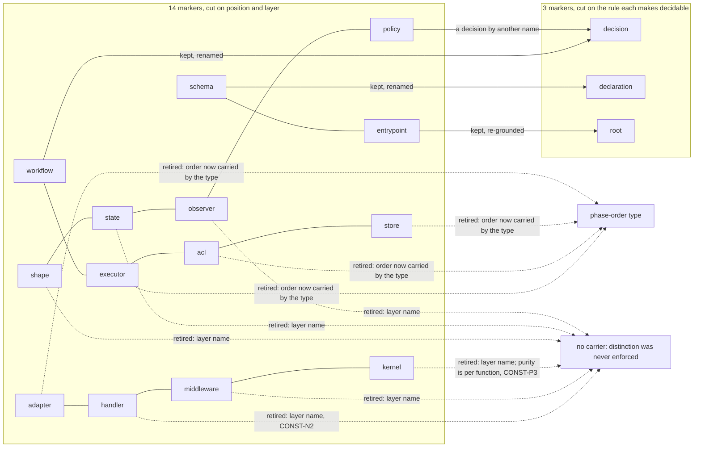

# refactor: cut the cell taxonomy on the rule it enforces, not the sandwich position

## Goal Capsule

The cell taxonomy sanctions thirteen cell suffixes plus the exempt entrypoint
names (`index`, `main`, `mod`) — fourteen markers in all, and the entrypoint is the
one the derivation below keeps. Most of them are
coordinates on **position in the I/O sandwich**, and position is now carried by a
type: `packages/effect-cell-types` ships a description whose phases chain so that
a wrong order fails to compile, the rule's own sentence arriving as the missing
member's name and surviving verbatim into the published `.d.ts`.

This plan re-derives the taxonomy from the only criterion the constitution
supplies, retires the suffixes that criterion rejects, and repairs seven rule
sites that assert the order cannot be enforced at all.

---

## Problem Frame

`CONST-N2` bans, in its own words, "a suffix no rule keys on." That is not a style
preference; it is a membership criterion, and it makes the cell set a **function
of the rule set** rather than an inventory to be curated:

> A cell exists **iff** some rule cannot be decided without knowing the file's role.

The taxonomy was never derived from that criterion. It was cut on sandwich
position (`store` and `adapter` read and write, `acl` decodes and encodes,
`workflow` decides, `executor` sequences) and on transport layer (`handler`,
`middleware`). Three consequences follow, and all three are live:

1. **Duplication with a drifting copy.** Where a type already constrains phase
   order, a suffix asserting the same thing is a second statement of one
   constraint. Per `enforceability-is-not-an-axis` A6 (`posit`) the filename is
   the weaker carrier: a suffix rule keyed on an interior property inherits the
   interior's much worse false-positive rate, while the type's verdict is the
   compiler's. Two carriers, one constraint, and the one that can drift is the
   filename.
2. **Names the constitution forbids.** `kernel`, `shape`, `state`, `observer`,
   `middleware` and `handler` name mechanisms and layers. `CONST-N2` bans layer
   names and `CONST-N1` bans organising by them. A name the constitution forbids
   cannot be admitted by the constitution's own criterion.
3. **Seven rule sites teach the opposite of what now holds.**
   `architect-executor` 23 and 39, `architect-handler` 20 and 38,
   `architect-acl` 36, `architect-workflow` 43, `architect-kernel` 44 each argue
   that a lint rule over one file's AST cannot see the sandwich's order,
   therefore the order is not enforceable. The premise holds; the conclusion is
   false, and a reader who believes it will not reach for the carrier that works.

Method constraint, binding on every unit below: **the repository is not evidence
for what ought to exist.** Per `REPO-W7`, observing that a file, rule, package or
prior commit does something settles a question of fact and nothing normative. How
many files already carry a suffix is not an argument for that suffix. Every
retention below is argued from the criterion or from a corpus atom with a band.

---

## Requirements

- **R1.** The cell set is derived from the `CONST-N2` criterion by enumerating the
  rules that cannot be decided over a file of unknown role. The derivation is
  recorded with the enumeration visible, so a reader can re-run it.
- **R2.** Every surviving cell names the rule that becomes undecidable without it,
  and that rule's predicate is **per file**: removing the marker from one file must
  change whether that file complies. A rule whose content is a cardinality over the
  file set does not qualify, because a count is a property of the set and no single
  file possesses it. A cell that names no per-file rule is retired.
- **R3.** Every retired cell names what carries its distinction instead — a type,
  an edge rule keyed on a surviving cell, or nothing, in which case the record
  says the distinction was never enforced.
- **R4.** The seven rule sites that assert the sandwich order is inexpressible are
  corrected: the true half (an AST rule over one file cannot see it) is kept, the
  false half (therefore nothing can) is dropped.
- **R5.** `architect-executor` states `invariant-interval-sandwich` A9 (`canon`):
  once writing begins, no further read follows. Its three sanctioned remedies —
  pre-fetch, split into two sandwiches, keep the sequence openly in the shell —
  are stated with it.
- **R6.** No rule asserts a prohibition stronger than the corpus licenses. A rule
  resting on A4 ("the shell decides nothing") states it as the achieved state
  `fcis-shell-accumulates-decisions` A1/A3 (`canon`) says it is, not as a
  default.
- **R7.** Synonyms collapse: one coordinate carries one name.
- **R8.** The derivation is adversarially tested in an independent context before
  any deletion lands, and the test's outcome is recorded whichever way it falls.
- **R9.** The import table's operands are exactly the surviving cells; no row
  names a retired suffix as either operand.
- **R10.** Retired cells leave no orphaned enforcement: a rule keyed on a suffix the
  taxonomy no longer sanctions is deleted, or re-keyed onto a survivor. Files still
  carrying a retired suffix belong to the deferred migration, which ships with its own
  gate asserting none remain; this plan's Definition of Done does not claim the tree is
  migrated.
- **R11.** The `decision` marker's **absence is decidable**, so `CONST-B4`'s inward edge
  has a defined right operand: "not marked `decision`" is read off the filename without
  requiring every file to carry a marker. No total assignment is claimed — tests,
  configs, barrels, scripts and generated files carry no marker and sit outside the
  edge's operand set. U5 records that exclusion list and U6 writes the edge against it.
- **R12.** _(owned by U5.)_ The enumeration addresses every article of `CONSTITUTION.md`, including
  the rules it classifies as needing no marker. A rule absent from the table is
  indistinguishable from a rule the derivation never considered.

---

## Key Technical Decisions

**KTD1. The criterion is `CONST-N2`'s, not a fresh axis proposal.**
The alternative was to propose a better axis (lifecycle, purity, dependency
direction) and argue it on merit. Rejected: the constitution already states a
membership test, and inventing a second one alongside it creates two competing
authorities over the same question. Deriving from the existing clause also makes
the result checkable by a reader who accepts only the constitution.
Governs R1, R2.

**KTD2. Three markers survive: `decision`, `declaration`, `root`.**
Read off the enumeration in the High-Level Technical Design below. `decision` is
the subject of `CONST-P1` and `CONST-P2` and the left operand of `CONST-B4`'s
inward edge; `declaration` is the extension of `CONST-T4`'s mutation exclusion;
`root` is the only file permitted to bind implementations — and it is **not a new
marker**: it is the existing exempt entrypoint (`index`/`main`/`mod`), re-grounded and
named for what makes it decidable. `architect-entrypoint.md` and the entrypoint rule
package are therefore edited, never created.

`root`'s ground is a **per-file permission, not a count** — this is the amendment
U1 forced. The first derivation grounded it in `CONST-B4`'s "**one** composition
root" being a cardinality a gate can count, and that ground fails R2: removing the
marker from one file does not change whether that file complies, only what the
total is, and a count is a property of the set. The surviving ground reads B4's
clause as attaching a permission to a location — implementations are wired _there_
and nowhere else — so "may this file bind?" is a genuine per-file predicate, and
without the marker no gate can tell which file is allowed. The cardinality half is
retired to the import graph, where B4's own gate already carries it.
Governs R2, R3.

**KTD3. A purity marker is compatible with `CONST-P3`, and the direction is why.**
`CONST-P3` forbids inferring purity from "a folder, package, or
library-versus-application". A marker that _declares an obligation the gate then
verifies per function_ runs the opposite way: the banned inference goes from
location to fact, this one goes from declaration to obligation, and the gate
falsifies it. Without this distinction `decision` would be self-defeating.
Governs R2.

**KTD4. Position is retired as a coordinate because a type carries it.**
`acl`, `executor`, `store`, `adapter` are positions. The carrier that replaced
them was demonstrated, not assumed: the chained description rejects both the
forward skip and the backward inversion, and the sentence survives declaration
rolling into the published `.d.ts`. Governs R3, R9.

**KTD5. No codebase observation is admitted as evidence for this derivation.**
An earlier draft cited a consumer's file census as a falsification test for KTD2.
Withdrawn on two independent grounds. First, `REPO-W7`: the repository is the subject
under test, never the warrant, and a census counts files — it can settle what a tree
contains and nothing about what ought to exist. Second, the citation was **unsound on
its own terms**: the prediction covered retired positions _and_ banned layer names, the
layer names came back empty and the positions came back populated, so the measurement
split — and the draft reported only the confirming half. A test whose disconfirming half
is dropped is not a test.

The derivation therefore rests on the `CONST-N2` criterion and the enumeration alone. No
unit below cites a file count, a package inventory, or existing practice as a reason to
keep or retire a marker. Governs R1, R2.

**KTD6. The rule-claim repairs land before and independently of the retirements.**
R4, R5 and R6 are true whatever the final cell count is, and they are the changes
a reader is most immediately misled by. Sequencing them first means the risky,
wide retirements are never a prerequisite for shipping the correction.
Governs R4, R5, R6.

**KTD7. `decision` is one marker for `CONST-P1` and `CONST-P2`, not two.**
The predicates are logically independent — purity and single-path shape are
different properties — but no constitutional rule demands one while exempting the
other: both are scoped to the pure core, so the compliant extension is exactly
`pure ∧ single-path`. A file where the two diverge is violating one of them; it is
never evidence of a second marker's population. Recorded because it was attacked
directly in U1 and conceded without a counterexample. Governs R2.

---

## High-Level Technical Design

### The enumeration that produces the cell set

Each row asks whether the rule's predicate is decidable over a file whose role is
unknown. Rows answering "yes" mint a marker; rows answering "no" mint nothing.

| constitutional rule                                                                                                                                    | needs a role?      | why                                                                                                                                                                                                                                                                                                                                                                                                                 |
| ------------------------------------------------------------------------------------------------------------------------------------------------------ | ------------------ | ------------------------------------------------------------------------------------------------------------------------------------------------------------------------------------------------------------------------------------------------------------------------------------------------------------------------------------------------------------------------------------------------------------------- |
| `CONST-P1` purity · `CONST-P2` complexity 1                                                                                                            | **yes**            | both are scoped "the pure core"; over an unknown role the predicate has no subject, and complexity 1 cannot be demanded of a shell that must sequence                                                                                                                                                                                                                                                               |
| `CONST-T3` mutation 100% · `CONST-T4` behaviour where the mutator sees it                                                                              | **yes**            | T4 _defines_ its exclusion on declaration files, so without the marker the exclusion has no extension and T3's denominator is undefined                                                                                                                                                                                                                                                                             |
| `CONST-B4` implementations are wired at the composition root                                                                                           | **yes**            | a per-file permission: only a root-marked file may bind, so "may this file bind?" turns on its role. The _cardinality_ half ("**one**" root) mints nothing — a count is a property of the set, and no single file possesses it                                                                                                                                                                                      |
| `CONST-B4` dependencies point inward                                                                                                                   | no new marker      | the edge is "decision may not import non-decision" — one named operand plus negation decides it                                                                                                                                                                                                                                                                                                                     |
| `CONST-B3` the I/O sandwich                                                                                                                            | **no**             | its content is order, now type-carried; its steps are phases of one operation, not separate files                                                                                                                                                                                                                                                                                                                   |
| `CONST-B2` effects are values                                                                                                                          | no                 | an eager async result on the public surface is visible in a signature                                                                                                                                                                                                                                                                                                                                               |
| `CONST-B5` decode, never cast                                                                                                                          | no                 | "no unchecked cast" is decidable anywhere                                                                                                                                                                                                                                                                                                                                                                           |
| `CONST-D1`–`D4` types, variants, brands, unions                                                                                                        | no                 | each is a property of a declaration the checker already sees                                                                                                                                                                                                                                                                                                                                                        |
| `CONST-B1` functional core, imperative shell                                                                                                           | **no**             | the core/shell split is decidable from content — a file doing I/O is shell, a file doing pure domain logic is core — and the shell is reached as the complement of `decision` (R11), the same negation B4's inward edge uses. B1's own check is role-free: a boundary object needing its own test suite has logic in it. Its named boundary roles (handler, adapter, middleware) are layer names `CONST-N2` retires |
| `CONST-P3` purity is per function                                                                                                                      | **forbids one**    | bans inferring purity from folder or package                                                                                                                                                                                                                                                                                                                                                                        |
| `CONST-N1` · `CONST-N2`                                                                                                                                | **forbid several** | N1 bans organising by technical layer; N2 bans layer names outright                                                                                                                                                                                                                                                                                                                                                 |
| `CONST-N3` fits in the head                                                                                                                            | no                 | one responsibility per module, and the decomposition signal is fixture difficulty — judged per module without a role                                                                                                                                                                                                                                                                                                |
| `CONST-T1` trophy · `CONST-T2` properties over examples · `CONST-T5` pin behaviour first                                                               | no                 | layer investment and test kind are review calls over a suite, not predicates over one file's role                                                                                                                                                                                                                                                                                                                   |
| `CONST-G1` by purpose not quotation · `CONST-G2` supreme                                                                                               | no                 | interpretive rules about how a principle is invoked; they bind readers, not files                                                                                                                                                                                                                                                                                                                                   |
| `CONST-E1` prefer the gate · `CONST-E2` evidence before done · `CONST-E3` a gate earns its place · `CONST-E4` the evaluator is not the agent's to edit | no                 | rules about enforcement and commits; E4's subject is a commit's contents, decidable from the diff                                                                                                                                                                                                                                                                                                                   |
| `CONST-S1` depth · `CONST-S2` first principles over precedent · `CONST-S3` API-first · `CONST-S4` subtract before you add                              | no                 | their subject is the change, not the file                                                                                                                                                                                                                                                                                                                                                                           |
| `CONST-W1` scope discipline · `CONST-W2` challenge before you commit · `CONST-W3` no silent bypass                                                     | no                 | rules about conduct on a task; no file-level predicate                                                                                                                                                                                                                                                                                                                                                              |

Three rules need a role. Nothing else does — and the table now lists every article of
`CONSTITUTION.md`,
including the rules that mint nothing, so a reader can tell a considered "no" from an
omission (R12).

### Before and after

Directional. The prose above is authoritative where the two disagree.

---

## Scope Boundaries

**In scope.** The derivation record; the three-marker cell set; the seven
falsified rule sites; A9's absence from the executor rule; the import table's
operands; retirement of rules whose subject no longer exists; the doctrine files
that state the vocabulary; changesets for every publishable package touched.

### Deferred to Follow-Up Work

- Migrating source files in this workspace onto the new markers. The vocabulary
  change and the file renames are separate landings; renaming under a vocabulary
  that has not shipped inverts the dependency.
- Any change inside `.repos/identity-backend`. It is a separate repository and a
  separate decision.
- Whether `declaration` and `decision` are better expressed as one marker plus a
  predicate. A spelling question over a settled partition.

### Outside this plan's identity

- Proposing a lifecycle axis (recurrence, supervision, request scope). Real
  distinctions, but `CONST-S3` forbids an abstraction for a requirement no rule
  states. When a rule needs to decide "invoked by a schedule", the criterion
  admits the marker then and the derivation is re-run rather than amended.
- Re-litigating whether the phase-order type was the right mechanism. It shipped
  and is verified; this plan consumes it.

---

## Assumptions

- **A1.** ~~The rule enumeration is complete over `CONSTITUTION.md`'s articles.~~
  **Falsified by U1 and repaired.** `CONST-B1` was absent from the table; it is now
  present and classified as minting nothing (R12). Completeness over articles is no
  longer assumed but checked. The enumeration is still not complete over rules a
  leaf may add; each such rule re-runs the criterion and may earn a fourth marker.
- **A2.** `enforceability-is-not-an-axis` carries band `posit`, not `canon`, so
  A5 and A6 are defeasible by argument. The derivation leans on them for the
  edge-versus-interior ranking only, never for the membership criterion, which is
  the constitution's.
- **A3.** Retiring a published lint rule is acceptable without a deprecation
  path. `REPO-R1`: every package is pre-1.0 alpha and a compatibility objection
  needs a named in-repo consumer migration.

---

## Implementation Units

### U1. Falsify the derivation before anything is deleted

- **Goal.** Attack KTD2 hard enough that a survival is worth something, in
  contexts that did not build it.
- **Requirements.** R8; tests A1.
- **Dependencies.** None.
- **Files.** `docs/cell-taxonomy/DERIVATION.md` (modify — record the outcome).
- **Approach.**
  1. Dispatch four independent adversarial contexts, each given the enumeration
     table and the constitution, each assigned a different attack: that the
     enumeration is incomplete over the articles; that `decision` collapses
     `CONST-P1`'s purity with `CONST-P2`'s complexity and they need separate
     markers; that `root` is not decidable from a filename at all.
  2. Require each to produce either a named rule the enumeration missed, or a
     concession.
  3. Per `INDEPENDENCE_ACCOUNTING`, agreement among contexts that shared a brief
     is one hypothesis restated — record convergence as such, never as
     corroboration.
- **Execution note.** This unit can defeat the plan. If a genuine missed rule
  appears, stop and re-derive; do not proceed to U4 with a known hole.
- **Test scenarios.**
  - A context is given the enumeration with one row silently removed and asked
    whether it is complete; it names the missing row. Fails if the audit cannot
    detect a hole that was planted.
  - A context argues for a fourth marker; the argument either names a
    constitutional rule undecidable without it, or is recorded as refuted with
    the reason.
  - The recorded outcome states, for each attack, which of "missed rule" or
    "concession" it produced.
- **Verification.** `DERIVATION.md` carries the outcomes and, where any attack
  succeeded, the re-derived table.
- **Outcome — this pass has run.** Four contexts dispatched, differently assigned.
  Two of the four defeated something, and both defeats are repaired above rather
  than absorbed:
  1. _Completeness_ — `derivation_breaks`, missed rule `CONST-B1`. Repaired: the row
     is added, classified "no", and R12 now forbids a silent omission.
  2. _`root`'s decidability_ — `derivation_breaks`, missed rule `CONST-B4`. The
     cardinality ground fails a per-file criterion. Repaired: KTD2 re-grounds `root`
     on B4's per-file permission, and R2 now states the per-file requirement
     explicitly so the same error cannot recur.
  3. _`CONST-P1`/`CONST-P2` merge_ — `derivation_survives`, conceded with no
     counterexample offered. Recorded as KTD7.
  4. _Planted-hole control_ — independently named `CONST-B1`, from a different
     assignment, and judged that restoring it confirms three markers rather than
     four. Because assignments differed, this is closer to corroboration than the
     same-brief agreement `INDEPENDENCE_ACCOUNTING` warns about — but it is still
     agreement, not proof.
     Residual disagreement to settle in U5: attack 1 held that B1 forces either the
     totality obligation or a fourth marker for the translation surface; the control
     held that B1 classifies "no" and three markers stand. This plan takes the
     totality obligation (R11) and no fourth marker. A fourth marker would require
     re-classifying the `CONST-N1`/`CONST-N2` row, since the translation surface is
     exactly the layer names N2 retires — the two positions cannot both stand
     unamended, and that tension is recorded rather than hidden.

### U2. Correct the seven inexpressibility claims

- **Goal.** Stop seven rule sites teaching that the sandwich's order cannot be
  enforced.
- **Requirements.** R4. Instantiates KTD6.
- **Dependencies.** None — independent of the cell set.
- **Files.** `/root/.omp/agent/rules/architect-executor.md` (modify, lines 23 and
  39), `architect-handler.md` (20, 38), `architect-acl.md` (36),
  `architect-workflow.md` (43), `architect-kernel.md` (44).
- **Approach.**
  1. Keep the true half in each sentence: a lint rule reading one file's AST
     cannot see an order that spans call sites.
  2. Replace the false conclusion with the carrier that holds: the order is
     carried by the phase types, and a wrong order fails to compile with the
     rule's own sentence as the diagnostic.
  3. Match each document's existing register. No revision narration — no
     "previously", "no longer", "updated"; the current text reads as always true.
- **Patterns to follow.** The surrounding bullets in each rule file: one
  declarative clause, the harm named, no hedging.
- **Test scenarios.**
  - Each of the seven sites is re-read after editing and contains no claim that
    the order is inexpressible, unenforceable, or review-only.
  - No edited sentence claims a _lint rule_ enforces the order — the carrier is
    named as the type, so the corrected text does not overshoot into a second
    false claim.
  - A grep for `inexpressible` across the rule directory returns only sites where
    the subject is genuinely undecidable from one AST (cardinality, cohesion).
- **Verification.** All seven sites corrected; the cardinality and cohesion
  claims, which remain true, are untouched.

### U3. State A9 in the executor rule and right-size its prohibitions

- **Goal.** Close the gap that lets a reader satisfy the executor rule completely
  and still write a write-then-read pair.
- **Requirements.** R5, R6.
- **Dependencies.** U2 (same files; sequencing avoids two passes over one line).
- **Files.** `/root/.omp/agent/rules/architect-executor.md` (modify).
- **Approach.**
  1. Add A9 as its own bullet: once writing begins, no further read follows;
     every read precedes every decode.
  2. State its three sanctioned remedies — pre-fetch, split into two sandwiches,
     keep the sequence openly in the shell — so the rule does not force a
     description where the corpus permits an honest shell.
  3. Soften the prose that presents `CONST-B4`/A4's "shell decides nothing" as an
     absolute prohibition to the achieved state `fcis-shell-accumulates-decisions`
     A1/A3 (`canon`) describes.
- **Test scenarios.**
  - The rule as edited rejects `zipRight(record, isExceeded)` — a write followed
    by a read — via the A9 bullet. Before the edit no bullet rejects it; that
    asymmetry is the defect being closed.
  - The rule permits a shell that keeps a decision openly between two impure
    steps, and names it as carrying the burden of proof rather than as a
    violation.
  - No bullet demands that every workflow-calling shell become a description.
- **Verification.** A reader following the rule literally cannot produce the
  write-then-read pair, and is not forced into a description where A9's third
  remedy applies.

### U4. Collapse synonyms onto one name per coordinate

- **Goal.** One coordinate, one name.
- **Requirements.** R7.
- **Dependencies.** U1.
- **Files.** `docs/cell-taxonomy/SPECIFICATION.md` (modify).
- **Approach.** Record that a pure decision has one name and a one-shot operation
  has one name, and that alternative spellings of either are the same coordinate.
  `CONST-D2`'s discipline — one distinct thing, one tag — applies to vocabulary
  as much as to error variants. Names only; no file renames here.
- **Test scenarios.**
  - The specification lists no two sanctioned suffixes that the enumeration maps
    to the same marker.
  - Each collapsed spelling appears once, in a retirement note pointing at its
    surviving name.
- **Verification.** The sanctioned list contains no synonym pair.

### U5. Rewrite the specification and derivation to the three-marker set

- **Goal.** Make the recorded taxonomy the derived one, with the enumeration
  visible.
- **Requirements.** R1, R2, R3, R11, R12. Instantiates KTD1, KTD2, KTD3, KTD4, KTD5.
- **Dependencies.** U1, U4.
- **Files.** `docs/cell-taxonomy/SPECIFICATION.md` (modify),
  `docs/cell-taxonomy/DERIVATION.md` (modify).
- **Approach.**
  1. State the criterion and the enumeration table as the derivation, so the set
     is reproducible rather than asserted.
  2. For each survivor: the coordinate, and the rule that becomes undecidable
     without it.
  3. For each retirement: what carries the distinction instead, or that it was
     never enforced.
  4. Decide `root`'s spelling — suffix or exempt entrypoint names — and state the
     reason and that it is reversible without re-deriving.
  5. Carry `CONST-P3`'s direction argument (KTD3) explicitly; without it
     `decision` reads as the inference P3 bans.
  6. Record R11's exclusion list — the file classes that carry no marker (tests,
     configs, barrels, scripts, generated files) and are therefore outside the inward
     edge's operand set. Without it "not marked `decision`" silently claims every file.
  7. Complete the enumeration over every article (R12), including the rules that mint
     nothing, so a considered "no" is distinguishable from an omission.
  8. State each retired cell's destination: the four positions name the phase-order type
     as their carrier; the layer names record that their distinction was never enforced.
- **Test scenarios.**
  - Every survivor row names a constitutional rule; a row that cannot is retired
    instead.
  - Every retirement row names a carrier or states the distinction was
    unenforced; no row is silent.
  - The enumeration in the document reproduces the marker set when re-run by a
    reader who accepts only `CONSTITUTION.md`.
  - No survivor is justified by prevalence, precedent, or existing packages —
    `REPO-W7`. A reviewer greps the document for such an appeal and finds none.
- **Verification.** A reader can re-derive the set from the document without
  consulting any source tree.

### U6. Retarget the import table to the surviving operands

- **Goal.** No edge rule keyed on a suffix the taxonomy no longer sanctions.
- **Requirements.** R9.
- **Dependencies.** U5.
- **Files.** `packages/oxlint-plugins/cell-imports/src/cell-import-table.config.ts`
  (modify), `packages/oxlint-plugins/cell-imports/src/rules/__tests__/cell-import-boundary.test.ts`
  (modify).
- **Approach.**
  1. Reduce the table to `CONST-B4`'s inward edge over the surviving markers:
     `decision` may not import a non-decision, and may not reach the runtime.
  2. Drop rows whose left operand is retired, and drop retired suffixes from
     every `forbid` list so no row names a suffix nothing can carry.
  3. Remove the legacy non-cell names in the old policy row (`.service`,
     `.shell`, `.use-case`, `.daemon`, `.repository`): a vocabulary that forbids
     names it does not sanction is enforcing a set it does not define.
- **Execution note.** The table is enforcement surface. Per `CONST-E4` it lands
  in its own commit, observed failing before and passing after, and never in a
  commit that also changes what it judges.
- **Test scenarios.**
  - A `decision` file importing a non-decision is rejected, with the fixture
    observed red before the rule change and green after.
  - A `decision` file importing a declaration is accepted — the inward edge must
    not forbid the declarations a decision legitimately reads.
  - A `decision` file importing `node:fs` is rejected.
  - No table key and no `forbid` entry names a retired suffix; a fixture using a
    retired suffix is treated as an unsanctioned name, not as a table row.
  - Every removed row's fixtures are deleted with it, so no test asserts an edge
    that no longer exists.
- **Verification.** `pnpm --filter @systemfsoftware/oxlint-plugin-cell-imports test`
  passes with the reduced table; every table operand appears in the
  specification's sanctioned list.

### U7. Delete the rules whose subject no longer exists

- **Goal.** Leave no gate keyed on a retired marker.
- **Requirements.** R10.
- **Dependencies.** U5, U6.
- **Files.** the per-cell rule directories under `packages/oxlint-plugins/` whose
  subject is retired, their `__tests__` siblings, each package's
  `oxlint.config.ts` registration, `scripts/guards/guard-mutate-scope.mjs`
  (modify — its forbidden and observer lists name retired suffixes), and the entrypoint
  rule package plus `/root/.omp/agent/rules/architect-entrypoint.md` (modify — `root` is
  the existing entrypoint marker re-grounded, so these are edited, never created).
- **Approach.**
  1. For each retired marker, delete its rules and their fixtures. `CONST-S4`:
     removal is the default, and a rule whose subject cannot exist is not a rule.
  2. Where a deleted rule enforced something the criterion still wants, re-key it
     onto a surviving marker rather than deleting the obligation with the name.
  3. Update the mutation guard's suffix lists to the surviving markers.
- **Execution note.** `guard-mutate-scope.mjs` is Evaluator surface per the
  workspace surface table: its own commit, red before and green after, never
  sharing a commit with the work it judges.
- **Test scenarios.**
  - A rule re-keyed rather than deleted still rejects its original violation,
    proven by the original fixture retargeted to the surviving marker.
  - The mutation guard, run over a `decision` file, still selects it for
    mutation; run over a `declaration` file, still excludes it — `CONST-T4`
    survives the rename.
  - No `oxlint.config.ts` references a deleted rule; a config load failure is
    itself the test.
  - Deleting the rules does not reduce the mutation score of any package that
    keeps a `stryker.config.json`.
- **Verification.** `pnpm check:lint-coverage` and `pnpm check:mutate-scope` pass;
  no config names a deleted rule.

### U8. Align the doctrine and ship the intents

- **Goal.** Leave one vocabulary stated in one place, and release what changed.
- **Requirements.** R1, R7; closes the plan.
- **Dependencies.** U2, U3, U5, U6, U7.
- **Files.** `CONCEPTS.md` (modify), root `AGENTS.md` (modify),
  `packages/*/AGENTS.md` for leaves naming retired cells (modify),
  `.changeset/` (create).
- **Approach.**
  1. Update `CONCEPTS.md` so the canonical vocabulary is the derived one.
  2. Update the surface and directory guidance that names retired cells.
  3. Per `REPO-R2`, add a changeset for every publishable package touched. The
     lint-plugin retirements are breaking: `api!` with a `BREAKING CHANGE:`
     footer per `REPO-R1`.
- **Test scenarios.**
  - No doctrine file names a retired cell as sanctioned; a grep for each retired
    name returns only retirement notes.
  - `CONCEPTS.md` defines each surviving marker once, with no synonym entry.
  - Every publishable package in the diff has a changeset; the changeset check
    fails without one, which is the test.
- **Verification.** `pnpm check:script-provenance` passes — doctrine remains an
  input to no gate; the changeset workflow passes.

---

## Risk Analysis and Mitigation

| risk                                                                                       | severity | mitigation                                                                                                                                                                                                 |
| ------------------------------------------------------------------------------------------ | -------- | ---------------------------------------------------------------------------------------------------------------------------------------------------------------------------------------------------------- |
| The enumeration is incomplete and a needed marker is retired                               | high     | U1 attacks completeness in independent contexts before any deletion; a named missed rule stops the plan rather than being absorbed                                                                         |
| A retired rule was enforcing something real, and deleting it silently drops the obligation | high     | U7 step 2 re-keys rather than deletes, proven by retargeting the original fixture; `CONST-S4` demands the obligation be named before its name is removed                                                   |
| Enforcement surface and the work it judges share a commit, so a loosened gate is invisible | high     | U6 and U7 carry `CONST-E4` execution notes: own commit, red before, green after                                                                                                                            |
| The type is asserted to carry the order but a consumer path degrades the diagnostic        | medium   | already measured for the shipped surface: five sentences survive declaration rolling into `dist/index.d.ts`, verified in both nested and `pipe` form; U5 cites the measurement rather than re-asserting it |
| Retiring a published lint rule breaks an external consumer                                 | low      | `REPO-R1`: pre-1.0 alpha, and a compatibility objection requires a named in-repo consumer migration                                                                                                        |
| Doctrine and lint drift into two vocabularies mid-migration                                | medium   | U8 depends on U5–U7 and is the single landing that restates the vocabulary                                                                                                                                 |

---

## Verification Contract

- `pnpm check:local` exits 0 after the last edit of each landing.
- `pnpm --filter @systemfsoftware/oxlint-plugin-cell-imports test` passes with the
  reduced table.
- `pnpm check:lint-coverage`, `pnpm check:mutate-scope` and
  `pnpm check:script-provenance` pass.
- Each gate change is observed red before and green after, in its own commit.
- Where a diff names a source file in a package carrying a `stryker.config.json`,
  `pnpm --filter <pkg> mutation` reports 100% on the changed pure files.
- `gh pr checks --watch --fail-fast` exits 0.

## Definition of Done

- The specification and derivation state the criterion, the enumeration, the
  survivors with their rules, and the retirements with their carriers — and a
  reader can re-derive the set from the document alone.
- U1's three attack outcomes are recorded, whichever way they fell.
- The seven inexpressibility claims are corrected and A9 is stated.
- No gate is keyed on a retired marker; no doctrine file sanctions one.
- Changesets accompany every publishable package touched.
- Delivered as a pull request watched to green; merge stays human per `REPO-P1`.

---

## Sources and Research

- `CONSTITUTION.md` — `CONST-N2` (the membership criterion, and the ban on layer
  names), `CONST-N1`, `CONST-P1`, `CONST-P2`, `CONST-P3`, `CONST-B3`, `CONST-B4`,
  `CONST-T3`, `CONST-T4`, `CONST-S3`, `CONST-S4`, `CONST-E4`, `CONST-D2`.
- `AGENTS.md` — `REPO-W7` (the repository is the subject under test, never the
  warrant), `REPO-R1`, `REPO-R2`, `REPO-P1`, and the surface classes that make
  the import table and the mutation guard evaluator surface.
- Software wiki, `module-identity.md` (verdict: context-dependent) — the deciding
  question is whether a rule reads the filename's role, with the concession that
  an unread vocabulary is debt.
- Software wiki, `enforceability-is-not-an-axis.md` A5, A6, A7, A9 (`posit`) — a
  suffix supplies the left operand of an edge rule; edge-keyed rules inherit a
  near-zero false-positive rate and interior-keyed rules a much worse one.
- Software wiki, `invariant-interval-sandwich.md` A1–A4, A9 (`canon`), A11 — the
  sandwich, the no-read-after-write constraint, its three remedies, and that it
  is not universal.
- Software wiki, `fcis-shell-accumulates-decisions.md` A1, A3 (`canon`) — a shell
  that decides nothing is achieved, not default.
- `packages/effect-cell-types` — the shipped phase-order type this plan consumes;
  33 type assertions, 9 matched directives, each observed red before green.
- No codebase census is cited anywhere in this plan; see KTD5 for why the earlier one
  was withdrawn.
