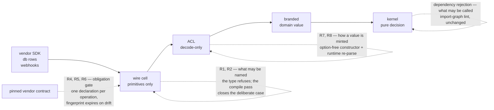

# Foreign-Edge Boundary Law - Plan

## Goal Capsule

**Objective.** Guard the boundary where foreign data becomes domain data: no foreign contract becomes a domain
type by being named, and no domain value exists without something having examined it.

**Product authority.** The requirements are settled. Every claim marked _reproduced_ was executed this session;
evidence is in the gitignored scratch `.context/foreign-edge/` — `model.ts` (12 assertions green), `corrupt.ts`
(type-checks clean while behaving wrongly), 16 probes, and `ledger.md` (26 rows across four adversarial passes,
two still open; two passes by independently dispatched reviewers, two by an external critic). The sixteenth
probe, `probe-minted-alphabet.ts`, is the one this plan turns on: it moved R1 and R2 off a lint rule and into
the type. Toolchain measurements are in `.context/ttsc-lab/` and `.context/typical-lab/`, with the four-stage
obligation-gate run captured at `wiki/raw/runs/2026-08-15-evidence-graph-obligation.md`.

**Open blockers.** None. Four Outstanding Questions affect sequencing only and are classified below; the
fourth is upstream and this plan does not turn on it.

## Product Contract

### Summary

Add a second admissibility rule to the cell library — a declaration cell may name only types this workspace
authored — and a third governing how domain values come into existence. Each requirement is assigned to the
enforcement rung that can actually decide it, because the current rule sits on a rung that cannot see the
violation it exists to catch.

### Problem Frame

The import table in `packages/oxlint-plugins/cell-imports/` prices dependencies with one law, from Wlaschin: a
dependency earns special management when it is impure or a strategy. A consumer defeated it by naming rather
than calling — `type ChainEvents = TxFinalized['events']` inside a schema cell, with an `S.declare` guard that
recognizes any array. Every shipped rule passed. An `import type` is not a call, and Wlaschin's frame excludes
library dependencies by construction, so nothing in the law was violated.

Three facts about the current mechanism, read from source this session:

- `cell-import-boundary.ts:107-108` — `cellOf()` derives a cell from the _imported specifier's_ filename and
  returns `null` for any bare package specifier, at which point the rule returns. **Every external import is
  invisible to the rule today**, in the hand-authored phase, before any generator arrives.
- `cell-import-table.config.ts:17-145` — `CELL_IMPORT_TABLE` has no `.schema.ts` or `.acl.ts` key; `CellEdge`
  carries `forbid`, `forbidValue`, `exceptVia`, `forbidRuntime`, and no type-origin arm.
- `cell-import-boundary.ts:49-55` — `hasValueBinding()` already separates type-only from value imports, so the
  channel distinction exists in the AST layer and is unused.

The corrupted pattern reproduces against real vendored `.d.ts` types, type-checks clean, and yields
`amount_due` typed `number | null` holding `"not-a-number"`.

### Key Decisions

- **Three rules, not two channels** _(session-settled: user-directed — chosen over a two-channel factoring and
  over a single ownership law: each of the three rejects a case the other two accept, reproduced)_. Governs
  R1, R3, R7, R8.
- **Declaration-site ownership over specifier origin** — the textual predicate dies to one alias hop. Governs
  R1, R2.
- **Tolerance at runtime, detection at build** — strict decoding on the request path converts a benign vendor
  addition into a failed webhook. Governs R5.
- **Brands need constructors, not just names** — REPO-A4: a type binds only where something forces the
  constructor. Governs R7.
- **AST fingerprint over package origin** — origin is binary, drift is continuous. Governs R6.
- **Short-circuit over accumulation** _(session-settled: user-approved — chosen over accumulating multi-source
  failures: an aggregate mixing contradictory facts is false, not partial)_. Governs R9.
- **Reach decides the host, not power** _(session-settled: user-directed — resolve high-stakes decisions
  against the wiki; the corpus reversed this plan's earlier reading, and then a measurement reversed it
  again)_. A rule's host determines which consumers ever receive it, and a rule keyed to our authoring harness
  ships zero bits across the package boundary. Governs R1, R2, R4.

  Candidates for the type-aware arm, and why the losers lost:

  | Host                                           | Decides R1's predicate    | Reaches the vendored consumer                      | Cost                                                      |
  | ---------------------------------------------- | ------------------------- | -------------------------------------------------- | --------------------------------------------------------- |
  | Hand-rolled `tsc` checker in `scripts/guards/` | yes                       | no — our tree only                                 | a program to build and maintain                           |
  | typescript-eslint type-aware rule              | yes                       | only if the consumer adds a second runner          | ESLint alongside oxlint, slow second parse                |
  | `@ttsc/lint` plugin                            | yes, inside the compile   | only if the consumer replaces their compiler       | rules authored in Go; a 0.27.0 compiler in the build path |
  | The published type                             | for every accidental case | **yes — through the `.d.ts` they already consume** | the alphabet must be adopted by new declarations          |
  | Emitter-time construction                      | yes, by construction      | yes — but the emitters were deleted in #166        | waits on something that no longer exists                  |

  **This decision's own reversing observation fired the same day it was written.** It read: "if the consumer
  adopts our compiler, or the constraint moves into the rolled type where it needs no host at all, R2's
  justification expires and it should be deleted." A probe moved the constraint into the rolled type, and a
  census found the consumer registers none of our lint plugins and ignores the vendored mirror entirely — so
  the lint arm's reach was not weak, it was **zero**. R2 is therefore restated as a type law rather than a lint
  rule, and the emitter row is struck: PR #166 deleted the emitters, so deferring a requirement to emitter-time
  construction was deferring it to nothing. The next reversing observation: if a consumer is found that runs
  our lint plugins but not our types, the lint arm earns its life back.

Where each rule acts, and which rung can decide it:

### Requirements

**Admissibility — what a cell may name**

**R1 — Type-origin admissibility is decided by declaration site, transitively.** A declaration cell must not
name a type whose declaration resolves outside the workspace, including through workspace-local aliases and
re-exports. _Rung: the type, for every case an author reaches accidentally; the compile pass, for the one case
an author reaches deliberately._

**R2 — A declaration is built from an alphabet this workspace mints, so a foreign type has nothing to be.**
A wire declaration accepts only marked members. The refusal is a type error at the authoring site and travels
to every consumer through the published `.d.ts`, which is the one channel a library controls.
_Rung: the type._

**R3 — Adapter and executor cells may name vendor types.** There the type describes a call, which the existing
value-origin law already prices. They draw from no alphabet and inherit no refusal. _Rung: their absence from
the alphabet — no rule, no exception._

**Foreign contracts — restatement and drift**

**R4 — One wire declaration per foreign contract, in primitives, scoped by decision surface.** Contracts whose
fields the domain mostly decides on are restated; a contract carried mostly untouched is not.
_Rung: obligation gate in the compile pass._ Each operation in the pinned contract document is one unit that
some declaration must acknowledge, and each acknowledgement must resolve to a real operation. The gate decides
cardinality and correspondence; it cannot decide the decision-surface threshold, and it does not adjudicate
whether an acknowledgement is true — a declaration implementing none of a contract satisfies it by asserting
in prose that it does. Both limits are measured, not assumed.

**R5 — Drift is detected out of band, never on the request path.** Decoding tolerates vendor additions;
detection is the acknowledgement's fingerprint expiring when the pinned contract's bytes change, plus a
value-level golden pinning a recorded payload to its expected decoded domain value.
_Rung: obligation gate for spec drift, test for value drift._

**R6 — Admissible generated types carry a fingerprint the gate recomputes, never one an author declares.** The
digest is computed from the pinned contract's bytes at check time. _Rung: the same gate._

**Construction — how a domain value comes to exist**

**R7 — Every branded domain type is constructed through an option-free constructor.** Production cells must not
reach a construction form that skips refinements. _Rung: syntactic lint plus the constructor's signature._

**R8 — Translation cells are decode-only, and the cited exemplar is repaired before it is cited.** An ACL's
`encode` returns `Forbidden`; `.repos/identity-backend/packages/lib/hono-auth/src/play-integrity/play-integrity.acl.ts:38-67`
currently fails open against vendor additions. _Rung: syntactic lint for the contract, R5 for the exemplar's hole._

**Aggregates**

**R9 — Aggregates state only the coherence they can prove.** Identity disagreement short-circuits; partial
availability earns a distinct type; provenance requires distinct sources within a bounded window, carrying a
snapshot token where the source can supply one. _Rung: schema refinement plus type shape._

### Key Flows

**Foreign contract enters** (sequences R3, R4, R8): adapter calls the vendor with the vendor's own types → wire
declaration restates the payload in primitives → ACL decodes into a branded or nominal domain type → the kernel
sees only that type.

**Aggregate over multiple sources** (sequences R9): each source decodes independently carrying the instant it
was observed → a pure function takes already-branded parts → identity disagreement returns a typed failure
naming the sources → success returns a branded aggregate.

**Vendor changes their contract** (sequences R5, R6): the request path keeps serving → the pinned-sample check
fails in CI → a human decides whether the new field is domain-relevant → for generated contracts the
fingerprint mismatch fails the same run.

### Acceptance Examples

Each is executable today against the scratch model and must reproduce inside the packages.

1. A 26-key vendor payload decodes on the request path, dropping unknown keys without failing. _Covers R5._
2. The same payload fails the pinned-sample check, which names the added key. _Covers R5._
3. A vendor that renames nothing but changes a field's meaning fails the value-level golden. _Covers R5._
4. A wire declaration whose AST fingerprint differs from its committed golden fails CI. _Covers R6._
5. An unsettled invoice is rejected by the ACL; an encode attempt returns a `Forbidden` leaf. _Covers R8._
6. Three provenance stamps from one source are rejected; three stamps eight hours apart are rejected. _Covers R9._
7. A negative amount throws at the constructor, and the options bypass is unreachable through its signature.
   _Covers R7._
8. A structurally complete but unbranded aggregate is rejected by `tsc` naming `[BrandTypeId]` alone. _Covers R7._
9. A cast-branded member smuggled into a nominal constructor is rejected at that constructor. _Covers R7._
10. A declaration cell importing a vendor type directly is rejected by lint. _Covers R2._
11. A declaration cell importing the same vendor type through a workspace-local alias is rejected by the
    type-aware check, and documented as not caught by R2. _Covers R1._

### Scope Boundaries

**In scope as law.** R1 through R9. The contract states the boundary law whole; a requirement is not weakened
by shipping later.

**Enforced by this change.** R1, R2, R3, R4, R5, R6 and R8 — the type carries admissibility, the compile pass
carries the residual and the contract correspondence, and the exemplar is repaired.

**Deferred, named, with the reason.** R7's syntactic arm — the alphabet's constructors already force the
option-free path for anything built from them, so the lint rule that catches a hand-rolled `.make(x, true)`
elsewhere in the tree is a separate sweep with its own mutation budget. R9's snapshot token needs a source
that can supply one, and no vendor in scope does yet; the type must not claim atomicity it cannot prove, so
the requirement stands unenforced rather than half-enforced.

**Explicitly not done, and previously planned.** Widening the oxlint import table with `.schema.ts` and
`.acl.ts` source keys. Those suffixes are targets in that table and never sources; the predicate is an
interior property of a type rather than an edge between two named files; and the one known consumer runs none
of our lint plugins. The earlier draft of this plan proposed it and was wrong.

**Outside this plan's identity.** Removing authored suffixes. Making the request path strict. Accumulating
multi-source failures instead of short-circuiting.

### Dependencies and Assumptions

- **The type refuses a foreign member, and it refuses the laundering hop.** Measured 2026-08-15,
  `.context/foreign-edge/probe-minted-alphabet.ts`, `deno check` exit 0 with every `@ts-expect-error`
  satisfied: a raw unmarked schema, a directly named vendor type, and a workspace-local _alias_ of a vendor
  type are each refused at compile time. The alias hop is C-09's laundering hole — the case that defeats every
  specifier-keyed rule — and marking the schema rather than the value closes it. One case still compiles:
  marking a foreign schema deliberately. That residual is the whole remaining job for a type-aware host.
- **The published lint table reaches the known consumer zero times.** Measured 2026-08-15:
  `.repos/identity-backend/` registers only `@identity-backend/oxlint-plugin` in its own base config — no
  `effect-dmmf`, no `cell-imports` — and its lint ignores `**/repos/**`, so the vendored mirror of this repo is
  never linted by it. The consumer consumes our _types_. Any reach argument for the lint arm was false.
- **`.schema.ts` and `.acl.ts` are targets in the import table, never sources.** Adding source entries would
  have been new taxonomy, not a widened rule. Most TypeScript files in this tree carry no cell suffix at all,
  so a suffix-keyed predicate cannot see them — `label-routed-rules-are-unfalsifiable`, measured again here.
- **This repo already replaced its compiler.** `scripts/tools/patch-tsgo-if-needed.mjs`, wired into `prepare`,
  patches the `@effect/tsgo` native binary over `@typescript/typescript-<platform>-<arch>/lib/tsc`. Every
  `tsc --noEmit` in 52 packages is a typescript-go binary, not microsoft/typescript.
- **The Effect policy gates CI through two channels, and a naive compiler swap deletes it silently.**
  `lint:tsgo` runs `effect-tsgo diagnostics` for three packages; for every package extending
  `packages/tsconfig/effect.json` the same diagnostics arrive as `TS377xxx` errors inside `typecheck`, because
  `ignoreEffectErrorsInTscExitCode` defaults to false. Both reach `check:local` and `check:ci` through
  `gate:tasks`. 79 of the 86 configured diagnostics are `error`.
- **`@effect/language-service` is already native Go.** The implementation this repo runs is 95 rules across 88
  files (~12,122 LOC) compiled into `@effect/tsgo`'s fork of microsoft/typescript-go and fired from
  `checker.RegisterAfterCheckSourceFileCallback` — not a `ts.server.PluginModule`. The TypeScript
  implementation in `Effect-TS/language-service` is the older one and is not what runs here.
- **Both candidate hosts speak the same shim API.** Effect's rules and ttsc's contributor protocol are both
  written against `github.com/microsoft/typescript-go/shim/{ast,checker}`, and ttsc's `go.mod` `replace()`s
  those exact modules. The hosts differ in what they offer, not in what they can see: tsgo has the 95 rules and
  no third-party contributor protocol; ttsc has the protocol and not the rules.
- **A ttsc rule is Go, and consumers need no Go toolchain.** Rules implement `Rule { Name(); Visits(); Check() }`
  and register in a Go `init()`; ttsc ships a bundled Go SDK and compiles a contributor's source on first run,
  cached by content hash. Measured in this tree: 109 s first build, 1.3–1.8 s cached.
- **The declaration-site predicate is the built-in traversal.** `GetSymbolAtLocation` → `GetAliasedSymbol`
  (unwraps re-exports transitively) → `Symbol.Declarations` → `GetSourceFileOfNode` is what
  `@ttsc/lint`'s own `boundaries/dependencies` rule does. R1's predicate is that traversal, not new science.
- **`@ttsc/evidence` cannot see types.** Every evidence rule declares `NeedsTypeChecker() false`, and its own
  source says so: it cannot follow a type alias to its target. It carries correspondence, never resolution.
- **Effect 3.19 semantics, read from `repos/effect` this session.** `.make` validates unless disabled
  (`Schema.ts:3171-3173`, `8897-8903`); `onExcessProperty` defaults to `"ignore"` (`SchemaAST.ts:1883`);
  `ParseResult.Forbidden` is the encode leaf (`ParseResult.ts:198-208`); nominal class constructors re-validate
  their members — reproduced again this session as `InvoiceSettled (Constructor) └─ ["due"]`.

### Outstanding Questions

1. **Deferred to Planning** — what predicate scopes R4's decision surface better than reviewer judgement?
2. **Deferred to Planning** — where does the ownership annotation live once declarations are the source: a
   field in the declaration DSL, or inferred from what the declaration references?
3. **Deferred to Planning** — `S.encodeOption` and `S.encodePromise` were never exercised against a decode-only
   ACL; confirm the `Forbidden` leaf survives both.
4. **Deferred upstream, not to this plan** — the two typescript-go descendants should converge: either ttsc
   gains Effect's rule set, or tsgo gains a contributor protocol. Until one happens, a repo that wants both the
   Effect policy and a custom type-aware rule runs two binaries. That is an upstream question and this plan
   does not turn on it.

## Planning Contract

### Key Technical Decisions

KTD1. **The law is carried by the type, and the type is the only carrier that reaches the consumer**
_(session-settled: user-directed — chosen over widening the oxlint import table, which the user rejected as
planning around the carrier this repository is retiring)_. A wire declaration accepts only members drawn from
a marked alphabet; a foreign type has no mark, and neither does a workspace-local alias of one. Governs R1,
R2, R3. Measured in `.context/foreign-edge/probe-minted-alphabet.ts`: probes 2, 3 and 4 refused at compile
time, probe 4 being C-09's laundering hop. The deciding criterion is reach, and the measurement reversed the
earlier reading — the consumer runs none of our lint rules and all of our types.

KTD2. **The mark sits on the schema, never on the decoded value.** C-06 measured `.make(x, true)` and a bare
cast both minting a branded value with every refinement skipped, so a value brand forces nothing. A mark on
the schema is only obtainable from a constructor this workspace owns. Governs R2, R7. The reversing
observation: if Effect ever makes schema identity forgeable, the mark moves to a nominal wrapper class.

KTD3. **The residual hole is one call site, so the type-aware rule is one predicate — not a rule fleet.**
Marking a foreign schema deliberately compiles (probe 5). Everything else the law forbids is already refused
by KTD1, so the compile-pass rule has exactly one question: does the type argument at this call site have a
declaration inside the workspace? Governs R1. That is `GetSymbolAtLocation` → `GetAliasedSymbol` →
`Symbol.Declarations` → `GetSourceFileOfNode`, the traversal `@ttsc/lint`'s own `boundaries/dependencies`
rule already performs.

KTD4. **`ttsc` enters as an added gate on one package, never as the repository's compiler**
_(session-settled: user-approved — the user priced the Go cost as worth paying and proposed forking the
Effect language service to remove the forfeit; research showed the forfeit is avoidable without a fork)_.
Replacing `tsc` deletes the Effect policy silently, because 79 error-severity diagnostics arrive through
`typecheck` itself. Two binaries checking one package cost duplicated analysis and nothing else; the rule sets
are disjoint, so no diagnostic is reported twice. Governs R1, R4, R5, R6. The reversing observation is named
in Outstanding Question 4: if the two typescript-go descendants converge, this becomes one invocation.

KTD5. **The fork is not the price of entry, and this plan does not pay it.** `@effect/language-service` is
already native Go against the same shim modules ttsc `replace()`s, so the port the user proposed has upstream
already done it. What remains is host adaptation — Effect's rules want `Program` and its `TypeParser` layer
(~9,788 LOC) which `@ttsc/lint`'s `Context` does not expose. Paying that to move rules that already run is
work with no defect behind it. Governs the sequencing, not a requirement.

KTD6. **R4, R5 and R6 are configuration, because the gate that decides them already ships.** `@ttsc/evidence`
enforces a bijection between two enumerable populations in both directions, with each OpenAPI operation under
`paths` as one digest-carrying unit; `singleEvidencePerSymbol` is literally one declaration per contract, and
`requireReview` expires an acknowledgement when the cited operation's bytes change. Measured across four
stages with real exit codes in `wiki/raw/runs/2026-08-15-evidence-graph-obligation.md`. Governs R4, R5, R6.

KTD7. **The gate is truth-blind and the plan says so where it matters.** Stage 3 measured exit 0 for a
declaration that implements none of a section while asserting in prose that it does. For R4 this is nearly
harmless — one-declaration-per-contract is a counting property and counting is what the gate does correctly —
and for R6 it is irrelevant, because the fingerprint is recomputed from bytes rather than read from an
author's field. No requirement in this plan rests on the gate adjudicating a sentence.

### Implementation Constraints

- The marked alphabet must not require existing cells to be re-authored in the same change. It is additive:
  new declarations use it, and a follow-on migration moves the rest.
- A Go rule under `@ttsc/lint` has **no shipped RuleTester**. `@ttsc/testing` is private to that repo. The
  test layer is Go unit tests plus an end-to-end fixture asserting exit code and diagnostic text — a harness
  this repo must bootstrap, and the cost belongs to U4, not hidden in it.
- ttsc's plugin protocol is self-described "v1, still moving" and upstream says to treat ttsc as a build-time
  dependency, never a peer dependency. Nothing in `packages/*/package.json` may declare it as a peer.
- `src/rules/*.ts` in the oxlint plugins is mutation-gated at zero survivors (`OX-MG1`). This plan adds no
  oxlint rule, so it inherits no mutation budget there.
- `packages/**` changes ship a `.changeset/` intent (`REPO-R2`).
- `REPO-W8` requires the record for a costly-to-reverse choice. It exists: the candidates, the deciding
  criterion and the reversing observation are the wiki's `ttsc-plugin-toolchain`, `annotation-derived-enforcement`
  and `carriers-that-survive-packaging` pages, each grounded in captures taken this session.

### Sequencing

U1 is independent and reaches every consumer on its own; it is the whole law for the accidental case. U2
repairs the exemplar the contract cites, which C-05 sealed as a precondition for citing it at all. U3 adds the
evidence gate by configuration. U4 closes the residual with the Go rule and depends on U3 having stood the
toolchain up. U5 is the release intent and is independent.

## Implementation Units

### U1. The minted alphabet

**Goal.** A wire declaration cannot name a foreign type, and the refusal arrives through the published `.d.ts`
rather than through a rule the consumer does not run.

**Requirements.** R1 (accidental case), R2, R3, R7.

**Dependencies.** None.

**Files.** `packages/effect-schema-extensions/src/minted.ts`,
`packages/effect-schema-extensions/src/__tests__/minted.test.ts`,
`packages/effect-schema-extensions/src/index.ts`.

**Approach.**

1. Export a `Mark` phantom carried on the schema type and a `mint` constructor that applies it. The mark is a
   `unique symbol` property, so it is unforgeable outside this module without a cast.
2. Export the workspace's primitive alphabet already marked, and a `wire(fields)` constructor whose parameter
   type is `Record<string, AnyMinted>`.
3. Keep the mark off the decoded value. `typeof Schema.Type` must be unchanged by marking, so consumers see
   their own domain types and never a marker in a signature.
4. Adapters and executors import nothing from this module — R3 is satisfied by their absence from the
   alphabet, not by an exception in it.

**Patterns to follow.** `packages/hex-schema/` for a schema package's export shape; the brand-plus-constructor
pairing already in `.context/foreign-edge/model.ts:44-53`.

**Test scenarios.**

- A declaration built from marked members type-checks and decodes a valid payload.
- A declaration naming a raw unmarked `S.Struct` fails to compile. `Covers R2.`
- A declaration naming a vendor type directly fails to compile. `Covers R2.`
- A declaration naming a workspace-local alias of a vendor type fails to compile. `Covers R1, AE11.`
- Marking a foreign schema deliberately compiles, and the test asserts that it does — this pins the residual
  U4 closes, so that a later change cannot silently claim to have fixed it here.
- A cast member passed to a nominal constructor is refused at runtime with the member named in the path.
  `Covers R7.`
- `typeof Wire.Type` is assignable to the unmarked domain type, proving the mark does not leak into consumer
  signatures.

**Execution note.** Compile-time refusals are the deliverable, so the type-level cases are `tstyche` or
`@ts-expect-error` assertions, not runtime tests. `packages/effect-cell-type-tests` is the existing home for
type-level suites.

**Verification.** `pnpm --filter @systemfsoftware/effect-schema-extensions typecheck test`, and the four
compile-refusal cases fail the build when the mark is removed from `wire`'s parameter type.

### U2. Repair the cited exemplar

**Goal.** The ACL the contract cites stops teaching the hole.

**Requirements.** R8. Closes ledger row C-05.

**Dependencies.** None.

**Files.** `.repos/identity-backend/packages/lib/hono-auth/src/play-integrity/play-integrity.acl.ts` and its
test — **in the consumer repository, not this one.** This unit is a patch prepared here and landed there.

**Approach.** C-05 measured `versionCode`, `accountRisk` and `recentDeviceActivity` present in the vendor
payload and absent from the decoded output, through `S.optional` everywhere plus `strict: false`. Restate the
fields the domain decides on, and let the rest be dropped by a decode that says so rather than by a
permissive default.

**Test scenarios.**

- The recorded vendor payload decodes and every field the domain reads survives. `Covers AE1.`
- A payload missing a field the domain decides on fails, naming that field.
- Encode returns `Forbidden`. `Covers R8.`

**Verification.** The consumer repository's own test suite. Until this lands, no plan document may cite this
file as a reference implementation.

### U3. The evidence gate over the vendor contract

**Goal.** Every operation in a pinned vendor OpenAPI document is acknowledged by exactly one declaration in
this tree, every citation resolves, and a vendor byte change expires the acknowledgement.

**Requirements.** R4, R5, R6.

**Dependencies.** None, but it stands up the toolchain U4 needs.

**Files.** `packages/effect-schema-extensions/lint.config.ts`,
`packages/effect-schema-extensions/tsconfig.ttsc.json`, `packages/effect-schema-extensions/package.json`
(a `check:evidence` script), `turbo.json` (the task), a pinned contract under
`packages/effect-schema-extensions/contracts/`.

**Approach.**

1. Add `ttsc` and `@ttsc/evidence` as dev dependencies of this one package. Never a peer dependency.
2. Configure one claim: TypeScript symbols in `src/**` reference a Swagger population — the pinned contract
   file — with `singleEvidencePerSymbol` for R4's cardinality and `requireReview` for R5's drift expiry.
3. Add `check:evidence` as its own turbo task so it never displaces `typecheck`, which keeps running
   `tsc`(=`@effect/tsgo`) and keeps the 79 Effect diagnostics.
4. Commit the pinned contract with its provenance. The fingerprint is recomputed by the gate from those bytes,
   never declared by an author — `CHK1`.

**Test scenarios.** The gate is the test; each case is an exit code from a fixture.

- An operation in the pinned contract with no acknowledging declaration fails, naming the operation. Measured
  shape: `TS16411 … Missing acknowledgement for …`. `Covers R4.`
- A declaration citing an operation absent from the contract fails as an unresolved target. `Covers R4.`
- Two declarations citing one operation fail under `singleEvidencePerSymbol`. `Covers R4.`
- Editing the pinned contract's operation expires the acknowledgement and fails until re-reviewed.
  `Covers R5, R6.`
- A clean tree exits 0.

**Verification.** `pnpm --filter @systemfsoftware/effect-schema-extensions check:evidence` exits 0 on the clean
tree and non-zero for each of the four failure fixtures, with the exit codes recorded.

### U4. The declaration-site rule

**Goal.** Marking a foreign schema is refused by the compile pass, closing U1's measured residual.

**Requirements.** R1 (deliberate case).

**Dependencies.** U1 (the call site must exist), U3 (the toolchain must be standing).

**Files.** `packages/ttsc-plugin-cell-boundary/` — `package.json`, `src/index.ts` (descriptor only),
`native/boundary.go`, `native/boundary_test.go`, `native/go.mod`; plus the `plugins` entry in
`packages/effect-schema-extensions/lint.config.ts` and an end-to-end fixture.

**Approach.**

1. The npm package exports the descriptor — `meta`, `rules`, and `source` resolving to `native/`. No rule
   logic in TypeScript; the descriptor's `rules` array is advisory.
2. `native/boundary.go` registers one rule in `init()` via `rule.Register`. It visits call expressions,
   matches the marking constructor by resolved symbol rather than by identifier text so an alias cannot dodge
   it (`OX-CI1`'s reasoning, in the other host), reads the type argument, and resolves the declaration through
   `GetSymbolAtLocation` → `GetAliasedSymbol` → `Symbol.Declarations` → `GetSourceFileOfNode`.
3. A declaration whose source file resolves outside the workspace root, and is not on the configured
   allowlist, is reported. The allowlist is options-carried so the rule takes project knowledge through
   configuration rather than the disk (`OX-TS2`'s reasoning).
4. The message follows this repo's four-field shape — name, expected, actual, fix — and the fix names deletion
   as a reachable end, per `OX-EF1` and `OX-EF2`.

**Test scenarios.**

- Marking a workspace-declared schema passes. `Covers R1.`
- Marking a vendor type directly is reported, naming the declaring file.
- Marking a workspace-local alias of a vendor type is reported — the transitive case
  `GetAliasedSymbol` exists for, and the one a specifier-keyed rule cannot see. `Covers R1, AE11.`
- Marking a re-export of a re-export of a vendor type is reported.
- An allowlisted external declaration passes, and removing it from the allowlist makes the same file fail.
- A near-miss: a locally defined function also named `mint` does not fire the rule.

**Execution note.** Write the Go unit tests first — there is no RuleTester to lean on, and the end-to-end
fixture is slow enough (109 s cold, 1.3–1.8 s warm) that it is a gate, not an inner loop.

**Verification.** `go test ./native/...` green; the end-to-end fixture exits non-zero for each reported case
with the diagnostic text asserted, and 0 for both passing cases.

### U5. Release intent

**Goal.** The change ships with the intent the gate requires.

**Requirements.** None; `REPO-R2` compliance.

**Dependencies.** None.

**Files.** `.changeset/`.

**Approach.** `pnpm change --bump minor` — a new exported alphabet and a new package are behavior-visible on
pre-1.0 packages.

**Test expectation: none — release metadata, no behavior.**

**Verification.** `.github/workflows/changeset-check.yml` passes on the PR.

## Verification Contract

- `pnpm --filter @systemfsoftware/effect-schema-extensions typecheck test` — U1, including the compile-refusal
  cases.
- `pnpm --filter @systemfsoftware/effect-schema-extensions check:evidence` — U3, exit 0 clean and non-zero for
  each failure fixture.
- `go test ./native/...` in `packages/ttsc-plugin-cell-boundary` — U4's rule logic.
- The U4 end-to-end fixture — exit code and diagnostic text.
- `pnpm check:local` — run after the last edit, exits 0. This still runs `typecheck` on
  `tsc`(=`@effect/tsgo`), so a regression in the Effect policy shows up here and not in the new task.
- `gh pr checks --watch --fail-fast` — exits 0.

## Definition of Done

- A foreign type cannot be named in a wire declaration: the four compile-refusal cases fail the build when the
  mark is removed, and the deliberate-marking case is refused by U4's rule.
- The evidence gate exits 0 on a clean tree and non-zero for a missing acknowledgement, an unresolved target, a
  duplicate acknowledgement, and an expired fingerprint — each exit code recorded.
- `pnpm check:local` exits 0 after the last edit, with the Effect policy still enforced through `typecheck`.
- A `.changeset/` intent exists.
- The PR is open and its checks are green.
- The cited exemplar is repaired, or the contract stops citing it. C-05 forbids both at once.
- No scaffolding survives: no commented-out branches, no probe files promoted into packages, no skipped test.
- What this change does **not** enforce is stated, not implied: R9's snapshot token, and R5's semantic drift —
  a vendor that keeps every key and changes a value's meaning without touching the contract document moves no
  fingerprint. C-10 sealed that limit and nothing here lifts it.
