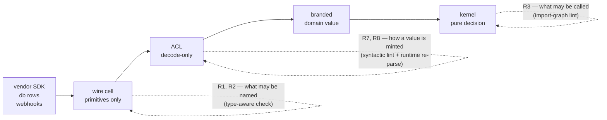

# Foreign-Edge Boundary Law - Plan

## Goal Capsule

**Objective.** Guard the boundary where foreign data becomes domain data: no foreign contract becomes a domain
type by being named, and no domain value exists without something having examined it.

**Product authority.** The requirements are settled. Every claim marked _reproduced_ was executed this session;
evidence is in the gitignored scratch `.context/foreign-edge/` — `model.ts` (12 assertions green), `corrupt.ts`
(type-checks clean while behaving wrongly), 15 probes, and `ledger.md` (26 rows across four adversarial passes,
two still open; two passes by independently dispatched reviewers, two by an external critic).

**Open blockers.** None. Two Outstanding Questions affect sequencing only and are classified below.

## Product Contract

### Summary

Add a second admissibility rule to the cell library — a declaration cell may name only types this workspace
authored — and a third governing how domain values come into existence. Each requirement is assigned to the
enforcement rung that can actually decide it, because the current rule sits on a rung that cannot see the
violation it exists to catch.

### Problem Frame

The import table in `packages/oxlint-plugins/cell-imports/` prices dependencies with one law, from Wlaschin: a
dependency earns special management when it is impure or a strategy. A consumer defeated it by naming rather
than calling — `type ChainEvents = TxFinalized['events']` inside a schema cell, with an `S.declare` guard that
recognizes any array. Every shipped rule passed. An `import type` is not a call, and Wlaschin's frame excludes
library dependencies by construction, so nothing in the law was violated.

Three facts about the current mechanism, read from source this session:

- `cell-import-boundary.ts:107-108` — `cellOf()` derives a cell from the _imported specifier's_ filename and
  returns `null` for any bare package specifier, at which point the rule returns. **Every external import is
  invisible to the rule today**, in the hand-authored phase, before any generator arrives.
- `cell-import-table.config.ts:17-145` — `CELL_IMPORT_TABLE` has no `.schema.ts` or `.acl.ts` key; `CellEdge`
  carries `forbid`, `forbidValue`, `exceptVia`, `forbidRuntime`, and no type-origin arm.
- `cell-import-boundary.ts:49-55` — `hasValueBinding()` already separates type-only from value imports, so the
  channel distinction exists in the AST layer and is unused.

The corrupted pattern reproduces against real vendored `.d.ts` types, type-checks clean, and yields
`amount_due` typed `number | null` holding `"not-a-number"`.

### Key Decisions

- **Three rules, not two channels** _(session-settled: user-directed — chosen over a two-channel factoring and
  over a single ownership law: each of the three rejects a case the other two accept, reproduced)_. Governs
  R1, R3, R7, R8.
- **Declaration-site ownership over specifier origin** — the textual predicate dies to one alias hop. Governs
  R1, R2.
- **Tolerance at runtime, detection at build** — strict decoding on the request path converts a benign vendor
  addition into a failed webhook. Governs R5.
- **Brands need constructors, not just names** — REPO-A4: a type binds only where something forces the
  constructor. Governs R7.
- **AST fingerprint over package origin** — origin is binary, drift is continuous. Governs R6.
- **Short-circuit over accumulation** _(session-settled: user-approved — chosen over accumulating multi-source
  failures: an aggregate mixing contradictory facts is false, not partial)_. Governs R9.

Where each rule acts, and which rung can decide it:

### Requirements

**Admissibility — what a cell may name**

**R1 — Type-origin admissibility is decided by declaration site, transitively.** A declaration cell
(`.schema.ts`, `.acl.ts`, kernel, workflow) must not name a type whose declaration resolves outside the
workspace, including through workspace-local aliases and re-exports. _Rung: type-aware check._

**R2 — The direct case is gated in lint.** The import table gains `.schema.ts` and `.acl.ts` keys and a
type-origin arm, rejecting a declaration cell that imports a bare external specifier as a type. Documentation
of this rule states that it is a strict subset of R1. _Rung: import-graph lint._

**R3 — Adapter and executor cells may name vendor types.** There the type describes a call, which the existing
value-origin law already prices. _Rung: the same table._

**Foreign contracts — restatement and drift**

**R4 — One wire declaration per foreign contract, in primitives, scoped by decision surface.** Contracts whose
fields the domain mostly decides on are restated; a contract carried mostly untouched is not. _Rung: review._

**R5 — Drift is detected out of band, never on the request path.** Decoding tolerates vendor additions;
detection is a pinned sample per contract decoded strictly, plus a value-level golden pinning a recorded
payload to its expected decoded domain value. _Rung: test._

**R6 — Admissible generated types carry a schema-AST fingerprint checked in CI.** The wire declaration's
fingerprint must equal a committed golden derived from the pinned external contract. _Rung: CI check._

**Construction — how a domain value comes to exist**

**R7 — Every branded domain type is constructed through an option-free constructor.** Production cells must not
reach a construction form that skips refinements. _Rung: syntactic lint plus the constructor's signature._

**R8 — Translation cells are decode-only, and the cited exemplar is repaired before it is cited.** An ACL's
`encode` returns `Forbidden`; `.repos/identity-backend/packages/lib/hono-auth/src/play-integrity/play-integrity.acl.ts:38-67`
currently fails open against vendor additions. _Rung: syntactic lint for the contract, R5 for the exemplar's hole._

**Aggregates**

**R9 — Aggregates state only the coherence they can prove.** Identity disagreement short-circuits; partial
availability earns a distinct type; provenance requires distinct sources within a bounded window, carrying a
snapshot token where the source can supply one. _Rung: schema refinement plus type shape._

### Key Flows

**Foreign contract enters** (sequences R3, R4, R8): adapter calls the vendor with the vendor's own types → wire
declaration restates the payload in primitives → ACL decodes into a branded or nominal domain type → the kernel
sees only that type.

**Aggregate over multiple sources** (sequences R9): each source decodes independently carrying the instant it
was observed → a pure function takes already-branded parts → identity disagreement returns a typed failure
naming the sources → success returns a branded aggregate.

**Vendor changes their contract** (sequences R5, R6): the request path keeps serving → the pinned-sample check
fails in CI → a human decides whether the new field is domain-relevant → for generated contracts the
fingerprint mismatch fails the same run.

### Acceptance Examples

Each is executable today against the scratch model and must reproduce inside the packages.

1. A 26-key vendor payload decodes on the request path, dropping unknown keys without failing. _Covers R5._
2. The same payload fails the pinned-sample check, which names the added key. _Covers R5._
3. A vendor that renames nothing but changes a field's meaning fails the value-level golden. _Covers R5._
4. A wire declaration whose AST fingerprint differs from its committed golden fails CI. _Covers R6._
5. An unsettled invoice is rejected by the ACL; an encode attempt returns a `Forbidden` leaf. _Covers R8._
6. Three provenance stamps from one source are rejected; three stamps eight hours apart are rejected. _Covers R9._
7. A negative amount throws at the constructor, and the options bypass is unreachable through its signature.
   _Covers R7._
8. A structurally complete but unbranded aggregate is rejected by `tsc` naming `[BrandTypeId]` alone. _Covers R7._
9. A cast-branded member smuggled into a nominal constructor is rejected at that constructor. _Covers R7._
10. A declaration cell importing a vendor type directly is rejected by lint. _Covers R2._
11. A declaration cell importing the same vendor type through a workspace-local alias is rejected by the
    type-aware check, and documented as not caught by R2. _Covers R1._

### Scope Boundaries

**In scope.** R1 through R9.

**Deferred, named.** Emitter integration. When a declaration becomes the source and the compiler emits cells,
R1 moves from a checker to construction and the lint arm becomes the generator's conformance test. Nothing here
is discarded by that move; no requirement mentions a filename.

**Outside this plan's identity.** Removing authored suffixes. Making the request path strict. Accumulating
multi-source failures instead of short-circuiting.

### Dependencies and Assumptions

- **oxlint carries no type information**, so R1 cannot ship as an oxlint rule; it needs a `tsc`-backed checker
  (the `scripts/guards/` pattern) or emitter-time construction. R2, R7, R8 are syntactic and stay in oxlint.
- **Effect 3.19 semantics, read from `repos/effect` this session.** `.make` validates unless disabled
  (`Schema.ts:3171-3173`, `8897-8903`); `onExcessProperty` defaults to `"ignore"` (`SchemaAST.ts:1883`);
  `ParseResult.Forbidden` is the encode leaf (`ParseResult.ts:198-208`); nominal class constructors re-validate
  their members.
- **Table changes propagate to consumers through the vendored subtree**, so the arm must be additive and must
  not require consumer cells to be re-authored in the same change.

### Outstanding Questions

1. **Deferred to Planning** — does the `tsc`-backed checker land before the emitter work, or does R1 ship as
   emitter-time construction? Cost turns on how long hand-written cells persist.
2. **Deferred to Planning** — what predicate scopes R4's decision surface better than reviewer judgement?
3. **Deferred to Planning** — where does the ownership annotation live once declarations are the source: a
   field in the declaration DSL, or inferred from what the declaration references?
4. **Deferred to Planning** — `S.encodeOption` and `S.encodePromise` were never exercised against a decode-only
   ACL; confirm the `Forbidden` leaf survives both.
