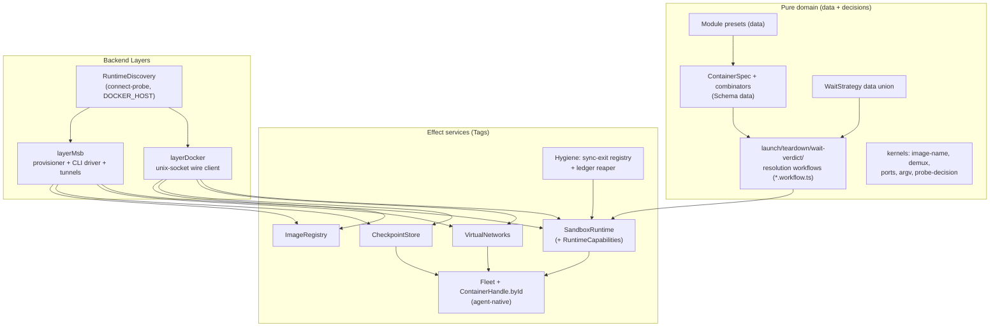
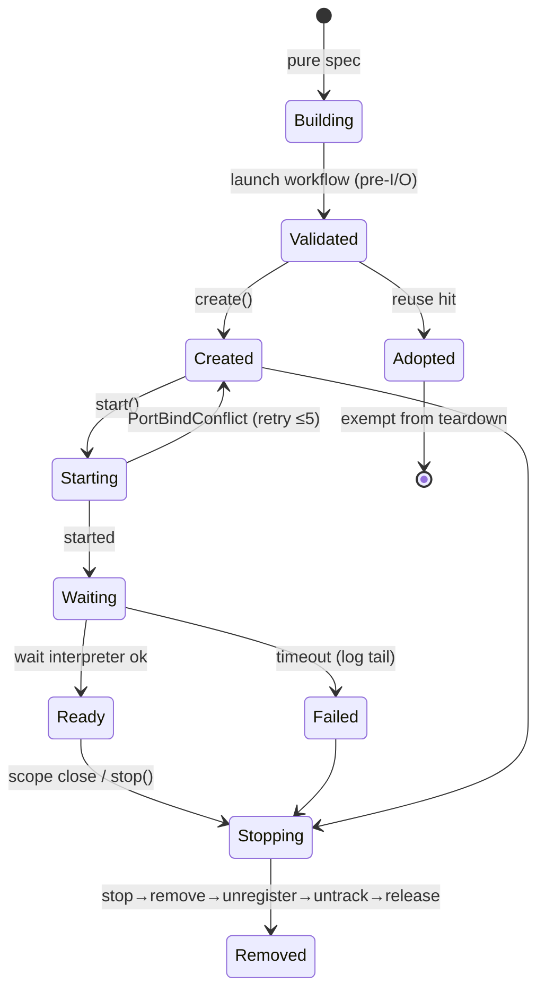

# feat: Port rightsize-node as @systemfsoftware/rightsize

## Goal Capsule

- **Objective:** Build `@systemfsoftware/rightsize` at `packages/rightsize/` — a fully-owned Effect-TS container-testing library whose **public surface matches or exceeds testcontainers' API** and whose consumption model is **agent-native** — then migrate both contract lanes (`packages/stryker-js/cli`, `packages/arethetypeswrong/cli`) onto it and remove testcontainers from the workspace.
- **Authority hierarchy:** (1) user directives this session — full testcontainers parity or better; agent-native; fork-owned complete Effect rebuild; replace testcontainers; upstream's internal structure is _not_ the blueprint; (2) repo doctrine — root `AGENTS.md`, `CONCEPTS.md` cell taxonomy, constitution; (3) upstream rightsize-node as **behavioral reference only** (feature inventory, observable semantics, parity suite as oracle).
- **Stop conditions:** `pnpm check:local` exits 0 after the last edit; both migrated lanes pass in CI (`gh pr checks --watch --fail-fast` exits 0); the parity matrix (R16) has every member present or superseded-with-doc; no `testcontainers` dependency or import remains in any manifest, `pnpm-workspace.yaml`, the lockfile, or source outside `repos/` (prose mentions in the committed parity matrix and the W8 record are sanctioned); no import side effects, no mutable global registries, no synchronous throws on public surfaces in the new package.
- **Execution profile:** derive architecture first (this plan's Planning Contract), then build bottom-up: domain data → runtime contracts/discovery → decision workflows + lifecycle executor + wait interpreter → docker backend + parity lane → agent-native surface → **stryker lane migration (a real consumer lands mid-sequence)** → msb backend → reuse/checkpoints → modules → parity matrix certification → attw migration + workspace removal → docs/record. Characterization: upstream's parity suite is ported early as our oracle, and both lanes keep their existing assertions as behavior pins through the swap.
- **Tail ownership:** after the last unit merges, testcontainers is absent from workspace manifests, both lanes run on `@systemfsoftware/rightsize`, and `pnpm check:local` is green from a clean checkout.

---

## Product Contract

### Summary

A new workspace package `@systemfsoftware/rightsize` provides testcontainers-style integration-test containers with two execution backends (Docker Engine over a unix-socket-only client; microsandbox microVMs via the `msb` CLI with self-provisioning), expressed in SOTA Effect-TS: Schema-typed immutable specs, pre-I/O decision workflows, `Scope`-managed lifecycle with an explicit-release dual surface, Layer-based backend selection, a typed error taxonomy, and an agent-native inspection/execution surface (durable exec-by-id handles, fleet inspection, structured diagnostics, explicit reap). The workspace's two container-backed contract lanes migrate onto it and testcontainers leaves the workspace.

### Problem Frame

The repo's contract lanes (the pack-then-install-into-clean-container verification altitude, 85–92% of gate wall clock per `docs/solutions/performance-issues/turbo-cache-never-warm.md`) depend on `testcontainers@12.1.0` — a shared-kernel Docker SDK with a general-purpose client, import-time global state, and no first-class surface for the lanes' dominant usage mode (one long-lived container owned by a globalSetup, exec'd by id from many workers). The runtime-discovery probe that makes the lanes work on podman is hand-duplicated in one lane and missing in the other. The user directed: fork rightsize-node, rebuild it completely in Effect-TS at full testcontainers parity or better, make it agent-native, and replace testcontainers with it. Upstream's _observable_ design (port pre-allocation, ordered teardown, hardware-isolated microVM option) is worth keeping as behavior; its _internal_ structure (a 20-method god-interface, side-effect-import backend registration, a mutable 1176-line builder class, a class per module, string-only diagnostics) is junior-grade and gets replaced by a derived architecture.

### Key Decisions

- **Full testcontainers API parity or better.** (session-settled: user-directed — chosen over a usage-shaped port covering only our lanes' needs: the user explicitly demanded boiling the ocean with parity or better.) Governs R3, R11, R13, R16.
- **Agent-native is a first-class product property.** (session-settled: user-directed — chosen over a test-library-only ergonomics profile: agents consuming the library programmatically get typed data, durable handles, introspection, and deterministic reaping.) Governs R15.
- **Fork-owned complete rebuild in Effect-TS.** (session-settled: user-directed — chosen over an npm dependency on `rightsize`: a complete SOTA Effect rebuild was demanded, and REPO-O1 makes a forked package owned outright.) Governs R1.
- **Replace testcontainers across the workspace.** (session-settled: user-directed — chosen over keeping testcontainers for existing lanes.) Governs R17.

### Requirements

**Library surface**

- R1. Package `@systemfsoftware/rightsize` at `packages/rightsize/`: ESM, `engines.node >= 22.11`, Apache-2.0 with a `NOTICE` crediting upstream rightsize-node (Apache-2.0) as the behavioral source, first version `0.1.0` (intent versioning — no dev placeholder), released via `.changeset/` intent. Exports partitioned as `.`, `./modules`, `./backend-docker`, `./backend-msb` (each with the `@systemfsoftware/source` dev condition), plus `./package.json`; internal tree sealed from the public surface.
- R2. Schema-typed immutable domain data with JSON codecs for every public payload: `ContainerSpec`, `PortBinding`, `FileMount`, `ExecRequest` (command + `workingDir` + `env`), `ExecResult` (`exitCode`/`stdout`/`stderr`), `WaitStrategy` (closed data union), `NetworkSpec`, `CheckpointRef`, `RuntimeCapabilities`, `DiagnosticsReport`. Spec construction is pure data transformation — no mutable builder object, no I/O at construction.
- R3. Builder surface at testcontainers parity or better: fluent spec combinators covering `withEnv`, `withExposedPorts`, `withCommand`, `withEntrypoint`, `withWorkingDir`, `withCopyFilesToContainer`, `withCopyDirectoriesToContainer`, `withCopyContentToContainer`, `withNetwork`, `withNetworkAliases`, `withReuse`, `withMemoryLimit`, `withStartupTimeout`, `waitingFor` plus the `withWaitStrategy` alias, `withRequireIsolation`, `withDiskLimit`, `withTmpfsRoot`, `withNetworkDisabled`, `withKeepAlive`, and every remaining member the parity matrix (R16) enumerates.
- R4. Typed error taxonomy as `Schema.TaggedError`: all 19 upstream tags preserved 1:1 (enumerated from `src/core/errors.ts` at the fork point — `TmpfsRootCheckpointError` included; renames like `UnsupportedByBackendError` → `UnsupportedCapabilityError` are _not_ permitted) plus additions the parity matrix demands. Errors carry their upstream fields (backend, feature, remedy, port…), are matchable via `Effect.catchTag`/`Error.isType`, and no public or Effect-returning surface throws synchronously. Pre-I/O validation errors (the twelve upstream raises inside `start()` or construction: `RootDiskConflictError`, `TmpfsRootExceedsMemoryError`, `NetworkDisabledConflictError`, `IsolationRequiredError`, `ReuseWithNetworkError`, `ReuseFromCheckpointError`, `IncompatibleImageError`, `RelativeContainerPathError`, `InvalidCheckpointNameError`, …) travel on the Effect error channel as typed results of the launch workflow's validation step; spec combinators are pure data functions and never throw.

**Lifecycle**

- R5. Dual-surface lifecycle: `Scope`/`acquireRelease` is the default surface (interruption-safe, finalizer-ordered); explicit `stop()`/`remove()` stay first-class for glue lifetimes where one process owns the container and workers exec by id — both surfaces are co-equal API, consumers pick whichever fits the lifetime. Teardown order is stop → remove → network-remove (when the container's network was library-created and last-member) → sync-unregister → untrack → release-ports, idempotent from every reached state; `keepAlive` and reuse-adopted containers are exempt from scope teardown; created-network ids join the on-disk ledger and the reaper's kill command carries a network-remove prefix (upstream semantics).
- R6. Crash-safe cleanup at parity with upstream semantics: a synchronous process-exit teardown path using per-backend blocking primitives; an orphan reaper over an on-disk, names-only ledger legible to out-of-process sweeps, with a detached watchdog surviving SIGKILL; `RIGHTSIZE_REAPER` = on/sweep/off.
- R7. Port pre-allocation invariant: host ports are chosen before boot by an in-process free-port allocator; backends bind what they are given and never allocate; bind conflicts classify as `PortBindConflictError` with a bounded retry (5 attempts) that releases and re-allocates between attempts; ports release on every failure path.

**Backends**

- R8. Backend selection and discovery: `Docker.layerDocker`, `Msb.layerMsb`, and an auto layer resolving from `Config` (`RIGHTSIZE_BACKEND` override, else supported-priority msb > docker — upstream's ordering, kept deliberately: hardware isolation is this library's point, docker is the fallback; documented in the README so docker-first users know to pin). Runtime discovery probes by **connecting** (never by statting socket files) across `docker.sock`, `$XDG_RUNTIME_DIR/podman/podman.sock`, `/run/podman/podman.sock`, with an explicit `DOCKER_HOST` authoritative. A forced-but-unreachable backend fails fast with a named error reciting what was probed. No import side effects; no global mutable registry; selection is Layer composition memoized per process.
- R9. Docker backend at upstream behavioral parity: a hand-rolled Docker Engine API client over a **unix socket only** (a dependency bump can never misroute it onto TCP; `DOCKER_HOST` with a `tcp://` scheme is a documented non-goal), covering create/start/stop/rm, exec create+start with stream demux, attach/logs, inspect (incl. health status), networks, and pull with auth; ports published on 127.0.0.1; label-based reaping; `cp`/`save`/`load` shell out to the docker CLI exactly where upstream does; podman-compatible (the primary locally-exercisable runtime for this repo).
- R10. microsandbox backend at upstream behavioral parity: self-provisioning runtime install (pinned `msb` release, SHA-256 verification against the release manifest, atomic binary-last install under the rightsize cache dir, cross-process lock with staleness repair, `MSB_PATH` and `RIGHTSIZE_MSB_SKIP_DOWNLOAD` and `RIGHTSIZE_CACHE_DIR` overrides), five-platform asset tables with `/dev/kvm` and Windows WHP probes, an attached-mode CLI driver (boot, exec with agent-endpoint retry, logs + follow with POSIX and Windows polling behavior, copy, snapshot checkpoint cycle, remove-by-name), and network-alias emulation over exec-stream tunnels with its documented microVM limits. Cross-process exec-by-id against an msb sandbox assumes the worker shares the host with the msb agent endpoint (the single-runner CI contract both lanes already rely on); an unreachable agent endpoint surfaces as a typed error carrying the endpoint it tried.

**Operations**

- R11. Wait strategies as data interpreted by one interruptible interpreter: `forPort` (read-probe, not connect-only), `forHttp` (chainable port/status/method/headers/body predicate), `forLogMessage` (regex + count), `forHealthCheck` (Docker health status; capability-gated), `forShell`/`forCommand`; configurable startup timeout carrying a bounded (50-line) log tail in the timeout error; poll interval 250ms default.
- R12. Runtime operations: copy in/out (start-time mounts + runtime copies with parent-dir creation and `cp -r` destination semantics, stderr-carrying failure), `logs()` bounded snapshot, `followOutput` ordered no-duplicate streaming with a close handle that never flushes; networks with aliases (Docker native bridge; msb tunnel emulation), duplicate-guest-port and alias-charset validation.
- R13. Modules as **data presets**, not classes: all 23 upstream modules (exact image tags, waits, helper surfaces, memory floors, backend restrictions) plus the additions the U12 matrix enumeration identifies in testcontainers' module surface (expected to include mssql, localstack, nginx — the enumerated-and-committed matrix list is the complete closed set for this PR; later modules are follow-up work); every preset routes through the Docker-image-name compatibility gate (`IncompatibleImageError` before any I/O, `asCompatibleSubstituteFor` escape hatch); module-level readiness behaviors (memcached version probe, mongodb rs.initiate + primary election) expressed as wait-strategy data or explicit readiness steps.
- R14. Reuse (double opt-in: `withReuse()` + `RIGHTSIZE_REUSE`, content-hash keyed adopt-from-running) and checkpoints (create/restore, `Checkpoints.find/list/remove`, portable export/import archives) at upstream behavioral parity over the checkpoint capability.

**Agent-native**

- R15. Agent-native surface: `ContainerHandle.byId(id)` — a durable, JSON-threadable handle whose id carries backend name + container id (+ the msb agent endpoint where applicable), validated on reconstruction with a mismatch yielding a typed error, supporting exec/logs/probe from any same-host process, replacing the hand-rolled exec-by-id glue both lanes build today; a Fleet service listing live + ledger containers with port maps and bounded log tails; `DiagnosticsReport` as typed data with a renderer; an explicit opt-in `reap()` (idempotent sweep) alongside the automatic reaper.

**Migration and parity**

- R16. Parity matrix: the public type surface of the installed `testcontainers@12.1.0` (its `.d.ts`, still in the lockfile) is enumerated by a committed script into a matrix in the package; every member is present or superseded with a documented Effect-native replacement; naming aliases where testcontainers and upstream differ (both work); regeneration is drift-gated (`pnpm --filter @systemfsoftware/rightsize parity:check` — re-enumerate, diff, fail on drift; wired into the package `build`).
- R17. Both lanes migrate: global setups start containers through the library (which owns runtime discovery — the arethetypeswrong lane gains the podman probe it lacks today), workers exec via `ContainerHandle.byId`, teardown uses the explicit-release surface; testcontainers is removed from both `package.json`s, the `pnpm-workspace.yaml` catalog, and the lockfile; no `testcontainers` dependency or import remains in any manifest, catalog, lockfile, or source file outside `repos/` (prose mentions in the parity matrix and the W8 record are sanctioned).
- R18. Test posture per repo doctrine: authored property tests + mutation scoping for pure cells only (spec combinators, wait verdicts, image-name parsing, frame demux, port allocation, backend resolution, argv builders); workflow orchestration and error-classification decisions covered by unit tests over a recording test double of the runtime service (scripted results, call counting — no real backend in unit tests); a Docker-backend parity lane (script `test:contract`, pinned to `layerDocker`, cache:false, failing with a named error when no runtime answers) ported from upstream's contract suite and extended (exec options, concurrent exec, health-check wait, network create/connect/remove lifecycle) plus differential reference behaviors captured against installed testcontainers before it leaves the workspace (same operations driven through both libraries, observable equivalence asserted — the behavioral half of parity the type matrix cannot certify); msb logic covered by unit tests with its runtime lane behind an explicit `RIGHTSIZE_MSB_IT` gate that skips (not fails) where no KVM exists.

### Key Flows

- F1. Launch: pure spec → resolution Layer → launch workflow validates (conflicts, capabilities, image compatibility) _before I/O_ → [reuse adopt branch] → network ensure → port pre-allocation → create → start → (bind-conflict retry) → links → wait-until-ready → handle bound to scope finalizer.
- F2. Teardown: scope close (or explicit stop) → stop → remove → network-remove (library-created networks) → sync-unregister → untrack → release-ports; interruption mid-launch cleans partial state idempotently; process exit takes the sync path; SIGKILL falls to the ledger sweep.
- F3. Exec: `ExecRequest` (command, workingDir, env) → backend exec → `ExecResult` data; exit code is a verdict, never an exception; "ran and exited non-zero" is distinguishable from "never ran" (the exit-127-with-empty-stdout missing-WorkingDir trap).
- F4. Wait: strategy data + interpreter polls (interruptibly) until ready/timeout-with-tail.
- F5. Migration: globalSetup owns container (explicit release), injects the durable handle id via vitest `provide`/`inject`, workers exec concurrently by id, teardown on success/failure/SIGINT.

### Success Criteria

- Both migrated lanes' behavior is unchanged (same assertions, same images, same digest pinning; a cached-green remains impossible — lanes stay `cache:false`).
- The docker parity lane passes against podman on this host and against Docker in CI.
- An agent can, from typed data alone: construct a spec, start it under a scope, exec by id from another context, read a structured diagnostics report, and reap orphans — without reading any renderer output or global state.

### Scope Boundaries

**Deferred for later** (named follow-ups, not this PR):

- `rightsize` CLI bin (inspect/reap over the Fleet service) — gated on the lane migrations proving the API shape; requirement noted, not built here.
- msb CI lane on a KVM-enabled runner — no such runner exists in this repo's CI today; msb runtime behavior is pinned by ported upstream suite logic and unit coverage until one appears.
- VitePress docs site, runnable examples directory, Bun runtime support — upstream collateral, not API.

**Outside this product's identity:**

- Contributing back upstream (forbidden by REPO-O1 — the fork is owned outright).
- Cross-language parity (Kotlin/Rust suites upstream references).
- testcontainers inside `repos/` (vendored, read-only, REPO-S3).
- Windows as a locally-verified target (platform tables and WHP logic ported and unit-tested; no Windows CI here).

---

## Planning Contract

### Key Technical Decisions

- KTD1. **Upstream is the behavioral spec, not the blueprint.** The port keeps upstream's four real invariants as _behavioral_ requirements — port pre-allocation (R7), ordered teardown (R5), unix-socket-only client (R9), names-only cross-process ledger (R6) — and replaces its structure wholesale: the 20-method god-interface, import-side-effect backend registration (`registerBackend` at module scope in upstream's backend subpaths), the mutable builder class, class-per-module, string-only diagnostics, and polling-only waits all die. Rejected alternative: transliterate upstream's file map (cheaper, but imports junior seams into an owned package and fights the repo's sandwich doctrine).
- KTD2. **Capability-decomposed runtime services.** One small core Tag `SandboxRuntime` plus satellite Tags only where a second real implementation exists. The complete assignment of upstream's 20-method `SandboxBackend` surface (the ground-truth enumeration, `src/core/backend.ts` at the fork point): `SandboxRuntime` gets create, start, stop, remove, exec, logs, followLogs, copyToContainer, copyFromContainer, inspect, removeByName, findRunning; `VirtualNetworks` gets ensureNetwork, removeNetwork, installNetworkLinks; `CheckpointStore` gets createCheckpoint, removeCheckpoint, hasCheckpoint, exportCheckpoint, importCheckpoint; `ImageRegistry` gets pull/inspect/import image. Upstream's `close()` is not a Tag method at all — backend teardown is the backend Layer's release; `cleanupSync()` and `reaperKillCommand()` belong to the Hygiene module (sync-exit registry + ledger reaper), which holds the blocking per-backend primitives. Capability gaps surface as typed errors raised by the launch workflow _before I/O_ (constraint lands with the instrument that forces it, per REPO-A4), not as runtime-flag checks with defensive throws scattered through backends. Rejected alternatives: upstream's single 20-method interface (every consumer provides/aggregates everything) and a 15-Tag decomposition (ceremony — most operations travel together in every real backend).
- KTD3. **Data-first domain.** Specs, waits, and modules are Schema data with pure combinators; fluent testcontainers-style method sugar sits atop immutable data — a chained surface where every `with*` returns a new immutable value (copy-on-write over `ContainerSpec`), never a mutable builder and never free-functions-only (the chained shape is testcontainers parity; free-function combinators remain the underlying mechanism). Validation that upstream performs by throwing in constructors or in `start()` pre-I/O guards moves into the launch workflow's typed validation step — decisions authored through the repo's architecture boundary, `Workflow.make` (brand-checked constructor, purity- and exhaustiveness-linted at the make body, mutation-selected at the boundary; no gate keys on file names, so `*.kernel.ts`/`*.workflow.ts` in this plan are naming conventions only). Combinators are pure data functions and never throw (R4). Rejected alternative: port the class hierarchy (locks validation to construction time and forces synchronous throws on surfaces that must not throw — R4).
- KTD4. **Layer-based backend selection with connect-probe discovery.** `layerDocker`/`layerMsb`/auto; `Config` for `RIGHTSIZE_*`; the probe-by-connecting module (docker.sock → XDG podman → /run/podman, `DOCKER_HOST` authoritative) is library-owned and replaces the duplicated lane probes. No side-effect imports; memoization is Layer composition. Grounded in `docs/solutions/test-failures/contract-lane-stops-at-dead-docker-socket.md`.
- KTD5. **Dual-surface lifecycle, co-equal.** The `Scope`/`acquireRelease` surface handles in-scope lifetimes; the explicit `stop()`/`remove()` surface handles cross-process glue lifetimes (globalSetup owns, workers exec by id — F5). Both ship first-class; consumers pick whichever fits the lifetime, matching upstream's documented preference ordering. Sync-exit registry and ledger reaper keep upstream's cross-process contracts.
- KTD6. **Failures as values, strictly.** Every upstream throw-site maps to a typed channel result; nothing on a public or Effect-returning surface throws synchronously. Errors are `Schema.TaggedError` with all 19 upstream tags preserved 1:1 so agent error handling can match on tags; pre-I/O validation travels on the Effect error channel from the launch workflow's validation step (R4). Exec results stay data (a non-zero exit is a verdict).
- KTD7. **Exec-by-id handles and the Fleet service are first-class** — the dominant agent usage mode observed in both lanes (`packages/*/cli/__tests__/*adapter*.ts` hand-roll it over `getContainerRuntimeClient` today); making it library API deletes that glue and is the core of the agent-native mandate.
- KTD8. **Wire declarations for Docker Engine API payloads.** Schemas for the vendor wire format are marked wire declarations (the workspace restates members it does not own); the demux/framing logic is a pure decision (property-tested) under the socket adapter.
- KTD9. **Parity measured, not remembered.** The matrix enumerates the installed `testcontainers@12.1.0` type surface; behavior is pinned by the ported upstream contract suite, the lanes' existing assertions, and a differential reference set captured against installed testcontainers before it leaves the workspace (R18). No testcontainers behavioral claim enters the plan from memory.
- KTD10. **Exports stay partitioned; the surface is a carrier.** Parity breadth lives behind the four subpaths with a sealed internal tree (upstream's partitioning retained deliberately): every consumer's tooling pays the export count at every writing act, so one mega-barrel is rejected even though parity tempts it. Large single-concept files are acceptable under the namespace convention; do not impose a small-file rule against it.
- KTD11. **Modules are data presets + helper accessors over one interpreter.** One mechanism, twenty-some rows, no subclass explosion; the parity matrix fixes the exact row list. Upstream's four module-overridable hooks map onto data: `customizeSpec` (post-port-allocation spec transform, e.g. Floci's advertised port) becomes a preset field; `containerIsStarting` (pre-I/O capability reject) becomes the capability check in the launch workflow; `containerIsStarted` (post-readiness setup, e.g. mongodb rs.initiate) becomes declared readiness steps; `currentBackend` (backend introspection) is answered by the handle's recorded backend (R15). Rejected alternative: port upstream's 23 subclasses (locks customization into class inheritance).

### High-Level Technical Design

Component graph — the derived architecture (upstream file names appear only as behavior references):

Lifecycle states (teardown reachable from every state, idempotent):

### Assumptions

Headless-mode inferences (no synchronous user to confirm; recorded here for review to overturn):

- Upstream's observable semantics are the spec wherever this plan does not explicitly replace them; its parity suite is the oracle for backend behavior.
- The msb backend cannot run on this host (no `/dev/kvm`, verified); whether this repo's CI runners expose `/dev/kvm` is probed at U7 rather than assumed — regardless of the answer, the parity lane pins `layerDocker` so CI backend choice is deterministic. msb runtime correctness rests on unit-tested pure parts (argv, provisioning decisions, platform tables) plus ported suite logic behind the `RIGHTSIZE_MSB_IT` gate until a KVM runner exists.
- `DOCKER_HOST` with `tcp://` stays unsupported (inherited upstream safety property; documented in README and error text) — podman/docker local sockets cover this repo.
- The exact module list beyond upstream's 23 is fixed at implementation time by the parity matrix enumeration, not by memory; the enumerated-and-committed list is the closed set for this PR.
- `RIGHTSIZE_*` environment names are preserved verbatim for drop-in familiarity, but are read through Effect `Config` (testable layers) rather than `process.env` reads scattered in source.
- `engines.node` is set at U1 to the higher of upstream's `22.11` floor and whatever the workspace's `effect` catalog entry declares — verified against the installed manifest, not assumed.
- testcontainers' `getContainerRuntimeClient` (internal-ish) has no parity obligation — the by-id handle surface supersedes it; the lanes' observable behavior, not their glue, is what migrates.
- All units land as ONE pull request (this pipeline's shape): changeset intents are written with the units that touch publishable packages (U1 for the new package, U13/U14 for the lanes) and finalized in U15, so the changeset-check gate is green when the PR opens — no intermediate-push granularity exists.

### Implementation Constraints

- `pnpm --filter <pkg> <cmd>` from root only; never `npx`, never `cd` into packages.
- No agent starts a mutation run (REPO-D3); mutation scoping lives in the package's `stryker.config.json`.
- Changeset intent required for every publishable-package touch (REPO-R2); `api!` breaking markers are fine (pre-1.0 alpha, REPO-R1).
- The parity lane and migrated lanes never skip silently on a missing runtime — they fail with a named error (existing lane contract).
- New lint rules, if any, register via the package's `oxlint.config.ts` extending `@systemfsoftware/oxlint-config/base` — `pnpm check:lint-coverage` gates this.

### Sequencing

Bottom-up: scaffold → domain data → runtime contracts/discovery → decision workflows + lifecycle executor + wait interpreter → docker backend + parity lane → agent-native surface → **stryker lane migration (a real consumer lands mid-sequence, before the breadth units)** → msb backend → reuse/checkpoints → modules → parity matrix certification → attw migration + workspace removal → docs/record. The parity lane lands before the agent surface so every later unit has an executable oracle; the stryker migration lands before msb/modules so the first real consumer exercises the API while reshaping is still cheap; workspace-wide removal waits for the matrix to certify the surface.

### System-Wide Impact

- **CI shape:** the package's parity-lane script is named `test:contract` (turbo tasks are script-name-keyed; `test:parity` would silently never run), so the existing `gate:tasks test:contract` picks the lane up with zero root-pipeline changes; the lane pins `layerDocker` so CI backend choice is deterministic. `check:local` stays container-free — it does not run `test:contract`.
- **Gate wall-clock:** the two migrated lanes are 85–92% of gate wall clock (`docs/solutions/performance-issues/turbo-cache-never-warm.md`); the swap must not regress start/teardown time. The library's one-process container lifetime and pre-allocated ports are the mechanism that keeps it neutral; parity-lane timings are compared against pre-migration lane timings in review.
- **Manifest/lockfile churn:** the catalog loses `testcontainers` (plus its transitive tree); three package manifests change; the lockfile regenerates exactly when manifests change — once at U13 (stryker devDeps swap) and once at U14 (attw swap + catalog removal), never piecemeal between other units.
- **Downstream consumers:** none today beyond the two lanes (pre-1.0 alpha repo); the public surface is new, so no migration debt outside this PR.

### Risks & Dependencies

- **Docker Engine API drift / podman divergence** — mitigated by a narrow endpoint set (what upstream's client uses, already podman-proven) and wire schemas that fail decode loudly; the parity lane runs against podman locally and Docker in CI, so divergence surfaces at the lane.
- **Pinned `msb` 0.6.9 evolving** — mitigated by the pinned-release + checksum provisioning contract (upstream's mechanism, kept); msb is not exercised on this host or CI, so the risk is bounded to API-shape drift caught by argv property tests.
- **msb correctness blind spot (no KVM anywhere in this repo's CI)** — accepted and documented: msb logic is unit-proven, runtime behavior pinned by ported suite cases behind a gate; a KVM runner is the named follow-up that closes it. A green docker lane is not msb evidence.
- **Effect v4 RC churn (`^4.0.0-rc.108`)** — the whole workspace rides the same RC; the package adds no version constraint beyond the catalog, so churn is a workspace-level event, not this package's.
- **Lane regression at migration** — mitigated by characterize-in-place: existing lane assertions are untouched; only setup/adapter glue swaps. A red lane after U13/U14 is a library bug, not a test change.
- **Scope blowout** — parity-or-better is open-ended by user directive; the parity matrix (U12) is the fixed enumeration that bounds "complete," and its drift gate keeps the bound honest.

---

## Implementation Units

### Unit Index

| U-ID | Title                                                  | Key files                                                                            | Depends    |
| ---- | ------------------------------------------------------ | ------------------------------------------------------------------------------------ | ---------- |
| U1   | Package scaffold + governance wiring                   | `packages/rightsize/*` (manifest, configs, leaf)                                     | —          |
| U2   | Domain schemas + error taxonomy                        | `packages/rightsize/src/*.schema.ts`, `errors.ts`                                    | U1         |
| U3   | Runtime contracts, discovery, selection                | `src/runtime/*`, `src/runtime/discovery/*`                                           | U2         |
| U4   | Decision workflows + lifecycle executor + hygiene      | `src/*.workflow.ts`, `src/lifecycle/*`                                               | U3         |
| U5   | Wait interpreter                                       | `src/wait/*`                                                                         | U3         |
| U6   | Docker wire client + backend layers                    | `src/backend-docker/*`                                                               | U3         |
| U7   | Docker parity lane                                     | `packages/rightsize/test/parity/*`                                                   | U4, U5, U6 |
| U8   | Agent-native surface (by-id, fleet, diagnostics, reap) | `src/fleet/*`                                                                        | U4, U6     |
| U9   | microsandbox backend                                   | `src/backend-msb/*`                                                                  | U3         |
| U10  | Reuse + checkpoints                                    | `src/reuse/*`, `src/checkpoint/*`                                                    | U4, U6, U9 |
| U11  | Modules as data presets                                | `src/modules/*`                                                                      | U5, U6     |
| U12  | Parity matrix + alias gap-fills                        | `packages/rightsize/docs/parity-matrix.md`, `src/index.ts`                           | U7–U11     |
| U13  | stryker-js/cli lane migration (lands mid-sequence)     | `packages/stryker-js/cli/__tests__/*`                                                | U7, U8     |
| U14  | arethetypeswrong/cli migration + workspace removal     | `packages/arethetypeswrong/cli/__tests__/*`, `pnpm-workspace.yaml`                   | U8, U12    |
| U15  | W8 record, README/parity docs, changesets              | `docs/solutions/tooling-decisions/*`, `packages/rightsize/README.md`, `.changeset/*` | U13, U14   |

### U1. Package scaffold + governance wiring

- **Goal:** A building, linting, type-checking, api-extractor'd empty package that satisfies every repo gate from the first commit.
- **Requirements:** R1.
- **Dependencies:** none.
- **Files:** `packages/rightsize/package.json`, `tsdown.config.ts`, `oxlint.config.ts`, `vitest.config.ts` (+ `src/schema-laws.test.ts` law entry), `tsconfig.json`, `tsconfig.build.json`, per-entry `api-extractor*.json` configs, `tstyche.json`, `AGENTS.md` (leaf), `LICENSE`, `NOTICE`, `README.md` (stub pointing at the plan's authority), `src/index.ts` (empty barrel), `.gitignore` hygiene per siblings.
- **Approach:**
  1. Mirror `packages/effect-memfs/package.json` shape: name/version 0.1.0/Apache-2.0, exports map with four subpaths each carrying `@systemfsoftware/source`/types/default conditions, scripts (`build`, `clean`, `typecheck`, `test`, `test:types`, `lint`, `attw`, `api:check`, `api:update`), devDeps from catalog + workspace — including `@systemfsoftware/effect-cell-types` as a regular dependency (the `Workflow.make` boundary lives there), `@systemfsoftware/effect-schema-vite` (schema-law plugin), `@systemfsoftware/arethetypeswrong-cli` via `catalog:attw`, and `tstyche` — peerDeps `effect`.
  2. tsdown config from the effect-memfs template (esm, dts, `.mjs`/`.d.ts` extensions, four entries: index, modules, backend-docker, backend-msb); `internal/*` sealed from exports.
  3. oxlint extends `@systemfsoftware/oxlint-config/base` (satisfies `pnpm check:lint-coverage`); vitest config wires the `inlineSchemaTests()` plugin from `@systemfsoftware/effect-schema-vite` explicitly (the shared `@systemfsoftware/vitest-config` base registers no plugins and sets `passWithNoTests` — laws do NOT appear unless wired).
  4. api-extractor is single-entry per config: per-entry configs run concurrently (the `packages/stryker-plugins` precedent — `api-extractor.json` + named alternates), matching the four tsdown entries.
  5. `NOTICE` credits upstream rightsize-node at the pinned fork SHA as behavioral source (Apache-2.0).
  6. Leaf `AGENTS.md`: commands, parity-lane run conditions (`test:contract` name, `layerDocker` pin, `RIGHTSIZE_MSB_IT` gate), mutation posture (REPO-D3 pointer), `Workflow.make`-boundary expectations.
- **Patterns to follow:** `packages/effect-memfs` (library exemplar, itself a forked-owned package); `packages/effect-daemon-spec/vitest.config.ts` (`inlineSchemaTests` wiring); `packages/stryker-plugins` (multi api-extractor configs); `packages/effect-cell-types` (tstyche + `test:types` wiring).
- **Test scenarios:** Test expectation: none — scaffolding; gates are the verification.
- **Verification:** `pnpm --filter @systemfsoftware/rightsize build && lint && typecheck && test && test:types && attw` all exit 0; `pnpm check:lint-coverage` and `pnpm check:exports` pass with the package present; the wired law entry exists and is nonempty.

### U2. Domain schemas + error taxonomy

- **Goal:** The entire public data vocabulary as Schema types with codecs, laws, and the full error-tag union — no behavior, no I/O.
- **Requirements:** R2, R4.
- **Dependencies:** U1.
- **Files:** `packages/rightsize/src/model/*.schema.ts` (spec, ports, mounts, exec request/result, wait union, network, checkpoint, capabilities, diagnostics), `packages/rightsize/src/model/errors.ts`, property tests under `packages/rightsize/src/model/__tests__/` (colocated per repo convention), barrel exports in `src/index.ts`.
- **Approach:**
  1. Author each payload as `Schema.Class`/`Schema.Struct` with the upstream field set plus parity additions (`ExecRequest.workingDir/env`, `entrypoint` on spec).
  2. Error taxonomy: **all 19** upstream tags as `Schema.TaggedError` with their fields, enumerated from upstream's `src/core/errors.ts` at the fork point (`TmpfsRootCheckpointError` included — the count is 19, not 18); codec round-trip joins the generated schema laws via the `inlineSchemaTests()` plugin wired in U1.
  3. Rejection properties for every refinement (closed wait union, port ranges, alias charset) — generators derived from the domain contract, not the refinement literal.
  4. Pure combinator functions over `ContainerSpec` (immutable updates); the fluent chained surface is a thin copy-on-write wrapper wired in U12.
- **Patterns to follow:** `packages/arethetypeswrong/core/src/*.schema.ts`; law generation per `packages/effect-schema-vite` (plugin) over `packages/effect-schema-law` (combinators).
- **Test scenarios:** round-trip identity and encode stability (generated laws — assert the generated suite is nonempty); rejection properties (empty command, negative port, duplicate alias, invalid checkpoint name); combinator last-write-wins env dedup preserving insertion order; spec JSON codec survives a handle-serialization round trip; the tag set matches upstream's errors module exactly (fail on any missing or extra tag).
- **Verification:** package `test` green incl. generated laws (nonempty check included); `pnpm --filter @systemfsoftware/rightsize typecheck` clean.

### U3. Runtime contracts, discovery, selection

- **Goal:** The service Tags (`SandboxRuntime`, `VirtualNetworks`, `CheckpointStore`, `ImageRegistry`), `RuntimeCapabilities` data, the connect-probe discovery module, `layerDocker`/`layerMsb`/auto selection, FreePorts and RunId.
- **Requirements:** R7 (allocator), R8.
- **Dependencies:** U2.
- **Files:** `packages/rightsize/src/runtime/runtime.ts` (Tags + capability data), `src/runtime/discovery/probe.kernel.ts` (pure: candidate list → decision), `src/runtime/discovery/discovery.adapter.ts` (socket connect), `src/runtime/selection.workflow.ts` (config + probe results → selected backend | named failure), `src/runtime/free-ports.kernel.ts`, `src/runtime/run-id.ts`, `src/runtime/config.ts` (Config wrappers for `RIGHTSIZE_*`), tests colocated.
- **Approach:**
  1. Define the four Tags with `Context.Service`-style house shape; `SandboxRuntime` surface deliberately small (create/start/stop/remove/exec/logs/copy/inspect); capabilities as declared data consumed by workflows (not runtime flag checks).
  2. Discovery: pure kernel orders candidates (explicit `DOCKER_HOST` first, then the three socket paths); adapter connects; `layerAuto` memoizes resolution once per process via Layer composition.
  3. Selection workflow: forced-but-unreachable → typed error reciting the probe list (both lanes' error contract, now library-owned).
  4. FreePorts kernel: allocate/release with conflict-retry support; RunId per process.
- **Patterns to follow:** `repos/effect/packages/ai/anthropic/src/AnthropicClient.ts` (Context.Service + Layer factory house pattern); discovery probe per `docs/solutions/test-failures/contract-lane-stops-at-dead-docker-socket.md`.
- **Test scenarios:** probe decision prefers live socket over stale file (kernel: connect-success is the only liveness signal); `DOCKER_HOST` authoritative; forced backend unreachable → named error listing probes; auto picks highest-priority supported; FreePorts never returns the same port twice before release; release-then-reallocate succeeds.
- **Verification:** unit/property tests green; discovery adapter exercised against the local podman socket in the parity lane (U7).

### U4. Decision workflows + lifecycle executor + hygiene

- **Goal:** The impure/pure sandwich core: launch validation as pre-I/O workflows, the executor composing gather→decide→act→wait→handle, ordered idempotent teardown, sync-exit registry, ledger reaper.
- **Requirements:** R5, R6, R7, R12 (facade-level runtime operations: `logs()` bounded snapshot, `followOutput` ordered no-duplicate streaming with the never-flushing close handle, runtime copy in/out semantics over the `SandboxRuntime` capability).
- **Dependencies:** U3.
- **Files:** `packages/rightsize/src/lifecycle/launch.workflow.ts` (validate: conflicts, capability gates, image compatibility), `src/lifecycle/teardown.workflow.ts`, `src/lifecycle/port-conflict.workflow.ts` (classify → retry/release), `src/lifecycle/launch.executor.ts`, `src/lifecycle/hygiene/*.ts` (sync-exit registry, ledger incl. network ids, watchdog), `src/generic-container.ts` (public facade: builder sugar + start/stop/handle/logs/follow/copy), tests.
- **Approach:**
  1. Workflows via `Workflow.make` (tagged Command/Decision/Error, `Match` exhaustive); validation happens before any effectful call — `IsolationRequiredError`, `IncompatibleImageError`, conflict rejections (`RootDiskConflictError`, `TmpfsRootExceedsMemoryError`, `NetworkDisabledConflictError`, …) all fire here.
  2. Executor: `Effect.acquireRelease`-shaped launch; handle bound to scope finalizer; explicit `stop()`/`remove()` share the same teardown executor (dual surface, one implementation).
  3. Teardown order fixed by workflow: stop → remove → network-remove (library-created networks) → sync-unregister → untrack → release; every step idempotent; interruption during launch runs the same partial-state cleanup.
  4. Hygiene: names-only on-disk ledger (cross-process legible; records network ids alongside container names), detached watchdog sweep whose kill command carries the network-remove prefix, sync-exit registration using per-backend blocking primitives; `RIGHTSIZE_REAPER` modes via Config.
- **Patterns to follow:** `packages/effect-daemon-spec/src/internal/restart-decision.workflow.ts` (workflow shape); executor/adapter split per `packages/effect-memfs`.
- **Test scenarios:** validation rejections fire with zero backend calls (assert via a recording test double of the runtime service); tmpfs+disk-limit conflict rejected; bind-conflict retry releases ports between attempts and gives up at 5 with `ContainerLaunchError`; interruption mid-start leaves no tracked container (scope finalizer proof); teardown twice is a no-op; teardown removes the library-created network; keepAlive/reuse-adopted exempt from scope teardown; ledger entry (container + network) removed on clean teardown; sweep is idempotent against a racing sweep.
- **Verification:** unit tests (recording-double based) + a scope/interruption integration test in the parity lane; the mutation population selector (workflow-make-boundary ignorer) covers the decisions.

### U5. Wait interpreter

- **Goal:** One interruptible interpreter over the wait-strategy data union.
- **Requirements:** R11.
- **Dependencies:** U3.
- **Files:** `packages/rightsize/src/wait/interpreter.ts`, `src/wait/verdict.kernel.ts`, `src/wait/strategies.ts` (constructors for the union members), tests.
- **Approach:**
  1. Verdict kernel: pure (probe result, elapsed, strategy) → Continue | Ready | Timeout(tail) — property-tested.
  2. Interpreter: `Effect.iterate`/Schedule-based polling, 250ms default interval, interruptible at every poll; timeout error carries the bounded 50-line tail gathered from the logs capability.
  3. `forHealthCheck` reads inspect health status through the runtime capability (docker-only; workflow rejects pre-I/O when capabilities lack it).
- **Patterns to follow:** retry/schedule idioms per Effect core; kernel/workflow split as in U4.
- **Test scenarios:** forPort becomes Ready on first read-probe success; forHttp matches status and body predicate, chainable port override; forLogMessage counts matches and handles pre-attach log snapshot; timeout error includes exactly the bounded tail; interpreter is interruptible between polls (test-clock); negative/zero startup timeout rejected at spec-build time as a typed result.
- **Verification:** property tests green; docker-backed wait behaviors asserted in the parity lane (U7).

### U6. Docker wire client + backend layers

- **Goal:** The hand-rolled unix-socket Docker Engine API client and the four backend Layers over it.
- **Requirements:** R9, R12 (docker adapters for copy in/out, logs/follow, network aliases + duplicate-guest-port/alias-charset validation).
- **Dependencies:** U3.
- **Files:** `packages/rightsize/src/backend-docker/wire/*.schema.ts` (marked wire declarations for Engine API payloads), `src/backend-docker/client/*.ts` (socket transport, request envelope), `src/backend-docker/frames.kernel.ts` (stream demux), `src/backend-docker/runtime.adapter.ts`, `networks.adapter.ts`, `checkpoint.adapter.ts`, `images.adapter.ts`, `cli.shellout.ts` (cp/save/load), `src/backend-docker/index.ts` (`layerDocker`), tests.
- **Approach:**
  1. Wire schemas as marked wire declarations (vendor payloads restated in owned members).
  2. Transport: `node:http` over `socketPath` — unix socket only; a `tcp://` `DOCKER_HOST` fails with the documented non-goal error.
  3. Frames kernel: pure demux of the docker stream multiplexing — property-tested against generated frame sequences.
  4. Adapters implement the four Tags; ports published on 127.0.0.1; reaper labels applied at create; health status surfaced via inspect; `docker cp/save/load` shell out exactly where upstream does (podman CLI-compatible).
  5. `layerDocker` composes discovery + client + the four Layers.
- **Patterns to follow:** adapter shape per `packages/effect-memfs/src/memory-file-system.adapter.ts`; wire-declaration doctrine per `CONCEPTS.md`.
- **Test scenarios:** frames kernel demuxes interleaved stdout/stderr chunks without loss or reordering (property); socket path resolution honors `DOCKER_HOST` unix forms; exec demux maps to `ExecResult` with separated streams; create request carries reaper labels; pull-with-auth path returns typed `BackendError` on registry failure; `tcp://` `DOCKER_HOST` rejected with the non-goal error; copy preserves `cp -r` destination semantics (directory-contents, not nested) and creates destination parents; copy failure carries the tool's stderr; follow-logs ordering/no-duplicates under interleaved chunks; alias-charset and duplicate-guest-port validation rejected pre-I/O.
- **Verification:** unit tests green; end-to-end behaviors exercised by U7's lane (this unit does not run containers itself beyond a socket reachability check).

### U7. Docker parity lane

- **Goal:** The executable oracle: upstream's contract suite ported and extended, running real containers through the docker backend against podman/docker.
- **Requirements:** R18, and behavioral pinning for R5–R9, R11–R13.
- **Dependencies:** U4, U5, U6.
- **Files:** `packages/rightsize/test/parity/*.test.ts` (lifecycle, ports, env, exec, logs+follow, copies, mounts, tmpfs/disk-limit, checkpoints, diagnostics, remove-by-name, network create/connect/remove; extensions: exec options, concurrent exec, health-check wait), `packages/rightsize/test/parity/differential/*.test.ts` (reference behaviors asserted against BOTH the new library and installed testcontainers while it is still present — same operations, observable equivalence), `packages/rightsize/vitest.parity.config.ts` (no caching; constructs `layerDocker` directly so backend choice is deterministic in every environment), `packages/rightsize/vitest.msb.config.ts` (`RIGHTSIZE_MSB_IT`-gated msb-conditional cases — skip, not fail, without the gate), `packages/rightsize/package.json` (script named **`test:contract`** — turbo tasks are script-name-keyed, `test:parity` would never run — with `test:parity` kept as a local alias and `test:contract:msb` for the gated lane).
- **Approach:**
  1. Port the behaviors of upstream `test/it/contract.test.ts` (alpine + python images only) onto our API; assert the same observable outcomes.
  2. Add the extensions the upstream suite cannot cover (it lacks the features); the by-id handle case lives in U8 (its owning unit), not here.
  3. Differential reference set: drive identical operations (exec + ports + wait + copy + lifecycle ordering) through both libraries and assert observable equivalence — this is the behavioral half of "parity or better" (R16's type matrix is the other half) and it can only be built while testcontainers is still installed.
  4. Lane fails with the library's named unreachable-runtime error; never skips (the msb config is the one deliberate skip-gated lane).
- **Patterns to follow:** `packages/stryker-js/cli/vitest.contract.config.ts` (lane separation, timeouts sized to slowest case, coverage off); turbo `test:contract` inputs.
- **Test scenarios:** every ported upstream contract case + extensions + network lifecycle + differential reference cases; the lane itself red-when-runtime-missing (verify by unsetting `DOCKER_HOST` in a scratch run); probe `/dev/kvm` on the CI runner once and record the observation in the leaf `AGENTS.md`.
- **Verification:** `pnpm --filter @systemfsoftware/rightsize test:contract` green against local podman and picked up by CI via the existing `gate:tasks test:contract`; `test:contract:msb` skips cleanly without the gate.

### U8. Agent-native surface (by-id, fleet, diagnostics, reap)

- **Goal:** The agent mandate made API: durable handles, fleet introspection, structured diagnostics, explicit reap.
- **Requirements:** R15.
- **Dependencies:** U4, U6.
- **Files:** `packages/rightsize/src/fleet/handle.ts` (`ContainerHandle.byId`, JSON-threadable id + backend fingerprint), `src/fleet/fleet.ts` (list live+ledger, port map, bounded tail probe), `src/fleet/diagnostics.ts` (typed report + renderer), `src/fleet/reap.ts`, tests.
  1. Handle id encodes backend name + container id (+ the msb agent endpoint where applicable), recorded in the on-disk ledger at create; `byId` validates the fingerprint on reconstruction (mismatch → typed error, never silent exec) and reconstructs exec/logs/probe capabilities from the id alone (what both lanes hand-roll today, now first-class).
  2. Fleet derives over the live registry + ledger + backend inspect — no new backend methods.
  3. `DiagnosticsReport` is Schema data (R2) with a pure renderer; `reap()` is an idempotent sweep alias over the hygiene module.
- **Patterns to follow:** Layer/test discipline per `docs/solutions/runtime-errors/layered-liveclock-cannot-use-testclock-withlive.md` (live services in tests).
- **Test scenarios:** handle id round-trips through JSON and `byId` execs in a foreign context (parity lane); fleet lists live and ledger containers with correct port maps; diagnostics report decodes (schema law) and renders losslessly; reap is idempotent and leaves foreign (non-rightsize-labeled) containers untouched.
- **Verification:** unit tests + parity-lane integration; the migration units (U13/U14) consume this surface verbatim.

### U9. microsandbox backend

- **Goal:** Full msb backend: provisioner, platform tables, CLI driver, tunnel networking, snapshot checkpoints.
- **Requirements:** R10.
- **Dependencies:** U3.
- **Files:** `packages/rightsize/src/backend-msb/provisioner/*.ts` (download/verify/atomic-install/lock — decisions as kernels), `src/backend-msb/platform.ts` (5-platform asset tables, kvm/WHP probes), `src/backend-msb/commands/*.kernel.ts` (pure argv builders), `src/backend-msb/runtime.adapter.ts`, `networks.tunnel.ts` (exec-stream tunnels), `checkpoint.adapter.ts`, `images.adapter.ts`, `src/backend-msb/index.ts` (`layerMsb`), tests.
- **Approach:**
  1. Provisioning decisions (verify-then-install ordering, lock staleness, skip-download) are pure kernels; only the download/extract/renames are effects.
  2. Argv builders pure and property-tested against upstream's recorded invocations.
  3. No KVM on this host: runtime behavior is pinned by unit tests + the ported suite's msb-conditional cases behind the `RIGHTSIZE_MSB_IT` gate (U7's `vitest.msb.config.ts` — skip, not fail, without it), mirroring upstream's own `RIGHTSIZE_IT` discipline.
- **Patterns to follow:** kernel/adapter split as elsewhere; upstream files cited as behavior references in doc comments.
- **Test scenarios:** provisioning rejects a checksum mismatch (fixture manifest); install-crash repair (binary-last invariant); lock staleness recovery; argv builders match upstream invocation grammar (property vs recorded vectors); platform table picks correct assets per platform string; capability data rejects isolation-demanding specs on docker and allows on msb (workflow-level, no I/O).
- **Verification:** unit tests green; `layerMsb` composes; msb runtime lane stays gated off without KVM (documented in leaf AGENTS.md).

### U10. Reuse + checkpoints

- **Goal:** Generic reuse adoption and the Checkpoints API over the checkpoint capability.
- **Requirements:** R14.
- **Dependencies:** U4, U6, U9.
- **Files:** `packages/rightsize/src/reuse/*.ts` (content hash, double opt-in, adopt via find-running), `src/checkpoint/*.ts` (create/restore/find/list/remove/export/import), tests.
- **Approach:** reuse hash over the reuse-relevant spec slice; adoption never re-derives specs from backend inspection (upstream contract); checkpoints validate archive manifests against the active backend before import; docker commit vs msb snapshot differences live in `CheckpointStore` adapters.
- **Test scenarios:** reuse without env opt-in refuses; adopt returns the spec verbatim; `ReuseWithNetworkError` fires; checkpoint round-trip restore boots a ready container (docker parity lane); export/import archive survives backend-mismatch rejection; `CheckpointBackendMismatchError` pre-I/O.
- **Verification:** unit tests + parity-lane (docker) coverage; msb snapshot logic unit-covered.

### U11. Modules as data presets

- **Goal:** The full module catalog as data — upstream's 23 plus parity additions.
- **Requirements:** R13.
- **Dependencies:** U5, U6.
- **Files:** `packages/rightsize/src/modules/index.ts` (registry + accessor helpers), `src/modules/presets/*.ts` (data tables), `src/modules/readiness.ts` (memcached/mongodb behaviors as wait data/explicit steps), tests; exported via the `./modules` subpath.
- **Approach:**
  1. One preset schema: image, env, ports, wait strategy data, memory floor, backend restrictions, helper derivations (uri/connectionString builders as pure functions of the started container).
  2. Every preset routes through the image-compatibility workflow (pre-I/O `IncompatibleImageError`).
  3. Parity additions (mssql, localstack, nginx, + matrix-named others) authored as presets in the same pass.
- **Test scenarios:** preset table invariants (every declared port has a wait; memory floors on the heavyweight JVM images); helper builders produce correct URIs from a fake port map (property); image-compat mismatch rejected pre-I/O; two presets (redis + postgres) smoke-start in the parity lane.
- **Verification:** unit tests + lane smoke; `./modules` subpath exports match the api-extractor rollup.

### U12. Parity matrix + alias gap-fills

- **Goal:** The committed testcontainers-parity matrix, and the surface work it exposes.
- **Requirements:** R3, R16.
- **Dependencies:** U7, U8, U9, U10, U11.
- **Files:** `packages/rightsize/docs/parity-matrix.md` (enumerated from installed `testcontainers@12.1.0` types: every member → present | superseded-by with link), `packages/rightsize/scripts/parity-enumerate.mjs` (committed generator: enumerate the installed `.d.ts` exports → regenerate the matrix), `packages/rightsize/src/index.ts` + fluent facade, tests for the alias surface.
- **Approach:**
  1. The committed `scripts/parity-enumerate.mjs` regenerates the matrix from the installed `.d.ts`; `pnpm --filter @systemfsoftware/rightsize parity:check` re-runs it and fails on any byte drift — wired into the package `build` so the gate cannot be forgotten.
  2. Close every gap the matrix finds (additions land in the owning unit's files; this unit wires public aliases and the facade). The fluent facade is an immutable chained surface — every `with*` returns a new value (copy-on-write over `ContainerSpec`, KTD3); aliases (`withWaitStrategy`, `getHost`, `getMappedPort`, entrypoint support) resolve to the same canonical members.
  3. Every "superseded" row documents the Effect-native replacement and why it is better, never silently absent.
- **Test scenarios:** `parity:check` fails when the committed matrix drifts from regeneration (red-proof with a doctored row); each alias resolves to the canonical member (type tests via tstyche); facade methods produce specs identical to the combinator functions (property).
- **Verification:** `parity:check` exits 0 and runs inside `build`; matrix committed; `attw` clean on the widened surface.

### U13. stryker-js/cli lane migration (lands mid-sequence)

- **Goal:** The stryker contract lane runs on `@systemfsoftware/rightsize`.
- **Requirements:** R17.
- **Dependencies:** U7, U8 (the lane needs the parity-proven docker backend and the by-id handle — not the breadth units; facade aliases it uses land here incrementally from U12's design).
- **Files:** `packages/stryker-js/cli/__tests__/global-setup.ts`, `packages/stryker-js/cli/__tests__/stryker-cli.adapter.ts`, `packages/stryker-js/cli/package.json` (devDeps swap), unchanged: `cli-contract.integration.test.ts`, `stryker-cli-env.ts`, fixtures, `vitest.contract.config.ts`.
- **Approach:**
  1. global-setup: build the node image spec (digest-pinned as today) with copy/workdir/command combinators, start under the library's explicit-release surface, exec the npm install reading `ExecResult`, provide the handle id via vitest `provide`.
  2. Adapter: `ContainerHandle.byId` Layer replacing `getContainerRuntimeClient` glue; exec with `{workingDir, env}` maps 1:1.
  3. Delete the hand-rolled podman probe (library owns discovery); lane error contract preserved (named unreachable-runtime error).
- **Test scenarios:** the lane's existing assertions pass unchanged (behavior pin); probe asymmetry: lane works with only podman reachable (it did before via its own probe; now via the library's); teardown on suite failure leaves no container (ledger check).
- **Verification:** `pnpm --filter @systemfsoftware/stryker-js-cli test:contract` green locally (podman) and in CI.

### U14. arethetypeswrong/cli migration + workspace removal

- **Goal:** The attw lane migrates (gaining the podman probe it lacks) and testcontainers leaves the workspace.
- **Requirements:** R17.
- **Dependencies:** U8, U12.
- **Files:** `packages/arethetypeswrong/cli/__tests__/global-setup.ts`, `packages/arethetypeswrong/cli/__tests__/container.ts`, `packages/arethetypeswrong/cli/package.json`, `pnpm-workspace.yaml` (catalog entry removal), lockfile via install.
- **Approach:**
  1. Same migration shape as U13 (container.ts's `Container` service becomes a thin Layer over `ContainerHandle.byId`; `sh` helper maps to exec).
  2. Remove `testcontainers` from the catalog; the workspace scan then holds: no dependency or import in manifests, catalog, lockfile, or source outside `repos/` (prose in the parity matrix and W8 record sanctioned); the packed-tarball/typescript-in-image behaviors are untouched.
- **Test scenarios:** lane's feature assertions pass unchanged; stub-registry readiness polling and `cat /tmp/stub.log` diagnostics still work through exec results; exit-code assertions still distinguish verdict exits from the 127 trap.
- **Verification:** `pnpm --filter @systemfsoftware/arethetypeswrong-cli test:contract` green; `pnpm install` lockfile no longer carries testcontainers for workspace packages; the scoped workspace scan is clean.

### U15. W8 record, README/parity docs, changesets

- **Goal:** The costly-to-reverse decision is recorded (REPO-W8) and the package documents itself.
- **Requirements:** R1, R16; repo REPO-W8/REPO-R2.
- **Dependencies:** U13, U14.
- **Files:** `docs/solutions/tooling-decisions/rightsize-own-effect-port.md` (candidates: keep testcontainers / depend on `rightsize` npm / fork-and-rebuild; deciding criterion; reversing observation — cherry-pick from upstream by path if it ships a must-have), `packages/rightsize/README.md` (quickstart, parity matrix link, agent-native guide, `RIGHTSIZE_*` config table, tcp non-goal), `.changeset/*.md`, `CONCEPTS.md` (new terms if the plan's vocabulary stuck: e.g. backend parity lane distinction from the contract-lane concept).
- **Approach:** one commit for the record + docs; changeset intents were written with their owning units (U1 new package; U13/U14 lanes) and are finalized here to describe the landed surface — the single-PR shape (Assumptions) keeps the changeset-check gate green when the PR opens.
- **Test scenarios:** Test expectation: none — documentation; the W8 record names the alternatives it beat (review check).
- **Verification:** `pnpm check:local` green; changeset-check satisfied for all three touched packages.

---

## Verification Contract

- Unit/property/typecheck per package: `pnpm --filter @systemfsoftware/rightsize test && test:types && typecheck && lint && build && attw` (and the same for both migrated lane packages' `test`).
- Backend parity lane (docker/podman): `pnpm --filter @systemfsoftware/rightsize test:contract` (the script name the turbo task keys on; `test:parity` alias) — cache-free, `layerDocker`-pinned, named-failure on unreachable runtime; runs in CI under `gate:tasks test:contract`. The `RIGHTSIZE_MSB_IT`-gated msb lane skips without the gate.
- Differential reference behaviors (U7) run inside the parity lane while testcontainers is still installed; they are removed with the dependency in U14.
- Migrated lanes: `pnpm --filter @systemfsoftware/stryker-js-cli test:contract` and `pnpm --filter @systemfsoftware/arethetypeswrong-cli test:contract`.
- Full gate after the last edit: `pnpm check:local` exits 0 (REPO-D1).
- PR watched to green: `gh pr checks --watch --fail-fast` exits 0 (REPO-D2).
- Mutation: the workflow-make-boundary population selector scopes the decisions; runs only via the Mutation workflow's merged report — no agent starts one (REPO-D3).
- Parity matrix drift gate: `pnpm --filter @systemfsoftware/rightsize parity:check` exits 0 and is wired into `build` (U12).

**Global:**

- Every requirement R1–R18 implemented and exercised; the parity matrix complete and drift-gated (present or superseded-with-doc for every enumerated member; differential behaviors captured).
- testcontainers absent from `packages/*/package.json`, `pnpm-workspace.yaml`, and the lockfile's workspace edges; no dependency or import remains in any workspace file outside `repos/` (prose in the parity matrix and W8 record sanctioned).
- The new package carries: sealed internal exports, changeset intents for all three touched packages, NOTICE, W8 record, README with parity + agent-native docs.
- No dead-end code from abandoned approaches survives in the diff (upstream-transliteration remnants, unused aliases, commented-out probe logic); the tree is restartable.

**Per-unit:** each unit's Verification field observed green before the next unit begins, with lane-visible units (U7, U13, U14) exercised against the real podman runtime, not mocks.

---

## Sources & Research

- Upstream rightsize-node, cloned read-only at fork point `f3e91bac02ad9824f1687fd860b9b9071da6b128` (v0.7.1): `src/index.ts`, `src/core/{backend,model,errors,wait,backends,generic-container,diagnostics}.ts`, `src/backend-docker/**`, `src/backend-msb/**`, `src/modules/**`, `test/it/contract.test.ts`, `.github/workflows/ci.yml`, `docs/guide/*` — surveyed this session as the behavioral spec.
- Workspace usage surface: `packages/stryker-js/cli/__tests__/{global-setup,stryker-cli.adapter,stryker-cli-env}.ts`, `packages/arethetypeswrong/cli/__tests__/{global-setup,container,stub-registry}.ts`, both `vitest.contract.config.ts`.
- Repo conventions: `packages/effect-memfs/*` (scaffold exemplar), `pnpm-workspace.yaml` (catalog: effect ^4.0.0-rc.108, typescript ^7, vitest ^4.1.10), `turbo.json` (script-driven tasks), root `package.json` gate chains.
- Learnings: `docs/solutions/test-failures/contract-lane-stops-at-dead-docker-socket.md`, `docs/solutions/logic-errors/attw-cli-entrypoints-flags-dropped-and-empty-array-override.md`, `docs/solutions/performance-issues/turbo-cache-never-warm.md`, `docs/solutions/tooling-decisions/arethetypeswrong-core-requires-js-typescript-api.md`, `docs/solutions/tooling-decisions/effect-atom-v4-port-migration`.
- House Effect patterns: `repos/effect/packages/ai/anthropic/src/AnthropicClient.ts` (Context.Service + Layer), `repos/effect/packages/effect/src/unstable/ai/EmbeddingModel.ts` (Schema.Class + service).
- Parity ground truth: installed `testcontainers@12.1.0` type declarations (enumerated at U12; never from memory).
- Settled corpus answers on Effect library API-surface convention and failures-as-values were consulted before authoring (queries recorded in the session transcript; corpus does not ship with the clone).
