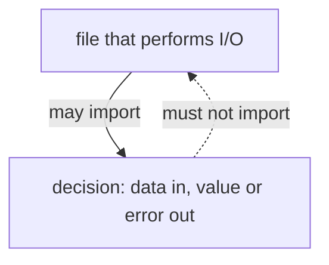
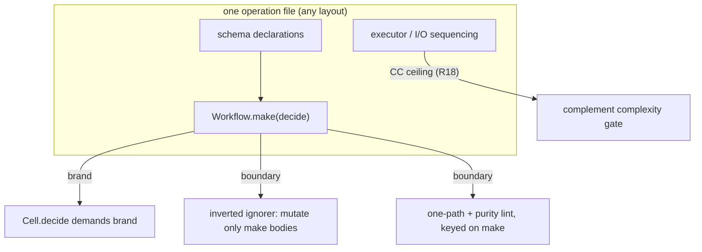

# Delete the Cell Taxonomy - Plan

## Goal Capsule

- Objective: delete the thirteen-role cell taxonomy and every rule that keys on a cell-role filename suffix, and leave the impure/pure/impure sandwich and the inward import graph as the only remaining structure.
- Product authority: this plan owns the taxonomy's deletion, the sandwich as the operation shape, the import-direction constraint, and the mutation gate's scope. It does not own the Effect 4 migration or any change to `.repos/identity-backend`.
- Verification precondition: `pnpm check:local` is red on stale untracked `dist/` chunks under `packages/effect-atom/atom/dist/` that still reference the removed `Schema.All` and import `@effect/experimental` / `@effect/platform`. Current `src/` uses `Schema.Constraint` / `Schema.Top` and builds clean. Fix is `clean` + rebuild (U1), not a source migration.
- Stop conditions: `pnpm check:local` exits 0 after the last edit; every deletion carries its R13 record; the make-body scope rule is either proven sound or the file-grain fallback is taken and recorded.

**Product Contract preservation**: restructured, no scope change — R9 rewritten from file-list grain to make-boundary grain under the carrier fork resolved this session (KTD1); the Goal Capsule blockers were corrected from "Schema.All migration" to "stale untracked dist/" on scout evidence. All other R-IDs unchanged.

---

## Product Contract

### Summary

Delete the cell taxonomy. What remains is Seemann and Wlaschin's sandwich — read, then a pure filling, then write — and Lange's dependency rule: I/O may call a decision, a decision may not call I/O. Mutation covers the filling at 100, selected by the `Workflow.make` boundary that the brand forces every running decision through — not a filename, not a glob.

### Problem Frame

The taxonomy sorts files by pipeline stage — gather in `acl` and `adapter`, decide in `kernel` and `workflow`, act in `executor` and `handler` — and enforces that sorting with 100 rules and 6 shared helpers across 21 plugins. Parnas at `canon` band: begin with the design decisions likely to change and hide one per module; decomposing by processing step is almost always incorrect. Ousterhout: a "one thing per unit" rule produces shallow, entangled interfaces. The owner decree of 2026-08-15 on `cell-atlas` already withdrew any fixed cell set; this repo kept shipping one.

The fan-out shows the predicted damage. Interior rules fail at the first indirection. The `store` role ships 5 rules against 0 files here, while the only six real `.store.ts` files live in a consumer that installs none of them. Across 44 recorded solutions under `docs/solutions/`, 24 defects were found by running something and 4 by the type checker; none was found by a lint rule. Thirty rules were deleted earlier on this branch at zero cost, each violation re-attempted and refused by the compiler first.

`.repos/identity-backend` adopted seven of the thirteen names, declares no `@systemfsoftware/*` dependency, configures no plugin, and carries zero `kernel` files against ten `workflow` files. It dropped the taxonomy and kept working.

What the extraction does earn is verification. Mutation testing is the one instrument here with measured yield, and its break threshold only binds where 100% is reachable. Moving one decision out of a module cut that module's mutant population from 47 to 24 with the score held at 100.

### Key Decisions

- The sandwich and the import graph replace the taxonomy. Not two named classes. (session-settled: user-directed — chosen over collapsing thirteen roles into two named classes, and over `pure`/`shell` names that sit on this repo's junk-drawer ban list.) Governs R1, R3, R4, R5, R6, R8.
- Suffix-keyed enforcement ends, and the suffixes go with it. A name has no constructor, so the author who writes the violation picks the label the rule reads. The path-suffix retrieval key is forfeited: the gate that would read it is documented in another repository and is absent here, so the key currently keys nothing. (session-settled: user-directed — chosen over keeping the fleet, measured at 0 of 44 recorded defects, and over retaining the thirteen names as a retrieval vocabulary.) Governs R2, R12, R13, R14.
- The break threshold stays at 100. A ratchet would make the label unfalsifiable again. (session-settled: user-directed — chosen over a score-must-not-decrease ratchet.) Governs R10.
- The carrier carries the whole core regime, not only the mutation run. Deleting the suffix routing without re-keying its gates lets a gated file grow a guard, breed equivalent mutants, and make 100 unreachable — the narrowed-gate failure this plan exists to kill. Governs R15.
- 100 means killed-or-disposed, never killed-only. Equivalent mutants exist and their detection is undecidable, so a killed-only 100 is not verifiably attainable; the honest perfect score removes the residue by named mechanical rule. Suppression comments stay banned. Governs R10, R16.
- The forcing function is a consumer's signature, never a label. Verified: `Workflow.make` does not brand — with both channels inhabited, `Workflow<C,D,E>` collapses to the structural `(command: C) => Result<D, E>` (`packages/effect-cell-types/src/Workflow.ts:69-78`), so any bare function passes where a workflow is demanded. A nominal brand only `make` applies, demanded by the plumbing that runs decisions, closes it: a decision that reaches production must pass through `make`, and `make` is what the gates key on. The complement's complexity ceiling is the creation-forcer. (session-settled: user-directed — "add the necessary typeids/branding": chosen over structural-only typing, which measured as forcing nothing.) Governs R17, R18.
- No replacement carrier is introduced. Four candidates failed. Governs R7.
  - A `./pure` entrypoint rested on a contaminated census. Owned packages carrying more than one subpath number 9 of 47, not the 124 of 196 first measured, which swept vendored trees.
  - A path prefix reproduces the carrier defect, since the author still picks the path.
  - `R = never` is a category error. `packages/effect-daemon-spec/src/internal/restart-decision.kernel.ts` exports plain total functions that are not Effects, so no requirements channel applies to them.
  - Parsing `etc/*.api.md` scrapes a rendered report for semantics that rendering discarded.
- A remaining rule reads an import edge, or a constraint no type can express. Interior filename rules do not survive. Governs R11.

### Requirements

**Deletion**

- R1. The thirteen-role cell taxonomy is gone. There is no sanctioned cell list, no cell class, and no replacement taxonomy of any cardinality.
- R2. Every rule that keys on a cell-role filename suffix is deleted, including the rule that requires membership in the sanctioned-suffix list. The sanctioned-suffix config is deleted. No config enumerates a sanctioned suffix set.

**Sandwich**

- R3. Every outside interaction is one sandwich: read (impure), then decode, decide, and shape (pure), then write (impure). I/O is not interleaved into the filling.
- R4. A later read that depends on an earlier decision is pre-fetched, split into a second sandwich, or kept openly in the file that performs the I/O. It is never placed inside the filling.
- R5. The file that performs I/O sequences the sandwich and does not branch on domain state. The decision maps already-typed data to a Decision or Error by exhaustive dispatch over a closed type.

**Import direction**

- R6. A file that performs I/O may import a decision. A decision may not import a file that performs I/O. Pure and impure files may sit in the same folder.
- R7. No `core/`, `shell/`, `pure/`, or `io/` path segment is introduced.
- R8. A decision takes already-fetched data and returns a value or typed error. It declares no runtime dependency port. A port exists only for impurity — non-determinism — or a second real implementation, and lives with the I/O that consumes it.

**Mutation**

- R9. The mutation population is the `Workflow.make` argument bodies — selected mechanically by an inverted Stryker ignorer that ignores every mutant outside a `make` boundary, so membership is forced by the R17 brand rather than chosen by the author — plus, in packages whose product is declarations or rules rather than sandwiches, the existing explicit mutate sets. No glob or suffix selects by cell role anywhere.
- R10. The mutation break threshold for that population is 100, meaning killed-or-disposed: every mutant is killed by a test or excised by a named mechanical ignorer. A population that cannot reach it fails the gate rather than lowering it, and a suppression comment is never the instrument.
- R15. A `make` argument body carries the core regime: exhaustive dispatch over a closed type with one path; control-flow keywords banned, with at most one defensive guard as the first statement, converging immediately and carrying a producer-side property test proving it unreachable; no reference that resolves to I/O. The gates enforcing this key on the `make` boundary, so one boundary carries both obligations.
- R16. Dispositions are mechanical and reviewable. The `effect-schema-ignorer` class — named reason strings for `_tag` discriminants, declaration field schemas, brand descriptions, doc-only annotations — is the only disposition channel; behavior-bearing annotations (`arbitrary`, `message`, `jsonSchema`, `pretty`, `equivalence`, `parseIssueTitle`) stay mutable. Mutation runs record every killer (`disableBail: true`) so the test-contribution rule can judge each property file.
- R17. `Workflow<C,D,E>` is nominal: a unique-symbol brand that only `Workflow.make` applies, with the existing channel-inhabitedness markers kept. Every shell surface that runs a decision — `Cell.decide` and its kin — demands the brand, so an unwrapped decision is refused by the compiler at the call site that would have run it.
- R18. The complement carries a per-function cyclomatic-complexity ceiling. Gated decisions are CC=1 (R15); code outside `make` bodies gets a low fixed ceiling that plumbing branching fits and domain branching does not, so accumulated shell decisions trip the lint and extraction into a gated decision is the only green exit. This reads branching, not size — Ousterhout's line-count objection does not apply, and it survives R11 as a constraint no type expresses.

**Surviving rules and names**

- R11. A remaining rule reads an import edge, or a constraint no type can express. A rule that reads a cell-role filename, or an interior property keyed from such a filename, does not survive.
- R12. No filename carries a cell role. Existing suffixed filenames grant nothing; this plan does not require renaming them.
- R13. Each deleted rule carries a re-attempted violation and names the channel that refuses it — the compiler, a constructor, or an import edge. A deleted rule whose class no channel refuses is recorded as unowned rather than reported as covered.
- R14. `CONCEPTS.md`'s Cell entry no longer claims a suffix grants a file its powers. The recorded precedence of Drifted key over Cell remains.

### Key Flows

One outside interaction:

1. The I/O file reads everything the decision will need.
2. Decode turns raw input into branded domain types, or fails as data.
3. Decide maps those types to a Decision or Error, exhaustively, with no I/O.
4. Shape builds the outputs and events from that result.
5. The I/O file writes — persist, emit, respond.

A later read that depends on step 3 does not return to step 1 inside the same filling. It is pre-fetched before step 2, or it becomes a second sandwich, or it stays visible in the I/O file.

### Acceptance Examples

- When a handler would read a user, decide eligibility, then read the user's orders: the orders are pre-fetched with the user, or the work is two sandwiches, or the second read stays in the handler. The eligibility function does not perform the second read.
- When a decision file imports a module that talks to the network or the clock: the import is refused.
- When a decision file and a handler sit in the same folder: that is legal.
- When a new file is named `foo.kernel.ts`: nothing grants or denies it powers by that name, and no diagnostic fires for the suffix.
- When a decision is omitted from the mutation population: under make-grain this requires omitting `Workflow.make` itself, which the R17 brand makes a type error at the plumbing that would run it. When a file that performs I/O gains a `make` body: the 100% gate prices it rather than the threshold moving.
- When a `make` body grows a second path — an `if` guard past the first statement, a ternary, a catch-all arm over a closed union: the one-path gate fails at lint time, before the mutation run prices the guard as an unkillable survivor.
- When a mutant lands in a `_tag` discriminant or a declaration field schema: the ignorer excises it with its named reason, the score stays killed-or-disposed 100, and a mutant in a `message` or `arbitrary` annotation stays live because those alter behavior.
- When a deleted interior rule's violation is re-attempted: the compiler, a constructor, or an import edge refuses it, or the deletion is recorded as unowned.

### Success Criteria

- The rule count under `packages/oxlint-plugins/*/src/rules/` drops from 100, and every deletion satisfies R13.
- `packages/oxlint-plugins/cell-taxonomy/` is gone, and no config enumerates a sanctioned suffix set.
- A file renamed off its former suffix produces no new diagnostic.
- An unwrapped decision handed to `Cell.decide` is a compile error; a `Workflow.make` value is not.
- Each touched package's existing test count is unchanged.
- No package's mutation verdict is worse than before its population was re-keyed.
- `pnpm check:local` exits 0, run after the last edit.

### Scope Boundaries

Deferred for later:

- Adopting `ttsc` or `@ttsc/lint`. Lint hosted inside the type-check is structurally stronger than a per-file linter — measured at 73 ms across 6,093 files where ESLint spends 66.7 s — but replacing 21 oxlint plugins is a reversal-cost decision that earns its own pass.
- An obligation gate that requires each declared entry to state the decision it hides. Nine packages carry more than one subpath.
- A compelled-retrieval gate that loads doctrine before a write. No such gate exists here. One forces presence, not conformance, so it cannot carry what R2 deletes.
- Renaming the 81 `.kernel.ts`, 26 `.executor.ts`, and 3 `.workflow.ts` files. The names become inert under R12; renaming is separate churn.

Outside this plan:

- `dependency-cruiser` and any other tool that derives its own module graph. The compiler already resolved one.
- Building the cell compiler. `scripts/tools/term.ts` and `scripts/tools/term-compile.ts` stay unused: `typia` shows the TypeScript type is already the declaration.
- Any size or line-count rule. Ousterhout at `canon` band names line-count limits as a cause of shallow interfaces.
- Changes to `.repos/identity-backend`. Its adopted names are evidence, not a migration target.

### Dependencies and Assumptions

- Assumption, replaced by a mechanism: 100 on the filling is reachable by construction, not by hope. One path leaves no branch for an equivalent mutant to hide in; a property per arm over a closed domain kills every behavioral mutant; the declaration residue is excised by named ignorer; the contribution rule audits the killers. Each leg is in the tree today — the one-path gate, `effect-schema-ignorer`, `test-contribution.ts` — and R15/R16 keep them attached to the boundary.
- Assumption: code performing I/O cannot reach a killed-or-disposed 100. Standard practice and the reason the decision logic was extracted, but not measured in this repo — the 47-to-24 result shows extraction cut the population with the score held, a cleaner surface rather than a proof of the ceiling. The binary shell-exclude is sound only where the shell is actually drained of decisions, which is R5's discipline and is achieved, never default.
- Assumption: purity is judged per function, not by folder or filename. This plan does not claim a static analyzer can decide purity of unannotated TypeScript; `axis-mechanizability-verdict` remains undefeated. The make-body reference rule is the enforceable half.
- Dependency: `.claude/hooks/guard-local-mutation.ts` blocks agent-started mutation runs, so any claim about a mutation verdict comes from the Mutation workflow's merged report, which is advisory — a score below 100 is a human's call on that report.

### Outstanding Questions

Deferred to implementation:

- The exact CC ceiling value for R18 (provisional 7): fit the complement with zero waivers, raising only if an existing function exceeds it; never above 10.
- Whether `no-manual-tag-member`'s and `no-schema-law-duplicate`'s gates are cell-role-keyed or test-kind-keyed: read the gate strings during U5, before the fleet deletions land, and kill only the former.
- Stryker runtime cost of widened `mutate` arrays under the composite ignorer: measured from the CI Mutation workflow's merged report; if a package's run time explodes, narrow its `mutate` to exact paths holding `make` bodies or Schema trees — the ignorer keeps the semantics identical.

### Sources and Research

- `docs/solutions/` — 44 recorded solutions; the defect-attribution counts behind Problem Frame.
- `packages/oxlint-plugins/*/src/rules/` — 100 rules and 6 shared helpers across 21 plugins; per-rule classification from the session scout enumeration (suffix-keyed / edge / interior / helper, each with file:line of its gate).
- `packages/oxlint-plugins/effect-workflow/src/rules/workflow-match-exhaustive.ts:37-39` — the one-path gate, today `filename.endsWith('.workflow.ts')`.
- `packages/effect-cell-types/src/Cell.ts:46-48,252-259` — `DecidePhase
` and `Cell.decide`, the consumer signature the R17 brand will demand.
- `packages/effect-cell-types/src/Workflow.ts:69-78` — `make` verified non-branding; the R17 gap.
- Production `Workflow.make` sites (the entire brand blast radius): `packages/effect-daemon-spec/src/internal/restart-decision.workflow.ts:29`, `packages/stryker-js/cli/src/survivors.workflow.ts:42`, `omp/plugins/omp-claude-compat/src/hook-verdict.workflow.ts:37`; lambda consumers to migrate: `packages/stryker-js/cli/src/stryker-cli.executor.ts:264`, `omp/plugins/omp-claude-compat/src/internal/run-user-prompt-submit-hooks.executor.ts:84`.
- `packages/stryker-js/mutation-run/src/config/base-preset.ts:9-28` — inherited thresholds `{high:100, low:80, break:100}` and ignorers `['effect-schema-declarations']`; per-package stryker.config.json census from the session scout.
- `packages/stryker-plugins/src/effect-schema-ignorer/schema-declaration-ignore.kernel.ts` — the named dispositions, the behavior-bearing annotations deliberately left mutable, and the measured record of the `Schema.Class`-fields rule that hid fourteen real survivors and was removed.
- `packages/effect-atom/atom/dist/` (untracked) — stale hashed `.d.ts` chunks carrying `Schema.All` and `@effect/experimental` imports against `effect@4.0.0-rc.108`; fresh output already uses `Schema.Constraint` per `repos/effect/packages/effect/src/Schema.ts:741,783`. Root `check:local`: dprint check → `gate:tasks` (lint, lint:tsgo, typecheck, test, test:types, attw, api:check) → `gate:dist` (build, check:project-references, check:exports, check:runtime-deps).
- Corpus pages, declared bands: `deep-modules-information-hiding` (`canon`), `cell-atlas` (`convention`; owner decree 2026-08-15), `fcis-import-direction` (`convention`), `invariant-interval-sandwich` (`axiom`), `io-sandwich-one-operation` (`convention`), `pure-core-no-dependency` (`convention`), `dependency-rejection` (`canon`), `anti-cells-ruled-out` (`convention`), `naming-segment-gate` (`convention`), `names-are-not-type-safety` (`canon`), `suffix-taxonomy-reach` (`derived`), `enforceability-is-not-an-axis` (`posit`), `unit-assumption-collapse` (`posit`), `axis-mechanizability-verdict` (`posit`), `doctrine-overreach` (`posit`), `carriers-that-survive-packaging` (`derived`), `compelled-retrieval-gate-limits` (`posit`), `killed-or-disposed-mutation` (`convention`; B5), `two-regimes-core-shell` (`posit`; B4), `prove-core-shell-composition` (`posit`), `single-path-decision` (`posit`), `mutation-score-scope` (`posit`), `mutation-scoping-externally-supported` (`derived`).

---

## Planning Contract

### Key Technical Decisions

- KTD1. The population carrier is `Workflow.make`-boundary expression grain, resolved as the pipeline default from the fork presented this session (expression grain recommended, file grain the fallback). In sandwich packages (`effect-daemon-spec`, `stryker-js/cli`, `omp-claude-compat`) an inverted ignorer ignores every mutant outside a `make` body, and the `mutate` array widens to all non-test source. In packages whose product is declarations or rules (`hex-schema`, `effect-schema`, the `oxlint-plugins/*` fleet, `stryker-js/mutation-run`) the existing explicit mutate sets stand unchanged — a blanket inversion would silently drop coverage of schema literals and rule bodies, which R16's own calibration keeps mutable. If the make-body scope rule (KTD3) cannot be made sound, fall back to file grain: re-key every gate to an enumerated exact-path list per package. Governs R9, R15.
- KTD2. The brand is a type-level phantom applied through the existing assertion-signature pattern: `Workflow<C,D,E>` gains a `WorkflowTypeId` conjunct, `make` remains the only constructor, and `DecidePhase
` demands the brand so `Cell.decide` refuses bare lambdas. The two existing lambda call sites become `make`-wrapped adapters. No runtime property is attached — `assertWorkflow` already narrows without touching the value. (session-settled: user-directed — chosen over structural-only typing, which measured as forcing nothing.) Governs R17.
- KTD3. The make-body scope rule holds that references inside a `Workflow.make` argument resolve only to parameters, local bindings, and imports that are not I/O; control-flow keywords are banned inside the body with the one-guard allowance R15 states. It is the fork's one unproven leg: spike it before the fleet deletion lands, and take the KTD1 fallback if the spike fails. Governs R15.
- KTD4. R2's blast is the thirteen sanctioned cell-role suffixes the deleted sanctioned-suffix config actually enumerated — `acl`, `adapter`, `executor`, `handler`, `kernel`, `middleware`, `observer`, `policy`, `schema`, `shape`, `state`, `store`, `workflow` (`schema` is in; `entrypoint` never was — the entrypoint plugin's own AGENTS.md EP1 forbids adding it, and its rules gate on the `main.ts` basename, an exempt entry convention, not a cell suffix). Test-kind suffixes (`.test.ts`, `.property.test.ts`, `.tst.ts`, integration suffixes) are not cell roles and are out of R2; they face R11 on their own merits. Because `schema` is in the vocabulary, `effect-schema`'s `schema-exports-only-schemas` (gate `SCHEMA_SUFFIX = '.schema.ts'`) dies under R2. Governs R2.
- KTD5. R11's verdict rule, applied per rule from the scout classification: a rule dies iff its gate keys on a cell-role filename or path segment, or it is interior gated by such a filename. Interior rules without a filename gate (naming, test hygiene, native-API bans) stand. Edge rules without a cell-role gate stand. Governs R11, R13.

### High-Level Technical Design

The brand, the ignorer, and the lint rule all key on the same `make` boundary; the ceiling keys on everything outside it. One constructor, four gates, zero filenames.

### Risks and Mitigations

- The make-body scope rule may not be sound for imports the type checker cannot classify (REPO-W7: purity undecidable). Mitigation: spike first (U4), KTD1 file-grain fallback, decision recorded either way.
- Widened `mutate` arrays may inflate Stryker runtime even with early ignorer exit. Mitigation: measure from the CI Mutation workflow; narrow to exact paths without semantic change (Outstanding Questions).
- The brand breaks `effect-cell-gen` arbitraries and generated type tests. Mitigation: U2 lists them as files; tstyche suite regenerates; `pnpm --filter @systemfsoftware/effect-cell-type-tests test:types` gates it.
- Deleting ~14 plugin packages touches the aggregate `effect-dmmf`, `oxlint-config.base.jsPlugins`, and per-package configs that add removed plugins (`effect-daemon-spec`, `omp-claude-compat`, `omp-agent-discipline`). Mitigation: U5 rewires every registration in the same commit; `pnpm check:lint-coverage` gates orphaned references.

### Implementation Constraints

- `pnpm --filter <pkg> <cmd>` from the root; never `cd`, never `npx`.
- No agent-started mutation runs (REPO-D3): mutation verdicts come from the Mutation workflow's merged report only.
- Every touched publishable package gets a `.changeset/` intent via `pnpm change --bump` (REPO-R2); pre-1.0 breaks are fine (REPO-R1).
- `repos/` stays read-only (REPO-S3); `.repos/identity-backend` untouched.

---

## Implementation Units

### U1. Clear the stale effect-atom dist and verify the gates

- Goal: `pnpm check:local`'s `gate:dist` no longer fails on year-old untracked declaration chunks.
- Requirements: none directly; unblocks verification for every other unit.
- Dependencies: none.
- Files: none tracked — `packages/effect-atom/atom/dist/` is gitignored build output.
- Approach: run the package's `clean` script (rimraf dist), rebuild, then run `pnpm --filter @systemfsoftware/effect-atom build` and the root `check:runtime-deps` script to confirm both Goal-Capsule precondition failures are gone.
- Test expectation: none — build-output hygiene, no behavior change.
- Verification: `pnpm --filter @systemfsoftware/effect-atom build` exits 0; the two precondition failures from the Goal Capsule do not reproduce.

### U2. Brand `Workflow` nominally and make `Cell.decide` demand it

- Goal: an unwrapped decision is a compile error at the plumbing that runs it; `make` is the only door.
- Requirements: R17; R5 (the demand is what keeps sequencing in the shell).
- Dependencies: none (U1 parallel-safe).
- Files: `packages/effect-cell-types/src/Workflow.ts`, `packages/effect-cell-types/src/Cell.ts`, `packages/effect-cell-types/test-types/Workflow.tst.ts`, `packages/effect-cell-types/README.md`, `packages/effect-cell-gen/src/Gen.ts`, `packages/effect-cell-gen/src/mod.ts`, `packages/effect-cell-type-tests/test-types/Vocabulary.tst.ts`, `packages/stryker-js/cli/src/stryker-cli.executor.ts`, `omp/plugins/omp-claude-compat/src/internal/run-user-prompt-submit-hooks.executor.ts`, plus each touched package's test files where the type surface shifts.
- Approach: per KTD2, with the mechanics fixed: `WorkflowTypeId` is `Symbol.for('@systemfsoftware/effect-cell-types/Workflow')` (the repo's `Symbol.for` cross-realm precedent); `Workflow<C,D,E>` and `DecidePhase
` both gain the brand conjunct as a phantom property, so `Cell.decide` refuses bare lambdas with the compiler's argument-mismatch diagnostic while a `make` value satisfies both — `DecideNode.run` inherits the conjunct consistently. The three sites already passing `make` values (`supervisor-body.executor.ts:116`, `stryker-cli.executor.ts:264`, `run-hooks-for-event.executor.ts:74`) need no migration; the two inline-adapter sites (`stryker-cli.executor.ts:264` lambda, `run-user-prompt-submit-hooks.executor.ts:84`) become `make`-wrapped. Keep the `Inhabited` markers untouched; regenerate tstyche expectations.
- Patterns to follow: the existing marker interfaces and assertion-signature narrowing in `packages/effect-cell-types/src/Workflow.ts`; the `RestartDecisionTypeId` hand-rolled brand in `restart-decision.workflow.ts:8-21` shows the repo's brand idiom.
- Test scenarios: (happy) a `make`-wrapped decider satisfies `Cell.decide` where a `DecidePhase` is demanded; (refusal) a bare `(c) => Result` passed to `Cell.decide` is a type error naming the brand; (refusal) a lambda wrapping a workflow — the migrated `run-user-prompt-submit-hooks` shape — passes only once `make`-wrapped; (edge) the `Inhabited` refusals (never decision channel, never error channel, untagged error) still fire exactly as before the brand.
- Verification: `pnpm --filter @systemfsoftware/effect-cell-types test`, `pnpm --filter @systemfsoftware/effect-cell-type-tests test:types`, and the daemon-spec / cli / omp-claude-compat typechecks all pass.

### U3. Ship the inverted make-boundary Stryker ignorer

- Goal: the mutation population becomes `make` argument bodies, mechanically.
- Requirements: R9, R16.
- Dependencies: none.
- Files: new `packages/stryker-plugins/src/workflow-make-ignorer/{index.ts,make-boundary-ignore.kernel.ts,ast-node.kernel.ts}` plus `__tests__/`; `packages/stryker-plugins/src/mod.ts` (append to `strykerPlugins`); `packages/stryker-plugins/tsdown.config.ts` (new entry + `apiExtractorRollups`); new `api-extractor.workflow-make-ignorer.json` and its tsconfig; `packages/stryker-plugins/package.json` exports/publishConfig via `tsdown.config.ts` only (REPO-S4). The registered plugin name is `workflow-make-boundary`.
- Approach: mirror `in-source-test-ignorer`'s ancestor walk and `effect-schema-ignorer`'s named-reason pattern; declare the plugin as `declareValuePlugin(PluginKind.Ignore, 'workflow-make-boundary', …)`. The ignorer returns a named reason for every mutant whose ancestor chain contains no `Workflow.make(...)` call argument; mutants inside any `make` boundary pass through to the other ignorers. The `ast-node.kernel.ts` redeclares the AST shapes locally (CallExpression, Identifier, MemberExpression, ArrowFunctionExpression) — it must not import from `packages/oxlint-plugins/*`. Composition with `effect-schema-declarations` leaves schema-tree behavior mutants alive (KTD1's library-package carve-out is config-level, not ignorer-level).
- Patterns to follow: `packages/stryker-plugins/src/in-source-test-ignorer/index.ts` (ancestorsOf generator), `packages/stryker-plugins/src/effect-schema-ignorer/schema-declaration-ignore.kernel.ts` (named reason constants exported for tests).
- Test scenarios: (happy) a mutant inside a `make` body is not ignored; (ignore) a mutant in the same file outside every `make` body is ignored with the named reason; (edge) two `make` calls in one file — both bodies live; (edge) a `make` call nested inside another `make` body — inner counts as inside; (composition) a `_tag` mutant inside a Schema declaration that sits outside a `make` body is ignored by exactly one ignorer with its own reason, not both.
- Verification: `pnpm --filter @systemfsoftware/stryker-plugins test` passes; `pnpm check:exports` accepts the new export.

### U4. Re-key the core-regime lint to the make boundary

- Goal: the one-path and purity obligations bind at the `make` boundary instead of the `.workflow.ts` suffix.
- Requirements: R15, R11; KTD3 is the spike.
- Dependencies: U2 (the rule's tests read branded `make` values).
- Files: `packages/oxlint-plugins/effect-workflow/src/rules/workflow-match-exhaustive.ts` and its `__tests__/`; new `packages/oxlint-plugins/effect-workflow/src/rules/make-body-purity.ts` and its `__tests__/`; `packages/oxlint-plugins/effect-workflow/src/rules/*.config.ts`; the plugin's `mod.ts` / index wiring.
- Approach: replace the `filename.endsWith('.workflow.ts')` gate with a `Workflow.make` callee-boundary scope; the one-path rule enforces exhaustive dispatch with the terminal-arm allowance inside that scope; the purity rule enforces KTD3's reference discipline (parameters, locals, non-I/O imports) with the single first-statement guard allowance. The spike owes two legs, not one: the boundary walk (find every `CallExpression` whose callee is `Workflow.make`, capture the argument body, gate visitors on ancestry — mirroring `in-source-test-ignorer`'s `ancestorsOf`) and the import classification. Spike fixtures must cover: a `make` called from an `*.executor.ts` file; a `make` whose argument is a module-scope function reference, not an inline lambda; and the migrated adapter sites. Execution note: spike first; if either leg fails, stop, record the failure, and take the KTD1 file-grain fallback before U5 deletes anything — do not ship a heuristic scope rule.
- Patterns to follow: `handler-match-tag-or-else.ts` for Match-arm analysis; `no-io-in-phase-bodies.ts` (`cell-vocabulary`) for import classification without a filename gate.
- Test scenarios: (happy) a `make` body using exhaustive `Match.value` passes; (refusal) a `make` body with an `if` past the first statement fails; (refusal) a `make` body referencing a module-level I/O binding fails with the import named; (edge) the single first-statement guard with its producer-side property passes; (scope) identical code outside a `make` boundary produces no diagnostic — the suffix is gone as a key (R2).
- Verification: `pnpm --filter @systemfsoftware/oxlint-plugin-effect-workflow test`; the three production `make` sites lint clean; `packages/effect-daemon-spec` lints clean.

### U5. Delete the cell-role suffix rule fleet and rewire every registration

- Goal: the thirteen-role vocabulary no longer exists in any gate.
- Requirements: R1, R2, R11, R12; KTD4 and KTD5 carry the verdict rule.
- Dependencies: U4 (the re-keyed one-path rule must exist before the suffix fleet dies, or the obligation has a gap).
- Files: delete the plugin packages `cell-imports`, `cell-taxonomy`, `effect-acl`, `effect-adapter`, `effect-executor`, `effect-handler`, `effect-kernel`, `effect-middleware`, `effect-observer`, `effect-policy`, `effect-shape`, `effect-state`, `effect-store` (NOT `effect-entrypoint` — its rules gate on the `main.ts` basename and `entrypoint-not-imported` is an ungated import-edge rule; both survive R11 per KTD4); delete `packages/oxlint-plugins/effect-workflow/src/rules/{workflow-inline-schemas,workflow-no-effect-import,workflow-no-panic-vocabulary,workflow-property-test-shape}.ts` + configs; delete `effect-schema`'s `schema-exports-only-schemas.{ts,config.ts}` (`.schema.ts` is in KTD4's vocabulary); update `packages/oxlint-plugins/effect-dmmf/src/index.ts` (direct imports of every deleted plugin, lines 2-19, plus the recommended-rules spreads), `packages/oxlint-config/src/oxlint-config.base.ts` and `packages/oxlint-config/package.json` devDeps, the per-package configs (`packages/stryker-js/cli/oxlint.config.ts`, `packages/effect-daemon-spec/oxlint.config.ts`, `omp/plugins/omp-claude-compat/oxlint.config.ts`, `omp/plugins/omp-agent-discipline/oxlint.config.ts`) and their `package.json` devDeps (`omp-claude-compat`, `omp-agent-discipline`, `stryker-js/cli`, `effect-daemon-spec`), root `AGENTS.md` Package Index, leaf AGENTS.md files of deleted plugins, and root package.json / turbo references to deleted packages.
- Approach: delete per the KTD5 verdict rule applied to the scout classification; the two gate checks (`no-manual-tag-member`, `no-schema-law-duplicate`) are decided by reading their gate strings before any deletion lands. Every registration is unwired in the same commit; the effect-dmmf aggregate loses its imports of deleted members wholesale.
- Test scenarios: (happy) `pnpm check:lint-coverage` passes with no orphaned registration; (refusal-parity) for each deleted rule class, the R13 re-attempt lives in U6's record; (scope) a file renamed off a deleted suffix produces no diagnostic (R12); (build) the workspace typechecks with the packages gone — no dangling imports from the aggregate.
- Verification: `pnpm check:local` reaches `gate:tasks` green with the fleet gone; rule count under `packages/oxlint-plugins/*/src/rules/` drops from 100 by the deleted count.

### U6. Record the deletion ledger and update doctrine

- Goal: every deletion names the channel that refuses its violation, or is recorded unowned; the vocabulary docs stop claiming suffix powers.
- Requirements: R13, R14.
- Dependencies: U5.
- Files: new `docs/solutions/<name>.md` recording the re-attempted violations and verdicts; `CONCEPTS.md` Cell entry; this plan's Success Criteria unchanged.
- Approach: for each deleted rule, write the violation attempt and the refusing channel (compiler diagnostic, constructor, import edge) or `unowned`. The expected unowned set includes the interior kernel obligations (throw, ambient impurity) — record them as unowned rather than covered. For the brand, the channel is the compiler's argument-type diagnostic on the brand conjunct; the existing hand-rolled instance brands (`RestartDecisionTypeId`, `SurvivorsAdmissionTypeId`, `InterpretHookCommandTypeId`, `HookVerdictErrorTypeId`) are subsumed by `WorkflowTypeId`, and the ledger says so. Update `CONCEPTS.md`'s Cell entry to the sandwich vocabulary, keeping Drifted-key precedence.
- Test expectation: none — documentation, gated by review in U9.
- Verification: the ledger names every rule deleted in U5; `CONCEPTS.md` contains no suffix-grants-powers claim.

### U7. Add the complement complexity ceiling

- Goal: domain branching outside `make` bodies has no legal home except extraction.
- Requirements: R18.
- Dependencies: U4 (the make-boundary exemption reuses its scope analysis).
- Files: new rule under `packages/oxlint-plugins/core/src/rules/` (e.g. `no-domain-branching-density.ts`) + config + `__tests__/`; registration in `packages/oxlint-config/src/oxlint-config.base.ts`.
- Approach: per-function cyclomatic complexity by syntactic McCabe count (decision points `if`/`case`/`&&`/`||`/`?:`/`while`/`for`/`catch` + 1, AST-walked), ceiling committed in the rule config's `defaultOptions` (provisional 7). Ship at the lowest value the existing tree passes with zero waivers; a function over the ceiling is an extraction work item (move it into a `make` body under R15), never a waiver.
- Test scenarios: (refusal) a function outside `make` with CC above the ceiling fails naming the function and its score; (happy) the same function inside a `make` body is exempt — but then U4's one-path rule fails it, so the ceiling's exemption is not an escape; (repo) the existing tree lints clean at the chosen value with zero waivers.
- Verification: `pnpm --filter @systemfsoftware/oxlint-plugin test` for the core plugin; full-workspace lint green with the ceiling on.

### U8. Re-key the stryker configs to the composite population

- Goal: `mutate` arrays no longer select by cell-role suffix; the population is make bodies plus the standing library sets.
- Requirements: R9, R10, R16.
- Dependencies: U3 (configs reference the new ignorer).
- Files: `packages/stryker-js/mutation-run/src/config/base-preset.ts`, `packages/effect-daemon-spec/stryker.config.json`, `packages/stryker-js/cli/stryker.config.json`, `omp/plugins/omp-claude-compat/stryker.config.json`.
- Approach: register the `workflow-make-boundary` ignorer in the base preset alongside `effect-schema-declarations` (the bare-specifier resolution defect documented in `docs/plans/2026-08-08-003-*` is a separate fix, not folded in here); set `disableBail: true` in the base preset so killer recording is structural (R16); widen the three sandwich packages' `mutate` to all non-test source; `omp/plugins/omp-claude-compat/stryker.config.json` gains an explicit `thresholds: { high: 100, low: 100, break: 100 }` block (it inherits `low: 80` today); leave `hex-schema`, `effect-schema`, `oxlint-plugins/*`, `mutation-run` sets untouched (KTD1 carve-out).
- Test scenarios: (config) the base preset exposes both ignorers and `disableBail: true` to every inheriting config; (scope) a `git diff` of this unit touches exactly the three sandwich configs and the base preset — `hex-schema`'s and every plugin fleet `mutate` array is byte-identical; (gate) each edited config parses and the Mutation workflow's per-package runners accept it in CI.
- Verification: `pnpm --filter @systemfsoftware/stryker-js-mutation-run test` (preset contract tests); configs valid JSON. No local mutation run — verdicts come from the CI Mutation workflow's merged report only.

### U9. Changesets, final verification, cleanup

- Goal: the branch is shippable and every publishable touch carries release intent.
- Requirements: repo rules REPO-R1, REPO-R2, REPO-D1.
- Dependencies: U1-U8.
- Files: `.changeset/*.md` for every touched publishable package; removal of any spike scaffolding or dead-end code U4 produced, and formal recording of the fallback decision in KTD1's place when the fallback was taken.
- Approach: `pnpm change --bump` per touched publishable package — `effect-cell-types` and `effect-cell-gen` take a major (brand demand is a break, REPO-R1), `stryker-plugins` minor (new ignorer), `oxlint-config` and surviving `oxlint-plugins` majors or minors per surface, deleted plugin packages take their final release intent. Then the full gate.
- Test expectation: none — release intents, gated by `changeset-check`.
- Verification: `pnpm check:local` exits 0 run after the last edit; `gh pr checks --watch --fail-fast` exits 0 after the PR opens.

---

## Verification Contract

- Per-unit: the commands named in each unit's Verification field, run from the repo root with `pnpm --filter`.
- Global: `pnpm check:local` (dprint check → `gate:tasks`: lint, lint:tsgo, typecheck, test, test:types, attw, api:check → `gate:dist`: build, check:project-references, check:exports, check:runtime-deps), run after the last edit.
- Requirements coverage: R3, R4, R8 are carried by U4's make-body purity rule (no interleaved I/O, no later read, no runtime port inside the boundary); R6's enforceable half is the same rule plus the standing edge rules KTD5 keeps; R7 is checked in U9 by a scan that no new path segment `core/`, `shell/`, `pure/`, `io/` appears in the diff.
- Type-level forcing (R17): the tstyche suite under `packages/effect-cell-type-tests` must contain the refusal cases from U2 — it is the instrument that proves the brand forces.
- Mutation verdicts: never run locally (REPO-D3). The CI Mutation workflow's merged report is the only source; its advisory scores are a human call, not a gate this pipeline waits on beyond CI green.
- Behavioral protection: each touched package's existing test count is unchanged; the three production `make` sites keep their property tests green throughout.

## Definition of Done

- All units U1-U9 complete; no spike scaffolding or dead-end code left in the diff (KTD1 fallback artifacts either removed or the fallback formally recorded in KTD1's place).
- `pnpm check:local` exits 0.
- PR open on this branch, changesets present for every touched publishable package, watched to green per REPO-D2.
- The deletion ledger (U6) names every deleted rule with its refusing channel or `unowned`.
- `CONCEPTS.md` carries no suffix-grants-powers claim; Drifted-key precedence intact.
