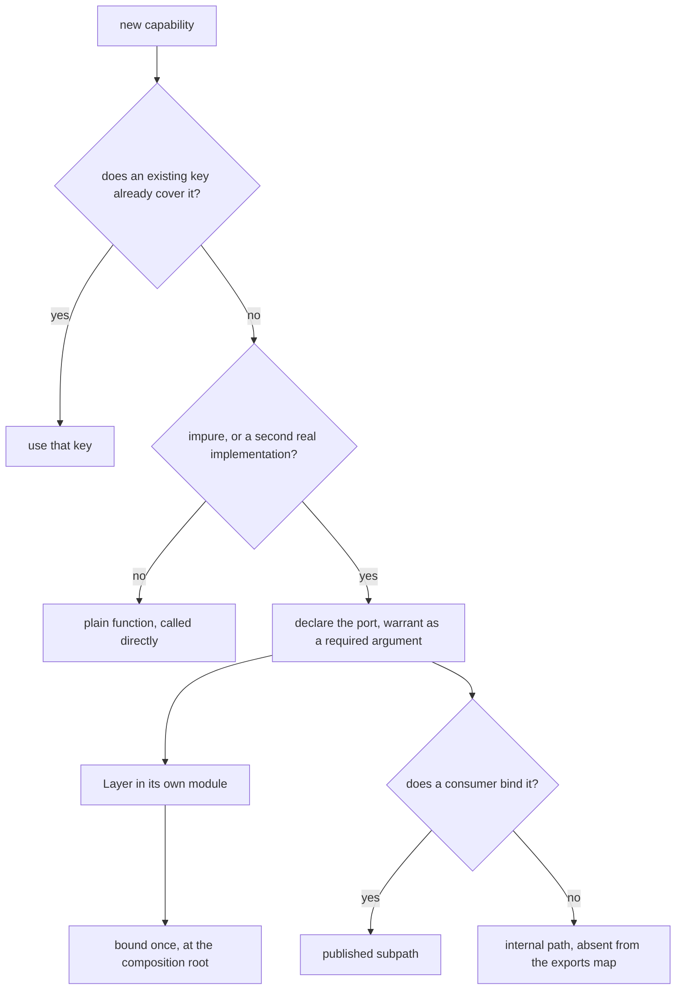

# Port Discipline After the Suffix - Plan

## Goal Capsule

- Objective: decide when a capability earns an Effect service key, separate the key from the `Layer` that provides it, and assign each property to an instrument that can actually decide it.
- Product authority: this plan owns the criteria for minting, widening, publishing, and placing a service key, and the instruments that enforce them. It does not own the suffix-key deletion — `docs/plans/2026-08-16-001-refactor-cell-class-collapse-plan.md` owns that — nor the complement complexity ceiling, nor an observability construct.
- Open blockers: none blocking the write. One product call stays open (whether the write-time refusal binds humans), recorded in Outstanding Questions.

---

## Product Contract

### Summary

A port discipline: five criteria that decide whether a capability earns a service key, a split that keeps a key and its `Layer` in different modules, and an enforcement stack assigned by what each instrument can decide — the type where a type expresses the property, a graph guard where only the module graph does, packaging where the audience is a stranger, and an interpreter observation where only running the code answers.

### Problem Frame

The 2026-08-16 retirement ordered the thirteen-role vocabulary deleted and left three properties with no instrument: whether a capability should be a service at all, whether an implementation is reached outside a composition root, and whether a key exists with a single provider and no non-determinism. The retirement is in flight, not complete — `SHELL_CELL_SUFFIXES` (`packages/oxlint-plugins/test-placement/src/rules/path.config.ts:50`), the `IO_SOURCE_FILE` and `IO_TEST_FILE` regexes (`packages/oxlint-plugins/core/src/rules/no-io-boundary-tests.config.ts:1`), and the `IO_CELLS` role list (`packages/effect-cell-types/src/Cell.ts:154`) still ship. Their removal belongs to the 001 plan; this plan depends on it and re-orders nothing.

The rule that preceded them did worse than nothing. Forbidding a value edge into a file holding both the port and its implementation left an executor one legal route — mint its own projection tag — and the tree grew 25 production `*ExecutorDeps` tags, of which the source records 22 as having neither a second implementation nor a test substitution (`docs/solutions/architecture-patterns/one-cell-cannot-hold-a-port-and-its-implementation.md:42-45`). That source's three category counts sum to 28 against a population of 25, so the categories overlap; the population is the reliable figure and the split is re-measured before it becomes a target.

Collocation is the shipped state. `packages/arethetypeswrong/cli/src/filesystem.adapter.ts` declares the key at line 23 and exports `FilesystemLive` at line 50. That package also ships no `exports` map at all (`packages/arethetypeswrong/cli/package.json:12-18` declares `files` and `bin` only), so nothing today refuses a deep import into its `dist/` — the packaging half of the discipline does not exist yet rather than merely being violated.

### Key Decisions

- KD1. The constraint rides in the type wherever a type can express it. The build erases a filename, so a name reaches a consumer as zero bits, while the emitted declaration reaches every consumer's compiler. Governs R4, R10. (session-settled: user-directed — chosen over re-keying rules onto a replacement naming scheme.)
- KD2. Instrument follows what can decide the property, in four classes: a type, for what a signature states; a graph guard, for a fact about the module graph; packaging, for anything that must reach a stranger, since no gate of ours runs in a consumer's build; and an interpreter observation, for behavior that only appears when the code runs. A property assigned to a weaker class than it needs is an ungated rule wearing a gate's name. Governs R4, R9, R12, R16.
- KD3. A constraint is delivered as the shape of the hole the author fills. Supplying relevant retrieved headers before generation raises the with-versus-without test pass ratio to 3x for Hazel and 1.5x for TypeScript on the MVUBench hole-fill task with GPT-4 (arXiv 2409.00921), while type annotations merely present in a prompt show no overall pass@1 effect for Codex on MultiPL-HumanEval or MultiPL-MBPP (arXiv 2208.08227). Governs R10.
- KD4. Persistence earns no construct of its own: a module whose provider delegates one other port and adds no behavior is a wrapper, not a capability. Governs R5.
- KD5. No name is minted for this. `service`, `repository`, and `manager` are junk-drawer names under CONST-N2; the vocabulary is the port and its binding. Governs R14.
- KD6. Packaging is the only instrument that reaches a stranger, and `tsdown.config.ts` owns it under REPO-S4 — a hand-edited `exports` map is not an option here. Governs R16, R17.

### Requirements

**Criteria for a key**

- R1. A capability earns a service key only when it is impure — non-deterministic or performing I/O — or when a second real implementation exists. Gate: the graph guard (R12) reports a key with one provider whose provider's _direct_ imports intersect no source on the I/O classification list. Known false negatives, accepted and recorded: a provider reaching impurity through `import()`, `Layer.suspend`, a local factory, or a package boundary.
- R2. A key's width tracks the capability, never one operation's callsite. Gate: the graph guard reports the projection shape — a provider that yields another key and returns a subset of its members. Structural subset alone is not the finding, because two independent keys may overlap by accident.
- R3. A key is published only when a consumer of the package is expected to bind or substitute it. A binding inside the package's own tests is not a consumer binding. Gate: review against the package's API report, where a consumer binding is one outside the package's own test files.
- R4. A key states its warrant as a required constructor argument — `impure`, or `strategy` naming its alternative — so omitting it is a type error and the warrant survives into the emitted `.d.ts`. Gate: `pnpm check:local` typecheck; a key declared with no warrant does not compile.
- R5. A persistence module declares no key of its own. Gate: the graph guard reports a provider that delegates a single other port and adds no behavior of its own.

**Port and binding**

- R6. A key is not reachable from its provider through the module graph: the module declaring a key neither exports a `Layer` providing it nor re-exports one. Gate: the graph guard walks forward from each key declaration and fails on a reachable provider symbol.
- R7. Inside this repository, a provider is value-referenced only by a composition root. Gate: the graph guard reads value edges in the emitted bundle, not source text alone, because `import type` plus `Effect.provide` erases the edge from the source while keeping it at runtime.
- R8. One composition root per process, wiring only that process. Gate: review — the root is the single site importing across unit boundaries.
- R9. A published entry's own evaluation is inert: imported from the packed tarball in a fresh process it performs no I/O, opens no connection, and spawns no work. The claim covers the package's own modules, not its dependencies' load behavior. Gate: an interpreter observation in the contract lane; the lane today covers two CLIs, so publishable packages are new coverage this plan adds.
- R16. Every publishable package declares a generated `exports` map naming ports and entrypoints only, with no wildcard subpath. Gate: `pnpm check:exports` and `attw --pack .`, over a map generated by `tsdown.config.ts`. `packages/arethetypeswrong/cli` has no map today and is the first target.
- R17. The warrant R4 puts in the declaration is audited where it lands in the published surface. Gate: `api:check` — the API report carries it, so a change is a reviewable diff.

**Delivery**

- R10. Where a type carries the constraint, it arrives as the type of the hole the author fills, with member names that state the required fix. Gate: `pnpm --filter @systemfsoftware/effect-cell-type-tests test:types` pins the member names.
- R11. A write-time gate refuses an edit that violates R6 for an author whose harness runs hooks. Gate: a hook-selftest task wired into `pnpm check:local` alongside `//#check:exported-wiring`, planting a known-bad and a known-good fixture; the hook does not exist in this tree today.
- R12. A CI guard decides R1, R2, R5, R6, and R7 by recomputing over the module graph from source bytes and emitted output, never by reading a field its author supplied. Gate: `pnpm check:local` runs the guard with one `--selftest` fixture pair per predicate, not one for the guard.
- R13. No prose rule states what R10 through R12 already carry. Gate: review — a rule with no gate is deleted rather than documented.

**Residue**

- R14. After the 001 plan lands, no instrument keys on a retired cell-role filename. Gate: a residue scan in `pnpm check:local` that fails when the three identifiers or any cell-role suffix regex is present in `packages/**`, since a deletion nothing scans for is a gate that cannot fail.

### Key Flows

- F1. A capability arrives.
  - **Trigger:** an author needs a filesystem, a chain client, a clock, or a table.
  - **Steps:** check whether an existing key covers it; classify against R1; a plain function when neither warrant holds; otherwise declare the port with its warrant argument, put the provider in its own module, bind it at the root, and publish the port only when a consumer binds it.
  - **Covered by:** R1, R2, R3, R4, R6, R7, R8.

### Acceptance Examples

- AE1. Covers R1. **Given** a module with one provider and no impure direct import, **when** it is declared as a key, **then** the guard reports it and the fix is deleting the key and calling the function.
- AE2. Covers R6, R11. **Given** a module declaring key `K`, **when** the same module exports or re-exports a `Layer` providing `K`, **then** the write is refused and the diagnostic names the export to move.
- AE3. Covers R7. **Given** a feature module, **when** it references a provider as a value — including through an `import type` whose symbol is then passed to `Effect.provide` — **then** the guard fails on the emitted bundle; a genuinely type-only reference passes.
- AE4. Covers R3. **Given** a key bound only by the package's own tests, **when** the surface is reviewed, **then** it stays internal and the test binds it through the internal path.
- AE5. Covers R9. **Given** a declared entry whose own module opens a connection at import, **when** the contract lane imports the packed tarball, **then** it fails and names the entry.
- AE6. Covers R2. **Given** a provider that yields an existing key and returns a subset of its members, **when** the guard runs, **then** it reports the projection; two independent keys that merely share a member signature pass.
- AE7. Covers R14. **Given** the 001 deletion has landed, **when** the residue scan runs, **then** it finds none of the three identifiers; **and given** one is reintroduced, **then** the scan fails.
- AE8. Covers R16. **Given** a package with a generated exports map, **when** a consumer imports a provider path, **then** resolution fails; **and given** a package with no map, **then** the gate reports the package rather than passing.
- AE9. Covers R4. **Given** a key declared with no warrant argument, **when** the package typechecks, **then** it does not compile and the diagnostic names the missing warrant.
- AE10. Covers R5. **Given** a persistence module whose provider delegates the driver port and adds no behavior, **when** the guard runs, **then** it reports the key and the fix is deleting it and calling the functions over the driver.
- AE11. Covers R12. **Given** a predicate's detection logic is broken, **when** `--selftest` runs, **then** its known-bad fixture stops failing and the guard exits non-zero.

### Success Criteria

- Every service key under `packages/**` carries a warrant argument or is deleted.
- No module declaring a key is forward-reachable to a provider of that key. `packages/arethetypeswrong/cli/src/filesystem.adapter.ts` is the verified instance; the full count is measured during planning.
- Every publishable package has a generated exports map with no wildcard subpath, `packages/arethetypeswrong/cli` included.
- The contract lane's interpreter observation passes against the packed tarball of every publishable package.
- The residue scan finds no cell-role identifier, and fails when one is planted.
- `pnpm check:local` exits 0, run after the last edit.

### Sequencing

The instruments have a strict order, because two of them are unenforced or crash if landed early.

1. The 001 plan's deletion lands, with its own changeset for the `IO_CELLS` public-export break.
2. R12's guard ships with a fixture pair per predicate, so the properties have an instrument before anything else moves.
3. R4 and R17 land the warrant in the type and the API report.
4. R16 lands the exports maps.
5. R11's hook lands in its own commit as an Evaluator surface, observed failing before and passing after.
6. R9's contract-lane coverage extends to publishable packages.
7. R14's residue scan lands last and verifies step 1 stayed done.

### Scope Boundaries

Deferred for later:

- The shell's decision leakage. The complement complexity ceiling reads branching, not I/O placement.
- An observability construct. Unowned, and independent of the port question.
- Renaming files that still carry former suffixes.

Outside this plan:

- The suffix-key deletion and the description-value change, owned by `docs/plans/2026-08-16-001-refactor-cell-class-collapse-plan.md`, including the API-report break its `IO_CELLS` removal causes.
- Any consumer checkout outside this repository.
- Any replacement role taxonomy, of any cardinality.

### Dependencies and Assumptions

- Dependency: the 001 plan lands first. R14 verifies its outcome and does not re-order it.
- Assumption, defaulted: a composition root is identified by the entrypoint basenames the tree already recognizes — `SHELL_ENTRY_BASENAMES` at `packages/oxlint-plugins/test-placement/src/rules/path.config.ts:58` — not by a new manifest field, which KD5's no-new-names discipline argues against. Confirm at planning.
- Assumption, grounded: whole-graph properties need a guard script rather than a per-file lint rule. `scripts/guards/check-exported-wiring.ts` already recomputes across package boundaries and is wired into `gate:tasks` (`package.json:16`).
- Assumption, honest gap: no defect in this tree currently motivates R9. It rests on the ruling that a published value performing effects at import is a composition root in disguise.
- Known limit, recorded rather than solved: R1's guard cannot see impurity reached through `import()`, `Layer.suspend`, a local factory, or another package. The residue is real and the plan does not claim otherwise.

### Outstanding Questions

Resolve before planning:

- Whether the R11 refusal binds humans through a pre-commit hook, or agents only through the tool-use hook.

Deferred to planning:

- Whether R17's audit reads the warrant from a JSDoc tag or from the argument's own type in the API report.

### Sources and Research

- `docs/solutions/architecture-patterns/one-cell-cannot-hold-a-port-and-its-implementation.md:42-45` — the projection population and the split ruling.
- `docs/solutions/architecture-patterns/label-routed-rules-are-unfalsifiable.md` — the three sound key classes: return type, import edge or whole-graph fact, package membership.
- `packages/effect-cell-types/src/Cell.ts:189-203` — the stage brands whose member names are the diagnostic sentences R10 imitates.
- `repos/effect/packages/effect/src/Context.ts:4-9,58-59` — `Context.Service` for a required key, `Context.Reference` for a defaulted one; `Effect.ts` exposes only `provideService` and `updateService` over `Context.Key`.
- `packages/arethetypeswrong/cli/package.json:12-18` — a publishable package with no exports map, the first R16 target.
- `package.json:16-19,29` and `scripts/guards/check-exported-wiring.ts` — the guard-and-selftest shape R12 and R14 follow.
- Seemann, _The Composition Root_ (2011) and _DI-Friendly Library_ (2014) — a root is unique and executes at the entry point; a published lazy binding is neither.
- Wlaschin, _Six approaches to dependency injection_ — a dependency is managed only when it is impure or a strategy.
- arXiv 2409.00921 — retrieved-header context, GPT-4 on MVUBench, 3x Hazel and 1.5x TypeScript with-versus-without ratios behind KD3.
- arXiv 2208.08227 — the type-annotation null for Codex on MultiPL-HumanEval (p = 0.33) and MultiPL-MBPP (p = 0.23), the other half of KD3.
