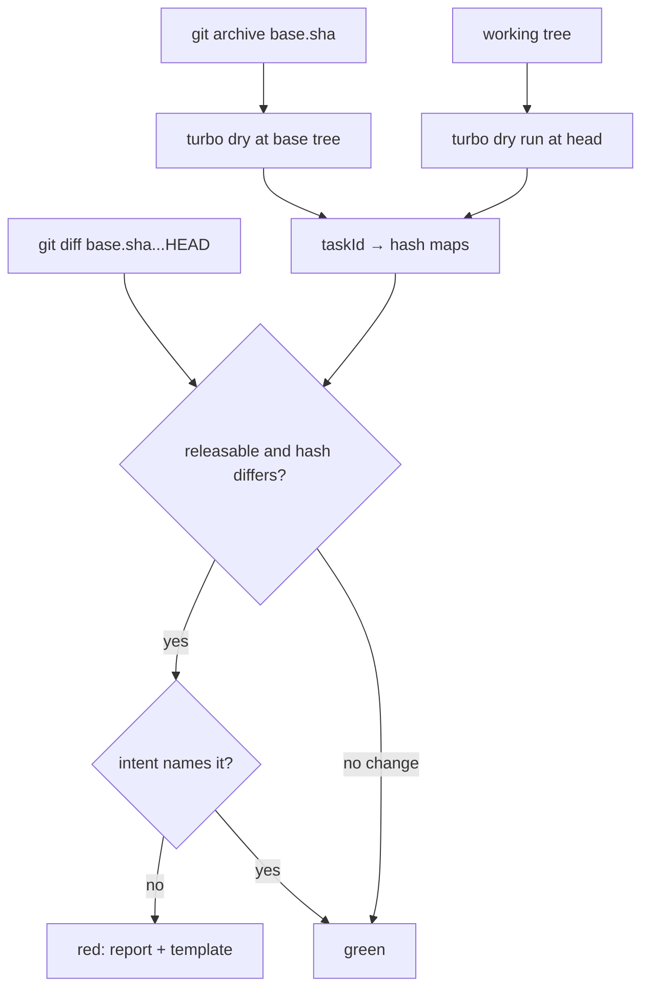

# Re-Key the Changeset Requirement on Turbo Build Hashes - Plan

## Goal Capsule

- Objective: replace the changeset gate's file-touch heuristics with the only deterministic verdict available — the per-package turbo `build` task hash, compared between a pinned base tree and the PR head. A publishable package whose build hash changed demands an intent file; one whose hash did not change demands nothing, no matter which files moved.
- Product authority: this plan owns `scripts/guards/check-changeset.ts`, its selftest, the `changeset-check` workflow (install step, selftest/main flags, pinned base-sha argument), `.changeset/README.md`, the REPO-R2 doctrine line in `AGENTS.md`, and one solution doc. It does not own `pnpm change`, `pnpm version -r`, the release workflow, or the deleted turbo-graph text guard (that deletion stands).
- Verification precondition: tree at `dae6f86f378` on branch `changeset-harness-fixes`, clean; current gate selftest passes 19/19; turbo 2.10.5 locked in `pnpm-lock.yaml`; `node_modules/turbo/package.json` resolves to the same version.
- Stop conditions: selftest green; synthetic-PR red/green matrix observed on a scratch branch; `pnpm check:local` green after the last edit; the PR's own range (scripts + docs + workflow only, no package input) passes the gate without any intent — deterministic proof applied to itself; CI green.

---

## Product Contract

### Summary

The gate that decides whether a PR may merge without a `.changeset/` intent stops approximating what changes a published artifact. Today it matches changed file paths against turbo's `build.inputs` globs with a hand-rolled glob engine, classifies manifest edits with a hand-rolled consumer-reach rule, and enumerates members from `git ls-files`. All three are re-implementations of something turbo already computes: the per-package build task hash. Two `turbo run build --dry=json` invocations — one on the pinned base commit, one on the working tree, both run by the lockfile-installed binary — give per-package hashes over every input that shapes `dist/`: input files, manifest, task definition, auto-included config files, and dependency task hashes. The gate compares. Changed hash → the package needs an intent (`none`, `patch`, `minor`, `major`); unchanged → no intent.

### Problem Frame

The current gate (`scripts/guards/check-changeset.ts`) decides "did this PR reach a consumer" twice removed from the thing it wants to know. It owns a private glob engine for the two patterns `src/**` and `tsdown.config.*`, which is wrong about the file set turbo actually hashes: the observed task inputs also include `package.json`, `tsconfig.json`, `tsconfig.build.json`, `tsconfig.node.json`, and `api-extractor.json` — auto-included files no `turbo.json` glob names. It maintains a consumer-reach contract for manifest fields (`CONSUMER_BLIND_FIELDS`, lifecycle scripts) that the hash settles exactly: any manifest edit changes the task hash. Its membership heuristic (`git ls-files` minus ancestors) contradicts the workspace itself: the stryker `testResources` fixture manifests (`packages/stryker-js/vitest-runner/testResources/workspaces/packages/{bar,foo}`) are treated as releasable members although turbo does not enumerate and pnpm does not workspace them, so a fixture edit can demand a changeset.

The premise, user-directed: the changeset must be required exactly when the turbo hash for that package changed — the same verdict turbo itself uses to decide whether the build would re-run, and therefore the most deterministic reach predicate available. Empirical ground for every claim below is the Appendix probe log (2026-08-16, turbo 2.10.5, tree `dae6f86f378`).

The one deliberate blind spot, shared identically with the old gate, is that hash semantics are turbo's: a catalog value flip (`pnpm-workspace.yaml`) or root `overrides` edit changes no package hash, so no intent is demanded although resolutions change. This is a known, owned gap (Scope Boundaries), not a silent one.

### Key Decisions

- The intent file is the delivery record for the explicit decline: the gate requires a file, never a bump. (session-settled: user-directed — chosen over silence: silence is indistinguishable from a missed record, and the release tooling can express "no release" only through a `none` intent, which itself requires the explicit `--bump none` flag.) Governs R7, R8.
- The requirement predicate is the turbo build hash, not the file set. (session-settled: user-directed — chosen over the current path-touch heuristics: "the most deterministic" verdict, engine-computed.) Governs R1, R2.

### Requirements

**Trigger predicate**

- R1. A publishable package (manifest `private !== true`) demands an intent in a PR exactly when its `build` task hash differs between the pinned base and PR head. The hash is turbo's own, from `turbo run build --dry=json`, never a local recomputation of it.
- R2. A package whose `build` hash does not differ demands no intent, regardless of which files changed or whether a maintainer believes they reach consumers. Determinism is the point: only the engine decides reach.
- R3. Hash propagation follows turbo. A change in an upstream dependency's build hash that re-hashes a dependent (measured: a shared-tsconfig file edit re-hashed all 40 packages) demands an intent for every re-hashed releasable package, not only the directly edited one. The same class covers the two configured globals: editing `scripts/tools/patch-tsgo-if-needed.mjs` (a `globalDependencies` entry) or `turbo.json` itself also re-hashes all 40 (probes M/N) — such PRs demand intents workspace-wide.
- R4. Global-level inputs that never enter any task hash demand nothing by themselves: the root `package.json`, `pnpm-workspace.yaml`, and `pnpm-lock.yaml` (measured: content changes to all three changed 0 of 40 task hashes). This is what makes catalog flips and lockfile-only dependency resolution changes intent-free by design, for better and worse (Scope Boundaries).
- R5. A package new in the PR (no `build` task at base) counts as hash-changed and demands an intent. A package absent from the head matrix is gone from the workspace and demands nothing — task absence at head happens only for deletion or workspace eviction: a package that merely removes its `build` script keeps its task (probed: `@systemfsoftware/tsconfig` has no build script yet carries a `#build` task with a `<NONEXISTENT>` command) and its manifest change re-hashes it, so script removal still demands.
- R6. A releasable package that has no `build` task in either dry run (none exists today; all 40 workspace packages produce a task) falls back to the per-file rule: any changed file under its directory demands an intent. This fallback is a coarser file-touch heuristic than the old gate ever was — it is the conservative floor for a future member turbo refuses to task, and its second-engine hazard is recorded in the solution doc, not treated as a routine branch.

#### Intent contract

- R7. The intent requirement per package is satisfied by a `.changeset/*.md` file within the PR diff (`--diff-filter=AM`, excluding `.changeset/README.md`) whose frontmatter names that package and one of `none`, `patch`, `minor`, `major`. Name match is strict and prefix-safe (`"@scope/published-extra"` never covers `"@scope/published"`).
- R8. `none` is a fully valid intent and satisfies the gate: the docs' definition governs — "the change needs no release; `none` requires the explicit `--bump none` flag". The gate never demands a bump, only an explicit record. The dependency-driven manifest-edit class (Dependabot weekly npm group) is expected to ship `none` intents: a devDependencies-only or script-only bump is exactly the "no release" case.
- R9. The gate fails closed. Any failure — base argument unresolvable, install missing, dry run non-zero exit, non-JSON output, a task missing its hash, parse mismatch — exits non-zero with a message naming the failing step. A gate that cannot judge must not pass.
- R10. The selftest (`--selftest`) stays turbo-free: it feeds fixture evidence into the exported verdict function, asserts verdicts, and performs no subprocess and no file writes. It reads exactly two real files through `--allow-read`: the live `pnpm-lock.yaml` (schema assertion + turbo pin) and the installed `node_modules/turbo/package.json` (resolved version), failing on mismatch with install instructions. A gate change must be proven red-before-green on fixtures and the observed-PR matrix.
- R11. Non-workspace pseudo-packages (the stryker `testResources` fixtures) are never members and never demand an intent under their own names. Discovered in execution (probe P): a file added inside such a nested-workspace fixture changes turbo's `hashOfInternalDependencies` — a global input — and re-hashes every package, so the demand is workspace-wide, by the engine's verdict. The gate does not exempt that class; an intent sweep (`none` where nothing ships) is the honest record.
- R12. The missing-intent report names the packages, states the hash predicate and that `none` is an intent, and prints the frontmatter template.

---

## Planning Contract

### Key Decisions

- KTD1. **Comparison via two dry runs.** The R1 predicate is computed as the per-package `build` task hash across two `turbo run build --dry=json` invocations. Alternatives weighed: turbo's `--affected` file-mapping (rejected — input-file arithmetic, not the hash), patching the glob/heuristic gate in place (rejected — that approximation is the thing being replaced), a global-`hashOfExternalDependencies`-style single-field comparison (rejected — it responds to manifest spec strings but not to package source edits, and no global task hash exists to compare), and an early-exit when the diff intersects no package directory (rejected — it reintroduces exactly the file-touch heuristic the plan removes; a dry run costs ~0.2s, so there is no latency to buy).
- KTD2. **Base tree materialization.** The base hash comes from `git archive <pinned-base-sha>` extraction into a temp dir, followed by a dry run there; the head hash comes from the working tree. Keyed on the PR event's recorded `base.sha` — never on a moving ref resolved at job time, so a merge landing on main between event and check cannot infect the verdict. Probed: an archive tree with no `node_modules` and no `.git` produces a task-hash set byte-identical to a checkout's. The temp dir is removed unconditionally (`finally`), and the base argument is resolved with `git rev-parse` first, failing closed with a clear message if absent.
- KTD3. **Turbo acquisition is the lockfile install, and nothing else.** The gate runs the binary the repo already pins: `pnpm install --frozen-lockfile` in the workflow, then `node_modules/.bin/turbo` by absolute path from the working tree with `cwd` set into the base archive for the base run. No `npx`, no registry fetch at verdict time — the executor is exactly the binary the workspace's own supply-chain gate installed. The selftest then verifies the running binary: it compares `node_modules/turbo/package.json#version` and the lockfile pin (asserting `lockfileVersion: 9.0` and the lockfile's importer path in the same stroke), so a stale install, a pnpm upgrade changing the lockfile schema, or a silently re-resolved turbo all break the selftest rather than the verdict. Cost: one frozen-lockfile install per PR (~30-60 s) — dwarfed by the determinism the gate buys and consistent with every other CI job in this repo.
- KTD4. **Membership source switches to the turbo dry-run `packages` array** with the head manifest's `private` bit. The deleted `workspace-members.ts` heuristic is superseded and the file is deleted. This removes the bar/foo fixture false positives (R11). The gate does not re-count members against `pnpm-workspace.yaml` — a second enumeration would re-import the heuristic family it exists to remove; a malformed/absent-manifest package that turbo skips is the same class as a package that is not a workspace member, and stays outside the verdict.
- KTD5. **Hash equality semantics.** The verdict derives from the two per-task maps (`taskId → hash`) over `@scope/pkg#build`. Absence at base = changed; absence at head = skipped; both present = string equality of turbo hashes. Task presence does not depend on a build script existing (probed `<NONEXISTENT>` tasks), so script removal re-hashes rather than vanishing.

### High-Level Technical Design

One Deno script, one locked binary, two hash matrices, one comparison:

The gate is Evaluator surface (own commit; failures observed red before green), so the workflow runs `--selftest` before the verdict path.

### Assumptions

- The workflow pins the base argument to `github.event.pull_request.base.sha`; `actions/checkout@v7` with `fetch-depth: 0` leaves that commit reachable in the fetch (the full-clone history contains it), and the gate's `rev-parse` guard fails closed if it is not.
- Per-task hashes are env-invariant for this turbo version: `globalPassThroughEnv` values (`XDG_CACHE_HOME`, …) are hashed into `globalCacheInputs.environmentVariables.passthrough` only, never into per-task hashes (probed: XDG_CACHE_HOME values A vs B changed the passthrough fingerprint and 0 task hashes). No env normalization is needed or correct.
- `turbo run build --dry=json` output is one JSON document on stdout (probed); stderr may hold progress noise and is discarded.
- Releasability is the head manifest's `private` bit; turbo tasks every workspace package whether or not the script exists, so no taskless releasable workspace member exists today; R6 future-proofs the gate anyway.
- The install step is `pnpm install --frozen-lockfile` (the repo's shared `.github/actions/install-deps`), so the binary in `node_modules` is byte-identical to what `pnpm check` uses — the gate and the build share one supply chain.

### Scope Boundaries

In scope: the gate script, its selftest, the `changeset-check` workflow (install step, flags, base-sha argument), `.changeset/README.md`, REPO-R2, the deletion of `workspace-members.ts`, and one solution doc at `docs/solutions/tooling-decisions/changeset-requirement-keys-on-turbo-build-hash.md`.

Deferred to follow-up work:

- Rebuilding `guard-turbo-graph`'s text arms. The 2026-08-14 deletion (ci(global): remove the turbo hashing guard) stands; its rationale — the arms watched text about turbo, not behavior — still applies, and the hash rule does not touch that ground.
- `pnpm change` authoring automation for bot-driven intent files; the release-planning workflow (`pnpm version -r`) is untouched.
- The catalog-flip and root-overrides gap (R4) is accepted as decided and owned: the release PR's review sweeps a changed catalog/overrides resolution into the same release pass as the consuming packages' intents, and the solution doc names this expectation. Not "no release needed" — "the gate does not adjudicate it; the release review does."
- A deleted published package needs no intent: the release tooling consumes intents for workspace packages only, so a `none` naming a removed package has no consumer; the removal is a source-control decision already visible in the PR diff. Recorded in the solution doc.

---

## Implementation Units

### U1. Rebuild the gate verdict and main on turbo hashes

Goal: `scripts/guards/check-changeset.ts` demands intents exactly for releasable packages whose `build` hash differs over the PR window, failing closed on any turbo failure, run wholly by the lockfile-installed binary.

Dependencies: none.

Files:

- `scripts/guards/check-changeset.ts` — rewrite (shebang stays `#!/usr/bin/env -S deno run --allow-run=git --allow-read`: npx and the extra allow-run never arrive; the selftest sub-mode requires `--allow-read` only).
- `scripts/guards/workspace-members.ts` — delete (the gate was its only consumer).

Approach:

1. Version authority: read the root `pnpm-lock.yaml` (assert `lockfileVersion: 9.0`; read the importers `.` devDependencies turbo `specifier`/`version` pair) and the installed `node_modules/turbo/package.json` version. Mismatch or unparseable shape throws with the fix instruction ("run `pnpm install --frozen-lockfile`"), never a silent fallback.
2. Materialize base: resolve the base argument (`git rev-parse --verify` — a bare SHA from the workflow, or a ref for local runs), `git archive <resolved> | tar -x` into a `Deno.makeTempDir`; wrap the whole verdict in `try/finally` that removes the temp dir unconditionally.
3. Run `<worktree>/node_modules/.bin/turbo run build --dry=json` twice — once with `cwd` at the base archive, once at the working root (same absolute binary; the base tree needs no install). Parse `{tasks: [{taskId, package, directory, hash}]}`; validate every task carries a hash; any failure throws and names the step (turbo exec vs output parse vs base ref).
4. Map per task: both matrices → string-compare the hash; base-absent → changed; head-absent → skip. Releasability from the head manifest's `private` bit (per-day dirs via the task's `directory`).
5. Keep the existing changeset-files discovery and strict `declaresBumpFor` parsing (`.changeset/*.md` diff, AM, README excluded). Missing-intent report: names the packages, states the hash predicate, prints the frontmatter template.
6. Fallback (R6): from the two matrices' union plus `git diff --name-only <base>...HEAD` — releasable member with no `#build` task and any changed file under its `directory` → demand.
7. Delete `workspace-members.ts` and the consumer-reach machinery (`CONSUMER_BLIND_FIELDS`, `manifestChangeReachesConsumers`, `globToRegExp`) — superseded by hash semantics; nothing else imports the file.

Test scenarios (fixture rows over the exported verdict — pure, no turbo):

- Same hash before/after, intent none → satisfied; no intent → not demanded at all.
- Changed hash, releasable, no intent → missing; each of the four bumps → satisfied; another package's intent → missing; prefix-name intent → missing.
- Private package with differing hash → never demanded.
- New package (absent at base) → demanded; deleted package (absent at head) → skipped; package whose `build` script is removed → hash differs → demanded (fixture pins the probe-L semantics).
- Fallback: member with no `#build` task, changed file under dir → demanded; changed file outside → not demanded.
- Two changed packages, one intent → one missing.
- Lockfile schema/pin fixtures: fake `specifier/version` pair parses; version mismatch or `lockfileVersion` not 9.0 → selftest failure; resolved-manifest mismatch (node_modules version ≠ pin) → selftest failure.

Verification: `deno check scripts/guards/check-changeset.ts`; fixture suite green with no turbo; manual matrix run on a scratch branch with a real turbo present (matrix row below).

### U2. Wire the workflow, doctrine and README

Goal: the CI job runs the selftest and the main gate with the locked install, a pinned base SHA, the selftest's read scope, and text that says what the gate now is.

Dependencies: U1.

Files:

- `.github/workflows/changeset-check.yml` — owns all workflow edits: add `- uses: ./.github/actions/install-deps` (frozen lockfile) after checkout; selftest step runs `deno run --allow-read scripts/guards/check-changeset.ts --selftest` (the pin check reads the lockfile and the installed turbo manifest — the "No permissions" comment becomes "no subprocesses, no writes; read-only lockfile + resolved-manifest check"); the main step runs `deno run --allow-run=git --allow-read scripts/guards/check-changeset.ts ${{ github.event.pull_request.base.sha }}` (pinned base SHA, not `base_ref`).
- `.changeset/README.md` — wording: "a PR that changes the turbo build hash of a publishable package MUST ship an intent here; `--bump none` records a change that needs no release — devDependency-only and script-only bumps are the canonical `none` class; catalog/overrides-only changes are outside the hash verdict and reviewed at release (see the solution doc)".
- `AGENTS.md` — REPO-R2 re-keyed: the intent gate keys on the package's turbo build hash (gate: `changeset-check.yml`), `--bump none` records an explicit decline, and package publicity is the head manifest's `private` bit.

Approach:

1. The selftest parenthetical defining a git-spawn budget is dropped: the selftest spawns nothing (R10), and the main path's materialization makes exactly one git call (the archive; `diff` is pure git plumbing already counted by the workflow's `--allow-run`).
2. Verdict fixtures convert from file-evidence to hash-pair evidence; the deliberate semantic flips are stated in fixture comments: devDependency-only changes and script-only changes demand (they change the hash — probe C/G); non-input files no longer do; the fixture package rows (`bar`, `foo`) are gone.
3. The Dependabot/every-weekly class is a `none`-intent flow: the README claims the class, REPO-R2 points at the README, and the plan does not change authoring UX (deferred).
4. The solution doc (U2/U3 dependency: exists for the record) gets rows for probes M, N, O, Z (appendix).

Verification: the workflow selftest step exits 0 with only `--allow-read`; the main step's argument format is the event's base SHA (a full 40-hex string survives `git rev-parse`); the install step exists and is frozen-lockfile.

### U3. Record the semantic in the solution corpus

Goal: a future agent touching the gate, the release pipeline, or turbo config finds the operational semantics that intent records ride the hash verdict — in the repo's own decision format.

Dependencies: U1, U2 (writes docs only).

Files:

- `docs/solutions/tooling-decisions/changeset-requirement-keys-on-turbo-build-hash.md`

Approach: one decision record: (a) the verdict is per-package turbo `build`-task hash, base-SHA-pinned, via the lockfile-installed binary; (b) why intents are still required (the explicit-decline vehicle — `none`), not "no file needed"; (c) the probed semantics table: change class → hash consequence → intent demand (include probes M/N/O/Z); (d) the owned gaps: catalog/overrides flips and deleted-published packages — who reviews each; (e) the R6 second-engine caveat (a task absence is an anomaly to investigate, not a routine branch), and the known failure-to-measure note that `inputs` in the dry-run JSON is not the whole hash (probe Z). A future hypercare: the gate does not implement decisions; this doc does not get re-linked from AGENTS.md (Doctrine stays unsupplied — no gate input).

Verification: read-back by the author's reviewee; no gate text references it; terminology matches `CONCEPTS.md` (none).

---

## Verification Contract

|Check|Command / signal|Units|
|---|---|---|
|Type-check gate|`deno check scripts/guards/check-changeset.ts` 0|U1|
|Selftest|`deno run --allow-read scripts/guards/check-changeset.ts --selftest` → `selftest ok (N fixtures)`|U1, U2|
|Resolved-binary red case|copy tree, bump `node_modules/turbo/package.json#version` → selftest fails|U1|
|Lockfile schema red case|re-`pnpm-lock.yaml` turbo version or `lockfileVersion` → selftest fails|U1|
|PR-matrix green/red (scratch branch, real turbo)|baseline clean → 0; README-only → 0; src edit w/o intent → 1 (names pkg + its re-hashed dependent); intents naming pkg and dependent (patch/none) → 0; devDeps-only → 1; nested-fixture edit under `testResources` → 1 workspace-wide (probe P: turbo's internal-dependency global input re-hashes all); shared-tsconfig edit → 1 workspace-wide; `scripts/tools/patch-tsgo-if-needed.mjs` edit → 1 all; `turbo.json` edit → 1 all; build-script removal → 1|U1, U2|
|Base pinning|PR-event base SHA recorded; merged-main movement between event and run does not change verdict (inspect one real PR)|U2|
|Cross-tree hash equality recheck|probe K re-run after U1: archive base vs checkout hashes identical (once, on first real run)|U1|
|E2E on own PR|the PR's own range (scripts, docs, workflow only) → gate 0 without any intent|all|
|Workspace gates|`pnpm check:local` exits 0 after last edit|all|
|CI|`gh pr checks --watch --fail-fast` green; the changeset-check job's own selftest step green|all|

## Definition of Done

- The verdict function is exercised by the selftest fixtures with no turbo dependency; every fixture that was red on the old gate is flipped with its reset comment.
- `workspace-members.ts` is deleted: `git ls-files` no longer lists it, and no import references it.
- The workflow's install step is `./.github/actions/install-deps` (frozen-lockfile); the selftest and main steps run `--allow-read` and `--allow-run=git --allow-read` respectively (no npx anywhere); the main argument is the event base SHA.
- `.changeset/README.md` and AGENTS REPO-R2 name the hash predicate and the `none` class; the solution doc exists, is layered with probes, and names the owners/data of the catalog and deletion gaps (U3) — its existence is accepted by its own verification row.
- The scratch branch and its real changesets removed; no stray worktrees; no dist created; tree restartable.
- `pnpm check:local` green after the last edit; the PR's checks green with the gate's own workflow observed running selftest + hash verdict.

---

## Appendix — Research Evidence

Probes executed 2026-08-16 at `dae6f86f378`, turbo 2.10.5, `node_modules/.bin/turbo` (lockfile-resolved); dry-run JSON artifacts captured into the session temp dir.

|Probe|What changed|Observed|
|---|---|---|
|A determinism|worktree copy vs checkout dry run|identical per-task hashes — matrices comparable|
|B src edit|`hex-schema/src/mod.ts`|hash changed; dependent `effect-schema-extensions` re-hashed (propagation)|
|C devDeps-only|manifest add devDep|hash changed — any manifest edit is hashed|
|D runtime dep spec|`catalog:` → pinned|hash changed (own + dependent)|
|E lockfile change|`pnpm-lock.yaml` content|0/40 hashes — lockfile is not a task input|
|F non-input file|README added|unchanged — input-globs act|
|G build script edit|`scripts.build` value|hash changed — manifest+command in hash|
|H shared tsconfig edit|inner JSON of `@systemfsoftware/tsconfig`|ALL 40 re-hashed (dependent graph)|
|I root package.json|probe field|0/40|
|J workspace yaml|comment|0/40|
|K archive|git archive tree, no node_modules/git|hashes identical to checkout — KTD2|
|L task shape|dry-run parse|40 packages /40 tasks; `@tsconfig#build` command `<NONEXISTENT>`; keys include `package/directory/hash`|
|M globalDep|`globalDependencies` script content|ALL 40 re-hashed — globalDependencies IS a task input|
|N turbo.json|`globalPassThroughEnv` edit|ALL 40 re-hashed — task definition in hash|
|O env|`XDG_CACHE_HOME` A vs B|0/40 per-task changed; `globalCacheInputs.environmentVariables.passthrough` differed — per-task hashes are env-invariant, ONLY globals differ|
|Z inputs≠hash|edit `effect.json` inside `@tsconfig` (not in dry-run `inputs`)|per-task hash changed, `inputs`+`hashOfExternalDependencies` stable — `inputs` is not the whole hash, verdict still correct|
|P nested-fixture|file added under `testResources/workspaces/packages/bar` (a non-member nested workspace)|ALL 40 re-hashed via `hashOfInternalDependencies` — nested-fixture trees are a global hash input; observed in the execution matrix, not the original probe set|

Prior art: `git show 70281312a4f` (the removed turbo text-hash guard; its header documents the two arms deliberately not re-created). The `.github/actions/install-deps` composite action exists and is the repo's one install path — `corepack pnpm install --frozen-lockfile`. Wiki corpus check: `xd://mcp__software_wiki_qmd_query` with intent "which packages need a changeset when a monorepo PR changes a publishable package" (software-wiki collection) returned no settled answer; top candidates (python-monorepo-tooling-scale, root-as-router, publish-surface) do not cover the predicate — recorded for falsifiability.