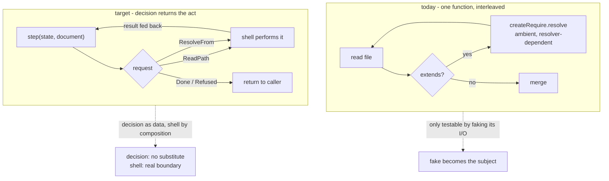
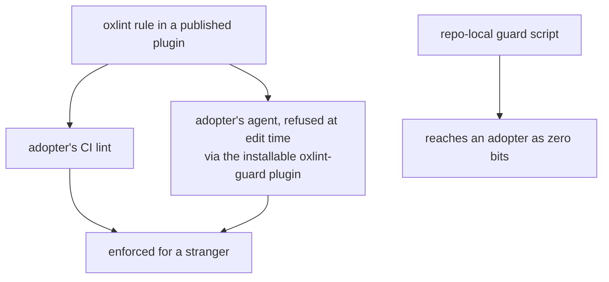

# I/O and Decision Split, Enforced Where an Adopter Can See It - Plan

## Goal Capsule

- Objective: split one blended module into a pure decision that returns its next act as data plus a shell that performs it, and repair the one shipped lint rule that claims to police that boundary but cannot fire correctly outside this checkout.
- Product authority: this plan owns the I/O-versus-decision boundary and the instruments that decide it. It does not own whether a capability earns a service key or the key/provider split — `docs/plans/2026-08-16-002-feat-port-discipline-plan.md` owns those and defers "the shell's decision leakage" to this plan.
- Stop conditions: stop and ask if a requirement here would need a new dependency, a new service key, or a rule whose predicate cannot be decided from a single file's syntax tree.
- Execution profile: the rule change lands as an Evaluator commit, separate from the migration it judges, with its gate observed red before and green after.
- Tail ownership: this plan owns through PR green. Merging stays human.

---

## Product Contract

### Summary

Repair the enforcement, then prove the shape. The rule that should police I/O-boundary testing decides whether a file is an I/O boundary by matching its filename against `.acl|.store|.adapter|.handler`, so it is silent on the 48 of 66 I/O-performing source files here that carry no such suffix, and inert for any adopter who names files differently. A sibling plan deletes that rule outright for exactly this reason. This plan supplies its content-triggered successor in the plugin that already owns test-placement rules, deletes the arm no single-file predicate can decide, and migrates the stryker extends-chain resolver into a pure step decision plus an interpreting shell.

### Problem Frame

A function that interleaves I/O with decisions can only be tested by faking its I/O, and then the fake becomes the subject while the real adapter goes unexercised. `packages/stryker-js/mutation-run/src/config/resolve-extends.ts` is that shape: `resolveExtendsChain` reads a file, decides whether it extends, resolves a specifier through `createRequire`, and recurses — read, decide, read, decide. Its integration suite passes locally under a workspace-aware resolver and fails in CI under node's, because the verdict depends on which resolver happens to serve the module rather than on the code. Seven scenarios currently fail in CI for that reason.

The instrument that should have caught the blend cannot see it. The rule is keyed on a filename the author chooses, which `docs/solutions/architecture-patterns/label-routed-rules-are-unfalsifiable.md` rules is unfalsifiable: a rule keyed on an author-supplied value never runs on the violation it exists to catch. The same ruling names the sound key classes — a return type, an import edge or whole-graph fact, package membership.

### Key Decisions

- KD1. Nothing is injected into a decision for a test's benefit; the decision returns the act it needs and the shell performs it. Governs R7, R8, R9. (session-settled: user-directed — chosen over a resolver port plus an in-memory filesystem binding: a requirement justified only by a test's need for a seam satisfies neither impurity nor a second real implementation, and the fake becomes the thing under test.)
- KD2. Every deliverable must work for someone who installs a package and shares none of this checkout's conventions. A repo-local guard script reaches them as zero bits. Governs R1, R2, R3, R4. (session-settled: user-directed — chosen over repo-local guard scripts and CI-only enforcement.)
- KD3. Where something can be changed for the better it is changed, not preserved. Every package here is pre-1.0 and API stability is not a design constraint. Governs R2, R6. (session-settled: user-directed — chosen over keeping the existing rule and its message text as-is.)
- KD4. A blocking filesystem call inside effectful code is a defect, not a convention to match. Governs R10. (session-settled: user-directed — chosen over matching the existing synchronous style of the file being edited.)

### Requirements

**Adopter delivery**

- R1. Each rule this plan adds reaches an adopter through a published oxlint plugin package they install and enable, with no dependency on this repo's private config aggregate.
- R2. The successor rule is registered in a plugin that already exports a `configs.recommended`, so an adopter spreads one existing value and names no individual rule.
- R3. No rule predicate reads a filename, a directory name, a cell suffix, or a workspace path as its trigger. A filename may appear in a verdict.

**Rule correctness**

- R4. The rule decides "this module performs I/O" from the module's own syntax tree: an import from an I/O-performing specifier whose imported binding is not type-only and appears in a call position.
- R5. The successor carries no arm that judges a separate test file. Whether the module a test imports performs I/O is a cross-file fact, and a rule that sees one file cannot decide it, so the class is recorded unowned rather than reported as covered.
- R6. Each message the rule emits names only what its predicate decided, and claims no semantic verdict the predicate never reaches.

**The split**

- R7. The extends-chain decision is a pure function from accumulated state and one already-read document to either a completed set of options, a request naming the next act, or a refusal.
- R8. The act a decision requests is data: read this absolute path, or resolve this specifier from this directory. The decision performs neither.
- R9. The shell performs the requested act and feeds the result back, and holds no decision of its own beyond dispatching on the request it received. The verification split follows: the decision is exercised as data with no substitute anywhere, and the shell is exercised by composition against the real boundary, never by substituting it.
- R10. No blocking filesystem call remains in the migrated module or in the tests that exercise it, with one exception: specifier resolution. Node exposes no async resolver of either kind, and no base-flexible ESM resolver — measured on v24.19.0, `import.meta.resolve` returns a string synchronously and silently ignores a second base argument, so it cannot resolve from the declaring config file's directory. Resolution is performed at the shell boundary and wrapped there.

### Success Criteria

- The seven `resolve-extends` scenarios that fail in CI pass, and pass for the same reason under node's resolver and under the test runner's.
- The new rule reports zero diagnostics on this tree and, on the vendored Effect tooling packages, reports only modules that genuinely perform I/O.
- An adopter enabling the test-placement preset in a fresh repo gets the successor rule at error severity without naming individual rules.

### Scope Boundaries

Deferred to follow-up work:

- Replacing the hand-rolled child-process proxy in `packages/stryker-js/mutation-run` with a supervised worker. Its `ChildProcessCrashedError` and `Initial test run timed out` failures make the Mutation workflow red on every commit of this branch, including commits predating this work. That workflow is advisory by construction and blocks no gate, so it is a separate plan.
- A standalone CLI that could carry whole-graph checks to an adopter, including the arm deleted by R5.
- Migrating the remaining blended modules. The census found roughly thirty candidates; this plan proves the shape on one and leaves the rest to a follow-up that can cite a working example.

Outside this plan:

- Whether a capability earns a service key, and the key/provider split. Owned by `docs/plans/2026-08-16-002-feat-port-discipline-plan.md`.
- A rule refusing module-level test doubles. Rejected on evidence; see KTD5.

### Sources and Research

- `docs/solutions/architecture-patterns/label-routed-rules-are-unfalsifiable.md` — the ruling that an author-supplied key is unfalsifiable, and the three sound key classes. The founding warrant for R3, R4.
- `docs/solutions/tooling-decisions/rule-admission-severity-and-accretion.md` — 128 rules at error, zero at warn; warn is silence to an agent under `--quiet`; roughly 0.04% false-positive budget per rule. Sets the staging mechanism in KTD4.
- `docs/solutions/architecture-patterns/constructor-rule-boundary.md` — the shell gets no type-level constructor; sequencing is inexpressible at the type level and `Effect.gen` is the shell. Constrains U4.
- `docs/solutions/architecture-patterns/one-cell-cannot-hold-a-port-and-its-implementation.md` — 25 `*ExecutorDeps` tags with only 3 carrying a second implementation. Independent measured support for KD1.
- The corpus carries no entry on test-double fidelity or module-level mocking, and no prior attempt at this split. KTD5 argues from the port ruling rather than citing a prior.
- `packages/oxlint-plugins/effect-workflow/src/rules/make-file-location.ts` — the in-tree content-triggered rule template: the construct is the trigger, the filename is part of the verdict.

---

## Planning Contract

### Key Technical Decisions

- KTD1. The pure decision is a step function, not a recursive walker. It receives state plus the last document read and returns one of: done with merged options, a request for the next act, or a refusal. This is Wlaschin's dependency interpretation — the decision returns a data structure describing what it needs instead of calling a dependency — and it is what removes the resolver from the decision entirely. Governs R7, R8. (session-settled: user-approved — chosen over injecting a FileSystem and a resolver capability: an injected port whose only second implementation is a test fake is the leak this plan exists to remove.)
- KTD2. The shell stays a plain `Effect.gen` loop and gets no constructor of its own. `constructor-rule-boundary.md` rules that sequencing is inexpressible at the type level, so a shell constructor would be a marker that constrains nothing. The pure side keeps its constructor. Governs R9.
- KTD3. The I/O predicate keys on a **call against a non-type import** from an I/O specifier, not on the import alone. Import-alone false-positives on a type-only import, which is erased at runtime and performs nothing. The AST carries the discriminator directly — `importKind === 'type'` on the declaration for the statement form and on the specifier for the inline `{ type X }` form — as `packages/oxlint-plugins/property-testing/src/rules/require-effect-fastcheck.ts` already does. The specifier set spans node builtins and Effect platform modules. No configuration option ships: a rule with a required option is a rule most adopters never enable correctly. Governs R4.
- KTD4. The rule lands at error severity in the same change that fixes its fallout, never at warn. Fallout on this tree is zero, so no baseline is needed. Warn would be literal silence to an agent running under `--quiet`. Governs R4, R5, R6.
- KTD5. No rule refusing module-level test doubles ships; the exclusion is recorded in Scope Boundaries. The claim it would enforce — substitute at a declared port, never at a module — is banded `posit` in our own corpus, the weakest warrant tier and explicitly not externally grounded. Measured against foreign code, `repos/storybook` carries 140 relative-specifier module substitutions across 552 literal `vi.mock` call sites, each a legitimate sibling-helper substitution. At a 0.04% per-rule false-positive budget that is near-blocking, and no AST-only predicate separates the legitimate case from the illegitimate one without an import graph the plugin surface does not have.
- KTD6. The separate-test-file arm is deleted rather than reimplemented, but not for the reason it first appears. That arm never attempted a cross-file fact: it matched the linted file's own name against the suffix list, so it was label-routed exactly as the other arm was. A sound version would have to know whether the module a test imports performs I/O, and no single-file predicate can decide that. One decidable approximation was considered and declined — firing when a test file both imports an I/O builtin and calls it — because it names a different defect: a test that performs I/O itself, not a test that isolates a module which does. Folding it in would let the rule claim coverage of a class it never decides. Deletion is the honest outcome, and the class it leaves behind is recorded as unowned rather than reported as covered. Governs R5.
- KTD7. The separate-test-file concern is not re-homed in a repo-local guard, even though a whole-graph guard could decide it here. A guard would enforce for this tree only, and the fork was weighed against KD2: an instrument that cannot reach an adopter leaves the published rule set advertising a boundary it does not police everywhere. The concern is carried in Scope Boundaries against a future CLI, which is the one shape that could deliver a whole-graph verdict to a stranger. Governs R5.

### High-Level Technical Design

The blend and the target, in the terms `CONSTITUTION.md` II.3 uses — the wrong shape interleaves I/O with decisions, so the filling turns impure.

Where each instrument reaches an adopter. The two channels on the left ship; the one on the right does not, which is why R5 deletes rather than reimplements.

### Assumptions

- Assumption, measured: fallout on this tree is zero under the full predicate, not only node builtins. 18 source files import an I/O-performing module — 16 from a node builtin, 2 from an Effect platform module — and 16 carry an `import.meta.vitest` block, with no file in both sets.
- Assumption, measured: the predicate is quiet on foreign code. Across 182 vendored files using the in-source idiom, 5 also perform I/O — all in Effect's `doctest` and `jsdocs` tooling packages, all genuine.
- Assumption, grounded: `resolve-extends.ts` has one production caller, `packages/stryker-js/mutation-run/src/config/config-reader.ts`, and that file is already the shell. The module is not in the package exports map, so an adopter observes the behaviour and not the signature.
- Assumption, defaulted: `mergeConfigs` is already pure and moves into the decision unchanged. Confirm on first read; if it reaches ambient state, it splits.

### System-Wide Impact

This plan adds a rule; it removes none. An adopter who has spread the test-placement preset newly sees a diagnostic on a module that performs I/O and carries an in-source test block, whatever the file is named. The opposite direction — a file named to the old suffix convention that performs no I/O ceasing to be flagged — belongs to the release that deletes the filename-keyed rule, not to this one, and R6's message wording is what makes the new diagnostic legible when it arrives.

Measured reach: across 182 vendored files using the in-source test idiom, 5 would receive a diagnostic — all in Effect's `doctest` and `jsdocs` tooling packages, all performing real filesystem I/O. The successor judges only the module it is given, so it surfaces nothing at all on a separate test file.

The successor lands in a plugin that already publishes a recommended preset, so this adds no new public surface of its own. What it does add is one more rule inside an existing preset an adopter has already spread, which is a real cost to them and needs a stated bar rather than an assurance. The bar this rule clears, and the one a later rule must: the predicate is decidable from a single file's syntax tree, and it has been measured quiet on a foreign corpus that did not opt into our conventions — here 394 internal source files and 182 vendored files using the idiom the rule judges, with every diagnostic on both accounted for.

### Risks and Dependencies

- Risk: the rule fires on adopter code that was previously silent, and an adopter reads it as a regression. Mitigation: R6 requires each message to name what the predicate decided, and U6's changeset describes the diagnostic a consumer will newly see.
- Risk: the I/O specifier set is a judgement call, and a specifier omitted from it is a silent false negative. Mitigation: the predicate keys on a call against a non-type import, so a missing specifier under-reports rather than over-reports — the safe direction at error severity.
- Risk: `mergeConfigs` turns out to reach ambient state, splitting U3 into two units. Mitigation: the Assumptions entry names it as defaulted and directs a first-read confirmation before the split lands.
- Dependency, non-blocking: `docs/plans/2026-08-16-001-refactor-cell-class-collapse-plan.md` deletes the filename-keyed rule this one succeeds — its R2 removes every rule keying on a cell-role filename suffix and its KTD4 enumerates `acl`, `adapter`, `handler` and `store`, all four gates that rule used. That deletion is a hard gate only under the abandoned framing where this plan retargeted the rule in place. The successor is a different rule, in a different package, under a different name, and touches nothing in `core`, so the two land in either order: until the deletion ships, a doomed rule that reports zero here sits beside a sound one, which is a strict improvement on the status quo. The deletion stays with the plan that owns all thirteen, because splitting one out would fragment a single coordinated breaking release and leave that plan's changeset over-claiming.
- Dependency: none on the port-discipline plan landing. That plan defers the shell's decision leakage to this one, and states the regex removal belongs to the retirement plan rather than to itself.

### Sequencing

The Evaluator change lands in its own commit, never sharing one with the migration. Their order is free: the successor never judges this migration, so nothing is gained by staging one ahead of the other.

1. Either order. The retirement plan's deletion of the filename-keyed rule is independent of this work: this plan re-registers nothing in `core` and supplies the successor for the class that deletion leaves unowned.
2. U2 adds the successor rule, with its gate observed red against a planted violation and green after.
3. U3 and U4 split the decision from the shell. U4 depends on U3's returned request type.
4. U5 re-expresses the resolver-dependent scenarios against the decision, which is what makes the CI failure go away at its root.
5. U6 ships the changesets and the adopter-facing note.

---

## Implementation Units

### U2. Add the content-triggered successor rule

- Goal: a new rule decides from a module's own syntax tree whether it performs I/O, and reports an in-source test block in such a module.
- Requirements: R1, R2, R3, R4, R5, R6.
- Dependencies: none. The successor is a new rule in a package this plan does not otherwise touch.
- Files: `packages/oxlint-plugins/test-placement/src/rules/no-io-module-in-source-test.ts`, `packages/oxlint-plugins/test-placement/src/rules/no-io-module-in-source-test.config.ts`, `packages/oxlint-plugins/test-placement/src/rules/__tests__/no-io-module-in-source-test.test.ts`, `packages/oxlint-plugins/test-placement/src/index.ts`, `packages/oxlint-plugins/test-placement/README.md`.
- Approach:
  1. Declare the predicate in the config module: the I/O specifier set spanning node builtins and Effect platform modules, and the message pair.
  2. Collect bindings imported from an I/O specifier, excluding a type-only import on both forms per KTD3, then treat the module as performing I/O only when such a binding appears in a call position.
  3. Report on the `import.meta.vitest` block, which is the verdict site and is filename-independent.
  4. Register the rule in the plugin's `rules` map and its `configs.recommended` at error severity, which is what satisfies R1 and R2 with no new preset to publish.
  5. Write each message to state only what the predicate decided, naming no filename convention.
  6. State in the rule's description and the README that it judges the in-source-test idiom, so an adopter who keeps tests in separate files can see it is a no-op for them rather than discovering that by enabling it.
- Execution note: land the predicate against a planted violation first and watch it report, before touching the message text. A rule whose message is written before its predicate has been seen to fire is a rule nobody has watched work.
- Test scenarios:
  - A module calling a filesystem function and carrying an `import.meta.vitest` block is reported once, at the block.
  - A module importing a filesystem type with `import type` and carrying an in-source block is silent.
  - The same, with the inline `import { type Stats }` form, is silent.
  - A module importing a filesystem binding but never calling it is silent.
  - A module calling a filesystem function with no in-source block is silent.
  - A file named `foo.acl.ts` with no I/O call and an in-source block is silent, proving the filename no longer triggers.
  - A file with an I/O call and an in-source block is reported regardless of its name, proving the trigger is content.
  - A separate test file containing test calls is silent, because this rule judges only the module it is given.
- Verification: `pnpm --filter @systemfsoftware/oxlint-plugin-test-placement test` reports the new case count, not merely exit zero. Then `pnpm lint` across the tree reports zero diagnostics for this rule, matching the measured zero fallout.

### U3. Split the extends chain into a pure step decision

- Goal: a pure function decides the next act; nothing in it reads a file or resolves a specifier.
- Requirements: R7, R8.
- Dependencies: none. U2 is an Evaluator change in a different package, and the successor never judges this migration — the migrated modules keep their tests in `tests/` and `__tests__/`, so no in-source block exists for it to report.
- Files: `packages/stryker-js/mutation-run/src/config/extends-step.ts`, `packages/stryker-js/mutation-run/src/config/resolve-extends.ts`.
- Approach:
  1. Declare the request the decision can return: done with merged options, read an absolute path, resolve a specifier from a directory, or refuse with a named reason. A cycle and an `extends` that is not a string are refusals, not thrown errors.
  2. Move the pure parts across: the merge precedence, the specifier-versus-path branch that `isModuleSpecifier` already decides, and the visited-path accumulation, which becomes part of the state the decision receives rather than a mutable set it owns.
  3. Disposition every export, because the module has four and U5's suite imports each as its own subject:
     - `mergeConfigs` — pure; moves to `extends-step.ts` unchanged.
     - `isModuleSpecifier` — private and pure; moves with it.
     - `resolveExtendsTarget` — a blend, and the only one that splits. Its relative-path branch is `path.resolve` string math and becomes part of the decision's read request; only the `createRequire(...).resolve()` branch survives, as the act the shell performs.
     - `readConfigFile` — performs the read and the decode; stays, for U4 to call through the platform filesystem.
     - `resolveExtendsChain` — the interleaved read-decide-read loop this plan exists to remove; deleted, replaced by the decision plus the shell's loop.
  4. Leave `resolve-extends.ts` holding only what performs an act. Three of its four exports go, and no adopter observes that surface change: the module is absent from the package exports map.
- Technical design, directional: the state carries the documents already read and the paths already visited; the decision is total over that state and never throws.
- Patterns to follow: `packages/effect-daemon-spec/src/internal/restart-decision.workflow.ts` and `omp/plugins/omp-claude-compat/src/hook-verdict.workflow.ts` — single-decision modules whose bodies transform only what they receive. Dispatch exhaustively with `Match.when` plus `Match.exhaustive` rather than a ternary; a ternary in a decision body is reported by `make-body-purity`.
- Test scenarios:
  - Given a document with no `extends`, the decision returns done with that document's options and the `extends` key absent.
  - Given a document whose `extends` is a relative path, the decision returns a read request for the path resolved against the declaring document's directory, never the process working directory.
  - Given a document whose `extends` is a bare specifier, the decision returns a resolve request naming the specifier and the declaring directory.
  - Given a state whose visited paths already contain the next path, the decision returns a refusal naming the cycle.
  - Given an `extends` that is a number, the decision returns a refusal naming the offending file.
  - Given a parent and a child that sets a key the parent also set, the merged options carry the child's value.
  - Given a child that nulls an inherited key, the merged options honour the null.
- Verification: the decision's tests run with no filesystem access at all, and the module imports nothing that performs I/O.

### U4. Interpret the decision in the config-reader shell

- Goal: the shell performs the requested act and holds no decision of its own.
- Requirements: R9, R10.
- Dependencies: U3.
- Files: `packages/stryker-js/mutation-run/src/config/resolve-extends.ts`, `packages/stryker-js/mutation-run/src/config/config-reader.ts`, `packages/stryker-js/mutation-run/tests/resolve-extends.integration.test.ts`.
- Approach:
  1. Write the loop as a plain `Effect.gen` that dispatches on the returned request, performs it, and feeds the result back. No constructor wraps the shell, per KTD2.
  2. Perform a read through the platform filesystem rather than a blocking call, per R10, and perform a specifier resolution through node's resolver, which remains the only API that resolves from a caller-chosen base.
  3. Delete the planted `node_modules` symlink and the temp-directory scaffolding in this unit, not a later one. They existed to make a real install appear, and the resolver-independent shell is what replaces them. U4 cannot otherwise observe its own criterion: "no blocking call and no planted install" is unverifiable while the plant is still in the fixture.
  4. Change `loadOptionsFromConfigFile` in `config-reader.ts` to consume the new shape. It is the only production caller.
  5. Map a refusal to the existing `ConfigError` at the shell boundary so the error surface a caller sees does not change.
- Execution note: the seven CI-failing scenarios are the reproduction. Record the verdict of every scenario in the suite before the first edit, so U5 can account for each one; then run the seven before the change to see them fail under node's resolver, and after to see them pass for a reason that does not depend on which resolver served the module.
- Patterns to follow: `omp/plugins/omp-claude-compat/src/internal/run-user-prompt-submit-hooks.executor.ts` — an `Effect.gen` shell that consumes a decision made elsewhere and performs the acts it names, holding no branch of its own beyond dispatching the result.
- Test scenarios:
  - A chain of three files resolves to the same merged options the pre-split code produced for the same inputs.
  - A chain whose parent is a bare specifier resolves through the real resolver, in one composition test, against a real installed package.
  - A cyclic chain surfaces a `ConfigError` naming the offending file.
  - A missing parent file surfaces a `ConfigError` and not an unhandled rejection.
  - No test in the migrated suite constructs a temporary directory or plants a symlink.
- Verification: `pnpm --filter @systemfsoftware/stryker-js-mutation-run exec vitest run tests/resolve-extends.integration.test.ts` passes, and the same command passes when run through plain node's resolver rather than only under the workspace-aware one.

### U5. Re-express the resolver-dependent scenarios at the right altitude

- Goal: each scenario asserts either a decision or a real composition, never a faked middle.
- Requirements: R7, R9.
- Dependencies: U4.
- Files: `packages/stryker-js/mutation-run/tests/resolve-extends.integration.test.ts`, `packages/stryker-js/mutation-run/src/config/__tests__/extends-step.property.test.ts`.
- Approach:
  1. Move every scenario whose subject is a decision — merge precedence, null override, cycle refusal, specifier-versus-path routing — onto the pure decision, as data in and data out.
  2. Keep as composition tests only those whose subject is the real boundary: that an installed package's exports subpath actually resolves.
- Execution note: U4 removed the scaffolding and recorded the pre-move verdicts. This unit accounts for every scenario against that record, so one that changes verdict during the move is visible rather than absorbed.
- Test scenarios:
  - The scenario count before and after the move is accounted for: each original scenario is either relocated, kept as composition, or deleted with its reason named.
  - A property over the decision holds that a chain with no cycle always terminates in done or a refusal, never a request for a path already visited.
  - The composition test fails when the package under test is not installed, proving it tests the real boundary rather than a fixture.
- Verification: the suite passes, and no test in it references a temporary directory, a symlink, or an in-memory filesystem.

### U6. Ship the changesets and the adopter note

- Goal: an adopter reading the release notes learns what changed for them.
- Requirements: R1, R2, R6.
- Dependencies: U2, U3, U4, U5.
- Files: `.changeset/`, `packages/oxlint-plugins/test-placement/README.md`.
- Approach:
  1. A minor changeset for the test-placement plugin: a new rule reports an in-source test block in a module that calls into a filesystem or process API, whatever the file is named. Say only what this release does — the old filename-keyed rule's removal ships from the plan that owns it, and claiming it here would describe a change the consumer does not receive.
  2. A patch changeset for the mutation-run package: config inheritance no longer depends on which module resolver serves the process.
  3. Verify whether the turbo build hash moved for each package before deciding a bump is required.
- Test scenarios: `Test expectation: none -- release metadata and prose, no behaviour of its own.`
- Verification: the changeset gate accepts the intents, and each body names only what a consumer observes.

---

## Verification Contract

| Gate               | Command                                                            | Applies to               |
| ------------------ | ------------------------------------------------------------------ | ------------------------ |
| Rule suites        | `pnpm --filter @systemfsoftware/oxlint-plugin-test-placement test` | U2                       |
| Decision and shell | `pnpm --filter @systemfsoftware/stryker-js-mutation-run test`      | U3, U4, U5               |
| Rule fallout       | `pnpm lint`                                                        | U2                       |
| Whole gate         | `pnpm check:local`                                                 | all, after the last edit |
| PR                 | `gh pr checks --watch --fail-fast`                                 | all                      |

Read the case counts, not merely the exit code: an unwired rule suite runs nothing and still exits zero.

`pnpm check:local` runs after the last edit, never before. No agent starts a mutation run.

---

## Definition of Done

- Every requirement R1 through R10 is either implemented and exercised, or explicitly deferred in Scope Boundaries with its reason.
- The new rule was observed reporting a planted violation before it landed, and reporting zero across the tree after.
- The seven previously failing CI scenarios pass, and pass under node's resolver rather than only under the test runner's.
- No blocking filesystem call remains in the migrated module or its tests, and no test plants a temporary directory or a symlink.
- The Evaluator change is in its own commit, separate from the migration it judges.
- Abandoned approaches are removed from the diff: no in-memory filesystem binding, no resolver service key, no temp-directory scaffolding left behind.
- `pnpm check:local` exits 0 after the final edit, and the PR is watched to green.
