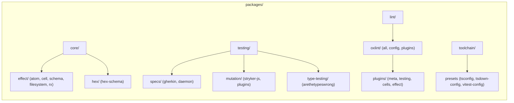

# Refactor Packages Folder Structure - Plan

## Goal Capsule

- **Objective:** Reorganize all 41 workspace packages under `packages/` into a multi-tier domain and subsystem hierarchy (`core/`, `testing/`, `lint/`, `toolchain/`), updating `pnpm-workspace.yaml`, `turbo.json`, guard scripts, CI workflows, and tsconfig references without breaking published package identities or verification gates.
- **Authority Hierarchy:**
  1. Monorepo invariant: `pnpm check:local` and `pnpm map` must pass cleanly.
  2. Package identities (`@systemfsoftware/*`) and API boundaries remain unchanged.
  3. Physical location hierarchy governs folder layout only.
- **Stop Conditions:**
  - `pnpm map` derives all 41 packages across the new directory hierarchy without missing discovery.
  - `pnpm check:local` passes with exit code 0 across all gates.
- **Tail Ownership:** The implementer updates all relative package paths across configs and scripts in dependency order.

---

## Product Contract

### Summary

Restructure all 41 packages under `packages/` into a multi-tier nested hierarchy (`packages/core/effect/*`, `packages/testing/*`, `packages/lint/oxlint/*`, `packages/toolchain/*`), placing `@systemfsoftware/all` alongside `@systemfsoftware/oxlint-config` under `packages/lint/oxlint/`, and updating all workspace mappings and guard scripts.

### Problem Frame

The current `packages/` directory has 17 top-level packages alongside 4 container directories. This creates navigation friction, blurs the boundaries between runtime libraries, testing tools, and linter plugins, and leaves over 20 oxlint plugins in a single flat directory. A deeply nested domain hierarchy organizes packages by their actual subsystem roles and architectural layers.

### Key Decisions

- **Deeply nested multi-tier hierarchy** (session-settled: user-directed — chosen over shallow 2-tier domain grouping): group packages into recursive subsystem categories (`core/`, `testing/`, `lint/`, `toolchain/`). Governs R1, R2, R3, R4, R5.
- **Hierarchical plugin categorization**: Nest oxlint plugins by concern (`meta/`, `testing/`, `cells/`, `effect/`) rather than keeping a flat plugin list. Governs R3.
- **Disentangle Testing vs Effect specs**: Group testing specifications (`effect-gherkin-spec`, `storybook-gherkin`, `effect-daemon-spec`) under `testing/specs/` rather than generic `effect/`. Governs R2.
- **Place `@systemfsoftware/all` under `packages/lint/oxlint/all`** (session-settled: user-directed — chosen over toolchain: `all` is the turnkey OxlintConfig bundle): group `all` and `config` together as oxlint configuration packages. Governs R3, R4.
- **Preserve published package names**: All npm package names (`@systemfsoftware/*`) remain untouched; only disk locations under `packages/` move. Governs R6.

### Requirements

#### Target Namespace Taxonomy

- R1. **Core runtime libraries (`packages/core/`)**:
  - `packages/core/effect/atom/atom` (`@systemfsoftware/effect-atom`)
  - `packages/core/effect/atom/atom-react` (`@systemfsoftware/effect-atom-react`)
  - `packages/core/effect/cell/types` (`@systemfsoftware/effect-cell-types`)
  - `packages/core/effect/cell/gen` (`@systemfsoftware/effect-cell-gen`)
  - `packages/core/effect/cell/type-tests` (`@systemfsoftware/effect-cell-type-tests`)
  - `packages/core/effect/schema/extensions` (`@systemfsoftware/effect-schema-extensions`)
  - `packages/core/effect/schema/law` (`@systemfsoftware/effect-schema-law`)
  - `packages/core/effect/schema/vite` (`@systemfsoftware/effect-schema-vite`)
  - `packages/core/effect/filesystem/memfs` (`@systemfsoftware/effect-memfs`)
  - `packages/core/effect/rx/rx-effect` (`@systemfsoftware/rx-effect`)
  - `packages/core/hex/hex-schema` (`@systemfsoftware/hex-schema`)

- R2. **Testing tooling and specs (`packages/testing/`)**:
  - `packages/testing/specs/gherkin/effect` (`@systemfsoftware/effect-gherkin-spec`)
  - `packages/testing/specs/gherkin/storybook` (`@systemfsoftware/storybook-gherkin`)
  - `packages/testing/specs/daemon/effect` (`@systemfsoftware/effect-daemon-spec`)
  - `packages/testing/mutation/stryker-js/*` (cli, mutation-report, mutation-run, plugin-api, typescript-checker, vitest-runner)
  - `packages/testing/mutation/plugins/stryker-plugins` (`@systemfsoftware/stryker-plugins`)
  - `packages/testing/type-testing/arethetypeswrong/*` (cli, core)

- R3. **Static analysis and linting (`packages/lint/`)**:
  - `packages/lint/oxlint/all` (`@systemfsoftware/all` — turnkey oxlint configuration & plugin suite)
  - `packages/lint/oxlint/config` (`@systemfsoftware/oxlint-config` — monorepo shared config preset)
  - `packages/lint/oxlint/plugins/meta/*` (`core`, `recommended`)
  - `packages/lint/oxlint/plugins/testing/*` (`property-testing`, `test-hygiene`, `test-placement`)
  - `packages/lint/oxlint/plugins/cells/*` (`cell-vocabulary`, `cell-imports`, `effect-kernel`, `effect-executor`, `effect-handler`, `effect-adapter`, `effect-workflow`)
  - `packages/lint/oxlint/plugins/effect/*` (`acl`, `data`, `dmmf`, `entrypoint`, `errors`, `interruption`, `middleware`, `native-equivalent`, `observer`, `schema`, `shape`, `state`, `store`)

- R4. **Toolchain presets and configs (`packages/toolchain/`)**:
  - `packages/toolchain/tsconfig` (`@systemfsoftware/tsconfig`)
  - `packages/toolchain/tsdown-config` (`@systemfsoftware/tsdown-config`)
  - `packages/toolchain/vitest-config` (`@systemfsoftware/vitest-config`)

#### Monorepo Tooling and Invariants

- R5. Update `pnpm-workspace.yaml` package patterns to recursively discover all nested packages (`packages/**`, `omp/packages/*`, `omp/plugins/*`).
- R6. Update `turbo.json` task inputs and cache boundaries to reference the new paths for `tsconfig`, `vitest-config`, `oxlint-config`, `all`, etc.
- R7. Update root guard scripts (`scripts/guards/check-project-references.mjs`, `scripts/guards/check-lint-coverage.mjs`, `scripts/guards/check-changeset.ts`, `scripts/guards/check-umbrella-completeness.mjs`, `scripts/tools/workspace-map.ts`) to adapt to new relative directory paths.
- R8. Update GitHub workflow paths (`.github/workflows/*.yml`) that filter on changed files in specific package paths.

### Scope Boundaries

- **Deferred to Follow-Up Work:**
  - Renaming `@systemfsoftware/*` npm packages.
  - Changing internal module export signatures.

---

## Planning Contract

### Key Technical Decisions

- KTD1. **Preserve repository.directory metadata in package.json**: Each moved package's `package.json#repository.directory` must be updated to its new repo-relative path (e.g. `"directory": "packages/core/effect/cell/types"`). (session-settled: user-directed) Governs R1, R2, R3, R4.
- KTD2. **Recursive Workspace Globbing in pnpm**: Configure `pnpm-workspace.yaml` to discover deeply nested packages via recursive wildcard patterns while avoiding fixture directories. Governs R5.
- KTD3. **Guard Discovery Path Normalization**: Update path prefix assertions in `check-project-references.mjs`, `check-lint-coverage.mjs`, and `check-workflow-test-adjacency.mjs` to dynamically handle nested multi-level directories under `packages/`. Governs R7.

### High-Level Technical Design

---

## Implementation Units

### U1. Update Workspace Configuration & Discovery

- **Goal:** Update `pnpm-workspace.yaml` and `scripts/tools/workspace-map.ts` to discover deeply nested packages.
- **Requirements:** R5, R7
- **Dependencies:** None
- **Files:** `pnpm-workspace.yaml`, `scripts/tools/workspace-map.ts`
- **Approach:**
  - Update `pnpm-workspace.yaml` packages list to include `packages/**`, `omp/packages/*`, `omp/plugins/*`.
  - Update `scripts/tools/workspace-map.ts` to derive packages recursively from the updated workspace patterns.
- **Test scenarios:**
  - Run `pnpm map` to verify discovery of all 41 packages across multiple nesting depths.
- **Verification:** `pnpm map` outputs 41 workspace packages with no errors.

### U2. Move Packages to New Target Directory Structure

- **Goal:** Relocate all 41 packages to their designated nested folders under `packages/`.
- **Requirements:** R1, R2, R3, R4, R6
- **Dependencies:** U1
- **Files:** `packages/**`
- **Approach:**
  - Create target directory tree: `packages/core/effect/atom`, `packages/core/effect/cell`, `packages/core/effect/schema`, `packages/core/effect/filesystem`, `packages/core/effect/rx`, `packages/core/hex`.
  - Create target directory tree: `packages/testing/specs/gherkin`, `packages/testing/specs/daemon`, `packages/testing/mutation/stryker-js`, `packages/testing/mutation/plugins`, `packages/testing/type-testing/arethetypeswrong`.
  - Create target directory tree: `packages/lint/oxlint/all`, `packages/lint/oxlint/config`, `packages/lint/oxlint/plugins/{meta,testing,cells,effect}`.
  - Create target directory tree: `packages/toolchain/{tsconfig,tsdown-config,vitest-config}`.
  - Move package directories using git mv / filesystem move.
  - Update each package's `package.json` `"repository.directory"` field.
- **Test scenarios:**
  - `pnpm install` links all packages correctly in root `node_modules`.
- **Verification:** `pnpm ls -r --depth -1` lists all 41 packages at their new paths.

### U3. Update Toolchain Configs & Turbo Tasks

- **Goal:** Update `turbo.json`, `tsconfig` project references, and toolchain presets to reflect new paths.
- **Requirements:** R6, R7
- **Dependencies:** U2
- **Files:** `turbo.json`, `packages/toolchain/tsconfig/tsconfig.node.json`, `packages/lint/oxlint/config/src/oxlint-config.base.ts`
- **Approach:**
  - Replace paths in `turbo.json` (`$TURBO_ROOT$/packages/tsconfig/...` -> `$TURBO_ROOT$/packages/toolchain/tsconfig/...`, `$TURBO_ROOT$/packages/vitest-config/...` -> `$TURBO_ROOT$/packages/toolchain/vitest-config/...`, `$TURBO_ROOT$/packages/oxlint-config/...` -> `$TURBO_ROOT$/packages/lint/oxlint/config/...`).
  - Update relative extends or imports in config presets.
- **Test scenarios:**
  - Turbo task inputs correctly resolve config inputs.
- **Verification:** `pnpm build` succeeds for all packages.

### U4. Update Monorepo Guards & GitHub Workflows

- **Goal:** Update all root guard scripts and CI workflows that scan or check package paths.
- **Requirements:** R7, R8
- **Dependencies:** U3
- **Files:**
  - `scripts/guards/check-project-references.mjs`
  - `scripts/guards/check-lint-coverage.mjs`
  - `scripts/guards/check-changeset.ts`
  - `scripts/guards/check-umbrella-completeness.mjs`
  - `scripts/guards/check-workflow-test-adjacency.mjs`
  - `scripts/guards/validate-publish-config.mjs`
  - `scripts/tools/bench-mutation.mjs`
  - `scripts/tools/consumer-smoke.mjs`
  - `scripts/tools/discover-mutation-targets.mjs`
  - `.github/workflows/storybook-gherkin-browser.yml`
  - `.github/workflows/reusable-checks.yml`
- **Approach:**
  - Update path prefixes and discovery filters in each guard script (e.g. `packages/oxlint-plugins/` -> `packages/lint/oxlint/plugins/`, `packages/stryker-js/` -> `packages/testing/mutation/stryker-js/`, `packages/all/` -> `packages/lint/oxlint/all/`).
  - Update GitHub workflow path triggers for moved packages.
- **Test scenarios:**
  - `pnpm check:local` executes all guards and passes.
- **Verification:** `pnpm check:local` exits 0.

---

## Verification Contract

- `pnpm map` — verifies all 41 workspace packages are recognized across nested directories.
- `pnpm check:local` — runs the entire local verification suite (`check-project-references`, `check-lint-coverage`, `check-changeset`, `check-umbrella-completeness`, `build`, `typecheck`, `lint`, `test`, `attw`).

---

## Definition of Done

- All 41 packages are moved to their target directories under `packages/core/`, `packages/testing/`, `packages/lint/`, and `packages/toolchain/`.
- All `package.json` `repository.directory` fields match their new paths.
- `pnpm install` and `pnpm map` derive the workspace structure cleanly.
- `pnpm check:local` passes completely with exit code 0.
