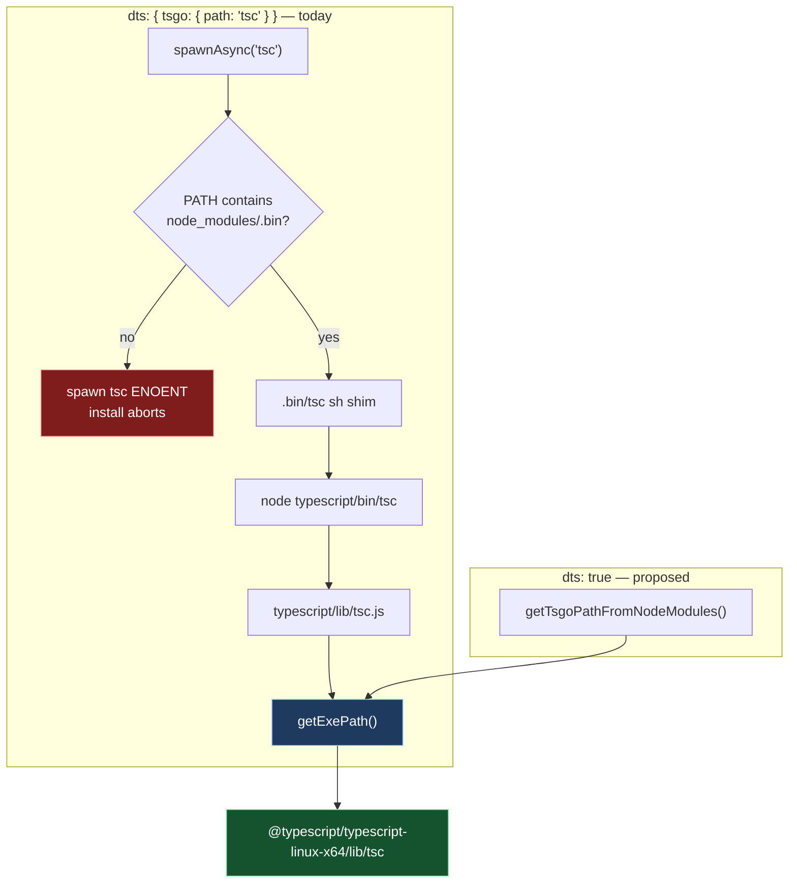

# fix: locate the attw CLI's dts compiler by module resolution, not PATH

## Goal Capsule

`packages/testing/type-testing/arethetypeswrong/cli/tsdown.config.ts:10` pins the declaration
compiler by bare command name — `dts: { tsgo: { path: 'tsc' } }`. `rolldown-plugin-dts` uses a
supplied `tsgo.path` verbatim, so the build spawns the string `tsc` and lets the OS search `PATH`.
`tsc` is on `PATH` only while `node_modules/.bin` is, which is not guaranteed at the moment a
workspace package's `prepare` script runs against a freshly recreated module tree. When it is
absent the build dies with `spawn tsc ENOENT` and takes the whole `pnpm install` — and therefore
whatever `pnpm` script triggered it — down with it.

Delete the pin. The plugin then resolves the compiler through module resolution to an absolute
path: same generator, same binary, no `PATH`. The lookup also stops being steerable by whoever
controls the calling shell's `PATH` and becomes fixed by the lockfile and the dependency graph.

**Execution profile:** one-line configuration change to a publishable package, plus a release
intent and a solution doc. No runtime code changes.

---

## Problem Frame

A `corepack pnpm format` aborted mid-install; an immediate re-run succeeded. The report is
reproduced verbatim in **Sources & Research**. The chain, end to end:

1. `pnpm format` triggered pnpm's deps-status check, which purged and recreated `node_modules`.
   `pnpm-workspace.yaml:98-99` sets `config: confirm-modules-purge: false`, which auto-answers the
   purge prompt; the repo defines no `verify-deps-before-run` setting and has no root `.npmrc`, so
   the check itself is pnpm 11 default behaviour.
2. That install runs each workspace package's `prepare`.
   `packages/testing/type-testing/arethetypeswrong/cli/package.json:25` is `"prepare": "tsdown"`.
3. `tsdown.config.ts:10` sets `dts: { tsgo: { path: 'tsc' } }`. tsdown does not read, validate, or
   rewrite `tsgo` — it spreads the whole `dts` object into the plugin, intercepting only
   `cjsReexport` (`repos/tsdown/src/features/rolldown.ts:131-153`).
4. The plugin takes a supplied path verbatim rather than resolving one:
   `if (tsgoPath) { tsgo = tsgoPath }` (`rolldown-plugin-dts/dist/index.mjs:82-85`), then
   `spawnAsync(tsgo, args)` (`:108`). The spawned argument is the bare string `tsc`.
5. Bare `tsc` resolves only through `PATH`. Measured in this tree: `command -v tsc` exits 1 with
   the ambient environment and exits 0 printing `node_modules/.bin/tsc` when `node_modules/.bin` is
   prepended. pnpm supplies that directory to lifecycle scripts; on a recreated tree it is not yet
   populated when the package prepares run.
6. `spawn tsc ENOENT` → the `prepare` fails → `pnpm install` exits 1 → the `format` the user asked
   for never runs.

Two consequences make this worth fixing rather than re-running:

- **The blast radius is not confined to `install`.** The failing command was a formatter. Any
  `pnpm <script>` that trips the deps-status check can trigger the reinstall and this abort.
  _How often that check trips is not measured here_ — the single observed occurrence is a formatter
  run, and no frequency claim in this plan rests on more than that.
- **A tolerated install leaves a permanently broken bin, and a re-run is not a repair.**
  `bin.attw` points at gitignored `dist/main.mjs`. pnpm links workspace bins twice per install and
  **never retries a skipped shim** — `--force`, a repeat `--frozen-lockfile`, `pnpm rebuild`, and
  deleting `.modules.yaml` were each tried and each failed to repair one
  (`docs/solutions/build-errors/pnpm-bin-shim-skipped-for-gitignored-build-target.md:46-49`).
  A later `pnpm build` does not help: building `dist/` creates no bin shim. The same class of
  skipped shim previously left the mutation gate reporting success for weeks while the mutator
  never ran (`:23`, `:27-33`).

### What is _not_ wrong

The first-pass reading was that a build has no business running during `install`, so `prepare:
tsdown` should go. **Research refuted that and it is rejected** — see KTD1.

---

## Product Contract

### Summary

Remove a bare-name compiler pin from one tsdown config so the declaration build locates its
compiler deterministically — and unspoofably — instead of through a `PATH` that is not reliably
populated when the build runs.

### Requirements

| ID | Requirement                                                                                                                                      | Owner | Verified by                     |
| -- | ------------------------------------------------------------------------------------------------------------------------------------------------ | ----- | ------------------------------- |
| R1 | A from-scratch install — including the purge-and-recreate path — completes on the **first** pass, with the attw CLI's `prepare` build succeeding | U1    | V0, V1                          |
| R2 | The dts build locates its compiler without consulting `PATH` and without depending on pnpm's bin-link ordering                                   | U1    | V1, plus the KTD2 derivation    |
| R3 | `prepare` remains on every package whose `bin` targets gitignored build output; the bin-shim mechanism is untouched                              | U1    | V1 (`.bin/attw` present), DoD 2 |
| R4 | The attw CLI's emitted declarations are byte-identical to those produced before the change, compiler state held constant                         | U1    | V2                              |
| R5 | A published tarball still carries a populated `dist`                                                                                             | U1    | V3 (`gate:dist`), V4            |
| R6 | A release intent accompanies the change, per REPO-R2                                                                                             | U2    | V5                              |

### Scope Boundaries

**In scope**

- `packages/testing/type-testing/arethetypeswrong/cli/tsdown.config.ts` — one line
- A `.changeset/` intent
- A solution doc recording the install-context finding

**Out of scope, with the reason each was rejected**

- **Removing `prepare: tsdown`.** Rejected — KTD1.
- **`packages/testing/mutation/stryker-js/cli`.** It carries the same `prepare: tsdown` but
  `tsdown.config.ts:16` sets `dts: false`, so it spawns no compiler and cannot exhibit this
  failure. It has no `prepack`, but `pack` runs `prepack` _then_ `prepare`
  (`docs/solutions/build-errors/pack-lifecycle-hooks-mutate-dist-mid-gate.md:28`), so `prepare`
  already covers its pack-time `dist`. Nothing to change.
- **Any other tsdown config.** Measured, not assumed: across `packages/`, `omp/`,
  `agent-plugins/`, and `scripts/`, exactly one `tsdown.config.ts` contains a `tsgo` key at all —
  the one this plan edits. Of the 44 tsdown configs tracked in the workspace, no other pins a
  binary by name. Every remaining `tsgo` match in the tree is a `lint:tsgo` script (`effect-tsgo
  diagnostics`), the unrelated `oxlint-tsgolint` engine, the `@effect/tsgo` devDependency, the
  patch script, or prose. **This fix is therefore complete, not partial** — see Sources & Research
  for the command.
- **Computing an absolute compiler path inside the config.** Rejected — KTD2.
- **`node-linker=hoisted` in `.npmrc`**, so bins land somewhere already on `PATH`. Rejected on
  proportion and reversibility: it changes module resolution for all 43 workspace projects to fix
  one config line, and a workspace-wide linker change is exactly the costly-to-reverse choice
  REPO-W8 says must be researched rather than defaulted into. Deleting one key is not.
- **Reordering the tsgo patch relative to package prepares.** Unnecessary once resolution stops
  depending on ordering, and the ordering is pnpm-internal.
- **A gate forbidding bare-name binary pins.** KTD3 — and see the open question there.
- **The unpatched-compiler window during install.** Named in Assumptions and recorded in U3, not
  fixed here.

---

## Planning Contract

### Key Technical Decisions

**KTD1: Fix where the compiler is _found_, not the fact that a build runs during install.**

The constraint, stated directly rather than borrowed: `bin.attw` targets gitignored
`dist/main.mjs`; pnpm links workspace bins in two passes and never revisits a shim it skipped; so
**`prepare` must exist, must build `dist/main.mjs`, and must not itself depend on anything pnpm has
not yet linked.** `pnpm-bin-shim-skipped-for-gitignored-build-target.md:99-104` tabulates those
three phases — link pass 1 warns and skips, `prepare` builds, link pass 2 succeeds.

Two candidate removals are closed by prior art, and it is worth being precise about what that prior
art actually establishes. `pack-lifecycle-hooks-mutate-dist-mid-gate.md:67` records deleting
`prepack`/`prepare` as tried and **"Forbidden by package leaf rules"**, and its solution keeps them
"in the manifests untouched" (`:49`) — that forbids _removing the hook_. The committed-shim
alternative is closed separately: the `entrypoint-not-imported` rule forbids importing a built
entrypoint and the oxlint config-guard refuses the exemption (`:51-53`).

Neither of those says the build inside `prepare` must find its compiler on `PATH`. That is not a
constraint at all — it is the defect. The constraint is the third clause above, and this change is
the minimal way to satisfy it.

**KTD2: Delete the pin (`dts: true`) rather than computing an absolute path in the config.**

Both routes reach the identical binary through the identical function, so the pin buys nothing:

- Pinned: `tsc` → `node_modules/.bin/tsc` (sh shim) → `typescript/bin/tsc:2` →
  `typescript/lib/tsc.js:3,6` → `getExePath()` → `@typescript/typescript-linux-x64/lib/tsc`, which
  `lib/tsc.js:11,19` then `execve`s.
- Unpinned: `index.mjs:86` → `getTsgoPathFromNodeModules()` → `:76` imports that **same**
  `lib/getExePath.js` and calls it → same absolute path.

The pin therefore adds a `PATH` dependency and two process hops for zero behavioural difference.
Computing the path by hand in `tsdown.config.ts` would duplicate `getExePath` logic the plugin
already calls; deleting the key is strictly less code for the same result.

**The generator is preserved, but conditionally — and the condition is load-bearing.** With
`dts: true`, tsdown resolves the dts options to `{}` (`repos/tsdown/src/config/options.ts:193`,
`resolveFeatureOption(dts, {})`), so `tsgo` is `undefined` when the plugin selects its generator.
The selection is a four-branch chain at `index.mjs:1316-1321`:

| Branch  | Condition                                        | Result                               |
| ------- | ------------------------------------------------ | ------------------------------------ |
| `:1316` | `tsgo && !customLanguages.length`                | `tsgo` — **fires today via the pin** |
| `:1317` | `oxc \|\| compilerOptions?.isolatedDeclarations` | `oxc`                                |
| `:1318` | `isTS70Installed()`                              | `tsgo`                               |
| `:1321` | otherwise                                        | `tsc`                                |

Today the pin makes `:1316` fire and `:1317` is never evaluated. Removing the pin newly exposes
`:1317`. Verified for this package: the config sets no `oxc`, and `isolatedDeclarations` appears
nowhere in its tsconfig chain — `tsconfig.build.json` → `tsconfig.json` →
`@systemfsoftware/tsconfig/tsc/dom/library-monorepo`, which declares no further `extends`. So
`:1317` is falsy, `:1318` fires because TypeScript 7 is installed, and the generator stays `tsgo`.
`:1324` then requires a tsconfig, which the config supplies; `:1335` normalises `tsgo` to `{}`, so
`tsgo.path` at `:149` is `undefined` and `:86` takes the resolving branch.

**The consequence for the future:** after this change, enabling `isolatedDeclarations` in the
_shared_ `library-monorepo` preset would silently switch this package's generator from `tsgo` to
`oxc` and change its emitted declarations. That is a new coupling this change introduces, and it is
recorded in U3 for exactly that reason.

**A security note, since the plan's rationale is otherwise only determinism.** A `PATH` lookup
during `pnpm install` resolves against an environment-controlled, order-dependent search path:
anyone able to prepend a directory to the calling shell's `PATH` can make `prepare` spawn their
`tsc` and emit declarations of their choosing. Module resolution is fixed by the dependency graph
and the lockfile and offers no such seam. The change moves the lookup off the steerable path.

_Warrant note._ Other tsdown configs in this tree use `dts: true`, but per REPO-W7 that is **not**
the argument — it is evidence the form is exercised, not a reason it is right. The warrant is the
resolution-path derivation above.

**KTD3: Add no gate — and the argument has to survive this repo's own counter-example.**

CONST-E3 requires a gate to name the mistake it prevents and be priced against every gate already
present. The naive argument is that this failure aborts `pnpm install` and names the offending
package, so it is loud enough to be its own check. **That argument is not sufficient on its own**,
because the Problem Frame cites a neighbour in this very repo where a missing binary produced weeks
of green CI.

The disanalogy is real and is the actual warrant. That neighbour was silent because the surface
consuming it is **advisory by construction** — `merge-mutation-reports.mjs` never exits on a score,
so a missing mutator could not fail anything (REPO-D3). An install is the opposite: `pnpm install`
exits non-zero, and every workflow and every `pnpm` script in this repo is downstream of it. There
is no advisory consumer of an install failure to swallow this one, which is why the user saw it
immediately rather than in six weeks. A gate would also be an Evaluator-surface change requiring
its own commit observed red-then-green (CONST-E4), and the repo has been moving the other way
(`77bd5f6adb9` "remove custom guard scripts").

**Open question for the user.** If you want the belt-and-braces gate anyway, the cheap form is an
assertion that the attw CLI's `dist/main.mjs` exists after a fresh install. It is one check against
a proven-expensive silent failure, and it is the one place a reasonable person could overrule this
KTD. It would ship as its own commit.

**KTD4: `--bump none`.**

`package.json` and `tsdown.config.*` are both `build` task inputs (`turbo.json:18-19`), so the hash
moves and REPO-R2 requires an intent. Nothing a consumer observes changes: same generator, same
compiler, same emitted declarations (R4/V2 prove it). That is REPO-R2's canonical `none` class.

### Assumptions

- **The platform compiler package is on disk before lifecycle scripts run.** `getExePath` resolves
  `@typescript/typescript-linux-x64` and `existsSync`-checks the exe, throwing
  `Executable not found: <abs path>` if absent. Supporting evidence: root `package.json:49` carries
  `typescript: "catalog:"` as a devDependency, so the package is in the graph rather than incidental;
  the installed plugin cell is keyed `…_typescript@7.0.2`; and the shipped compiler is present in
  this tree as the 24,101,026-byte `lib/tsc.original` left behind by `effect-tsgo patch`. Against
  it: the plugin marks `typescript` an _optional_ peer, so the plugin alone does not force the
  ordering, and pnpm's extraction-versus-linking order is not derivable from anything in this repo.
  If the assumption is wrong the failure mode changes from an opaque `spawn tsc ENOENT` to a named
  absolute path. **This is the plan's first residual risk; V1 is its falsifying test.**
- **`isolatedDeclarations` stays off in the shared tsconfig preset.** Load-bearing per KTD2. If it
  is ever enabled in `library-monorepo`, this package's generator changes and R4 no longer holds.
- **Install-time and post-`turbo build` declarations come from different compilers.** Root
  `prepare` runs `patch-tsgo-if-needed.mjs` (`package.json:20`) and the observed ordering puts it
  _after_ package prepares, so install-time declarations are emitted by the shipped compiler while
  a later `turbo build` uses the patched one. Those artifacts are overwritten by the first
  `turbo build`, which is keyed on the patch script via `turbo.json:3-5` `globalDependencies`, and
  every task that reads a sibling's `dist` is ordered after a build. **This is the plan's second
  residual risk**, and its direct consequence is that R4 is only meaningful with the compiler state
  held constant — which is why V2 pins the build command and forbids comparing across an install.
  Recorded in U3, not fixed here.
- **[INFERENCE]** CI has not hit this because a clone into an empty `node_modules` links bins in a
  different order than a purge-and-recreate of a populated tree. Not established; the fix makes the
  distinction moot, which is why it is not worth establishing.

### Corpus check

Per the plan-write rule, the software wiki was queried before this document was written, with
`intent`: _"Deciding whether to remove a bare-name binary path pin from a bundler dts config, where
a package build runs during pnpm install to create a gitignored bin target between pnpm's two
bin-link passes"_, across lex, vec, and hyde sub-queries against the `software-wiki` collection.
**Nil result.** The top-ranked page covers `exports`-map resolution ordering and TS2307 — module
resolution for _imports_, not location of a toolchain _binary_. The corpus does not settle this
question.

---

## High-Level Technical Design

Both configurations converge on one binary. The pin only decides whether `PATH` is consulted on the
way there.



The install timeline the fix must survive, from
`pnpm-bin-shim-skipped-for-gitignored-build-target.md:99-104` plus the root `prepare`:

| Phase                     | Effect                                                | Compiler available via `PATH`?       |
| ------------------------- | ----------------------------------------------------- | ------------------------------------ |
| Link pass 1               | `dist/main.mjs` absent → warn, shim skipped           | not guaranteed                       |
| package `prepare: tsdown` | **builds `dist/main.mjs` — spawns the compiler here** | **not guaranteed → today's failure** |
| Link pass 2               | target exists → `.bin/attw` created                   | —                                    |
| root `prepare`            | `husky`; `patch-tsgo-if-needed.mjs` patches `lib/tsc` | —                                    |

---

## Implementation Units

### U1. Drop the bare-name compiler pin

**Goal:** the dts build resolves its compiler by module resolution instead of `PATH`.

**Requirements:** R1, R2, R3, R4, R5

**Dependencies:** none

**Files:**

- `packages/testing/type-testing/arethetypeswrong/cli/tsdown.config.ts`

**Approach:** replace `dts: { tsgo: { path: 'tsc' } }` (line 10) with `dts: true`. Change nothing
else — `entry`, `format`, `clean`, `outExtensions`, `tsconfig`, and `deps.neverBundle` all stay, and
`prepare` stays on the manifest (R3 holds by exclusion). The `tsgo` generator still requires a
tsconfig (`index.mjs:1324`) and the config already supplies `tsconfig: './tsconfig.build.json'`.

**Execution note:** V2 is a characterization check, so capture the pre-edit hashes **before**
touching the file, using the exact command V2 names. There is no second chance to sample the old
state without reverting.

**Test scenarios:** none — no observable behaviour is added or changed, and R4/V2 assert byte
equality of the build output. A test asserting a config literal would restate the diff.

**Verification:** V0, V1, V2, V3.

### U2. Ship the release intent

**Goal:** satisfy REPO-R2 for a change that moves a publishable package's `build` hash.

**Requirements:** R6

**Dependencies:** U1

**Files:**

- `.changeset/<generated>.md`

**Approach:** `pnpm change --bump none`. Body per REPO-R3 — written for someone who installed the
package from a registry and has never seen this repository. Since no consumer-observable behaviour
changes, the honest body says so in a sentence and names nothing about module paths, gates, hooks,
lifecycle scripts, or this plan.

**Test expectation: none** — release metadata.

**Verification:** V5.

### U3. Record the install-context finding

**Goal:** record three things a future reader cannot re-derive cheaply: that a lifecycle build which
legitimately runs during `install` must not resolve its tools through `PATH`, because
`node_modules/.bin` is populated _around_ it rather than before it; that this package's generator
selection is now conditional on `isolatedDeclarations` staying off in a shared preset; and that
install-time declarations come from a different compiler than post-build ones.

**Requirements:** none — Doctrine surface, never an input to a gate.

**Dependencies:** U1

**Files:**

- `docs/solutions/build-errors/<slug>.md`

**Approach:** the existing pair of docs draws the install / publish / analysis context line for
lifecycle _hooks_; this adds the tool-_location_ axis. Cross-link both siblings, which name each
other already (`pack-lifecycle-hooks-mutate-dist-mid-gate.md:81`). Per ADOC-A4 every claim cites the
file and line it came from; per ADOC-A12 the prevention notes stay one-liners.

_On why this is a doc and not a rule:_ the durable content here is a **diagnosis** — three
mechanisms and their evidence — not an instruction to a future agent. A rule saying "never pin a
bare binary name" would need an enforcement gate to be worth its context (OP7, ADOC-A12), and KTD3
declines that gate. A solution doc is the surface this repo already uses for a diagnosis whose value
is being findable when the symptom recurs, and this session is the evidence it works: the two
sibling docs are what made this bug diagnosable at all.

**Test expectation: none** — documentation.

**Verification:** V6.

---

## Verification Contract

**V0 — observe the failure first.** Before U1, from a clean tree with the pin still present:

```
rm -rf node_modules && corepack pnpm install
```

Expected: **non-zero exit**, with `spawn tsc ENOENT` attributed to the attw CLI's `prepare`. This is
the step that turns "where it currently fails" from a citation into an observation, and it is the
only way R1's premise is demonstrated rather than borrowed. If V0 comes up green, **stop** — the
failure is conditional on something this plan has not identified, and the diagnosis is incomplete.

**V1 — the paired green run.** After U1, the identical command must exit 0, with the attw CLI's
`prepare` build completing and `node_modules/.bin/attw` present afterwards (proving link pass 2
succeeded, R3). A faithful reproduction of the install-order class is a fresh clone
(`pnpm-bin-shim-skipped-for-gitignored-build-target.md:116`), so if V0/V1 disagree with the report
on the working tree, repeat both in a `git clone --no-hardlinks` checkout.

V0 and V1 each delete and refetch the module tree and cost minutes. They are destructive to local
state and must be run deliberately.

**V2 — R4, byte equality with the compiler state held constant.** The pre- and post-edit samples
MUST come from the same build command against the same `node_modules` state, because an install-time
build and a `turbo build` use different compilers (see Assumptions) and would differ for reasons
that have nothing to do with the pin:

```
pnpm --filter @systemfsoftware/arethetypeswrong-cli build
find packages/testing/type-testing/arethetypeswrong/cli/dist -name '*.d.ts' -print0 \
  | sort -z | xargs -0 sha256sum
```

Run that pair with the pin in place, apply U1, run it again, compare. Record the `tsdown` and
`rolldown-plugin-dts` versions alongside the hashes — the derivation is pinned to the versions on
disk, so a float invalidates the comparison rather than the conclusion. **Do not** take the "after"
sample from V1's install: its `prepare` runs the unpatched compiler. Any difference falsifies KTD2
and stops the change.

**V3 — the whole gate, after the last edit, per REPO-D1.** This also covers R5: `check:local` runs
`gate:dist` (`turbo build`) and the `attw` task, so an empty or broken `dist` fails here.

```
pnpm check:local
```

**V4 — R5 directly, if V3's `attw` task is not considered sufficient.** `pnpm --filter
@systemfsoftware/arethetypeswrong-cli pack` and confirm the tarball carries a populated `dist/`.
`prepack: pnpm build` (`package.json:33`) is what fills it.

**V5 — the release-intent gate.** `changeset-check` decides whether an intent was required from the
turbo hash verdict; it must pass on the PR.

**V6 — the solution doc exists, is cross-linked from both siblings, and every claim in it cites a
file and line.** Review, not a command.

**V7 — CI.** `gh pr checks --watch --fail-fast` exits 0. `no checks reported` immediately after
create is the registration race: sleep and re-poll, never re-push, because `cancel-in-progress:
true` means a re-push cancels the run being awaited (REPO-D2).

No mutation run. REPO-D3 forbids an agent starting one; the merged Mutation workflow report carries
that verdict.

---

## Definition of Done

1. V0 observed red before any edit, with the `spawn tsc ENOENT` attribution captured.
2. `tsdown.config.ts` uses `dts: true`; no bare-name binary pin remains in that config.
3. `prepare: tsdown` is still present on the attw CLI and on `stryker-js/cli` — R3 holds, and a
   diff that removes either is wrong.
4. V1 passes: the same install completes on the first pass and `.bin/attw` exists.
5. V2 passes: declarations byte-identical, both samples from the same build command and compiler
   state, with tool versions recorded.
6. V3 `pnpm check:local` exits 0, run after the last edit.
7. A `none`-bump changeset is present and V5 passes.
8. The solution doc is committed and satisfies V6.
9. Delivered as a PR watched to green (V7). Merging stays human, per REPO-P1.

---

## Risks

| Risk                                                                                                                        | Test | Mitigation                                                                                                                                                                                                         |
| --------------------------------------------------------------------------------------------------------------------------- | ---- | ------------------------------------------------------------------------------------------------------------------------------------------------------------------------------------------------------------------ |
| The platform compiler package is also unavailable at that point, so removing the pin only changes the error text            | V1   | The new failure names an absolute path (`Executable not found: <abs path>`) instead of a bare word, so the follow-up is diagnosable rather than mysterious. First residual risk in Assumptions                     |
| `dts: true` selects a different generator via `index.mjs:1317`, changing emitted declarations                               | V2   | Verified falsy today — no `oxc`, no `isolatedDeclarations` in the tsconfig chain. Recorded in U3 as a standing coupling, because a change to the _shared_ preset would flip it                                     |
| V2 compares across two different compilers and falsifies R4 spuriously, or passes vacuously by hashing the same files twice | V2   | V2 pins one build command for both samples and forbids sampling from V1's install                                                                                                                                  |
| Scope creep into removing `prepare`                                                                                         | —    | Rejected in KTD1; asserted as DoD item 3                                                                                                                                                                           |
| The fix is partial because another config carries the same pin                                                              | —    | Measured: exactly one `tsdown.config.ts` in the workspace contains a `tsgo` key. Command in Sources & Research                                                                                                     |
| The vendored tsdown read does not describe installed behaviour                                                              | —    | Vendored `repos/tsdown` is **0.22.14**, the exact installed version. `rolldown-plugin-dts` is not vendored (`subtrees.toml`), so its built dist is the sanctioned source under REPO-W4's absent-from-`repos/` case |

---

## Sources & Research

**The report.** First `corepack pnpm format`: `Recreating .../node_modules`, `Packages: +902`, then
`.../type-testing/arethetypeswrong/cli prepare$ tsdown` →
`[plugin rolldown-plugin-dts:generate] Error: spawn tsc ENOENT` → `[ELIFECYCLE] Command failed with
exit code 1`, with `runDepsStatusCheck` in the stack. Second run: `Already up to date`, the same
`prepare` succeeding and emitting five files, then
`. prepare$ concurrently "husky" "node scripts/tools/patch-tsgo-if-needed.mjs"` →
`Patched typescript at .../lib/tsc`. That last line places the patch _after_ the package prepares
and proves the pre-patch compiler differed from the packaged one.

**Measured in this tree.** `command -v tsc` exits 1 ambient, exits 0 printing
`node_modules/.bin/tsc` with `node_modules/.bin` prepended. `@typescript/typescript-linux-x64/lib/`
holds `tsc` 30,011,554 B (patched), `tsc.original` 24,101,026 B (shipped), `tsc.sig`. The
completeness check for scope, measured two independent ways: `git ls-files | grep -c
'tsdown\.config\.ts$'` returns 44 tracked configs, and `git grep -l "tsgo" -- '*tsdown.config.ts'`
returns exactly one file — `packages/testing/type-testing/arethetypeswrong/cli/tsdown.config.ts`,
at line 10. A broader `tsgo` search across `packages`, `omp`, `agent-plugins`, `scripts`,
`turbo.json`, and the root `package.json` surfaces no other config-file hit.

**Archaeology — how the pin got here, and what that does and does not license.**
`docs/plans/2026-07-19-002-refactor-remove-tsgo-update-tsdown-plan.md:32` made it requirement R1 to
replace `dts: { tsgo: { path: 'tsc' } }` with `dts: true` across 8 configs, and `:101-108` lists
them — the attw CLI is not among them. Commits `e47877225dd` and `167fe0c73a3` "build(deps): drop
tsgo, bump tsdown and oxlint" landed **2026-07-19**; `ac9f093a605` "feat(repo): fork
arethetypeswrong with attw type-check tooling" landed **2026-07-20** and _added_
`packages/arethetypeswrong/cli/tsdown.config.ts` as a new 25-line file carrying the pin. So the pin
entered one day after the pattern was abolished, in a commit whose message gives no reason for it.

**That history is corroborating context, not the warrant.** Absence of a stated reason is not proof
there was none, and this plan does not need it to be: the case for the change is KTD2's
resolution-path derivation, which holds whether the pin was deliberate or accidental. Two branches
are worth closing explicitly. If the pin were deliberate for some in-repo purpose, that purpose is
unrecorded and unreachable, and KTD2 shows it achieves nothing the unpinned form does not. If it
were inherited from the project this package was forked from, **REPO-O1 settles it**: every package
under `packages/` is owned outright, "a ported or forked package's origin is history, never
governance: do not defer to an original project… do not preserve mergeability with one, do not label
one 'upstream'." `arethetypeswrong` is absent from `subtrees.toml`, so it is not vendored
third-party code and no upstream-compatibility obligation exists to weigh.

**Doctrine consulted.** `pnpm-bin-shim-skipped-for-gitignored-build-target.md` (why `prepare`
exists; the false-green mutation gate; the never-retried shim) and
`pack-lifecycle-hooks-mutate-dist-mid-gate.md` (install / publish / analysis contexts; deleting the
hooks recorded as forbidden).

**Publish path.** `.github/workflows/release.yml:130` runs `corepack pnpm build` before `:136`
`corepack pnpm publish -r`, and `prepack: pnpm build` is present on the attw CLI
(`package.json:33`) and core (`:36`). R5 is unaffected by this change, which touches neither hook —
V3/V4 confirm rather than assume it.

**Research method, and what it did not cover.** Four read-only research slices ran in parallel;
three returned. The git-archaeology slice failed — the agent had no shell tool and could not run
`git log` — so that work was done in-thread, which means its conclusions were not produced in an
independent context. The plan was then reviewed by four dispatched persona reviewers (coherence,
feasibility, security, adversarial); their accepted findings are folded in above. The cross-model
peer pass that `ce-doc-review` specifies for the security and adversarial lenses **did not run** —
no sanctioned external route is configured in this harness — so no finding here is promoted on
cross-model agreement. The `index.mjs:1317` generator branch documented in KTD2 was found by
re-verifying the reviewers' claims rather than by any reviewer.
