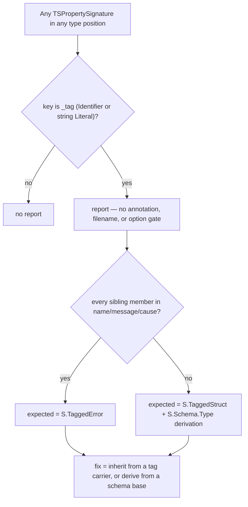

# Reintroduce the `no-manual-tag-member` oxlint rule (no escape hatch)

## Goal Capsule

- **Objective.** Ship an oxlint rule in `@systemfsoftware/oxlint-plugin-effect-schema` that forbids a `_tag` property signature in every type position, with **no options, no allowlist, no per-package disable, and no filename gate**, and migrate all seven in-repo sites to derived tags. The rule is a pure prohibition: the only way to satisfy it is to stop hand-writing the member.
- **Product authority.** Repository owner, this session: an `allow` list and a package `off` were both rejected as cheating. Grounded in `CONSTITUTION.md` `CONST-E1` (prefer the gate), root `AGENTS.md` `REPO-A4` (a type binds only where something forces the constructor), `CHK1` (a check keyed on a value its own author supplied certifies nothing), and the wiki's `rule-polarity` `A6` — a gate that can be satisfied by writing a declaration is unverifiable by construction.
- **Open blockers.** None. Every "cannot migrate" claim in the prior revision was falsified this session by a compiling probe (see Proven Migration Patterns).
- **Execution profile.** Code. The rule lands unregistered, all seven sites migrate, then registration flips it to `error`; no intermediate commit lints red.
- **Stop conditions.** A `_tag` declaration is found that no derivation expresses (none known — the probe covers all five shapes present); the whole-tree scan reports a site absent from the disposition table.
- **Tail ownership.** This plan opens a PR and drives CI to green; publish is human-controlled (`REPO-P1`).

---

## Product Contract

### Summary

`no-manual-tag-member` shipped from 2026-08-09 to 2026-08-16 and was deleted as collateral in the cell-suffix-fleet refactor; its only fatal defect was keying on the defunct `.shape.ts` suffix. It returns here in its strongest form: **a `_tag` property signature may not appear in any type position — no exceptions, no options, no configuration.**

The prior revision of this plan carried a per-name `allow` list, then a per-package `off`. Both were rejected: an escape hatch an agent can reach for converts the rule from a negative constraint into a positive directive ("declare a reason"), which passes while the forbidden tag stands. What made both look necessary was the belief that six of the seven sites could not migrate — five behind a package `off`, one behind a `.tst.ts` filename gate. That belief is false. **The `_tag` literal never participates in what makes those types hard** — recursion, prototype methods, and unencodable fields all live in _other_ members — so the tag is always derivable, and the hard members stay hand-written next to it.

All seven in-repo sites migrate. In-repo effect is seven conversions and zero suppressions.

### Problem Frame

The class form is already banned (`no-manual-tag-property`). The type form is not: `type Route = { readonly _tag: 'Reachable' } | { readonly _tag: 'Unavailable' }`, `interface Success { readonly _tag: 'Success' }`, and `(o: O) => { _tag: 'Stream' }` all hand-declare the discriminant. A hand-declared tag derives no schema: no encode/decode, no generated laws, no arbitrary, and a tag string that can drift from — or never meet — the schema that owns it.

A rule with an annotation-shape exemption is evadable in one keystroke: `_tag: string`, `_tag: 'A' | 'B'`, and `_tag: typeof T` are all trivially reachable rewrites for an agent facing the error. Since derivation covers every legitimate shape, the honest rule admits no annotation exemption either.

### Proven Migration Patterns

Verified this session against `effect@4.0.0-rc.108` (`S.Codec`, `S.Schema.Type`, `S.TaggedStruct`) with a probe that compiled at `EXIT=0` under the package's own `tsc --noEmit`, then deleted. `S.TaggedStruct` is `repos/effect/packages/effect/src/Schema.ts:6183`; `Struct.fields` is documented at `:3474-3486` — _"Spread them into a new struct to reuse fields across schemas."_

| #  | Shape                                             | Pattern                                                                                                                                                                                                                                                                                            | Hand-written `_tag` |
| -- | ------------------------------------------------- | -------------------------------------------------------------------------------------------------------------------------------------------------------------------------------------------------------------------------------------------------------------------------------------------------- | ------------------- |
| P1 | recursive schema anchor                           | `const BinaryBase = S.TaggedStruct('Binary', { op: S.String })`; `type Binary = S.Schema.Type<typeof BinaryBase> & { readonly left: Expr; readonly right: Expr }`; `const Binary: S.Codec<Binary> = S.suspend((): S.Codec<Binary> => S.Struct({ ...BinaryBase.fields, left: Expr, right: Expr }))` | none                |
| P2 | runtime value ADT with a prototype                | `const InitialTag = { _tag: 'Initial' } as const`; `type InitialTag = typeof InitialTag`; `interface Initial<A, E> extends Proto<A, E>, InitialTag {}`; the constructor spreads `...InitialTag`                                                                                                    | none                |
| P3 | fields no schema represents                       | P2 verbatim — the tag derives even when the payload (a function, a stream, a `Duration.Input`) never can                                                                                                                                                                                           | none                |
| P4 | schema exists, one field must stay wider          | `type RunRequest = Omit<S.Schema.Type<typeof RunRequestSchema>, 'options'> & { readonly options: StrykerOptions }`                                                                                                                                                                                 | none                |
| P5 | type-test fixture that may hold no runtime values | tag carriers live in a sibling module; the fixture does `import type { CmdTag } from './fixtures.js'` and `interface Cmd extends CmdTag {}` — a type-only import emits nothing at runtime                                                                                                          | none                |

Two facts the probe established that constrain the implementation:

- `interface X extends typeof SomeConst` is **invalid syntax** (TS1109). The carrier needs a named type alias — `type InitialTag = typeof InitialTag` — which is the idiom already at `BoundedUnion.ts:115`.
- Narrowing survives an inherited tag: `Match.value(r).pipe(Match.tag('Initial', …), Match.tag('Success', …), Match.tag('Failure', …), Match.exhaustive)` compiles for both a generic and a concrete instantiation. `Match.exhaustive` is the proof — it fails to compile unless the derived tags are real discriminants. That is the repo's own form (`BoundedUnion.ts:159-167`, `BuildWorkerLoop.ts:189-194`).
- The skill's `V1` holds: a structurally wrong nested literal is still a compile error under P1, so the recursive branch is genuinely typed, not `any`.

### Requirements

**Detection**

- R1. The rule reports every `TSPropertySignature` whose key is `_tag` (`Identifier` or string `Literal`) in **any** type position — a type alias, an interface body, an inline union member, a standalone type literal, a function's return-type annotation, a generic argument — regardless of `readonly`/optional modifiers and regardless of the annotation's shape (`'A'`, `string`, `'A' | 'B'`, `typeof T`, or absent).
- R2. Not reported, because they are not type positions: object expressions and every other value-space `_tag` (this is where the migrated tag lives); class property definitions (`no-manual-tag-property` owns them); a method _named_ `_tag`; a `'_tag'` string used as a type argument (`Omit<X, '_tag'>`), which is a literal type, not a property signature.
- R3. No options. No `allow`, no `expected`/`fix` override, no severity knob, no path or filename gate. The rule's only configuration is the severity a consumer assigns it, and this repo assigns `error`.
- R4. Not type-aware (`OX-A2`): every decision above is grammatical, so the rule needs no type information and cannot be defeated by an alias, an import, or a `typeof`.

**Prescription and message**

- R5. The report follows `OX-EF1`: `{{name}} is forbidden. Expected: {{expected}}. Actual: {{actual}}. Fix: {{fix}}.` — `name` is `<Decl> with a hand-written _tag member` using the nearest named ancestor binding (type alias, interface, function, or variable), falling back to `an anonymous type literal`; `actual` is `a _tag property signature in a type position`.
- R6. `expected` names the derivation, selected grammatically: `S.TaggedError` when every sibling member is `name`/`message`/`cause`; otherwise `S.TaggedStruct` plus `S.Schema.Type` derivation. `fix` names the two mechanisms that always work and never the rule itself — inherit the member from a tag carrier (`interface X extends XTag`), or derive it (`S.Schema.Type<typeof XBase> & { … }`) — with the reminder that the hand-written half keeps only the members a schema cannot express.
- R7. No auto-fix; `meta.fixable` absent. Choosing between a carrier and a schema base is a modelling decision.

**Packaging**

- R8. Rule at `packages/lint/oxlint/plugins/effect/schema/src/rules/no-manual-tag-member.ts`, static config in the sibling `*.config.ts` (`OX-CS1`).
- R9. Registered in that plugin's `src/index.ts` in both the `rules` map and `configs.recommended` at `error`; the `effect-dmmf` composite and `oxlint-config.base.ts` spread carry it repo-wide. Consumed id: `@systemfsoftware/oxlint-plugin-effect-dmmf/no-manual-tag-member` — the id already written into `Workflow.tst.ts:5-10`. Adopter posture is deliberate: an adopter of the published preset meets a new `error` on upgrade with no opt-out, and the changeset says so.
- R10. Suite per `OX-TS1`: RuleTester on vitest, `messageId` plus `data` assertions, one distinguishing case per conditional.
- R11. README rules-table row; api-extractor report regenerated via `api:check`, never hand-edited.

**Migration**

- R12. Every in-repo `_tag` declaration migrates. No site is exempted, deferred, or suppressed.
- R13. A migrated tag's literal lives exactly once, in value space — a schema constructor's tag argument, or an `as const` carrier the runtime constructor spreads. The type side only ever inherits or derives it.
- R14. A migration preserves the exported _structural_ type. `interface Initial<A, E> extends Proto<A, E>, InitialTag {}` is structurally identical to the interface that declared `_tag` inline, so no consumer's assignability changes; what changes is that the carrier type becomes an exported name in the package's type graph, which the api report records.
- R15. Recursive anchors migrate under P1, not by deriving the whole type: `type X = S.Schema.Type<typeof X>` against a self-referencing const remains circular (TS2502/TS2456, the constraint documented at `BoundedUnion.ts:74-81`). P1 splits the non-recursive base out, so nothing circular is asked of the compiler. The recursive-schema doctrine's `RS1` is satisfied — the type is still hand-written — it is only the _tag_ that stops being.

### Migration disposition

| Site (read this session)                                                                                         | members                                                                                                                     | pattern                          | what stays hand-written                                      |
| ---------------------------------------------------------------------------------------------------------------- | --------------------------------------------------------------------------------------------------------------------------- | -------------------------------- | ------------------------------------------------------------ |
| `packages/testing/type-testing/arethetypeswrong/core/src/PackageSpec.ts`                                         | `PackageSpecParseError`                                                                                                     | `S.TaggedError` (full migration) | nothing                                                      |
| `packages/core/effect/schema/law/src/BoundedUnion.ts`                                                            | `Binary`, `Member`, `Conditional`, `Call`                                                                                   | P1                               | the four recursive field sets                                |
| `packages/core/effect/atom/atom/src/internal/ResultValues.ts`                                                    | `Initial`, `Success`, `Failure`                                                                                             | P2                               | `Result.Proto` method surface, `value`/`timestamp`/`cause`   |
| `packages/testing/specs/gherkin/storybook/src/Capture.ts`, `Steps.ts`                                            | `Capture`, `Step`                                                                                                           | P2                               | the observer method surface                                  |
| `packages/core/effect/daemon-spec/src/` — `DaemonSpec.schema.ts`, `DaemonPoll.ts`, `internal/BuildWorkerLoop.ts` | `PollLoop`, `StreamLoop`, `SubscriptionLoop`, `PollLoopResult`, `PollLoopShape`, `StreamLoopShape`, `SubscriptionLoopShape` | P3                               | `Duration.Input` / `Stream.Stream` / `Effect.Effect` fields  |
| `packages/testing/mutation/stryker-js/cli/src/cli-request.schema.ts`                                             | `RunRequest`, `LlmsRequest`                                                                                                 | P4                               | the `PartialStrykerOptions` / `ManifestRendered` field types |
| `packages/core/effect/cell/types/test-types/Workflow.tst.ts`                                                     | `Cmd`, `Dec`, `Alt`, `Err`                                                                                                  | P5                               | the four fixture field sets                                  |

### Acceptance Examples

- `type Route = { readonly _tag: 'Reachable'; readonly statusCode: number } | { readonly _tag: 'Unavailable' }` → 2 reports, `name` = `Route with a hand-written _tag member`, `expected` naming `S.TaggedStruct`.
- `interface Err { readonly _tag: 'Err'; readonly message: string }` → 1 report, `expected` naming `S.TaggedError`.
- `type Open = { readonly _tag: string }` → 1 report. An open tag is not an exemption.
- `type Multi = { readonly _tag: 'A' | 'B' }` → 1 report.
- `type Ref = { readonly _tag: typeof STEP_TAG }` → 1 report.
- `const f = (o: O): { _tag: 'Stream'; stream: S } => …` → 1 report, `name` = `f with a hand-written _tag member`.
- `interface Cmd { readonly _tag: 'Cmd' }` in `foo.tst.ts` → 1 report. There is no filename gate.
- `interface Initial<A, E> extends Proto<A, E>, InitialTag {}` → no report (the member is inherited).
- `type Binary = S.Schema.Type<typeof BinaryBase> & { readonly left: Expr }` → no report (derived).
- `const step = { _tag: 'Step', model, run }` → no report (value space; this is the migrated form).
- `class MyEvent { _tag = 'MyEvent' }` → no report (`no-manual-tag-property`).
- `type Bare = Omit<Full, '_tag'>` → no report (type argument, not a property signature).
- The rule exposes no options, so the suite contains no `options:` fixture and there is nothing to assert about suppression.

### Scope Boundaries

**Outside this rule's identity:**

- Value-space `_tag` construction — that is the prescribed destination, not a violation.
- Tag _reads_ (`obj._tag === 'X'`) — `no-direct-tag-access` owns them. `Workflow.tst.ts:62-69` trips that rule independently of this one; its resolution is that rule's business and is untouched here.
- The class form — `no-manual-tag-property` owns it, and its existing option surface is not changed by this plan.

**Explicitly not deferred (and why it would have been):** the `.tst.ts` exemption. A filename gate is an escape hatch with a rename as its price, and `Workflow.tst.ts`'s stated blocker — _"this file must contain no runtime values"_ — is answered by P5, where a type-only import of a sibling carrier emits nothing at runtime.

---

## Planning Contract

### Key Technical Decisions

- **KTD1 — New sibling rule, not an extension of `no-manual-tag-property`.** Different AST surface (type positions vs class bodies) and a different prescription. The class rule's suite, semantics, and options stay untouched.
- **KTD2 — Detection is total within type space** (session-settled: user-directed). Every narrower scope considered this session — inline unions of ≥2 members, then any named declaration, then any string-literal member — was rejected because each leaves an adjacent spelling that satisfies the ban while hand-writing the tag. Supersedes the 2026-08-09 plan's KTD3 and this plan's own earlier revisions.
- **KTD3 — No options, and that is the rule's load-bearing property.** An `allow` list is a positive directive whose satisfaction is a declaration, so it certifies nothing (`CHK1`, `rule-polarity` `A6`); a package `off` is the same defect at coarser grain, and it silently removes future coverage from the package most likely to need it. Neither ships. What replaced them is not a milder waiver but a proof obligation: every cohort has a compiling migration (Proven Migration Patterns), so no exemption is _needed_.
- **KTD4 — No filename gate.** The prior rule died on `.shape.ts`; a `.tst.ts` gate is the same mechanism with a friendlier suffix. P5 removes the need for it.
- **KTD5 — Severity `error` everywhere, `warn` nowhere.** A warning is prose wearing a linter's syntax (`OP7`).
- **KTD6 — The tag's single source of truth moves to value space.** This is a strict improvement independent of the rule: today the literal is written twice (once in the type, once in the constructor) and nothing keeps them equal; after migration the constructor's value _is_ the type's tag. It also runs with the grain of `REPO-A1` — types derive from the data the edge produces.
- **KTD7 — Migration precedes registration.** The rule is implemented and unit-proven in U1, all seven sites migrate in U2-U6, and only U7 registers it. Every commit is lint-clean, and U7's scan is a real check rather than a formality.

### Detection decision tree

### Assumptions

- The five patterns compile as written; verified this session at `EXIT=0` and re-verified per unit by that package's own `typecheck`.
- Every flagged site migrates. There is no suppression path, so a site the disposition table missed is a plan defect surfaced by U7's scan, not something to wave through.
- `no-direct-tag-access` and `schema-declaration-location` both fire on the shapes this migration produces if placement is wrong (both fired on the probe), so they act as a second gate on the migrations.

### Sequencing

U1 rule + suite → U2…U6 migrations (independent; parallelizable by package) → U7 registration + whole-tree scan + changesets.

---

## Implementation Units

### U1. Implement the rule, config, and suite

**Files:** `packages/lint/oxlint/plugins/effect/schema/src/rules/no-manual-tag-member.ts`, `…/no-manual-tag-member.config.ts`, `…/__tests__/no-manual-tag-member.test.ts`

**Approach:** config carries `TAG_NAME`, the message template, and `meta` — no options schema at all (mirror only the `meta`/message _shape_ of `no-manual-tag-property.config.ts`, `OX-CS1`). The rule visits `TSPropertySignature` directly rather than walking down from declarations, since detection is position-independent; it resolves `name` from the nearest named ancestor binding and selects `expected` from the sibling member names. No `.tst.ts` early return, no options read.

**Test scenarios:** every Acceptance Example above, one case each, named `Should_<Behavior>_When_<Condition>`. Invalid cases assert `messageId` and all four `data` fields. The valid set is exactly: inherited member, derived member, value-space object, class property, `Omit<X, '_tag'>`, and a method named `_tag`.

**Verification:** `pnpm --filter @systemfsoftware/oxlint-plugin-effect-schema test` and `typecheck` exit 0.

### U2. Migrate `PackageSpecParseError` to `S.TaggedError`

**Files:** `packages/testing/type-testing/arethetypeswrong/core/src/PackageSpec.ts`, `…/PackageSpec.schema.ts`

**Approach:** delete the `type` + factory; add `class PackageSpecParseError extends S.TaggedError<PackageSpecParseError>()('PackageSpecParseError', { message: S.String }) {}` to the sibling schema file (`schema-declaration-location` requires it there); construction sites become `new PackageSpecParseError({ message })`. `index.ts` already re-exports both modules, so the class stays public. Version is 3.0.0, so the constructor-shape break is licit under `REPO-R1`.

**Verification:** `pnpm --filter @systemfsoftware/arethetypeswrong-core test` and `typecheck` exit 0.

### U3. Migrate the recursive anchors (P1)

**Files:** `packages/core/effect/schema/law/src/BoundedUnion.ts`

**Approach:** for each of `Binary`, `Member`, `Conditional`, `Call`, add a non-recursive `…Base = S.TaggedStruct(tag, nonRecursiveFields)`, redefine the type as `S.Schema.Type<typeof …Base> & { …recursive fields }`, and build the runtime schema as `S.Struct({ ...…Base.fields, …recursive fields })` inside the existing `S.suspend`. Replace the `:74-81` comment: the anchors remain hand-written for their recursive members, and the reason the _whole_ type still cannot be derived (TS2502/TS2456) stays documented — what changes is that the tag no longer is. The `Lit`/`Id` leaves are already derived and unchanged.

**Verification:** `pnpm --filter @systemfsoftware/effect-schema-law test` and `typecheck` exit 0; the existing `Match.exhaustive` dispatch at `:159-167` still compiles, which is the discriminant proof.

### U4. Migrate the runtime value ADTs (P2)

**Files:** `packages/core/effect/atom/atom/src/internal/ResultValues.ts`, `packages/testing/specs/gherkin/storybook/src/Capture.ts`, `…/Steps.ts`

**Approach:** per variant, add `const XTag = { _tag: 'X' } as const` and `type XTag = typeof XTag`, export both, and change the interface to `extends …, XTag`. The runtime constructors spread `...XTag` instead of writing `_tag:` inline, so the literal exists once. No schema is introduced into either package — the tag carrier is a plain `as const`, so no new dependency and no `*.schema.ts` placement question.

**Verification:** `pnpm --filter @effect-atom/atom test` + `typecheck`, and the storybook package's `test` + `typecheck`, exit 0; the `Match.tag` dispatch in `ResultValues.ts:117-145` still compiles.

### U5. Migrate the unencodable-field and wider-field types (P3, P4)

**Files:** `packages/core/effect/daemon-spec/src/DaemonSpec.schema.ts`, `…/DaemonPoll.ts`, `…/internal/BuildWorkerLoop.ts`, `packages/testing/mutation/stryker-js/cli/src/cli-request.schema.ts`

**Approach:** daemon-spec takes P2's carrier verbatim — the `Duration.Input`/`Stream`/`Effect` fields stay hand-written beside the inherited tag. stryker-js takes P4: derive from the existing `S.TaggedStruct` and `Omit` the one field that must stay wider than `S.Any`.

**Verification:** each package's `test` + `typecheck` exit 0; `BuildWorkerLoop.ts:189-194`'s `Match.exhaustive` still compiles.

### U6. Migrate the type-test fixtures (P5)

**Files:** `packages/core/effect/cell/types/test-types/Workflow.tst.ts` plus one new sibling carrier module

**Approach:** move the four tag carriers into a sibling module in the same directory and have the fixture `import type` them, so the `.tst.ts` still contains no runtime values. Delete the `:5-10` comment's `no-manual-tag-member` clause — the defect it defers is fixed here. Its `no-direct-tag-access` clause stays: that rule is untouched by this plan, and the comment must keep naming it. Confirm the new module's placement against the leaf's own rules before writing it.

**Verification:** `pnpm --filter @systemfsoftware/effect-cell-types test` + `typecheck` exit 0 and the tstyche assertions still pass unchanged.

### U7. Register, scan, and release

**Files:** `packages/lint/oxlint/plugins/effect/schema/src/index.ts`, that plugin's `README.md` and regenerated `etc/*.api.md`, plus `.changeset/` entries

**Approach:** one `rules` row and one `configs.recommended` row at `error`; README row; `api:check` regenerates. Then the whole-tree scan: with the rule live, repo lint must report **zero** `no-manual-tag-member` findings. Any finding is either a cohort U2-U6 missed or a false positive, and both are fixed in the rule or the migration — there is no third disposition. Record the runtime delta the rule adds. Changesets: the schema plugin (new rule reaching preset adopters as a new `error`), arethetypeswrong-core (constructor-shape break), and each migrated package whose exported type graph gains a carrier name (`REPO-R14`); bumps follow what a consumer observes, per `REPO-R2`, and no changeset names a rule, a gate, or a file (`REPO-R3`).

**Verification:** repo lint reports zero findings for the rule; `pnpm check:local` exits 0 after the last edit; `gh pr checks --watch --fail-fast` exits 0.

---

## Verification Contract

| Command                                                                                      | Scope                                                                           | Gate                                                            |
| -------------------------------------------------------------------------------------------- | ------------------------------------------------------------------------------- | --------------------------------------------------------------- |
| `pnpm --filter @systemfsoftware/oxlint-plugin-effect-schema test` + `typecheck`              | U1 rule suite                                                                   | green; case count matches the Acceptance Examples               |
| `pnpm --filter @systemfsoftware/arethetypeswrong-core test` + `typecheck`                    | U2                                                                              | green                                                           |
| `pnpm --filter @systemfsoftware/effect-schema-law test` + `typecheck`                        | U3                                                                              | green; `Match.exhaustive` at `BoundedUnion.ts:159-167` compiles |
| `pnpm --filter @effect-atom/atom test` + `typecheck`; storybook package `test` + `typecheck` | U4                                                                              | green; `ResultValues.ts:117-145` compiles                       |
| daemon-spec and stryker-js `test` + `typecheck`                                              | U5                                                                              | green; `BuildWorkerLoop.ts:189-194` compiles                    |
| `pnpm --filter @systemfsoftware/effect-cell-types test` + `typecheck`                        | U6                                                                              | green; tstyche assertions unchanged                             |
| `pnpm --filter @systemfsoftware/oxlint-plugin-effect-schema build` + `api:check`             | U7 surface                                                                      | build exits 0; api diff is the new rule row only                |
| repo lint with the rule registered                                                           | U7 scan                                                                         | **zero** `no-manual-tag-member` findings                        |
| `pnpm check:local` (root)                                                                    | full chain                                                                      | exits 0 after the last edit                                     |
| `gh pr checks --watch --fail-fast`                                                           | CI on the PR                                                                    | exits 0 (`REPO-D2`)                                             |
| mutation                                                                                     | **not run by the agent** (`REPO-D3`) — advisory via the merged workflows report | report reviewed                                                 |

## Definition of Done

- The rule ships with no options, no allowlist, no per-package disable, and no filename gate; the plugin's api report shows no options schema for it.
- Registered at `error` and firing in every package, with **zero** findings across the tree — because every site migrated, not because any site was excused.
- Every migrated tag literal appears exactly once, in value space, and every type-side tag is inherited or derived.
- No exported structural type changed shape; each package's api report shows only the added carrier names.
- `pnpm check:local` green after the last edit; PR opened and driven to green; no scaffolding left (the verification probe is already deleted).
- Changesets per `REPO-R2`/`REPO-R3` for the schema plugin, arethetypeswrong-core, and each package whose type graph gained a carrier.
