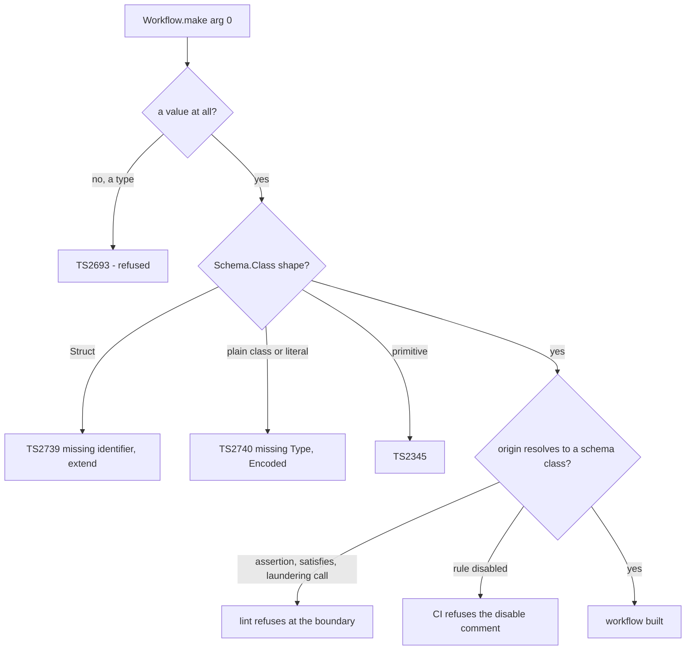

# Workflow Command Schema Enforcement - Plan

## Goal Capsule

- **Objective:** Make the command channel of `Workflow.make` unable to be anything but a real `Schema.Class` or `Schema.TaggedClass`, and state the guarantee by audience: the package ships a type refusal no declaration can satisfy, and the lint rule is the gate that closes the remainder in any tree that runs it.
- **Authority:** The implementing run owns the change across five packages, two lint plugins, and the Stryker mutant-ignorer, and ships it as a PR. Merging to `main` stays human (`REPO-P1`).
- **Stop conditions:** `Workflow.make` refuses every non-class command at the type layer; the boundary lint rule refuses every laundered or asserted command and cannot be silently disabled in-tree; every call site migrated; `pnpm check:local` exits 0; PR watched to green.
- **Execution profile:** Deep plan, nine units, two of them evaluator-only commits.
- **Tail ownership:** The run commits, pushes a branch, opens the PR, and watches the checks (REPO-D2).

---

## Product Contract

### Summary

`Workflow.make<C, D, E>` infers `C` from the decider's parameter and constrains it not at all, so a plain interface, a `Schema.Struct` type, or `number` is an accepted command today. Two designs were tried and rejected before this one, and the plan records both. Enforcement now keys on the command _value_: `make` takes the schema class itself, so the constraint lands where a declared type cannot reach. The accepted trade is explicit — every command becomes a schema-class declaration with its fields, and every call site carries two arguments, in exchange for a refusal a declaration cannot satisfy.

### Problem Frame

**A type-channel brand cannot do this job.** Any constraint on a type parameter inferred from a parameter position is a structural predicate. TypeScript cannot express "this type originated in a class declaration" — that is a library-invariant runtime property, and a brand carries the intent of such an invariant without carrying the invariant. The brand must be exported for an author to pass it to `S.Class<Self, Brand>`, and once exported, `interface Fake extends CommandBrand {}` satisfies it.

Measured, with `tsc` over the real `effect` in this workspace:

| probe case                                                | result                  |
| --------------------------------------------------------- | ----------------------- |
| brand check vs. a genuinely plain interface (control)     | `TS2345` — refused      |
| brand check vs. `interface Smuggled extends CommandBrand` | **no error — the hole** |

That first design also shipped its own bypass as a fixture: it specified rewriting the type test's command to `interface Cmd extends Workflow.CommandBrand`.

**The value channel has no such weakness, because a declared type produces no value.** Same compiler, against `Schema.Class<Self, S, Inherited>` in an argument position:

| probe case                                                | result                                                                  |
| --------------------------------------------------------- | ----------------------------------------------------------------------- |
| a `Schema.TaggedClass` value (`c.n`, `c._tag` both typed) | accepted                                                                |
| an untagged `Schema.Class` value                          | accepted                                                                |
| a `Schema.Struct` value                                   | `TS2739` — missing `identifier`, `extend`                               |
| an object literal shaped like a schema                    | `TS2740` — missing `"Type"`, `"Encoded"`, +22 more                      |
| a plain `class` with no schema surface                    | `TS2740` — missing `"Type"`, `"Encoded"`, +24 more                      |
| `42`                                                      | `TS2345`                                                                |
| a plain interface used as the argument                    | `TS2693` — _"only refers to a type, but is being used as a value here"_ |

Two facts from the vendored source make this exact and cheap. `Schema.TaggedClass` returns the same `Class` interface as `Schema.Class` (`repos/effect/packages/effect/src/Schema.ts:14373`, `14312`), so one constraint covers "Schema.Class or Schema.TaggedClass" with no union. And the author-supplied `Brand` type argument flows only into `Inherited`, reaching the instance via `new(...): S["Type"] & Inherited` (`:13985-13988`) — which is precisely why the first design landed somewhere forgeable.

Inference was probed for leakage, because a command channel that degrades to `unknown` would reopen the original hole:

| bypass attempt                                  | outcome                                         |
| ----------------------------------------------- | ----------------------------------------------- |
| a decider annotated `(c: unknown)`              | command stays the class's `Self`; no leak       |
| the same, wrapped in `NoInfer<Self>`            | identical, so `NoInfer` is **not** added        |
| a decider whose parameter is an unrelated shape | `TS2345` — the class argument is rejected       |
| a subclass of a command class                   | accepted, and it decides as the parent's `Self` |
| `Object.assign(class {}, RealCommand)`          | **passes the type layer**                       |

The command channel is therefore always the class's own `Self`, or the call is refused — measured across three inference shapes.

**What the type layer cannot close, and why no runtime check is added.** Two residues survive it: the explicit unsound assertion (`command as never`, `declare const c: CommandSchema`), and any expression that launders a real schema's statics onto another value (`Object.assign(class {}, RealCommand)`, and the same shape via `Proxy`, `Object.defineProperty` of the schema TypeId, or `Reflect.construct`). A construction-time runtime predicate in `make` was designed and then rejected: the settled carrier doctrine is that runtime enforcement is right when the constraint is on a value crossing a process boundary, and _strictly worse than a type or a lint rule when the constraint is on the shape of code the consumer writes_. A command argument at a call site is shape-of-code. A runtime throw there buys a check that fires only on the executed path, with a stack trace pointing at the library rather than the call site, and a constraint the consumer cannot recover by reading their own code — while the lint rule catches the same set at every read, before review.

So this plan ships two layers, and says plainly what each is worth. A library ships **presence**, not force: the type refusal travels with the package and no declaration satisfies it. **Force** is the consumer's toolchain — the boundary lint rule, and a CI check that refuses to let it be disabled. An adopter who installs the package but not the lint plugin gets the type refusal and nothing more, and an assertion past it is theirs to own. That is the honest boundary, and the Objective states it rather than claiming a closed world.

### Requirements

**Command enforcement**

- R1. `Workflow.make` accepts a command only as a `Schema.Class`/`Schema.TaggedClass` **value**; the command type is derived from that value, never inferred from the decider's parameter.
- R2. A plain interface cannot reach the command position at all — it has no value, so the diagnostic is `TS2693`.
- R3. A `Schema.Struct`, a plain `class`, an object literal, and a primitive are each refused at the command position.
- R4. Both `Schema.Class` (untagged) and `Schema.TaggedClass` are accepted, and the decider receives the author's own class instance type with every field and `_tag` readable.
- R5. The guarantee is documented by audience: the package ships the type refusal; the lint rule is the gate. No runtime enforcement is added for this constraint — it is shape-of-code, and the carrier doctrine assigns that to the type and the lint rule.
- R6. The boundary lint rule refuses exactly the command positions the type layer provably cannot decide — an `as`/`satisfies`/non-null assertion, a `declare`d binding, and a call whose callee resolves outside a schema class — and a CI check fails the build on any comment disabling that rule. It stays **silent** on a plain class, a `Schema.Struct`, or any other shape `Workflow.make` already refuses at construction: a second report there is the duplicate obligation `EW1` forbids, reporting a violation `make` should have refused.
- R7. Every existing `Workflow.make` call site and every rendered example migrates to the two-argument form (clean cutover; no arity-tolerant path survives the change).
- R8. Each migration preserves observable behavior — every existing property claim on the migrated workflows still holds.

**Gate integrity**

- R9. `workflow-match-exhaustive`, `make-body-purity`, and `no-domain-branching-density` keep firing on every migrated workflow, across all three independent boundary locators — the workflow plugin, the `meta/core` mirror, and the Stryker mutant-ignorer. A boundary locator that silently matches nothing is a worse outcome than the hole being closed, and the ignorer's failure mode is the quietest of the three: it drops decision bodies out of the mutation population while the score still reports green.
- R10. Every type claim added here is a tstyche assertion in `test-types/`, each observed failing once with its expect-error directive removed (`CELL-T2`).

### Scope Boundaries

- The raw boundary command `Cell.Phases['command']` is unchanged; only the workflow decide-command channel is constrained.
- The `Decision`/`Error` channel rules are unchanged — `Inhabited<D, E>` keeps its current definition and its markers.
- `Workflow<Command, Decision, Error>` keeps its current shape. Hand-annotating `Workflow<PlainIface, D, E>` stays writable as a _type_; no value can be obtained for it except through `make`. `WorkflowBrand` is exported and carries the same declarable-marker weakness the rejected command brand did, so an annotation-only "workflow" is reachable by assertion and by assertion only. **Deferred to follow-up.**
- A decider with a `this` parameter is **not supported**: the signature declares no `this` slot, so such a decider is refused by the type layer. An author who needs one wraps it in an arrow function.
- `make` does not expose the command schema on the returned workflow. Attaching it would let executors decode with the workflow's own codec, but it grows the published type; **deferred to follow-up**.

### Deferred to Follow-Up Work

- Closing the same declarable-marker weakness on `WorkflowBrand`.
- Exposing the command schema on the workflow value for edge decoding.

---

## Planning Contract

### Technical Design

The verified signature. `Self` is the author's class instance type, so the decider's parameter needs no annotation:

```ts
// effect-cell-types, src/Workflow.ts
export const make = <
  Self,
  S extends Schema.Constraint & { readonly fields: Schema.Struct.Fields },
  Inherited,
  D,
  E,
>(
  command: Schema.Class<Self, S, Inherited>,
  decide: (command: Self) => Result<D, E> & Inhabited<D, E>,
): Workflow<Self, D, E> => {/* brand as today; no runtime guard */}
```

The three parameters `Self`, `S`, `Inherited` mirror Effect's own `Class` bound exactly, and that is load-bearing: a _fixed_ spelling does not work. `Class<Self, S, Inherited>` places `S` in both covariant and contravariant positions (`S["Type"]`, `S["fields"]`), making it invariant in `S`, so `Schema.Class<unknown, Schema.Struct<Schema.Struct.Fields>, unknown>` rejects the real classes — measured, all three fixed variants rejected both a tagged and an untagged command class. Generic-over-`S` accepts them and still refuses `Struct`. `Schema.Class<any, any, any>` also works but `no-explicit-any` is an **error** in this repo.

The constraint alias stays **module-internal**. `make`'s signature carries the bound inline, no call site names it, and an exported alias would be internal wiring on the published surface (`REPO-A3`). The deferred schema-on-the-workflow follow-up is its natural first consumer and can export it then.

The whole signature — including the real `Inhabited<D, E>` intersection — was compiled end to end. A decider over a tagged decision and a tagged error resolved to `((command: Cmd) => Result<Decision, Err>) & WorkflowBrand`, so `Self`, `D` and `E` all infer correctly under the two-argument form. The three existing channel markers still fire: a `never` decision names `UninhabitedDecision`, a `never` error names `UninhabitedError`, an untagged error names `UntaggedError`. Under this repo's `exactOptionalPropertyTypes: true` these arrive as `TS2375`, so assertions pin the **marker name**, never an error code.

Authoring shape at a call site:

```ts
class DrawnCommand extends S.TaggedClass<DrawnCommand>()('DrawnCommand', { value: S.Int }) {}
export const drawnDecision = Workflow.make(DrawnCommand, (command) => /* command: DrawnCommand */)
```

Nothing for the author to import and extend: there is no marker to smuggle because there is no marker.

### Refusal flow



**KTD1. Enforcement keys on the command value, not the command type.** _(session-settled: user-directed — the user rejected the type-channel brand on the ground that a typeid can be smuggled into an interface, and required zero escape hatches.)_ Proven both ways by probe: an interface extending the exported brand passes the brand check; the same interface cannot reach an argument position at all. "Came from a class declaration" is a library-invariant runtime property, which a type-level marker can only gesture at.

**KTD2. Two layers, because a library ships presence and the consumer's toolchain is the gate.** The type layer refuses every non-assertion bypass, and it ships with the package. The lint layer refuses a command position whose origin is not a schema class, and a CI check refuses any comment that disables it — that pair is what converts presence into force, and it exists only in a tree that runs it. A construction-time runtime predicate was designed and rejected on carrier grounds: runtime enforcement belongs to values crossing a process boundary, not to the shape of code an author writes, where it costs the consumer on every call and points its stack trace at the library. Pricing against `CONST-E3`: one new lint rule and one CI check, no runtime branch. The mistake prevented is named and reproduced — a laundered constructor carrying a borrowed schema's statics, or an asserted non-schema, reaching a decider with a working program attached. The false-positive band is low because the rule reuses the plugin's existing `ImportOrigin` resolution rather than matching spellings.

**KTD3. The rule keys on resolved origin, never on node kind.** An earlier draft refused "any call expression at the command position". That is a label, not the property, and a rule keyed on a label never fires on the violation it exists to catch (`docs/solutions/architecture-patterns/label-routed-rules-are-unfalsifiable.md`). It is also self-defeating here: Effect's documented way to extend a command is `Base.extend('Sub')({ … })` (`repos/effect/packages/effect/src/Schema.ts:14036-14056`), which _is_ a call expression, so a node-kind rule refuses the idiomatic subclass while still admitting anything else that resolves to a class. The rule therefore resolves the callee's origin: a call whose head is a member of a schema-class declaration passes; a call whose head resolves elsewhere (`Object.assign`, a factory, a `Proxy` wrapper) is refused.

**KTD4. The decider moves to argument 1, so all three boundary locators move with it — and each fails differently.** Three independent implementations resolve the decider by slot index, and none of them shares code with the others. `MakeBoundary.ts:207` in the workflow plugin reads `node.arguments[0]`; the same file is mirrored byte-identically into `packages/lint/oxlint/plugins/meta/core/` because that plugin cannot depend on the workflow package (`ImportOrigin.ts:56-59`); and `MakeBoundaryIgnore.ts`'s `makeArgumentBodiesOf` in the Stryker mutant-ignorer reads `arguments[0]` through its own ancestor-walking resolver. Left alone, and each measured this session: `make-body-purity` reports `unresolvableMakeArgument` on every migrated call — a false positive, not silence; `workflow-match-exhaustive` finds no containing boundary and **goes dark**, observed as `Should have 1 error but had 0`; `no-domain-branching-density` loses the exemption it derives from the mirror and **reports every decider**, observed by reverting the mirror alone; and the ignorer drops any decider reached by name out of the mutation population, observed as `mutant is outside every Workflow.make`. That last one is the quietest failure in the set — mutation coverage silently narrows while the score still reports green. Every locator therefore finds the decider by **shape**, searching argument slots for the first that resolves to a function, in one commit, before the signature changes, tolerant of both arities so the tree is green on both sides, and tightened only after every call site has migrated (U9). The `bind`/`call`/`apply` shift becomes the search's start index rather than a fixed slot.

**KTD5. Delegate "is a Schema class" to Effect's own `Class` interface rather than hand-rolling a discriminator.** A structural spelling (`ConstraintCodec<unknown>` plus `identifier` and `fields`) was measured working and equally refusing, but it re-states a definition Effect owns and would drift when Effect's class surface changes. The faithful spelling also yields the better diagnostic — the `Struct` rejection names the missing `identifier` and `extend`.

**KTD6. Survivors capabilities leave the command; `priorReport` is decoded at the edge and a parse failure is fatal.** `hashContent` and `resolveAbsolutePath` can never be schema fields, so they move out and their results are precomputed in decode. `priorReport` is a report file from a previous run — foreign data — so it is decoded through a codec at the decode phase. Whether a malformed report is classified by the decider or short-circuits the run is not a choice this plan makes: `Cell.ts:41` documents `DecodePhase` as _"Validation. Its `Left` is fatal: it reaches the derived error channel and no write runs"_, and `Cell.ts:323-325` states that a decode `Failure` _"has no downstream consumer — nothing accepts `decodeError`"_. There is no channel through which a parse failure could reach the decider, so it short-circuits, and `decodeError` is widened from `never` so the `Left` can exist at all.

### Assumptions and Sequencing

- The two evaluator units (U1, U9) are separate commits from the work they judge, each observed failing before and passing after (`CONST-E4`).
- Command classes must respect `schema-declaration-location`: a module-scope schema declaration is legal only in `*.schema.ts` or the owning single-segment `<stem>.workflow.ts`. Every command class here lives in its owning `*.workflow.ts` except `DecideInput` (already in `RestartDecision.schema.ts`) and the type-test fixture, which must live in `tests/__fixtures__/` — a `.tst.ts` may not declare one.
- Changing `make`'s signature changes the published surface, so `api:check` fails until the report is regenerated with `api:update`.
- Order: U1 → U2 → (U3 → U5) and (U4, U6, U7, U8 in any order) → U9.

---

## Implementation Units

### U1. Boundary locator finds the decider by shape, in all three locators

- **Goal:** Make every boundary locator find the decider as the function-valued argument, tolerant of one or two arguments, so no gate goes dark, goes loud, or silently narrows the mutation population when the signature changes.
- **Requirements:** R9.
- **Dependencies:** none.
- **Files:**
  - `packages/lint/oxlint/plugins/cells/effect-workflow/src/rules/MakeBoundary.ts`
  - `packages/lint/oxlint/plugins/meta/core/src/rules/MakeBoundary.ts` (byte-identical mirror — must move in lock-step)
  - `packages/testing/mutation/plugins/stryker-plugins/src/workflow-make-ignorer/MakeBoundaryIgnore.ts` (a third, independent ancestor-walking locator; `makeArgumentBodiesOf` hard-codes `arguments[0]`)
  - `packages/testing/mutation/plugins/stryker-plugins/tests/__fixtures__/WorkflowMakeAst.fixtures.ts`
  - `packages/testing/mutation/plugins/stryker-plugins/tests/workflow-make-ignorer/workflow-make-boundary.integration.test.ts`
  - `packages/lint/oxlint/plugins/cells/effect-workflow/src/rules/__tests__/make-boundary-kernel-drift.test.ts`
  - `packages/lint/oxlint/plugins/cells/effect-workflow/src/rules/__tests__/make-body-purity.test.ts`
  - `packages/lint/oxlint/plugins/cells/effect-workflow/src/rules/__tests__/workflow-match-exhaustive.test.ts`
  - the `meta/core` plugin's `no-domain-branching-density` test file
- **Approach:**
  1. Replace the single-slot resolution at `MakeBoundary.ts:207` with a loop over `node.arguments`, applying the existing `isArrowFunction || isFunctionLike || (isIdentifier && followIdentifier(...))` chain per slot and breaking on the first non-null result. A one-line index swap is not sufficient: for `make(Cmd, decide)` slot 0 is an identifier, so `followIdentifier` runs, resolves to a class, and returns null — the loop must continue past that rather than stop.
  2. Keep the `bind`/`call`/`apply` member-shift adjustments at lines 207-212 intact, and keep `resolvedBody: null` semantics when no slot resolves.
  3. Apply the identical change to the `meta/core` mirror in the same commit. The mirror is byte-identical by contract; a drift means the two plugins disagree about what is inside a decision body.
  4. Add two-argument fixtures beside the existing one-argument fixtures in each affected rule's tests.
- **Execution note:** Evaluator change. Land it alone, and observe each new fixture failing before the locator change and passing after.
- **Test scenarios:**
  - A one-argument `Workflow.make((c) => …)` body is still scanned — every existing fixture keeps its verdict.
  - A two-argument `Workflow.make(Cmd, (c) => …)` body is scanned, and an I/O import inside it still reports `make-body-purity`.
  - A two-argument call whose dispatch uses `Match.orElse` over a closed tag chain still reports `workflow-match-exhaustive` — proving the boundary was found, not skipped.
  - A two-argument call where slot 0 resolves to a **class declaration** and slot 1 to the decider: slot 0 must not be taken as the body.
  - A two-argument call whose second argument is a module-scope function reference resolves that function's body.
  - `Workflow.make(RealCommand)` with no decider yields `UNRESOLVABLE_MAKE_ARGUMENT` rather than a silent skip — this bounds the tolerant window, where a schema-only call could otherwise turn both body gates off.
  - In `meta/core`, a two-argument decision body is still **exempt** from `no-domain-branching-density` — proving the mirror moved too.
- **Verification:** the workflow plugin's `test` and the `meta/core` plugin's `test` both pass; each added fixture observed red before the change.

### U2. Value-keyed command constraint in `effect-cell-types`

- **Goal:** Change `make` to take the command schema class as its first argument, derive the command type from it, and pin every refusal as a type assertion.
- **Requirements:** R1, R2, R3, R4, R5, R10.
- **Dependencies:** U1.
- **Files:**
  - `packages/core/effect/cell/types/src/Workflow.ts`
  - `packages/core/effect/cell/types/test-types/Workflow.tst.ts`
  - `packages/core/effect/cell/types/tests/__fixtures__/Command.schema.ts` (new — a `.tst.ts` cannot declare a schema)
  - `packages/core/effect/cell/types/README.md` — three rendered one-argument `make` examples (lines 94, 171, 194) plus the prose that states the one-argument contract: the channel-inference sentence at 116-119 and the diagnostic-table row at 134, whose expected message quotes a bare `(command: Cmd) => Result<Dec, Err>`
  - the package's api-extractor report (regenerated, never hand-edited)
- **Approach:**
  1. Add the constraint bound to `make`'s signature per the Technical Design. Keep the alias module-internal (`REPO-A3`); do not export it.
  2. Change `make` to `(command, decide)`, returning `Workflow<Self, D, E>`. `Inhabited<D, E>` stays intersected on the decider's return exactly as today; the command channel is no longer tested through the return type, so no `InhabitedCommand`/`UntaggedCommand` marker is introduced.
  3. Add **no** runtime guard (R5, KTD2). `make`'s body keeps its current behaviour.
  4. Update `assertWorkflow` to the two-argument shape.
  5. Migrate the README in this unit — the three examples _and_ the prose that describes channel inference from the decider's parameter, since the command channel no longer comes from there. The diagnostic-table row at 134 keeps its meaning (a bare lambda still fails `DecidePhase`) but its quoted message changes with the signature.
  6. Regenerate the api report with `api:update`.
- **Test scenarios (all in `test-types/Workflow.tst.ts`, each observed red with its directive removed per CELL-T2):**
  - A `Schema.TaggedClass` command is accepted and the decider's parameter exposes its fields and `_tag`.
  - An untagged `Schema.Class` command is accepted.
  - A plain interface at the command position is refused — pins the type-used-as-value diagnostic.
  - A `Schema.Struct` is refused. An object literal is refused. A primitive is refused. A plain `class` with no schema surface is refused.
  - A decider whose parameter is an unrelated shape is refused, and the diagnostic names the class argument.
  - A decider that widens its parameter to `unknown` still yields a workflow whose command channel is the class — asserted on the resulting type.
  - The existing `Inhabited`/`UninhabitedDecision`/`UninhabitedError`/`UntaggedError` claims still hold against a real command class. Pin each on the **marker interface name**, never on a TypeScript error number.
- **Verification:** `typecheck`, `test:types`, `test`, `lint`, `api:check`, and `attw` all pass for `@systemfsoftware/effect-cell-types`.

### U3. Canonical decide and the canonical phase bag

- **Goal:** Give `canonicalDecide` a real command class and narrow `Cell.canonical` so the canonical description still builds.
- **Requirements:** R4, R7, R8.
- **Dependencies:** U2.
- **Files:**
  - `packages/core/effect/cell/types/src/CanonicalDecide.workflow.ts`
  - `packages/core/effect/cell/types/src/Cell.ts`
- **Approach:**
  1. Add `import * as S from 'effect/Schema'` — the file currently imports only `effect/Result` and `./Workflow.js` — then declare `CanonicalCommand extends S.TaggedClass<CanonicalCommand>()('CanonicalCommand', {})`, legal there because the file is the owning single-segment `*.workflow.ts`. Retype `canonicalDecide` and pass the class to `make`.
  2. Narrow the canonical bag: `interface CanonicalPhases extends Phases { readonly decoded: CanonicalCommand }`, threaded through `canonical` and each phase constructor call. The current `<Phases>` instantiation types `decoded` as `unknown`, which contradicts the class parameter contravariantly.
  3. Per `CELL-T3`, confirm `vocabulary` stays a fold of `canonical` — no hand-written phase table, no duplicated axis.
- **Test scenarios:**
  - `CanonicalDecide.workflow.property.test.ts` stays green.
  - `tests/interpreter.integration.test.ts` still runs a description end to end, and its hand-written phase list (the independent oracle, `CELL-T4`) is unchanged.
  - `Cell.tst.ts` order and sentence-brand claims stay green.
- **Verification:** `typecheck`, `test:types`, and `test` pass for `@systemfsoftware/effect-cell-types`.

### U4. Restart decision in `daemon-spec`

- **Goal:** Convert the `Schema.Struct` `DecideInput` into a `Schema.Class` command and pass it to `make`.
- **Requirements:** R4, R7, R8.
- **Dependencies:** U2.
- **Files:**
  - `packages/core/effect/daemon-spec/src/internal/RestartDecision.schema.ts`
  - `packages/core/effect/daemon-spec/src/internal/RestartDecision.workflow.ts`
- **Approach:**
  1. Express `DecideInput` as `export class DecideInput extends Schema.Class<DecideInput>('DecideInput')(<the existing checked struct>) {}`, preserving every field schema and the `failedIndexAddressesAChild` filter verbatim. Legal in a `*.schema.ts`.
  2. Remove the old `export type DecideInput`; the class type replaces it.
  3. Pass `DecideInput` as `make`'s first argument; the decider body is unchanged.
  4. The schema's `import.meta.vitest` block keeps working — a `Schema.Class` is a `Schema`.
- **Test scenarios:**
  - The width-cap, negative-index, and bound-message refutations stay green — the schema's forcing behavior is unchanged.
  - `RestartDecision.workflow.property.test.ts` restart-strategy claims stay green.
  - A decoded `DecideInput` instance is accepted where a bare object literal previously was.
- **Verification:** `typecheck` and `test` pass for `@systemfsoftware/effect-daemon-spec`.

### U5. Drawn decision in `cell-gen`

- **Goal:** Replace the `number` command with a real command class and thread it through the generator's bag.
- **Requirements:** R4, R7, R8.
- **Dependencies:** U2, U3.
- **Files:**
  - `packages/core/effect/cell/gen/src/DrawnDecision.workflow.ts`
  - `packages/core/effect/cell/gen/src/Gen.ts`
  - `packages/core/effect/cell/gen/src/__tests__/DrawnDecision.workflow.property.test.ts`
- **Approach:**
  1. Declare `DrawnCommand extends S.TaggedClass<DrawnCommand>()('DrawnCommand', { value: S.Int })` in the owning workflow file; retype the decider to read `command.value` and pass the class to `make`.
  2. In `Gen.ts`, change `Bag`'s `command`, `raw`, and `decoded` from `number` to `DrawnCommand`, leaving `decision`/`output`/`response`/`decodeError` as they are. Declare `Bag` as `Cell.Phases & { decoded: DrawnCommand, … }` rather than extending `CanonicalPhases` — that extension only works when the bag's `decoded` equals the canonical's, and `DrawnCommand` and `CanonicalCommand` are distinct classes, so `number` is not a supertype of either.
  3. Replace the generated-command arbitrary with `Schema.toArbitrary(DrawnCommand)`, and make the identity decode return the instance.
  4. Update the property test to construct `DrawnCommand.make({ value: 0 })`.
- **Test scenarios:**
  - The trace-and-route claim still holds: an injected failure routes to `DrawnDecisionError` with `code = injection.error`; otherwise success carries `command.value`.
  - `Gen.ts`'s phase-order and response claims pass.
  - The generated arbitrary produces decodable `DrawnCommand` instances.
  - The `{ ...Cell.canonical, layers: … }` spread still assigns to `WriteDone<Bag>` after U3's narrowing.
- **Verification:** `typecheck` and `test` pass for `@systemfsoftware/effect-cell-gen`.

### U6. Hook verdict submission in `omp-claude-compat`

- **Goal:** Replace the plain `SubmitVerdictDecoded` interface with a command class.
- **Requirements:** R4, R7, R8.
- **Dependencies:** U2.
- **Files:**
  - `omp/plugins/omp-claude-compat/src/HookVerdict.workflow.ts`
- **Approach:**
  1. Replace the interface with `class SubmitVerdictCommand extends S.TaggedClass<SubmitVerdictCommand>()('SubmitVerdictCommand', { cmd: InterpretHookCommand, code: S.Int, stdout: S.String })`. `InterpretHookCommand` is already a `S.TaggedClass`, so it is usable as a field schema.
  2. Pass the class to `make`; the destructured decider body still works on instances.
  3. Delete `SubmitVerdictDecoded` and migrate its references.
- **Test scenarios:**
  - The ExitBlock / DecisionJson / Other routing claims stay green.
  - `git grep -n "SubmitVerdictDecoded" -- omp/plugins/omp-claude-compat` prints nothing.
- **Verification:** `typecheck` and `test` pass for `@systemfsoftware/omp-claude-compat`.

### U7. Survivors admission in `stryker-js-cli`

- **Goal:** Move the function capabilities out of the command, decode the prior report at the edge, and model the command as a schema class.
- **Requirements:** R4, R7, R8.
- **Dependencies:** U2.
- **Files:**
  - `packages/testing/mutation/stryker-js/cli/src/Survivors.workflow.ts`
  - `packages/testing/mutation/stryker-js/cli/src/StrykerCliExecutor.ts`
  - `packages/testing/mutation/stryker-js/cli/src/__tests__/Survivors.workflow.property.test.ts`
- **Approach:**
  1. Drop `hashContent` and `resolveAbsolutePath` from the command. The leaf helpers already accept them explicitly, so rework `hashesMatch` and `admissionVerdict` to take them as parameters instead of reading them off the input.
  2. Declare the command as a `Schema.Class` in the owning workflow file, carrying pure data only.
  3. **Carry the decoded `priorReport` on the command _and_ the precomputed fields.** The decide path reads `priorReport.config` (`hashesMatch`, `wasProducedBySurvivorsRun`), `priorReport.framework?.version` (`hashesMatch`), and `priorReport.files` (`extractSurvivors`) — precomputing only the source hashes and the resolved survivors would strand the mismatch and provenance checks. Precompute `priorSourceHashes` and `priorSurvivors` in the decode phase of `StrykerCliExecutor.ts`, which already binds both capabilities at module scope, and keep the decoded report beside them. Update the `decoded` member of `AdmissionPhases` to the command class.
  4. Model `priorReport` as the fields the decide reads, decoded through a codec at the decode phase. **Widen `AdmissionPhases['decodeError']` from `never` to the parse-failure type and let the decode `Left` short-circuit the run** — the decode phase's `Left` is fatal by construction, reaching the derived error channel with no write, which is parse-failure semantics named in the type. A malformed report therefore never reaches the decider, and no cast of the third-party report type appears at the `admissionVerdict` call.
  5. Update the property-test builders to construct the command class with the precomputed fields.
- **Execution note:** This is the only unit that changes data flow. Keep the pure helpers untouched and let the existing property suite hold parity.
- **Test scenarios:**
  - Every rejection reason (`no-report`, prior-report-produced-by-survivors, `mismatch`) and the admit-with-survivors case stay green.
  - The cross-realm brand claim on the admission error stays green.
  - A command whose prior report came through decode is admitted exactly when the precomputed hashes match.
  - A malformed prior report produces a decode `Left` that short-circuits the run, and the decider is never entered.
- **Verification:** `typecheck` and `test` pass for `@systemfsoftware/stryker-js-cli`; `git grep -n "AdmitSurvivorsRunInput" -- packages/testing/mutation/stryker-js/cli` prints nothing.

### U8. Interpreter fixtures

- **Goal:** Migrate the two interpreter fixtures so every `Workflow.make` in the tree is compliant.
- **Requirements:** R7, R8.
- **Dependencies:** U2.
- **Files:**
  - `packages/core/effect/cell/types/tests/__fixtures__/InterpreterDecide.workflow.ts`
  - `packages/core/effect/cell/types/tests/__fixtures__/InterpreterTracedDecide.workflow.ts`
- **Approach:**
  1. Replace the fixture's `interface Decoded` with a command class declared in the fixture workflow file, keeping the dispatch body intact.
  2. Give `InterpreterTracedDecide` a command class as well — its decider is currently zero-argument, which the new signature cannot express.
  3. Leave the `Refused` error manifold as the hand-written tagged fixture; `Tagged` already governs it.
- **Test scenarios:**
  - `tests/interpreter.integration.test.ts` still applies a description over admitted, denied, and malformed commands.
  - The traced fixture still records the phases it ran.
- **Verification:** `test` and `test:types` pass for `@systemfsoftware/effect-cell-types`.

### U9. Origin-keyed command rule, and a gate that cannot be silently disabled

- **Goal:** Refuse the command positions `Workflow.make` provably cannot refuse — assertions and laundering calls — and make the rule's own suppression a build failure. Everything the type layer already decides stays this rule's non-goal (`EW1`).
- **Requirements:** R6, R7, R9.
- **Dependencies:** U2 through U8 (every call site migrated).
- **Files:**
  - `packages/lint/oxlint/plugins/cells/effect-workflow/src/rules/MakeBoundary.ts` and its `meta/core` mirror
  - `packages/lint/oxlint/plugins/cells/effect-workflow/src/rules/make-command-schema.ts` (new)
  - `packages/lint/oxlint/plugins/cells/effect-workflow/src/rules/make-command-schema.config.ts` (new)
  - `packages/lint/oxlint/plugins/cells/effect-workflow/src/rules/__tests__/make-command-schema.test.ts` (new)
  - `packages/lint/oxlint/plugins/cells/effect-workflow/src/index.ts`
  - a root guard under `scripts/guards/` wired into the check chain
- **Approach:**
  1. Drop the one-argument tolerance from every locator now that no single-argument call remains.
  2. Add `make-command-schema`, keyed on **resolved origin, never node kind** (KTD3), and scoped by `EW1` to the positions the type layer cannot decide. Refuse a `TSAsExpression`, a `TSSatisfiesExpression`, a non-null assertion, a `declare`d binding, and a call whose callee resolves outside a schema class (`Object.assign`, a factory, a `Proxy` or `Reflect.construct` wrapper). Accept a call whose callee is a member of a schema-class declaration (`Base.extend('Sub')({ … })`). Stay silent on a plain class, an object literal, a `Struct`, or a primitive — `make` already refuses those at construction, and duplicating that report is what `EW1` forbids.
  3. Register the rule at `error` in the recommended set. The message uses the four-placeholder form `OX-EF1` mandates, and its `fix` reaches deletion as an outcome per `OX-EF2` — an asserted command position is removed, not relocated.
  4. Add the CI guard: fail the build on any suppression comment naming this rule id. Without it the rule is presence, not force — a single disable comment reopens the only layer that closes a laundered command while `check:local` still exits 0.
- **Execution note:** Evaluator change — its own commit, with each fixture observed failing before the rule exists.
- **Test scenarios:**
  - `Workflow.make(Cmd, decide)` passes. An aliased, namespace-imported, or re-exported command class passes.
  - `class Sub extends Cmd {}` passes. `class Fake {}` at the command position **stays silent** — `make` refuses it at construction with `TS2740`, and a second report is the duplicate `EW1` forbids. Same for an object literal, a `Schema.Struct`, and a primitive.
  - `Base.extend('Sub')({ extra: S.Int })` **passes** — the idiomatic Effect subclass, whose callee is a member of a schema class.
  - `Object.assign(class {}, Cmd)` is refused — a call whose callee resolves to the global, not to a schema class. Same for a factory call, a `Proxy` wrapper, and `Reflect.construct`.
  - `Cmd as never`, `{} as CommandSchema`, `plainObject satisfies …`, `Cmd!`, and a `declare`d binding at the command position are each refused — these are exactly the positions the type checker accepts by construction.
  - Near-miss valid cases per `OX-CI1`: `Other.TaggedClass(...)` and `S.Struct({...})` at the command position do not fire this rule, proving it keys on resolved origin rather than on the spelling of a member name.
  - A one-argument `Workflow.make(decide)` reports.
  - A `make` reached through an unrelated binding of the same name is ignored (no false positive on a shadowed local).
  - A file suppressing `make-command-schema` fails the root guard.
- **Verification:** the workflow plugin's `test` and the new guard's own check both pass, each new fixture observed red before the rule landed.

---

## Verification Contract

Commands run from the repo root. The mutation gate is not run by an agent (`REPO-D3`), and `effect-cell-types` has no mutation gate at all (`CELL-T1`).

| Package                                            | Commands                                                                            |
| -------------------------------------------------- | ----------------------------------------------------------------------------------- |
| `@systemfsoftware/effect-cell-types`               | `typecheck`, `test:types`, `test`, `lint`, `api:check`, `attw` — the full leaf list |
| the `effect-workflow` and `meta/core` lint plugins | `test`                                                                              |
| `@systemfsoftware/effect-cell-gen`                 | `typecheck`, `test`                                                                 |
| `@systemfsoftware/effect-daemon-spec`              | `typecheck`, `test`                                                                 |
| `@systemfsoftware/stryker-js-cli`                  | `typecheck`, `test`                                                                 |
| `@systemfsoftware/omp-claude-compat`               | `typecheck`, `test`                                                                 |

Completion proof, in order:

1. The plain-interface assertion in `Workflow.tst.ts` pins the type-used-as-value diagnostic, observed failing with its directive removed (`CELL-T2`).
2. The `Schema.Struct`, plain-`class`, object-literal, and primitive assertions are each observed the same way.
3. Every `make-command-schema` fixture is observed red before U9's rule exists — including `Base.extend(...)` passing and `Object.assign(...)` failing, the pair that proves the rule keys on origin and not on node kind.
4. The suppression-comment fixture fails the root guard.
5. **Negative control for R9:** with U1's locator change reverted, the two-argument `workflow-match-exhaustive` fixture must fail _and_ the `meta/core` complexity exemption must break. If either still passes, that boundary went dark and the gate is unearned.

Repo-wide: `pnpm check:local` exits 0 after the last edit.

Clean cutover: `git grep` finds no `SubmitVerdictDecoded`, no `AdmitSurvivorsRunInput`, no `export type DecideInput`, no one-argument `Workflow.make` in any source or README, and no `CommandBrand`/`InhabitedCommand`/`UntaggedCommand` anywhere.

---

## Dependencies and Risks

- **Risk: a gate going dark, or going loud, instead of failing correctly.** The reason U1 covers both plugins and precedes U2, and U9 follows the migrations. Mitigated by the two-sided negative control above, the only check that distinguishes "passes" from "never ran".
- **Risk: the Survivors restructure changes data flow.** The one unit that does. Mitigated by leaving the pure helpers untouched and holding parity with the existing property suite.
- **Risk: the api-extractor report churns.** Expected — `make`'s signature is published surface. Regenerate with `api:update`; never hand-edit the report, and never hand-edit `package.json#exports` (`REPO-S4`).
- **Risk: the lint layer does not reach an adopter.** Named in the Objective rather than mitigated. An adopter who installs the package without the plugin holds the type refusal only.
- **Dependency: none external.** No new package, so no `REPO-W8` record is owed.

---

## Assumptions & Contingency

- The residual bypasses — an explicit unsound assertion, and any expression laundering a real schema's statics — are closed by the lint rule and its CI guard, not by the type and not at runtime. No type-only design refuses `as never`, and a runtime check is the wrong carrier for a shape-of-code constraint.
- A decider may widen its own parameter to a supertype (`unknown`, `{}`) and still attach to a real command class. Ordinary contravariance, not a smuggle: the published command channel remains the class.
- A subclass of a command class decides as its parent's `Self`, because the schema statics are inherited. Accepted deliberately.
- A `this`-typed decider is unsupported; the signature declares no `this` slot.
- `NoInfer` was measured unnecessary — the command type anchors to the class argument — and is left out rather than added on suspicion.
- If Effect's `Class` bound changes shape, the constraint follows it rather than re-stating it (KTD5). The `Base.extend` acceptance in U9 depends on `extend` remaining a member of that interface.

---

## Definition of Done

- **Global DoD:** Every requirement R1–R10 exercised; `pnpm check:local` exits 0 after the last edit; the PR watched to green with `gh pr checks --watch --fail-fast` (`REPO-D1`, `REPO-D2`). Tree left restartable. Merge stays human (`REPO-P1`).
- **Evaluator DoD:** U1 and U9 each ship as their own commit, with the observed-red-before evidence recorded in the commit body (`CONST-E4`).
- **Changeset:** `effect-cell-types` is publishable and `make`'s signature is a break, so ship a `.changeset/` intent via `pnpm change --bump major`. The body must carry the migration recipe an adopter performs — declare a schema class for the command, pass it as the first argument, move the decider to the second — written for someone who installed the package from a registry and has never seen this repository (`REPO-R2`, `REPO-R3`).
- **Cleanup criterion:** the rejected mechanisms leave no trace — no `CommandBrand`, no `InhabitedCommand`, no `UntaggedCommand`, no runtime guard in `make`, no arity-tolerant locator path, no shim for the one-argument `make`. `WorkflowBrand` remains exported and is itself declarable-marker-weak; closing it is the named follow-up and is not addressed here.
- **Per-unit DoD:** the unit's checks pass per the Verification Contract before the next unit starts.
